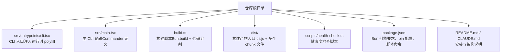
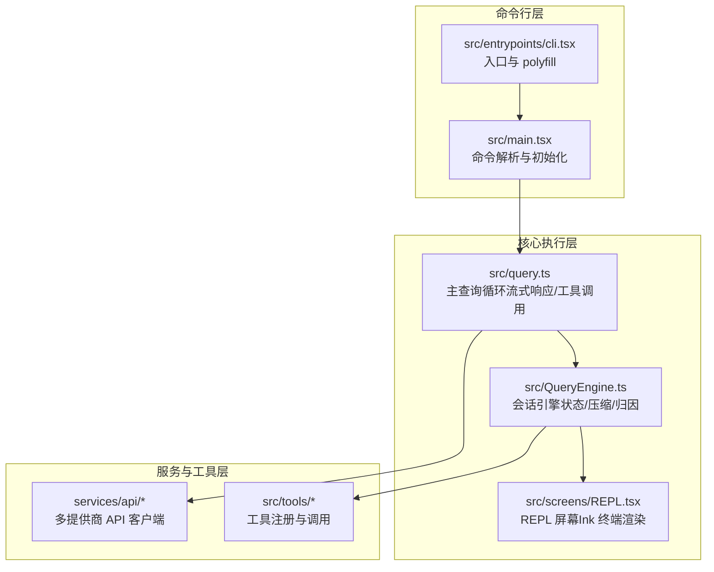
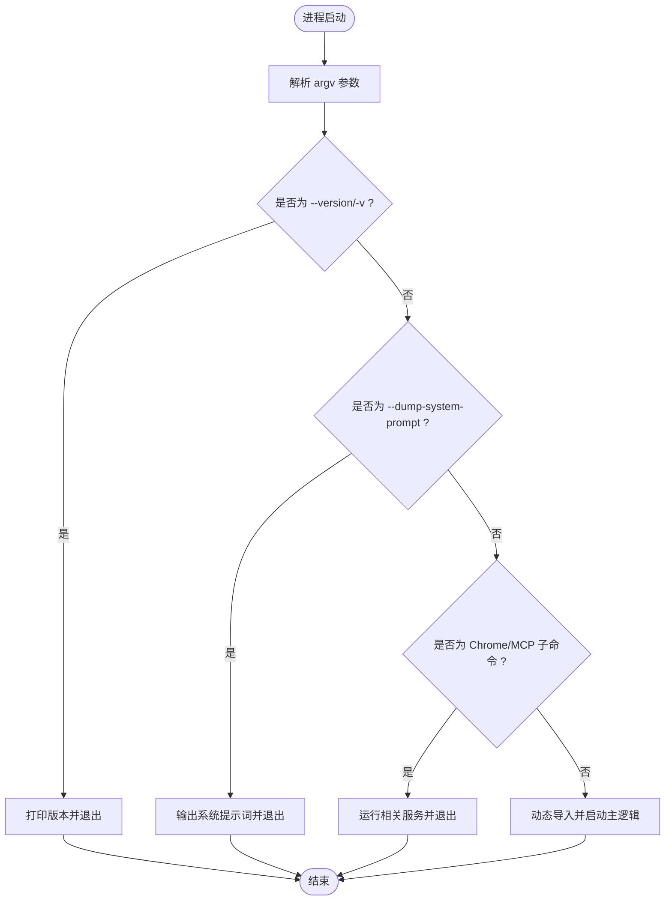
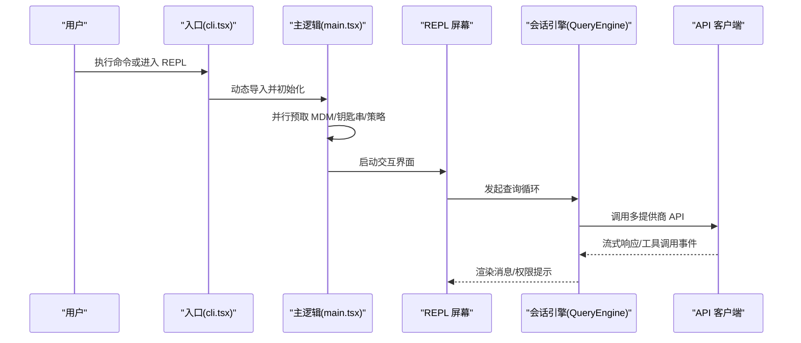
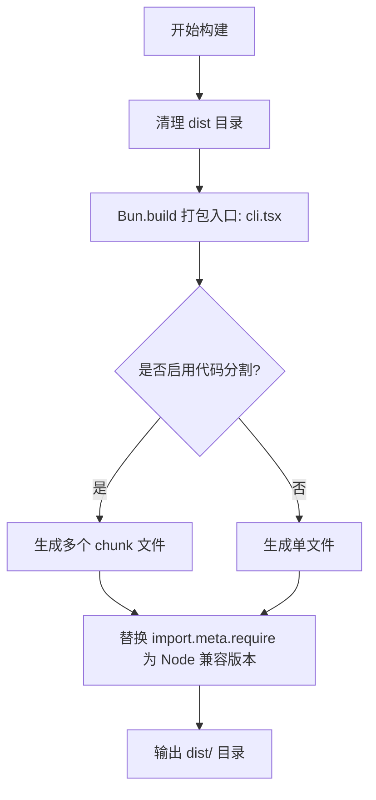
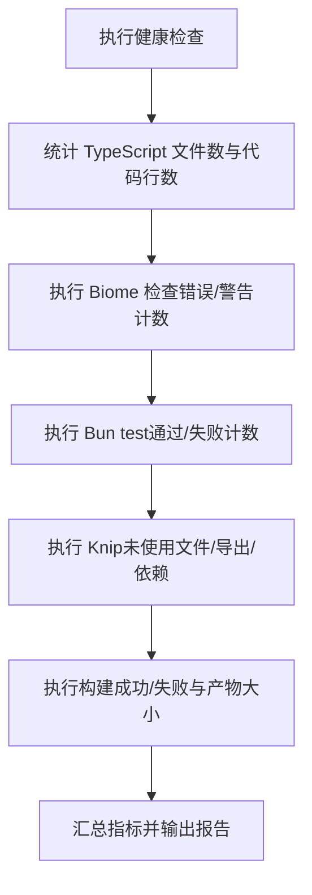
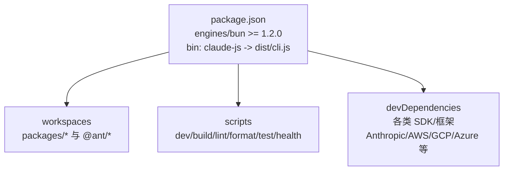

# 快速开始

<cite>
**本文引用的文件**
- [package.json](file://package.json)
- [README.md](file://README.md)
- [CLAUDE.md](file://CLAUDE.md)
- [src/entrypoints/cli.tsx](file://src/entrypoints/cli.tsx)
- [src/main.tsx](file://src/main.tsx)
- [build.ts](file://build.ts)
- [scripts/health-check.ts](file://scripts/health-check.ts)
- [src/commands/init.ts](file://src/commands/init.ts)
</cite>

## 目录
1. [简介](#简介)
2. [项目结构](#项目结构)
3. [核心组件](#核心组件)
4. [架构总览](#架构总览)
5. [详细组件分析](#详细组件分析)
6. [依赖关系分析](#依赖关系分析)
7. [性能注意事项](#性能注意事项)
8. [故障排除指南](#故障排除指南)
9. [结论](#结论)
10. [附录](#附录)

## 简介
本指南面向首次接触 Claude Code 的用户，帮助你在本地快速完成安装、配置与基础验证，涵盖系统要求、依赖安装、环境准备、基本使用示例以及常见问题排查。文档内容基于仓库内的安装说明、构建脚本与健康检查脚本整理而成，确保初学者也能顺利完成起步。

## 项目结构
该仓库采用 Bun 工作区组织，核心入口为 CLI 入口文件，构建产物输出至 dist 目录，同时提供健康检查脚本用于评估项目整体状态。

**图示来源**
- [src/entrypoints/cli.tsx:1-200](file://src/entrypoints/cli.tsx#L1-L200)
- [src/main.tsx:1-200](file://src/main.tsx#L1-L200)
- [build.ts:1-48](file://build.ts#L1-L48)
- [scripts/health-check.ts:1-164](file://scripts/health-check.ts#L1-L164)
- [package.json:1-166](file://package.json#L1-L166)
- [README.md:30-60](file://README.md#L30-L60)
- [CLAUDE.md:28-56](file://CLAUDE.md#L28-L56)

**章节来源**
- [README.md:30-60](file://README.md#L30-L60)
- [CLAUDE.md:28-56](file://CLAUDE.md#L28-L56)
- [build.ts:1-48](file://build.ts#L1-L48)

## 核心组件
- CLI 入口与运行时 polyfill：在入口文件顶部注入 feature() 与全局宏常量，保证在开发与构建阶段的行为一致性。
- 主 CLI 逻辑：通过 Commander 定义命令与参数，初始化认证、策略与 UI，并根据模式（REPL/管道/子命令）启动相应流程。
- 构建系统：使用 Bun.build 进行打包与代码分割，输出到 dist 目录；随后进行 Node.js 兼容性补丁处理。
- 健康检查：汇总代码规模、Lint、测试、冗余代码与构建状态，输出健康度报告。

**章节来源**
- [src/entrypoints/cli.tsx:1-200](file://src/entrypoints/cli.tsx#L1-L200)
- [src/main.tsx:1-200](file://src/main.tsx#L1-L200)
- [build.ts:1-48](file://build.ts#L1-L48)
- [scripts/health-check.ts:1-164](file://scripts/health-check.ts#L1-L164)

## 架构总览
下图展示了从命令行到核心执行链路的关键节点，包括入口、主逻辑、查询循环与 UI 层。

**图示来源**
- [src/entrypoints/cli.tsx:1-200](file://src/entrypoints/cli.tsx#L1-L200)
- [src/main.tsx:1-200](file://src/main.tsx#L1-L200)
- [CLAUDE.md:46-75](file://CLAUDE.md#L46-L75)

## 详细组件分析

### CLI 入口与运行时 polyfill
- 入口文件注入 feature() 常量与全局宏（VERSION、BUILD_TIME 等），用于在开发阶段模拟构建时行为。
- 提供多个“快速路径”分支，如 --version、--dump-system-prompt、Chrome/MCP 相关子命令等，减少模块加载开销。
- 通过动态导入按需加载后续模块，提升启动速度。

**图示来源**
- [src/entrypoints/cli.tsx:60-120](file://src/entrypoints/cli.tsx#L60-L120)

**章节来源**
- [src/entrypoints/cli.tsx:1-200](file://src/entrypoints/cli.tsx#L1-L200)

### 主 CLI 逻辑与命令解析
- 初始化阶段：并行预取 MDM 与钥匙串数据，加载策略限制、远程托管设置、增长实验配置等。
- 命令定义：通过 Commander 注册子命令与选项，支持认证、插件、MCP、医生检查、升级等。
- 会话与 UI：根据模式启动 REPL 或管道模式，初始化状态与 UI 渲染。

**图示来源**
- [src/main.tsx:1-200](file://src/main.tsx#L1-L200)
- [CLAUDE.md:46-75](file://CLAUDE.md#L46-L75)

**章节来源**
- [src/main.tsx:1-200](file://src/main.tsx#L1-L200)

### 构建系统与产物
- 构建流程：清理 dist、Bun.build 打包、代码分割、Node.js 兼容性补丁（替换 import.meta.require）。
- 产物特征：入口文件 dist/cli.js 与约数百个 chunk 文件，支持 Bun 与 Node 运行。

**图示来源**
- [build.ts:1-48](file://build.ts#L1-L48)

**章节来源**
- [build.ts:1-48](file://build.ts#L1-L48)

### 健康检查脚本
- 指标覆盖：代码规模（文件数/行数）、Lint 错误/警告、测试通过/失败、未使用文件/导出/依赖、构建状态与产物大小。
- 报告输出：以表格形式汇总各项指标，并给出总体结论（全部通过/有错误/有警告）。

**图示来源**
- [scripts/health-check.ts:1-164](file://scripts/health-check.ts#L1-L164)

**章节来源**
- [scripts/health-check.ts:1-164](file://scripts/health-check.ts#L1-L164)

## 依赖关系分析
- 运行时与构建：必须使用 Bun（版本要求见 engines 字段），构建采用 Bun.build，产物兼容 Node.js。
- 工作区：monorepo 通过 workspaces 管理内部包，通过 workspace:* 解析。
- 脚本命令：提供 dev、build、lint、format、test、health 等常用脚本。

**图示来源**
- [package.json:24-49](file://package.json#L24-L49)
- [package.json:30-33](file://package.json#L30-L33)
- [package.json:50-164](file://package.json#L50-L164)

**章节来源**
- [package.json:24-49](file://package.json#L24-L49)
- [package.json:30-33](file://package.json#L30-L33)
- [package.json:50-164](file://package.json#L50-L164)

## 性能注意事项
- 启动优化：入口文件提供多条快速路径，避免不必要的模块加载；主逻辑中并行预取 MDM 与钥匙串数据。
- 代码分割：构建启用代码分割，减少单文件体积，提升冷启动性能。
- Node.js 兼容：构建后对 import.meta.require 进行替换，便于在 Node 环境中运行。

**章节来源**
- [src/entrypoints/cli.tsx:60-120](file://src/entrypoints/cli.tsx#L60-L120)
- [src/main.tsx:1-200](file://src/main.tsx#L1-L200)
- [build.ts:26-43](file://build.ts#L26-L43)

## 故障排除指南
- 环境版本不匹配
  - 现象：安装或运行时报错，提示版本过低。
  - 处理：升级到满足 engines 要求的最新 Bun 版本。
  - 参考：[package.json:24-26](file://package.json#L24-L26)、[README.md:32-37](file://README.md#L32-L37)

- 构建失败
  - 现象：执行构建后失败或产物缺失。
  - 处理：确认 Bun.build 成功，查看构建日志；检查 Node.js 兼容补丁是否正确替换 import.meta.require。
  - 参考：[build.ts:18-24](file://build.ts#L18-L24)、[build.ts:36-43](file://build.ts#L36-L43)

- 健康检查异常
  - 现象：健康检查报告出现错误或警告。
  - 处理：根据报告逐项修复 Lint 错误、补充测试、清理未使用依赖、重新构建。
  - 参考：[scripts/health-check.ts:130-164](file://scripts/health-check.ts#L130-L164)

- 插件/市场安装问题
  - 现象：插件安装失败或市场不可用。
  - 处理：检查网络与权限，查看自动安装失败原因与重试时间；必要时手动安装。
  - 参考：[scripts/health-check.ts:109-125](file://scripts/health-check.ts#L109-L125)

**章节来源**
- [package.json:24-26](file://package.json#L24-L26)
- [README.md:32-37](file://README.md#L32-L37)
- [build.ts:18-24](file://build.ts#L18-L24)
- [build.ts:36-43](file://build.ts#L36-L43)
- [scripts/health-check.ts:109-125](file://scripts/health-check.ts#L109-L125)
- [scripts/health-check.ts:130-164](file://scripts/health-check.ts#L130-L164)

## 结论
通过本快速开始指南，你已经完成了系统要求确认、依赖安装、构建与运行的基础流程，并掌握了健康检查与常见问题的排查方法。建议在完成基础验证后，继续阅读 README 与 CLAUDE.md 中的架构与能力清单，逐步探索更丰富的命令与工具。

## 附录

### 安装与验证步骤
- 系统要求与依赖
  - 使用满足 engines 要求的 Bun 版本。
  - 参考：[package.json:24-26](file://package.json#L24-L26)、[README.md:32-37](file://README.md#L32-L37)

- 安装与构建
  - 安装依赖：bun install
  - 开发运行：bun run dev
  - 构建产物：bun run build（输出至 dist/）
  - 参考：[README.md:39-58](file://README.md#L39-L58)、[build.ts:1-48](file://build.ts#L1-L48)

- 基本验证
  - 查看版本：bun run src/entrypoints/cli.tsx --version
  - 健康检查：bun run scripts/health-check.ts
  - 参考：[src/entrypoints/cli.tsx:64-72](file://src/entrypoints/cli.tsx#L64-L72)、[scripts/health-check.ts:130-164](file://scripts/health-check.ts#L130-L164)

- 常见使用示例
  - 进入交互式 REPL：bun run dev
  - 管道模式：echo "say hello" | bun run src/entrypoints/cli.tsx -p
  - 初始化项目说明：bun run src/entrypoints/cli.tsx init（参考命令实现）
  - 参考：[CLAUDE.md:11-24](file://CLAUDE.md#L11-L24)、[src/commands/init.ts:1-200](file://src/commands/init.ts#L1-L200)