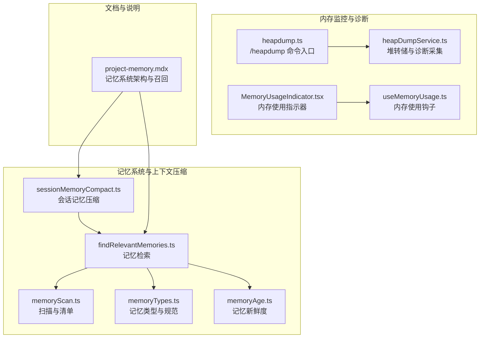
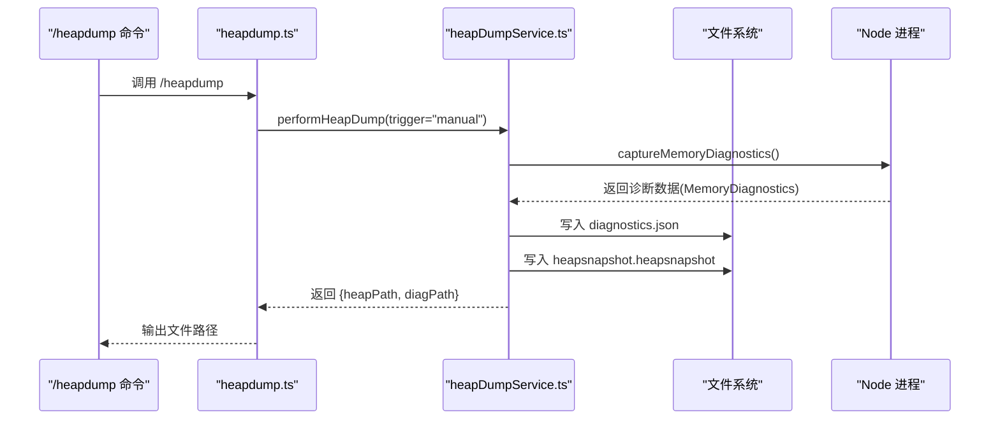
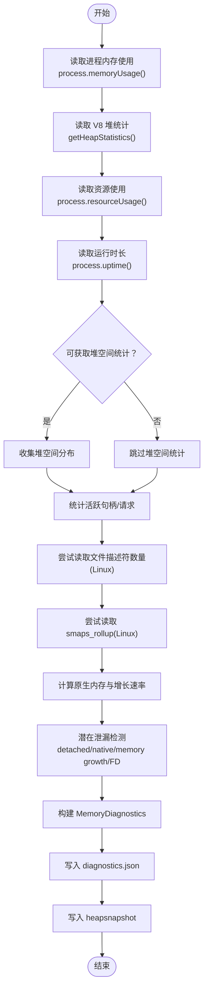
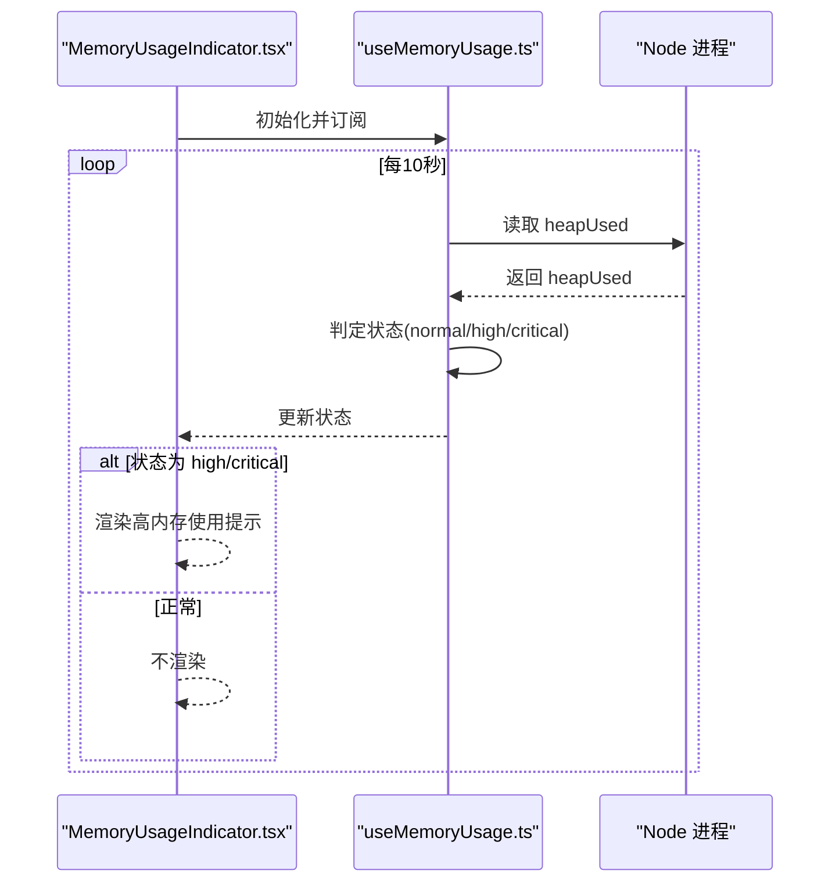
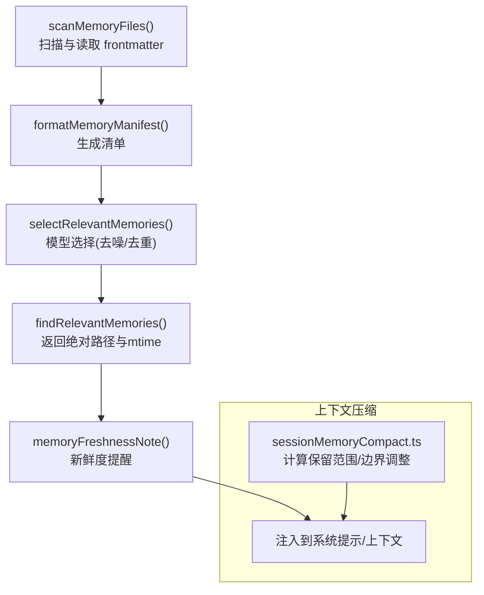
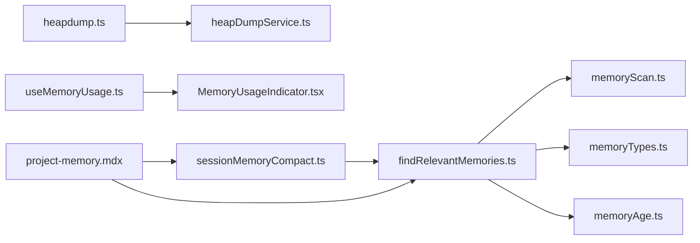

# 内存监控与分析

<cite>
**本文引用的文件**
- [heapDumpService.ts](file://src/utils/heapDumpService.ts)
- [heapdump.ts](file://src/commands/heapdump/heapdump.ts)
- [useMemoryUsage.ts](file://src/hooks/useMemoryUsage.ts)
- [MemoryUsageIndicator.tsx](file://src/components/MemoryUsageIndicator.tsx)
- [findRelevantMemories.ts](file://src/memdir/findRelevantMemories.ts)
- [memoryScan.ts](file://src/memdir/memoryScan.ts)
- [memoryTypes.ts](file://src/memdir/memoryTypes.ts)
- [memoryAge.ts](file://src/memdir/memoryAge.ts)
- [sessionMemoryCompact.ts](file://src/services/compact/sessionMemoryCompact.ts)
- [project-memory.mdx](file://docs/context/project-memory.mdx)
</cite>

## 目录
1. [简介](#简介)
2. [项目结构](#项目结构)
3. [核心组件](#核心组件)
4. [架构总览](#架构总览)
5. [详细组件分析](#详细组件分析)
6. [依赖关系分析](#依赖关系分析)
7. [性能考量](#性能考量)
8. [故障排查指南](#故障排查指南)
9. [结论](#结论)
10. [附录](#附录)

## 简介
本文件面向 Claude Code 的内存监控与分析体系，围绕以下目标展开：
- 实时内存使用监控与告警
- 内存泄漏检测机制与诊断
- 堆转储生成流程与快照分析
- 内存占用统计与趋势分析
- 内存使用模式识别、异常增长检测与碎片化分析
- 内存优化建议、泄漏定位方法与性能回归检测
- 不同平台（桌面端、移动端）的监控差异与适配策略
- 内存配置参数调优与资源限制管理

## 项目结构
与内存监控和分析直接相关的模块主要分布在如下位置：
- 堆转储与诊断：src/utils/heapDumpService.ts、src/commands/heapdump/heapdump.ts
- 运行时内存使用监控：src/hooks/useMemoryUsage.ts、src/components/MemoryUsageIndicator.tsx
- 记忆系统与上下文压缩：src/memdir/*、src/services/compact/sessionMemoryCompact.ts
- 文档与说明：docs/context/project-memory.mdx

**图表来源**
- [heapDumpService.ts:1-304](file://src/utils/heapDumpService.ts#L1-L304)
- [heapdump.ts:1-17](file://src/commands/heapdump/heapdump.ts#L1-L17)
- [useMemoryUsage.ts:1-40](file://src/hooks/useMemoryUsage.ts#L1-L40)
- [MemoryUsageIndicator.tsx:1-37](file://src/components/MemoryUsageIndicator.tsx#L1-L37)
- [findRelevantMemories.ts:1-142](file://src/memdir/findRelevantMemories.ts#L1-L142)
- [memoryScan.ts:1-95](file://src/memdir/memoryScan.ts#L1-L95)
- [memoryTypes.ts:1-272](file://src/memdir/memoryTypes.ts#L1-L272)
- [memoryAge.ts:1-54](file://src/memdir/memoryAge.ts#L1-L54)
- [sessionMemoryCompact.ts:1-631](file://src/services/compact/sessionMemoryCompact.ts#L1-L631)
- [project-memory.mdx:1-227](file://docs/context/project-memory.mdx#L1-L227)

**章节来源**
- [heapDumpService.ts:1-304](file://src/utils/heapDumpService.ts#L1-L304)
- [heapdump.ts:1-17](file://src/commands/heapdump/heapdump.ts#L1-L17)
- [useMemoryUsage.ts:1-40](file://src/hooks/useMemoryUsage.ts#L1-L40)
- [MemoryUsageIndicator.tsx:1-37](file://src/components/MemoryUsageIndicator.tsx#L1-L37)
- [findRelevantMemories.ts:1-142](file://src/memdir/findRelevantMemories.ts#L1-L142)
- [memoryScan.ts:1-95](file://src/memdir/memoryScan.ts#L1-L95)
- [memoryTypes.ts:1-272](file://src/memdir/memoryTypes.ts#L1-L272)
- [memoryAge.ts:1-54](file://src/memdir/memoryAge.ts#L1-L54)
- [sessionMemoryCompact.ts:1-631](file://src/services/compact/sessionMemoryCompact.ts#L1-L631)
- [project-memory.mdx:1-227](file://docs/context/project-memory.mdx#L1-L227)

## 核心组件
- 堆转储与诊断采集：提供内存诊断数据结构、采集指标（heapUsed/external/rss、V8堆统计、活跃句柄/请求、平台信息等）、堆转储写入与错误事件上报。
- /heapdump 命令：对外暴露的手动触发接口，返回堆快照与诊断文件路径。
- 内存使用钩子与指示器：周期性采样进程内存使用，按阈值触发高危提示。
- 记忆系统与上下文压缩：记忆文件扫描与清单、智能召回、记忆类型规范、记忆新鲜度提示；会话记忆压缩以降低上下文体积，缓解内存压力。

**章节来源**
- [heapDumpService.ts:32-212](file://src/utils/heapDumpService.ts#L32-L212)
- [heapdump.ts:1-17](file://src/commands/heapdump/heapdump.ts#L1-L17)
- [useMemoryUsage.ts:1-40](file://src/hooks/useMemoryUsage.ts#L1-L40)
- [MemoryUsageIndicator.tsx:1-37](file://src/components/MemoryUsageIndicator.tsx#L1-L37)
- [findRelevantMemories.ts:1-142](file://src/memdir/findRelevantMemories.ts#L1-L142)
- [memoryScan.ts:1-95](file://src/memdir/memoryScan.ts#L1-L95)
- [memoryTypes.ts:1-272](file://src/memdir/memoryTypes.ts#L1-L272)
- [memoryAge.ts:1-54](file://src/memdir/memoryAge.ts#L1-L54)
- [sessionMemoryCompact.ts:44-130](file://src/services/compact/sessionMemoryCompact.ts#L44-L130)

## 架构总览
下图展示了内存监控与分析的关键交互：命令入口触发堆转储采集，同时运行时钩子持续监控；记忆系统与上下文压缩在长对话场景中控制内存占用。

**图表来源**
- [heapdump.ts:1-17](file://src/commands/heapdump/heapdump.ts#L1-L17)
- [heapDumpService.ts:221-278](file://src/utils/heapDumpService.ts#L221-L278)

## 详细组件分析

### 堆转储与内存诊断（heapDumpService）
- 诊断数据结构：包含时间戳、会话标识、触发方式、内存用量（heapUsed/heapTotal/external/arrayBuffers/rss）、V8堆统计（heap_size_limit/malloced_memory/peak_malloced_memory/detached/native_contexts）、堆空间分布、资源使用（maxRSS/user/system CPU）、活跃句柄/请求、文件描述符、潜在泄漏清单与建议、平台与版本信息等。
- 诊断采集逻辑：优先采集进程内存使用、V8堆统计、资源使用；尝试获取堆空间统计（Bun 不可用）、活跃句柄/请求计数；在 Linux 平台尝试读取 smaps_rollup 获取更细粒度内存分解；计算原生内存（rss - heap）与增长速率（bytes/sec、MB/hour）；基于阈值与指标识别潜在泄漏（detached contexts、活跃句柄、原生内存占比、增长速率、文件描述符）。
- 堆转储写入：先写诊断文件，再写堆快照，避免大堆快照序列化导致崩溃时丢失诊断信息；在 Bun 环境使用同步写入并强制 GC 以尽快释放快照字符串占用的内存。
- 错误处理与事件上报：捕获异常并记录错误、上报埋点事件（成功/失败、触发类型、dump序号）。

**图表来源**
- [heapDumpService.ts:88-212](file://src/utils/heapDumpService.ts#L88-L212)
- [heapDumpService.ts:221-304](file://src/utils/heapDumpService.ts#L221-L304)

**章节来源**
- [heapDumpService.ts:32-212](file://src/utils/heapDumpService.ts#L32-L212)
- [heapDumpService.ts:221-304](file://src/utils/heapDumpService.ts#L221-L304)

### /heapdump 命令入口
- 提供对外调用接口，内部委托堆转储服务执行，并将结果以文本形式返回堆快照与诊断文件路径；失败时返回错误信息。

**章节来源**
- [heapdump.ts:1-17](file://src/commands/heapdump/heapdump.ts#L1-L17)

### 运行时内存使用监控（钩子与指示器）
- 钩子：每 10 秒轮询一次进程 heapUsed，按阈值（1.5GB/2.5GB）判定状态（normal/high/critical），仅在非 normal 时更新状态以减少渲染开销。
- 指示器：仅在特定构建类型下启用，当状态为 high/critical 时显示“高内存使用”提示及 /heapdump 链接，便于快速触发诊断。

**图表来源**
- [useMemoryUsage.ts:18-39](file://src/hooks/useMemoryUsage.ts#L18-L39)
- [MemoryUsageIndicator.tsx:1-37](file://src/components/MemoryUsageIndicator.tsx#L1-L37)

**章节来源**
- [useMemoryUsage.ts:1-40](file://src/hooks/useMemoryUsage.ts#L1-L40)
- [MemoryUsageIndicator.tsx:1-37](file://src/components/MemoryUsageIndicator.tsx#L1-L37)

### 记忆系统与上下文压缩
- 记忆扫描与清单：递归扫描记忆目录中的 .md 文件，读取前若干行提取 frontmatter，构造 MemoryHeader 列表并按 mtime 排序，限制最大文件数。
- 智能召回：将清单交给模型进行相关性选择，支持近期工具去噪与已展示去重，避免噪音与重复。
- 记忆类型与新鲜度：定义四类记忆类型与规范，提供记忆新鲜度文本与提醒标签，降低过期记忆误导风险。
- 会话记忆压缩：根据动态配置（minTokens/minTextBlockMessages/maxTokens）与边界消息，计算需要保留的消息范围，确保不破坏工具调用配对与思考块合并；将会话记忆作为摘要注入，避免额外压缩 API 调用，提升成本与稳定性。

**图表来源**
- [memoryScan.ts:35-95](file://src/memdir/memoryScan.ts#L35-L95)
- [findRelevantMemories.ts:39-142](file://src/memdir/findRelevantMemories.ts#L39-L142)
- [memoryTypes.ts:1-272](file://src/memdir/memoryTypes.ts#L1-L272)
- [memoryAge.ts:1-54](file://src/memdir/memoryAge.ts#L1-L54)
- [sessionMemoryCompact.ts:324-397](file://src/services/compact/sessionMemoryCompact.ts#L324-L397)

**章节来源**
- [memoryScan.ts:1-95](file://src/memdir/memoryScan.ts#L1-L95)
- [findRelevantMemories.ts:1-142](file://src/memdir/findRelevantMemories.ts#L1-L142)
- [memoryTypes.ts:1-272](file://src/memdir/memoryTypes.ts#L1-L272)
- [memoryAge.ts:1-54](file://src/memdir/memoryAge.ts#L1-L54)
- [sessionMemoryCompact.ts:44-130](file://src/services/compact/sessionMemoryCompact.ts#L44-L130)

## 依赖关系分析
- 命令层依赖服务层：/heapdump 命令依赖堆转储服务完成诊断采集与快照写入。
- 运行时监控依赖 Node 进程 API：钩子与指示器依赖 process.memoryUsage/process.uptime 等 API。
- 记忆系统依赖扫描与模型：findRelevantMemories 依赖 memoryScan 与 sideQuery；sessionMemoryCompact 依赖会话记忆文件与动态配置。
- 文档与实现映射：project-memory.mdx 对应源码中的记忆系统实现，包括索引、类型、召回与压缩。

**图表来源**
- [heapdump.ts:1-17](file://src/commands/heapdump/heapdump.ts#L1-L17)
- [heapDumpService.ts:1-304](file://src/utils/heapDumpService.ts#L1-L304)
- [useMemoryUsage.ts:1-40](file://src/hooks/useMemoryUsage.ts#L1-L40)
- [MemoryUsageIndicator.tsx:1-37](file://src/components/MemoryUsageIndicator.tsx#L1-L37)
- [findRelevantMemories.ts:1-142](file://src/memdir/findRelevantMemories.ts#L1-L142)
- [memoryScan.ts:1-95](file://src/memdir/memoryScan.ts#L1-L95)
- [memoryTypes.ts:1-272](file://src/memdir/memoryTypes.ts#L1-L272)
- [memoryAge.ts:1-54](file://src/memdir/memoryAge.ts#L1-L54)
- [sessionMemoryCompact.ts:1-631](file://src/services/compact/sessionMemoryCompact.ts#L1-L631)
- [project-memory.mdx:1-227](file://docs/context/project-memory.mdx#L1-L227)

**章节来源**
- [heapdump.ts:1-17](file://src/commands/heapdump/heapdump.ts#L1-L17)
- [heapDumpService.ts:1-304](file://src/utils/heapDumpService.ts#L1-L304)
- [useMemoryUsage.ts:1-40](file://src/hooks/useMemoryUsage.ts#L1-L40)
- [MemoryUsageIndicator.tsx:1-37](file://src/components/MemoryUsageIndicator.tsx#L1-L37)
- [findRelevantMemories.ts:1-142](file://src/memdir/findRelevantMemories.ts#L1-L142)
- [memoryScan.ts:1-95](file://src/memdir/memoryScan.ts#L1-L95)
- [memoryTypes.ts:1-272](file://src/memdir/memoryTypes.ts#L1-L272)
- [memoryAge.ts:1-54](file://src/memdir/memoryAge.ts#L1-L54)
- [sessionMemoryCompact.ts:1-631](file://src/services/compact/sessionMemoryCompact.ts#L1-L631)
- [project-memory.mdx:1-227](file://docs/context/project-memory.mdx#L1-L227)

## 性能考量
- 堆转储写入顺序：先写诊断文件再写堆快照，避免大堆序列化失败导致诊断缺失。
- 运行时钩子节流：10 秒轮询一次，仅在 high/critical 时渲染，降低 UI 与进程负载。
- 记忆召回与压缩：通过模型选择与会话记忆摘要注入，减少上下文长度与 token 消耗，间接降低内存压力。
- 动态配置与阈值：会话记忆压缩配置可远程下发，结合最小保留 token 数与最少文本消息数，平衡信息完整性与内存占用。

[本节为通用性能讨论，无需具体文件分析]

## 故障排查指南
- 堆转储失败或崩溃
  - 现象：堆快照写入失败或进程崩溃。
  - 排查：检查诊断文件是否成功写入；确认磁盘空间与权限；查看错误事件埋点；在 Bun 环境注意同步写入与强制 GC 的影响。
  - 参考
    - [heapDumpService.ts:221-304](file://src/utils/heapDumpService.ts#L221-L304)
- 高内存使用告警频繁出现
  - 现象：指示器持续显示高内存使用。
  - 排查：检查是否存在未释放的定时器/套接字/文件句柄；观察原生内存占比与增长速率；必要时触发 /heapdump 获取诊断。
  - 参考
    - [useMemoryUsage.ts:1-40](file://src/hooks/useMemoryUsage.ts#L1-L40)
    - [MemoryUsageIndicator.tsx:1-37](file://src/components/MemoryUsageIndicator.tsx#L1-L37)
    - [heapDumpService.ts:134-161](file://src/utils/heapDumpService.ts#L134-L161)
- 记忆召回噪声或重复
  - 现象：召回结果与用户意图不符或重复。
  - 排查：确认 recentTools 与 alreadySurfaced 参数是否正确传递；检查记忆 frontmatter 的 description 是否准确；核对记忆新鲜度提醒。
  - 参考
    - [findRelevantMemories.ts:77-142](file://src/memdir/findRelevantMemories.ts#L77-L142)
    - [memoryTypes.ts:1-272](file://src/memdir/memoryTypes.ts#L1-L272)
    - [memoryAge.ts:1-54](file://src/memdir/memoryAge.ts#L1-L54)
- 上下文过大导致性能下降
  - 现象：对话变长后响应缓慢或 token 超限。
  - 排查：启用会话记忆压缩；调整最小保留 token 数与最大保留 token 数；确保工具调用配对与思考块合并不被破坏。
  - 参考
    - [sessionMemoryCompact.ts:324-397](file://src/services/compact/sessionMemoryCompact.ts#L324-L397)
    - [sessionMemoryCompact.ts:434-503](file://src/services/compact/sessionMemoryCompact.ts#L434-L503)

**章节来源**
- [heapDumpService.ts:221-304](file://src/utils/heapDumpService.ts#L221-L304)
- [useMemoryUsage.ts:1-40](file://src/hooks/useMemoryUsage.ts#L1-L40)
- [MemoryUsageIndicator.tsx:1-37](file://src/components/MemoryUsageIndicator.tsx#L1-L37)
- [findRelevantMemories.ts:77-142](file://src/memdir/findRelevantMemories.ts#L77-L142)
- [memoryTypes.ts:1-272](file://src/memdir/memoryTypes.ts#L1-L272)
- [memoryAge.ts:1-54](file://src/memdir/memoryAge.ts#L1-L54)
- [sessionMemoryCompact.ts:324-397](file://src/services/compact/sessionMemoryCompact.ts#L324-L397)
- [sessionMemoryCompact.ts:434-503](file://src/services/compact/sessionMemoryCompact.ts#L434-L503)

## 结论
本内存监控与分析体系通过“运行时监控 + 堆转储诊断 + 记忆系统与上下文压缩”的组合，实现了对内存使用状况的可观测、可诊断与可优化。堆转储服务提供关键诊断数据与稳定输出，运行时钩子与指示器保障日常告警及时有效，记忆系统与压缩则在长对话场景中显著降低内存与 token 压力。配合动态配置与文档化的实践，可在不同平台与环境下实现稳健的内存治理。

[本节为总结，无需具体文件分析]

## 附录

### 平台差异与适配策略
- 桌面端（macOS/Linux/Windows）
  - 诊断能力：支持 smaps_rollup（Linux）与活跃句柄/请求统计；在 Bun 环境采用同步写入与强制 GC。
  - 建议：在 Linux 下可利用 smaps_rollup 进行更细粒度的内存分解分析；在 Bun 环境关注同步 I/O 对主线程的影响。
  - 参考
    - [heapDumpService.ts:121-128](file://src/utils/heapDumpService.ts#L121-L128)
    - [heapDumpService.ts:284-299](file://src/utils/heapDumpService.ts#L284-L299)
- 移动端（Bun 环境）
  - 诊断能力：堆空间统计不可用；仍可采集基础内存与资源使用。
  - 建议：在移动端优先关注 heapUsed/rss 与增长速率；避免在热路径进行大文件写入；必要时缩短轮询间隔或降低采样频率。
  - 参考
    - [heapDumpService.ts:97-103](file://src/utils/heapDumpService.ts#L97-L103)
    - [useMemoryUsage.ts:1-40](file://src/hooks/useMemoryUsage.ts#L1-L40)

**章节来源**
- [heapDumpService.ts:97-103](file://src/utils/heapDumpService.ts#L97-L103)
- [heapDumpService.ts:121-128](file://src/utils/heapDumpService.ts#L121-L128)
- [heapDumpService.ts:284-299](file://src/utils/heapDumpService.ts#L284-L299)
- [useMemoryUsage.ts:1-40](file://src/hooks/useMemoryUsage.ts#L1-L40)

### 内存配置参数调优与资源限制管理
- 会话记忆压缩配置
  - minTokens：压缩后至少保留的 token 数
  - minTextBlockMessages：至少保留的含文本块的消息数
  - maxTokens：压缩后的硬上限
  - 动态配置：可通过远程配置合并默认值，避免零值覆盖
  - 参考
    - [sessionMemoryCompact.ts:44-130](file://src/services/compact/sessionMemoryCompact.ts#L44-L130)
- 运行时监控阈值
  - 高内存阈值：1.5GB
  - 关键内存阈值：2.5GB
  - 参考
    - [useMemoryUsage.ts:11-12](file://src/hooks/useMemoryUsage.ts#L11-L12)
- 堆转储触发
  - 手动触发：/heapdump 命令
  - 自动触发：可结合增长速率与阈值策略（如 1.5GB 触发自动 dump 的场景）
  - 参考
    - [heapdump.ts:1-17](file://src/commands/heapdump/heapdump.ts#L1-L17)
    - [heapDumpService.ts:151-155](file://src/utils/heapDumpService.ts#L151-L155)

**章节来源**
- [sessionMemoryCompact.ts:44-130](file://src/services/compact/sessionMemoryCompact.ts#L44-L130)
- [useMemoryUsage.ts:11-12](file://src/hooks/useMemoryUsage.ts#L11-L12)
- [heapdump.ts:1-17](file://src/commands/heapdump/heapdump.ts#L1-L17)
- [heapDumpService.ts:151-155](file://src/utils/heapDumpService.ts#L151-L155)