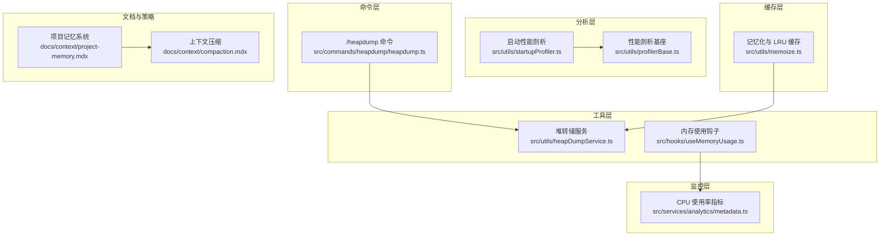
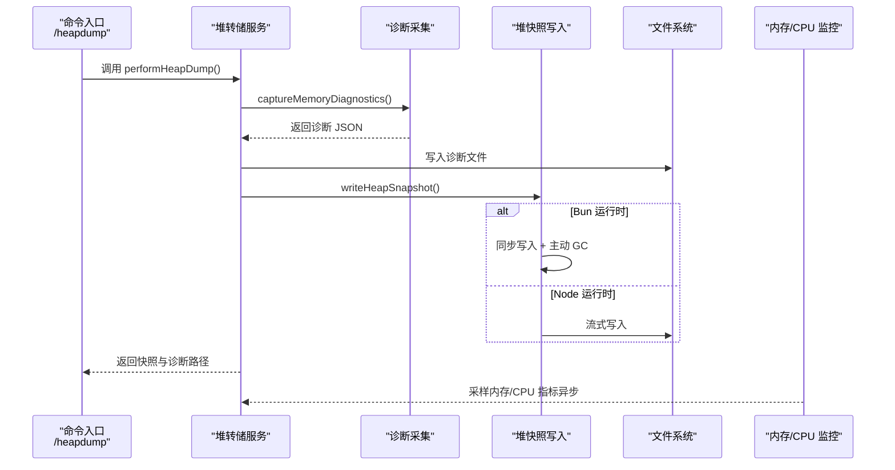
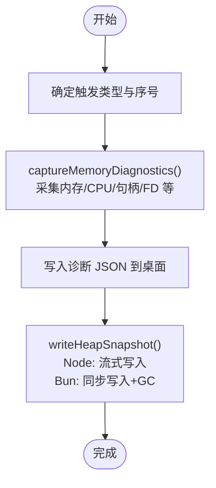
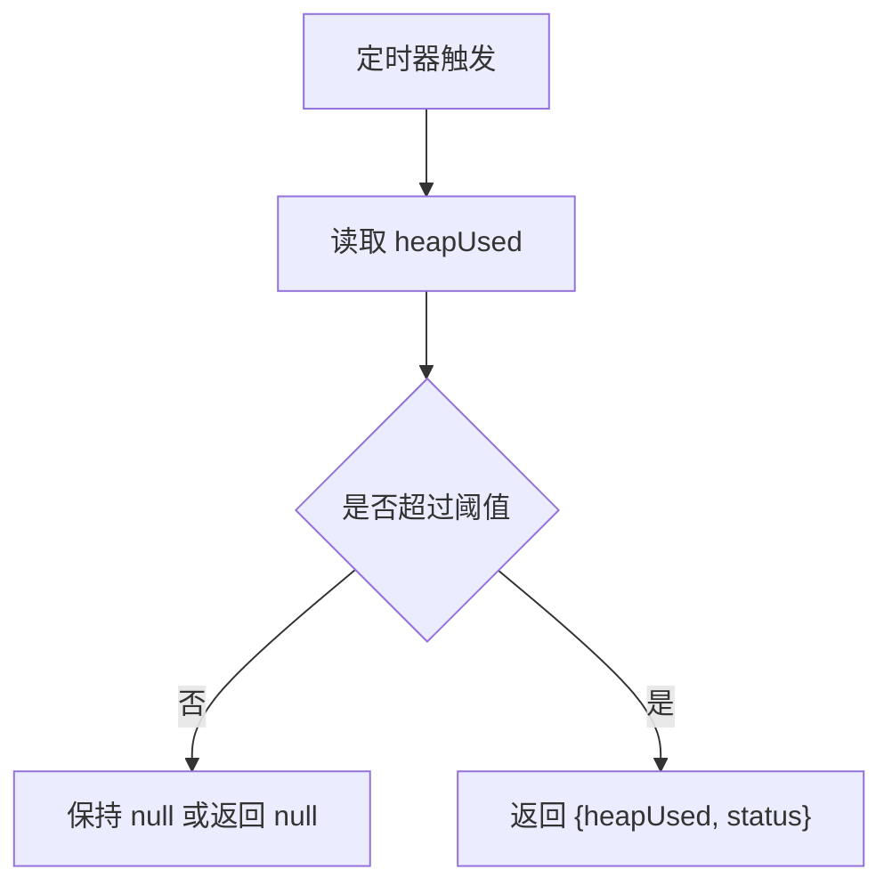
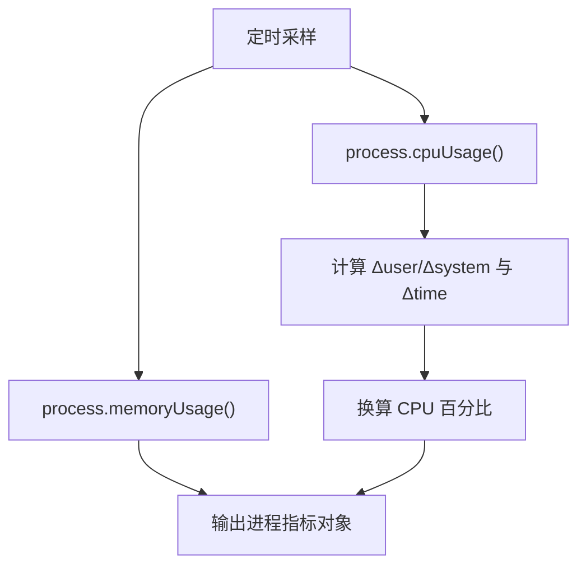
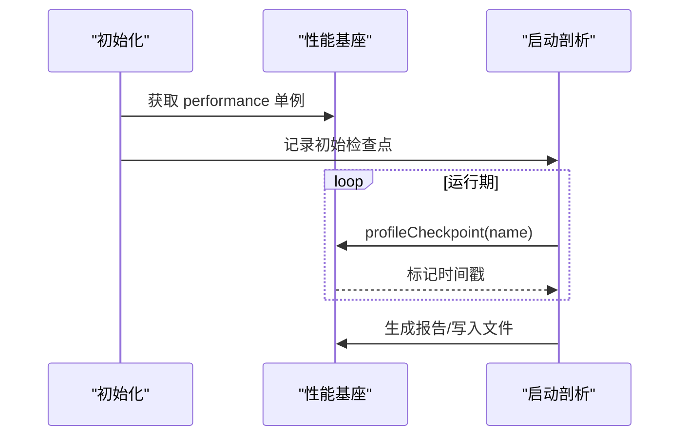
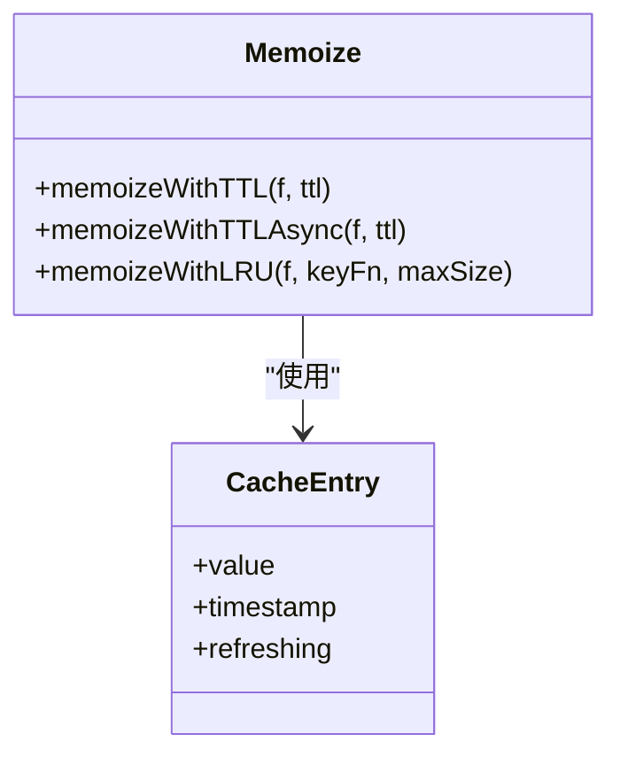
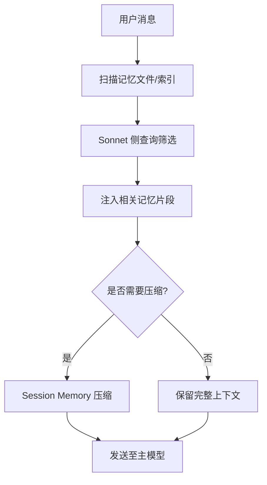
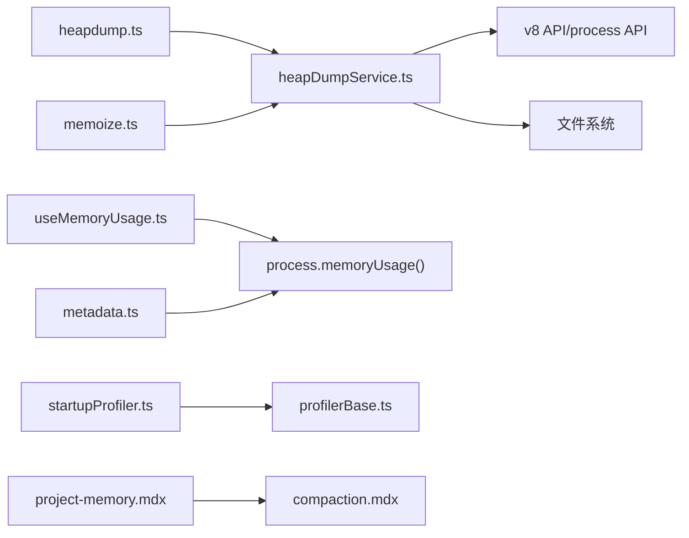

# 内存管理与性能优化

<cite>
**本文引用的文件**
- [heapdump.ts](file://src/commands/heapdump/heapdump.ts)
- [heapDumpService.ts](file://src/utils/heapDumpService.ts)
- [useMemoryUsage.ts](file://src/hooks/useMemoryUsage.ts)
- [metadata.ts](file://src/services/analytics/metadata.ts)
- [profilerBase.ts](file://src/utils/profilerBase.ts)
- [startupProfiler.ts](file://src/utils/startupProfiler.ts)
- [memoize.ts](file://src/utils/memoize.ts)
- [project-memory.mdx](file://docs/context/project-memory.mdx)
- [compaction.mdx](file://docs/context/compaction.mdx)
</cite>

## 目录
1. [简介](#简介)
2. [项目结构](#项目结构)
3. [核心组件](#核心组件)
4. [架构总览](#架构总览)
5. [详细组件分析](#详细组件分析)
6. [依赖关系分析](#依赖关系分析)
7. [性能考量](#性能考量)
8. [故障排查指南](#故障排查指南)
9. [结论](#结论)
10. [附录](#附录)

## 简介
本文件面向 Claude Code 的内存管理与性能优化体系，系统梳理内存使用模式、垃圾回收策略、内存泄漏检测与诊断流程；阐述性能剖析工具、CPU 使用率监控与内存占用分析方法；覆盖堆转储生成、内存快照对比与性能基准测试；给出瓶颈识别方法、优化建议与最佳实践，并展示缓存策略、资源池管理与并发控制在工程中的落地方式。同时，结合移动端与桌面端的性能差异，提供适配方案与持续优化流程。

## 项目结构
围绕内存与性能的关键模块分布如下：
- 命令层：/heapdump 命令入口，触发堆转储与诊断采集
- 工具层：堆转储服务（采集诊断、生成快照、平台差异化处理）
- 监控层：内存使用钩子（周期性采样）、CPU 使用率指标构建
- 分析层：通用性能剖析基座、启动阶段性能剖析
- 缓存层：通用记忆化与 LRU 缓存，降低重复计算与对象分配
- 文档层：项目记忆与上下文压缩策略，指导内存与带宽的合理使用

**图表来源**
- [heapdump.ts:1-18](file://src/commands/heapdump/heapdump.ts#L1-L18)
- [heapDumpService.ts:1-304](file://src/utils/heapDumpService.ts#L1-L304)
- [useMemoryUsage.ts:1-40](file://src/hooks/useMemoryUsage.ts#L1-L40)
- [metadata.ts:640-682](file://src/services/analytics/metadata.ts#L640-L682)
- [profilerBase.ts:1-47](file://src/utils/profilerBase.ts#L1-L47)
- [startupProfiler.ts:1-195](file://src/utils/startupProfiler.ts#L1-L195)
- [memoize.ts:1-270](file://src/utils/memoize.ts#L1-L270)
- [project-memory.mdx:1-227](file://docs/context/project-memory.mdx#L1-L227)
- [compaction.mdx:1-240](file://docs/context/compaction.mdx#L1-L240)

**章节来源**
- [heapdump.ts:1-18](file://src/commands/heapdump/heapdump.ts#L1-L18)
- [heapDumpService.ts:1-304](file://src/utils/heapDumpService.ts#L1-L304)
- [useMemoryUsage.ts:1-40](file://src/hooks/useMemoryUsage.ts#L1-L40)
- [metadata.ts:640-682](file://src/services/analytics/metadata.ts#L640-L682)
- [profilerBase.ts:1-47](file://src/utils/profilerBase.ts#L1-L47)
- [startupProfiler.ts:1-195](file://src/utils/startupProfiler.ts#L1-L195)
- [memoize.ts:1-270](file://src/utils/memoize.ts#L1-L270)
- [project-memory.mdx:1-227](file://docs/context/project-memory.mdx#L1-L227)
- [compaction.mdx:1-240](file://docs/context/compaction.mdx#L1-L240)

## 核心组件
- 堆转储与诊断采集：在触发时先写入诊断 JSON，再写入堆快照，规避大堆导致的序列化崩溃；兼容 Bun 与 Node 的不同写入路径，并在 Bun 下主动触发 GC 释放快照占用。
- 内存使用监控：React 钩子周期性采样 Node 内存，按阈值返回高危状态，避免高频渲染。
- CPU 使用率与进程指标：构建 CPU 百分比与内存快照，便于定位热点。
- 性能剖析基座：统一的时间线格式与内存快照输出，支持启动阶段与查询阶段的报告生成。
- 缓存策略：提供 TTL 与 LRU 两类记忆化，避免重复计算与对象分配，控制内存增长。
- 上下文压缩与项目记忆：通过“文件级纯文本”存储与智能召回，减少不必要的上下文注入，降低内存与带宽压力。

**章节来源**
- [heapDumpService.ts:88-212](file://src/utils/heapDumpService.ts#L88-L212)
- [heapDumpService.ts:221-278](file://src/utils/heapDumpService.ts#L221-L278)
- [heapDumpService.ts:284-303](file://src/utils/heapDumpService.ts#L284-L303)
- [useMemoryUsage.ts:18-39](file://src/hooks/useMemoryUsage.ts#L18-L39)
- [metadata.ts:648-682](file://src/services/analytics/metadata.ts#L648-L682)
- [profilerBase.ts:14-46](file://src/utils/profilerBase.ts#L14-L46)
- [startupProfiler.ts:65-119](file://src/utils/startupProfiler.ts#L65-L119)
- [memoize.ts:40-107](file://src/utils/memoize.ts#L40-L107)
- [memoize.ts:234-270](file://src/utils/memoize.ts#L234-L270)
- [compaction.mdx:1-240](file://docs/context/compaction.mdx#L1-L240)
- [project-memory.mdx:1-227](file://docs/context/project-memory.mdx#L1-L227)

## 架构总览
下图展示了从命令触发到诊断与快照落盘的整体流程，以及与监控、剖析、缓存的交互关系。

**图表来源**
- [heapdump.ts:3-16](file://src/commands/heapdump/heapdump.ts#L3-L16)
- [heapDumpService.ts:221-278](file://src/utils/heapDumpService.ts#L221-L278)
- [heapDumpService.ts:284-303](file://src/utils/heapDumpService.ts#L284-L303)
- [useMemoryUsage.ts:18-39](file://src/hooks/useMemoryUsage.ts#L18-L39)
- [metadata.ts:648-682](file://src/services/analytics/metadata.ts#L648-L682)

## 详细组件分析

### 堆转储与内存诊断（heapDumpService）
- 诊断字段覆盖：内存用量、V8 堆统计、堆空间分布、资源使用、活跃句柄/请求、文件描述符、平台与版本信息、泄漏潜在信号与建议。
- 写入顺序：先写诊断 JSON，再写堆快照，避免大堆序列化崩溃导致诊断缺失。
- 平台适配：Bun 与 Node 的不同写入路径；Bun 下同步写入并主动触发 GC。
- 触发策略：手动触发与“内存超阈”自动触发（配合内存使用钩子）。

**图表来源**
- [heapDumpService.ts:88-212](file://src/utils/heapDumpService.ts#L88-L212)
- [heapDumpService.ts:221-278](file://src/utils/heapDumpService.ts#L221-L278)
- [heapDumpService.ts:284-303](file://src/utils/heapDumpService.ts#L284-L303)

**章节来源**
- [heapDumpService.ts:88-212](file://src/utils/heapDumpService.ts#L88-L212)
- [heapDumpService.ts:221-278](file://src/utils/heapDumpService.ts#L221-L278)
- [heapDumpService.ts:284-303](file://src/utils/heapDumpService.ts#L284-L303)

### 内存使用监控钩子（useMemoryUsage）
- 周期性采样：每 10 秒读取 heapUsed，按阈值判定状态（正常/高危/危急）。
- 渲染优化：仅在非“正常”状态下返回数据，避免高频重渲染。
- 配合策略：与堆转储触发阈值协同，实现“预警—诊断—快照”的闭环。

**图表来源**
- [useMemoryUsage.ts:18-39](file://src/hooks/useMemoryUsage.ts#L18-L39)

**章节来源**
- [useMemoryUsage.ts:18-39](file://src/hooks/useMemoryUsage.ts#L18-L39)

### CPU 使用率与进程指标（analytics/metadata）
- 构建进程指标：RSS、堆、外部内存、受限内存、CPU 使用量与 CPU 百分比。
- CPU 百分比计算：基于两次 cpuUsage 采样的差值与时间间隔，避免全局进程状态干扰。

**图表来源**
- [metadata.ts:648-682](file://src/services/analytics/metadata.ts#L648-L682)

**章节来源**
- [metadata.ts:648-682](file://src/services/analytics/metadata.ts#L648-L682)

### 性能剖析基座与启动剖析（profilerBase/startupProfiler）
- 基座能力：统一的时间线格式、内存快照输出、懒加载性能 API。
- 启动剖析：支持“详细模式”与“采样模式”，记录关键检查点，生成报告并可写入文件；同时向统计平台上报阶段耗时。

**图表来源**
- [profilerBase.ts:14-46](file://src/utils/profilerBase.ts#L14-L46)
- [startupProfiler.ts:65-119](file://src/utils/startupProfiler.ts#L65-L119)
- [startupProfiler.ts:131-144](file://src/utils/startupProfiler.ts#L131-L144)

**章节来源**
- [profilerBase.ts:14-46](file://src/utils/profilerBase.ts#L14-L46)
- [startupProfiler.ts:65-119](file://src/utils/startupProfiler.ts#L65-L119)
- [startupProfiler.ts:131-144](file://src/utils/startupProfiler.ts#L131-L144)

### 缓存策略与资源池（memoize）
- TTL 记忆化：写穿透缓存，缓存过期时返回旧值并后台刷新，避免抖动。
- 异步记忆化：并发冷命中去重，避免重复 IO/网络请求。
- LRU 记忆化：限制最大容量，按最近使用驱逐，防止无界增长。
- 适用场景：消息处理函数、昂贵的 IO/网络请求、工具调用结果等。

**图表来源**
- [memoize.ts:40-107](file://src/utils/memoize.ts#L40-L107)
- [memoize.ts:120-220](file://src/utils/memoize.ts#L120-L220)
- [memoize.ts:234-270](file://src/utils/memoize.ts#L234-L270)

**章节来源**
- [memoize.ts:40-107](file://src/utils/memoize.ts#L40-L107)
- [memoize.ts:120-220](file://src/utils/memoize.ts#L120-L220)
- [memoize.ts:234-270](file://src/utils/memoize.ts#L234-L270)

### 上下文压缩与项目记忆（compaction + project-memory）
- 上下文压缩三层策略：局部 MicroCompact、Session Memory Compact、传统摘要压缩；通过边界标记与保留窗口保证 API 兼容性。
- 项目记忆系统：纯文件存储（Markdown + 目录），通过智能召回与前端过滤，避免将可推导信息纳入上下文，显著降低内存与带宽。
- 与压缩联动：当启用 Session Memory 压缩时，优先使用已有的记忆摘要，无需额外 API 调用。

**图表来源**
- [compaction.mdx:1-240](file://docs/context/compaction.mdx#L1-L240)
- [project-memory.mdx:1-227](file://docs/context/project-memory.mdx#L1-L227)

**章节来源**
- [compaction.mdx:1-240](file://docs/context/compaction.mdx#L1-L240)
- [project-memory.mdx:1-227](file://docs/context/project-memory.mdx#L1-L227)

## 依赖关系分析
- 命令层依赖工具层进行堆转储；工具层依赖 Node/v8 API 与文件系统；监控层与剖析层为横切关注点。
- 缓存层广泛应用于昂贵计算与 IO，降低重复成本；项目记忆与压缩策略共同作用于上下文规模控制。
- 文档层策略为工程实践提供依据，确保内存与带宽的合理使用。

**图表来源**
- [heapdump.ts:1-18](file://src/commands/heapdump/heapdump.ts#L1-L18)
- [heapDumpService.ts:1-304](file://src/utils/heapDumpService.ts#L1-L304)
- [useMemoryUsage.ts:1-40](file://src/hooks/useMemoryUsage.ts#L1-L40)
- [metadata.ts:640-682](file://src/services/analytics/metadata.ts#L640-L682)
- [startupProfiler.ts:1-195](file://src/utils/startupProfiler.ts#L1-L195)
- [profilerBase.ts:1-47](file://src/utils/profilerBase.ts#L1-L47)
- [memoize.ts:1-270](file://src/utils/memoize.ts#L1-L270)
- [project-memory.mdx:1-227](file://docs/context/project-memory.mdx#L1-L227)
- [compaction.mdx:1-240](file://docs/context/compaction.mdx#L1-L240)

**章节来源**
- [heapdump.ts:1-18](file://src/commands/heapdump/heapdump.ts#L1-L18)
- [heapDumpService.ts:1-304](file://src/utils/heapDumpService.ts#L1-L304)
- [useMemoryUsage.ts:1-40](file://src/hooks/useMemoryUsage.ts#L1-L40)
- [metadata.ts:640-682](file://src/services/analytics/metadata.ts#L640-L682)
- [startupProfiler.ts:1-195](file://src/utils/startupProfiler.ts#L1-L195)
- [profilerBase.ts:1-47](file://src/utils/profilerBase.ts#L1-L47)
- [memoize.ts:1-270](file://src/utils/memoize.ts#L1-L270)
- [project-memory.mdx:1-227](file://docs/context/project-memory.mdx#L1-L227)
- [compaction.mdx:1-240](file://docs/context/compaction.mdx#L1-L240)

## 性能考量
- 堆转储与诊断：先诊断后快照，避免大堆序列化崩溃；Bun 下同步写入并主动 GC，缩短峰值占用。
- 内存采样与阈值：10 秒采样一次，仅在高危态触发 UI 更新，降低渲染成本。
- CPU 指标：基于两次 cpuUsage 采样差值计算 CPU 百分比，避免全局状态干扰。
- 缓存策略：TTL 与 LRU 双轨并行，既保证新鲜度又控制内存上限；异步记忆化避免并发抖动。
- 上下文压缩：优先 Session Memory 压缩，减少 API 调用与带宽；通过边界与保留窗口保证正确性。
- 项目记忆：文件级存储与智能召回，避免冗余上下文注入，降低内存与网络压力。

[本节为通用性能讨论，无需列出具体文件来源]

## 故障排查指南
- 堆转储失败或崩溃
  - 现象：生成诊断成功但堆快照失败。
  - 排查：确认诊断 JSON 是否写入；检查磁盘空间与权限；在 Bun 下观察 GC 行为。
  - 参考路径：[performHeapDump:221-278](file://src/utils/heapDumpService.ts#L221-L278)，[writeHeapSnapshot:284-303](file://src/utils/heapDumpService.ts#L284-L303)
- 内存持续增长
  - 现象：heapUsed 持续上升，超过阈值触发告警。
  - 排查：查看诊断中的 detachedContexts、activeHandles、nativeMemory、openFileDescriptors 等潜在泄漏信号；结合 CPU 百分比与资源使用分析。
  - 参考路径：[captureMemoryDiagnostics:88-212](file://src/utils/heapDumpService.ts#L88-L212)，[useMemoryUsage:18-39](file://src/hooks/useMemoryUsage.ts#L18-L39)，[metadata 指标:648-682](file://src/services/analytics/metadata.ts#L648-L682)
- 启动慢或卡顿
  - 现象：启动阶段耗时异常。
  - 排查：启用详细启动剖析，查看关键检查点耗时；结合内存快照定位分配热点。
  - 参考路径：[startupProfiler:65-119](file://src/utils/startupProfiler.ts#L65-L119)，[profilerBase:33-46](file://src/utils/profilerBase.ts#L33-L46)
- 缓存抖动或内存膨胀
  - 现象：缓存频繁失效或内存持续增长。
  - 排查：调整 TTL 或切换 LRU；检查缓存键生成与去重逻辑；必要时清理 inFlight 队列。
  - 参考路径：[memoize TTL/Async/LRU:40-107](file://src/utils/memoize.ts#L40-L107)，[memoize Async:120-220](file://src/utils/memoize.ts#L120-L220)，[memoize LRU:234-270](file://src/utils/memoize.ts#L234-L270)
- 上下文过大导致超限
  - 现象：提示消息过长或压缩失败。
  - 排查：优先启用 Session Memory 压缩；检查边界标记与保留窗口；必要时触发传统摘要压缩并重新注入关键上下文。
  - 参考路径：[compaction 策略:1-240](file://docs/context/compaction.mdx#L1-L240)，[项目记忆:1-227](file://docs/context/project-memory.mdx#L1-L227)

**章节来源**
- [heapDumpService.ts:88-212](file://src/utils/heapDumpService.ts#L88-L212)
- [heapDumpService.ts:221-278](file://src/utils/heapDumpService.ts#L221-L278)
- [heapDumpService.ts:284-303](file://src/utils/heapDumpService.ts#L284-L303)
- [useMemoryUsage.ts:18-39](file://src/hooks/useMemoryUsage.ts#L18-L39)
- [metadata.ts:648-682](file://src/services/analytics/metadata.ts#L648-L682)
- [startupProfiler.ts:65-119](file://src/utils/startupProfiler.ts#L65-L119)
- [profilerBase.ts:33-46](file://src/utils/profilerBase.ts#L33-L46)
- [memoize.ts:40-107](file://src/utils/memoize.ts#L40-L107)
- [memoize.ts:120-220](file://src/utils/memoize.ts#L120-L220)
- [memoize.ts:234-270](file://src/utils/memoize.ts#L234-L270)
- [compaction.mdx:1-240](file://docs/context/compaction.mdx#L1-L240)
- [project-memory.mdx:1-227](file://docs/context/project-memory.mdx#L1-L227)

## 结论
本体系通过“诊断先行 + 快照兜底”的堆转储流程、周期性内存采样与 CPU 指标、统一的性能剖析基座、多层缓存策略以及上下文压缩与项目记忆，形成了从观测、诊断到优化的闭环。结合 Bun 与 Node 的差异化处理，以及 TTL/LRU 的内存控制手段，能够在保证稳定性的同时，持续降低内存与带宽压力，提升整体性能表现。

[本节为总结性内容，无需列出具体文件来源]

## 附录
- 堆转储命令：/heapdump
- 关键阈值：高危 1.5GB、危急 2.5GB（内存使用钩子）
- 平台差异：Bun 下同步写入堆快照并主动 GC；Node 下流式写入
- 建议流程：预警（内存钩子）→ 诊断（堆转储服务）→ 快照（堆转储服务）→ 报告（启动剖析/性能基座）→ 优化（缓存/压缩/策略）

[本节为补充说明，无需列出具体文件来源]