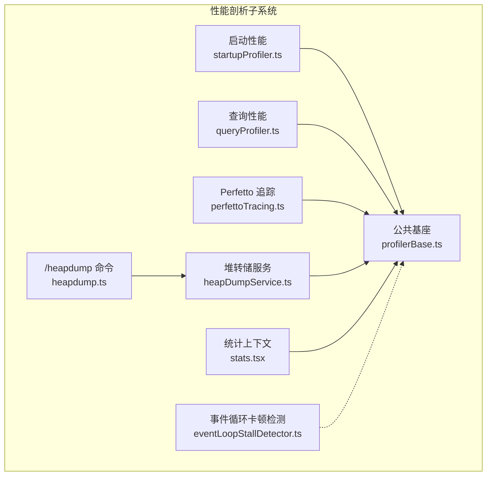
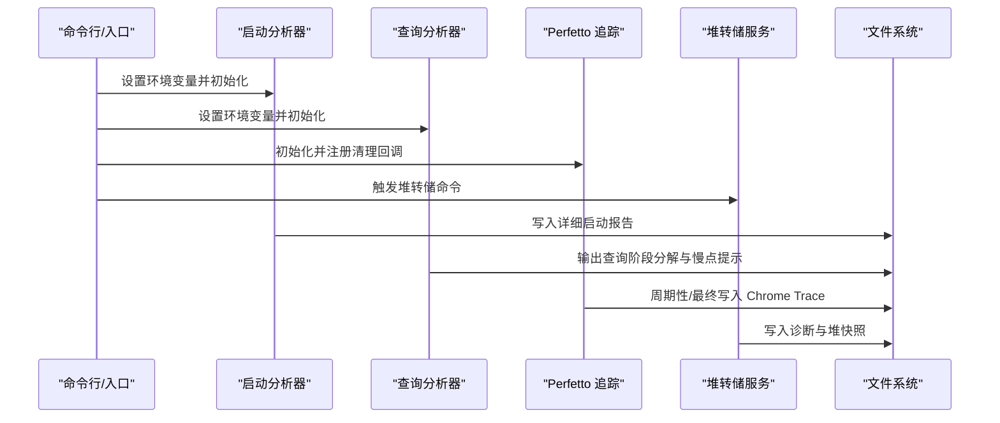
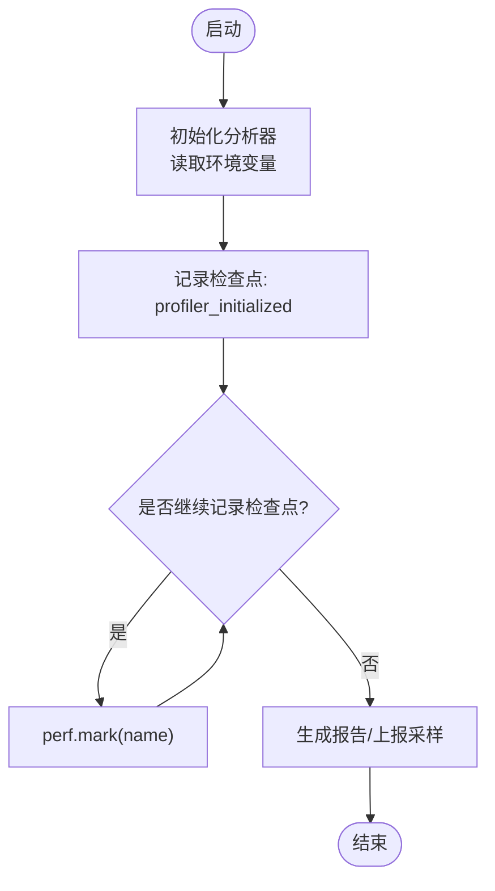
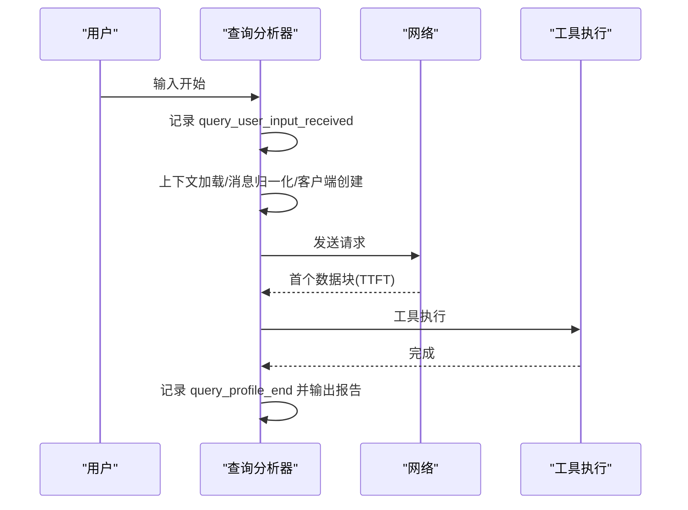
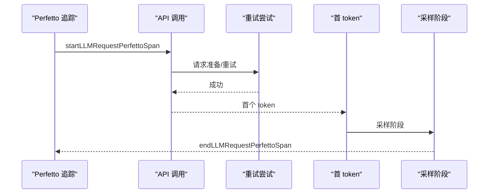
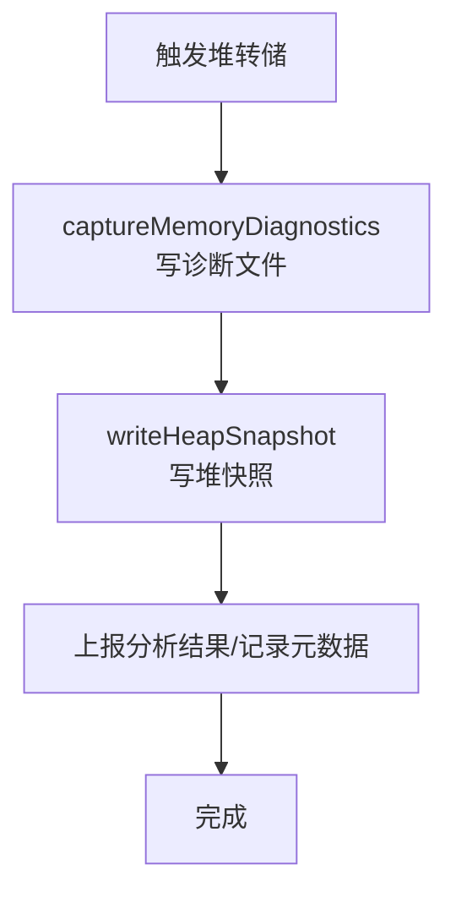
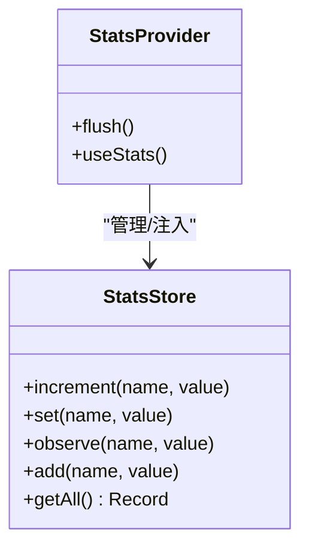
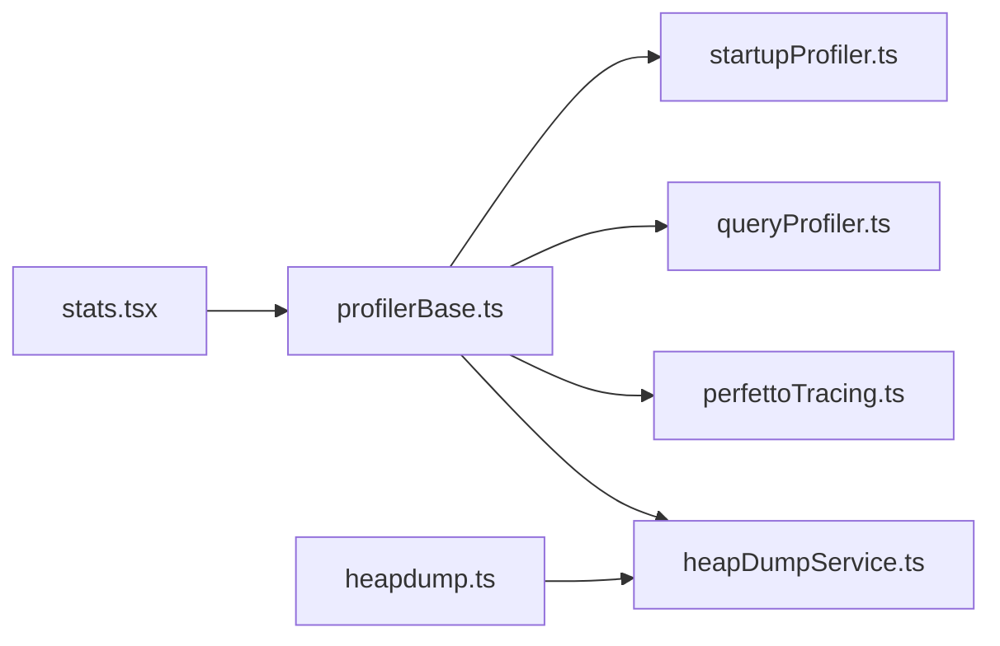

# 性能剖析工具

<cite>
**本文引用的文件**
- [src/utils/startupProfiler.ts](file://src/utils/startupProfiler.ts)
- [src/utils/queryProfiler.ts](file://src/utils/queryProfiler.ts)
- [src/utils/profilerBase.ts](file://src/utils/profilerBase.ts)
- [src/utils/telemetry/perfettoTracing.ts](file://src/utils/telemetry/perfettoTracing.ts)
- [src/utils/heapDumpService.ts](file://src/utils/heapDumpService.ts)
- [src/commands/heapdump/heapdump.ts](file://src/commands/heapdump/heapdump.ts)
- [src/context/stats.tsx](file://src/context/stats.tsx)
- [src/utils/eventLoopStallDetector.ts](file://src/utils/eventLoopStallDetector.ts)
</cite>

## 目录
1. [简介](#简介)
2. [项目结构](#项目结构)
3. [核心组件](#核心组件)
4. [架构总览](#架构总览)
5. [组件详解](#组件详解)
6. [依赖关系分析](#依赖关系分析)
7. [性能考量](#性能考量)
8. [故障排查指南](#故障排查指南)
9. [结论](#结论)
10. [附录](#附录)

## 简介
本文件面向 Claude Code 的性能剖析工具体系，系统化阐述启动性能分析、查询执行时间分析、事件循环卡顿检测（待完善）、内存泄漏诊断与堆转储、以及基于 Chrome Trace 的 Perfetto 可视化追踪。文档覆盖从数据采集、分析报告生成到趋势可视化的全流程，并提供基准测试、回归检测与优化建议，帮助在不同场景下选择合适的工具组合并进行配置调优。

## 项目结构
与性能剖析直接相关的模块主要分布在以下路径：
- 启动性能：src/utils/startupProfiler.ts
- 查询性能：src/utils/queryProfiler.ts
- 公共基座：src/utils/profilerBase.ts
- Perfetto 追踪：src/utils/telemetry/perfettoTracing.ts
- 堆转储与内存诊断：src/utils/heapDumpService.ts、src/commands/heapdump/heapdump.ts
- 统计与指标：src/context/stats.tsx
- 事件循环卡顿检测：src/utils/eventLoopStallDetector.ts（当前为占位）

图表来源
- [src/utils/startupProfiler.ts:1-195](file://src/utils/startupProfiler.ts#L1-L195)
- [src/utils/queryProfiler.ts:1-302](file://src/utils/queryProfiler.ts#L1-L302)
- [src/utils/profilerBase.ts:1-46](file://src/utils/profilerBase.ts#L1-L46)
- [src/utils/telemetry/perfettoTracing.ts:1-1121](file://src/utils/telemetry/perfettoTracing.ts#L1-L1121)
- [src/utils/heapDumpService.ts:1-304](file://src/utils/heapDumpService.ts#L1-L304)
- [src/commands/heapdump/heapdump.ts:1-17](file://src/commands/heapdump/heapdump.ts#L1-L17)
- [src/context/stats.tsx:1-220](file://src/context/stats.tsx#L1-L220)
- [src/utils/eventLoopStallDetector.ts:1-4](file://src/utils/eventLoopStallDetector.ts#L1-L4)

章节来源
- [src/utils/startupProfiler.ts:1-195](file://src/utils/startupProfiler.ts#L1-L195)
- [src/utils/queryProfiler.ts:1-302](file://src/utils/queryProfiler.ts#L1-L302)
- [src/utils/profilerBase.ts:1-46](file://src/utils/profilerBase.ts#L1-L46)
- [src/utils/telemetry/perfettoTracing.ts:1-1121](file://src/utils/telemetry/perfettoTracing.ts#L1-L1121)
- [src/utils/heapDumpService.ts:1-304](file://src/utils/heapDumpService.ts#L1-L304)
- [src/commands/heapdump/heapdump.ts:1-17](file://src/commands/heapdump/heapdump.ts#L1-L17)
- [src/context/stats.tsx:1-220](file://src/context/stats.tsx#L1-L220)
- [src/utils/eventLoopStallDetector.ts:1-4](file://src/utils/eventLoopStallDetector.ts#L1-L4)

## 核心组件
- 启动性能分析器：基于 Node.js perf_hooks 的时间戳标记，支持采样日志与详细报告，输出到文件或统计平台。
- 查询性能分析器：记录从用户输入到首 token 到达的关键节点，计算 TTFT/TTLT、预请求开销占比等，输出阶段分解与慢点提示。
- Perfetto 追踪：以 Chrome Trace 格式记录 API 调用、工具执行、等待用户输入等事件，支持周期写盘与会话结束强制落盘。
- 堆转储与内存诊断：捕获 V8 堆快照与进程资源使用信息，辅助定位内存泄漏与增长趋势。
- 统计与指标：提供计数器、仪表盘、直方图（含分位数）与集合型指标，用于运行时观测与持久化。
- 事件循环卡顿检测：当前为占位实现，后续可扩展为基于定时器延迟与帧渲染间隔的检测。

章节来源
- [src/utils/startupProfiler.ts:1-195](file://src/utils/startupProfiler.ts#L1-L195)
- [src/utils/queryProfiler.ts:1-302](file://src/utils/queryProfiler.ts#L1-L302)
- [src/utils/telemetry/perfettoTracing.ts:1-1121](file://src/utils/telemetry/perfettoTracing.ts#L1-L1121)
- [src/utils/heapDumpService.ts:1-304](file://src/utils/heapDumpService.ts#L1-L304)
- [src/context/stats.tsx:1-220](file://src/context/stats.tsx#L1-L220)
- [src/utils/eventLoopStallDetector.ts:1-4](file://src/utils/eventLoopStallDetector.ts#L1-L4)

## 架构总览
整体采用“模块化采集 + 统一格式输出”的设计，所有分析器共享 perf_hooks 时间源与通用格式化能力；Perfetto 作为统一可视化入口，结合堆转储与统计上下文形成闭环。

图表来源
- [src/utils/startupProfiler.ts:123-145](file://src/utils/startupProfiler.ts#L123-L145)
- [src/utils/queryProfiler.ts:298-301](file://src/utils/queryProfiler.ts#L298-L301)
- [src/utils/telemetry/perfettoTracing.ts:253-335](file://src/utils/telemetry/perfettoTracing.ts#L253-L335)
- [src/utils/heapDumpService.ts:221-278](file://src/utils/heapDumpService.ts#L221-L278)

## 组件详解

### 启动性能分析器（startupProfiler）
- 功能要点
  - 支持两种模式：采样日志（Statsig）与详细报告（带内存快照）。
  - 使用 perf_hooks 标记关键检查点，按顺序输出时间线与总耗时。
  - 将关键阶段（导入、初始化、设置加载、总时长）汇总为元数据上报。
- 关键接口
  - 记录检查点：profileCheckpoint(name)
  - 生成报告：profileReport()（写文件 + 控制台输出）
  - 上报采样：logStartupPerf()
- 配置项
  - CLAUDE_CODE_PROFILE_STARTUP=1 开启详细报告
  - 决策采样率与是否采样由模块内逻辑决定

图表来源
- [src/utils/startupProfiler.ts:56-75](file://src/utils/startupProfiler.ts#L56-L75)
- [src/utils/startupProfiler.ts:123-145](file://src/utils/startupProfiler.ts#L123-L145)
- [src/utils/startupProfiler.ts:159-194](file://src/utils/startupProfiler.ts#L159-L194)

章节来源
- [src/utils/startupProfiler.ts:1-195](file://src/utils/startupProfiler.ts#L1-L195)

### 查询性能分析器（queryProfiler）
- 功能要点
  - 记录从用户输入到首 token 到达的完整链路，包括上下文加载、消息归一化、客户端创建、网络往返等。
  - 计算 TTFT、预请求开销占比、阶段耗时条形图与慢点告警。
  - 提供阶段分解（如上下文加载、微压缩、自动压缩、工具 schema、消息归一化、客户端创建、网络 TTFB、工具执行）。
- 关键接口
  - startQueryProfile()/queryCheckpoint()/endQueryProfile()
  - logQueryProfileReport() 输出报告
- 慢点识别
  - 对特定节点（如 git_status、tool_schema、client_creation）设定阈值告警

图表来源
- [src/utils/queryProfiler.ts:50-93](file://src/utils/queryProfiler.ts#L50-L93)
- [src/utils/queryProfiler.ts:129-211](file://src/utils/queryProfiler.ts#L129-L211)
- [src/utils/queryProfiler.ts:216-293](file://src/utils/queryProfiler.ts#L216-L293)

章节来源
- [src/utils/queryProfiler.ts:1-302](file://src/utils/queryProfiler.ts#L1-L302)

### Perfetto 追踪（perfettoTracing）
- 功能要点
  - 以 Chrome Trace 事件格式记录 API 请求（TTFT/TTLT/ITPS/OTPS/缓存命中）、工具执行、等待用户输入等。
  - 支持子事件嵌套（请求准备、重试尝试、首 token、采样阶段）。
  - 支持周期写盘与会话结束强制写盘，避免丢失。
  - 事件上限与过期跨度淘汰策略，保证长期会话稳定性。
- 关键接口
  - initializePerfettoTracing()：初始化、注册清理回调、设置周期写盘
  - startLLMRequestPerfettoSpan()/endLLMRequestPerfettoSpan()
  - startToolPerfettoSpan()/endToolPerfettoSpan()
  - startUserInputPerfettoSpan()/endUserInputPerfettoSpan()
  - writePerfettoTrace()/writePerfettoTraceSync()

图表来源
- [src/utils/telemetry/perfettoTracing.ts:425-463](file://src/utils/telemetry/perfettoTracing.ts#L425-L463)
- [src/utils/telemetry/perfettoTracing.ts:468-685](file://src/utils/telemetry/perfettoTracing.ts#L468-L685)
- [src/utils/telemetry/perfettoTracing.ts:687-763](file://src/utils/telemetry/perfettoTracing.ts#L687-L763)
- [src/utils/telemetry/perfettoTracing.ts:765-800](file://src/utils/telemetry/perfettoTracing.ts#L765-L800)

章节来源
- [src/utils/telemetry/perfettoTracing.ts:1-1121](file://src/utils/telemetry/perfettoTracing.ts#L1-L1121)

### 堆转储与内存诊断（heapDumpService）
- 功能要点
  - 在写入堆快照前先写入内存诊断文件，避免大堆快照序列化失败导致无诊断信息。
  - 捕获 V8 堆统计、各空间使用、原生内存、句柄/请求、文件描述符、系统资源等。
  - 自动/手动触发，记录触发方式与序号，便于对比分析。
- 关键接口
  - captureMemoryDiagnostics(trigger, dumpNumber)
  - performHeapDump(trigger, dumpNumber)
  - /heapdump 命令入口

图表来源
- [src/utils/heapDumpService.ts:88-212](file://src/utils/heapDumpService.ts#L88-L212)
- [src/utils/heapDumpService.ts:221-278](file://src/utils/heapDumpService.ts#L221-L278)
- [src/commands/heapdump/heapdump.ts:1-17](file://src/commands/heapdump/heapdump.ts#L1-L17)

章节来源
- [src/utils/heapDumpService.ts:1-304](file://src/utils/heapDumpService.ts#L1-L304)
- [src/commands/heapdump/heapdump.ts:1-17](file://src/commands/heapdump/heapdump.ts#L1-L17)

### 统计与指标（stats.tsx）
- 功能要点
  - 提供计数器、仪表盘、直方图（含 p50/p95/p99）与集合型指标。
  - 退出时将指标持久化到项目配置，便于趋势分析。
- 关键接口
  - createStatsStore()/StatsProvider/useCounter/useGauge/useTimer/useSet
  - getAll() 计算分位数与聚合指标

图表来源
- [src/context/stats.tsx:28-98](file://src/context/stats.tsx#L28-L98)
- [src/context/stats.tsx:104-156](file://src/context/stats.tsx#L104-L156)

章节来源
- [src/context/stats.tsx:1-220](file://src/context/stats.tsx#L1-L220)

### 事件循环卡顿检测（eventLoopStallDetector）
- 当前状态：占位实现，未见具体逻辑。
- 建议方向：基于定时器延迟测量与帧间隔统计，结合阈值与滑动窗口识别卡顿。

章节来源
- [src/utils/eventLoopStallDetector.ts:1-4](file://src/utils/eventLoopStallDetector.ts#L1-L4)

## 依赖关系分析
- 共享基座
  - 所有分析器通过 getPerformance() 获取 perf_hooks 实例，统一格式化输出。
- 追踪与报告
  - Perfetto 作为统一可视化载体，与查询/启动分析器互补：前者强调事件时序与并发，后者强调阶段分解与慢点定位。
- 堆诊断与统计
  - 堆转储与统计上下文分别从“对象保留”和“运行指标”两个维度支撑性能问题定位。

图表来源
- [src/utils/profilerBase.ts:14-24](file://src/utils/profilerBase.ts#L14-L24)
- [src/utils/startupProfiler.ts:21](file://src/utils/startupProfiler.ts#L21)
- [src/utils/queryProfiler.ts:32](file://src/utils/queryProfiler.ts#L32)
- [src/utils/telemetry/perfettoTracing.ts:39](file://src/utils/telemetry/perfettoTracing.ts#L39)
- [src/utils/heapDumpService.ts:23](file://src/utils/heapDumpService.ts#L23)
- [src/context/stats.tsx:3](file://src/context/stats.tsx#L3)
- [src/commands/heapdump/heapdump.ts:1](file://src/commands/heapdump/heapdump.ts#L1)

章节来源
- [src/utils/profilerBase.ts:1-46](file://src/utils/profilerBase.ts#L1-L46)
- [src/utils/startupProfiler.ts:1-195](file://src/utils/startupProfiler.ts#L1-L195)
- [src/utils/queryProfiler.ts:1-302](file://src/utils/queryProfiler.ts#L1-L302)
- [src/utils/telemetry/perfettoTracing.ts:1-1121](file://src/utils/telemetry/perfettoTracing.ts#L1-L1121)
- [src/utils/heapDumpService.ts:1-304](file://src/utils/heapDumpService.ts#L1-L304)
- [src/context/stats.tsx:1-220](file://src/context/stats.tsx#L1-L220)
- [src/commands/heapdump/heapdump.ts:1-17](file://src/commands/heapdump/heapdump.ts#L1-L17)

## 性能考量
- 采样频率与开销
  - 启动/查询分析器仅在启用时记录标记，避免对正常运行造成额外负担。
  - Perfetto 追踪默认仅在启用时工作，并提供周期写盘与事件上限控制，防止内存膨胀。
- 数据精度与时延
  - 使用微秒级时间戳与相对时间显示，便于跨事件比较。
  - 堆转储在写入快照前先写诊断，确保即使序列化失败也能获得诊断信息。
- 可视化与可观测性
  - Perfetto 支持多 agent 层级、子事件嵌套与导出，适合复杂会话的端到端分析。
  - 统计上下文提供分位数与集合指标，便于构建仪表盘与趋势分析。

## 故障排查指南
- 启动/查询报告为空
  - 确认已设置相应环境变量并正确调用初始化函数。
  - 检查是否处于采样日志模式（仅部分用户上报）。
- Perfetto 未生成 trace 文件
  - 检查环境变量是否启用，路径是否存在写权限。
  - 若会话异常退出，确认是否触发了同步写盘回退。
- 堆转储失败或无诊断
  - 确认诊断文件已成功写入，再尝试写入堆快照。
  - 大堆快照可能因内存不足而失败，建议降低采样或分批分析。
- 指标未持久化
  - 检查退出钩子是否注册，以及项目配置保存逻辑是否生效。

章节来源
- [src/utils/startupProfiler.ts:123-145](file://src/utils/startupProfiler.ts#L123-L145)
- [src/utils/telemetry/perfettoTracing.ts:253-335](file://src/utils/telemetry/perfettoTracing.ts#L253-L335)
- [src/utils/telemetry/perfettoTracing.ts:990-1005](file://src/utils/telemetry/perfettoTracing.ts#L990-L1005)
- [src/utils/heapDumpService.ts:221-278](file://src/utils/heapDumpService.ts#L221-L278)
- [src/context/stats.tsx:122-135](file://src/context/stats.tsx#L122-L135)

## 结论
该性能剖析体系以轻量、可组合为核心设计：启动与查询分析器聚焦阶段分解与慢点定位，Perfetto 追踪提供端到端事件时序，堆转储与统计上下文分别从对象保留与运行指标角度支撑诊断。通过合理的配置与工具组合，可在不同场景下高效定位瓶颈、评估回归并持续优化性能。

## 附录

### 不同场景下的性能分析策略与工具组合
- 启动阶段
  - 使用启动性能分析器记录关键检查点，必要时开启详细报告定位内存峰值与耗时热点。
- 查询阶段
  - 使用查询性能分析器获取阶段分解与慢点告警，结合 Perfetto 追踪查看工具执行与等待时间。
- 长会话与高负载
  - 启用 Perfetto 追踪并设置周期写盘，同时使用统计上下文记录关键指标，定期导出分析。
- 内存问题
  - 触发堆转储并对比诊断文件，关注 detached contexts、句柄/请求数量与文件描述符，结合 V8 堆空间统计判断泄漏类型。

### 性能配置调优与采样频率控制
- 启动/查询分析器
  - 通过环境变量控制启用与采样率，避免对日常运行造成影响。
- Perfetto 追踪
  - 设置写盘间隔以平衡 I/O 与数据完整性；在长时间会话中启用事件上限与过期淘汰策略。
- 堆转储
  - 在内存接近阈值时自动触发，或通过命令手动触发；注意磁盘空间与序列化失败风险。

### 数据分析技巧
- 报告解读
  - 启动报告关注总时长与关键阶段占比；查询报告关注 TTFT/TTLT、预请求开销占比与慢点节点。
- 可视化
  - Perfetto 中按类别筛选事件，利用子事件嵌套查看重试与采样阶段；结合导出 CSV 进行趋势分析。
- 回归检测
  - 基于统计上下文的分位数与计数器，建立阈值告警；结合查询/启动报告的阶段耗时变化进行回归判定。