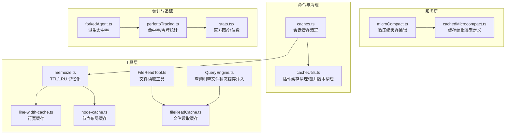
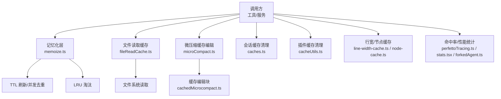
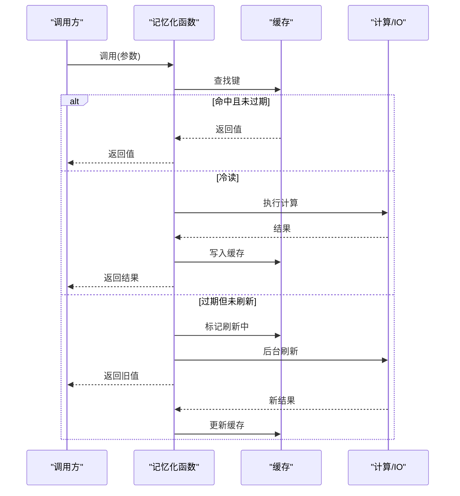
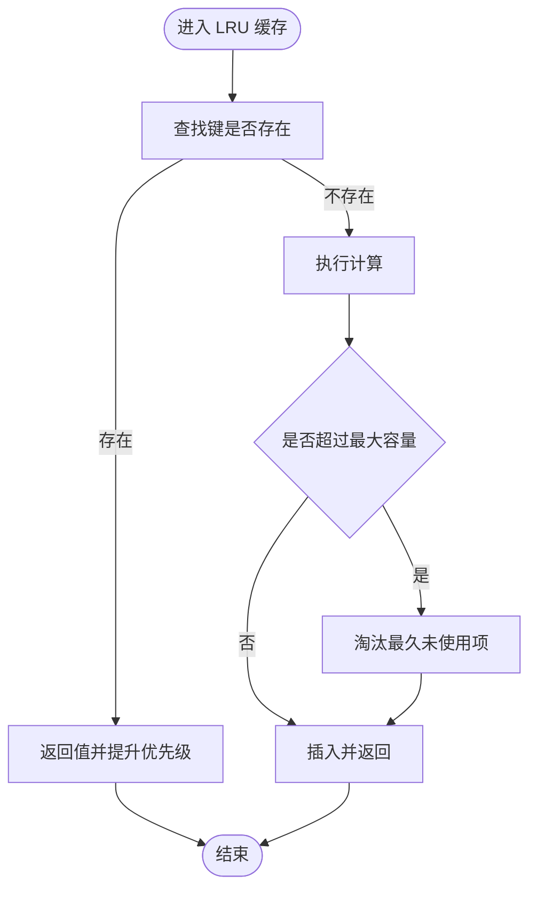
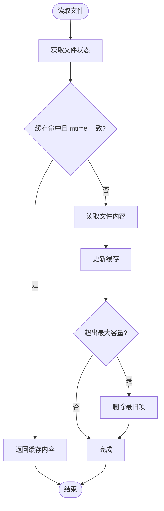
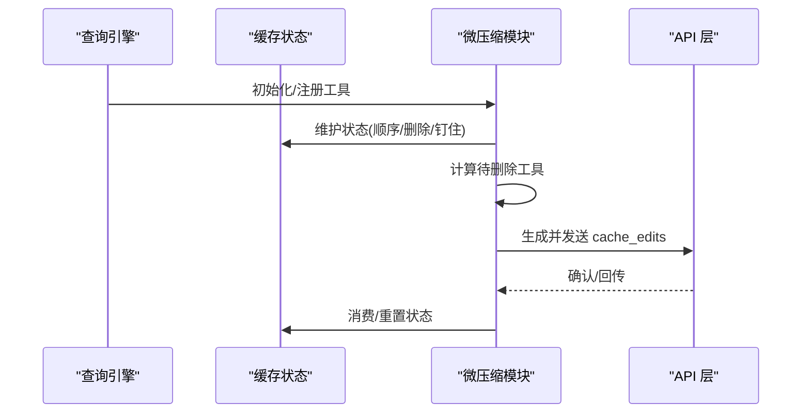
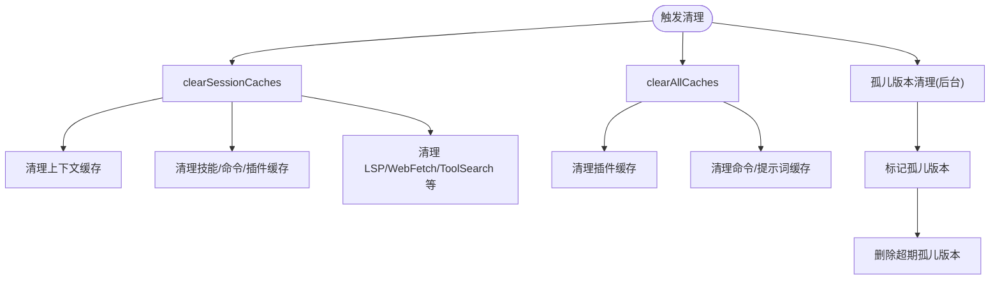
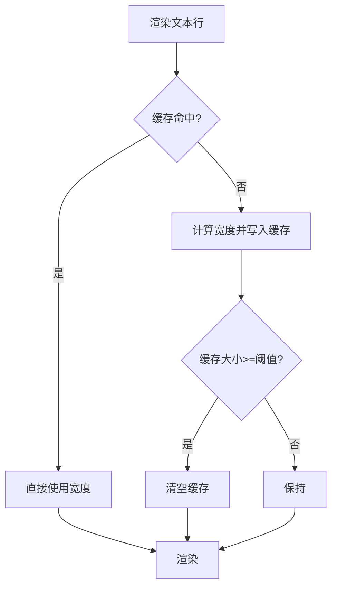
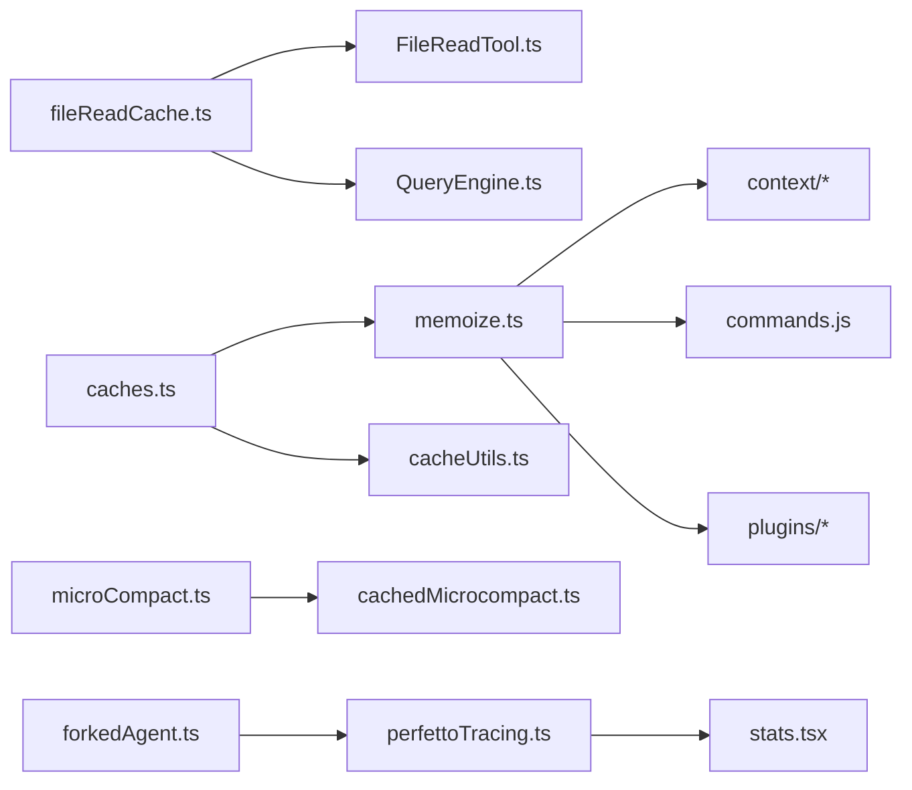

# 缓存策略与优化

<cite>
**本文引用的文件**
- [memoize.ts](file://src/utils/memoize.ts)
- [fileReadCache.ts](file://src/utils/fileReadCache.ts)
- [caches.ts](file://src/commands/clear/caches.ts)
- [cacheUtils.ts](file://src/utils/plugins/cacheUtils.ts)
- [microCompact.ts](file://src/services/compact/microCompact.ts)
- [cachedMicrocompact.ts](file://src/services/compact/cachedMicrocompact.ts)
- [line-width-cache.ts](file://src/ink/line-width-cache.ts)
- [node-cache.ts](file://src/ink/node-cache.ts)
- [perfettoTracing.ts](file://src/utils/telemetry/perfettoTracing.ts)
- [stats.tsx](file://src/context/stats.tsx)
- [forkedAgent.ts](file://src/utils/forkedAgent.ts)
- [FileReadTool.ts](file://src/tools/FileReadTool/FileReadTool.ts)
- [QueryEngine.ts](file://src/QueryEngine.ts)
</cite>

## 目录
1. [引言](#引言)
2. [项目结构](#项目结构)
3. [核心组件](#核心组件)
4. [架构总览](#架构总览)
5. [详细组件分析](#详细组件分析)
6. [依赖关系分析](#依赖关系分析)
7. [性能考量](#性能考量)
8. [故障排查指南](#故障排查指南)
9. [结论](#结论)
10. [附录](#附录)

## 引言
本文件系统性梳理 Claude Code 的缓存策略与优化体系，覆盖以下方面：
- 设计原理：写入直达（write-through）与 LRU 淘汰、并发去重与刷新保护、基于修改时间的自动失效
- 命中率优化：参数化 TTL、LRU 容量控制、热点键位管理、并发冷读去重
- 失效策略：TTL 过期、按需刷新、显式清理、插件版本孤儿清理
- 四类缓存实现：完成度缓存、文件读取缓存、文件状态缓存、工具模式缓存
- 内存与持久化：容量上限、逐出策略、后台清理、会话级清理
- 性能分析：命中率、吞吐、延迟、令牌消耗统计
- 一致性与并发：刷新保护、去重、清理一致性
- 预热机制：启动阶段的懒加载与预填充

## 项目结构
围绕缓存的关键模块分布如下：
- 工具层：通用记忆化与缓存工具（memoize、LRU、行宽缓存、节点布局缓存）
- 服务层：微压缩缓存编辑（cachedMicrocompact、microCompact）
- 命令与清理：会话级缓存清理入口（caches.ts）、插件缓存清理（cacheUtils.ts）
- 工具层：文件读取缓存与去重（FileReadTool、fileReadCache）
- 统计与追踪：命中率与性能指标（perfettoTracing、stats.tsx、forkedAgent）

**图表来源**
- [memoize.ts:1-270](file://src/utils/memoize.ts#L1-L270)
- [fileReadCache.ts:1-97](file://src/utils/fileReadCache.ts#L1-L97)
- [caches.ts:1-145](file://src/commands/clear/caches.ts#L1-L145)
- [cacheUtils.ts:1-197](file://src/utils/plugins/cacheUtils.ts#L1-L197)
- [microCompact.ts:71-118](file://src/services/compact/microCompact.ts#L71-L118)
- [cachedMicrocompact.ts:1-38](file://src/services/compact/cachedMicrocompact.ts#L1-L38)
- [line-width-cache.ts:1-25](file://src/ink/line-width-cache.ts#L1-L25)
- [node-cache.ts:1-55](file://src/ink/node-cache.ts#L1-L55)
- [perfettoTracing.ts:508-545](file://src/utils/telemetry/perfettoTracing.ts#L508-L545)
- [stats.tsx:38-88](file://src/context/stats.tsx#L38-L88)
- [forkedAgent.ts:665-689](file://src/utils/forkedAgent.ts#L665-L689)
- [FileReadTool.ts:523-550](file://src/tools/FileReadTool/FileReadTool.ts#L523-L550)
- [QueryEngine.ts:141-206](file://src/QueryEngine.ts#L141-L206)

**章节来源**
- [memoize.ts:1-270](file://src/utils/memoize.ts#L1-L270)
- [fileReadCache.ts:1-97](file://src/utils/fileReadCache.ts#L1-L97)
- [caches.ts:1-145](file://src/commands/clear/caches.ts#L1-L145)
- [cacheUtils.ts:1-197](file://src/utils/plugins/cacheUtils.ts#L1-L197)
- [microCompact.ts:71-118](file://src/services/compact/microCompact.ts#L71-L118)
- [cachedMicrocompact.ts:1-38](file://src/services/compact/cachedMicrocompact.ts#L1-L38)
- [line-width-cache.ts:1-25](file://src/ink/line-width-cache.ts#L1-L25)
- [node-cache.ts:1-55](file://src/ink/node-cache.ts#L1-L55)
- [perfettoTracing.ts:508-545](file://src/utils/telemetry/perfettoTracing.ts#L508-L545)
- [stats.tsx:38-88](file://src/context/stats.tsx#L38-L88)
- [forkedAgent.ts:665-689](file://src/utils/forkedAgent.ts#L665-L689)
- [FileReadTool.ts:523-550](file://src/tools/FileReadTool/FileReadTool.ts#L523-L550)
- [QueryEngine.ts:141-206](file://src/QueryEngine.ts#L141-L206)

## 核心组件
- 记忆化与 TTL 刷新：支持同步/异步函数的记忆化，带过期刷新与并发去重，避免重复计算与竞态
- LRU 缓存：限制最大条目数，按最近最少使用淘汰，防止内存无限增长
- 文件读取缓存：以路径+修改时间作为键，自动失效；超过容量时逐出最旧项
- 微压缩缓存编辑：在对话中记录工具结果，生成 cache_edits 块，用于后续请求复用
- 会话级缓存清理：集中清理上下文、技能、插件、LSP 等缓存，确保会话恢复时新鲜数据
- 插件缓存清理与孤儿版本回收：清理无效版本并定期回收长时间未使用的插件缓存
- 行宽与节点布局缓存：渲染路径上的热点测量与布局缓存，降低重复计算
- 命中率与性能指标：从令牌统计推导命中率，结合直方图与分位数观测性能

**章节来源**
- [memoize.ts:29-107](file://src/utils/memoize.ts#L29-L107)
- [memoize.ts:120-220](file://src/utils/memoize.ts#L120-L220)
- [memoize.ts:234-270](file://src/utils/memoize.ts#L234-L270)
- [fileReadCache.ts:10-97](file://src/utils/fileReadCache.ts#L10-L97)
- [microCompact.ts:71-118](file://src/services/compact/microCompact.ts#L71-L118)
- [cachedMicrocompact.ts:4-38](file://src/services/compact/cachedMicrocompact.ts#L4-L38)
- [caches.ts:35-145](file://src/commands/clear/caches.ts#L35-L145)
- [cacheUtils.ts:26-50](file://src/utils/plugins/cacheUtils.ts#L26-L50)
- [cacheUtils.ts:74-116](file://src/utils/plugins/cacheUtils.ts#L74-L116)
- [line-width-cache.ts:1-25](file://src/ink/line-width-cache.ts#L1-L25)
- [node-cache.ts:1-55](file://src/ink/node-cache.ts#L1-L55)
- [perfettoTracing.ts:516-545](file://src/utils/telemetry/perfettoTracing.ts#L516-L545)
- [stats.tsx:38-88](file://src/context/stats.tsx#L38-L88)
- [forkedAgent.ts:665-689](file://src/utils/forkedAgent.ts#L665-L689)

## 架构总览
下图展示缓存相关模块之间的交互关系与数据流。

**图表来源**
- [memoize.ts:1-270](file://src/utils/memoize.ts#L1-L270)
- [fileReadCache.ts:1-97](file://src/utils/fileReadCache.ts#L1-L97)
- [microCompact.ts:71-118](file://src/services/compact/microCompact.ts#L71-L118)
- [cachedMicrocompact.ts:1-38](file://src/services/compact/cachedMicrocompact.ts#L1-L38)
- [caches.ts:1-145](file://src/commands/clear/caches.ts#L1-L145)
- [cacheUtils.ts:1-197](file://src/utils/plugins/cacheUtils.ts#L1-L197)
- [line-width-cache.ts:1-25](file://src/ink/line-width-cache.ts#L1-L25)
- [node-cache.ts:1-55](file://src/ink/node-cache.ts#L1-L55)
- [perfettoTracing.ts:508-545](file://src/utils/telemetry/perfettoTracing.ts#L508-L545)
- [stats.tsx:38-88](file://src/context/stats.tsx#L38-L88)
- [forkedAgent.ts:665-689](file://src/utils/forkedAgent.ts#L665-L689)

## 详细组件分析

### TTL 记忆化与并发去重
- 设计要点
  - 写入直达：首次调用直接计算并写入缓存
  - 过期刷新：缓存过期后返回旧值，同时在后台刷新新值
  - 并发去重：同一键的冷读仅触发一次计算，其他调用共享结果
  - 刷新保护：避免多个并发刷新导致的数据竞争
- 关键行为
  - 同步版本：立即返回计算结果或旧值，后台更新
  - 异步版本：并发冷读共享同一个 Promise，避免重复 IO
  - 清理：支持清空缓存与在飞列表（in-flight）的清理
- 参数与默认值
  - TTL 默认 5 分钟（可配置）
  - LRU 最大容量默认 100（可配置）
- 并发与一致性
  - 使用标识守卫（identity-guard）确保清理与刷新的一致性
  - in-flight 去重避免重复外部调用（如认证刷新）

**图表来源**
- [memoize.ts:40-107](file://src/utils/memoize.ts#L40-L107)
- [memoize.ts:120-220](file://src/utils/memoize.ts#L120-L220)

**章节来源**
- [memoize.ts:29-107](file://src/utils/memoize.ts#L29-L107)
- [memoize.ts:120-220](file://src/utils/memoize.ts#L120-L220)
- [memoize.ts:234-270](file://src/utils/memoize.ts#L234-L270)

### LRU 记忆化与容量控制
- 设计要点
  - 基于 lru-cache 的 LRU 实现，限制最大条目数
  - 提供 size/delete/get/has 等管理接口
  - 适用于消息处理等高并发场景，避免内存膨胀
- 参数与默认值
  - 默认最大容量 100（可按场景调整）
- 适用场景
  - 对象稳定、键空间可控的高频调用

**图表来源**
- [memoize.ts:234-270](file://src/utils/memoize.ts#L234-L270)

**章节来源**
- [memoize.ts:234-270](file://src/utils/memoize.ts#L234-L270)

### 文件读取缓存与自动失效
- 设计要点
  - 键：文件路径
  - 失效条件：文件修改时间变化
  - 自动逐出：超过最大容量时删除最旧项
  - 统计接口：获取当前大小与键列表
- 适用场景
  - 文件编辑/读取频繁、内容变更不频繁的场景
- 与工具层集成
  - FileReadTool 在同次会话内对相同范围的重复读取进行去重

**图表来源**
- [fileReadCache.ts:10-97](file://src/utils/fileReadCache.ts#L10-L97)
- [FileReadTool.ts:523-550](file://src/tools/FileReadTool/FileReadTool.ts#L523-L550)

**章节来源**
- [fileReadCache.ts:10-97](file://src/utils/fileReadCache.ts#L10-L97)
- [FileReadTool.ts:523-550](file://src/tools/FileReadTool/FileReadTool.ts#L523-L550)

### 微压缩缓存编辑（完成度缓存）
- 设计要点
  - 维护工具注册、顺序、已删除引用、已钉住的缓存编辑块
  - 生成 cache_edits 块，用于后续请求复用
  - 支持消费/钉住/重置状态，配合通知机制检测缓存破坏
- 关键接口
  - 创建状态、注册工具、计算待删工具、生成编辑块、消费/钉住编辑
- 与查询引擎集成
  - 通过 QueryEngine 注入文件状态缓存实例，统一管理

**图表来源**
- [microCompact.ts:71-118](file://src/services/compact/microCompact.ts#L71-L118)
- [cachedMicrocompact.ts:4-38](file://src/services/compact/cachedMicrocompact.ts#L4-L38)
- [QueryEngine.ts:141-206](file://src/QueryEngine.ts#L141-L206)

**章节来源**
- [microCompact.ts:71-118](file://src/services/compact/microCompact.ts#L71-L118)
- [cachedMicrocompact.ts:1-38](file://src/services/compact/cachedMicrocompact.ts#L1-L38)
- [QueryEngine.ts:141-206](file://src/QueryEngine.ts#L141-L206)

### 会话级缓存清理与持久化策略
- 设计要点
  - 集中清理：上下文、技能、插件、LSP、WebFetch、ToolSearch、Agent 定义、输出样式等
  - 会话恢复：清理后重新探测文件/技能，确保新鲜数据
  - 持久化：插件缓存清理与孤儿版本回收，定期删除长期未使用的版本
- 关键流程
  - clearSessionCaches：清理会话相关缓存
  - clearAllCaches：清理全部缓存
  - 后台孤儿版本清理：标记并删除超过 7 天的孤儿版本

**图表来源**
- [caches.ts:35-145](file://src/commands/clear/caches.ts#L35-L145)
- [cacheUtils.ts:26-50](file://src/utils/plugins/cacheUtils.ts#L26-L50)
- [cacheUtils.ts:74-116](file://src/utils/plugins/cacheUtils.ts#L74-L116)

**章节来源**
- [caches.ts:35-145](file://src/commands/clear/caches.ts#L35-L145)
- [cacheUtils.ts:26-50](file://src/utils/plugins/cacheUtils.ts#L26-L50)
- [cacheUtils.ts:74-116](file://src/utils/plugins/cacheUtils.ts#L74-L116)

### 行宽与节点布局缓存（渲染路径）
- 设计要点
  - 行宽缓存：每行字符串宽度缓存，超过阈值全清，避免无限增长
  - 节点布局缓存：DOM 元素到布局信息的弱映射，支持挂起清除区域
- 适用场景
  - 流式渲染、滚动视口、频繁重绘的 UI 场景

**图表来源**
- [line-width-cache.ts:1-25](file://src/ink/line-width-cache.ts#L1-L25)
- [node-cache.ts:1-55](file://src/ink/node-cache.ts#L1-L55)

**章节来源**
- [line-width-cache.ts:1-25](file://src/ink/line-width-cache.ts#L1-L25)
- [node-cache.ts:1-55](file://src/ink/node-cache.ts#L1-L55)

## 依赖关系分析
- 组件耦合
  - 记忆化工具被广泛用于上下文、技能、插件等模块，形成高内聚低耦合
  - 文件读取缓存与 FileReadTool 强耦合，确保读取去重与一致性
  - 微压缩缓存编辑与查询引擎耦合，用于对话上下文复用
- 外部依赖
  - lru-cache 用于 LRU 实现
  - 文件系统 API 用于文件读取与统计
- 潜在循环依赖
  - 缓存清理模块之间通过功能开关与动态导入解耦，避免循环

**图表来源**
- [memoize.ts:1-270](file://src/utils/memoize.ts#L1-L270)
- [fileReadCache.ts:1-97](file://src/utils/fileReadCache.ts#L1-L97)
- [FileReadTool.ts:523-550](file://src/tools/FileReadTool/FileReadTool.ts#L523-L550)
- [QueryEngine.ts:141-206](file://src/QueryEngine.ts#L141-L206)
- [microCompact.ts:71-118](file://src/services/compact/microCompact.ts#L71-L118)
- [cachedMicrocompact.ts:1-38](file://src/services/compact/cachedMicrocompact.ts#L1-L38)
- [caches.ts:1-145](file://src/commands/clear/caches.ts#L1-L145)
- [cacheUtils.ts:1-197](file://src/utils/plugins/cacheUtils.ts#L1-L197)
- [perfettoTracing.ts:508-545](file://src/utils/telemetry/perfettoTracing.ts#L508-L545)
- [stats.tsx:38-88](file://src/context/stats.tsx#L38-L88)
- [forkedAgent.ts:665-689](file://src/utils/forkedAgent.ts#L665-L689)

**章节来源**
- [memoize.ts:1-270](file://src/utils/memoize.ts#L1-L270)
- [fileReadCache.ts:1-97](file://src/utils/fileReadCache.ts#L1-L97)
- [FileReadTool.ts:523-550](file://src/tools/FileReadTool/FileReadTool.ts#L523-L550)
- [QueryEngine.ts:141-206](file://src/QueryEngine.ts#L141-L206)
- [microCompact.ts:71-118](file://src/services/compact/microCompact.ts#L71-L118)
- [cachedMicrocompact.ts:1-38](file://src/services/compact/cachedMicrocompact.ts#L1-L38)
- [caches.ts:1-145](file://src/commands/clear/caches.ts#L1-L145)
- [cacheUtils.ts:1-197](file://src/utils/plugins/cacheUtils.ts#L1-L197)
- [perfettoTracing.ts:508-545](file://src/utils/telemetry/perfettoTracing.ts#L508-L545)
- [stats.tsx:38-88](file://src/context/stats.tsx#L38-L88)
- [forkedAgent.ts:665-689](file://src/utils/forkedAgent.ts#L665-L689)

## 性能考量
- 命中率优化
  - TTL 与 LRU 双重保障：TTL 保证时效性，LRU 控制内存占用
  - 并发去重减少重复 IO，提升吞吐
  - 文件读取缓存按 mtime 自动失效，避免脏读
- 性能指标
  - 命中率：cache_hit_rate_pct = cache_read_tokens / prompt_tokens
  - 吞吐：ITPS/OTPS（输入/输出令牌每秒）
  - 直方图与分位数：观察延迟与资源使用分布
- 参数调优建议
  - TTL：根据模型响应稳定性与数据更新频率调整（默认 5 分钟）
  - LRU 容量：根据对话长度与消息处理复杂度调整（默认 100）
  - 文件读取缓存容量：根据项目规模与编辑频率调整（默认 1000）
  - 行宽缓存阈值：根据渲染帧率与文本多样性调整（默认 4096）

**章节来源**
- [perfettoTracing.ts:516-545](file://src/utils/telemetry/perfettoTracing.ts#L516-L545)
- [stats.tsx:38-88](file://src/context/stats.tsx#L38-L88)
- [memoize.ts:234-270](file://src/utils/memoize.ts#L234-L270)
- [fileReadCache.ts:14-16](file://src/utils/fileReadCache.ts#L14-L16)
- [line-width-cache.ts:8-8](file://src/ink/line-width-cache.ts#L8-L8)

## 故障排查指南
- 命中率异常
  - 检查 TTL 是否过短或过长；确认是否频繁清理导致缓存未命中
  - 观察 LRU 容量是否过小，导致热点键被频繁淘汰
- 数据不一致
  - 文件读取缓存依赖 mtime，确认文件系统时间戳正确
  - 记忆化刷新保护与清理一致性，避免清理后旧值被误用
- 内存增长
  - 检查 LRU 容量与 TTL 设置；确认无泄漏（in-flight 清理）
  - 使用统计接口查看缓存大小与键集合
- 插件缓存问题
  - 执行孤儿版本清理，检查插件目录权限与磁盘空间
  - 通过 clearAllCaches 或 clearSessionCaches 重置缓存

**章节来源**
- [memoize.ts:120-220](file://src/utils/memoize.ts#L120-L220)
- [fileReadCache.ts:35-68](file://src/utils/fileReadCache.ts#L35-L68)
- [cacheUtils.ts:74-116](file://src/utils/plugins/cacheUtils.ts#L74-L116)
- [caches.ts:35-145](file://src/commands/clear/caches.ts#L35-L145)

## 结论
本缓存体系通过 TTL 刷新、LRU 淘汰、并发去重与自动失效等机制，在保证数据一致性的同时显著提升了性能与资源利用率。针对不同场景（文件读取、工具调用、渲染路径、对话上下文），采用差异化策略与参数调优，可进一步提升命中率与吞吐。配套的清理与统计能力为运维与优化提供了坚实支撑。

## 附录
- 关键参数与默认值
  - TTL 默认 5 分钟
  - LRU 默认容量 100
  - 文件读取缓存默认容量 1000
  - 行宽缓存阈值 4096
- 相关实现路径
  - 记忆化与 LRU：[memoize.ts:1-270](file://src/utils/memoize.ts#L1-L270)
  - 文件读取缓存：[fileReadCache.ts:1-97](file://src/utils/fileReadCache.ts#L1-L97)
  - 会话缓存清理：[caches.ts:1-145](file://src/commands/clear/caches.ts#L1-L145)
  - 插件缓存清理与孤儿版本回收：[cacheUtils.ts:1-197](file://src/utils/plugins/cacheUtils.ts#L1-L197)
  - 微压缩缓存编辑：[microCompact.ts:71-118](file://src/services/compact/microCompact.ts#L71-L118)、[cachedMicrocompact.ts:1-38](file://src/services/compact/cachedMicrocompact.ts#L1-L38)
  - 行宽与节点缓存：[line-width-cache.ts:1-25](file://src/ink/line-width-cache.ts#L1-L25)、[node-cache.ts:1-55](file://src/ink/node-cache.ts#L1-L55)
  - 命中率与性能统计：[perfettoTracing.ts:508-545](file://src/utils/telemetry/perfettoTracing.ts#L508-L545)、[stats.tsx:38-88](file://src/context/stats.tsx#L38-L88)、[forkedAgent.ts:665-689](file://src/utils/forkedAgent.ts#L665-L689)