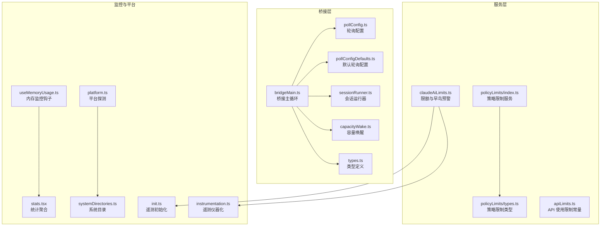
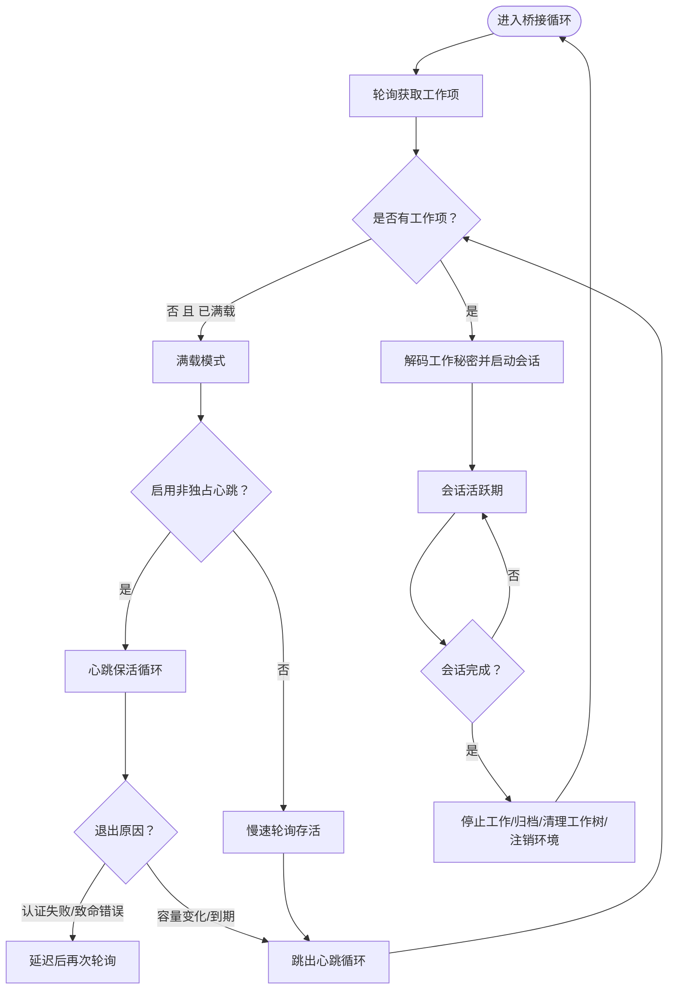
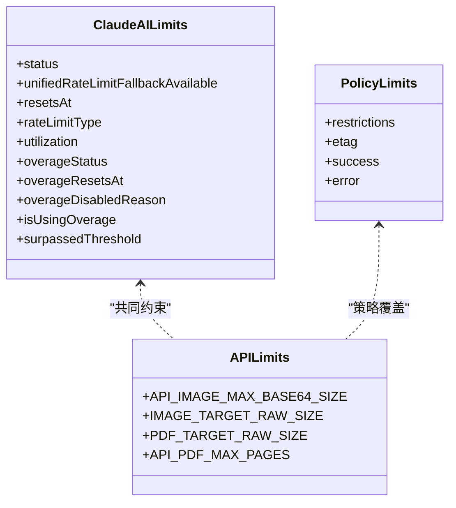
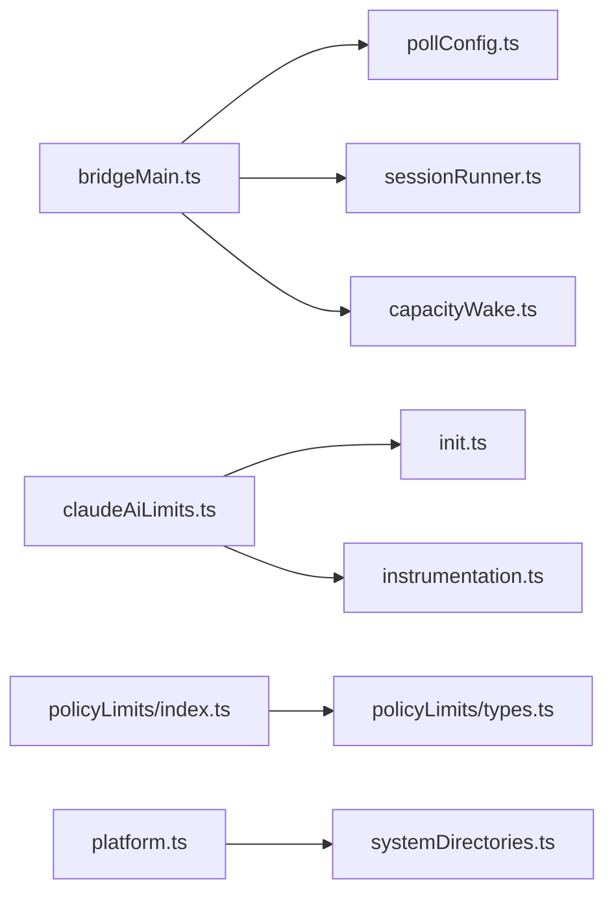

# 资源管理与控制

<cite>
**本文引用的文件**
- [bridgeMain.ts](file://src/bridge/bridgeMain.ts)
- [pollConfig.ts](file://src/bridge/pollConfig.ts)
- [pollConfigDefaults.ts](file://src/bridge/pollConfigDefaults.ts)
- [sessionRunner.ts](file://src/bridge/sessionRunner.ts)
- [capacityWake.ts](file://src/bridge/capacityWake.ts)
- [types.ts](file://src/bridge/types.ts)
- [claudeAiLimits.ts](file://src/services/claudeAiLimits.ts)
- [policyLimits/index.ts](file://src/services/policyLimits/index.ts)
- [policyLimits/types.ts](file://src/services/policyLimits/types.ts)
- [apiLimits.ts](file://src/constants/apiLimits.ts)
- [useMemoryUsage.ts](file://src/hooks/useMemoryUsage.ts)
- [init.ts](file://src/entrypoints/init.ts)
- [instrumentation.ts](file://src/utils/telemetry/instrumentation.ts)
- [stats.tsx](file://src/context/stats.tsx)
- [platform.ts](file://src/utils/platform.ts)
- [systemDirectories.ts](file://src/utils/systemDirectories.ts)
</cite>

## 目录
1. [引言](#引言)
2. [项目结构](#项目结构)
3. [核心组件](#核心组件)
4. [架构总览](#架构总览)
5. [详细组件分析](#详细组件分析)
6. [依赖关系分析](#依赖关系分析)
7. [性能考量](#性能考量)
8. [故障排查指南](#故障排查指南)
9. [结论](#结论)
10. [附录](#附录)

## 引言
本文件面向 Claude Code 的资源管理与控制系统，聚焦以下主题：
- 并发会话管理：多会话并发上限、心跳与轮询策略、容量唤醒机制
- 活动资源监控：内存使用状态、遥测指标采集与导出
- 空闲超时控制：会话超时、轮询节流、睡眠检测与恢复
- 资源使用限制：API 媒体大小限制、限额阈值与早鸟预警、策略限制缓存
- 并发控制策略：多会话模式下的轮询间隔、容量阈值、回退重试
- 资源回收机制：会话结束清理、工作项停止、工作树清理、环境注销
- 系统资源保护：内存阈值告警、失败快速退避、资源清理与幂等操作
- 性能优先级调度：心跳与轮询组合、容量优先、节流与抖动
- 资源竞争处理：令牌刷新、权限请求、重复工作项跳过
- 不同平台的资源管理差异：平台探测、目录结构、WSL 特性
- 配置参数与调优：轮询配置、限额配置、调试与日志
- 故障恢复机制：认证失败重连、致命错误处理、后台轮询与缓存

## 项目结构
本系统围绕“桥接循环（bridgeMain）”组织资源管理逻辑，配合“轮询配置（pollConfig）”“会话运行器（sessionRunner）”“容量唤醒（capacityWake）”等模块实现多会话并发、资源回收与空闲控制；服务层提供限额与策略限制；工具层提供平台探测与系统目录。



图表来源
- [bridgeMain.ts:141-800](file://src/bridge/bridgeMain.ts#L141-L800)
- [pollConfig.ts:102-111](file://src/bridge/pollConfig.ts#L102-L111)
- [pollConfigDefaults.ts:55-83](file://src/bridge/pollConfigDefaults.ts#L55-L83)
- [sessionRunner.ts:248-551](file://src/bridge/sessionRunner.ts#L248-L551)
- [capacityWake.ts:28-57](file://src/bridge/capacityWake.ts#L28-L57)
- [types.ts:81-115](file://src/bridge/types.ts#L81-L115)
- [claudeAiLimits.ts:220-516](file://src/services/claudeAiLimits.ts#L220-L516)
- [policyLimits/index.ts:55-608](file://src/services/policyLimits/index.ts#L55-L608)
- [policyLimits/types.ts:8-27](file://src/services/policyLimits/types.ts#L8-L27)
- [apiLimits.ts:1-95](file://src/constants/apiLimits.ts#L1-L95)
- [useMemoryUsage.ts:1-39](file://src/hooks/useMemoryUsage.ts#L1-L39)
- [init.ts:288-340](file://src/entrypoints/init.ts#L288-L340)
- [instrumentation.ts:455-500](file://src/utils/telemetry/instrumentation.ts#L455-L500)
- [stats.tsx:38-88](file://src/context/stats.tsx#L38-L88)
- [platform.ts:11-49](file://src/utils/platform.ts#L11-L49)
- [systemDirectories.ts:27-40](file://src/utils/systemDirectories.ts#L27-L40)

章节来源
- [bridgeMain.ts:141-800](file://src/bridge/bridgeMain.ts#L141-L800)
- [pollConfig.ts:102-111](file://src/bridge/pollConfig.ts#L102-L111)
- [pollConfigDefaults.ts:55-83](file://src/bridge/pollConfigDefaults.ts#L55-L83)

## 核心组件
- 桥接主循环（bridgeMain.runBridgeLoop）
  - 维护活跃会话集合、会话开始时间、工作项映射、兼容会话 ID、入口令牌、定时器、完成工作集、工作树映射、超时会话集合、带标题会话集合、容量唤醒器
  - 实现心跳保活、令牌刷新、会话结束回调、工作项停止与归档、工作树清理、环境注销
- 轮询配置（getPollIntervalConfig）
  - 通过 GrowthBook 动态下发轮询间隔与容量策略，校验最小阈值与至少启用一个容量存活机制
- 会话运行器（createSessionSpawner）
  - 子进程会话 spawn、NDJSON 输出解析、活动追踪、权限请求转发、令牌更新、标准错误缓冲
- 容量唤醒（createCapacityWake）
  - 合并外层信号与容量唤醒信号，支持提前唤醒以响应会话结束或传输丢失
- 类型定义（types）
  - 桥接配置、会话句柄、客户端接口、工作秘密解码、权限响应事件等

章节来源
- [bridgeMain.ts:163-591](file://src/bridge/bridgeMain.ts#L163-L591)
- [pollConfig.ts:102-111](file://src/bridge/pollConfig.ts#L102-L111)
- [sessionRunner.ts:248-551](file://src/bridge/sessionRunner.ts#L248-L551)
- [capacityWake.ts:28-57](file://src/bridge/capacityWake.ts#L28-L57)
- [types.ts:81-263](file://src/bridge/types.ts#L81-L263)

## 架构总览
下图展示桥接主循环在多会话模式下的并发控制、心跳与轮询、容量唤醒与会话回收的整体流程。

```mermaid
sequenceDiagram
participant Loop as "桥接循环"
participant API as "桥接API客户端"
participant HB as "心跳保活"
participant SR as "会话运行器"
participant CW as "容量唤醒"
Loop->>API : "轮询获取工作项"
alt 无工作项且已满载
Loop->>HB : "心跳保活可选"
HB-->>Loop : "返回结果ok/auth_failed/fatal/failed"
opt 认证失败或致命错误
Loop->>Loop : "延迟后再次轮询"
end
Loop->>CW : "创建容量信号"
CW-->>Loop : "等待容量释放或中断"
else 有工作项
Loop->>SR : "解码工作秘密并启动会话"
SR-->>Loop : "会话活动与权限请求"
Loop->>API : "确认工作项并发送心跳"
Loop->>Loop : "处理会话完成停止工作/归档/清理"
end
```

图表来源
- [bridgeMain.ts:600-784](file://src/bridge/bridgeMain.ts#L600-L784)
- [bridgeMain.ts:196-270](file://src/bridge/bridgeMain.ts#L196-L270)
- [sessionRunner.ts:248-551](file://src/bridge/sessionRunner.ts#L248-L551)
- [capacityWake.ts:36-53](file://src/bridge/capacityWake.ts#L36-L53)

## 详细组件分析

### 并发会话管理与空闲超时控制
- 多会话并发上限
  - 通过配置中的 maxSessions 控制最大并发会话数
  - 在桥接循环中实时检查 activeSessions.size 与 maxSessions 的关系，决定是否进入“满载”模式
- 心跳与轮询策略
  - 当 atCapacity 且启用非独占心跳时，循环在心跳周期内定期轮询以维持存活
  - 当 atCapacity 且未启用心跳但启用了 atCapMs，则以慢速轮询作为存活信号
  - 非满载时根据 partial/not-at-capacity 间隔进行轮询
- 容量唤醒
  - 会话结束触发 capacityWake.wake()，合并信号立即退出 at-capacity 睡眠，尽快接受新工作
- 空闲超时控制
  - 会话句柄提供 kill()/forceKill()，用于超时或中断场景下的强制回收
  - 会话结束回调中区分“超时杀死”与“服务器/关闭中断”，确保正确处理与清理



图表来源
- [bridgeMain.ts:635-784](file://src/bridge/bridgeMain.ts#L635-L784)
- [bridgeMain.ts:442-591](file://src/bridge/bridgeMain.ts#L442-L591)
- [sessionRunner.ts:448-480](file://src/bridge/sessionRunner.ts#L448-L480)

章节来源
- [bridgeMain.ts:635-784](file://src/bridge/bridgeMain.ts#L635-L784)
- [bridgeMain.ts:442-591](file://src/bridge/bridgeMain.ts#L442-L591)
- [sessionRunner.ts:448-543](file://src/bridge/sessionRunner.ts#L448-L543)

### 资源使用限制与限额策略
- API 使用限制（媒体与请求）
  - 图像与 PDF 的客户端侧目标尺寸与页数限制，避免超过 API 端硬限制
- 限额与早鸟预警（Claude AI）
  - 基于响应头的统一限额状态、重置时间、替代模型可用性
  - 支持“阈值超越”头部与基于时间窗口的客户端计算两种早鸟预警路径
  - 提供监听器机制与状态变更事件，便于 UI 与日志联动
- 策略限制（组织级）
  - 从远端拉取策略限制，本地缓存与 ETag 校验，失败开路（不阻塞）
  - 后台轮询更新，支持登录态切换后的刷新与缓存清理



图表来源
- [claudeAiLimits.ts:122-136](file://src/services/claudeAiLimits.ts#L122-L136)
- [claudeAiLimits.ts:454-485](file://src/services/claudeAiLimits.ts#L454-L485)
- [policyLimits/index.ts:432-455](file://src/services/policyLimits/index.ts#L432-L455)
- [apiLimits.ts:17-95](file://src/constants/apiLimits.ts#L17-L95)

章节来源
- [claudeAiLimits.ts:220-516](file://src/services/claudeAiLimits.ts#L220-L516)
- [policyLimits/index.ts:55-608](file://src/services/policyLimits/index.ts#L55-L608)
- [apiLimits.ts:1-95](file://src/constants/apiLimits.ts#L1-L95)

### 资源回收与生命周期管理
- 会话完成回调（onSessionDone）
  - 清理定时器、令牌刷新、容量唤醒、工作树、归档会话、注销环境
  - 区分“超时杀死”与“服务器/关闭中断”，避免重复记录失败
- 工作项停止与幂等
  - stopWorkWithRetry 基于指数退避与抖动，防止风暴重试
  - completedWorkIds 集合避免重复工作项导致的重复会话创建
- 环境注销
  - 单会话模式下，会话完成后终止轮询循环并注销环境
  - 多会话模式下仅归档，保持环境持续可用

章节来源
- [bridgeMain.ts:442-591](file://src/bridge/bridgeMain.ts#L442-L591)
- [bridgeMain.ts:524-533](file://src/bridge/bridgeMain.ts#L524-L533)
- [bridgeMain.ts:758-784](file://src/bridge/bridgeMain.ts#L758-L784)

### 系统资源保护与性能优先级调度
- 内存使用监控
  - 10 秒轮询一次，超过阈值（高/危）才渲染通知，避免高频重绘
- 遥测与指标导出
  - 初始化时按需加载遥测仪器化，支持 OTLP 与 BigQuery 导出
  - 会话计数器在初始化后增量，确保启动路径不会遗漏
- 平台差异与目录结构
  - 平台探测区分 macOS、Windows、WSL、Linux，WSL 注入版本属性
  - 跨平台系统目录（桌面、文档、下载）统一抽象，适配不同平台

章节来源
- [useMemoryUsage.ts:1-39](file://src/hooks/useMemoryUsage.ts#L1-L39)
- [init.ts:288-340](file://src/entrypoints/init.ts#L288-L340)
- [instrumentation.ts:455-500](file://src/utils/telemetry/instrumentation.ts#L455-L500)
- [platform.ts:11-49](file://src/utils/platform.ts#L11-L49)
- [systemDirectories.ts:27-40](file://src/utils/systemDirectories.ts#L27-L40)

### 资源竞争处理与异常占用检测
- 权限请求与令牌刷新
  - 会话运行器捕获 control_request，转发至服务器审批
  - 令牌刷新调度器在 v1 与 v2 会话间采用不同策略（OAuth 直传 vs reconnectSession）
- 重复工作项检测
  - completedWorkIds 集合跳过已结束的工作项，避免重复会话
- 认证失败与致命错误
  - 心跳失败触发 reconnectSession，致命错误（404/410）避免无限重试
- 资源清理与幂等
  - 归档、停止、清理均幂等，避免重复操作造成副作用

章节来源
- [sessionRunner.ts:417-444](file://src/bridge/sessionRunner.ts#L417-L444)
- [sessionRunner.ts:284-313](file://src/bridge/sessionRunner.ts#L284-L313)
- [bridgeMain.ts:244-262](file://src/bridge/bridgeMain.ts#L244-L262)
- [bridgeMain.ts:758-784](file://src/bridge/bridgeMain.ts#L758-L784)

### 配置参数与性能调优
- 轮询配置（GrowthBook）
  - not_at_capacity/partial_capacity/at_capacity 三档间隔
  - 非独占心跳间隔与 at-capacity 存活开关
  - reclaim_older_than_ms 与 session_keepalive_interval_v2_ms
- 默认轮询配置
  - 单/多会话默认值一致，保证现有配置平滑演进
- 限额配置
  - EARLY_WARNING_CONFIGS 与 EARLY_WARNING_CLAIM_MAP 提供早鸟预警优先级
  - 策略限制缓存与后台轮询，减少网络开销

章节来源
- [pollConfig.ts:28-92](file://src/bridge/pollConfig.ts#L28-L92)
- [pollConfigDefaults.ts:55-83](file://src/bridge/pollConfigDefaults.ts#L55-L83)
- [claudeAiLimits.ts:53-70](file://src/services/claudeAiLimits.ts#L53-L70)
- [policyLimits/index.ts:55-70](file://src/services/policyLimits/index.ts#L55-L70)

### 故障恢复机制
- 认证失败重连
  - 心跳失败触发 reconnectSession，等待服务器重新派发工作
- 致命错误处理
  - 404/410 环境过期或删除，避免无效重试，等待外部干预
- 后台轮询与缓存
  - 策略限制服务后台轮询，失败开路，使用缓存维持功能可用
- 超时与中断
  - 会话超时标记为“failed”，避免与“服务器/关闭中断”混淆
  - 容量唤醒确保会话结束后尽快恢复轮询

章节来源
- [bridgeMain.ts:244-262](file://src/bridge/bridgeMain.ts#L244-L262)
- [bridgeMain.ts:690-713](file://src/bridge/bridgeMain.ts#L690-L713)
- [policyLimits/index.ts:613-663](file://src/services/policyLimits/index.ts#L613-L663)

## 依赖关系分析
- 模块耦合
  - bridgeMain 依赖 pollConfig 获取动态轮询配置，依赖 sessionRunner 创建会话，依赖 capacityWake 进行容量唤醒
  - claudeAiLimits 与 policyLimits 分别提供服务端限额与策略限制，二者共同影响资源使用边界
- 外部依赖
  - 平台探测与系统目录为跨平台适配提供基础
  - 遥测系统按需加载，避免冷启动开销



图表来源
- [bridgeMain.ts:1-150](file://src/bridge/bridgeMain.ts#L1-L150)
- [pollConfig.ts:102-111](file://src/bridge/pollConfig.ts#L102-L111)
- [sessionRunner.ts:248-340](file://src/bridge/sessionRunner.ts#L248-L340)
- [capacityWake.ts:28-57](file://src/bridge/capacityWake.ts#L28-L57)
- [claudeAiLimits.ts:220-250](file://src/services/claudeAiLimits.ts#L220-L250)
- [init.ts:288-340](file://src/entrypoints/init.ts#L288-L340)
- [instrumentation.ts:455-500](file://src/utils/telemetry/instrumentation.ts#L455-L500)
- [policyLimits/index.ts:55-84](file://src/services/policyLimits/index.ts#L55-L84)
- [policyLimits/types.ts:8-27](file://src/services/policyLimits/types.ts#L8-L27)
- [platform.ts:11-49](file://src/utils/platform.ts#L11-L49)
- [systemDirectories.ts:27-40](file://src/utils/systemDirectories.ts#L27-L40)

## 性能考量
- 节流与抖动
  - 轮询间隔最小阈值与 at-capacity 存活开关，避免空转与风暴重试
  - 事件上传器对 Retry-After 与指数退避进行抖动，缓解羊群效应
- 内存与渲染优化
  - 内存监控仅在高/危阈值时渲染，降低 UI 重绘频率
- 平台差异化
  - WSL 注入架构信息，便于定位性能问题与资源分配差异

章节来源
- [pollConfig.ts:25-92](file://src/bridge/pollConfig.ts#L25-L92)
- [SerialBatchEventUploader.ts:235-275](file://src/cli/transports/SerialBatchEventUploader.ts#L235-L275)
- [useMemoryUsage.ts:18-39](file://src/hooks/useMemoryUsage.ts#L18-L39)
- [instrumentation.ts:478-484](file://src/utils/telemetry/instrumentation.ts#L478-L484)

## 故障排查指南
- 会话无法启动
  - 检查工作秘密解码与会话令牌，关注 stderr 缓冲与权限请求
- 认证失败或心跳失败
  - 观察 reconnectSession 是否被触发，确认 JWT 刷新策略（v1 直传 vs v2 reconnect）
- 致命错误（404/410）
  - 环境过期或删除，避免无限重试；等待外部干预或重建环境
- 超时与中断
  - “超时杀死”标记为 failed，避免与“服务器/关闭中断”混淆
- 策略限制与限额
  - 查看策略限制缓存与后台轮询状态，必要时手动刷新或清理缓存

章节来源
- [sessionRunner.ts:417-444](file://src/bridge/sessionRunner.ts#L417-L444)
- [bridgeMain.ts:244-262](file://src/bridge/bridgeMain.ts#L244-L262)
- [policyLimits/index.ts:581-590](file://src/services/policyLimits/index.ts#L581-L590)

## 结论
本系统通过“桥接主循环 + 动态轮询配置 + 会话运行器 + 容量唤醒”的组合，实现了稳健的多会话并发管理与资源回收；结合限额与策略限制服务，形成从服务端到客户端的资源边界控制；通过内存监控、遥测与平台适配，保障在不同平台与负载下的稳定性与可观测性。建议在生产环境中：
- 使用 GrowthBook 动态调整轮询与容量策略
- 关注早鸟预警与策略限制变化，及时调整会话并发度
- 启用容量唤醒与幂等清理，确保会话结束后的快速恢复
- 对关键路径（心跳、轮询、令牌刷新）进行监控与告警

## 附录
- 平台与目录
  - 平台探测与 WSL 版本注入
  - 跨平台系统目录抽象
- 遥测与统计
  - 遥测初始化与导出
  - 统计聚合与直方图采样

章节来源
- [platform.ts:11-49](file://src/utils/platform.ts#L11-L49)
- [systemDirectories.ts:27-40](file://src/utils/systemDirectories.ts#L27-L40)
- [init.ts:288-340](file://src/entrypoints/init.ts#L288-L340)
- [instrumentation.ts:455-500](file://src/utils/telemetry/instrumentation.ts#L455-L500)
- [stats.tsx:38-88](file://src/context/stats.tsx#L38-L88)