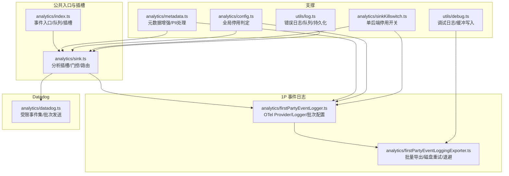
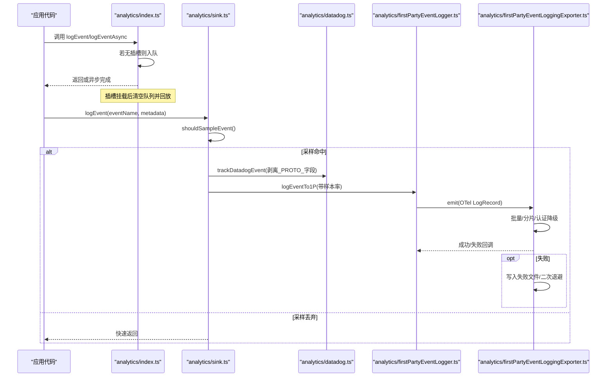
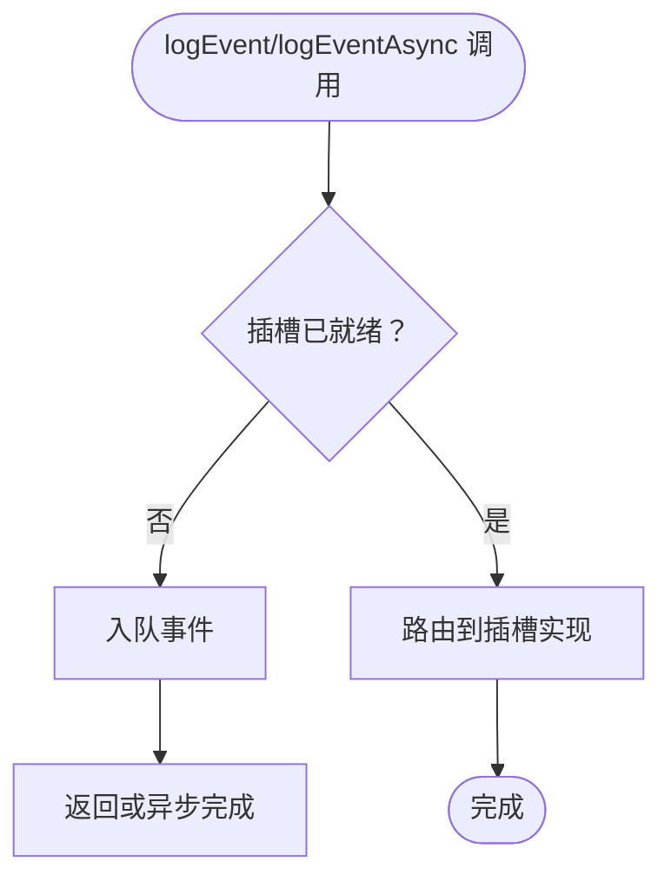
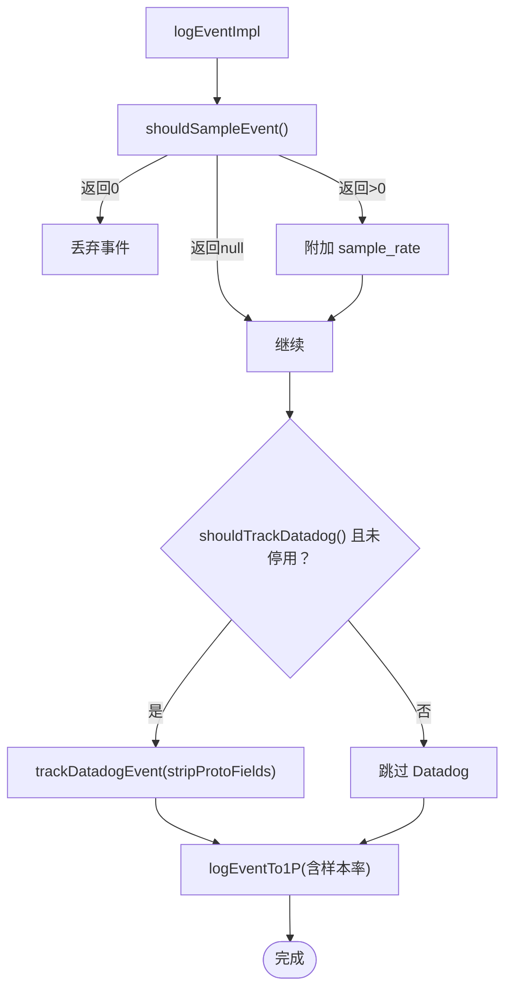
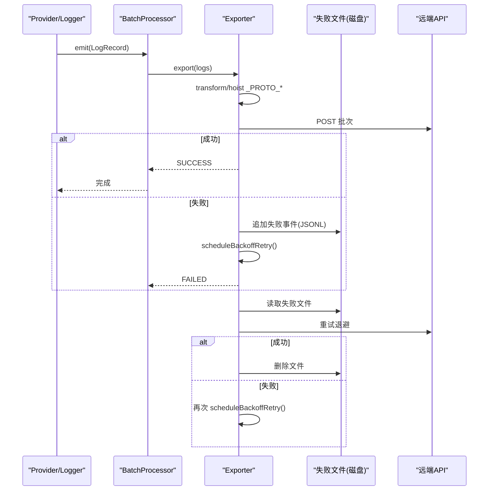
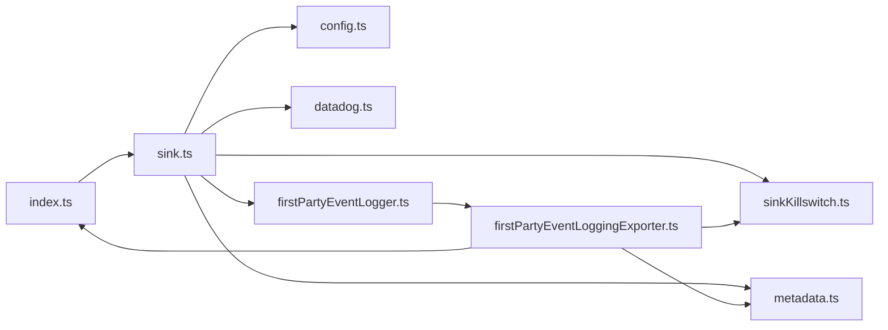

# 事件日志系统

<cite>
**本文引用的文件**   
- [src/services/analytics/index.ts](file://src/services/analytics/index.ts)
- [src/services/analytics/sink.ts](file://src/services/analytics/sink.ts)
- [src/services/analytics/firstPartyEventLogger.ts](file://src/services/analytics/firstPartyEventLogger.ts)
- [src/services/analytics/firstPartyEventLoggingExporter.ts](file://src/services/analytics/firstPartyEventLoggingExporter.ts)
- [src/services/analytics/metadata.ts](file://src/services/analytics/metadata.ts)
- [src/services/analytics/config.ts](file://src/services/analytics/config.ts)
- [src/services/analytics/datadog.ts](file://src/services/analytics/datadog.ts)
- [src/services/analytics/sinkKillswitch.ts](file://src/services/analytics/sinkKillswitch.ts)
- [src/cli/transports/SerialBatchEventUploader.ts](file://src/cli/transports/SerialBatchEventUploader.ts)
- [src/utils/log.ts](file://src/utils/log.ts)
- [src/utils/debug.ts](file://src/utils/debug.ts)
</cite>

## 目录
1. [简介](#简介)
2. [项目结构](#项目结构)
3. [核心组件](#核心组件)
4. [架构总览](#架构总览)
5. [详细组件分析](#详细组件分析)
6. [依赖关系分析](#依赖关系分析)
7. [性能考量](#性能考量)
8. [故障排除指南](#故障排除指南)
9. [结论](#结论)
10. [附录：事件定义规范与最佳实践](#附录事件定义规范与最佳实践)

## 简介
本文件系统性阐述 Claude Code 的事件日志体系，覆盖事件队列管理、异步事件处理、延迟初始化、事件元数据结构与验证（含敏感信息防护与 PII 标记）、事件采样策略、性能优化与内存管理，并提供事件追踪、调试工具与故障排除方法。该系统同时支持内部 1P 事件日志与 Datadog 通用后端，通过统一的“分析插槽”路由到不同导出器，确保在启动早期即可收集事件并在运行时具备弹性恢复能力。

## 项目结构
事件日志系统主要由以下模块构成：
- 公共入口与插槽：负责事件入队、延迟初始化与路由
- 分析插槽：统一调度 Datadog 与 1P 导出器
- 1P 事件日志：基于 OpenTelemetry SDK 的批量导出器，带磁盘重试与指数退避
- 元数据增强：统一环境、进程、会话等上下文信息
- 配置与门控：动态配置驱动的采样、批次参数与停用开关
- 错误日志与调试：错误与调试输出的持久化与缓冲写入

图表来源
- [src/services/analytics/index.ts:1-174](file://src/services/analytics/index.ts#L1-L174)
- [src/services/analytics/sink.ts:1-115](file://src/services/analytics/sink.ts#L1-L115)
- [src/services/analytics/firstPartyEventLogger.ts:1-450](file://src/services/analytics/firstPartyEventLogger.ts#L1-L450)
- [src/services/analytics/firstPartyEventLoggingExporter.ts:1-807](file://src/services/analytics/firstPartyEventLoggingExporter.ts#L1-L807)
- [src/services/analytics/metadata.ts:1-974](file://src/services/analytics/metadata.ts#L1-L974)
- [src/services/analytics/config.ts:1-39](file://src/services/analytics/config.ts#L1-L39)
- [src/services/analytics/datadog.ts:1-308](file://src/services/analytics/datadog.ts#L1-L308)
- [src/services/analytics/sinkKillswitch.ts:1-25](file://src/services/analytics/sinkKillswitch.ts#L1-L25)
- [src/utils/log.ts:1-363](file://src/utils/log.ts#L1-L363)
- [src/utils/debug.ts:1-269](file://src/utils/debug.ts#L1-L269)

章节来源
- [src/services/analytics/index.ts:1-174](file://src/services/analytics/index.ts#L1-L174)
- [src/services/analytics/sink.ts:1-115](file://src/services/analytics/sink.ts#L1-L115)

## 核心组件
- 事件入口与队列：在未挂载插槽前，所有事件被入队；插槽挂载后异步清空队列并回放
- 分析插槽：根据门控与停用开关决定是否发送至 Datadog 或 1P；对 Datadog 发送前剥离 PII 字段
- 1P 事件日志：OTel 批处理器 + 自定义导出器，支持磁盘失败重试、二次退避、分批与认证降级
- 元数据增强：统一注入模型、会话、平台、进程指标、订阅等级、代理/团队上下文等
- 采样与批次：动态配置驱动的事件采样率与导出批次大小、队列长度、超时与退避
- 错误与调试：错误日志队列与持久化，调试日志缓冲与按需落盘

章节来源
- [src/services/analytics/index.ts:60-174](file://src/services/analytics/index.ts#L60-L174)
- [src/services/analytics/sink.ts:1-115](file://src/services/analytics/sink.ts#L1-L115)
- [src/services/analytics/firstPartyEventLogger.ts:1-450](file://src/services/analytics/firstPartyEventLogger.ts#L1-L450)
- [src/services/analytics/firstPartyEventLoggingExporter.ts:1-807](file://src/services/analytics/firstPartyEventLoggingExporter.ts#L1-L807)
- [src/services/analytics/metadata.ts:1-974](file://src/services/analytics/metadata.ts#L1-L974)
- [src/services/analytics/config.ts:1-39](file://src/services/analytics/config.ts#L1-L39)
- [src/services/analytics/datadog.ts:1-308](file://src/services/analytics/datadog.ts#L1-L308)
- [src/services/analytics/sinkKillswitch.ts:1-25](file://src/services/analytics/sinkKillswitch.ts#L1-L25)
- [src/utils/log.ts:1-363](file://src/utils/log.ts#L1-L363)
- [src/utils/debug.ts:1-269](file://src/utils/debug.ts#L1-L269)

## 架构总览
事件从应用层调用进入公共入口，若插槽尚未就绪则入队；插槽挂载后，同步/异步事件经分析插槽分流至 Datadog 与 1P。1P 使用 OTel 批处理器，导出器将日志转换为内部事件格式，必要时落盘并以二次退避重试；Datadog 仅发送白名单事件并进行字段归一化与脱敏。

图表来源
- [src/services/analytics/index.ts:125-174](file://src/services/analytics/index.ts#L125-L174)
- [src/services/analytics/sink.ts:45-86](file://src/services/analytics/sink.ts#L45-L86)
- [src/services/analytics/datadog.ts:160-279](file://src/services/analytics/datadog.ts#L160-L279)
- [src/services/analytics/firstPartyEventLogger.ts:156-230](file://src/services/analytics/firstPartyEventLogger.ts#L156-L230)
- [src/services/analytics/firstPartyEventLoggingExporter.ts:277-377](file://src/services/analytics/firstPartyEventLoggingExporter.ts#L277-L377)

## 详细组件分析

### 组件A：事件入口与延迟初始化（analytics/index.ts）
- 设计要点
  - 无外部依赖，避免导入循环
  - 事件队列在插槽未就绪时暂存，插槽挂载后异步回放，避免阻塞启动路径
  - 提供同步与异步两类入口，均支持延迟初始化
- 关键流程
  - 未挂载：事件入队
  - 挂载：复制队列并通过微任务逐个回放；若队列非空，额外上报“插槽已挂载”事件用于诊断
- 安全与类型
  - 元数据类型限制为布尔/数字/undefined，字符串需显式标注“已验证非代码/路径”
  - 提供 _PROTO_* 字段剥离工具，确保 Datadog 不见 PII

图表来源
- [src/services/analytics/index.ts:95-174](file://src/services/analytics/index.ts#L95-L174)

章节来源
- [src/services/analytics/index.ts:1-174](file://src/services/analytics/index.ts#L1-L174)

### 组件B：分析插槽与路由（analytics/sink.ts）
- 功能
  - 采样决策：基于动态配置计算样本率，命中则附加 sample_rate
  - Datadog 路由：门控开启且未被停用时发送；发送前剥离 _PROTO_* 字段
  - 1P 路由：直接发送完整元数据（导出器再做字段提升与剩余 _PROTO_* 剥离）
  - 初始化：门控缓存与初始化、插槽挂载幂等
- 门控与停用
  - Datadog 门控名称固定，支持缓存回退
  - 单后端停用开关通过动态配置控制，避免递归依赖

图表来源
- [src/services/analytics/sink.ts:25-86](file://src/services/analytics/sink.ts#L25-L86)
- [src/services/analytics/sinkKillswitch.ts:1-25](file://src/services/analytics/sinkKillswitch.ts#L1-L25)

章节来源
- [src/services/analytics/sink.ts:1-115](file://src/services/analytics/sink.ts#L1-L115)
- [src/services/analytics/sinkKillswitch.ts:1-25](file://src/services/analytics/sinkKillswitch.ts#L1-L25)

### 组件C：1P 事件日志与导出器（firstPartyEventLogger.ts / firstPartyEventLoggingExporter.ts）
- 初始化与生命周期
  - 基于动态配置构建 OTel LoggerProvider 与 BatchLogRecordProcessor
  - 支持运行中重新初始化（配置变更时），保证事件不丢失
  - 提供优雅关闭与强制刷新
- 导出器特性
  - 过滤特定作用域日志，转换为内部事件格式
  - 将 _PROTO_* 字段提升到特权字段，其余放入 additional_metadata 并剥离
  - 分批发送，失败写入当前会话批次文件，二次退避重试
  - 认证降级：401 时自动改用匿名请求
- 磁盘重试与退避
  - 启动时扫描历史失败文件并后台重试
  - 采用二次退避（与 Statsig SDK 一致），达到最大尝试次数后丢弃
  - 成功后立即探测并重试队列中的失败事件

图表来源
- [src/services/analytics/firstPartyEventLogger.ts:300-450](file://src/services/analytics/firstPartyEventLogger.ts#L300-L450)
- [src/services/analytics/firstPartyEventLoggingExporter.ts:277-525](file://src/services/analytics/firstPartyEventLoggingExporter.ts#L277-L525)

章节来源
- [src/services/analytics/firstPartyEventLogger.ts:1-450](file://src/services/analytics/firstPartyEventLogger.ts#L1-L450)
- [src/services/analytics/firstPartyEventLoggingExporter.ts:1-807](file://src/services/analytics/firstPartyEventLoggingExporter.ts#L1-L807)

### 组件D：元数据增强与 PII 防护（metadata.ts）
- 元数据来源
  - 环境上下文：平台、架构、终端、包管理器、运行时、WSL/Linux 发行版、VCS 等
  - 进程指标：CPU 百分比、内存使用、数组缓冲等
  - 会话与用户：模型、会话 ID、用户类型、订阅等级、代理/团队标识
  - 仓库信息：远程哈希，便于服务端关联
- PII 保护
  - 工具名/技能名/服务器名等可能暴露用户配置的字段，按门控策略进行脱敏或替换
  - 文件扩展名超过阈值时替换为“other”，避免哈希类文件名泄露
  - 工具输入序列化时进行截断与深度限制，避免大对象进入遥测
- 字段提升
  - _PROTO_* 字段在 1P 导出器中被提升到顶层，其余放入 additional_metadata 并剥离，防止未来未知键落入通用存储

章节来源
- [src/services/analytics/metadata.ts:1-974](file://src/services/analytics/metadata.ts#L1-L974)

### 组件E：采样策略与批次配置（firstPartyEventLogger.ts / sink.ts）
- 采样
  - 通过动态配置按事件名设置采样率，未配置事件默认 100%
  - 命中采样时附加 sample_rate 到元数据，Datadog 发送前剥离
- 批次与队列
  - OTel 批处理器参数可由动态配置与环境变量共同决定
  - 默认批量大小、队列上限、刷新间隔均有合理缺省值
- 门控与停用
  - Datadog 门控支持缓存回退
  - 单后端停用开关通过动态配置控制，避免递归依赖

章节来源
- [src/services/analytics/firstPartyEventLogger.ts:38-102](file://src/services/analytics/firstPartyEventLogger.ts#L38-L102)
- [src/services/analytics/sink.ts:25-43](file://src/services/analytics/sink.ts#L25-L43)
- [src/services/analytics/sinkKillswitch.ts:1-25](file://src/services/analytics/sinkKillswitch.ts#L1-L25)

### 组件F：错误日志与调试（utils/log.ts / utils/debug.ts）
- 错误日志
  - 错误事件同样支持延迟初始化与队列回放
  - 支持内存内最近错误列表、持久化错误日志目录与 MCP 相关日志
- 调试日志
  - 缓冲写入，按需落盘；支持命令行过滤与级别控制
  - 提供最新调试日志符号链接，便于快速定位

章节来源
- [src/utils/log.ts:1-363](file://src/utils/log.ts#L1-L363)
- [src/utils/debug.ts:1-269](file://src/utils/debug.ts#L1-L269)

### 组件G：串行批处理上传器（SerialBatchEventUploader.ts）
- 适用场景
  - CLI 或其他需要串行、有序、带背压与指数退避的事件上传
- 特性
  - 最多一个在途请求，按批次大小与字节上限聚合
  - 失败时指数退避（可受服务器 Retry-After 影响），支持连续失败丢弃策略
  - 支持 flush/close，用于回合边界与优雅退出

章节来源
- [src/cli/transports/SerialBatchEventUploader.ts:1-276](file://src/cli/transports/SerialBatchEventUploader.ts#L1-L276)

## 依赖关系分析
- 耦合与内聚
  - analytics/index.ts 保持零外部依赖，作为纯入口与队列中心，内聚度高
  - sink.ts 仅依赖门控与剥离工具，耦合可控
  - 1P 侧通过 OTel 抽象解耦具体导出协议，便于替换
- 外部依赖
  - axios 用于网络请求
  - OTel SDK 用于日志记录与批处理
  - 动态配置（GrowthBook/Statsig）用于门控与采样
- 循环依赖规避
  - 停用开关通过注入函数而非直接导入，避免循环

图表来源
- [src/services/analytics/index.ts:1-174](file://src/services/analytics/index.ts#L1-L174)
- [src/services/analytics/sink.ts:1-115](file://src/services/analytics/sink.ts#L1-L115)
- [src/services/analytics/firstPartyEventLogger.ts:1-450](file://src/services/analytics/firstPartyEventLogger.ts#L1-L450)
- [src/services/analytics/firstPartyEventLoggingExporter.ts:1-807](file://src/services/analytics/firstPartyEventLoggingExporter.ts#L1-L807)
- [src/services/analytics/metadata.ts:1-974](file://src/services/analytics/metadata.ts#L1-L974)
- [src/services/analytics/config.ts:1-39](file://src/services/analytics/config.ts#L1-L39)
- [src/services/analytics/sinkKillswitch.ts:1-25](file://src/services/analytics/sinkKillswitch.ts#L1-L25)
- [src/services/analytics/datadog.ts:1-308](file://src/services/analytics/datadog.ts#L1-L308)

章节来源
- [src/services/analytics/index.ts:1-174](file://src/services/analytics/index.ts#L1-L174)
- [src/services/analytics/sink.ts:1-115](file://src/services/analytics/sink.ts#L1-L115)
- [src/services/analytics/firstPartyEventLogger.ts:1-450](file://src/services/analytics/firstPartyEventLogger.ts#L1-L450)
- [src/services/analytics/firstPartyEventLoggingExporter.ts:1-807](file://src/services/analytics/firstPartyEventLoggingExporter.ts#L1-L807)
- [src/services/analytics/metadata.ts:1-974](file://src/services/analytics/metadata.ts#L1-L974)
- [src/services/analytics/config.ts:1-39](file://src/services/analytics/config.ts#L1-L39)
- [src/services/analytics/sinkKillswitch.ts:1-25](file://src/services/analytics/sinkKillswitch.ts#L1-L25)
- [src/services/analytics/datadog.ts:1-308](file://src/services/analytics/datadog.ts#L1-L308)

## 性能考量
- 采样与批次
  - 通过动态配置控制采样率与批次大小，降低网络与存储压力
  - OTel 批处理器默认 10 秒刷新与 200 条批量，兼顾吞吐与延迟
- 内存与 IO
  - 1P 导出器失败事件落盘，避免内存膨胀
  - 调试日志缓冲写入，减少频繁 IO；生产模式下按需落盘
- CPU 与并发
  - 1P 日志记录为 fire-and-forget，避免阻塞主路径
  - Datadog 仅发送白名单事件，减少无关字段处理

[本节为通用指导，无需列出具体文件来源]

## 故障排除指南
- 插槽未挂载导致事件丢失
  - 现象：调用 logEvent/logEventAsync 后无输出
  - 排查：确认 initializeAnalyticsSink 已调用；检查队列长度与“插槽已挂载”事件
  - 参考
    - [src/services/analytics/index.ts:95-123](file://src/services/analytics/index.ts#L95-L123)
- Datadog 未收到事件
  - 现象：未在 Datadog 中看到对应事件
  - 排查：确认 Datadog 门控开启、事件在白名单中、未被停用；检查 stripProtoFields 是否正确
  - 参考
    - [src/services/analytics/sink.ts:25-86](file://src/services/analytics/sink.ts#L25-L86)
    - [src/services/analytics/datadog.ts:19-83](file://src/services/analytics/datadog.ts#L19-L83)
- 1P 事件大量失败
  - 现象：导出器报告失败并写入失败文件
  - 排查：查看失败文件与调试日志；确认认证状态、网络连通性；关注二次退避与最大尝试次数
  - 参考
    - [src/services/analytics/firstPartyEventLoggingExporter.ts:445-525](file://src/services/analytics/firstPartyEventLoggingExporter.ts#L445-L525)
    - [src/utils/debug.ts:203-228](file://src/utils/debug.ts#L203-L228)
- 错误日志未落盘
  - 现象：错误无法持久化
  - 排查：确认错误插槽已初始化；检查错误队列是否被清空；查看调试日志
  - 参考
    - [src/utils/log.ts:109-134](file://src/utils/log.ts#L109-L134)
    - [src/utils/debug.ts:155-196](file://src/utils/debug.ts#L155-L196)

章节来源
- [src/services/analytics/index.ts:95-123](file://src/services/analytics/index.ts#L95-L123)
- [src/services/analytics/sink.ts:25-86](file://src/services/analytics/sink.ts#L25-L86)
- [src/services/analytics/datadog.ts:19-83](file://src/services/analytics/datadog.ts#L19-L83)
- [src/services/analytics/firstPartyEventLoggingExporter.ts:445-525](file://src/services/analytics/firstPartyEventLoggingExporter.ts#L445-L525)
- [src/utils/log.ts:109-134](file://src/utils/log.ts#L109-L134)
- [src/utils/debug.ts:203-228](file://src/utils/debug.ts#L203-L228)

## 结论
该事件日志系统通过“延迟初始化 + 队列回放”的设计，在启动早期即可捕获事件；通过“分析插槽”将事件路由到 Datadog 与 1P，并在 1P 侧引入磁盘重试与二次退避，显著提升可靠性。元数据增强与 PII 防护贯穿全链路，采样与批次配置支持动态调优。配合完善的错误与调试设施，系统在生产环境中具备良好的可观测性与可维护性。

[本节为总结，无需列出具体文件来源]

## 附录：事件定义规范与最佳实践
- 事件命名与分类
  - 建议以领域前缀区分（如 tengu_、chrome_bridge_、mcp_），便于过滤与聚合
- 元数据类型与安全
  - 严禁直接传入字符串类型的敏感内容；如确需记录，请先脱敏或标记为已验证非敏感
  - 对可能暴露用户配置的字段（工具名、服务器名、技能名）按门控策略处理
  - 文件路径与扩展名应经过标准化与长度限制
- 采样与批次
  - 对高频事件设置采样率，避免遥测风暴
  - 批次大小与刷新间隔可根据网络与资源状况调整
- 调试与追踪
  - 使用调试日志辅助定位问题，注意在生产环境启用调试的代价
  - 通过“插槽已挂载”事件与失败文件定位初始化与导出异常

[本节为通用规范，无需列出具体文件来源]