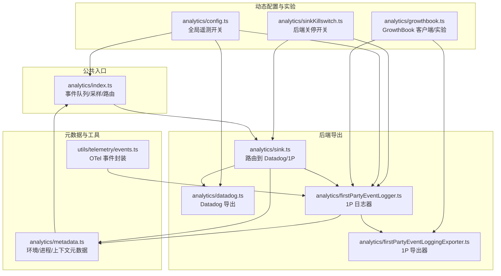
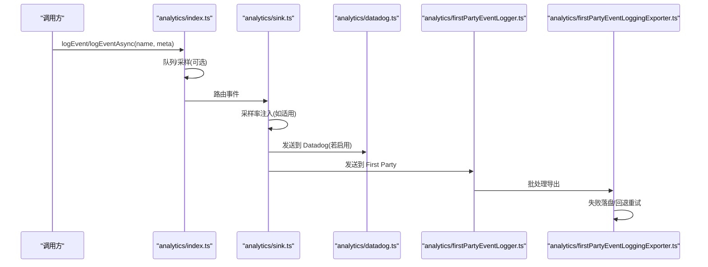
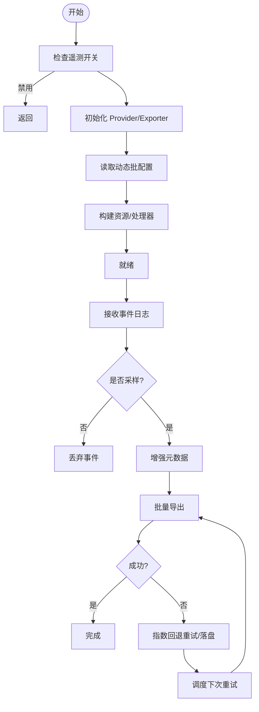
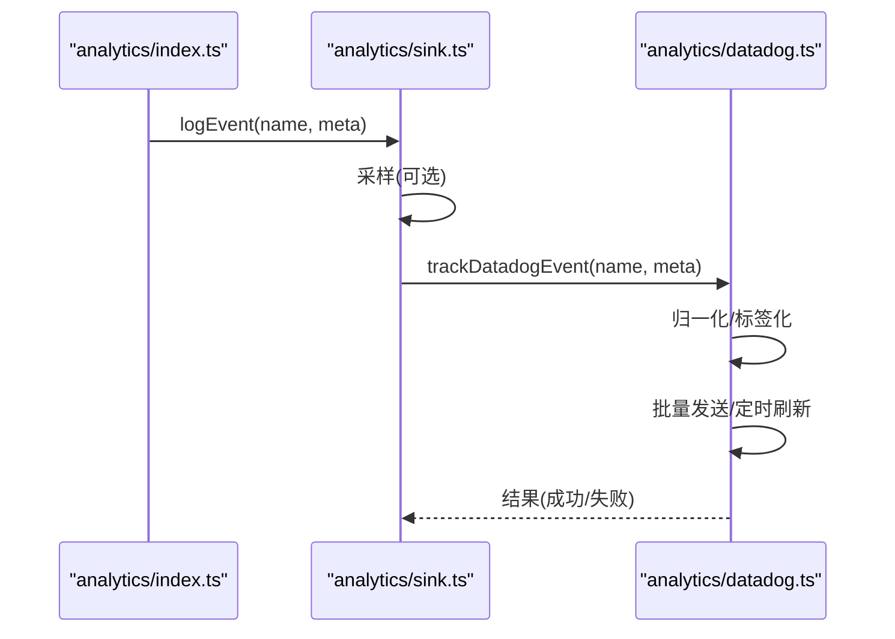
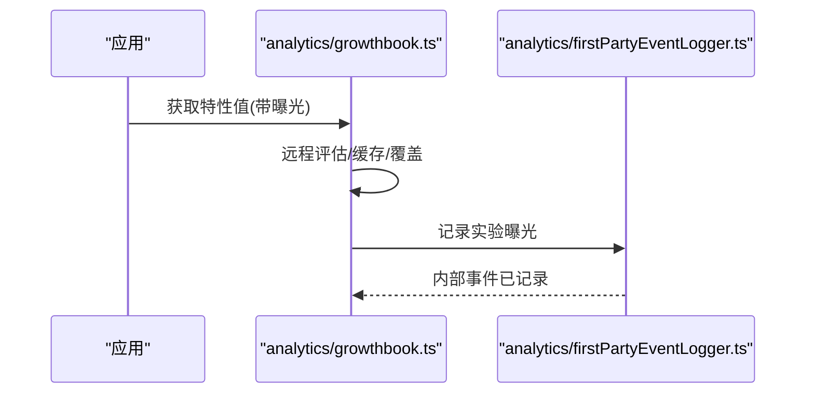
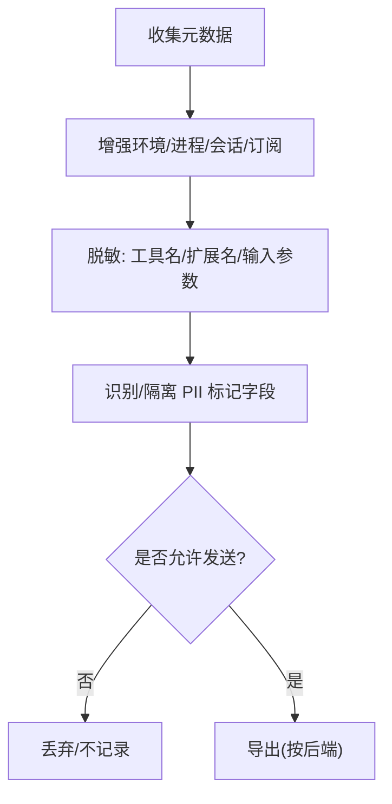
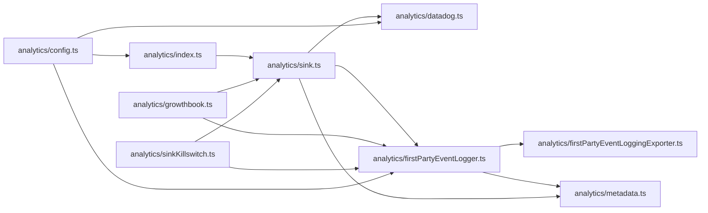

# 分析与遥测

<cite>
**本文引用的文件**
- [src/services/analytics/index.ts](file://src/services/analytics/index.ts)
- [src/services/analytics/sink.ts](file://src/services/analytics/sink.ts)
- [src/services/analytics/firstPartyEventLogger.ts](file://src/services/analytics/firstPartyEventLogger.ts)
- [src/services/analytics/firstPartyEventLoggingExporter.ts](file://src/services/analytics/firstPartyEventLoggingExporter.ts)
- [src/services/analytics/datadog.ts](file://src/services/analytics/datadog.ts)
- [src/services/analytics/metadata.ts](file://src/services/analytics/metadata.ts)
- [src/services/analytics/growthbook.ts](file://src/services/analytics/growthbook.ts)
- [src/services/analytics/sinkKillswitch.ts](file://src/services/analytics/sinkKillswitch.ts)
- [src/services/analytics/config.ts](file://src/services/analytics/config.ts)
- [src/utils/telemetry/events.ts](file://src/utils/telemetry/events.ts)
- [docs/internals/growthbook-ab-testing.mdx](file://docs/internals/growthbook-ab-testing.mdx)
</cite>

## 目录
1. [简介](#简介)
2. [项目结构](#项目结构)
3. [核心组件](#核心组件)
4. [架构总览](#架构总览)
5. [详细组件分析](#详细组件分析)
6. [依赖关系分析](#依赖关系分析)
7. [性能考量](#性能考量)
8. [故障排查指南](#故障排查指南)
9. [结论](#结论)
10. [附录](#附录)

## 简介
本文件系统化梳理 Claude Code 的分析与遥测体系，覆盖事件日志记录机制、数据导出管道、第三方集成与隐私合规。重点包括：
- First Party Event Logger 的实现原理、事件分类与数据格式
- DataDog 集成配置与采样策略
- GrowthBook 实验框架与 A/B 测试支持
- 事件追踪、用户行为分析与业务指标监控
- 自定义事件定义、数据聚合与报表生成
- 隐私保护措施、数据脱敏与合规性考虑

## 项目结构
遥测子系统围绕“公共入口 + 多后端导出”的设计展开：
- 公共入口负责事件排队、采样与路由
- Datadog 后端负责通用访问通道
- First Party 后端负责内部 BigQuery 通道
- GrowthBook 提供动态配置与实验曝光追踪
- 元数据模块统一环境与上下文信息

图示来源
- [src/services/analytics/index.ts:1-174](file://src/services/analytics/index.ts#L1-L174)
- [src/services/analytics/sink.ts:1-115](file://src/services/analytics/sink.ts#L1-L115)
- [src/services/analytics/datadog.ts:1-308](file://src/services/analytics/datadog.ts#L1-L308)
- [src/services/analytics/firstPartyEventLogger.ts:1-450](file://src/services/analytics/firstPartyEventLogger.ts#L1-L450)
- [src/services/analytics/firstPartyEventLoggingExporter.ts:1-807](file://src/services/analytics/firstPartyEventLoggingExporter.ts#L1-L807)
- [src/services/analytics/growthbook.ts:1-1156](file://src/services/analytics/growthbook.ts#L1-L1156)
- [src/services/analytics/sinkKillswitch.ts:1-26](file://src/services/analytics/sinkKillswitch.ts#L1-L26)
- [src/services/analytics/config.ts:1-39](file://src/services/analytics/config.ts#L1-L39)
- [src/services/analytics/metadata.ts:1-974](file://src/services/analytics/metadata.ts#L1-L974)
- [src/utils/telemetry/events.ts:1-76](file://src/utils/telemetry/events.ts#L1-L76)

章节来源
- [src/services/analytics/index.ts:1-174](file://src/services/analytics/index.ts#L1-L174)
- [src/services/analytics/sink.ts:1-115](file://src/services/analytics/sink.ts#L1-L115)
- [src/services/analytics/firstPartyEventLogger.ts:1-450](file://src/services/analytics/firstPartyEventLogger.ts#L1-L450)
- [src/services/analytics/firstPartyEventLoggingExporter.ts:1-807](file://src/services/analytics/firstPartyEventLoggingExporter.ts#L1-L807)
- [src/services/analytics/datadog.ts:1-308](file://src/services/analytics/datadog.ts#L1-L308)
- [src/services/analytics/metadata.ts:1-974](file://src/services/analytics/metadata.ts#L1-L974)
- [src/services/analytics/growthbook.ts:1-1156](file://src/services/analytics/growthbook.ts#L1-L1156)
- [src/services/analytics/sinkKillswitch.ts:1-26](file://src/services/analytics/sinkKillswitch.ts#L1-L26)
- [src/services/analytics/config.ts:1-39](file://src/services/analytics/config.ts#L1-L39)
- [src/utils/telemetry/events.ts:1-76](file://src/utils/telemetry/events.ts#L1-L76)

## 核心组件
- 公共入口与事件队列
  - 提供同步/异步事件接口，未绑定后端时自动入队，待后端初始化后批量放行
  - 支持按事件类型采样，并在元数据中注入采样率
- Datadog 后端
  - 限定允许事件白名单，按批发送，带超时与重试
  - 对高基数字段进行归一化与标签化，降低卡片量并提升可检索性
- First Party 后端
  - 使用 OpenTelemetry Logs，独立 Provider/Exporter，避免客户数据外泄
  - 支持失败事件落盘与指数回退重试，支持动态批配置热更新
- GrowthBook 实验框架
  - 远程评估、磁盘缓存与周期刷新，支持环境变量与 UI 覆盖
  - 自动记录实验曝光事件，支持动态关停与监听刷新
- 元数据与隐私
  - 统一采集环境、进程、会话、订阅等上下文
  - 工具名称、技能名等高敏感字段按策略脱敏；支持 PII 标记字段的隔离传输

章节来源
- [src/services/analytics/index.ts:60-174](file://src/services/analytics/index.ts#L60-L174)
- [src/services/analytics/sink.ts:20-115](file://src/services/analytics/sink.ts#L20-L115)
- [src/services/analytics/datadog.ts:12-308](file://src/services/analytics/datadog.ts#L12-L308)
- [src/services/analytics/firstPartyEventLogger.ts:27-450](file://src/services/analytics/firstPartyEventLogger.ts#L27-L450)
- [src/services/analytics/firstPartyEventLoggingExporter.ts:73-807](file://src/services/analytics/firstPartyEventLoggingExporter.ts#L73-L807)
- [src/services/analytics/growthbook.ts:29-1156](file://src/services/analytics/growthbook.ts#L29-L1156)
- [src/services/analytics/metadata.ts:44-974](file://src/services/analytics/metadata.ts#L44-L974)
- [src/services/analytics/sinkKillswitch.ts:1-26](file://src/services/analytics/sinkKillswitch.ts#L1-L26)
- [src/services/analytics/config.ts:1-39](file://src/services/analytics/config.ts#L1-L39)

## 架构总览
下图展示从事件产生到多后端导出的关键路径，以及关键决策点（采样、关停、认证）。

图示来源
- [src/services/analytics/index.ts:125-164](file://src/services/analytics/index.ts#L125-L164)
- [src/services/analytics/sink.ts:45-86](file://src/services/analytics/sink.ts#L45-L86)
- [src/services/analytics/datadog.ts:160-279](file://src/services/analytics/datadog.ts#L160-L279)
- [src/services/analytics/firstPartyEventLogger.ts:156-230](file://src/services/analytics/firstPartyEventLogger.ts#L156-L230)
- [src/services/analytics/firstPartyEventLoggingExporter.ts:277-377](file://src/services/analytics/firstPartyEventLoggingExporter.ts#L277-L377)

## 详细组件分析

### First Party Event Logger（内部事件日志）
- 初始化与生命周期
  - 独立 LoggerProvider，最小资源配置，避免与客户 OTLP 通道混用
  - 支持动态批配置热更新，变更时安全重建，保证事件不出错丢失
- 事件采样
  - 基于 GrowthBook 动态配置按事件类型采样，未命中则 100%
- 元数据增强
  - 会话、模型、用户类型、订阅等级、代理上下文、进程指标等
- 实验曝光
  - 自动记录 GrowthBook 实验分配，包含用户属性与实验元数据
- 导出器特性
  - 批量、超时、回退重试、失败落盘、延迟重试、认证降级

图示来源
- [src/services/analytics/firstPartyEventLogger.ts:130-144](file://src/services/analytics/firstPartyEventLogger.ts#L130-L144)
- [src/services/analytics/firstPartyEventLogger.ts:312-389](file://src/services/analytics/firstPartyEventLogger.ts#L312-L389)
- [src/services/analytics/firstPartyEventLogger.ts:407-449](file://src/services/analytics/firstPartyEventLogger.ts#L407-L449)
- [src/services/analytics/firstPartyEventLoggingExporter.ts:73-139](file://src/services/analytics/firstPartyEventLoggingExporter.ts#L73-L139)
- [src/services/analytics/firstPartyEventLoggingExporter.ts:379-428](file://src/services/analytics/firstPartyEventLoggingExporter.ts#L379-L428)
- [src/services/analytics/firstPartyEventLoggingExporter.ts:445-517](file://src/services/analytics/firstPartyEventLoggingExporter.ts#L445-L517)

章节来源
- [src/services/analytics/firstPartyEventLogger.ts:1-450](file://src/services/analytics/firstPartyEventLogger.ts#L1-L450)
- [src/services/analytics/firstPartyEventLoggingExporter.ts:1-807](file://src/services/analytics/firstPartyEventLoggingExporter.ts#L1-L807)

### Datadog 集成（通用访问通道）
- 事件白名单与采样
  - 仅允许预置事件进入 Datadog，避免泛滥
  - 采样率与 First Party 一致，元数据中注入
- 元数据与归一化
  - 工具名、模型名、版本等进行归一化，降低卡片量
  - 状态码映射为 http_status 与 http_status_range，规避保留字段冲突
- 发送与重试
  - 批大小与刷新间隔可配置，超时保护
  - 3P 提供商场景跳过发送

图示来源
- [src/services/analytics/sink.ts:45-86](file://src/services/analytics/sink.ts#L45-L86)
- [src/services/analytics/datadog.ts:160-279](file://src/services/analytics/datadog.ts#L160-L279)

章节来源
- [src/services/analytics/datadog.ts:1-308](file://src/services/analytics/datadog.ts#L1-L308)
- [src/services/analytics/sink.ts:1-115](file://src/services/analytics/sink.ts#L1-L115)

### GrowthBook 实验框架与 A/B 测试
- 运行时门控与远程评估
  - remoteEval 模式，服务端计算分组，客户端仅取结果
  - 缓存到本地配置，员工可环境变量/UI 覆盖
- 用户定向属性
  - 设备/会话/平台/组织/账户/订阅/速率限制/邮箱/版本/CI 等
- 实验曝光追踪
  - 每次查询 flag 即记录曝光事件，上报至 First Party
- 动态刷新与关停
  - 周期刷新与 onGrowthBookRefresh 监听，关停开关可禁用后端

图示来源
- [src/services/analytics/growthbook.ts:487-664](file://src/services/analytics/growthbook.ts#L487-L664)
- [src/services/analytics/growthbook.ts:296-314](file://src/services/analytics/growthbook.ts#L296-L314)
- [src/services/analytics/firstPartyEventLogger.ts:255-298](file://src/services/analytics/firstPartyEventLogger.ts#L255-L298)
- [docs/internals/growthbook-ab-testing.mdx:1-121](file://docs/internals/growthbook-ab-testing.mdx#L1-L121)

章节来源
- [src/services/analytics/growthbook.ts:1-1156](file://src/services/analytics/growthbook.ts#L1-L1156)
- [src/services/analytics/firstPartyEventLogger.ts:232-298](file://src/services/analytics/firstPartyEventLogger.ts#L232-L298)
- [docs/internals/growthbook-ab-testing.mdx:1-121](file://docs/internals/growthbook-ab-testing.mdx#L1-L121)

### 元数据与隐私保护
- 元数据来源
  - 环境上下文（平台、架构、终端、包管理器、运行时、WSL/Linux/Distro/VCS 等）
  - 进程指标（内存/CPU/时间）
  - 会话与用户上下文（订阅类型、代理上下文、仓库远端哈希等）
- 隐私与脱敏
  - 工具名 MCP 化简；技能名按策略脱敏
  - 文件扩展名长度阈值过滤；输入参数深度/长度截断
  - PII 标记字段通过专用键前缀隔离，非特权后端自动剥离
- 合规开关
  - 测试环境、3P 提供商、隐私级别限制均会禁用遥测

图示来源
- [src/services/analytics/metadata.ts:44-974](file://src/services/analytics/metadata.ts#L44-L974)
- [src/services/analytics/index.ts:35-58](file://src/services/analytics/index.ts#L35-L58)
- [src/services/analytics/config.ts:11-39](file://src/services/analytics/config.ts#L11-L39)

章节来源
- [src/services/analytics/metadata.ts:1-974](file://src/services/analytics/metadata.ts#L1-L974)
- [src/services/analytics/index.ts:1-174](file://src/services/analytics/index.ts#L1-L174)
- [src/services/analytics/config.ts:1-39](file://src/services/analytics/config.ts#L1-L39)

### 事件追踪、用户行为分析与业务指标
- 事件追踪
  - 通过 First Party 事件与 GrowthBook 曝光事件双通道记录
  - 事件名、采样率、用户属性、实验分组、会话上下文完整保留
- 用户行为分析
  - 工具使用、命令执行、会话生命周期、KAIROS 模式等
  - Datadog 标签化便于按维度聚合与检索
- 业务指标监控
  - 通过 Datadog 指标与仪表板聚合，结合用户桶（哈希分桶）估算受影响用户数
  - 版本/模型/订阅等维度归一化，降低卡片量

章节来源
- [src/services/analytics/firstPartyEventLogger.ts:146-230](file://src/services/analytics/firstPartyEventLogger.ts#L146-L230)
- [src/services/analytics/datadog.ts:160-308](file://src/services/analytics/datadog.ts#L160-L308)
- [src/services/analytics/metadata.ts:414-496](file://src/services/analytics/metadata.ts#L414-L496)

### 自定义事件定义、数据聚合与报表生成
- 自定义事件
  - 通过公共入口 logEvent/logEventAsync 记录，事件名遵循 tengu_* 前缀规范
  - 元数据中可携带采样率、工具/技能/会话等上下文
- 数据聚合
  - Datadog 侧按标签聚合；First Party 侧按 BigQuery 列导出
- 报表生成
  - 通过 Datadog 仪表板与 BI 系统对接；BigQuery 侧支持复杂分析与跨表关联

章节来源
- [src/services/analytics/index.ts:125-164](file://src/services/analytics/index.ts#L125-L164)
- [src/services/analytics/datadog.ts:234-279](file://src/services/analytics/datadog.ts#L234-L279)
- [src/services/analytics/firstPartyEventLoggingExporter.ts:635-762](file://src/services/analytics/firstPartyEventLoggingExporter.ts#L635-L762)

## 依赖关系分析
- 耦合与内聚
  - 公共入口低耦合，后端导出器高内聚；GrowthBook 作为动态配置中心
- 外部依赖
  - Datadog：HTTP 日志端点、客户端令牌
  - First Party：Anthropic 内部 API、Protobuf 事件类型
  - OpenTelemetry：Logs SDK、Batch 处理器
- 循环依赖
  - 导出器通过回调注入关停探测，避免循环导入

图示来源
- [src/services/analytics/index.ts:1-174](file://src/services/analytics/index.ts#L1-L174)
- [src/services/analytics/sink.ts:1-115](file://src/services/analytics/sink.ts#L1-L115)
- [src/services/analytics/firstPartyEventLogger.ts:1-450](file://src/services/analytics/firstPartyEventLogger.ts#L1-L450)
- [src/services/analytics/firstPartyEventLoggingExporter.ts:1-807](file://src/services/analytics/firstPartyEventLoggingExporter.ts#L1-L807)
- [src/services/analytics/metadata.ts:1-974](file://src/services/analytics/metadata.ts#L1-L974)
- [src/services/analytics/growthbook.ts:1-1156](file://src/services/analytics/growthbook.ts#L1-L1156)
- [src/services/analytics/sinkKillswitch.ts:1-26](file://src/services/analytics/sinkKillswitch.ts#L1-L26)
- [src/services/analytics/config.ts:1-39](file://src/services/analytics/config.ts#L1-L39)

章节来源
- [src/services/analytics/index.ts:1-174](file://src/services/analytics/index.ts#L1-L174)
- [src/services/analytics/sink.ts:1-115](file://src/services/analytics/sink.ts#L1-L115)
- [src/services/analytics/firstPartyEventLogger.ts:1-450](file://src/services/analytics/firstPartyEventLogger.ts#L1-L450)
- [src/services/analytics/firstPartyEventLoggingExporter.ts:1-807](file://src/services/analytics/firstPartyEventLoggingExporter.ts#L1-L807)
- [src/services/analytics/metadata.ts:1-974](file://src/services/analytics/metadata.ts#L1-L974)
- [src/services/analytics/growthbook.ts:1-1156](file://src/services/analytics/growthbook.ts#L1-L1156)
- [src/services/analytics/sinkKillswitch.ts:1-26](file://src/services/analytics/sinkKillswitch.ts#L1-L26)
- [src/services/analytics/config.ts:1-39](file://src/services/analytics/config.ts#L1-L39)

## 性能考量
- 采样与批处理
  - 事件级采样与后端批处理减少网络开销与存储压力
- 异步与队列
  - 未绑定后端时事件入队，初始化后微任务批量放行，避免阻塞启动
- 回退与重试
  - 失败事件落盘与指数回退，保障最终一致性
- 卡片量控制
  - Datadog 侧字段归一化与标签化，降低高基数风险

## 故障排查指南
- Datadog 未发送
  - 检查 3P 提供商环境、事件是否在白名单、是否被关停
  - 查看刷新间隔与批大小配置
- First Party 导出失败
  - 查看失败事件落盘文件与回退重试日志
  - 检查认证状态与关停开关
- GrowthBook 未生效
  - 检查磁盘缓存与远程刷新、环境变量覆盖、UI 覆盖
  - 关注实验曝光是否正确记录

章节来源
- [src/services/analytics/datadog.ts:130-157](file://src/services/analytics/datadog.ts#L130-L157)
- [src/services/analytics/firstPartyEventLoggingExporter.ts:218-275](file://src/services/analytics/firstPartyEventLoggingExporter.ts#L218-L275)
- [src/services/analytics/firstPartyEventLoggingExporter.ts:445-517](file://src/services/analytics/firstPartyEventLoggingExporter.ts#L445-L517)
- [src/services/analytics/growthbook.ts:167-220](file://src/services/analytics/growthbook.ts#L167-L220)
- [src/services/analytics/sinkKillswitch.ts:18-25](file://src/services/analytics/sinkKillswitch.ts#L18-L25)

## 结论
该遥测体系通过“公共入口 + 多后端导出 + 动态配置”的设计，在保证隐私与合规的前提下，实现了事件采样、实验曝光、用户行为分析与业务指标监控的闭环。First Party 与 Datadog 的分工明确，既满足内部分析需求，也兼顾外部可观测性。建议在生产中持续关注动态配置变更、关停开关与回退重试策略，确保稳定性与一致性。

## 附录
- 术语
  - First Party：内部 BigQuery 通道
  - 3P 提供商：Bedrock/Vertex/Foundry 等第三方云厂商
  - PII：个人身份信息，按策略隔离传输
- 建议
  - 新增事件时遵循 tengu_* 前缀与采样策略
  - 对高基数字段进行归一化与标签化
  - 定期审查关停开关与动态配置，避免误伤