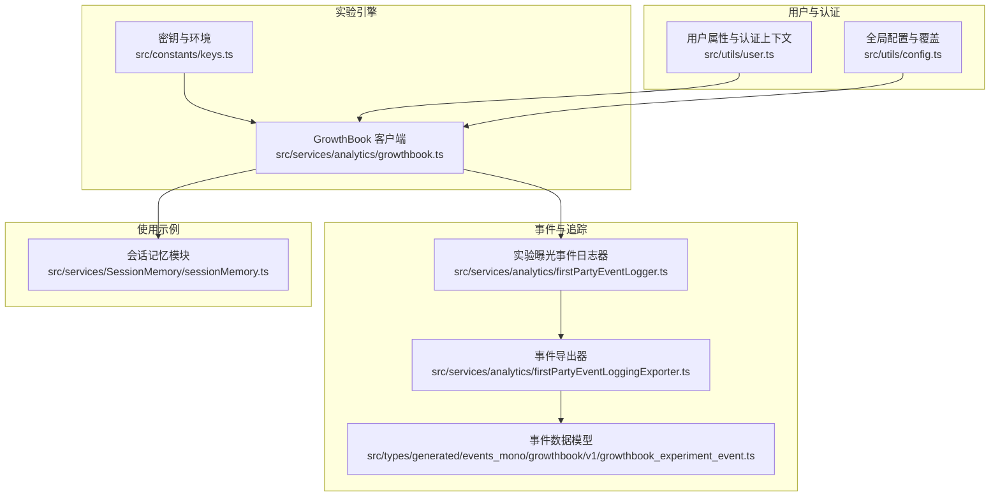
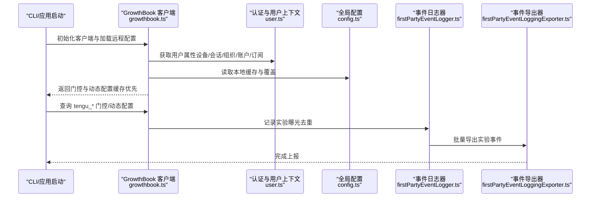
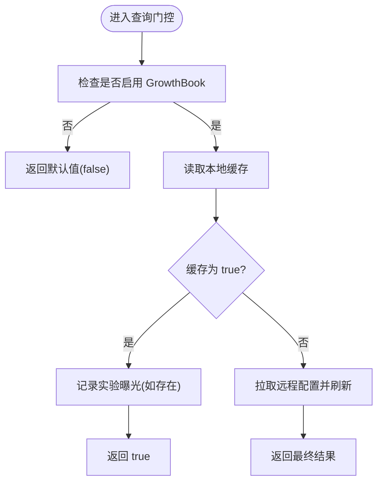
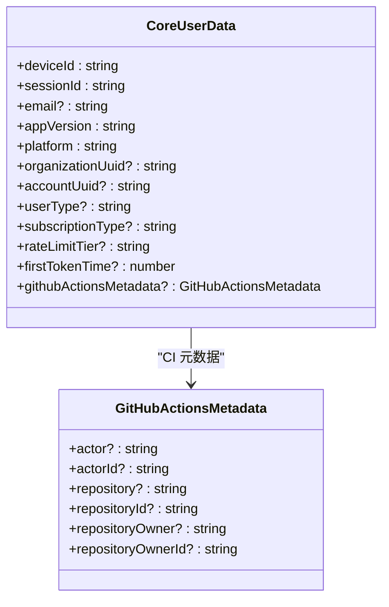
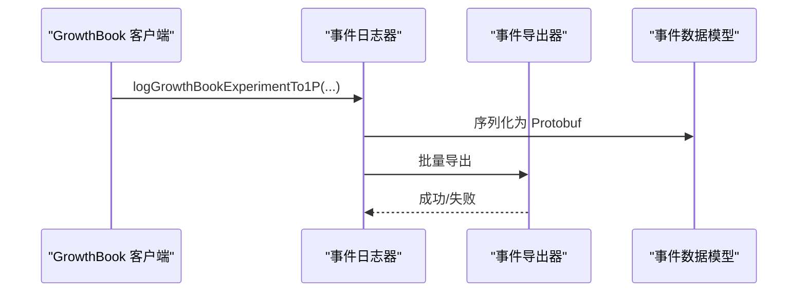
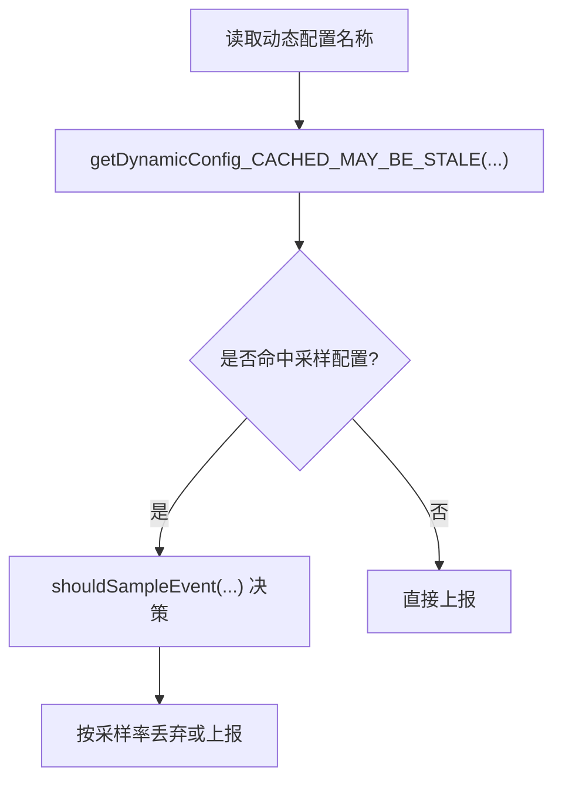
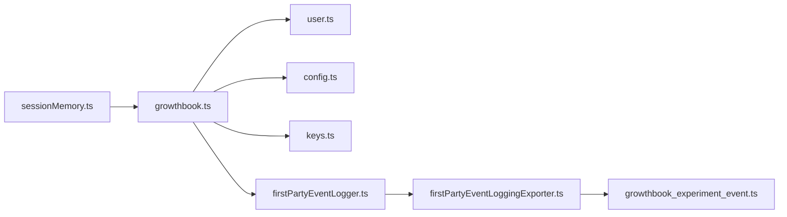

# 实验框架

<cite>
**本文引用的文件**
- [growthbook.ts](file://src/services/analytics/growthbook.ts)
- [growthbook-ab-testing.mdx](file://docs/internals/growthbook-ab-testing.mdx)
- [user.ts](file://src/utils/user.ts)
- [firstPartyEventLogger.ts](file://src/services/analytics/firstPartyEventLogger.ts)
- [firstPartyEventLoggingExporter.ts](file://src/services/analytics/firstPartyEventLoggingExporter.ts)
- [growthbook_experiment_event.ts](file://src/types/generated/events_mono/growthbook/v1/growthbook_experiment_event.ts)
- [sessionMemory.ts](file://src/services/SessionMemory/sessionMemory.ts)
- [config.ts](file://src/utils/config.ts)
- [keys.ts](file://src/constants/keys.ts)
- [privacy-settings.tsx](file://src/commands/privacy-settings/privacy-settings.tsx)
- [Feedback.tsx](file://src/components/Feedback.tsx)
</cite>

## 目录
1. [简介](#简介)
2. [项目结构](#项目结构)
3. [核心组件](#核心组件)
4. [架构总览](#架构总览)
5. [详细组件分析](#详细组件分析)
6. [依赖关系分析](#依赖关系分析)
7. [性能考量](#性能考量)
8. [故障排查指南](#故障排查指南)
9. [结论](#结论)
10. [附录](#附录)

## 简介
本文件面向 Claude Code 的实验框架，系统化阐述 GrowthBook 实验平台的集成与配置，涵盖实验定义、变量管理、统计分析与合规性设计。文档重点解释运行时 A/B 测试与功能门控的工作流、用户定向属性、tengu_* 命名体系、动态配置与实时调整、实验曝光追踪与结果解读，并提供可操作的实践建议与排障指引。

## 项目结构
围绕实验框架的关键代码分布在以下模块：
- 实验引擎与门控：src/services/analytics/growthbook.ts
- 用户属性与认证上下文：src/utils/user.ts
- 实验曝光事件上报：src/services/analytics/firstPartyEventLogger.ts、src/services/analytics/firstPartyEventLoggingExporter.ts
- 实验事件数据模型：src/types/generated/events_mono/growthbook/v1/growthbook_experiment_event.ts
- 使用示例与缓存读取：src/services/SessionMemory/sessionMemory.ts
- 配置与覆盖：src/utils/config.ts、src/constants/keys.ts
- 合规与用户同意：src/commands/privacy-settings/privacy-settings.tsx、src/components/Feedback.tsx

**图表来源**
- [growthbook.ts:1-1156](file://src/services/analytics/growthbook.ts#L1-L1156)
- [keys.ts:1-11](file://src/constants/keys.ts#L1-L11)
- [user.ts:1-195](file://src/utils/user.ts#L1-L195)
- [firstPartyEventLogger.ts:1-200](file://src/services/analytics/firstPartyEventLogger.ts#L1-L200)
- [firstPartyEventLoggingExporter.ts:635-669](file://src/services/analytics/firstPartyEventLoggingExporter.ts#L635-L669)
- [growthbook_experiment_event.ts:43-179](file://src/types/generated/events_mono/growthbook/v1/growthbook_experiment_event.ts#L43-L179)
- [sessionMemory.ts:64-99](file://src/services/SessionMemory/sessionMemory.ts#L64-L99)
- [config.ts:1-200](file://src/utils/config.ts#L1-L200)

**章节来源**
- [growthbook.ts:1-1156](file://src/services/analytics/growthbook.ts#L1-L1156)
- [growthbook-ab-testing.mdx:1-121](file://docs/internals/growthbook-ab-testing.mdx#L1-L121)

## 核心组件
- GrowthBook 客户端与门控：负责远程配置拉取、本地缓存、用户属性注入、实验曝光记录与周期刷新。
- 用户属性与认证上下文：提供设备 ID、会话 ID、组织/账户 UUID、订阅类型、速率限制层级等定向属性。
- 实验曝光事件日志器：将实验分配与曝光事件标准化并批量上报。
- 事件导出器与数据模型：将事件序列化为 Protobuf 结构，便于后端分析。
- 动态配置与缓存读取：提供“立即返回缓存”的非阻塞接口，满足启动路径与同步上下文需求。
- 配置与覆盖：支持环境变量与内部 UI 覆盖，便于开发与审计。
- 合规与用户同意：隐私设置与反馈对话框，确保用户知情与可撤销同意。

**章节来源**
- [growthbook.ts:1-1156](file://src/services/analytics/growthbook.ts#L1-L1156)
- [user.ts:1-195](file://src/utils/user.ts#L1-L195)
- [firstPartyEventLogger.ts:1-200](file://src/services/analytics/firstPartyEventLogger.ts#L1-L200)
- [firstPartyEventLoggingExporter.ts:635-669](file://src/services/analytics/firstPartyEventLoggingExporter.ts#L635-L669)
- [growthbook_experiment_event.ts:43-179](file://src/types/generated/events_mono/growthbook/v1/growthbook_experiment_event.ts#L43-L179)
- [sessionMemory.ts:64-99](file://src/services/SessionMemory/sessionMemory.ts#L64-L99)
- [config.ts:1-200](file://src/utils/config.ts#L1-L200)
- [keys.ts:1-11](file://src/constants/keys.ts#L1-L11)

## 架构总览
下图展示了从启动到实验曝光与事件上报的端到端流程。

**图表来源**
- [growthbook.ts:1-1156](file://src/services/analytics/growthbook.ts#L1-L1156)
- [user.ts:1-195](file://src/utils/user.ts#L1-L195)
- [firstPartyEventLogger.ts:1-200](file://src/services/analytics/firstPartyEventLogger.ts#L1-L200)
- [firstPartyEventLoggingExporter.ts:635-669](file://src/services/analytics/firstPartyEventLoggingExporter.ts#L635-L669)

## 详细组件分析

### GrowthBook 客户端与门控
- 远程配置与缓存：客户端以 remoteEval 模式在服务端计算分组，客户端仅接收结果；结果缓存于本地配置，不同用户类型采用不同刷新间隔。
- 用户属性注入：将设备 ID、会话 ID、组织/账户 UUID、订阅类型、速率限制层级、邮箱、版本号、CI 元数据等作为定向依据。
- 门控查询：提供阻塞与非阻塞两类接口，前者等待初始化完成，后者立即返回缓存值，满足启动路径与同步上下文需求。
- 实验曝光：对每个特性仅记录一次曝光，避免重复上报；当特性来自实验时，记录实验 ID 与变体 ID。
- 周期刷新：定时拉取最新配置，重建远程特征映射并持久化更新，同时触发订阅者刷新。
- 认证变更：登录/登出后重建客户端以应用新的鉴权头，保证后续请求可用。

**图表来源**
- [growthbook.ts:917-935](file://src/services/analytics/growthbook.ts#L917-L935)
- [growthbook.ts:1027-1078](file://src/services/analytics/growthbook.ts#L1027-L1078)

**章节来源**
- [growthbook.ts:1-1156](file://src/services/analytics/growthbook.ts#L1-L1156)
- [growthbook-ab-testing.mdx:20-37](file://docs/internals/growthbook-ab-testing.mdx#L20-L37)

### 用户属性与认证上下文
- 核心用户数据：设备 ID、会话 ID、邮箱、应用版本、平台、组织/账户 UUID、用户类型、订阅类型、速率限制层级、首次令牌时间、CI 元数据。
- 异步初始化：预取邮箱以保证后续查询为同步；在认证变化时重置缓存，确保下次查询取到新鲜数据。
- CI 特殊处理：在 CI 环境注入 Actor/Repository 等元数据，便于按流水线定向实验。

**图表来源**
- [user.ts:34-47](file://src/utils/user.ts#L34-L47)
- [user.ts:21-28](file://src/utils/user.ts#L21-L28)

**章节来源**
- [user.ts:1-195](file://src/utils/user.ts#L1-L195)
- [growthbook-ab-testing.mdx:39-59](file://docs/internals/growthbook-ab-testing.mdx#L39-L59)

### 实验曝光事件日志与导出
- 曝光记录：当特性来自实验且未在会话内重复记录时，构造实验事件并上报。
- 事件字段：包含实验 ID、变体 ID、环境、用户属性、会话 ID、设备 ID、实验元数据等。
- 导出器：将事件序列化为 Protobuf 结构，附加认证信息（账户/组织 UUID），统一上传至后端分析平台。

**图表来源**
- [growthbook.ts:296-314](file://src/services/analytics/growthbook.ts#L296-L314)
- [firstPartyEventLogger.ts:255-298](file://src/services/analytics/firstPartyEventLogger.ts#L255-L298)
- [firstPartyEventLoggingExporter.ts:635-669](file://src/services/analytics/firstPartyEventLoggingExporter.ts#L635-L669)
- [growthbook_experiment_event.ts:43-179](file://src/types/generated/events_mono/growthbook/v1/growthbook_experiment_event.ts#L43-L179)

**章节来源**
- [growthbook.ts:296-314](file://src/services/analytics/growthbook.ts#L296-L314)
- [firstPartyEventLogger.ts:249-298](file://src/services/analytics/firstPartyEventLogger.ts#L249-L298)
- [firstPartyEventLoggingExporter.ts:635-669](file://src/services/analytics/firstPartyEventLoggingExporter.ts#L635-L669)
- [growthbook_experiment_event.ts:43-179](file://src/types/generated/events_mono/growthbook/v1/growthbook_experiment_event.ts#L43-L179)

### 动态配置与实时调整
- 动态配置即对象类型的特性，可通过缓存读取接口在启动路径与同步上下文中使用。
- 采样配置：通过动态配置控制事件采样率，避免高基数事件冲垮后端。
- 批量配置：动态配置可控制日志导出器的批处理参数（延迟、批次大小、队列上限、重试次数、基础路径等）。

**图表来源**
- [growthbook.ts:1150-1156](file://src/services/analytics/growthbook.ts#L1150-L1156)
- [firstPartyEventLogger.ts:43-85](file://src/services/analytics/firstPartyEventLogger.ts#L43-L85)
- [firstPartyEventLogger.ts:87-102](file://src/services/analytics/firstPartyEventLogger.ts#L87-L102)

**章节来源**
- [growthbook.ts:1126-1156](file://src/services/analytics/growthbook.ts#L1126-L1156)
- [firstPartyEventLogger.ts:38-102](file://src/services/analytics/firstPartyEventLogger.ts#L38-L102)

### 使用示例：会话记忆模块
- 门控与动态配置读取：模块通过缓存接口读取 tengu_session_memory 门控与 tengu_sm_config 动态配置，立即返回缓存值，避免阻塞。
- 启动路径友好：在应用启动早期即可根据实验结果决定功能行为，同时后台刷新配置以获得最新值。

**章节来源**
- [sessionMemory.ts:64-99](file://src/services/SessionMemory/sessionMemory.ts#L64-L99)

### 配置与覆盖：环境变量与内部 UI
- 环境变量覆盖：Anthropic 员工可在内部构建中通过 CLAUDE_INTERNAL_FC_OVERRIDES 覆盖任意 tengu_* 门控值。
- 内部 UI 覆盖：/config 命令的 Gates 标签页提供图形化开关，实时调整门控状态。
- 清除覆盖：支持一键清除覆盖，恢复远程配置。

**章节来源**
- [growthbook-ab-testing.mdx:92-108](file://docs/internals/growthbook-ab-testing.mdx#L92-L108)
- [growthbook.ts:273-290](file://src/services/analytics/growthbook.ts#L273-L290)

### 合规与用户知情同意
- 隐私设置：通过隐私设置命令与对话框，用户可选择是否参与帮助改进计划；切换行为会被记录为 tengu_grove_policy_toggled 事件。
- 反馈与退出：反馈组件提供用户输入与确认流程，支持取消与重试，确保用户可控。
- 事件采样：通过动态配置降低高基数事件的上报频率，兼顾分析价值与隐私成本。

**章节来源**
- [privacy-settings.tsx:25-57](file://src/commands/privacy-settings/privacy-settings.tsx#L25-L57)
- [Feedback.tsx:323-337](file://src/components/Feedback.tsx#L323-L337)
- [firstPartyEventLogger.ts:57-85](file://src/services/analytics/firstPartyEventLogger.ts#L57-L85)

## 依赖关系分析
- 组件耦合：GrowthBook 客户端依赖用户属性与全局配置；事件日志器依赖 GrowthBook 的动态配置与用户上下文；导出器依赖事件数据模型。
- 外部依赖：GrowthBook SDK、遥测与日志库（OpenTelemetry）、HTTP 请求工具、JSON 序列化工具。
- 循环依赖：当前实现通过模块边界与接口抽象避免循环依赖；认证变更时重建客户端，确保请求头更新。

**图表来源**
- [growthbook.ts:1-1156](file://src/services/analytics/growthbook.ts#L1-L1156)
- [user.ts:1-195](file://src/utils/user.ts#L1-L195)
- [config.ts:1-200](file://src/utils/config.ts#L1-L200)
- [keys.ts:1-11](file://src/constants/keys.ts#L1-L11)
- [firstPartyEventLogger.ts:1-200](file://src/services/analytics/firstPartyEventLogger.ts#L1-L200)
- [firstPartyEventLoggingExporter.ts:635-669](file://src/services/analytics/firstPartyEventLoggingExporter.ts#L635-L669)
- [growthbook_experiment_event.ts:43-179](file://src/types/generated/events_mono/growthbook/v1/growthbook_experiment_event.ts#L43-L179)
- [sessionMemory.ts:64-99](file://src/services/SessionMemory/sessionMemory.ts#L64-L99)

**章节来源**
- [growthbook.ts:1-1156](file://src/services/analytics/growthbook.ts#L1-L1156)
- [firstPartyEventLogger.ts:1-200](file://src/services/analytics/firstPartyEventLogger.ts#L1-L200)

## 性能考量
- 缓存优先：启动路径与同步上下文优先使用缓存值，避免网络与解析开销。
- 去重曝光：同一会话内对同一特性仅记录一次实验曝光，减少重复上报。
- 轻量刷新：周期刷新采用轻量模式，仅拉取特征值并重建映射，避免重建客户端带来的额外成本。
- 采样控制：通过动态配置控制事件采样率，平衡分析价值与带宽/存储成本。
- 刷新策略：外部用户与 Anthropic 员工采用不同刷新间隔，兼顾时效性与资源消耗。

[本节为通用指导，无需列出具体文件来源]

## 故障排查指南
- 无法获取远程配置
  - 检查鉴权头是否正确传递（认证变更后需重建客户端）。
  - 确认网络可达与密钥有效。
  - 查看日志中的错误堆栈与调试输出。
- 曝光事件未上报
  - 确认特性来自实验且未在会话内重复记录。
  - 检查事件日志器是否启用与导出器是否正常工作。
  - 核对环境变量与动态配置（采样率、批处理参数）。
- 门控值不一致
  - 确认是否使用了缓存读取接口，理解“可能过期”的语义。
  - 检查覆盖配置（环境变量或内部 UI）是否生效。
  - 触发一次周期刷新，验证最新值是否正确。
- 认证状态变化
  - 登录/登出后，客户端会自动重建；若异常，手动调用刷新函数并观察日志。

**章节来源**
- [growthbook.ts:943-951](file://src/services/analytics/growthbook.ts#L943-L951)
- [growthbook.ts:1027-1078](file://src/services/analytics/growthbook.ts#L1027-L1078)
- [firstPartyEventLogger.ts:141-144](file://src/services/analytics/firstPartyEventLogger.ts#L141-L144)

## 结论
Claude Code 的实验框架以 GrowthBook 为核心，结合用户属性定向、动态配置与事件曝光追踪，实现了运行时 A/B 测试与功能门控的闭环。通过缓存优先、轻量刷新与采样控制，系统在保证分析质量的同时兼顾性能与隐私。配合内部覆盖与 UI 调整能力，产品团队可灵活地进行渐进式发布与快速回滚，确保实验安全、可控与可审计。

[本节为总结性内容，无需列出具体文件来源]

## 附录

### A/B 测试设计要点
- 样本分配：基于用户属性（设备/会话/组织/账户/订阅/速率限制/版本/平台/Ci）进行分层与随机分配，确保组间可比。
- 实验组定义：对照组与实验组的变体 ID 由平台定义，曝光时记录以便统计归因。
- 效果评估：通过实验曝光与事件采样，收集关键指标（如任务成功率、响应时间、满意度等）进行对比分析。

**章节来源**
- [growthbook-ab-testing.mdx:9-18](file://docs/internals/growthbook-ab-testing.mdx#L9-L18)
- [growthbook.ts:296-314](file://src/services/analytics/growthbook.ts#L296-L314)

### 实验数据收集与分析方法
- 曝光追踪：每次访问 tengu_* 门控时记录实验曝光，携带实验 ID、变体 ID、用户属性与会话信息。
- 事件采样：通过动态配置控制事件采样率，降低高基数事件对系统与隐私的影响。
- 批量导出：事件经导出器序列化为 Protobuf，统一上传至分析平台进行离线建模与报表生成。

**章节来源**
- [firstPartyEventLogger.ts:38-102](file://src/services/analytics/firstPartyEventLogger.ts#L38-L102)
- [firstPartyEventLoggingExporter.ts:635-669](file://src/services/analytics/firstPartyEventLoggingExporter.ts#L635-L669)
- [growthbook_experiment_event.ts:43-179](file://src/types/generated/events_mono/growthbook/v1/growthbook_experiment_event.ts#L43-L179)

### 实验配置管理与实时调整
- 环境变量覆盖：Anthropic 员工可通过 CLAUDE_INTERNAL_FC_OVERRIDES 覆盖任意门控值。
- 内部 UI 调整：/config 命令提供图形化开关，支持实时调整门控状态。
- 清除覆盖：一键清除覆盖，恢复远程配置。

**章节来源**
- [growthbook-ab-testing.mdx:92-108](file://docs/internals/growthbook-ab-testing.mdx#L92-L108)
- [growthbook.ts:273-290](file://src/services/analytics/growthbook.ts#L273-L290)

### 合规性、伦理审查与用户知情同意
- 隐私设置：用户可随时调整“帮助改进 Claude”选项，切换行为被记录为 tengu_grove_policy_toggled 事件。
- 反馈与退出：反馈组件提供清晰的输入、确认与取消流程，保障用户可控。
- 事件采样：通过动态配置降低高基数事件的上报频率，兼顾分析价值与隐私成本。

**章节来源**
- [privacy-settings.tsx:25-57](file://src/commands/privacy-settings/privacy-settings.tsx#L25-L57)
- [Feedback.tsx:323-337](file://src/components/Feedback.tsx#L323-L337)
- [firstPartyEventLogger.ts:57-85](file://src/services/analytics/firstPartyEventLogger.ts#L57-L85)