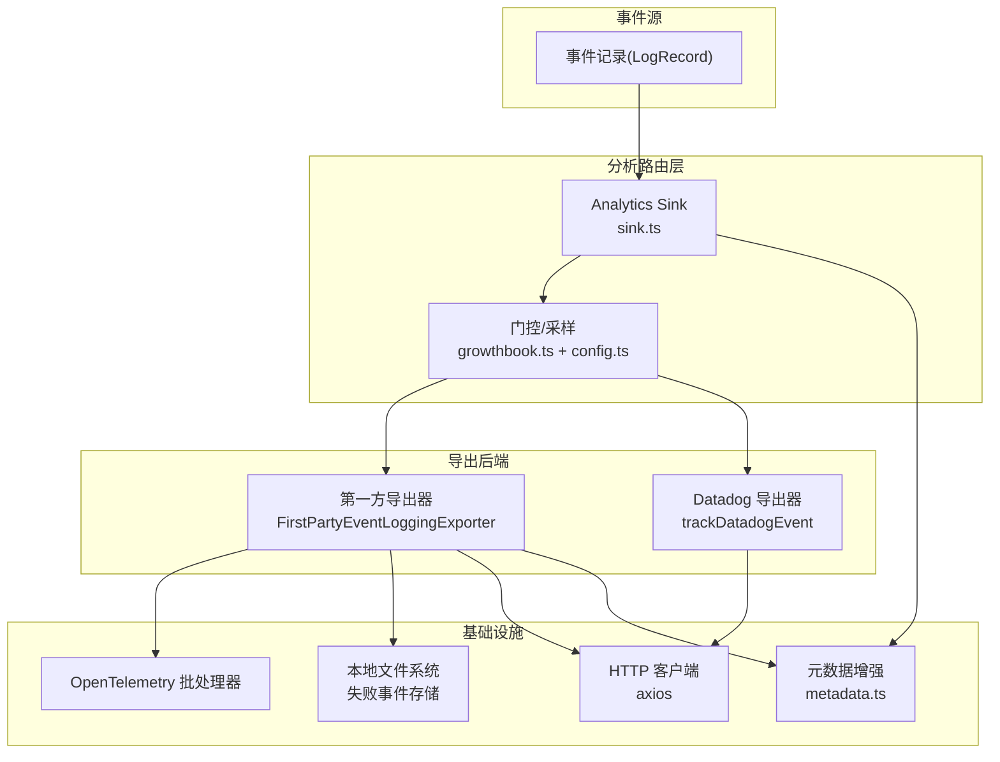
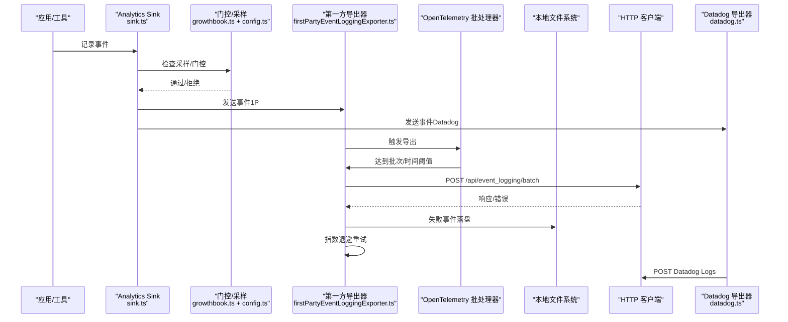
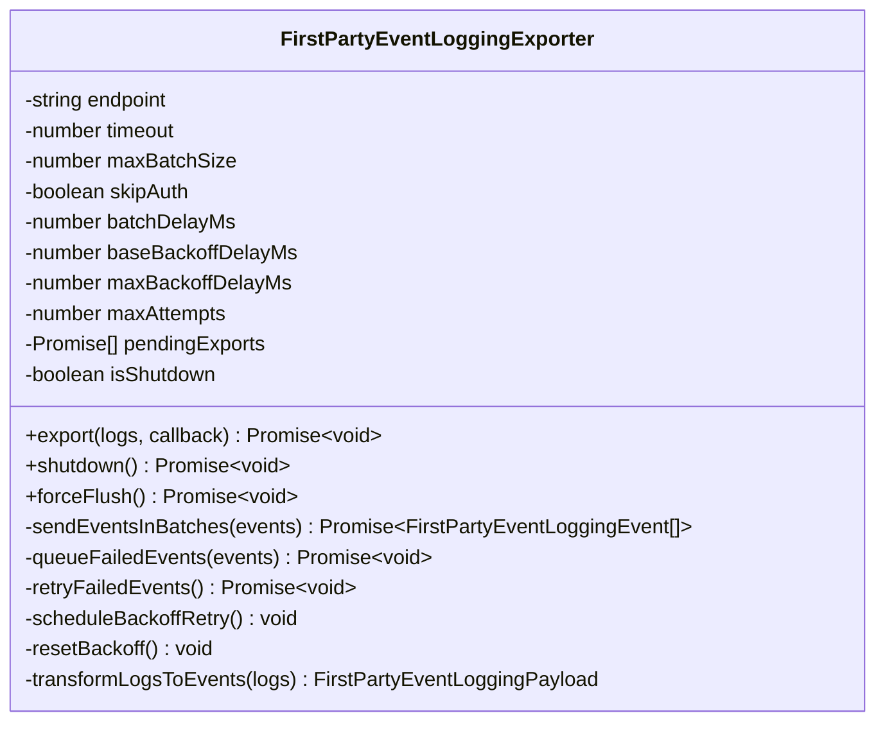
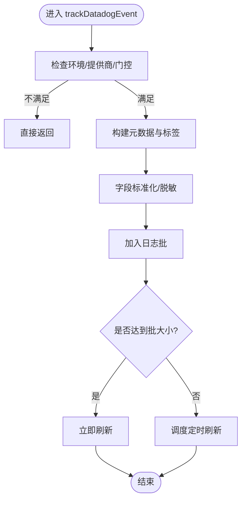
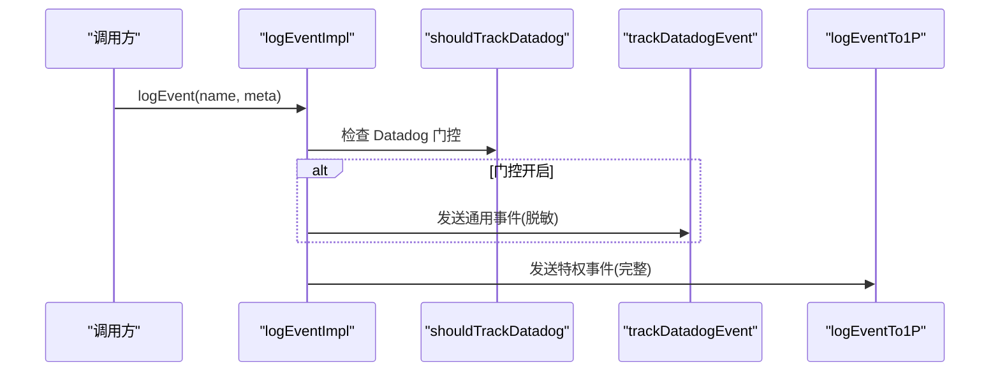
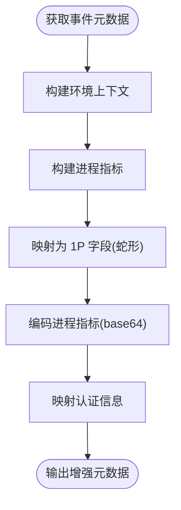
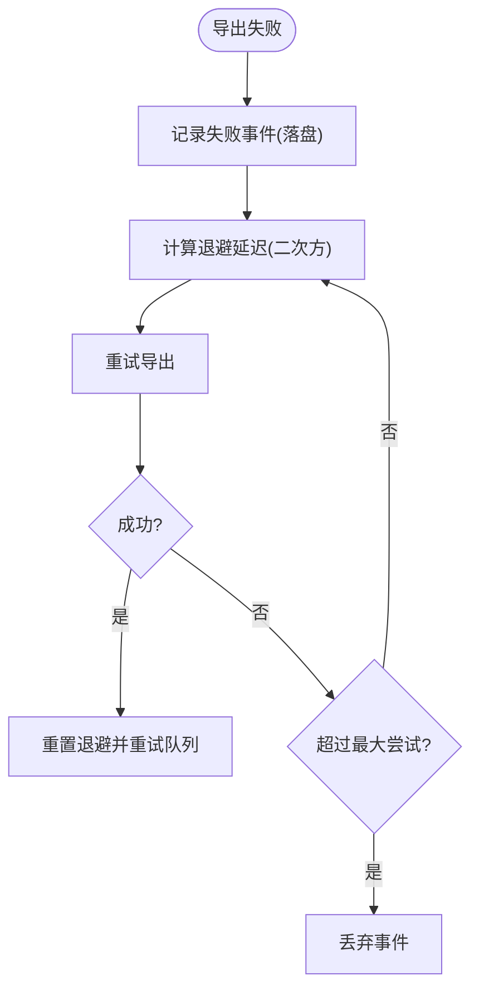
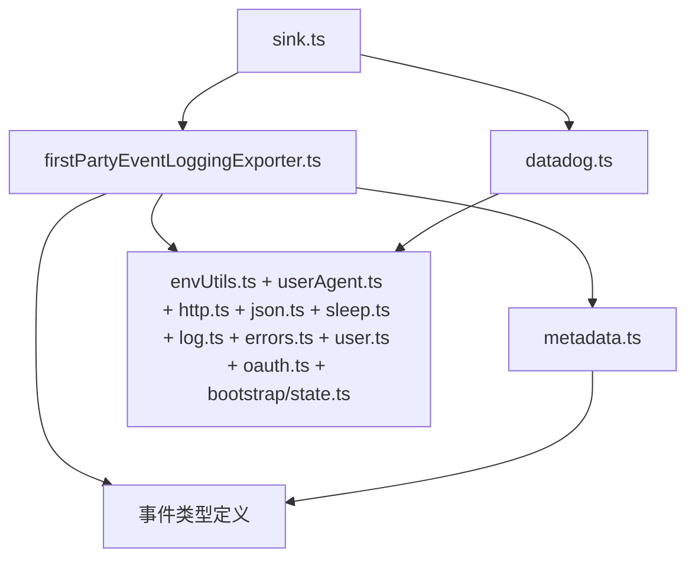

# 数据导出管道

<cite>
**本文档引用的文件**
- [firstPartyEventLoggingExporter.ts](file://src/services/analytics/firstPartyEventLoggingExporter.ts)
- [datadog.ts](file://src/services/analytics/datadog.ts)
- [sink.ts](file://src/services/analytics/sink.ts)
- [metadata.ts](file://src/services/analytics/metadata.ts)
- [index.ts](file://src/services/analytics/index.ts)
- [config.ts](file://src/services/analytics/config.ts)
- [SerialBatchEventUploader.ts](file://src/cli/transports/SerialBatchEventUploader.ts)
- [withRetry.ts](file://src/services/api/withRetry.ts)
- [growthbook.ts](file://src/services/analytics/growthbook.ts)
- [envUtils.ts](file://src/utils/envUtils.ts)
- [userAgent.ts](file://src/utils/userAgent.ts)
- [http.ts](file://src/utils/http.ts)
- [json.ts](file://src/utils/json.ts)
- [sleep.ts](file://src/utils/sleep.ts)
- [log.ts](file://src/utils/log.ts)
- [errors.ts](file://src/utils/errors.ts)
- [user.ts](file://src/utils/user.ts)
- [oauth.ts](file://src/services/oauth/client.ts)
- [bootstrap/state.ts](file://src/bootstrap/state.ts)
- [types/generated/events_mono/claude_code/v1/claude_code_internal_event.ts](file://src/types/generated/events_mono/claude_code/v1/claude_code_internal_event.ts)
- [types/generated/events_mono/growthbook/v1/growthbook_experiment_event.ts](file://src/types/generated/events_mono/growthbook/v1/growthbook_experiment_event.ts)
</cite>

## 目录
1. [简介](#简介)
2. [项目结构](#项目结构)
3. [核心组件](#核心组件)
4. [架构总览](#架构总览)
5. [详细组件分析](#详细组件分析)
6. [依赖关系分析](#依赖关系分析)
7. [性能考量](#性能考量)
8. [故障排查指南](#故障排查指南)
9. [结论](#结论)
10. [附录](#附录)

## 简介
本文件系统性阐述 Claude Code 的数据导出管道，覆盖多后端导出机制（Datadog 集成与第一方事件日志导出）、配置选项、错误处理与重试策略、数据格式转换与字段映射、数据脱敏策略、性能优化（批量与实时传输）、以及监控与故障恢复机制。目标是帮助开发者与运维人员全面理解并高效维护该导出体系。

## 项目结构
导出管道由两条并行路径组成：
- 第一方事件日志导出：基于 OpenTelemetry 批处理器触发，通过 FirstPartyEventLoggingExporter 将事件发送到内部 /api/event_logging/batch 接口，并具备本地失败事件持久化与指数退避重试能力。
- Datadog 集成：在允许条件下，将通用事件以标准化字段写入 Datadog Logs，支持批处理与定时刷新。

图表来源
- [sink.ts:48-86](file://src/services/analytics/sink.ts#L48-L86)
- [firstPartyEventLoggingExporter.ts:277-377](file://src/services/analytics/firstPartyEventLoggingExporter.ts#L277-L377)
- [datadog.ts:160-279](file://src/services/analytics/datadog.ts#L160-L279)
- [metadata.ts:693-743](file://src/services/analytics/metadata.ts#L693-L743)

章节来源
- [sink.ts:1-115](file://src/services/analytics/sink.ts#L1-L115)
- [firstPartyEventLoggingExporter.ts:1-139](file://src/services/analytics/firstPartyEventLoggingExporter.ts#L1-L139)
- [datadog.ts:1-157](file://src/services/analytics/datadog.ts#L1-L157)
- [metadata.ts:1-80](file://src/services/analytics/metadata.ts#L1-L80)

## 核心组件
- Analytics Sink（路由与门控）
  - 负责事件分流至 Datadog 与第一方导出器；支持采样与门控开关。
- FirstPartyEventLoggingExporter（第一方导出器）
  - 基于 OpenTelemetry 批处理器触发，负责将事件序列化为内部事件格式并发送到 /api/event_logging/batch；具备失败事件落盘、指数退避重试、健康探测与立即重试等能力。
- Datadog 导出器
  - 在允许条件下将事件标准化后批量写入 Datadog Logs；支持批大小、刷新间隔与网络超时控制。
- 元数据增强与脱敏
  - 统一构建环境上下文、进程指标与用户认证信息；对敏感字段进行脱敏与裁剪，确保合规。
- 通用上传器（CLI 传输层）
  - 提供串行批处理、背压、指数退避与可选的连续失败丢弃策略，用于 CLI 场景下的可靠传输。

章节来源
- [sink.ts:25-86](file://src/services/analytics/sink.ts#L25-L86)
- [firstPartyEventLoggingExporter.ts:73-139](file://src/services/analytics/firstPartyEventLoggingExporter.ts#L73-L139)
- [datadog.ts:12-157](file://src/services/analytics/datadog.ts#L12-L157)
- [metadata.ts:44-116](file://src/services/analytics/metadata.ts#L44-L116)
- [SerialBatchEventUploader.ts:35-62](file://src/cli/transports/SerialBatchEventUploader.ts#L35-L62)

## 架构总览
下图展示了从事件产生到多后端导出的关键流程与交互：

图表来源
- [sink.ts:48-86](file://src/services/analytics/sink.ts#L48-L86)
- [firstPartyEventLoggingExporter.ts:277-377](file://src/services/analytics/firstPartyEventLoggingExporter.ts#L277-L377)
- [datadog.ts:160-279](file://src/services/analytics/datadog.ts#L160-L279)

## 详细组件分析

### 第一方事件日志导出器（FirstPartyEventLoggingExporter）
- 触发机制
  - 由 OpenTelemetry BatchLogRecordProcessor 控制，按时间间隔或批次大小触发导出。
- 数据转换与脱敏
  - 将事件转换为 ClaudeCodeInternalEvent 或 GrowthbookExperimentEvent 的序列化格式；对 _PROTO_* 字段进行脱敏并分离到特权列。
- 失败处理与重试
  - 失败事件追加写入当前会话的 JSON Lines 文件；采用二次方退避策略，达到最大尝试次数后丢弃。
  - 成功后立即重试队列中的失败事件，保持高可用。
- 认证与降级
  - 若信任未建立或 OAuth 令牌过期，则自动降级为无认证模式；遇到 401 错误时自动回退为无认证重试。
- 配置项
  - 超时、最大批大小、是否跳过认证、批延迟、基础/最大退避延迟、最大尝试次数、基础 URL 与路径等。

图表来源
- [firstPartyEventLoggingExporter.ts:73-139](file://src/services/analytics/firstPartyEventLoggingExporter.ts#L73-L139)
- [firstPartyEventLoggingExporter.ts:277-377](file://src/services/analytics/firstPartyEventLoggingExporter.ts#L277-L377)
- [firstPartyEventLoggingExporter.ts:429-525](file://src/services/analytics/firstPartyEventLoggingExporter.ts#L429-L525)

章节来源
- [firstPartyEventLoggingExporter.ts:58-139](file://src/services/analytics/firstPartyEventLoggingExporter.ts#L58-L139)
- [firstPartyEventLoggingExporter.ts:277-377](file://src/services/analytics/firstPartyEventLoggingExporter.ts#L277-L377)
- [firstPartyEventLoggingExporter.ts:429-525](file://src/services/analytics/firstPartyEventLoggingExporter.ts#L429-L525)
- [firstPartyEventLoggingExporter.ts:527-628](file://src/services/analytics/firstPartyEventLoggingExporter.ts#L527-L628)
- [firstPartyEventLoggingExporter.ts:707-762](file://src/services/analytics/firstPartyEventLoggingExporter.ts#L707-L762)

### Datadog 集成
- 事件范围与门控
  - 仅在生产环境、第一方模型提供商且门控开启时发送；支持白名单事件集合。
- 批处理与刷新
  - 内部维护日志批，达到最大批大小或定时器触发时统一发送；支持自定义刷新间隔。
- 字段标准化与脱敏
  - 将驼峰字段转为蛇形；对状态码进行归一化；对高基数字段进行桶化与标签化；对 MCP 工具名与模型名进行归一化。
- 认证与网络
  - 使用固定客户端令牌；设置网络超时；异常统一记录。

图表来源
- [datadog.ts:160-279](file://src/services/analytics/datadog.ts#L160-L279)

章节来源
- [datadog.ts:12-157](file://src/services/analytics/datadog.ts#L12-L157)
- [datadog.ts:160-279](file://src/services/analytics/datadog.ts#L160-L279)

### Analytics Sink（路由与门控）
- 采样与门控
  - 支持按事件类型采样；Datadog 门控通过 Statsig 动态配置；支持“已杀死”开关。
- 双后端路由
  - Datadog（通用访问）：先剥离 _PROTO_* 字段再发送；1P（特权访问）：保留完整载荷，由导出器拆分。
- 异步接口
  - 当前为“尽力而为”的异步实现，保持接口一致性。

图表来源
- [sink.ts:48-86](file://src/services/analytics/sink.ts#L48-L86)

章节来源
- [sink.ts:25-86](file://src/services/analytics/sink.ts#L25-L86)
- [growthbook.ts:90-110](file://src/services/analytics/growthbook.ts#L90-L110)
- [config.ts:11-27](file://src/services/analytics/config.ts#L11-L27)

### 元数据增强与字段映射
- 元数据来源
  - 环境上下文（平台、架构、版本、CI/容器等）、进程指标（内存、CPU 百分比）、会话与订阅信息、仓库远程哈希、助理模式与技能模式标记等。
- 字段映射与序列化
  - 1P 导出使用蛇形命名；将进程指标编码为 base64；将认证信息映射为 PublicApiAuth。
- 敏感信息处理
  - 对 MCP 工具名、文件扩展名等进行脱敏；对工具输入参数进行长度与深度限制；对未知键进行编译期约束以避免漏报。

图表来源
- [metadata.ts:693-743](file://src/services/analytics/metadata.ts#L693-L743)
- [metadata.ts:800-974](file://src/services/analytics/metadata.ts#L800-L974)

章节来源
- [metadata.ts:44-116](file://src/services/analytics/metadata.ts#L44-L116)
- [metadata.ts:693-743](file://src/services/analytics/metadata.ts#L693-L743)
- [metadata.ts:800-974](file://src/services/analytics/metadata.ts#L800-L974)

### 数据脱敏策略
- 通用脱敏
  - stripProtoFields：移除所有以 _PROTO_ 开头的键，防止敏感信息进入通用访问字段。
- 事件特定脱敏
  - MCP 工具名与服务器名在非授权场景下被替换为安全占位符；文件扩展名超过阈值时替换为“other”。
- 输入裁剪
  - 工具输入参数按字符串长度、集合大小、嵌套深度与 JSON 总长度进行裁剪，避免泄露敏感内容。

章节来源
- [index.ts:35-58](file://src/services/analytics/index.ts#L35-L58)
- [metadata.ts:60-116](file://src/services/analytics/metadata.ts#L60-L116)
- [metadata.ts:236-303](file://src/services/analytics/metadata.ts#L236-L303)

### 错误处理与重试机制
- 第一方导出器
  - 失败事件落盘；二次方退避（base × attempts^2，上限约束）；达到最大尝试次数后丢弃；成功后立即重试队列。
  - 支持“杀死开关”，在开关激活时短路网络请求并保留退避计时。
  - 遇到 401 自动降级为无认证重试。
- Datadog 导出器
  - 异常统一记录；批大小与定时刷新保障稳定性。
- 通用 API 重试
  - 基于 withRetry 的可中断重试循环，支持瞬时容量错误与云凭证错误处理；长睡眠分块输出心跳，避免会话空闲。

图表来源
- [firstPartyEventLoggingExporter.ts:429-525](file://src/services/analytics/firstPartyEventLoggingExporter.ts#L429-L525)
- [firstPartyEventLoggingExporter.ts:527-628](file://src/services/analytics/firstPartyEventLoggingExporter.ts#L527-L628)

章节来源
- [firstPartyEventLoggingExporter.ts:429-525](file://src/services/analytics/firstPartyEventLoggingExporter.ts#L429-L525)
- [firstPartyEventLoggingExporter.ts:527-628](file://src/services/analytics/firstPartyEventLoggingExporter.ts#L527-L628)
- [withRetry.ts:353-514](file://src/services/api/withRetry.ts#L353-L514)

### 配置选项与环境变量
- 通用配置
  - isAnalyticsDisabled：测试环境、第三方云提供商、隐私级别禁用时关闭分析。
- Datadog
  - CLAUDE_CODE_DATADOG_FLUSH_INTERVAL_MS：刷新间隔覆盖；事件白名单；字段标准化与标签策略。
- 第一方导出器
  - tengu_1p_event_batch_config：基础 URL、路径、批大小、超时、退避参数等；可通过运行时配置重建日志提供者。
  - ANTHROPIC_BASE_URL：决定生产/预发环境；支持代理网关场景。
- 认证与信任
  - TRUST_DIALOG 与非交互会话影响认证策略；OAuth 令牌过期时自动降级。
- 用户代理与认证头
  - 统一 User-Agent；根据信任状态动态注入认证头。

章节来源
- [config.ts:11-27](file://src/services/analytics/config.ts#L11-L27)
- [datadog.ts:301-307](file://src/services/analytics/datadog.ts#L301-L307)
- [firstPartyEventLoggingExporter.ts:111-139](file://src/services/analytics/firstPartyEventLoggingExporter.ts#L111-L139)
- [growthbook.ts:90-110](file://src/services/analytics/growthbook.ts#L90-L110)
- [userAgent.ts](file://src/utils/userAgent.ts)
- [http.ts](file://src/utils/http.ts)
- [bootstrap/state.ts](file://src/bootstrap/state.ts)

### 性能优化与批量处理
- 批量策略
  - Datadog：最大批大小与定时刷新；1P：OpenTelemetry 批处理器默认阈值；CLI 传输器：最大批大小与字节上限。
- 背压与队列
  - CLI 传输器支持队列深度限制与阻塞式 enqueue；释放背压时批量唤醒等待者。
- 实时性与抖动
  - CLI 传输器引入随机抖动避免“惊群效应”；1P 导出成功后立即重试队列，提升实时性。
- 序列化与 I/O
  - JSON Lines 追加写入，原子性保障；失败事件按批落盘，减少碎片化。

章节来源
- [datadog.ts:15-17](file://src/services/analytics/datadog.ts#L15-L17)
- [firstPartyEventLoggingExporter.ts:123-128](file://src/services/analytics/firstPartyEventLoggingExporter.ts#L123-L128)
- [SerialBatchEventUploader.ts:35-62](file://src/cli/transports/SerialBatchEventUploader.ts#L35-L62)
- [SerialBatchEventUploader.ts:204-233](file://src/cli/transports/SerialBatchEventUploader.ts#L204-L233)

### 监控与质量保证
- 日志与调试
  - 1P 导出器在 ant 用户类型下输出详细调试日志；异常上下文包含请求 ID、状态码与消息。
- 失败事件追踪
  - 通过会话 ID 与批次 UUID 组合定位失败文件；提供 droppedBatchCount 与 pendingCount 便于诊断。
- 健康探测与降级
  - 1P 导出器在成功后立即重试队列；遇到 401 自动降级；“杀死开关”完全停止网络活动但保留退避计时。
- 卡片化与告警
  - Datadog 使用用户桶（30 个桶）估算受影响用户数，降低基数同时保护隐私。

章节来源
- [firstPartyEventLoggingExporter.ts:773-780](file://src/services/analytics/firstPartyEventLoggingExporter.ts#L773-L780)
- [firstPartyEventLoggingExporter.ts:445-467](file://src/services/analytics/firstPartyEventLoggingExporter.ts#L445-L467)
- [datadog.ts:281-299](file://src/services/analytics/datadog.ts#L281-L299)

## 依赖关系分析

图表来源
- [sink.ts:11-15](file://src/services/analytics/sink.ts#L11-L15)
- [firstPartyEventLoggingExporter.ts:1-36](file://src/services/analytics/firstPartyEventLoggingExporter.ts#L1-L36)
- [datadog.ts:1-11](file://src/services/analytics/datadog.ts#L1-L11)
- [metadata.ts:1-36](file://src/services/analytics/metadata.ts#L1-L36)

章节来源
- [sink.ts:11-15](file://src/services/analytics/sink.ts#L11-L15)
- [firstPartyEventLoggingExporter.ts:1-36](file://src/services/analytics/firstPartyEventLoggingExporter.ts#L1-L36)
- [datadog.ts:1-11](file://src/services/analytics/datadog.ts#L1-L11)
- [metadata.ts:1-36](file://src/services/analytics/metadata.ts#L1-L36)

## 性能考量
- 批量优先：优先使用批处理减少网络往返；Datadog 与 1P 导出均内置批策略。
- 退避与抖动：二次方退避配合随机抖动，避免雪崩与惊群；CLI 传输器支持服务端 Retry-After。
- 背压与队列：enqueue 阻塞直至空间释放，避免内存膨胀；批量唤醒等待者提升吞吐。
- 序列化成本：JSON Lines 追加写入，避免频繁重写；对大对象进行裁剪与编码。
- 实时性：1P 成功后立即重试队列，缩短端到端延迟。

## 故障排查指南
- Datadog 未收到数据
  - 检查 NODE_ENV 是否为 production；确认门控开启；核对事件是否在白名单中；查看刷新间隔配置。
- 1P 导出持续失败
  - 查看失败事件文件（按会话与批次 UUID 定位）；关注退避计时与最大尝试次数；确认“杀死开关”状态。
  - 若出现 401，确认信任状态与 OAuth 令牌有效性；必要时降级为无认证模式。
- CLI 传输丢包
  - 检查 maxConsecutiveFailures 配置；观察 droppedBatchCount；确认 maxBatchBytes 与 maxBatchSize 设置是否合理。
- 认证问题
  - 确认 TRUST_DIALOG 状态与非交互会话策略；OAuth 令牌过期时自动降级；必要时重新授权。
- 性能瓶颈
  - 调整批大小与刷新间隔；启用或调整退避参数；检查队列深度与背压行为。

章节来源
- [datadog.ts:160-279](file://src/services/analytics/datadog.ts#L160-L279)
- [firstPartyEventLoggingExporter.ts:429-525](file://src/services/analytics/firstPartyEventLoggingExporter.ts#L429-L525)
- [SerialBatchEventUploader.ts:152-202](file://src/cli/transports/SerialBatchEventUploader.ts#L152-L202)
- [withRetry.ts:353-514](file://src/services/api/withRetry.ts#L353-L514)

## 结论
该导出管道通过“双后端并行 + 多层容错”的设计，在保证数据合规与隐私的前提下，实现了高可靠性与高性能的事件导出。Datadog 侧专注通用观测，第一方导出器聚焦特权数据与长期留存；结合门控、采样、脱敏与指数退避等机制，能够有效应对网络波动与服务过载，满足企业级监控与分析需求。

## 附录
- 关键类型与协议
  - ClaudeCodeInternalEvent、GrowthbookExperimentEvent：事件序列化与字段映射依据。
- 相关工具函数
  - stripProtoFields：通用脱敏；jsonStringify：安全序列化；sleep：分块睡眠；log/error：统一日志与错误处理。

章节来源
- [types/generated/events_mono/claude_code/v1/claude_code_internal_event.ts](file://src/types/generated/events_mono/claude_code/v1/claude_code_internal_event.ts)
- [types/generated/events_mono/growthbook/v1/growthbook_experiment_event.ts](file://src/types/generated/events_mono/growthbook/v1/growthbook_experiment_event.ts)
- [index.ts:35-58](file://src/services/analytics/index.ts#L35-L58)
- [json.ts](file://src/utils/json.ts)
- [sleep.ts](file://src/utils/sleep.ts)
- [log.ts](file://src/utils/log.ts)
- [errors.ts](file://src/utils/errors.ts)