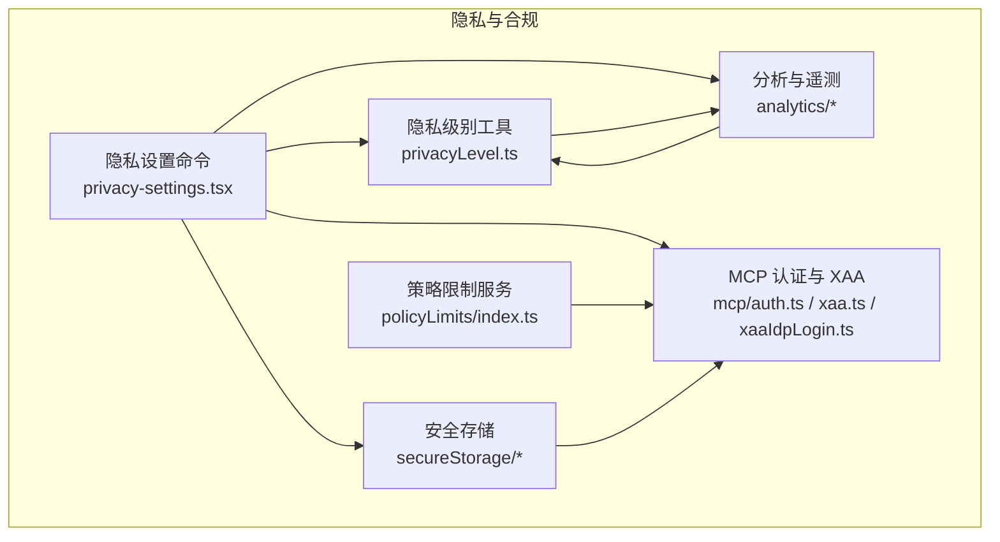
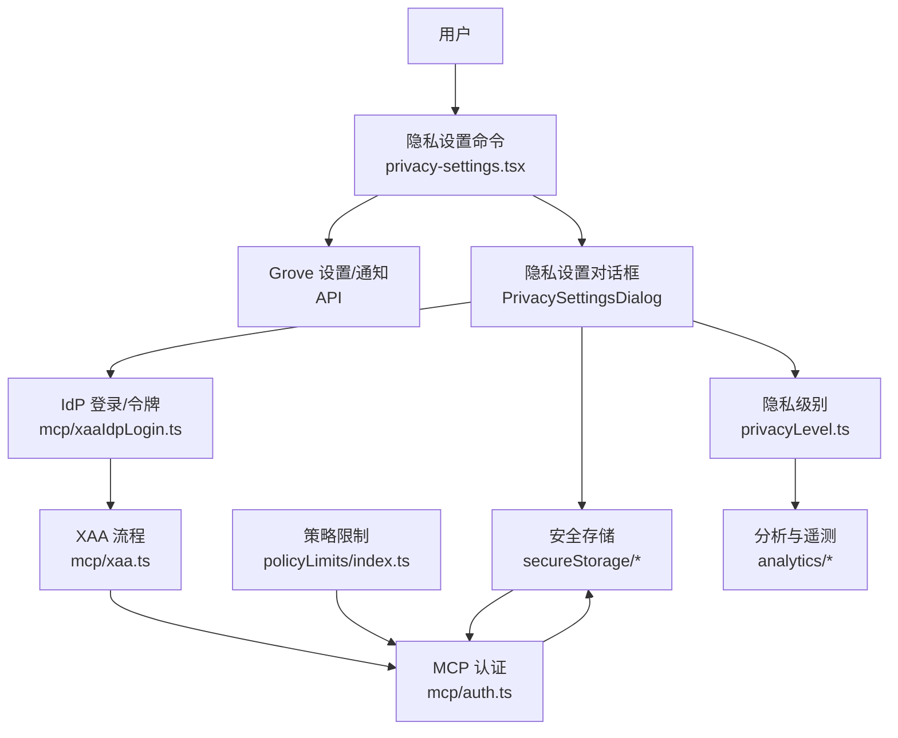
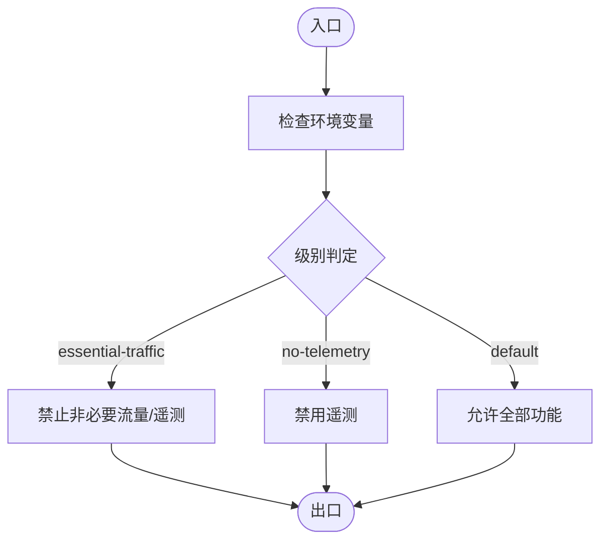
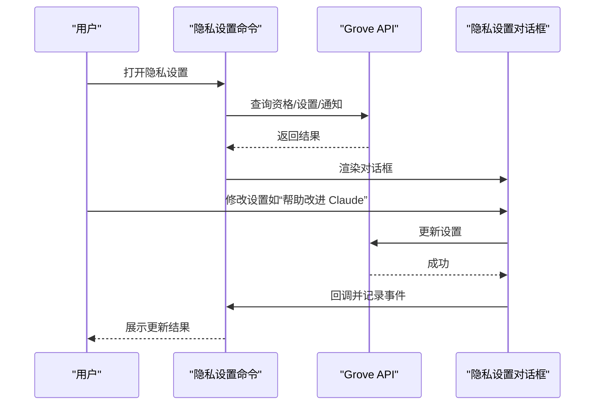
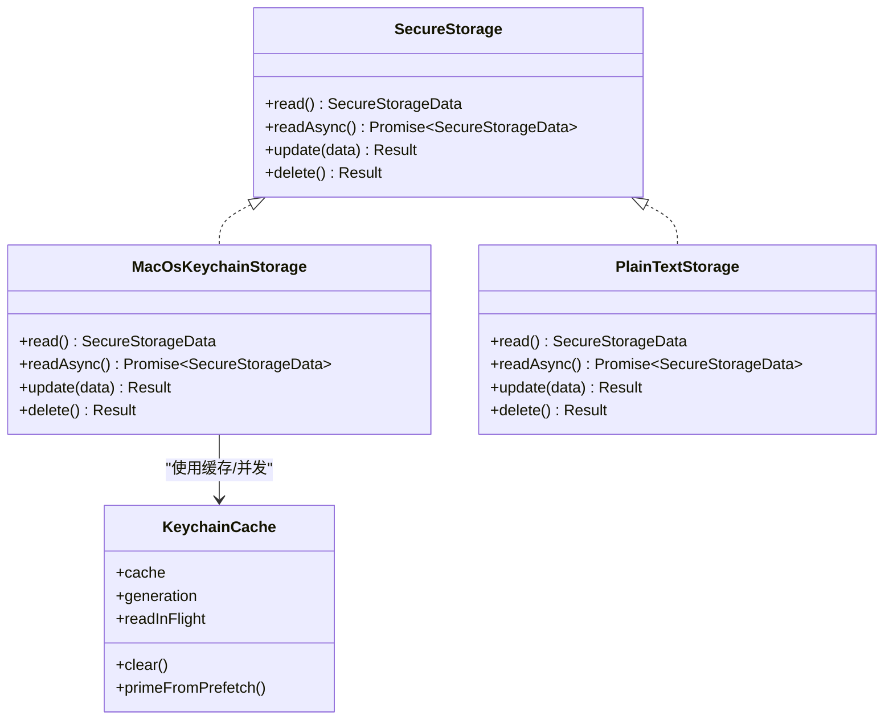
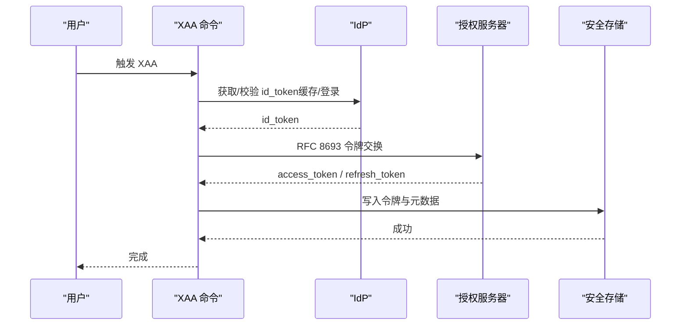
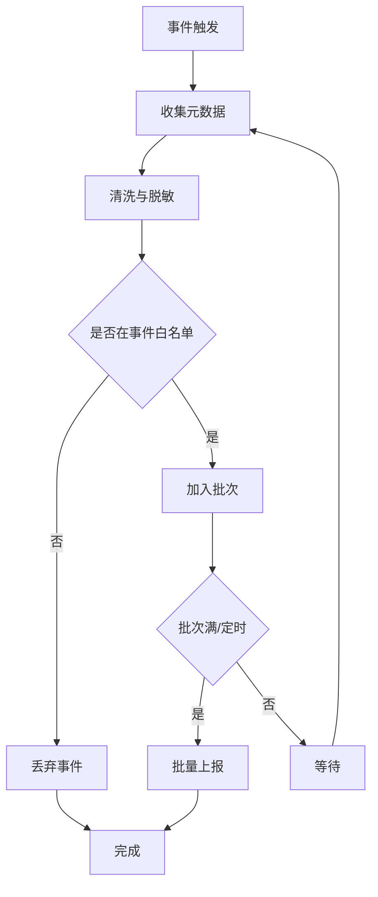
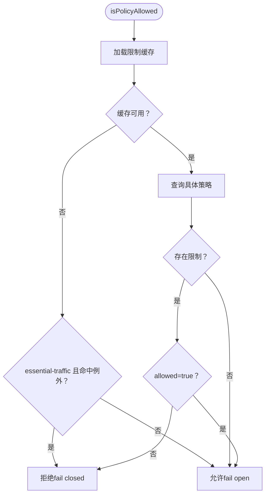
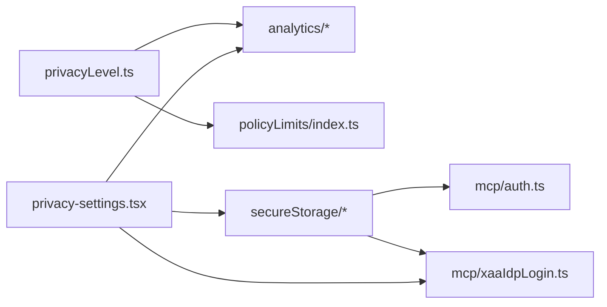

# 隐私与合规

<cite>
**本文引用的文件**
- [privacy-settings.tsx](file://src/commands/privacy-settings/privacy-settings.tsx)
- [privacyLevel.ts](file://src/utils/privacyLevel.ts)
- [policyLimits/index.ts](file://src/services/policyLimits/index.ts)
- [datadog.ts](file://src/services/analytics/datadog.ts)
- [metadata.ts](file://src/services/analytics/metadata.ts)
- [index.ts](file://src/utils/secureStorage/index.ts)
- [macOsKeychainStorage.ts](file://src/utils/secureStorage/macOsKeychainStorage.ts)
- [macOsKeychainHelpers.ts](file://src/utils/secureStorage/macOsKeychainHelpers.ts)
- [auth.ts](file://src/services/mcp/auth.ts)
- [xaa.ts](file://src/services/mcp/xaa.ts)
- [xaaIdpLogin.ts](file://src/services/mcp/xaaIdpLogin.ts)
- [xaaIdpCommand.ts](file://src/commands/mcp/xaaIdpCommand.ts)
- [SECURITY.md](file://SECURITY.md)
- [CLAUDE.md](file://CLAUDE.md)
</cite>

## 目录
1. [简介](#简介)
2. [项目结构](#项目结构)
3. [核心组件](#核心组件)
4. [架构总览](#架构总览)
5. [详细组件分析](#详细组件分析)
6. [依赖关系分析](#依赖关系分析)
7. [性能考量](#性能考量)
8. [故障排查指南](#故障排查指南)
9. [结论](#结论)
10. [附录](#附录)

## 简介
本文件面向 Claude Code 的隐私与合规体系，系统梳理数据隐私保护机制（敏感信息检测、数据脱敏与匿名化）、合规性框架（GDPR、CCPA 等遵循与用户权利管理）、数据最小化与存储期限、删除机制、隐私影响评估（PIA）、数据治理与审计追踪，以及用户控制面板、数据访问请求与违规处理流程。文档以仓库现有实现为依据，结合可操作的流程建议，帮助开发者与运营人员正确落地隐私与合规要求。

## 项目结构
围绕隐私与合规的关键模块分布如下：
- 隐私级别与流量限制：通过环境变量与运行时逻辑控制非必要网络与遥测行为
- 用户隐私设置对话框与引导：提供“帮助改进 Claude”等开关与跳转链接
- 安全存储与密钥管理：基于平台的安全存储实现，保障令牌与配置的机密性
- 跨应用访问（XAA）与 OAuth：支持 OIDC 登录与令牌交换，减少明文凭据暴露
- 分析与遥测：事件元数据清洗、PII 规则与批量上报
- 安全策略与政策限制：按组织或策略缓存控制功能启用范围

**图示来源**
- [privacy-settings.tsx:1-58](file://src/commands/privacy-settings/privacy-settings.tsx#L1-L58)
- [privacyLevel.ts:1-56](file://src/utils/privacyLevel.ts#L1-L56)
- [policyLimits/index.ts:497-549](file://src/services/policyLimits/index.ts#L497-L549)
- [index.ts:1-17](file://src/utils/secureStorage/index.ts#L1-L17)
- [macOsKeychainStorage.ts:1-161](file://src/utils/secureStorage/macOsKeychainStorage.ts#L1-L161)
- [auth.ts:461-670](file://src/services/mcp/auth.ts#L461-L670)
- [xaa.ts:398-439](file://src/services/mcp/xaa.ts#L398-L439)
- [xaaIdpLogin.ts:78-194](file://src/services/mcp/xaaIdpLogin.ts#L78-L194)
- [datadog.ts:1-308](file://src/services/analytics/datadog.ts#L1-L308)
- [metadata.ts:1-800](file://src/services/analytics/metadata.ts#L1-L800)

**章节来源**
- [privacy-settings.tsx:1-58](file://src/commands/privacy-settings/privacy-settings.tsx#L1-L58)
- [privacyLevel.ts:1-56](file://src/utils/privacyLevel.ts#L1-L56)
- [policyLimits/index.ts:497-549](file://src/services/policyLimits/index.ts#L497-L549)
- [index.ts:1-17](file://src/utils/secureStorage/index.ts#L1-L17)
- [macOsKeychainStorage.ts:1-161](file://src/utils/secureStorage/macOsKeychainStorage.ts#L1-L161)
- [auth.ts:461-670](file://src/services/mcp/auth.ts#L461-L670)
- [xaa.ts:398-439](file://src/services/mcp/xaa.ts#L398-L439)
- [xaaIdpLogin.ts:78-194](file://src/services/mcp/xaaIdpLogin.ts#L78-L194)
- [datadog.ts:1-308](file://src/services/analytics/datadog.ts#L1-L308)
- [metadata.ts:1-800](file://src/services/analytics/metadata.ts#L1-L800)

## 核心组件
- 隐私级别与流量限制
  - 通过环境变量与运行时函数控制“仅必要流量”“禁用遥测”“默认”三个等级，决定是否发送非必要网络请求与遥测事件
- 用户隐私设置对话框
  - 基于用户资格与配置显示隐私设置界面，支持“帮助改进 Claude”开关，并记录切换事件
- 安全存储与密钥管理
  - 平台化安全存储（macOS 使用钥匙串，其他平台使用明文存储），并提供缓存与并发读写一致性保障
- 跨应用访问（XAA）与 OAuth
  - 支持 OIDC 登录与令牌交换，集中缓存 IdP 令牌，避免重复弹窗；保存与刷新令牌时进行最小化持久化
- 分析与遥测
  - 事件元数据清洗（工具名、扩展名、输入参数截断）、PII 标记类型、批量上报与刷新间隔控制

**章节来源**
- [privacyLevel.ts:1-56](file://src/utils/privacyLevel.ts#L1-L56)
- [privacy-settings.tsx:1-58](file://src/commands/privacy-settings/privacy-settings.tsx#L1-L58)
- [index.ts:1-17](file://src/utils/secureStorage/index.ts#L1-L17)
- [macOsKeychainStorage.ts:1-161](file://src/utils/secureStorage/macOsKeychainStorage.ts#L1-L161)
- [auth.ts:461-670](file://src/services/mcp/auth.ts#L461-L670)
- [xaa.ts:398-439](file://src/services/mcp/xaa.ts#L398-L439)
- [xaaIdpLogin.ts:78-194](file://src/services/mcp/xaaIdpLogin.ts#L78-L194)
- [datadog.ts:1-308](file://src/services/analytics/datadog.ts#L1-L308)
- [metadata.ts:1-800](file://src/services/analytics/metadata.ts#L1-L800)

## 架构总览
下图展示隐私与合规相关模块之间的交互关系，重点体现数据流与控制点：

**图示来源**
- [privacy-settings.tsx:1-58](file://src/commands/privacy-settings/privacy-settings.tsx#L1-L58)
- [privacyLevel.ts:1-56](file://src/utils/privacyLevel.ts#L1-L56)
- [policyLimits/index.ts:497-549](file://src/services/policyLimits/index.ts#L497-L549)
- [index.ts:1-17](file://src/utils/secureStorage/index.ts#L1-L17)
- [macOsKeychainStorage.ts:1-161](file://src/utils/secureStorage/macOsKeychainStorage.ts#L1-L161)
- [auth.ts:461-670](file://src/services/mcp/auth.ts#L461-L670)
- [xaa.ts:398-439](file://src/services/mcp/xaa.ts#L398-L439)
- [xaaIdpLogin.ts:78-194](file://src/services/mcp/xaaIdpLogin.ts#L78-L194)
- [datadog.ts:1-308](file://src/services/analytics/datadog.ts#L1-L308)
- [metadata.ts:1-800](file://src/services/analytics/metadata.ts#L1-L800)

## 详细组件分析

### 组件一：隐私级别与流量限制
- 功能要点
  - 三种隐私级别：default、no-telemetry、essential-traffic
  - essential-traffic 下禁止非必要网络与遥测；no-telemetry 下关闭分析与反馈
  - 通过环境变量优先级确定最终级别
- 数据与控制流
  - 运行时读取环境变量，返回当前级别与判定函数
  - 其他模块据此决定是否发起网络请求或记录事件
- 复杂度与性能
  - 级别判定为 O(1)，对启动与运行时开销极小
- 合规意义
  - 满足“数据最小化”原则，允许用户在严格隐私模式下仅传输必要数据

**图示来源**
- [privacyLevel.ts:1-56](file://src/utils/privacyLevel.ts#L1-L56)

**章节来源**
- [privacyLevel.ts:1-56](file://src/utils/privacyLevel.ts#L1-L56)

### 组件二：用户隐私设置对话框与引导
- 功能要点
  - 判断用户资格，拉取设置与通知配置
  - 显示隐私设置对话框或条款对话框；支持“帮助改进 Claude”开关
  - 记录开关切换事件，便于审计
- 数据与控制流
  - 命令调用 API 获取设置与配置
  - 对话框更新后重新获取最新设置，比较变化并记录事件
- 合规意义
  - 提供透明的用户控制入口，满足用户同意与撤回同意的权利

**图示来源**
- [privacy-settings.tsx:1-58](file://src/commands/privacy-settings/privacy-settings.tsx#L1-L58)

**章节来源**
- [privacy-settings.tsx:1-58](file://src/commands/privacy-settings/privacy-settings.tsx#L1-L58)

### 组件三：安全存储与密钥管理
- 功能要点
  - 平台选择：macOS 使用钥匙串 + 明文回退；其他平台使用明文存储
  - 缓存与并发：读写分离、缓存 TTL、生成号防止过期写入
  - 写入策略：优先 stdin 注入以降低进程监控可见性
- 数据与控制流
  - 读取：先查缓存，超时再异步刷新；失败时回退到旧缓存
  - 更新：先失效缓存，再写入；成功后更新缓存
  - 删除：同更新流程，但执行删除操作
- 合规意义
  - 将敏感凭据（如 IdP 令牌、OAuth 刷新令牌）隔离在受控存储中，降低泄露风险

**图示来源**
- [index.ts:1-17](file://src/utils/secureStorage/index.ts#L1-L17)
- [macOsKeychainStorage.ts:1-161](file://src/utils/secureStorage/macOsKeychainStorage.ts#L1-L161)
- [macOsKeychainHelpers.ts:71-111](file://src/utils/secureStorage/macOsKeychainHelpers.ts#L71-L111)

**章节来源**
- [index.ts:1-17](file://src/utils/secureStorage/index.ts#L1-L17)
- [macOsKeychainStorage.ts:1-161](file://src/utils/secureStorage/macOsKeychainStorage.ts#L1-L161)
- [macOsKeychainHelpers.ts:71-111](file://src/utils/secureStorage/macOsKeychainHelpers.ts#L71-L111)

### 组件四：跨应用访问（XAA）与 OAuth
- 功能要点
  - IdP 一次性登录，集中缓存 id_token，避免重复弹窗
  - RFC 8693 + RFC 7523 令牌交换，无浏览器参与
  - 保存令牌与刷新令牌，保留客户端凭据以确保撤销端点可用
- 数据与控制流
  - 发现受保护资源与授权服务器元数据
  - 执行令牌交换，获得访问令牌与刷新令牌
  - 写入安全存储，记录到期时间与作用域
- 合规意义
  - 减少用户交互与明文凭据暴露，提升最小权限与可撤销性

**图示来源**
- [xaa.ts:398-439](file://src/services/mcp/xaa.ts#L398-L439)
- [auth.ts:1791-1824](file://src/services/mcp/auth.ts#L1791-L1824)
- [xaaIdpLogin.ts:78-194](file://src/services/mcp/xaaIdpLogin.ts#L78-L194)

**章节来源**
- [xaa.ts:398-439](file://src/services/mcp/xaa.ts#L398-L439)
- [auth.ts:1791-1824](file://src/services/mcp/auth.ts#L1791-L1824)
- [xaaIdpLogin.ts:78-194](file://src/services/mcp/xaaIdpLogin.ts#L78-L194)

### 组件五：分析与遥测（PII 检测与脱敏）
- 功能要点
  - 事件白名单与元数据清洗：工具名标准化、输入参数截断、扩展名脱敏
  - PII 类型标记：通过专用类型约束，强制开发者显式确认不包含敏感信息
  - 批量上报与刷新：定时器与批量大小控制，避免高频网络
- 数据与控制流
  - 事件发生时收集元数据，进行清洗与截断
  - 按白名单过滤事件，构建日志条目并加入批次
  - 达到阈值或定时触发后批量上报
- 合规意义
  - 降低遥测中的敏感信息暴露面，满足最小化与去标识化要求

**图示来源**
- [datadog.ts:1-308](file://src/services/analytics/datadog.ts#L1-L308)
- [metadata.ts:1-800](file://src/services/analytics/metadata.ts#L1-L800)

**章节来源**
- [datadog.ts:1-308](file://src/services/analytics/datadog.ts#L1-L308)
- [metadata.ts:1-800](file://src/services/analytics/metadata.ts#L1-L800)

### 组件六：策略限制与功能启用控制
- 功能要点
  - 在“仅必要流量”模式下，缓存不可用时对特定策略默认拒绝，避免静默放行
  - 从会话缓存或文件加载限制，未知策略默认允许（fail open）
- 数据与控制流
  - 读取策略缓存或本地缓存
  - 根据模式与缓存状态决定允许与否
- 合规意义
  - 在网络受限场景下仍能维持最小权限边界，符合“默认拒绝”的安全设计

**图示来源**
- [policyLimits/index.ts:497-549](file://src/services/policyLimits/index.ts#L497-L549)

**章节来源**
- [policyLimits/index.ts:497-549](file://src/services/policyLimits/index.ts#L497-L549)

## 依赖关系分析
- 模块耦合
  - 隐私级别工具被分析与策略限制广泛依赖，形成“全局开关”
  - 安全存储被 MCP 认证与 IdP 登录模块依赖，保证凭据安全
  - 隐私设置命令依赖 API 与对话框组件，形成用户交互闭环
- 外部依赖
  - 分析模块依赖网络与第三方日志端点；安全存储依赖平台原生能力
- 循环依赖
  - 当前实现未见循环依赖迹象

**图示来源**
- [privacyLevel.ts:1-56](file://src/utils/privacyLevel.ts#L1-L56)
- [policyLimits/index.ts:497-549](file://src/services/policyLimits/index.ts#L497-L549)
- [index.ts:1-17](file://src/utils/secureStorage/index.ts#L1-L17)
- [macOsKeychainStorage.ts:1-161](file://src/utils/secureStorage/macOsKeychainStorage.ts#L1-L161)
- [auth.ts:461-670](file://src/services/mcp/auth.ts#L461-L670)
- [xaaIdpLogin.ts:78-194](file://src/services/mcp/xaaIdpLogin.ts#L78-L194)
- [privacy-settings.tsx:1-58](file://src/commands/privacy-settings/privacy-settings.tsx#L1-L58)

**章节来源**
- [privacyLevel.ts:1-56](file://src/utils/privacyLevel.ts#L1-L56)
- [policyLimits/index.ts:497-549](file://src/services/policyLimits/index.ts#L497-L549)
- [index.ts:1-17](file://src/utils/secureStorage/index.ts#L1-L17)
- [macOsKeychainStorage.ts:1-161](file://src/utils/secureStorage/macOsKeychainStorage.ts#L1-L161)
- [auth.ts:461-670](file://src/services/mcp/auth.ts#L461-L670)
- [xaaIdpLogin.ts:78-194](file://src/services/mcp/xaaIdpLogin.ts#L78-L194)
- [privacy-settings.tsx:1-58](file://src/commands/privacy-settings/privacy-settings.tsx#L1-L58)

## 性能考量
- 隐私级别判定与策略缓存均为 O(1)，对性能影响可忽略
- 分析模块采用批量与定时刷新，避免频繁网络请求
- 安全存储使用缓存与惰性刷新，减少系统调用
- 建议
  - 在高负载场景下，适当增大分析模块的批量阈值与刷新间隔
  - 对 IdP 令牌与 OAuth 刷新令牌的读写进行限流与重试退避

[本节为通用指导，无需列出具体文件来源]

## 故障排查指南
- 隐私设置无法打开或显示错误
  - 检查用户资格与 API 可用性；确认对话框回调与事件记录路径
  - 参考：[privacy-settings.tsx:1-58](file://src/commands/privacy-settings/privacy-settings.tsx#L1-L58)
- 非必要流量未被屏蔽
  - 检查环境变量与隐私级别判定逻辑
  - 参考：[privacyLevel.ts:1-56](file://src/utils/privacyLevel.ts#L1-L56)
- 遥测事件未上报或数量异常
  - 检查事件白名单、批处理阈值与刷新间隔
  - 参考：[datadog.ts:1-308](file://src/services/analytics/datadog.ts#L1-L308)
- 安全存储读写失败或凭据丢失
  - 检查平台存储实现与缓存状态；确认写入是否使用 stdin 注入
  - 参考：[index.ts:1-17](file://src/utils/secureStorage/index.ts#L1-L17)、[macOsKeychainStorage.ts:1-161](file://src/utils/secureStorage/macOsKeychainStorage.ts#L1-L161)
- XAA 登录或令牌交换失败
  - 检查 IdP 令牌缓存、授权服务器元数据与令牌交换流程
  - 参考：[xaa.ts:398-439](file://src/services/mcp/xaa.ts#L398-L439)、[auth.ts:1791-1824](file://src/services/mcp/auth.ts#L1791-L1824)、[xaaIdpLogin.ts:78-194](file://src/services/mcp/xaaIdpLogin.ts#L78-L194)

**章节来源**
- [privacy-settings.tsx:1-58](file://src/commands/privacy-settings/privacy-settings.tsx#L1-L58)
- [privacyLevel.ts:1-56](file://src/utils/privacyLevel.ts#L1-L56)
- [datadog.ts:1-308](file://src/services/analytics/datadog.ts#L1-L308)
- [index.ts:1-17](file://src/utils/secureStorage/index.ts#L1-L17)
- [macOsKeychainStorage.ts:1-161](file://src/utils/secureStorage/macOsKeychainStorage.ts#L1-L161)
- [xaa.ts:398-439](file://src/services/mcp/xaa.ts#L398-L439)
- [auth.ts:1791-1824](file://src/services/mcp/auth.ts#L1791-L1824)
- [xaaIdpLogin.ts:78-194](file://src/services/mcp/xaaIdpLogin.ts#L78-L194)

## 结论
本项目已具备较为完善的隐私与合规基础：通过隐私级别与策略限制实现“最小化”与“默认拒绝”，通过安全存储与 XAA/OAuth 实现凭据最小化与可撤销性，通过分析模块的 PII 检测与脱敏实现数据最小化与匿名化。建议在现有基础上补充隐私影响评估（PIA）、数据生命周期管理（存储期限与自动删除）、用户数据访问与删除请求流程、以及针对 GDPR/CCPA 的自动化合规工具链，以进一步完善合规体系。

[本节为总结性内容，无需列出具体文件来源]

## 附录

### 合规性框架与用户权利（建议实践）
- 数据最小化
  - 仅在 essential-traffic 之外的场景启用非必要网络；遥测事件严格白名单
- 存储期限与删除
  - 为日志与缓存设定 TTL；提供一键清理与导出功能
- 用户权利
  - 提供数据访问与删除请求入口；记录每次请求与处理结果
- 隐私影响评估（PIA）
  - 对新增功能进行 PIA；建立变更评审与合规审计流程
- 审计追踪
  - 记录用户设置变更、遥测开关、凭据写入/删除等关键动作

[本节为概念性内容，无需列出具体文件来源]

### 相关文档与政策
- 安全策略与漏洞报告
  - 参考：[SECURITY.md:1-22](file://SECURITY.md#L1-L22)
- 项目背景与架构说明
  - 参考：[CLAUDE.md:1-116](file://CLAUDE.md#L1-L116)

**章节来源**
- [SECURITY.md:1-22](file://SECURITY.md#L1-L22)
- [CLAUDE.md:1-116](file://CLAUDE.md#L1-L116)