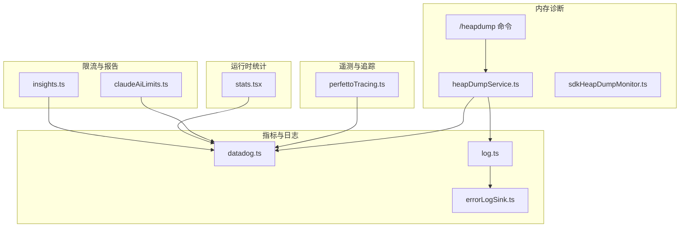
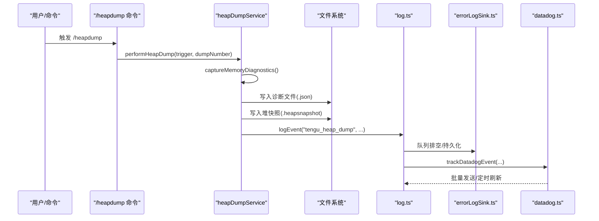
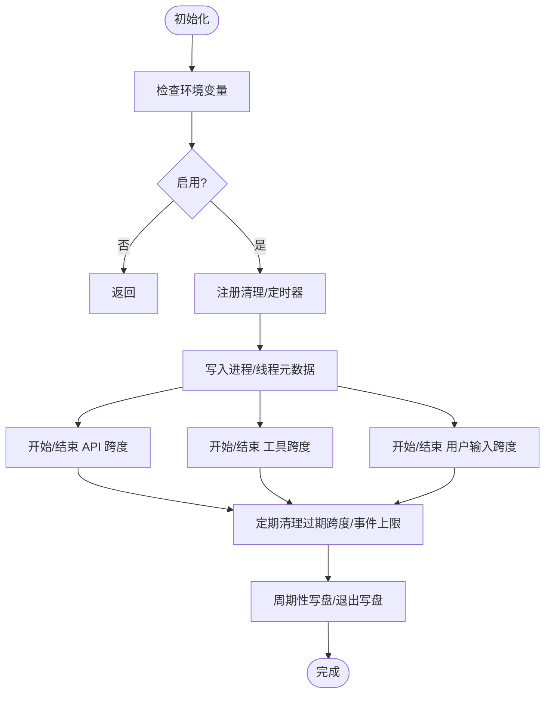
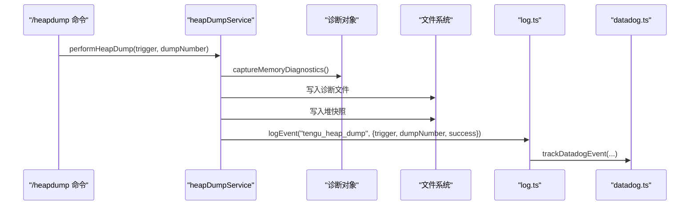
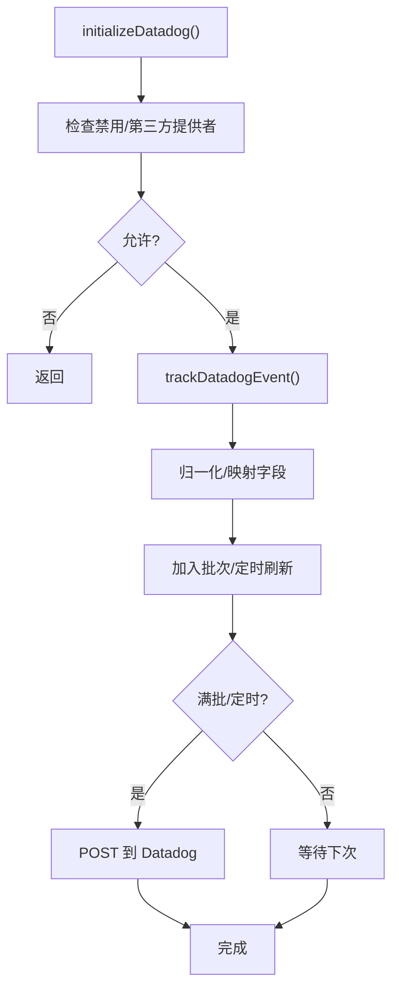
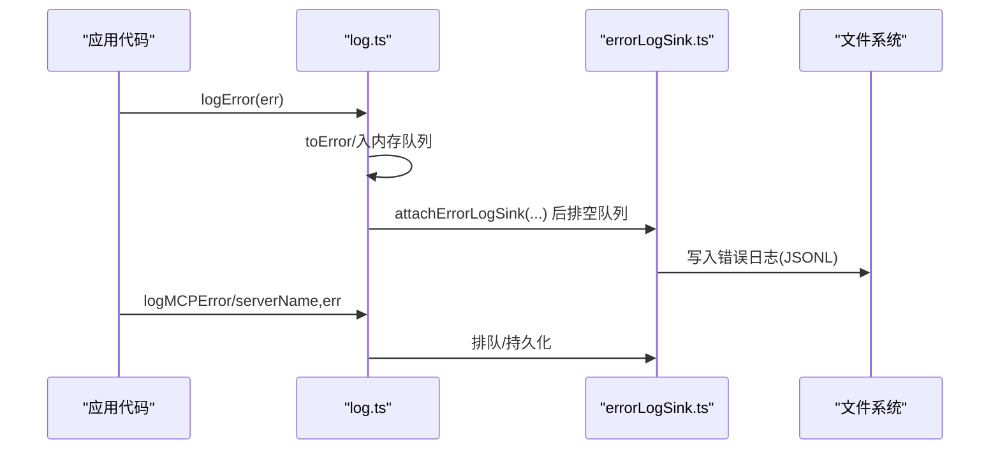
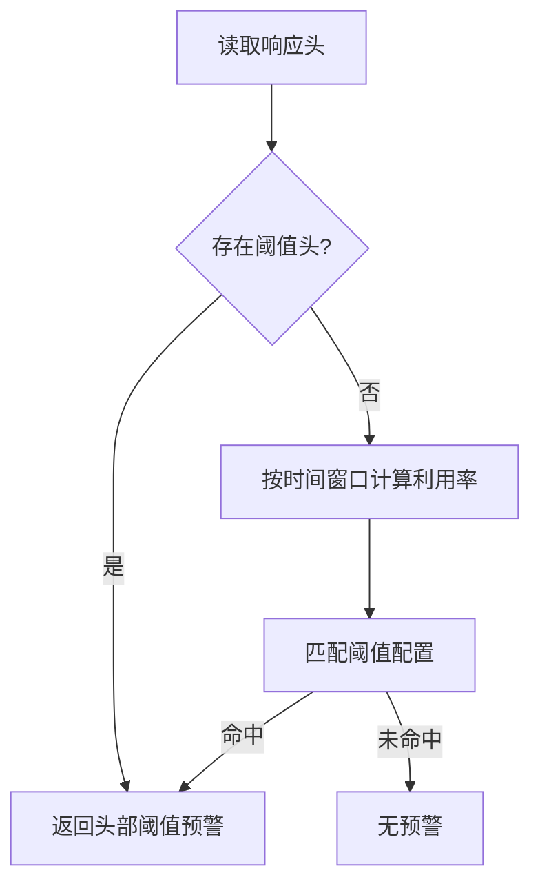
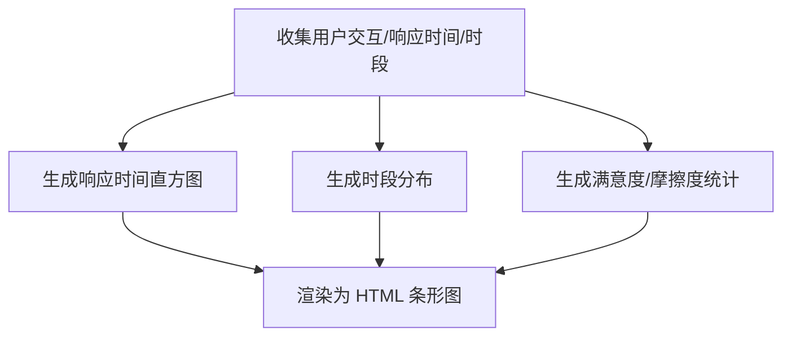
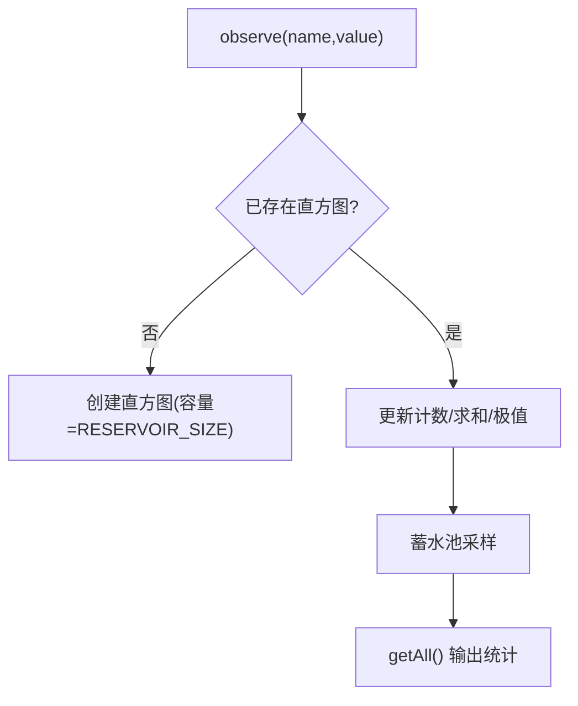
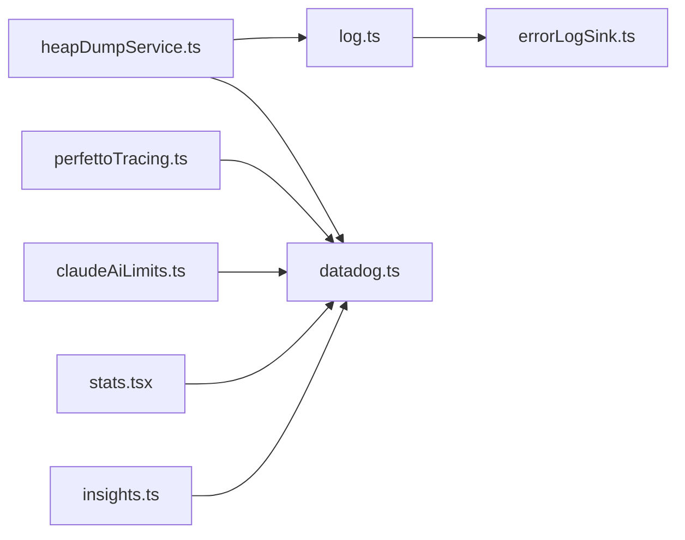

# 性能与监控

<cite>
**本文引用的文件**
- [perfettoTracing.ts](file://src/utils/telemetry/perfettoTracing.ts)
- [heapDumpService.ts](file://src/utils/heapDumpService.ts)
- [sdkHeapDumpMonitor.ts](file://src/utils/sdkHeapDumpMonitor.ts)
- [datadog.ts](file://src/services/analytics/datadog.ts)
- [log.ts](file://src/utils/log.ts)
- [errorLogSink.ts](file://src/utils/errorLogSink.ts)
- [metricsOptOut.ts](file://src/services/api/metricsOptOut.ts)
- [heapdump.ts](file://src/commands/heapdump/heapdump.ts)
- [claudeAiLimits.ts](file://src/services/claudeAiLimits.ts)
- [stats.tsx](file://src/context/stats.tsx)
- [insights.ts](file://src/commands/insights.ts)
</cite>

## 目录
1. [简介](#简介)
2. [项目结构](#项目结构)
3. [核心组件](#核心组件)
4. [架构总览](#架构总览)
5. [详细组件分析](#详细组件分析)
6. [依赖关系分析](#依赖关系分析)
7. [性能考量](#性能考量)
8. [故障排除指南](#故障排除指南)
9. [结论](#结论)
10. [附录](#附录)

## 简介
本文件面向 Claude Code 的性能与监控体系，系统化阐述其监控架构、指标采集与分析机制，覆盖内存管理、诊断工具与性能优化策略；同时涵盖错误处理、日志记录与调试工具，以及监控仪表板、告警机制与报告生成思路，并给出分布式追踪、遥测数据与用户体验监控的实践方法与配置示例。

## 项目结构
围绕性能与监控的关键模块分布如下：
- 分布式追踪与遥测：perfettoTracing（Chrome Trace Event 格式）
- 内存诊断与堆转储：heapDumpService、sdkHeapDumpMonitor、命令 /heapdump
- 指标与遥测上报：datadog（事件打点、批处理、去重）
- 错误与日志：log、errorLogSink（队列、持久化、MCP 日志）
- 用户体验与限流：claudeAiLimits（早期预警）、insights（报告生成）
- 运行时统计：stats（直方图/分位数采样）

**图表来源**
- [perfettoTracing.ts:1-1121](file://src/utils/telemetry/perfettoTracing.ts#L1-L1121)
- [heapDumpService.ts:1-304](file://src/utils/heapDumpService.ts#L1-L304)
- [sdkHeapDumpMonitor.ts:1-4](file://src/utils/sdkHeapDumpMonitor.ts#L1-L4)
- [datadog.ts:1-308](file://src/services/analytics/datadog.ts#L1-L308)
- [log.ts:1-363](file://src/utils/log.ts#L1-L363)
- [errorLogSink.ts:1-236](file://src/utils/errorLogSink.ts#L1-L236)
- [claudeAiLimits.ts:43-374](file://src/services/claudeAiLimits.ts#L43-L374)
- [insights.ts:1832-2719](file://src/commands/insights.ts#L1832-L2719)
- [stats.tsx:38-88](file://src/context/stats.tsx#L38-L88)

**章节来源**
- [perfettoTracing.ts:1-1121](file://src/utils/telemetry/perfettoTracing.ts#L1-L1121)
- [heapDumpService.ts:1-304](file://src/utils/heapDumpService.ts#L1-L304)
- [sdkHeapDumpMonitor.ts:1-4](file://src/utils/sdkHeapDumpMonitor.ts#L1-L4)
- [datadog.ts:1-308](file://src/services/analytics/datadog.ts#L1-L308)
- [log.ts:1-363](file://src/utils/log.ts#L1-L363)
- [errorLogSink.ts:1-236](file://src/utils/errorLogSink.ts#L1-L236)
- [claudeAiLimits.ts:43-374](file://src/services/claudeAiLimits.ts#L43-L374)
- [insights.ts:1832-2719](file://src/commands/insights.ts#L1832-L2719)
- [stats.tsx:38-88](file://src/context/stats.tsx#L38-L88)

## 核心组件
- 分布式追踪（Perfetto/Chrome Trace）：用于捕获会话内 API 请求、工具执行、用户输入等待等阶段的耗时与吞吐，支持周期性落盘与退出时写盘，具备代理层级与元数据事件。
- 内存诊断与堆转储：在写入堆快照前先输出诊断信息，包含 V8 统计、原生内存、句柄/请求、文件描述符、增长速率与泄漏提示，支持手动与自动触发。
- 指标与遥测：Datadog 批量上报，事件白名单、字段归一化、用户桶聚合、HTTP 状态映射、保留字段清理，避免高基数。
- 错误与日志：统一错误入口、延迟初始化、队列排空、MCP 错误/调试日志持久化，支持 ant 用户专属路径。
- 限流与预警：基于响应头与时间窗口的双通道早期预警，结合 UI 提示与通知。
- 报告与可视化：insights 命令生成响应时间分布、时段分布、满意度与摩擦度等可视化卡片。
- 运行时统计：直方图与分位数采样（蓄水池抽样），支持 p50/p95 等指标聚合。

**章节来源**
- [perfettoTracing.ts:253-335](file://src/utils/telemetry/perfettoTracing.ts#L253-L335)
- [heapDumpService.ts:88-212](file://src/utils/heapDumpService.ts#L88-L212)
- [datadog.ts:160-279](file://src/services/analytics/datadog.ts#L160-L279)
- [log.ts:158-199](file://src/utils/log.ts#L158-L199)
- [errorLogSink.ts:225-235](file://src/utils/errorLogSink.ts#L225-L235)
- [claudeAiLimits.ts:347-374](file://src/services/claudeAiLimits.ts#L347-L374)
- [insights.ts:1863-1900](file://src/commands/insights.ts#L1863-L1900)
- [stats.tsx:38-88](file://src/context/stats.tsx#L38-L88)

## 架构总览
下图展示了从调用到落盘/上报的端到端流程，包括内存诊断、堆转储、错误日志、遥测与限流预警。

**图表来源**
- [heapdump.ts:1-17](file://src/commands/heapdump/heapdump.ts#L1-L17)
- [heapDumpService.ts:221-278](file://src/utils/heapDumpService.ts#L221-L278)
- [log.ts:158-199](file://src/utils/log.ts#L158-L199)
- [errorLogSink.ts:225-235](file://src/utils/errorLogSink.ts#L225-L235)
- [datadog.ts:160-279](file://src/services/analytics/datadog.ts#L160-L279)

## 详细组件分析

### 分布式追踪（Perfetto/Chrome Trace）
- 启用方式：通过环境变量控制，支持周期性写盘与退出时写盘，带过期跨度清理与事件上限回收。
- 跟踪内容：API 请求（TTFT/TTLT/缓存命中率/并发尝试）、工具执行（名称/时长/结果 token）、用户输入等待。
- 元数据：进程/线程名、父子关系、会话与代理计数、事件总数。
- 关键能力：开始/结束跨度对、子跨度（首次 token、采样阶段）、过期跨度标记、截断标记。

**图表来源**
- [perfettoTracing.ts:253-335](file://src/utils/telemetry/perfettoTracing.ts#L253-L335)
- [perfettoTracing.ts:422-685](file://src/utils/telemetry/perfettoTracing.ts#L422-L685)
- [perfettoTracing.ts:687-835](file://src/utils/telemetry/perfettoTracing.ts#L687-L835)

**章节来源**
- [perfettoTracing.ts:253-335](file://src/utils/telemetry/perfettoTracing.ts#L253-L335)
- [perfettoTracing.ts:422-685](file://src/utils/telemetry/perfettoTracing.ts#L422-L685)
- [perfettoTracing.ts:687-835](file://src/utils/telemetry/perfettoTracing.ts#L687-L835)

### 内存诊断与堆转储
- 诊断优先：在写入堆快照前先输出诊断，避免大堆快照序列化崩溃导致无诊断可得。
- 诊断内容：heapUsed/heapTotal/external/arrayBuffers/rss、增长速率、V8 统计（上下文/峰值原生内存）、堆空间、资源使用、活跃句柄/请求、文件描述符、泄漏提示、平台/版本。
- 触发方式：手动 /heapdump 或自动阈值（如 1.5GB）。
- 上报：记录 tengu_heap_dump 事件并走遥测通道。

**图表来源**
- [heapdump.ts:1-17](file://src/commands/heapdump/heapdump.ts#L1-L17)
- [heapDumpService.ts:88-212](file://src/utils/heapDumpService.ts#L88-L212)
- [heapDumpService.ts:221-278](file://src/utils/heapDumpService.ts#L221-L278)
- [log.ts:158-199](file://src/utils/log.ts#L158-L199)
- [datadog.ts:160-279](file://src/services/analytics/datadog.ts#L160-L279)

**章节来源**
- [heapDumpService.ts:88-212](file://src/utils/heapDumpService.ts#L88-L212)
- [heapDumpService.ts:221-278](file://src/utils/heapDumpService.ts#L221-L278)
- [heapdump.ts:1-17](file://src/commands/heapdump/heapdump.ts#L1-L17)

### 指标与遥测（Datadog）
- 初始化：按需初始化，避免重复网络开销；失败时缓存状态。
- 事件白名单：仅允许受控事件进入，减少噪声。
- 字段归一化：模型名、工具名、版本、状态码映射，降低基数。
- 批量与定时：批量大小与刷新间隔可配置，异常时记录到错误日志。
- 用户桶：对用户 ID 做哈希分桶，估算受影响用户数而非事件数。

**图表来源**
- [datadog.ts:130-144](file://src/services/analytics/datadog.ts#L130-L144)
- [datadog.ts:160-279](file://src/services/analytics/datadog.ts#L160-L279)
- [datadog.ts:281-307](file://src/services/analytics/datadog.ts#L281-L307)

**章节来源**
- [datadog.ts:130-144](file://src/services/analytics/datadog.ts#L130-L144)
- [datadog.ts:160-279](file://src/services/analytics/datadog.ts#L160-L279)
- [datadog.ts:281-307](file://src/services/analytics/datadog.ts#L281-L307)

### 错误处理与日志
- 统一入口：logError/logMCPError/logMCPDebug，支持硬失败模式、隐私级别过滤。
- 延迟初始化：sink 未就绪时事件入队，attach 后立即排空。
- 文件持久化：JSONL 缓冲写入，目录不存在自动创建，支持 MCP 服务器独立日志。
- 错误聚合：内存中最近若干条错误，便于报告与 UI 展示。

**图表来源**
- [log.ts:109-134](file://src/utils/log.ts#L109-L134)
- [log.ts:158-199](file://src/utils/log.ts#L158-L199)
- [errorLogSink.ts:225-235](file://src/utils/errorLogSink.ts#L225-L235)
- [errorLogSink.ts:152-174](file://src/utils/errorLogSink.ts#L152-L174)

**章节来源**
- [log.ts:109-134](file://src/utils/log.ts#L109-L134)
- [log.ts:158-199](file://src/utils/log.ts#L158-L199)
- [errorLogSink.ts:225-235](file://src/utils/errorLogSink.ts#L225-L235)
- [errorLogSink.ts:152-174](file://src/utils/errorLogSink.ts#L152-L174)

### 限流与预警（Claude AI Limits）
- 双通道早期预警：优先响应头阈值，其次基于时间窗口的客户端计算。
- 显示名称与窗口：五小时/七日配额窗口与显示名映射。
- UI 与通知：结合通知组件进行用户提示。

**图表来源**
- [claudeAiLimits.ts:347-374](file://src/services/claudeAiLimits.ts#L347-L374)
- [claudeAiLimits.ts:53-70](file://src/services/claudeAiLimits.ts#L53-L70)

**章节来源**
- [claudeAiLimits.ts:347-374](file://src/services/claudeAiLimits.ts#L347-L374)
- [claudeAiLimits.ts:53-70](file://src/services/claudeAiLimits.ts#L53-L70)

### 报告与可视化（Insights）
- 响应时间直方图：按区间统计用户响应时间分布，输出百分比与数值。
- 时段分布：按早/午/晚/夜分组统计消息发生时段。
- 满意度与摩擦度：按等级统计用户满意度与摩擦类型。

**图表来源**
- [insights.ts:1863-1900](file://src/commands/insights.ts#L1863-L1900)
- [insights.ts:1902-1911](file://src/commands/insights.ts#L1902-L1911)
- [insights.ts:2687-2719](file://src/commands/insights.ts#L2687-L2719)

**章节来源**
- [insights.ts:1863-1900](file://src/commands/insights.ts#L1863-L1900)
- [insights.ts:1902-1911](file://src/commands/insights.ts#L1902-L1911)
- [insights.ts:2687-2719](file://src/commands/insights.ts#L2687-L2719)

### 运行时统计（直方图与分位数）
- 蓄水池抽样：固定容量的随机采样，支持 p50/p95 等分位数近似。
- 指标聚合：最小/最大/平均/计数，便于快速洞察分布。

**图表来源**
- [stats.tsx:38-88](file://src/context/stats.tsx#L38-L88)

**章节来源**
- [stats.tsx:38-88](file://src/context/stats.tsx#L38-L88)

## 依赖关系分析
- 组件耦合
  - heapDumpService 依赖 log.ts 与 analytics/datadog.ts，形成“诊断→日志→遥测”的链路。
  - perfettoTracing 与 datadog 并行工作，前者专注时序，后者专注事件与指标。
  - log.ts 与 errorLogSink 解耦，前者轻量、后者重逻辑，通过 sink 接口解耦。
  - claudeAiLimits 与 datadog 协作，将限流状态映射为事件标签。
- 外部依赖
  - Datadog API、V8 堆统计接口、文件系统写入、进程资源使用接口。
- 循环依赖
  - 通过 sink 接口与延迟初始化避免循环导入。

**图表来源**
- [heapDumpService.ts:16-23](file://src/utils/heapDumpService.ts#L16-L23)
- [log.ts:1-23](file://src/utils/log.ts#L1-L23)
- [errorLogSink.ts:13-22](file://src/utils/errorLogSink.ts#L13-L22)
- [datadog.ts:1-11](file://src/services/analytics/datadog.ts#L1-L11)
- [perfettoTracing.ts:25-40](file://src/utils/telemetry/perfettoTracing.ts#L25-L40)
- [claudeAiLimits.ts:1-11](file://src/services/claudeAiLimits.ts#L1-L11)
- [stats.tsx:1-10](file://src/context/stats.tsx#L1-L10)
- [insights.ts:1-10](file://src/commands/insights.ts#L1-L10)

**章节来源**
- [heapDumpService.ts:16-23](file://src/utils/heapDumpService.ts#L16-L23)
- [log.ts:1-23](file://src/utils/log.ts#L1-L23)
- [errorLogSink.ts:13-22](file://src/utils/errorLogSink.ts#L13-L22)
- [datadog.ts:1-11](file://src/services/analytics/datadog.ts#L1-L11)
- [perfettoTracing.ts:25-40](file://src/utils/telemetry/perfettoTracing.ts#L25-L40)
- [claudeAiLimits.ts:1-11](file://src/services/claudeAiLimits.ts#L1-L11)
- [stats.tsx:1-10](file://src/context/stats.tsx#L1-L10)
- [insights.ts:1-10](file://src/commands/insights.ts#L1-L10)

## 性能考量
- 追踪开销
  - 事件上限与截断标记避免无限增长；周期性写盘降低退出时阻塞风险。
  - 跨度过期清理防止悬挂跨度占用内存。
- 堆转储安全
  - 诊断先于快照写入，规避大快照序列化崩溃；同步写入 Bun 下避免跨线程字符串克隆。
- 遥测批处理
  - 批量大小与刷新间隔可调，降低网络抖动影响；失败时回退到错误日志。
- 日志持久化
  - JSONL 缓冲写入与目录懒创建，减少频繁系统调用；仅 ant 用户写入私有路径。
- 指标降基数
  - 用户桶、模型名归一化、状态码映射、标签裁剪，避免高基数导致查询成本上升。

[本节为通用性能讨论，无需列出具体文件来源]

## 故障排除指南
- 启用/验证分布式追踪
  - 设置环境变量以开启追踪与周期写盘，确认会话目录下 trace 文件生成。
  - 若退出未落盘，检查 beforeExit 回退逻辑是否触发。
- 堆转储失败或崩溃
  - 确认诊断文件已生成；若堆快照失败，检查磁盘空间与权限。
  - 在 Bun 环境下注意同步写入与 GC 强制触发。
- 遥测未达
  - 检查事件是否在白名单内、是否被禁用、是否为第三方提供者。
  - 查看批处理定时器是否被阻塞，必要时缩短刷新间隔。
- 错误日志缺失
  - 确认 initializeErrorLogSink 是否在 initializeAnalyticsSink 之前调用。
  - 检查 USER_TYPE 是否为 ant，否则不会写入私有日志路径。
- 限流预警不生效
  - 确认响应头是否存在阈值头；若无，则检查时间窗口计算是否命中。
  - 检查隐私级别与环境变量是否禁用了相关功能。

**章节来源**
- [perfettoTracing.ts:253-335](file://src/utils/telemetry/perfettoTracing.ts#L253-L335)
- [heapDumpService.ts:284-303](file://src/utils/heapDumpService.ts#L284-L303)
- [datadog.ts:130-144](file://src/services/analytics/datadog.ts#L130-L144)
- [log.ts:109-134](file://src/utils/log.ts#L109-L134)
- [errorLogSink.ts:225-235](file://src/utils/errorLogSink.ts#L225-L235)
- [claudeAiLimits.ts:347-374](file://src/services/claudeAiLimits.ts#L347-L374)

## 结论
该监控体系以“诊断先行、事件可控、指标降基”为核心设计，结合分布式追踪、内存诊断、统一日志与遥测上报，形成从问题定位到用户体验可视化的闭环。通过限流预警与报告生成，进一步提升可观测性与运营效率。建议在生产环境默认启用追踪与遥测，配合严格的事件白名单与批处理策略，确保低开销与高可靠性。

[本节为总结性内容，无需列出具体文件来源]

## 附录

### 监控配置示例
- 分布式追踪
  - 开启：设置环境变量以启用并指定写盘路径，或启用周期写盘。
  - 参考：[perfettoTracing.ts:253-335](file://src/utils/telemetry/perfettoTracing.ts#L253-L335)
- 堆转储
  - 手动：使用 /heapdump 命令；自动：达到阈值触发。
  - 参考：[/heapdump 命令:1-17](file://src/commands/heapdump/heapdump.ts#L1-L17)、[heapDumpService.ts:221-278](file://src/utils/heapDumpService.ts#L221-L278)
- 遥测
  - 事件白名单、批处理大小、刷新间隔、用户桶、字段归一化。
  - 参考：[datadog.ts:160-279](file://src/services/analytics/datadog.ts#L160-L279)
- 错误日志
  - 初始化顺序、队列排空、MCP 日志路径。
  - 参考：[log.ts:109-134](file://src/utils/log.ts#L109-L134)、[errorLogSink.ts:225-235](file://src/utils/errorLogSink.ts#L225-L235)
- 限流预警
  - 响应头阈值与时间窗口双通道。
  - 参考：[claudeAiLimits.ts:347-374](file://src/services/claudeAiLimits.ts#L347-L374)

**章节来源**
- [perfettoTracing.ts:253-335](file://src/utils/telemetry/perfettoTracing.ts#L253-L335)
- [heapdump.ts:1-17](file://src/commands/heapdump/heapdump.ts#L1-L17)
- [heapDumpService.ts:221-278](file://src/utils/heapDumpService.ts#L221-L278)
- [datadog.ts:160-279](file://src/services/analytics/datadog.ts#L160-L279)
- [log.ts:109-134](file://src/utils/log.ts#L109-L134)
- [errorLogSink.ts:225-235](file://src/utils/errorLogSink.ts#L225-L235)
- [claudeAiLimits.ts:347-374](file://src/services/claudeAiLimits.ts#L347-L374)