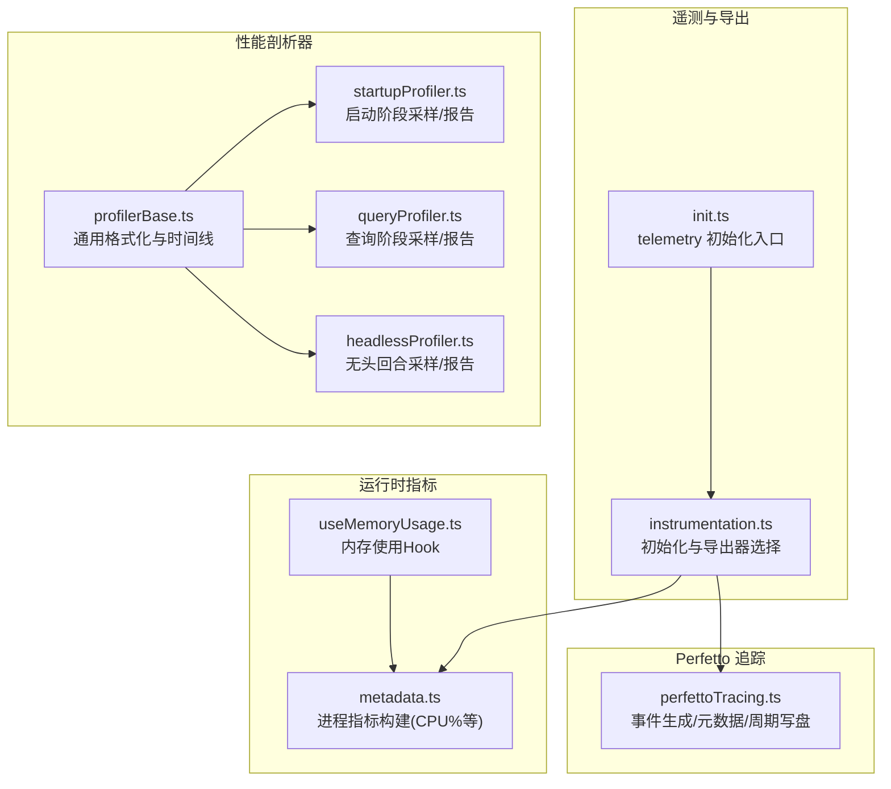
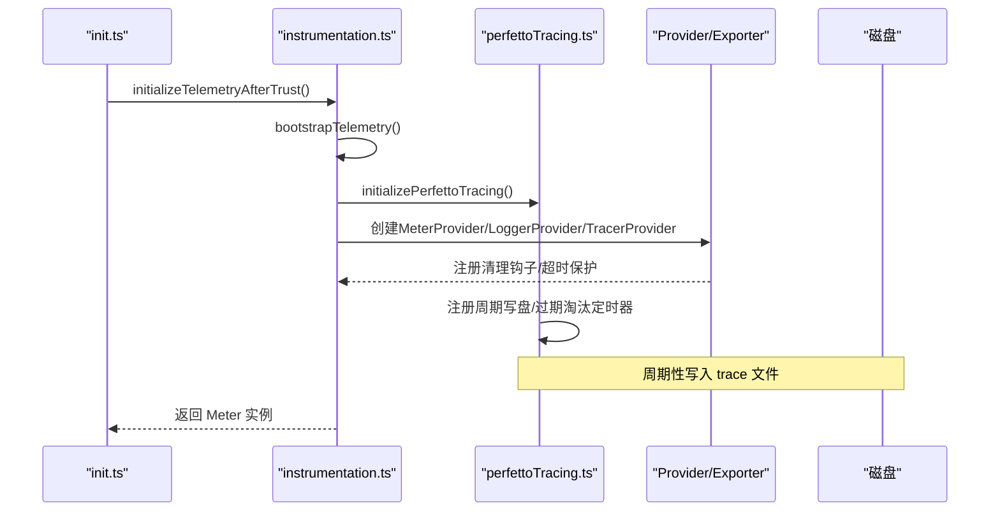
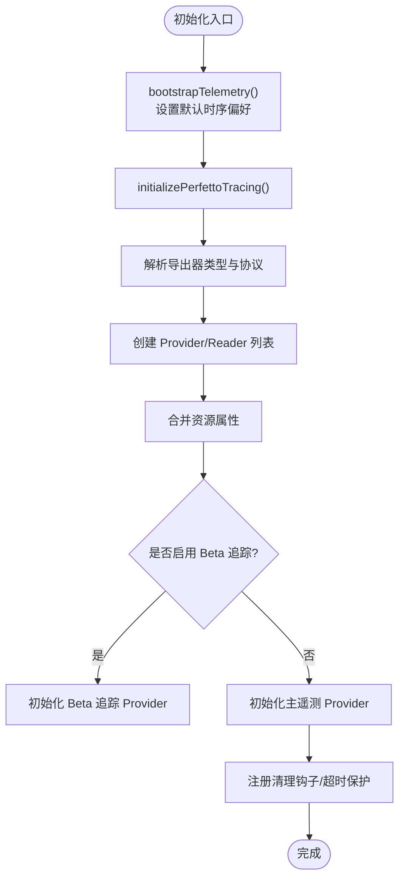
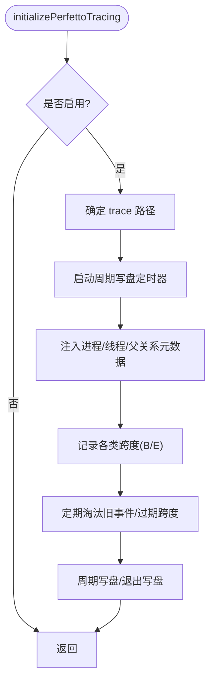
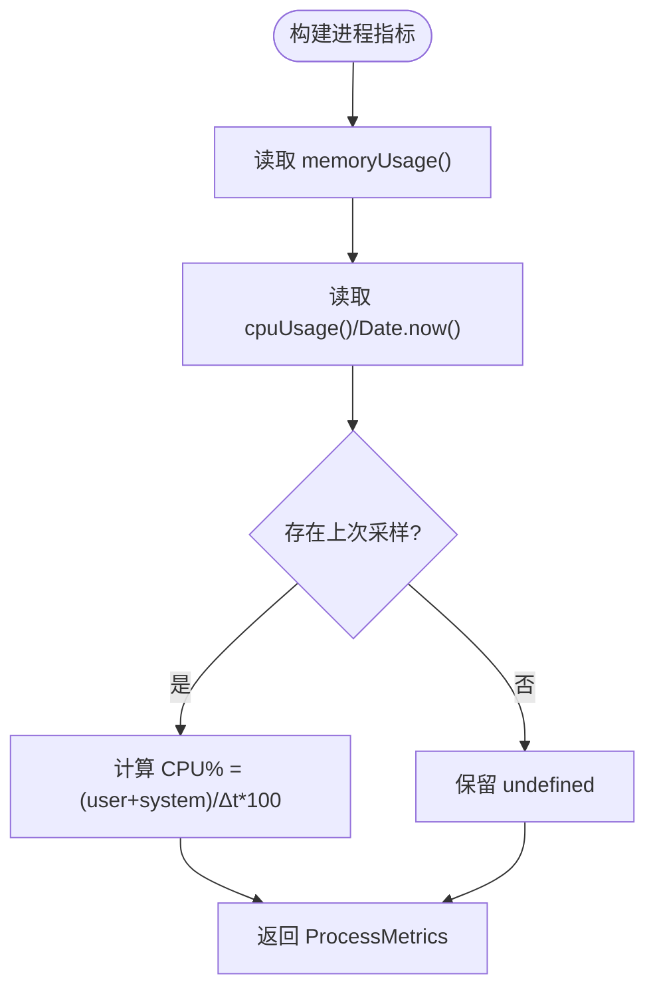
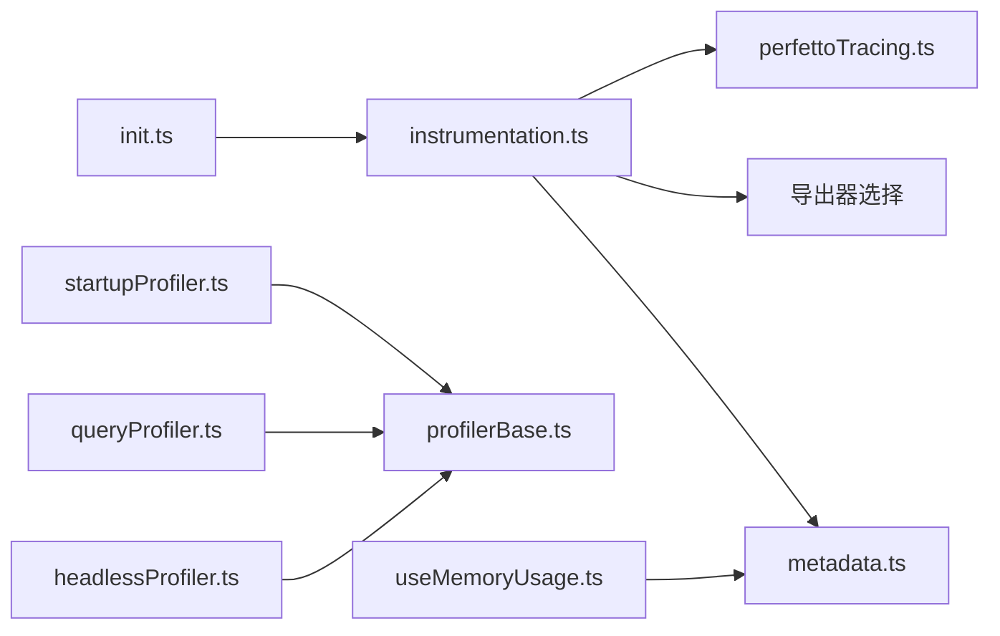

# 性能监控概览

<cite>
**本文档引用的文件**
- [perfettoTracing.ts](file://src/utils/telemetry/perfettoTracing.ts)
- [instrumentation.ts](file://src/utils/telemetry/instrumentation.ts)
- [init.ts](file://src/entrypoints/init.ts)
- [profilerBase.ts](file://src/utils/profilerBase.ts)
- [startupProfiler.ts](file://src/utils/startupProfiler.ts)
- [queryProfiler.ts](file://src/utils/queryProfiler.ts)
- [headlessProfiler.ts](file://src/utils/headlessProfiler.ts)
- [metadata.ts](file://src/services/analytics/metadata.ts)
- [useMemoryUsage.ts](file://src/hooks/useMemoryUsage.ts)
</cite>

## 目录
1. [简介](#简介)
2. [项目结构](#项目结构)
3. [核心组件](#核心组件)
4. [架构总览](#架构总览)
5. [详细组件分析](#详细组件分析)
6. [依赖关系分析](#依赖关系分析)
7. [性能考量](#性能考量)
8. [故障排查指南](#故障排查指南)
9. [结论](#结论)
10. [附录](#附录)

## 简介
本文件面向 Claude Code 的性能监控体系，提供从设计理念、架构模式到核心组件的全景式说明。内容覆盖指标分类、数据采集与存储、基准测试框架、实时监控与历史数据分析，并给出配置项、阈值与告警建议、仪表板使用指南以及优化最佳实践与常见问题处理方法。

## 项目结构
性能监控相关代码主要分布在以下模块：
- 通用遥测与导出：OpenTelemetry 初始化、指标/日志/追踪导出器选择、资源属性合并、优雅关闭与刷新
- Perfetto 追踪：本地 Chrome Trace 格式事件生成、元数据注入、周期性写盘
- 基准测试与分析：启动、查询、无头模式三类性能剖析器
- 运行时指标：进程内存/CPU 使用、CPU 百分比计算
- 内存使用监控：React Hook 定期轮询并按阈值提示



图示来源
- [instrumentation.ts:421-701](file://src/utils/telemetry/instrumentation.ts#L421-L701)
- [init.ts:247-340](file://src/entrypoints/init.ts#L247-L340)
- [perfettoTracing.ts:253-335](file://src/utils/telemetry/perfettoTracing.ts#L253-L335)
- [profilerBase.ts:1-47](file://src/utils/profilerBase.ts#L1-L47)
- [startupProfiler.ts:1-195](file://src/utils/startupProfiler.ts#L1-L195)
- [queryProfiler.ts:1-302](file://src/utils/queryProfiler.ts#L1-L302)
- [headlessProfiler.ts:1-179](file://src/utils/headlessProfiler.ts#L1-L179)
- [metadata.ts:648-682](file://src/services/analytics/metadata.ts#L648-L682)
- [useMemoryUsage.ts:1-39](file://src/hooks/useMemoryUsage.ts#L1-L39)

章节来源
- [instrumentation.ts:421-701](file://src/utils/telemetry/instrumentation.ts#L421-L701)
- [init.ts:247-340](file://src/entrypoints/init.ts#L247-L340)

## 核心组件
- 遥测初始化与导出
  - 通过环境变量选择 OTLP 协议（grpc/http/json/proto）与导出器类型（console/otlp/prometheus），动态加载对应导出器以减少启动开销
  - 支持 BigQuery 指标导出器（针对特定用户群体）
  - 资源属性合并：服务名、版本、平台、架构、环境检测结果
  - 增强遥测（追踪）与 Beta 追踪路径可选启用
  - 优雅关闭：注册清理钩子，超时保护，强制刷新与关闭
- Perfetto 追踪
  - 生成 Chrome Trace 事件（Begin/End/Complete/Async 等），支持 API 请求、工具执行、等待用户输入等关键跨度
  - 元数据事件（进程/线程名、父子关系）独立保存，确保 UI 可识别
  - 周期性写盘与过期淘汰，避免无限增长
- 性能剖析器
  - 启动剖析器：采样记录关键阶段，支持详细报告输出与 Statsig 摘要上报
  - 查询剖析器：记录从输入到首 token 的完整流水线，输出相对时间与阶段占比
  - 无头剖析器：回合级采样，统计从回合开始到首次响应的时间
  - 通用基类：统一时间线格式化与内存快照记录
- 运行时指标
  - 构建进程指标对象：RSS、堆、外部、数组缓冲、受限内存、CPU 使用量与 CPU 百分比
  - CPU% 基于两次采样的差值计算，避免频繁调用导致额外开销
- 内存使用监控
  - React Hook 每 10 秒轮询一次，仅在超过阈值时返回状态，降低渲染成本

章节来源
- [instrumentation.ts:130-215](file://src/utils/telemetry/instrumentation.ts#L130-L215)
- [instrumentation.ts:421-701](file://src/utils/telemetry/instrumentation.ts#L421-L701)
- [perfettoTracing.ts:253-335](file://src/utils/telemetry/perfettoTracing.ts#L253-L335)
- [startupProfiler.ts:1-195](file://src/utils/startupProfiler.ts#L1-L195)
- [queryProfiler.ts:1-302](file://src/utils/queryProfiler.ts#L1-L302)
- [headlessProfiler.ts:1-179](file://src/utils/headlessProfiler.ts#L1-L179)
- [profilerBase.ts:1-47](file://src/utils/profilerBase.ts#L1-L47)
- [metadata.ts:648-682](file://src/services/analytics/metadata.ts#L648-L682)
- [useMemoryUsage.ts:1-39](file://src/hooks/useMemoryUsage.ts#L1-L39)

## 架构总览
整体架构分为两条主线：
- 通用遥测链路：OpenTelemetry SDK 初始化、导出器选择、资源属性、批处理器、优雅关闭
- Perfetto 本地追踪：事件收集、元数据注入、周期写盘、过期淘汰



图示来源
- [init.ts:247-340](file://src/entrypoints/init.ts#L247-L340)
- [instrumentation.ts:421-701](file://src/utils/telemetry/instrumentation.ts#L421-L701)
- [perfettoTracing.ts:253-335](file://src/utils/telemetry/perfettoTracing.ts#L253-L335)

## 详细组件分析

### 组件一：遥测初始化与导出（OpenTelemetry）
- 功能要点
  - 环境变量解析：导出器类型、协议、端点、头部、导出间隔
  - 动态导入：根据协议选择 OTLP 导出器（grpc/http/json/proto），Prometheus 导出器
  - 资源属性：服务名、版本、平台、架构、环境检测
  - Beta 追踪与增强遥测：分离的端点与处理器
  - 优雅关闭：forceFlush + shutdown，超时保护，beforeExit/exit 处理
- 关键流程



图示来源
- [instrumentation.ts:421-701](file://src/utils/telemetry/instrumentation.ts#L421-L701)

章节来源
- [instrumentation.ts:130-215](file://src/utils/telemetry/instrumentation.ts#L130-L215)
- [instrumentation.ts:421-701](file://src/utils/telemetry/instrumentation.ts#L421-L701)

### 组件二：Perfetto 追踪（本地 Chrome Trace）
- 功能要点
  - 事件类型：Begin/End/Complete/Async 等，支持 API 请求、工具执行、等待用户输入等跨度
  - 元数据：进程名、线程名、父子关系，独立保存以保证 UI 可读性
  - 周期写盘：可配置写盘间隔；退出/异常时同步写盘兜底
  - 过期淘汰：事件上限与半量截断标记，保持可观测窗口稳定
- 关键流程



图示来源
- [perfettoTracing.ts:253-335](file://src/utils/telemetry/perfettoTracing.ts#L253-L335)
- [perfettoTracing.ts:642-685](file://src/utils/telemetry/perfettoTracing.ts#L642-L685)
- [perfettoTracing.ts:990-1005](file://src/utils/telemetry/perfettoTracing.ts#L990-L1005)

章节来源
- [perfettoTracing.ts:253-335](file://src/utils/telemetry/perfettoTracing.ts#L253-L335)
- [perfettoTracing.ts:642-685](file://src/utils/telemetry/perfettoTracing.ts#L642-L685)
- [perfettoTracing.ts:990-1005](file://src/utils/telemetry/perfettoTracing.ts#L990-L1005)

### 组件三：性能剖析器（启动/查询/无头）
- 启动剖析器
  - 采样率：ANT 用户 100%，外部用户 0.5%
  - 详细模式：记录每个检查点的绝对时间与相对时间，输出到文件并打印报告
  - Statsig 摘要：记录关键阶段耗时
- 查询剖析器
  - 记录从输入到首 token 的完整流水线，输出阶段占比与慢操作警告
  - 支持对已知瓶颈（如 git status、工具 schema、客户端创建）进行特殊标注
- 无头剖析器
  - 回合级采样：turn_start、query_started、first_chunk 等关键节点
  - Statsig 摘要：每回合输出到 Statsig，支持入口点细分
- 通用基类
  - 统一时间线格式化、内存快照记录

```mermaid
sequenceDiagram
participant User as "用户"
participant SP as "startupProfiler.ts"
participant QP as "queryProfiler.ts"
participant HP as "headlessProfiler.ts"
participant Base as "profilerBase.ts"
User->>SP : profileCheckpoint("init_function_start")
SP->>Base : formatTimelineLine(...)
User->>QP : queryCheckpoint("query_user_input_received")
QP->>Base : formatTimelineLine(...)
User->>HP : headlessProfilerStartTurn()
HP->>Base : formatTimelineLine(...)
Note over SP,QP,HP : 三者共享基类格式化逻辑
```

图示来源
- [startupProfiler.ts:65-119](file://src/utils/startupProfiler.ts#L65-L119)
- [queryProfiler.ts:69-84](file://src/utils/queryProfiler.ts#L69-L84)
- [headlessProfiler.ts:62-97](file://src/utils/headlessProfiler.ts#L62-L97)
- [profilerBase.ts:33-46](file://src/utils/profilerBase.ts#L33-L46)

章节来源
- [startupProfiler.ts:1-195](file://src/utils/startupProfiler.ts#L1-L195)
- [queryProfiler.ts:1-302](file://src/utils/queryProfiler.ts#L1-L302)
- [headlessProfiler.ts:1-179](file://src/utils/headlessProfiler.ts#L1-L179)
- [profilerBase.ts:1-47](file://src/utils/profilerBase.ts#L1-L47)

### 组件四：运行时指标与内存监控
- 进程指标
  - 构建包含：uptime、rss、heapTotal、heapUsed、external、arrayBuffers、constrainedMemory、cpuUsage、cpuPercent
  - CPU% 基于两次采样的差值计算，避免重复计算开销
- 内存使用监控
  - Hook 每 10 秒轮询一次，仅在超过阈值时返回状态，避免高频重渲染



图示来源
- [metadata.ts:648-682](file://src/services/analytics/metadata.ts#L648-L682)

章节来源
- [metadata.ts:648-682](file://src/services/analytics/metadata.ts#L648-L682)
- [useMemoryUsage.ts:1-39](file://src/hooks/useMemoryUsage.ts#L1-L39)

## 依赖关系分析
- 初始化耦合
  - init.ts 调用 instrumentation.ts 完成遥测初始化，随后 Perfetto 追踪独立初始化
- 导出器选择
  - instrumentation.ts 根据环境变量动态选择导出器，避免静态导入带来的包体膨胀
- 追踪与指标解耦
  - Perfetto 追踪与 OpenTelemetry 指标/日志/追踪互不干扰，均可独立启用/禁用
- 剖析器与基类
  - 三类剖析器共享 profilerBase.ts 的格式化与时间线能力



图示来源
- [init.ts:247-340](file://src/entrypoints/init.ts#L247-L340)
- [instrumentation.ts:130-215](file://src/utils/telemetry/instrumentation.ts#L130-L215)
- [perfettoTracing.ts:253-335](file://src/utils/telemetry/perfettoTracing.ts#L253-L335)
- [startupProfiler.ts:1-195](file://src/utils/startupProfiler.ts#L1-L195)
- [queryProfiler.ts:1-302](file://src/utils/queryProfiler.ts#L1-L302)
- [headlessProfiler.ts:1-179](file://src/utils/headlessProfiler.ts#L1-L179)
- [profilerBase.ts:1-47](file://src/utils/profilerBase.ts#L1-L47)
- [metadata.ts:648-682](file://src/services/analytics/metadata.ts#L648-L682)
- [useMemoryUsage.ts:1-39](file://src/hooks/useMemoryUsage.ts#L1-L39)

章节来源
- [init.ts:247-340](file://src/entrypoints/init.ts#L247-L340)
- [instrumentation.ts:130-215](file://src/utils/telemetry/instrumentation.ts#L130-L215)

## 性能考量
- 启动时延控制
  - 动态导入导出器与 OTLP 协议实现，减少冷启动体积
  - 剖析器采样率与条件启用，避免对大多数用户造成额外负担
- 追踪开销
  - Perfetto 事件上限与半量截断，防止内存无限增长
  - 元数据事件独立保存，UI 可识别但不影响主事件容量
- 指标计算
  - CPU% 采用差值法，避免频繁调用导致额外开销
  - 内存监控 Hook 仅在阈值触发时更新，降低渲染频率
- 导出稳定性
  - 优雅关闭与超时保护，确保在弱网络或后端延迟下仍能可靠收尾

## 故障排查指南
- 遥测导出失败或超时
  - 检查导出器类型与协议配置，确认端点可达
  - 增大超时参数，观察后端负载情况
  - 在流式输出场景中移除 console 导出器，避免破坏解析
- Perfetto 追踪未生成
  - 确认环境变量已启用，路径可写
  - 检查周期写盘定时器是否被阻塞
- 指标缺失
  - 确认遥测已初始化且资源属性正确
  - 检查 BigQuery 导出器启用条件与权限
- 内存占用过高
  - 观察内存监控 Hook 是否持续触发
  - 结合剖析器报告定位热点阶段

章节来源
- [instrumentation.ts:654-699](file://src/utils/telemetry/instrumentation.ts#L654-L699)
- [perfettoTracing.ts:284-298](file://src/utils/telemetry/perfettoTracing.ts#L284-L298)
- [metadata.ts:648-682](file://src/services/analytics/metadata.ts#L648-L682)
- [useMemoryUsage.ts:18-39](file://src/hooks/useMemoryUsage.ts#L18-L39)

## 结论
该性能监控体系通过“遥测 + 本地追踪 + 基准剖析 + 运行时指标”的组合，实现了从宏观到微观的全链路可观测性。其设计强调按需启用、低开销与高可靠性，既满足日常运维与问题定位，也为性能优化提供了坚实的数据基础。

## 附录

### 监控指标分类与采集策略
- 指标分类
  - 启动阶段：导入、初始化、设置加载、总耗时
  - 查询阶段：上下文加载、消息归并、自动压缩、工具 schema、消息规范化、客户端创建、网络 TTFB、工具执行
  - 无头回合：系统消息输出、查询开始、首次响应
  - 运行时：内存（RSS/Heap）、CPU 使用与百分比、受限内存
- 采集策略
  - 采样率：ANT 用户 100%，外部用户按 0.5%~5% 不等
  - 条件启用：通过环境变量控制，避免对非目标用户产生影响
  - 周期写盘：Perfetto 追踪按配置周期写盘，退出时兜底写入

章节来源
- [startupProfiler.ts:48-54](file://src/utils/startupProfiler.ts#L48-L54)
- [queryProfiler.ts:8-28](file://src/utils/queryProfiler.ts#L8-L28)
- [headlessProfiler.ts:29-37](file://src/utils/headlessProfiler.ts#L29-L37)
- [metadata.ts:648-682](file://src/services/analytics/metadata.ts#L648-L682)

### 存储机制与导出
- Perfetto
  - 事件与元数据分离存储，独立注入进程/线程/父关系信息
  - 周期写盘与过期淘汰，避免无限增长
- 遥测
  - 指标：周期导出器批量发送
  - 日志：批处理器异步发送
  - 追踪：批处理器异步发送
  - BigQuery：针对特定用户群体的周期导出器

章节来源
- [perfettoTracing.ts:214-224](file://src/utils/telemetry/perfettoTracing.ts#L214-L224)
- [perfettoTracing.ts:232-247](file://src/utils/telemetry/perfettoTracing.ts#L232-L247)
- [instrumentation.ts:130-215](file://src/utils/telemetry/instrumentation.ts#L130-L215)
- [instrumentation.ts:328-334](file://src/utils/telemetry/instrumentation.ts#L328-L334)

### 配置选项、阈值与告警建议
- 配置选项
  - 遥测开关与导出器/协议/端点/头部/导出间隔
  - Perfetto 开关、写盘间隔、输出路径
  - 剖析器开关（启动/查询/无头）
- 阈值建议
  - 内存：高阈值 1.5GB，危急阈值 2.5GB（Hook 触发）
  - 查询阶段：单阶段超过 100ms 标记为慢，超过 1000ms 标记为非常慢
- 告警建议
  - Perfetto 事件积压或写盘失败
  - 遥测导出超时或失败次数过多
  - CPU% 持续高于阈值或内存持续接近上限

章节来源
- [useMemoryUsage.ts:11-12](file://src/hooks/useMemoryUsage.ts#L11-L12)
- [queryProfiler.ts:98-124](file://src/utils/queryProfiler.ts#L98-L124)
- [instrumentation.ts:654-699](file://src/utils/telemetry/instrumentation.ts#L654-L699)

### 仪表板使用指南与关键指标解读
- Perfetto 仪表板
  - 打开 ui.perfetto.dev 或 Chrome 的 chrome://tracing
  - 关注 API Call、First Token、Sampling、Tool Execution、Waiting for User Input 等跨度
  - 利用元数据事件识别进程/线程与父子关系
- 遥测仪表板
  - 指标：TTFT/TTDL、ITPS/OTPS、缓存命中率、请求重试次数
  - 日志：错误堆栈与上下文
  - 追踪：端到端调用链与慢调用
- 关键指标解读
  - TTFT：首 token 到达时间，反映网络与服务端准备时间
  - TTLT：总时延，包含重试与缓存影响
  - ITPS/OTPS：输入/输出吞吐，评估模型与硬件效率
  - 缓存命中率：提示缓存策略有效性

章节来源
- [perfettoTracing.ts:468-685](file://src/utils/telemetry/perfettoTracing.ts#L468-L685)
- [instrumentation.ts:421-701](file://src/utils/telemetry/instrumentation.ts#L421-L701)

### 性能优化最佳实践
- 减少不必要的导出器与协议，优先使用 http/json 或 http/protobuf
- 合理设置导出间隔，避免频繁网络往返
- 使用剖析器定位瓶颈，结合 Perfetto 事件深入分析
- 控制 Perfetto 事件数量，避免超出上限
- 在 CI/远程环境中谨慎开启详细剖析器，避免影响吞吐

### 常见问题与解决方案
- 导出器选择错误导致初始化失败：检查协议与端点配置
- Perfetto 写盘失败：检查路径权限与磁盘空间
- CPU% 异常升高：结合剖析器与内存监控定位热点
- 内存泄漏：关注 Heap 使用趋势与长生命周期对象