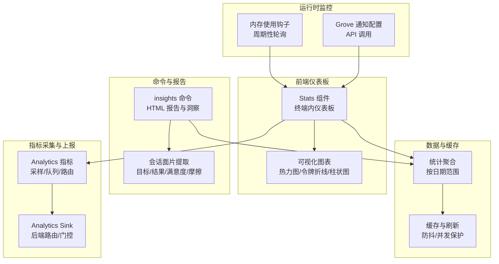
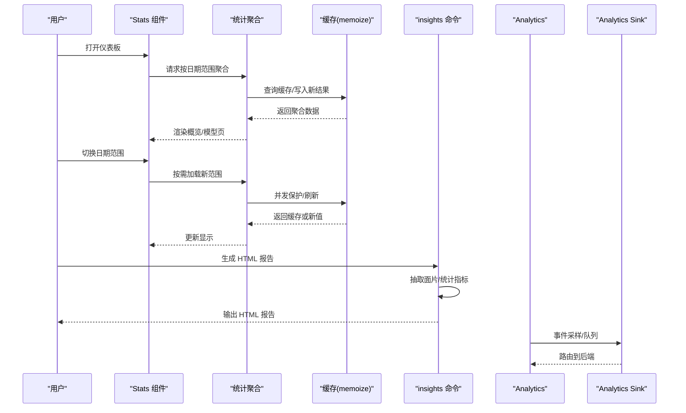
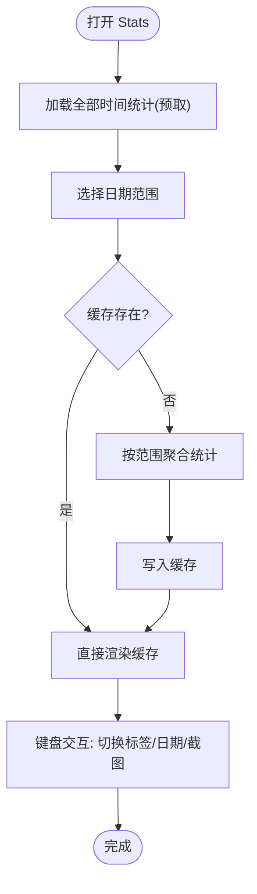
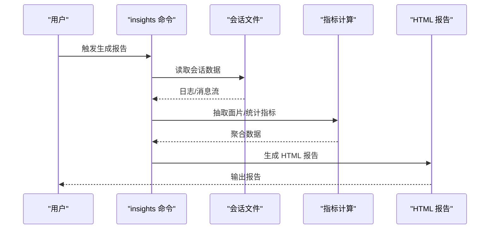
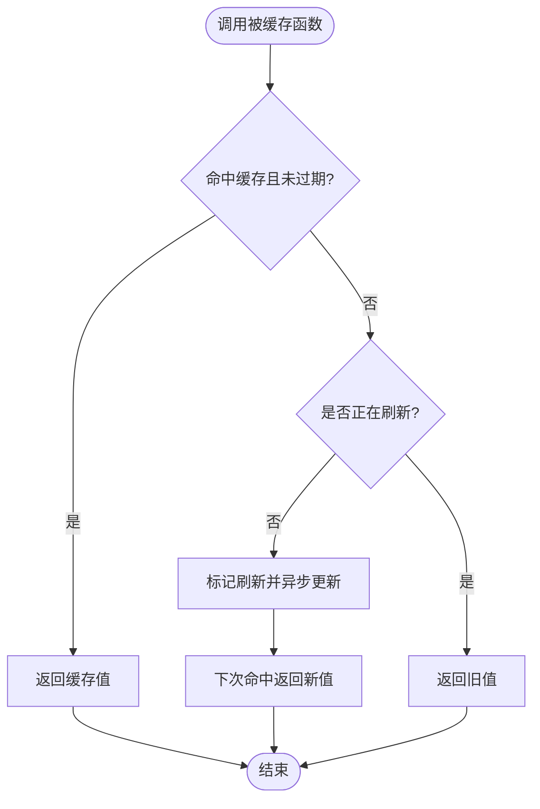
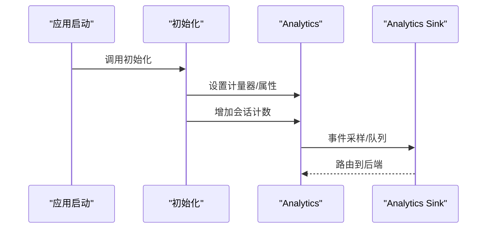
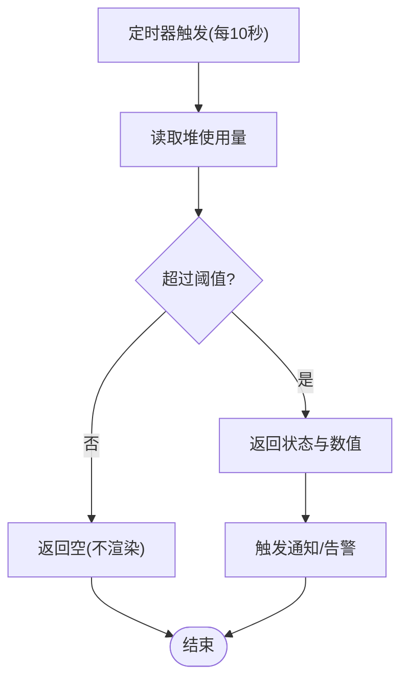
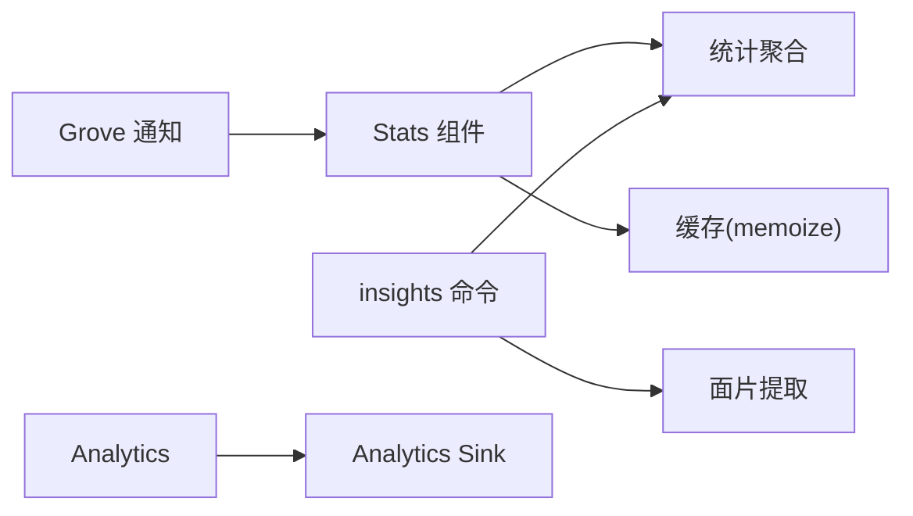

# 监控仪表板与报告

<cite>
**本文引用的文件**
- [src/components/Stats.tsx](file://src/components/Stats.tsx)
- [src/commands/insights.ts](file://src/commands/insights.ts)
- [src/utils/memoize.ts](file://src/utils/memoize.ts)
- [src/services/analytics/index.ts](file://src/services/analytics/index.ts)
- [src/services/analytics/sink.ts](file://src/services/analytics/sink.ts)
- [src/entrypoints/init.ts](file://src/entrypoints/init.ts)
- [src/hooks/useMemoryUsage.ts](file://src/hooks/useMemoryUsage.ts)
- [src/services/api/grove.ts](file://src/services/api/grove.ts)
- [src/utils/stats.ts/stats.ts](file://src/utils/stats.ts/stats.ts)
</cite>

## 目录
1. [简介](#简介)
2. [项目结构](#项目结构)
3. [核心组件](#核心组件)
4. [架构总览](#架构总览)
5. [详细组件分析](#详细组件分析)
6. [依赖关系分析](#依赖关系分析)
7. [性能考量](#性能考量)
8. [故障排查指南](#故障排查指南)
9. [结论](#结论)
10. [附录](#附录)

## 简介
本文件面向 Claude Code 的监控仪表板与报告系统，聚焦于实时监控面板的布局设计、数据可视化与交互体验；统计指标计算、缓存机制与数据更新策略；健康检查与系统状态监控、告警通知；性能报告生成、趋势分析与预测模型；以及自定义仪表板配置、指标筛选与导出能力。同时覆盖移动端适配、离线数据与数据同步机制，帮助开发者与用户高效理解并使用监控与报告能力。

## 项目结构
围绕监控与报告的关键模块分布如下：
- 统计与可视化：Stats 组件负责终端内仪表板的渲染与交互，支持概览与模型使用两个标签页，提供热力图、令牌图表、滚动列表等可视化元素。
- 报告与洞察：insights 命令用于生成 HTML 报告与洞察内容，涵盖会话统计、响应时间分布、时段分布、工具使用、错误分类等。
- 缓存与更新：memoize 提供通用的缓存与并发刷新控制，避免重复计算与竞态。
- 指标采集与上报：analytics 模块负责事件采样、队列与后端路由（如 Datadog），初始化时挂载到全局。
- 运行时健康：内存使用钩子定期轮询进程内存占用，触发高危状态提示。
- 通知与公告：Grove API 获取通知配置，支持在特定条件下跳过加载以保证稳定性。
- 数据聚合：stats 工具函数负责按日期范围聚合统计，支撑仪表板与报告的数据源。

**图表来源**
- [src/components/Stats.tsx:82-311](file://src/components/Stats.tsx#L82-L311)
- [src/commands/insights.ts:228-326](file://src/commands/insights.ts#L228-L326)
- [src/utils/memoize.ts:46-215](file://src/utils/memoize.ts#L46-L215)
- [src/services/analytics/index.ts:125-173](file://src/services/analytics/index.ts#L125-L173)
- [src/services/analytics/sink.ts:1-114](file://src/services/analytics/sink.ts#L1-L114)
- [src/hooks/useMemoryUsage.ts:1-39](file://src/hooks/useMemoryUsage.ts#L1-L39)
- [src/services/api/grove.ts:227-262](file://src/services/api/grove.ts#L227-L262)
- [src/utils/stats.ts/stats.ts](file://src/utils/stats.ts/stats.ts)

**章节来源**
- [src/components/Stats.tsx:82-311](file://src/components/Stats.tsx#L82-L311)
- [src/commands/insights.ts:228-326](file://src/commands/insights.ts#L228-L326)

## 核心组件
- 实时监控面板（Stats）
  - 支持“概览”和“模型”两个标签页，切换不阻塞渲染。
  - 提供日期范围选择器（全部时间、最近7天、最近30天），并按需懒加载过滤后的统计数据。
  - 概览页包含：活动热力图、会话数、最长会话、活跃天数、最长/当前连续天数、峰值日、令牌总量、书本类比趣味事实等。
  - 模型页包含：每日令牌折线图（仅展示前三大模型）、模型使用明细（输入/输出令牌占比）。
  - 支持截图复制到剪贴板，便于导出。
- 报告与洞察（insights）
  - 从本地会话数据中抽取“面片”（Facets），包括目标类别、结果、满意度、摩擦类型等。
  - 计算响应时间直方图、时段分布（早/午/晚/夜）、工具使用排行、语言分布、Git 提交/推送统计、多会话重叠检测等。
  - 输出 HTML 报告，包含统计卡片与图表片段。
- 缓存与并发控制（memoize）
  - 同步与异步两种缓存包装器，支持 TTL 过期与“正在刷新”标记，避免并发重复请求与竞态。
  - 提供 clear 方法清理缓存与飞行中请求，确保一致性。
- 指标采集与上报（analytics）
  - 事件可采样，未挂载时进入队列，挂载后批量冲刷。
  - 初始化时设置计量器与属性，启动即增加会话计数。
- 健康检查与通知（内存钩子/Grove）
  - 内存钩子每 10 秒轮询一次，超过阈值返回状态与堆使用量，否则为空以减少渲染开销。
  - Grove 通知配置通过 API 获取，支持“仅限必要流量”模式下跳过加载，保证稳定性。

**章节来源**
- [src/components/Stats.tsx:356-577](file://src/components/Stats.tsx#L356-L577)
- [src/components/Stats.tsx:716-815](file://src/components/Stats.tsx#L716-L815)
- [src/commands/insights.ts:228-326](file://src/commands/insights.ts#L228-L326)
- [src/commands/insights.ts:1877-1963](file://src/commands/insights.ts#L1877-L1963)
- [src/utils/memoize.ts:46-215](file://src/utils/memoize.ts#L46-L215)
- [src/services/analytics/index.ts:125-173](file://src/services/analytics/index.ts#L125-L173)
- [src/entrypoints/init.ts:288-340](file://src/entrypoints/init.ts#L288-L340)
- [src/hooks/useMemoryUsage.ts:1-39](file://src/hooks/useMemoryUsage.ts#L1-L39)
- [src/services/api/grove.ts:227-262](file://src/services/api/grove.ts#L227-L262)

## 架构总览
监控与报告系统的整体流程如下：
- 数据来源：本地会话日志与远程主机会话（按需收集）。
- 数据处理：抽取工具统计、响应时间、错误分类、语言分布、Git 操作、多会话重叠等。
- 可视化与交互：终端内仪表板（Stats）与 HTML 报告（insights）。
- 缓存与更新：memoize 缓存聚合结果，避免重复计算；Stats 在日期切换时按需加载。
- 指标上报：analytics 采样与队列，初始化时挂载 Sink 并路由至后端。
- 健康与通知：内存钩子与 Grove 配置，保障运行时稳定性与信息触达。

**图表来源**
- [src/components/Stats.tsx:121-179](file://src/components/Stats.tsx#L121-L179)
- [src/utils/memoize.ts:134-203](file://src/utils/memoize.ts#L134-L203)
- [src/commands/insights.ts:1947-1963](file://src/commands/insights.ts#L1947-L1963)
- [src/services/analytics/index.ts:125-173](file://src/services/analytics/index.ts#L125-L173)
- [src/services/analytics/sink.ts:109-114](file://src/services/analytics/sink.ts#L109-L114)

## 详细组件分析

### 实时监控面板（Stats 组件）
- 布局设计
  - 使用 Ink 的 Box/Text/Ansi 组合构建终端内布局，支持热力图、令牌折线图、两列统计区、滚动模型列表等。
  - 支持键盘快捷键：Esc 关闭、Tab 切换标签、r 切换日期范围、Ctrl+S 复制截图。
- 数据可视化
  - 活动热力图：基于每日活动数据生成 ANSI 热力图，宽度自适应终端宽度。
  - 令牌折线图：仅展示前三大模型，Y 轴单位自动缩放（k/M），X 轴标注月份与日期。
  - 概览统计：会话数、最长会话、活跃天数、最长/当前连续天数、峰值日等。
- 交互功能
  - 日期范围切换：全部时间/7天/30天，切换时按需加载并缓存。
  - 截图复制：将当前面板渲染为 ANSI 文本并复制到剪贴板。
- 性能优化
  - 使用 Suspense 与 use() 读取 Promise，避免阻塞渲染。
  - 仅在需要时加载过滤后的统计数据，减少不必要的计算。

**图表来源**
- [src/components/Stats.tsx:82-179](file://src/components/Stats.tsx#L82-L179)
- [src/components/Stats.tsx:1059-1094](file://src/components/Stats.tsx#L1059-L1094)

**章节来源**
- [src/components/Stats.tsx:356-577](file://src/components/Stats.tsx#L356-L577)
- [src/components/Stats.tsx:716-815](file://src/components/Stats.tsx#L716-L815)
- [src/components/Stats.tsx:1059-1094](file://src/components/Stats.tsx#L1059-L1094)

### 报告与洞察（insights 命令）
- 指标计算
  - 会话面片：目标类别、结果、满意度、摩擦类型等，汇总为类别计数。
  - 响应时间：统计用户响应时间分布，生成直方图与中位数/平均值。
  - 时段分布：按早/午/晚/夜分组统计消息数量。
  - 工具与语言：统计工具调用次数、语言分布、Git 提交/推送次数。
  - 错误分类：根据工具结果内容进行分类统计（命令失败、用户拒绝、编辑失败、文件变更等）。
- 可视化与导出
  - 生成 HTML 报告，包含统计卡片与图表片段，支持将 Markdown 转换为 HTML。
  - 提供洞察章节（如“一览”、“摩擦类别”、“特性建议”等）的自动生成与拼接。
- 数据来源
  - 本地会话日志；在特定用户类型下，支持从远程主机拉取会话数据并合并。

**图表来源**
- [src/commands/insights.ts:228-326](file://src/commands/insights.ts#L228-L326)
- [src/commands/insights.ts:1877-1963](file://src/commands/insights.ts#L1877-L1963)
- [src/commands/insights.ts:1947-1963](file://src/commands/insights.ts#L1947-L1963)

**章节来源**
- [src/commands/insights.ts:228-326](file://src/commands/insights.ts#L228-L326)
- [src/commands/insights.ts:1877-1963](file://src/commands/insights.ts#L1877-L1963)
- [src/commands/insights.ts:1947-1963](file://src/commands/insights.ts#L1947-L1963)

### 缓存机制与数据更新策略（memoize）
- 设计要点
  - 同步与异步两种包装器，统一基于 JSON 序列化参数作为键。
  - TTL 过期检测，若未在刷新则异步刷新并立即返回旧值，避免阻塞。
  - 并发保护：同一键的飞行中请求去重，防止重复网络/计算。
  - 提供 clear 方法清理缓存与飞行中请求，确保一致性。
- 典型用途
  - 统计聚合结果缓存（按日期范围）。
  - API 配置获取（如 Grove 通知配置）。

**图表来源**
- [src/utils/memoize.ts:46-99](file://src/utils/memoize.ts#L46-L99)
- [src/utils/memoize.ts:134-203](file://src/utils/memoize.ts#L134-L203)

**章节来源**
- [src/utils/memoize.ts:46-215](file://src/utils/memoize.ts#L46-L215)

### 指标采集与上报（Analytics）
- 采样与队列
  - 事件可采样，未挂载时进入队列，挂载后批量冲刷，避免丢失。
  - 提供同步与异步两类接口，满足不同场景。
- 初始化与路由
  - 初始化时设置计量器与属性，启动即增加会话计数。
  - Sink 负责将事件路由至后端（如 Datadog），并支持门控与“已关闭”开关。
- 门控与回退
  - 通过特征门控与缓存值回退，保证初始化期间不会丢失事件。

**图表来源**
- [src/entrypoints/init.ts:288-340](file://src/entrypoints/init.ts#L288-L340)
- [src/services/analytics/index.ts:125-173](file://src/services/analytics/index.ts#L125-L173)
- [src/services/analytics/sink.ts:109-114](file://src/services/analytics/sink.ts#L109-L114)

**章节来源**
- [src/services/analytics/index.ts:125-173](file://src/services/analytics/index.ts#L125-L173)
- [src/services/analytics/sink.ts:1-114](file://src/services/analytics/sink.ts#L1-L114)
- [src/entrypoints/init.ts:288-340](file://src/entrypoints/init.ts#L288-L340)

### 健康检查与告警（内存钩子与通知）
- 内存使用监控
  - 每 10 秒轮询一次进程堆使用量，超过阈值返回状态与数值，否则为空以减少渲染。
  - 阈值：高危与严重阈值分别对应不同状态，便于快速识别风险。
- 通知与公告
  - Grove 通知配置通过 API 获取，支持“仅限必要流量”模式下跳过加载，避免影响关键路径。
  - 配置项包括启用状态、域名排除、宽限期与提醒频率等。

**图表来源**
- [src/hooks/useMemoryUsage.ts:18-39](file://src/hooks/useMemoryUsage.ts#L18-L39)
- [src/services/api/grove.ts:227-262](file://src/services/api/grove.ts#L227-L262)

**章节来源**
- [src/hooks/useMemoryUsage.ts:1-39](file://src/hooks/useMemoryUsage.ts#L1-L39)
- [src/services/api/grove.ts:227-262](file://src/services/api/grove.ts#L227-L262)

## 依赖关系分析
- 组件耦合
  - Stats 依赖统计聚合与缓存模块，通过 Promise 与 Suspense 解耦加载与渲染。
  - insights 依赖会话数据与指标计算模块，输出 HTML 报告。
- 外部依赖
  - Analytics 依赖后端路由（如 Datadog），通过门控与队列保证稳定性。
  - Grove 通知配置通过 API 获取，支持在必要流量模式下跳过加载。
- 潜在循环
  - 当前模块间为单向依赖（Stats/insights -> 聚合/缓存；Analytics -> Sink），未见循环依赖迹象。

**图表来源**
- [src/components/Stats.tsx:82-179](file://src/components/Stats.tsx#L82-L179)
- [src/commands/insights.ts:228-326](file://src/commands/insights.ts#L228-L326)
- [src/utils/memoize.ts:46-215](file://src/utils/memoize.ts#L46-L215)
- [src/services/analytics/index.ts:125-173](file://src/services/analytics/index.ts#L125-L173)
- [src/services/analytics/sink.ts:109-114](file://src/services/analytics/sink.ts#L109-L114)
- [src/services/api/grove.ts:227-262](file://src/services/api/grove.ts#L227-L262)

**章节来源**
- [src/components/Stats.tsx:82-179](file://src/components/Stats.tsx#L82-L179)
- [src/commands/insights.ts:228-326](file://src/commands/insights.ts#L228-L326)
- [src/utils/memoize.ts:46-215](file://src/utils/memoize.ts#L46-L215)
- [src/services/analytics/index.ts:125-173](file://src/services/analytics/index.ts#L125-L173)
- [src/services/analytics/sink.ts:109-114](file://src/services/analytics/sink.ts#L109-L114)
- [src/services/api/grove.ts:227-262](file://src/services/api/grove.ts#L227-L262)

## 性能考量
- 渲染与交互
  - 使用 Suspense 与 Promise 驱动的懒加载，避免阻塞主线程。
  - 图表宽度自适应终端宽度，减少重排与闪烁。
- 缓存与并发
  - memoize 提供 TTL 与并发保护，显著降低重复计算与网络请求。
  - 对于大数据集（如年度热力图），采用固定宽度截图以保证一致性。
- 指标上报
  - 事件采样与队列机制，避免高峰时段对系统造成压力。
  - 初始化阶段使用门控与缓存回退，确保事件不丢失。

[本节为通用指导，无需具体文件分析]

## 故障排查指南
- 仪表板无数据显示
  - 检查统计聚合是否成功返回；确认缓存是否命中；尝试切换日期范围重新加载。
  - 若为首次使用，等待首次聚合完成。
- 截图复制失败
  - 确认终端环境支持 ANSI 复制；检查权限与剪贴板服务。
- 内存使用告警频繁
  - 关注高危/严重阈值触发频率；检查是否存在长时间运行任务导致内存增长。
- 通知未显示
  - 检查 Grove 配置是否启用；确认“仅限必要流量”模式下的行为；查看网络超时与重试逻辑。
- 指标上报异常
  - 查看采样配置与队列状态；确认门控是否开启；检查后端路由是否可用。

**章节来源**
- [src/components/Stats.tsx:231-261](file://src/components/Stats.tsx#L231-L261)
- [src/hooks/useMemoryUsage.ts:18-39](file://src/hooks/useMemoryUsage.ts#L18-L39)
- [src/services/api/grove.ts:227-262](file://src/services/api/grove.ts#L227-L262)
- [src/services/analytics/index.ts:125-173](file://src/services/analytics/index.ts#L125-L173)

## 结论
本系统通过终端内仪表板与 HTML 报告相结合的方式，实现了从实时监控到深度洞察的完整闭环。借助缓存与并发控制、采样与队列、门控与回退等机制，既保证了性能与稳定性，又提供了丰富的可视化与交互体验。未来可在移动端适配、离线数据与同步方面进一步扩展，以满足更广泛的使用场景。

[本节为总结性内容，无需具体文件分析]

## 附录
- 自定义仪表板配置
  - 通过日期范围选择器与标签页切换实现灵活配置；截图功能支持导出当前视图。
- 指标筛选
  - 概览页提供多维度统计；模型页支持按模型筛选与排序。
- 导出功能
  - 支持将当前面板渲染为 ANSI 文本并复制到剪贴板，便于分享与归档。
- 移动端适配
  - 仪表板基于终端尺寸自适应，建议在移动终端上使用合适的字体与主题以提升可读性。
- 离线数据与同步
  - 当前主要依赖本地会话数据；远程主机数据按需拉取；建议结合设置同步与远程托管方案以增强可用性。

[本节为概念性说明，无需具体文件分析]