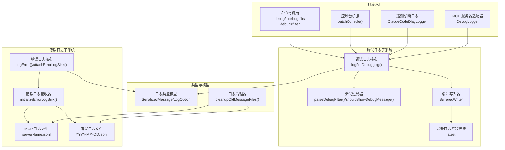
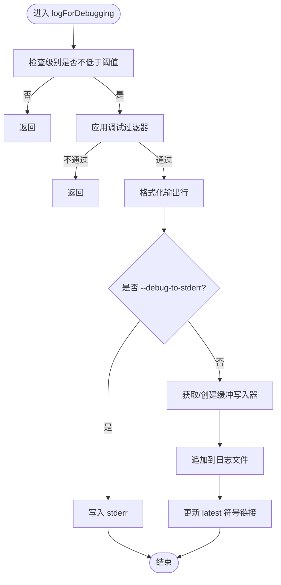
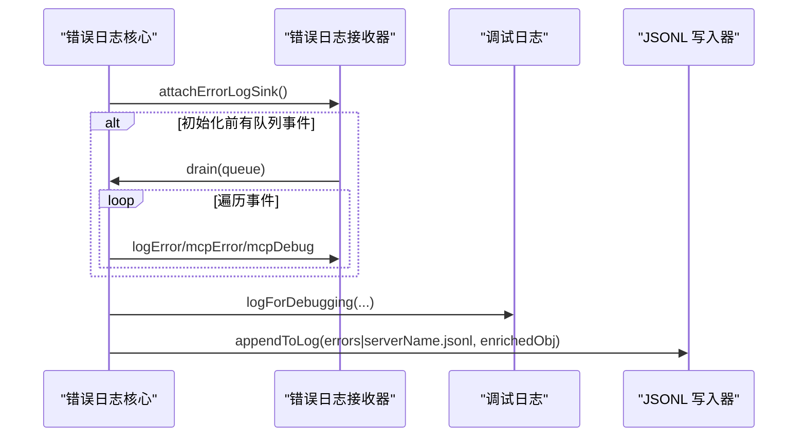
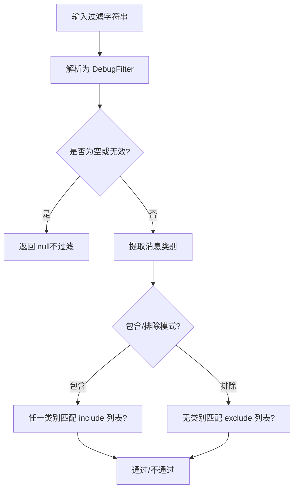
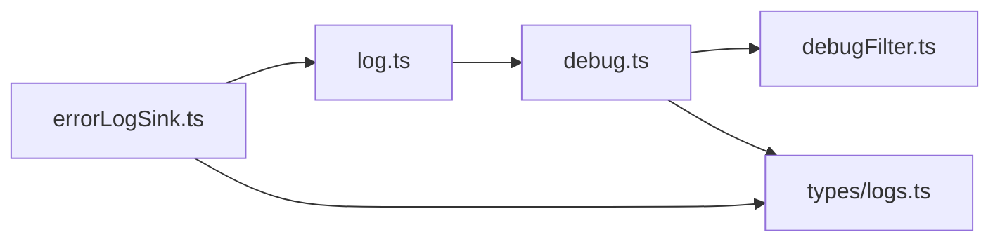

# 日志记录系统

<cite>
**本文档引用的文件**
- [src/utils/debug.ts](file://src/utils/debug.ts)
- [src/utils/log.ts](file://src/utils/log.ts)
- [src/utils/errorLogSink.ts](file://src/utils/errorLogSink.ts)
- [src/utils/debugFilter.ts](file://src/utils/debugFilter.ts)
- [src/utils/telemetry/logger.ts](file://src/utils/telemetry/logger.ts)
- [src/types/logs.ts](file://src/types/logs.ts)
- [src/utils/claudeInChrome/mcpServer.ts](file://src/utils/claudeInChrome/mcpServer.ts)
- [src/ink/ink.tsx](file://src/ink/ink.tsx)
- [src/utils/cleanup.ts](file://src/utils/cleanup.ts)
</cite>

## 目录
1. [简介](#简介)
2. [项目结构](#项目结构)
3. [核心组件](#核心组件)
4. [架构总览](#架构总览)
5. [详细组件分析](#详细组件分析)
6. [依赖关系分析](#依赖关系分析)
7. [性能考量](#性能考量)
8. [故障排查指南](#故障排查指南)
9. [结论](#结论)
10. [附录](#附录)

## 简介
本文件系统性梳理 Claude Code 的日志记录体系，覆盖日志级别、格式与字段、结构化输出、轮转与清理、过滤与搜索、性能优化、异步写入、批量处理、调试/审计/错误日志的用途与配置，以及日志监控与可视化建议。目标是帮助开发者与运维人员高效理解并正确使用日志系统。

## 项目结构
日志系统由以下模块协同构成：
- 调试日志：负责标准输出、文件落盘、缓冲与轮转、过滤与分类
- 错误日志：统一错误事件收集、结构化持久化、MCP 服务器专用日志
- 类型模型：标准化消息与会话元数据结构
- 过滤器：基于类别与模式的调试日志筛选
- 清理器：按时间清理旧日志文件
- 集成点：控制台桥接、遥测诊断日志、MCP 适配器



**图表来源**
- [src/utils/debug.ts:203-228](file://src/utils/debug.ts#L203-L228)
- [src/utils/debugFilter.ts:16-53](file://src/utils/debugFilter.ts#L16-L53)
- [src/utils/errorLogSink.ts:225-235](file://src/utils/errorLogSink.ts#L225-L235)
- [src/utils/log.ts:109-134](file://src/utils/log.ts#L109-L134)
- [src/types/logs.ts:8-53](file://src/types/logs.ts#L8-L53)
- [src/utils/cleanup.ts:93-109](file://src/utils/cleanup.ts#L93-L109)

**章节来源**
- [src/utils/debug.ts:18-57](file://src/utils/debug.ts#L18-L57)
- [src/utils/errorLogSink.ts:29-38](file://src/utils/errorLogSink.ts#L29-L38)
- [src/types/logs.ts:8-53](file://src/types/logs.ts#L8-L53)

## 核心组件
- 调试日志核心
  - 级别与阈值：verbose/debug/info/warn/error，受环境变量与运行时开关控制
  - 输出目标：标准错误或文件；支持缓冲与异步写入
  - 文件命名：按会话 ID 生成文件名，并维护 latest 符号链接
- 错误日志核心
  - 统一错误事件收集，延迟队列在接收器初始化后立即冲刷
  - 结构化 JSONL 写入，自动创建目录并追加
  - MCP 专用日志按服务器名分文件存储
- 类型与模型
  - 标准化消息体包含时间戳、工作目录、用户类型、会话 ID、版本等
  - 会话元数据支持摘要、标签、代理名称/颜色、PR 关联等
- 过滤器
  - 支持包含/排除两类模式，自动识别消息类别
  - 命令行参数 --debug=pattern 指定过滤规则
- 清理器
  - 基于截止日期删除旧文件，分别统计消息与错误清理数量

**章节来源**
- [src/utils/debug.ts:18-57](file://src/utils/debug.ts#L18-L57)
- [src/utils/debug.ts:203-228](file://src/utils/debug.ts#L203-L228)
- [src/utils/errorLogSink.ts:85-126](file://src/utils/errorLogSink.ts#L85-L126)
- [src/utils/log.ts:82-134](file://src/utils/log.ts#L82-L134)
- [src/types/logs.ts:8-53](file://src/types/logs.ts#L8-L53)
- [src/utils/debugFilter.ts:16-53](file://src/utils/debugFilter.ts#L16-L53)
- [src/utils/cleanup.ts:55-91](file://src/utils/cleanup.ts#L55-L91)

## 架构总览
调试日志与错误日志通过“接收器”模式解耦，避免循环依赖；调试日志采用缓冲写入器，支持同步/异步两种模式；错误日志以 JSONL 结构持久化，便于后续分析与聚合。

```mermaid
sequenceDiagram
participant Caller as "调用方"
participant Debug as "调试日志核心"
participant Filter as "调试过滤器"
participant Writer as "缓冲写入器"
participant FS as "文件系统"
Caller->>Debug : logForDebugging(message, {level})
Debug->>Filter : shouldShowDebugMessage(message, filter)
alt 通过过滤
Debug->>Writer : write(formattedLine)
opt 启用 --debug-to-stderr
Writer->>FS : 写入 stderr
else 文件模式
Writer->>FS : 追加到日志文件
FS-->>Writer : 更新成功
Writer->>FS : 更新 latest 符号链接
end
else 不通过过滤
Debug-->>Caller : 忽略
end
```

**图表来源**
- [src/utils/debug.ts:203-228](file://src/utils/debug.ts#L203-L228)
- [src/utils/debugFilter.ts:116-139](file://src/utils/debugFilter.ts#L116-L139)
- [src/utils/debug.ts:155-196](file://src/utils/debug.ts#L155-L196)

## 详细组件分析

### 调试日志系统
- 级别与阈值
  - 级别顺序：verbose < debug < info < warn < error
  - 最小级别阈值可通过环境变量 CLAUDE_CODE_DEBUG_LOG_LEVEL 设置
- 开关与路径
  - 运行时开关：--debug/-d、--debug-to-stderr、--debug-file、--debug=pattern
  - 默认路径：~/.claude/debug/{sessionId}.txt；可被 --debug-file 覆盖
- 缓冲与异步
  - 默认缓冲：1 秒刷新间隔，最大缓冲 100 行
  - 启动时强制同步写入，避免进程退出导致丢失
- 输出格式
  - 每条记录包含 ISO 时间戳与大写级别前缀
  - 多行内容在格式化输出模式下序列化为单行 JSON 字符串
- 符号链接
  - 自动维护 latest 指向当前日志文件，便于实时跟踪



**图表来源**
- [src/utils/debug.ts:203-228](file://src/utils/debug.ts#L203-L228)
- [src/utils/debug.ts:230-253](file://src/utils/debug.ts#L230-L253)

**章节来源**
- [src/utils/debug.ts:18-57](file://src/utils/debug.ts#L18-L57)
- [src/utils/debug.ts:203-228](file://src/utils/debug.ts#L203-L228)
- [src/utils/debug.ts:230-253](file://src/utils/debug.ts#L230-L253)

### 错误日志系统
- 接收器模式
  - 初始化前的错误事件会被队列缓存，初始化后立即冲刷
  - 接收器接口包含三类事件：通用错误、MCP 错误、MCP 调试
- 结构化输出
  - 统一添加时间戳、工作目录、用户类型、会话 ID、版本信息
  - 错误日志文件按日期命名，MCP 日志按服务器名分文件
- 异常增强
  - 对 Axios 错误提取 URL、状态码与服务端消息，提升可观测性



**图表来源**
- [src/utils/log.ts:109-134](file://src/utils/log.ts#L109-L134)
- [src/utils/errorLogSink.ts:225-235](file://src/utils/errorLogSink.ts#L225-L235)
- [src/utils/errorLogSink.ts:152-174](file://src/utils/errorLogSink.ts#L152-L174)

**章节来源**
- [src/utils/log.ts:82-134](file://src/utils/log.ts#L82-L134)
- [src/utils/errorLogSink.ts:29-38](file://src/utils/errorLogSink.ts#L29-L38)
- [src/utils/errorLogSink.ts:152-174](file://src/utils/errorLogSink.ts#L152-L174)

### 日志格式与字段
- 标准化消息字段
  - 必填：时间戳、会话 ID、版本、工作目录、用户类型
  - 可选：入口类型、Git 分支、slug、摘要、自定义标题等
- 结构化输出
  - 错误日志与 MCP 日志采用 JSONL，每行一个对象
  - 调试日志采用文本行，带时间戳与级别前缀
- 元数据扩展
  - 会话级元数据支持标签、代理名称/颜色、PR 关联、工作树状态等

**章节来源**
- [src/types/logs.ts:8-53](file://src/types/logs.ts#L8-L53)
- [src/utils/errorLogSink.ts:111-126](file://src/utils/errorLogSink.ts#L111-L126)

### 调试过滤与搜索
- 过滤语法
  - 包含模式：逗号分隔的类别列表
  - 排除模式：以 ! 开头的类别列表
  - 互斥规则：混合使用将被视为无效，返回空过滤
- 类别提取
  - 支持多种消息前缀与括号标记，自动识别 MCP、1P 等类别
- 使用方式
  - 命令行：--debug=api,hooks 或 --debug=!file,!1p
  - 运行时：/debug 命令启用调试模式



**图表来源**
- [src/utils/debugFilter.ts:16-53](file://src/utils/debugFilter.ts#L16-L53)
- [src/utils/debugFilter.ts:65-108](file://src/utils/debugFilter.ts#L65-L108)
- [src/utils/debugFilter.ts:116-139](file://src/utils/debugFilter.ts#L116-L139)

**章节来源**
- [src/utils/debugFilter.ts:16-53](file://src/utils/debugFilter.ts#L16-L53)
- [src/utils/debugFilter.ts:65-108](file://src/utils/debugFilter.ts#L65-L108)

### 日志轮转与清理
- 调试日志
  - 通过维护 latest 符号链接实现“滚动”查看最近日志
  - 文件按会话 ID 命名，便于按会话检索
- 错误日志与 MCP 日志
  - 按日期命名，自动创建目录并追加写入
  - 提供清理函数，按截止日期删除旧文件，分别统计消息与错误清理数量

**章节来源**
- [src/utils/debug.ts:230-253](file://src/utils/debug.ts#L230-L253)
- [src/utils/errorLogSink.ts:85-109](file://src/utils/errorLogSink.ts#L85-L109)
- [src/utils/cleanup.ts:55-91](file://src/utils/cleanup.ts#L55-L91)

### 集成点与适配器
- 控制台桥接
  - patchConsole 将 console.log/error/assert 重定向到调试日志，便于捕获第三方库输出
- 遥测诊断日志
  - ClaudeCodeDiagLogger 将 OTEL 诊断日志映射为内部错误与调试日志
- MCP 适配器
  - DebugLogger 将 MCP 服务器日志映射为调试日志级别

**章节来源**
- [src/ink/ink.tsx:1564-1583](file://src/ink/ink.tsx#L1564-L1583)
- [src/utils/telemetry/logger.ts:4-26](file://src/utils/telemetry/logger.ts#L4-L26)
- [src/utils/claudeInChrome/mcpServer.ts:277-293](file://src/utils/claudeInChrome/mcpServer.ts#L277-L293)

## 依赖关系分析
- 解耦设计
  - 调试日志核心仅依赖轻量工具，避免重型依赖引入
  - 错误日志核心通过接收器注入具体实现，避免循环依赖
- 关键依赖链
  - 调试日志：debug.ts → debugFilter.ts → bufferedWriter.js → fsOperations.js
  - 错误日志：errorLogSink.ts → log.ts → debug.ts → bufferedWriter.js
  - 类型模型：types/logs.ts 被日志与 UI 组件共享



**图表来源**
- [src/utils/debug.ts:1-269](file://src/utils/debug.ts#L1-L269)
- [src/utils/debugFilter.ts:1-158](file://src/utils/debugFilter.ts#L1-L158)
- [src/utils/errorLogSink.ts:1-236](file://src/utils/errorLogSink.ts#L1-L236)
- [src/utils/log.ts:1-363](file://src/utils/log.ts#L1-L363)
- [src/types/logs.ts:1-331](file://src/types/logs.ts#L1-L331)

**章节来源**
- [src/utils/debug.ts:1-269](file://src/utils/debug.ts#L1-L269)
- [src/utils/errorLogSink.ts:1-236](file://src/utils/errorLogSink.ts#L1-L236)
- [src/utils/log.ts:1-363](file://src/utils/log.ts#L1-L363)
- [src/types/logs.ts:1-331](file://src/types/logs.ts#L1-L331)

## 性能考量
- 异步与缓冲
  - 调试日志默认缓冲写入，减少频繁系统调用；启动时强制同步写入确保稳定性
  - 错误日志 JSONL 写入同样采用缓冲，提高吞吐
- 过滤前置
  - 在写入前进行过滤，避免不必要的 I/O
- 资源回收
  - 注册清理钩子，确保写入器在进程退出前释放资源
- 建议
  - 生产环境优先使用 --debug-to-stderr 观察关键路径
  - 对高并发场景，结合 --debug=filter 限制噪声类别
  - 定期执行清理任务，控制磁盘占用

[本节为通用指导，无需特定文件引用]

## 故障排查指南
- 无法看到调试日志
  - 确认已启用调试模式（--debug 或 /debug），非 ant 用户需在启动时开启
  - 检查 CLAUDE_CODE_DEBUG_LOG_LEVEL 是否设置过高的阈值
  - 若使用 --debug-to-stderr，请确认输出重定向情况
- 错误日志未落盘
  - 确认 initializeErrorLogSink 已在应用启动早期调用
  - 检查目录权限与磁盘空间
  - 查看最新日志文件：~/.claude/debug/latest
- MCP 日志缺失
  - 确认服务器名称正确，日志按 serverName.jsonl 存放
  - 检查是否存在初始化错误或网络异常
- 日志过大
  - 使用清理函数按日期清理历史文件
  - 结合过滤器减少噪声类别

**章节来源**
- [src/utils/debug.ts:44-69](file://src/utils/debug.ts#L44-L69)
- [src/utils/debug.ts:230-253](file://src/utils/debug.ts#L230-L253)
- [src/utils/errorLogSink.ts:225-235](file://src/utils/errorLogSink.ts#L225-L235)
- [src/utils/cleanup.ts:93-109](file://src/utils/cleanup.ts#L93-L109)

## 结论
该日志系统通过“接收器”解耦与“缓冲写入”机制，在保证可观测性的同时兼顾性能与可靠性。调试日志提供灵活的过滤与输出选项，错误日志采用结构化 JSONL，便于后续聚合与分析。配合清理与符号链接管理，能够有效控制磁盘占用并提升运维效率。

[本节为总结，无需特定文件引用]

## 附录

### 日志级别与使用场景
- verbose：极高频率的诊断信息（如完整命令行、状态行）
- debug：常规调试信息（默认级别）
- info：重要流程与状态提示
- warn：潜在问题但可恢复
- error：异常与错误

**章节来源**
- [src/utils/debug.ts:18-40](file://src/utils/debug.ts#L18-L40)

### 日志字段定义
- 标准字段：时间戳、会话 ID、版本、工作目录、用户类型
- 可选字段：入口类型、Git 分支、slug、摘要、自定义标题、代理名称/颜色、PR 关联、工作树状态等

**章节来源**
- [src/types/logs.ts:8-53](file://src/types/logs.ts#L8-L53)
- [src/utils/errorLogSink.ts:116-123](file://src/utils/errorLogSink.ts#L116-L123)

### 日志聚合与搜索建议
- 聚合：将 JSONL 文件导入集中式日志平台（如 ELK/BigQuery/Lakehouse）
- 过滤：利用 --debug=filter 与类别提取规则，按模块/服务器维度筛选
- 搜索：基于时间戳、会话 ID、关键字与正则表达式进行检索

[本节为通用指导，无需特定文件引用]