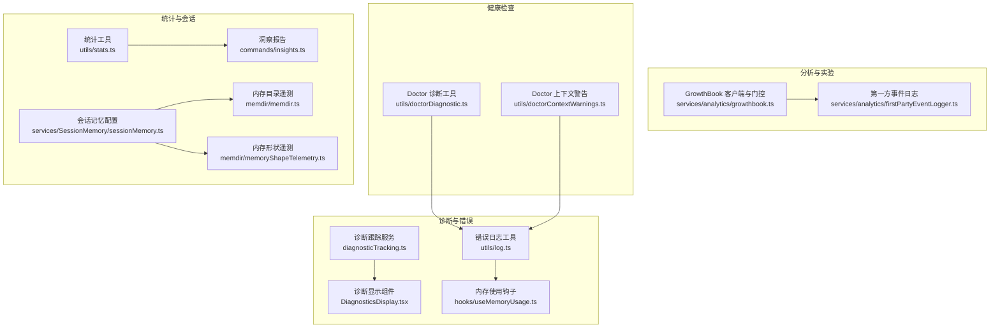
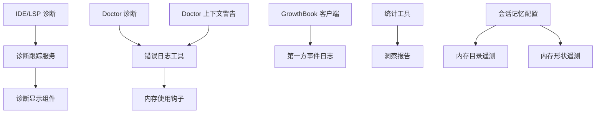
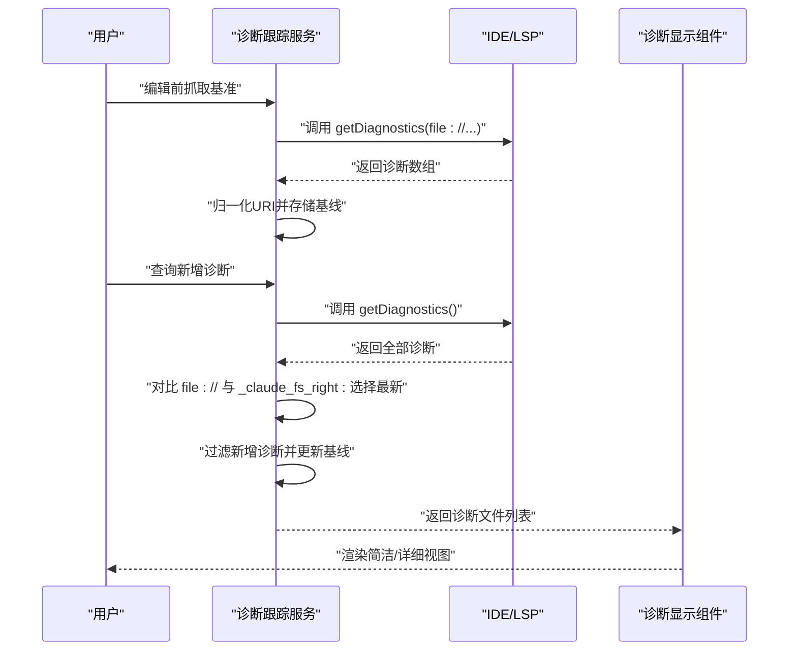
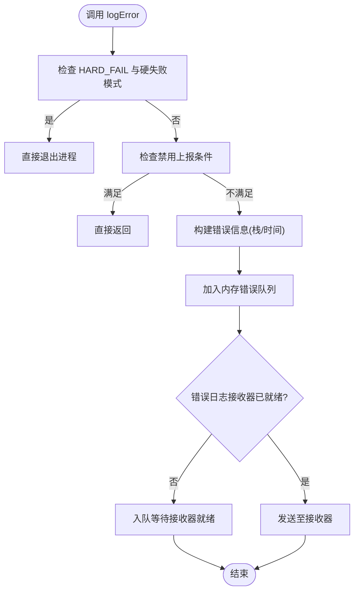
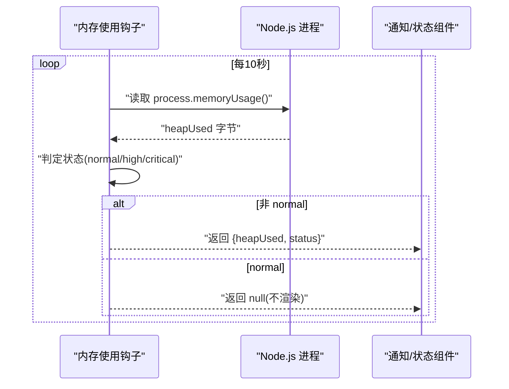
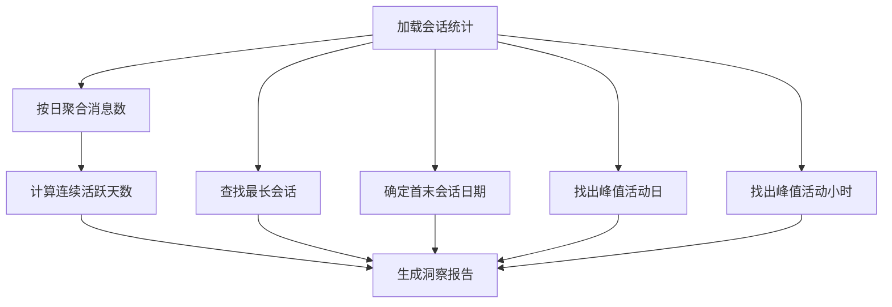
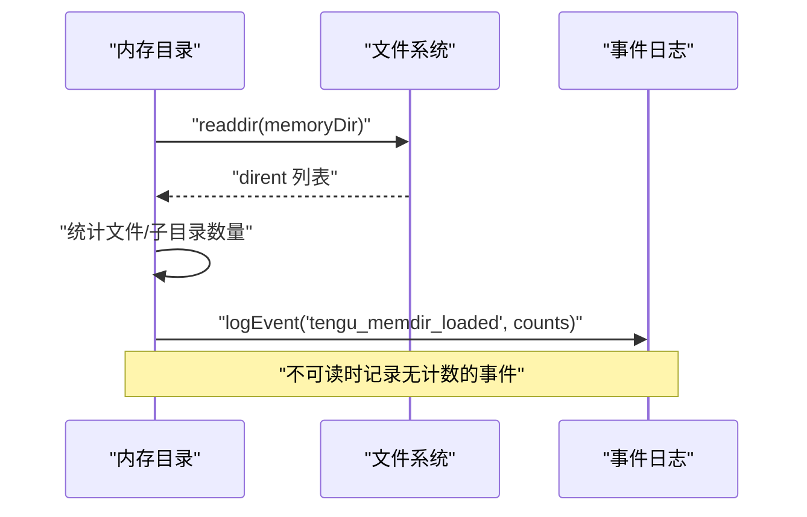
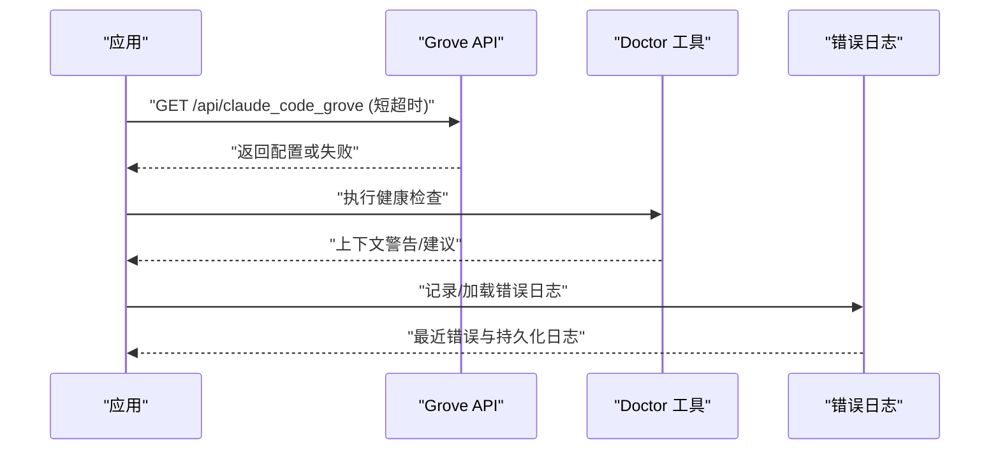
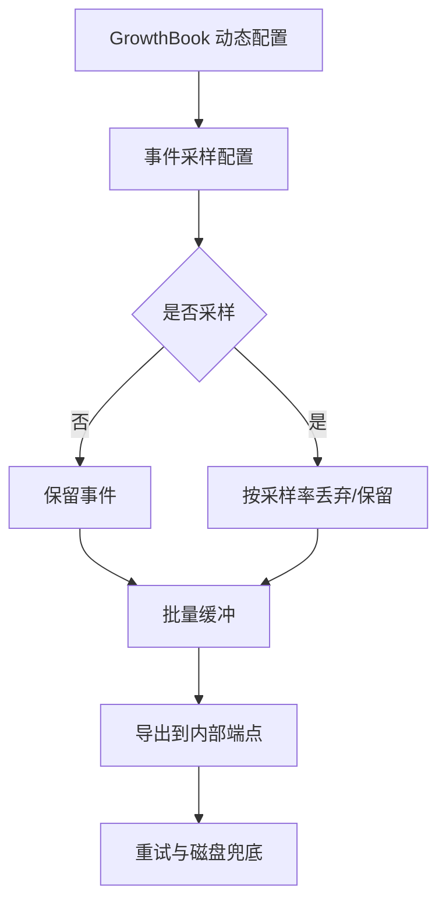
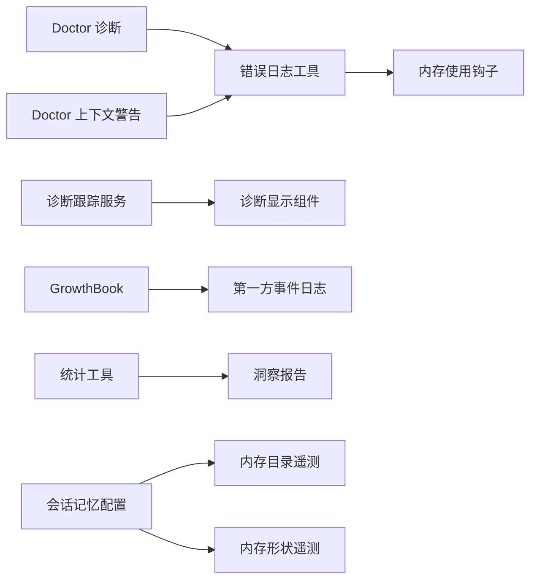

# 诊断分析与监控

<cite>
**本文引用的文件**
- [src/services/diagnosticTracking.ts](file://src/services/diagnosticTracking.ts)
- [src/components/DiagnosticsDisplay.tsx](file://src/components/DiagnosticsDisplay.tsx)
- [src/utils/log.ts](file://src/utils/log.ts)
- [src/hooks/useMemoryUsage.ts](file://src/hooks/useMemoryUsage.ts)
- [src/services/analytics/growthbook.ts](file://src/services/analytics/growthbook.ts)
- [src/services/analytics/firstPartyEventLogger.ts](file://src/services/analytics/firstPartyEventLogger.ts)
- [src/utils/doctorDiagnostic.ts](file://src/utils/doctorDiagnostic.ts)
- [src/utils/doctorContextWarnings.ts](file://src/utils/doctorContextWarnings.ts)
- [src/utils/sdkHeapDumpMonitor.ts](file://src/utils/sdkHeapDumpMonitor.ts)
- [src/migrations/src/services/analytics/migrateAutoUpdatesToSettings.ts](file://src/migrations/src/services/analytics/migrateAutoUpdatesToSettings.ts)
- [src/services/api/grove.ts](file://src/services/api/grove.ts)
- [src/utils/stats.ts](file://src/utils/stats.ts)
- [src/commands/insights.ts](file://src/commands/insights.ts)
- [src/commands/extra-usage/extra-usage-noninteractive.ts](file://src/commands/extra-usage/extra-usage-noninteractive.ts)
- [src/memdir/memdir.ts](file://src/memdir/memdir.ts)
- [src/memdir/memoryShapeTelemetry.ts](file://src/memdir/memoryShapeTelemetry.ts)
- [src/services/SessionMemory/sessionMemory.ts](file://src/services/SessionMemory/sessionMemory.ts)
</cite>

## 目录
1. [简介](#简介)
2. [项目结构](#项目结构)
3. [核心组件](#核心组件)
4. [架构总览](#架构总览)
5. [详细组件分析](#详细组件分析)
6. [依赖关系分析](#依赖关系分析)
7. [性能考量](#性能考量)
8. [故障排查指南](#故障排查指南)
9. [结论](#结论)
10. [附录](#附录)

## 简介
本文件面向 Claude Code 的诊断分析与监控体系，系统化阐述诊断数据采集机制、性能指标监控、健康状态评估、错误追踪与异常监控、故障预警、用户行为分析与使用模式统计、系统资源监控（内存与网络）、实时监控仪表板与历史数据分析、趋势预测、告警规则与通知机制、自动化响应策略，以及数据隐私保护与合规性要求。文档以代码为依据，结合可视化图示帮助读者快速理解与落地。

## 项目结构
围绕诊断与监控的关键目录与文件包括：
- 诊断采集与展示：诊断跟踪服务、诊断显示组件
- 错误日志与内存监控：统一错误日志工具、内存使用钩子
- 分析与实验平台：GrowthBook 特征门控与动态配置、第一方事件日志
- 健康检查与诊断上下文：Doctor 诊断工具与上下文警告
- 使用统计与会话记忆：统计工具、洞察报告、会话记忆配置
- 资源与内存遥测：内存目录计数与形状遥测、SDK 内存监控占位

**图表来源**
- [src/services/diagnosticTracking.ts:30-398](file://src/services/diagnosticTracking.ts#L30-L398)
- [src/components/DiagnosticsDisplay.tsx:1-95](file://src/components/DiagnosticsDisplay.tsx#L1-L95)
- [src/utils/log.ts:158-203](file://src/utils/log.ts#L158-L203)
- [src/hooks/useMemoryUsage.ts:18-39](file://src/hooks/useMemoryUsage.ts#L18-L39)
- [src/services/analytics/growthbook.ts:490-664](file://src/services/analytics/growthbook.ts#L490-L664)
- [src/services/analytics/firstPartyEventLogger.ts:312-389](file://src/services/analytics/firstPartyEventLogger.ts#L312-L389)
- [src/utils/doctorDiagnostic.ts](file://src/utils/doctorDiagnostic.ts)
- [src/utils/doctorContextWarnings.ts](file://src/utils/doctorContextWarnings.ts)
- [src/utils/stats.ts:759-800](file://src/utils/stats.ts#L759-L800)
- [src/commands/insights.ts:2687-3200](file://src/commands/insights.ts#L2687-L3200)
- [src/services/SessionMemory/sessionMemory.ts:64-99](file://src/services/SessionMemory/sessionMemory.ts#L64-L99)
- [src/memdir/memdir.ts:149-185](file://src/memdir/memdir.ts#L149-L185)
- [src/memdir/memoryShapeTelemetry.ts:1-7](file://src/memdir/memoryShapeTelemetry.ts#L1-L7)

**章节来源**
- [src/services/diagnosticTracking.ts:1-398](file://src/services/diagnosticTracking.ts#L1-L398)
- [src/utils/log.ts:1-363](file://src/utils/log.ts#L1-L363)
- [src/hooks/useMemoryUsage.ts:1-40](file://src/hooks/useMemoryUsage.ts#L1-L40)
- [src/services/analytics/growthbook.ts:1-800](file://src/services/analytics/growthbook.ts#L1-L800)
- [src/services/analytics/firstPartyEventLogger.ts:1-450](file://src/services/analytics/firstPartyEventLogger.ts#L1-L450)
- [src/utils/doctorDiagnostic.ts](file://src/utils/doctorDiagnostic.ts)
- [src/utils/doctorContextWarnings.ts](file://src/utils/doctorContextWarnings.ts)
- [src/utils/stats.ts:759-800](file://src/utils/stats.ts#L759-L800)
- [src/commands/insights.ts:2687-3200](file://src/commands/insights.ts#L2687-L3200)
- [src/services/SessionMemory/sessionMemory.ts:64-99](file://src/services/SessionMemory/sessionMemory.ts#L64-L99)
- [src/memdir/memdir.ts:149-185](file://src/memdir/memdir.ts#L149-L185)
- [src/memdir/memoryShapeTelemetry.ts:1-7](file://src/memdir/memoryShapeTelemetry.ts#L1-L7)

## 核心组件
- 诊断跟踪服务：捕获与对比 IDE 诊断结果，生成“新增诊断”集合，并提供摘要格式化与严重性符号映射。
- 诊断显示组件：在 CLI/终端界面中渲染诊断数量、文件与问题详情，支持简洁/详细两种视图。
- 统一错误日志：集中记录错误、MCP 错误与调试信息，支持内存内最近错误队列、持久化错误日志路径、延迟队列冲刷。
- 内存使用监控：周期轮询 Node.js 进程内存占用，按阈值标记高/危状态，避免对正常态频繁渲染。
- GrowthBook 实验平台：特征门控、远程评估、动态配置缓存与刷新、暴露事件记录、环境属性注入。
- 第一方事件日志：基于 OpenTelemetry Logs 的内部事件批处理导出，支持采样、批量配置、安全关停开关。
- Doctor 诊断与上下文警告：提供运行时健康检查与上下文提示，辅助定位问题。
- 使用统计与洞察：计算会话时长、最长会话、日活跃度、峰值时段等；生成洞察报告。
- 会话记忆与内存遥测：会话记忆门控与配置缓存；内存目录与写入/召回形状遥测。

**章节来源**
- [src/services/diagnosticTracking.ts:30-398](file://src/services/diagnosticTracking.ts#L30-L398)
- [src/components/DiagnosticsDisplay.tsx:1-95](file://src/components/DiagnosticsDisplay.tsx#L1-L95)
- [src/utils/log.ts:158-203](file://src/utils/log.ts#L158-L203)
- [src/hooks/useMemoryUsage.ts:18-39](file://src/hooks/useMemoryUsage.ts#L18-L39)
- [src/services/analytics/growthbook.ts:490-664](file://src/services/analytics/growthbook.ts#L490-L664)
- [src/services/analytics/firstPartyEventLogger.ts:312-389](file://src/services/analytics/firstPartyEventLogger.ts#L312-L389)
- [src/utils/doctorDiagnostic.ts](file://src/utils/doctorDiagnostic.ts)
- [src/utils/doctorContextWarnings.ts](file://src/utils/doctorContextWarnings.ts)
- [src/utils/stats.ts:759-800](file://src/utils/stats.ts#L759-L800)
- [src/commands/insights.ts:2687-3200](file://src/commands/insights.ts#L2687-L3200)
- [src/services/SessionMemory/sessionMemory.ts:64-99](file://src/services/SessionMemory/sessionMemory.ts#L64-L99)
- [src/memdir/memdir.ts:149-185](file://src/memdir/memdir.ts#L149-L185)
- [src/memdir/memoryShapeTelemetry.ts:1-7](file://src/memdir/memoryShapeTelemetry.ts#L1-L7)

## 架构总览
下图展示了从诊断采集到错误日志、从特征门控到事件日志、再到统计与会话记忆的整体链路。

**图表来源**
- [src/services/diagnosticTracking.ts:135-283](file://src/services/diagnosticTracking.ts#L135-L283)
- [src/components/DiagnosticsDisplay.tsx:17-84](file://src/components/DiagnosticsDisplay.tsx#L17-L84)
- [src/utils/log.ts:158-203](file://src/utils/log.ts#L158-L203)
- [src/hooks/useMemoryUsage.ts:18-39](file://src/hooks/useMemoryUsage.ts#L18-L39)
- [src/services/analytics/growthbook.ts:490-664](file://src/services/analytics/growthbook.ts#L490-L664)
- [src/services/analytics/firstPartyEventLogger.ts:312-389](file://src/services/analytics/firstPartyEventLogger.ts#L312-L389)
- [src/utils/doctorDiagnostic.ts](file://src/utils/doctorDiagnostic.ts)
- [src/utils/doctorContextWarnings.ts](file://src/utils/doctorContextWarnings.ts)
- [src/utils/stats.ts:759-800](file://src/utils/stats.ts#L759-L800)
- [src/commands/insights.ts:2687-3200](file://src/commands/insights.ts#L2687-L3200)
- [src/services/SessionMemory/sessionMemory.ts:64-99](file://src/services/SessionMemory/sessionMemory.ts#L64-L99)
- [src/memdir/memdir.ts:149-185](file://src/memdir/memdir.ts#L149-L185)
- [src/memdir/memoryShapeTelemetry.ts:1-7](file://src/memdir/memoryShapeTelemetry.ts#L1-L7)

## 详细组件分析

### 诊断数据采集与展示
- 采集流程：在编辑前抓取基准诊断，随后获取全量诊断，比较 file:// 与 _claude_fs_right: URI 的差异，提取“新增诊断”，并更新基线。
- 比较逻辑：逐项比对消息、严重性、来源、代码与范围，确保去重与稳定识别变更。
- 展示逻辑：支持简洁汇总（文件数、问题数）与详细列表（每文件逐条诊断），并提供严重性符号映射。
- 兼容性：对不同协议前缀进行归一化处理，兼容 Windows 大小写与路径分隔符。

**图表来源**
- [src/services/diagnosticTracking.ts:135-283](file://src/services/diagnosticTracking.ts#L135-L283)
- [src/components/DiagnosticsDisplay.tsx:17-84](file://src/components/DiagnosticsDisplay.tsx#L17-L84)

**章节来源**
- [src/services/diagnosticTracking.ts:30-398](file://src/services/diagnosticTracking.ts#L30-L398)
- [src/components/DiagnosticsDisplay.tsx:1-95](file://src/components/DiagnosticsDisplay.tsx#L1-L95)

### 错误追踪与异常监控
- 错误日志：统一入口记录错误与 MCP 调试信息，支持内存内最近错误队列、持久化错误日志路径、延迟队列冲刷。
- 错误上报条件：根据环境变量、隐私级别与云厂商参数决定是否上报；支持硬失败模式直接退出。
- 错误显示：提供加载错误日志列表、按索引获取、标题解析与排序等能力，便于排障与回溯。

**图表来源**
- [src/utils/log.ts:158-203](file://src/utils/log.ts#L158-L203)

**章节来源**
- [src/utils/log.ts:158-203](file://src/utils/log.ts#L158-L203)

### 性能指标监控与健康状态评估
- 内存使用：定时轮询 Node.js heapUsed，按阈值划分状态；仅在非正常态时返回信息，减少渲染开销。
- 网络性能：通过第一方事件日志记录请求元数据与采样配置，支持批量导出与关停开关。
- 会话记忆：特征门控与动态配置缓存，后台刷新，避免阻塞启动。

**图表来源**
- [src/hooks/useMemoryUsage.ts:18-39](file://src/hooks/useMemoryUsage.ts#L18-L39)

**章节来源**
- [src/hooks/useMemoryUsage.ts:1-40](file://src/hooks/useMemoryUsage.ts#L1-L40)
- [src/services/analytics/firstPartyEventLogger.ts:57-85](file://src/services/analytics/firstPartyEventLogger.ts#L57-L85)
- [src/services/analytics/growthbook.ts:658-664](file://src/services/analytics/growthbook.ts#L658-L664)

### 用户行为分析与使用模式统计
- 统计维度：日活跃度、最长会话、首次/末次会话日期、峰值活动日与小时、连续活跃天数等。
- 洞察报告：聚合目标类别、结果分布、满意度与摩擦度统计，形成可读的使用洞察。

**图表来源**
- [src/utils/stats.ts:759-800](file://src/utils/stats.ts#L759-L800)
- [src/commands/insights.ts:2687-3200](file://src/commands/insights.ts#L2687-L3200)

**章节来源**
- [src/utils/stats.ts:759-800](file://src/utils/stats.ts#L759-L800)
- [src/commands/insights.ts:2687-3200](file://src/commands/insights.ts#L2687-L3200)

### 系统资源监控与内存使用分析
- 内存目录遥测：异步读取内存目录文件与子目录数量，记录事件，避免阻塞提示构建。
- 内存形状遥测：记录召回/写入形状，辅助分析使用模式与性能影响。
- SDK 内存监控：提供占位实现，便于扩展。

**图表来源**
- [src/memdir/memdir.ts:149-185](file://src/memdir/memdir.ts#L149-L185)

**章节来源**
- [src/memdir/memdir.ts:149-185](file://src/memdir/memdir.ts#L149-L185)
- [src/memdir/memoryShapeTelemetry.ts:1-7](file://src/memdir/memoryShapeTelemetry.ts#L1-L7)
- [src/utils/sdkHeapDumpMonitor.ts:1-4](file://src/utils/sdkHeapDumpMonitor.ts#L1-L4)

### 健康状态评估与故障预警
- Doctor 诊断：提供运行时健康检查与上下文警告，辅助定位问题。
- Grove 通知：从 API 获取通知配置，短超时与优雅降级，避免阻塞主流程。
- 错误日志：提供错误列表加载、索引访问与标题解析，便于快速定位。

**图表来源**
- [src/services/api/grove.ts:227-262](file://src/services/api/grove.ts#L227-L262)
- [src/utils/doctorDiagnostic.ts](file://src/utils/doctorDiagnostic.ts)
- [src/utils/doctorContextWarnings.ts](file://src/utils/doctorContextWarnings.ts)
- [src/utils/log.ts:209-223](file://src/utils/log.ts#L209-L223)

**章节来源**
- [src/services/api/grove.ts:227-262](file://src/services/api/grove.ts#L227-L262)
- [src/utils/doctorDiagnostic.ts](file://src/utils/doctorDiagnostic.ts)
- [src/utils/doctorContextWarnings.ts](file://src/utils/doctorContextWarnings.ts)
- [src/utils/log.ts:209-223](file://src/utils/log.ts#L209-L223)

### 告警规则配置、通知机制与自动化响应
- 事件采样：基于 GrowthBook 动态配置的事件采样率，控制日志导出压力。
- 批量导出：可配置批量大小、队列上限、导出间隔与重试次数，支持关停开关。
- 自动化：Doctor 与上下文警告自动触发；错误日志接收器就绪后自动冲刷队列。

**图表来源**
- [src/services/analytics/firstPartyEventLogger.ts:43-85](file://src/services/analytics/firstPartyEventLogger.ts#L43-L85)
- [src/services/analytics/firstPartyEventLogger.ts:312-389](file://src/services/analytics/firstPartyEventLogger.ts#L312-L389)

**章节来源**
- [src/services/analytics/firstPartyEventLogger.ts:43-85](file://src/services/analytics/firstPartyEventLogger.ts#L43-L85)
- [src/services/analytics/firstPartyEventLogger.ts:312-389](file://src/services/analytics/firstPartyEventLogger.ts#L312-L389)

### 数据隐私保护、匿名化处理与合规性
- 隐私级别：根据“仅必要流量”等隐私设置决定是否上报与记录。
- 错误内容：错误字符串与堆栈信息被记录，但避免持久化完整对话消息。
- 采样与关停：事件可按采样率丢弃，或通过关停开关整体关闭导出。
- 云厂商：特定云厂商环境默认禁用特性，降低合规风险。

**章节来源**
- [src/utils/log.ts:167-177](file://src/utils/log.ts#L167-L177)
- [src/services/analytics/firstPartyEventLogger.ts:141-144](file://src/services/analytics/firstPartyEventLogger.ts#L141-L144)
- [src/services/analytics/firstPartyEventLogger.ts:407-449](file://src/services/analytics/firstPartyEventLogger.ts#L407-L449)

## 依赖关系分析

**图表来源**
- [src/utils/log.ts:158-203](file://src/utils/log.ts#L158-L203)
- [src/hooks/useMemoryUsage.ts:18-39](file://src/hooks/useMemoryUsage.ts#L18-L39)
- [src/services/diagnosticTracking.ts:30-398](file://src/services/diagnosticTracking.ts#L30-L398)
- [src/components/DiagnosticsDisplay.tsx:1-95](file://src/components/DiagnosticsDisplay.tsx#L1-L95)
- [src/services/analytics/growthbook.ts:490-664](file://src/services/analytics/growthbook.ts#L490-L664)
- [src/services/analytics/firstPartyEventLogger.ts:312-389](file://src/services/analytics/firstPartyEventLogger.ts#L312-L389)
- [src/utils/doctorDiagnostic.ts](file://src/utils/doctorDiagnostic.ts)
- [src/utils/doctorContextWarnings.ts](file://src/utils/doctorContextWarnings.ts)
- [src/utils/stats.ts:759-800](file://src/utils/stats.ts#L759-L800)
- [src/commands/insights.ts:2687-3200](file://src/commands/insights.ts#L2687-L3200)
- [src/services/SessionMemory/sessionMemory.ts:64-99](file://src/services/SessionMemory/sessionMemory.ts#L64-L99)
- [src/memdir/memdir.ts:149-185](file://src/memdir/memdir.ts#L149-L185)
- [src/memdir/memoryShapeTelemetry.ts:1-7](file://src/memdir/memoryShapeTelemetry.ts#L1-L7)

**章节来源**
- [src/utils/log.ts:158-203](file://src/utils/log.ts#L158-L203)
- [src/hooks/useMemoryUsage.ts:1-40](file://src/hooks/useMemoryUsage.ts#L1-L40)
- [src/services/diagnosticTracking.ts:30-398](file://src/services/diagnosticTracking.ts#L30-L398)
- [src/components/DiagnosticsDisplay.tsx:1-95](file://src/components/DiagnosticsDisplay.tsx#L1-L95)
- [src/services/analytics/growthbook.ts:490-664](file://src/services/analytics/growthbook.ts#L490-L664)
- [src/services/analytics/firstPartyEventLogger.ts:312-389](file://src/services/analytics/firstPartyEventLogger.ts#L312-L389)
- [src/utils/doctorDiagnostic.ts](file://src/utils/doctorDiagnostic.ts)
- [src/utils/doctorContextWarnings.ts](file://src/utils/doctorContextWarnings.ts)
- [src/utils/stats.ts:759-800](file://src/utils/stats.ts#L759-L800)
- [src/commands/insights.ts:2687-3200](file://src/commands/insights.ts#L2687-L3200)
- [src/services/SessionMemory/sessionMemory.ts:64-99](file://src/services/SessionMemory/sessionMemory.ts#L64-L99)
- [src/memdir/memdir.ts:149-185](file://src/memdir/memdir.ts#L149-L185)
- [src/memdir/memoryShapeTelemetry.ts:1-7](file://src/memdir/memoryShapeTelemetry.ts#L1-L7)

## 性能考量
- 诊断比较：采用 O(n) 对比算法，通过对象字段精确匹配与双向包含校验保证稳定性。
- 内存轮询：10 秒间隔，仅在非正常态返回，避免高频渲染。
- 事件导出：批量与队列上限可配置，采样率控制带宽与存储压力。
- 启动阻塞：GrowthBook 初始化采用缓存优先策略，必要时再刷新，避免阻塞启动。

[本节为通用性能讨论，无需具体文件分析]

## 故障排查指南
- 查看最近错误：通过内存队列与持久化日志定位问题根因。
- Doctor 诊断：运行健康检查与上下文警告，获取修复建议。
- Grove 通知：确认通知配置可用性，避免超时导致的阻塞。
- 会话记忆：检查门控与配置缓存，确认动态配置是否生效。

**章节来源**
- [src/utils/log.ts:209-223](file://src/utils/log.ts#L209-L223)
- [src/utils/doctorDiagnostic.ts](file://src/utils/doctorDiagnostic.ts)
- [src/utils/doctorContextWarnings.ts](file://src/utils/doctorContextWarnings.ts)
- [src/services/api/grove.ts:227-262](file://src/services/api/grove.ts#L227-L262)
- [src/services/SessionMemory/sessionMemory.ts:64-99](file://src/services/SessionMemory/sessionMemory.ts#L64-L99)

## 结论
本监控体系以诊断采集与展示为核心，配合统一错误日志、特征门控与事件日志，形成从数据采集、处理、导出到可视化的闭环。通过内存与网络指标监控、使用统计与洞察、Doctor 健康检查与 Grove 通知，实现多维度的健康状态评估与故障预警。隐私与合规方面，通过采样、关停与环境变量控制，确保在满足监管要求的同时保留关键观测数据。

[本节为总结性内容，无需具体文件分析]

## 附录
- 迁移与配置：包含自动更新迁移至设置等分析迁移流程，便于理解配置演进。
- 额外用量：提供非交互式调用以管理额外用量，便于运维与合规审计。

**章节来源**
- [src/migrations/src/services/analytics/migrateAutoUpdatesToSettings.ts](file://src/migrations/src/services/analytics/migrateAutoUpdatesToSettings.ts)
- [src/commands/extra-usage/extra-usage-noninteractive.ts:1-16](file://src/commands/extra-usage/extra-usage-noninteractive.ts#L1-L16)