# 调试工具与诊断

<cite>
**本文引用的文件**
- [src/utils/debug.ts](file://src/utils/debug.ts)
- [src/utils/debugFilter.ts](file://src/utils/debugFilter.ts)
- [src/bridge/debugUtils.ts](file://src/bridge/debugUtils.ts)
- [src/utils/telemetry/perfettoTracing.ts](file://src/utils/telemetry/perfettoTracing.ts)
- [src/utils/heapDumpService.ts](file://src/utils/heapDumpService.ts)
- [src/commands/heapdump/heapdump.ts](file://src/commands/heapdump/heapdump.ts)
- [src/utils/queryProfiler.ts](file://src/utils/queryProfiler.ts)
- [src/services/diagnosticTracking.ts](file://src/services/diagnosticTracking.ts)
- [src/services/api/dumpPrompts.ts](file://src/services/api/dumpPrompts.ts)
- [src/screens/REPL.tsx](file://src/screens/REPL.tsx)
- [src/main.tsx](file://src/main.tsx)
- [src/ink/ink.tsx](file://src/ink/ink.tsx)
</cite>

## 目录
1. [简介](#简介)
2. [项目结构](#项目结构)
3. [核心组件](#核心组件)
4. [架构总览](#架构总览)
5. [详细组件分析](#详细组件分析)
6. [依赖关系分析](#依赖关系分析)
7. [性能考量](#性能考量)
8. [故障排除指南](#故障排除指南)
9. [结论](#结论)
10. [附录](#附录)

## 简介
本文件面向开发者与技术支持人员，系统化梳理 Claude Code 的调试工具与诊断能力，覆盖以下主题：
- 调试模式启用与配置（环境变量、命令行参数）
- 日志过滤与输出控制（分类过滤、级别控制、标准输出重定向）
- 断点调试与条件断点（基于调试日志与过滤器）
- 性能剖析（查询阶段计时、API 请求追踪、工具执行追踪）
- 内存分析与堆转储（手动/自动触发、诊断信息采集）
- 网络请求调试（API 调用跟踪、响应时间分析、SSE 流解析）
- 会话调试与消息流（REPL 中的 API 指标聚合）
- 错误堆栈与异常分析（敏感信息脱敏、错误详情提取）
- 开发者工具集成与实时监控（桥接层跳过原因记录、分析事件上报）

## 项目结构
围绕调试与诊断的关键模块分布如下：
- 工具与服务
  - 日志与过滤：src/utils/debug.ts、src/utils/debugFilter.ts
  - 桥接层调试辅助：src/bridge/debugUtils.ts
  - 性能追踪（Perfetto）：src/utils/telemetry/perfettoTracing.ts
  - 堆转储与内存诊断：src/utils/heapDumpService.ts、src/commands/heapdump/heapdump.ts
  - 查询阶段计时：src/utils/queryProfiler.ts
  - IDE 诊断跟踪：src/services/diagnosticTracking.ts
  - API 请求与响应记录：src/services/api/dumpPrompts.ts
  - REPL 中的 API 指标：src/screens/REPL.tsx
- 运行时检测
  - 是否处于调试/检查模式：src/main.tsx
  - 控制台输出重定向到调试日志：src/ink/ink.tsx

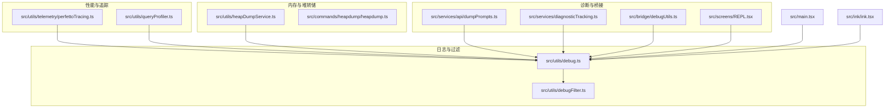

图表来源
- [src/utils/debug.ts:1-269](file://src/utils/debug.ts#L1-L269)
- [src/utils/debugFilter.ts:1-158](file://src/utils/debugFilter.ts#L1-L158)
- [src/utils/telemetry/perfettoTracing.ts:1-800](file://src/utils/telemetry/perfettoTracing.ts#L1-L800)
- [src/utils/queryProfiler.ts:1-302](file://src/utils/queryProfiler.ts#L1-L302)
- [src/utils/heapDumpService.ts:1-304](file://src/utils/heapDumpService.ts#L1-L304)
- [src/commands/heapdump/heapdump.ts:1-18](file://src/commands/heapdump/heapdump.ts#L1-L18)
- [src/services/diagnosticTracking.ts:1-398](file://src/services/diagnosticTracking.ts#L1-L398)
- [src/bridge/debugUtils.ts:1-142](file://src/bridge/debugUtils.ts#L1-L142)
- [src/services/api/dumpPrompts.ts:170-226](file://src/services/api/dumpPrompts.ts#L170-L226)
- [src/screens/REPL.tsx:2816-2839](file://src/screens/REPL.tsx#L2816-L2839)
- [src/main.tsx:231-250](file://src/main.tsx#L231-L250)
- [src/ink/ink.tsx:1570-1583](file://src/ink/ink.tsx#L1570-L1583)

章节来源
- [src/utils/debug.ts:1-269](file://src/utils/debug.ts#L1-L269)
- [src/utils/debugFilter.ts:1-158](file://src/utils/debugFilter.ts#L1-L158)
- [src/utils/telemetry/perfettoTracing.ts:1-800](file://src/utils/telemetry/perfettoTracing.ts#L1-L800)
- [src/utils/heapDumpService.ts:1-304](file://src/utils/heapDumpService.ts#L1-L304)
- [src/commands/heapdump/heapdump.ts:1-18](file://src/commands/heapdump/heapdump.ts#L1-L18)
- [src/utils/queryProfiler.ts:1-302](file://src/utils/queryProfiler.ts#L1-L302)
- [src/services/diagnosticTracking.ts:1-398](file://src/services/diagnosticTracking.ts#L1-L398)
- [src/bridge/debugUtils.ts:1-142](file://src/bridge/debugUtils.ts#L1-L142)
- [src/services/api/dumpPrompts.ts:170-226](file://src/services/api/dumpPrompts.ts#L170-L226)
- [src/screens/REPL.tsx:2816-2839](file://src/screens/REPL.tsx#L2816-L2839)
- [src/main.tsx:231-250](file://src/main.tsx#L231-L250)
- [src/ink/ink.tsx:1570-1583](file://src/ink/ink.tsx#L1570-L1583)

## 核心组件
- 调试日志与过滤
  - 支持通过环境变量与命令行参数启用调试模式；支持最小日志级别、输出目标（文件或标准错误）、调试文件路径、动态开启等。
  - 提供消息分类提取与包含/排除过滤，支持“!前缀”排他模式与多类别匹配。
- 性能追踪（Perfetto）
  - 在 Ant 构建中生成 Chrome Trace Event 格式文件，记录 API 请求、工具执行、用户等待等事件，支持周期写入与过期清理。
- 查询阶段计时
  - 使用性能钩子记录从用户输入到首 token 到达的完整流水线关键节点，输出带慢操作标记的报告。
- 堆转储与内存诊断
  - 手动或自动触发堆快照与内存诊断 JSON，先写诊断后写堆文件，避免大堆导致崩溃；统计 V8 堆空间、上下文、句柄、请求、文件描述符等指标。
- IDE 诊断跟踪
  - 获取并对比编辑前后诊断集合，仅汇报新增差异，支持 file:// 与 _claude_fs_right: URI。
- 桥接层调试辅助
  - 敏感字段脱敏、消息截断、错误详情提取、桥接跳过原因记录与分析事件上报。
- API 请求与响应记录
  - 对响应体进行克隆解析，支持 SSE 流分块解析，异步保存到文件，便于回放与分析。
- REPL 中的 API 指标
  - 多请求回合下计算 P50 TTFT 与 OTPS，并汇总到消息中。

章节来源
- [src/utils/debug.ts:44-102](file://src/utils/debug.ts#L44-L102)
- [src/utils/debugFilter.ts:16-53](file://src/utils/debugFilter.ts#L16-L53)
- [src/utils/telemetry/perfettoTracing.ts:253-335](file://src/utils/telemetry/perfettoTracing.ts#L253-L335)
- [src/utils/queryProfiler.ts:50-93](file://src/utils/queryProfiler.ts#L50-L93)
- [src/utils/heapDumpService.ts:221-278](file://src/utils/heapDumpService.ts#L221-L278)
- [src/services/diagnosticTracking.ts:30-76](file://src/services/diagnosticTracking.ts#L30-L76)
- [src/bridge/debugUtils.ts:26-53](file://src/bridge/debugUtils.ts#L26-L53)
- [src/services/api/dumpPrompts.ts:170-226](file://src/services/api/dumpPrompts.ts#L170-L226)
- [src/screens/REPL.tsx:2816-2839](file://src/screens/REPL.tsx#L2816-L2839)

## 架构总览
调试与诊断体系由“日志与过滤”作为入口，向上连接“性能追踪”“内存分析”“API 记录”“IDE 诊断”，向下与“运行时检测”“控制台重定向”协同工作。

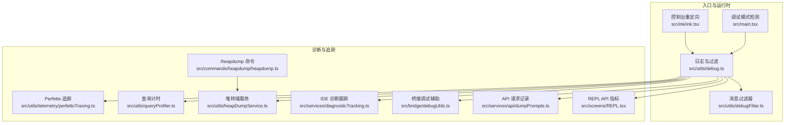

图表来源
- [src/main.tsx:231-250](file://src/main.tsx#L231-L250)
- [src/utils/debug.ts:104-125](file://src/utils/debug.ts#L104-L125)
- [src/utils/debugFilter.ts:65-108](file://src/utils/debugFilter.ts#L65-L108)
- [src/ink/ink.tsx:1570-1583](file://src/ink/ink.tsx#L1570-L1583)
- [src/utils/telemetry/perfettoTracing.ts:253-335](file://src/utils/telemetry/perfettoTracing.ts#L253-L335)
- [src/utils/queryProfiler.ts:50-93](file://src/utils/queryProfiler.ts#L50-L93)
- [src/utils/heapDumpService.ts:221-278](file://src/utils/heapDumpService.ts#L221-L278)
- [src/commands/heapdump/heapdump.ts:1-18](file://src/commands/heapdump/heapdump.ts#L1-L18)
- [src/services/diagnosticTracking.ts:30-76](file://src/services/diagnosticTracking.ts#L30-L76)
- [src/bridge/debugUtils.ts:26-53](file://src/bridge/debugUtils.ts#L26-L53)
- [src/services/api/dumpPrompts.ts:170-226](file://src/services/api/dumpPrompts.ts#L170-L226)
- [src/screens/REPL.tsx:2816-2839](file://src/screens/REPL.tsx#L2816-L2839)

## 详细组件分析

### 调试模式与日志系统
- 启用方式
  - 环境变量：DEBUG、DEBUG_SDK、CLAUDE_CODE_DEBUG_LOG_LEVEL
  - 命令行：--debug、-d、--debug-to-stderr、-d2e、--debug=pattern、--debug-file[=path]
- 行为特性
  - 动态开启：/debug 触发后可即时生效
  - 输出目标：默认写文件，也可重定向至 stderr
  - 文件路径：优先 --debug-file，其次 CLAUDE_CODE_DEBUG_LOGS_DIR，最后会话目录下的 .txt
  - 最小日志级别：verbose/debug/info/warn/error
  - 过滤：parseDebugFilter 解析 include/exclude，支持“!”排他模式
- 运行时检测
  - 检测 --inspect/--debug 等标志，判断是否处于调试/检查模式

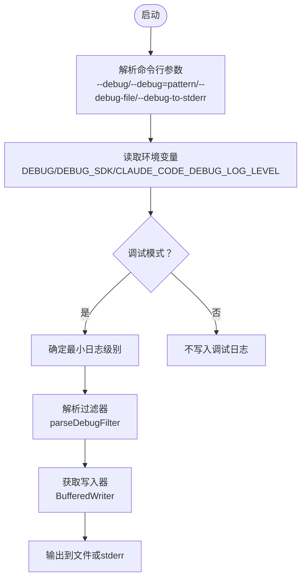

图表来源
- [src/utils/debug.ts:44-102](file://src/utils/debug.ts#L44-L102)
- [src/utils/debug.ts:155-196](file://src/utils/debug.ts#L155-L196)
- [src/utils/debugFilter.ts:16-53](file://src/utils/debugFilter.ts#L16-L53)
- [src/main.tsx:231-250](file://src/main.tsx#L231-L250)

章节来源
- [src/utils/debug.ts:44-102](file://src/utils/debug.ts#L44-L102)
- [src/utils/debug.ts:155-196](file://src/utils/debug.ts#L155-L196)
- [src/utils/debugFilter.ts:16-53](file://src/utils/debugFilter.ts#L16-L53)
- [src/main.tsx:231-250](file://src/main.tsx#L231-L250)

### 消息过滤与分类
- 分类提取规则
  - MCP 服务器名、方括号前缀、冒号前缀、特殊关键词（如 1p event）
  - 允许二次类别提取（如 “AutoUpdaterWrapper: type: development”）
- 过滤策略
  - 排他模式：未命中任一排除即显示
  - 包含模式：未命中任一包含即隐藏
  - 无分类消息在两种模式下均被过滤（安全考虑）

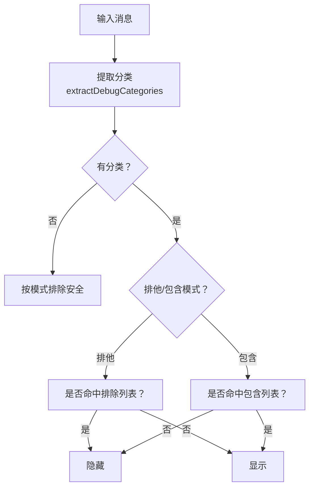

图表来源
- [src/utils/debugFilter.ts:65-108](file://src/utils/debugFilter.ts#L65-L108)
- [src/utils/debugFilter.ts:116-139](file://src/utils/debugFilter.ts#L116-L139)

章节来源
- [src/utils/debugFilter.ts:65-108](file://src/utils/debugFilter.ts#L65-L108)
- [src/utils/debugFilter.ts:116-139](file://src/utils/debugFilter.ts#L116-L139)

### 性能剖析（Perfetto 追踪）
- 启用方式
  - 环境变量 CLAUDE_CODE_PERFETTO_TRACE=1 或指定路径
  - 可选 CLAUDE_CODE_PERFETTO_WRITE_INTERVAL_S 定期写入
- 事件类型
  - API 请求（含 TTFT/TTLT、提示词/输出 token、缓存命中率、重试子段）
  - 工具执行（名称、耗时、结果 token）
  - 用户等待（上下文）
- 清理与容量
  - 待处理跨度超时淘汰、事件上限半量淘汰标记
  - 注册退出回调与 beforeExit 回退写入

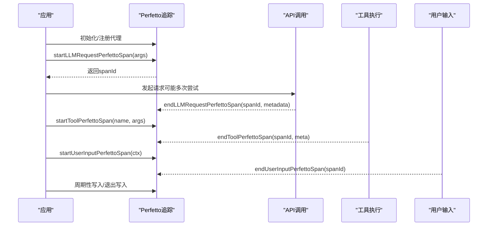

图表来源
- [src/utils/telemetry/perfettoTracing.ts:253-335](file://src/utils/telemetry/perfettoTracing.ts#L253-L335)
- [src/utils/telemetry/perfettoTracing.ts:425-485](file://src/utils/telemetry/perfettoTracing.ts#L425-L485)
- [src/utils/telemetry/perfettoTracing.ts:687-763](file://src/utils/telemetry/perfettoTracing.ts#L687-L763)
- [src/utils/telemetry/perfettoTracing.ts:765-800](file://src/utils/telemetry/perfettoTracing.ts#L765-L800)

章节来源
- [src/utils/telemetry/perfettoTracing.ts:253-335](file://src/utils/telemetry/perfettoTracing.ts#L253-L335)
- [src/utils/telemetry/perfettoTracing.ts:425-485](file://src/utils/telemetry/perfettoTracing.ts#L425-L485)
- [src/utils/telemetry/perfettoTracing.ts:687-763](file://src/utils/telemetry/perfettoTracing.ts#L687-L763)
- [src/utils/telemetry/perfettoTracing.ts:765-800](file://src/utils/telemetry/perfettoTracing.ts#L765-L800)

### 查询阶段计时（Query Profiler）
- 启用方式：CLAUDE_CODE_PROFILE_QUERY=1
- 关键节点：用户输入、上下文加载、函数入口、微压缩、自动压缩、工具 schema、消息归一化、客户端创建、API 请求发送、响应头、首块、流结束、工具执行、递归调用、结束
- 报告内容：相对时间、增量、内存快照、慢操作标记、阶段汇总、TTFT 统计

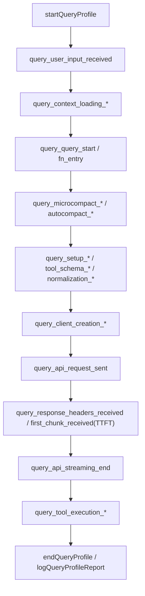

图表来源
- [src/utils/queryProfiler.ts:50-93](file://src/utils/queryProfiler.ts#L50-L93)
- [src/utils/queryProfiler.ts:129-211](file://src/utils/queryProfiler.ts#L129-L211)
- [src/utils/queryProfiler.ts:216-293](file://src/utils/queryProfiler.ts#L216-L293)

章节来源
- [src/utils/queryProfiler.ts:50-93](file://src/utils/queryProfiler.ts#L50-L93)
- [src/utils/queryProfiler.ts:129-211](file://src/utils/queryProfiler.ts#L129-L211)
- [src/utils/queryProfiler.ts:216-293](file://src/utils/queryProfiler.ts#L216-L293)

### 堆转储与内存诊断
- 触发方式：/heapdump 命令或内部逻辑（自动阈值）
- 顺序：先写诊断 JSON，再写堆快照，避免大堆序列化崩溃
- 诊断字段：时间戳、会话 ID、触发类型、增长速率、V8 堆统计、堆空间、资源使用、活动句柄/请求、文件描述符、潜在泄漏清单与建议
- 平台差异：Bun 下同步写入与强制 GC

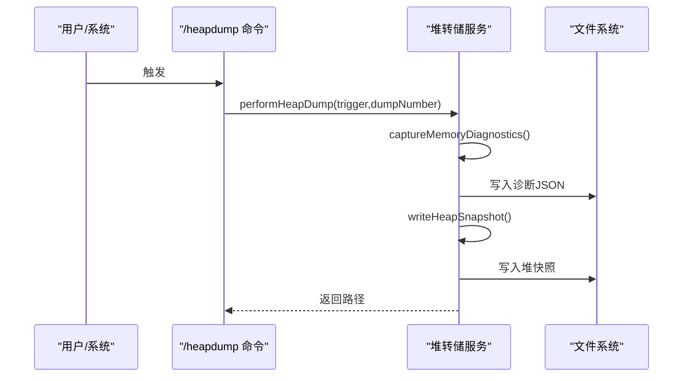

图表来源
- [src/commands/heapdump/heapdump.ts:1-18](file://src/commands/heapdump/heapdump.ts#L1-L18)
- [src/utils/heapDumpService.ts:88-212](file://src/utils/heapDumpService.ts#L88-L212)
- [src/utils/heapDumpService.ts:221-278](file://src/utils/heapDumpService.ts#L221-L278)
- [src/utils/heapDumpService.ts:284-304](file://src/utils/heapDumpService.ts#L284-L304)

章节来源
- [src/commands/heapdump/heapdump.ts:1-18](file://src/commands/heapdump/heapdump.ts#L1-L18)
- [src/utils/heapDumpService.ts:88-212](file://src/utils/heapDumpService.ts#L88-L212)
- [src/utils/heapDumpService.ts:221-278](file://src/utils/heapDumpService.ts#L221-L278)
- [src/utils/heapDumpService.ts:284-304](file://src/utils/heapDumpService.ts#L284-L304)

### IDE 诊断跟踪
- 初始化与重置：首次查询开始时自动发现 IDE 客户端并初始化，后续查询循环重置
- 基线采集：编辑前对 file:// URI 采集诊断，存储规范化路径映射
- 新增诊断：对比 _claude_fs_right 与 file://，仅汇报新增差异，支持右文件优先策略
- 摘要格式化：限制长度并添加省略标记

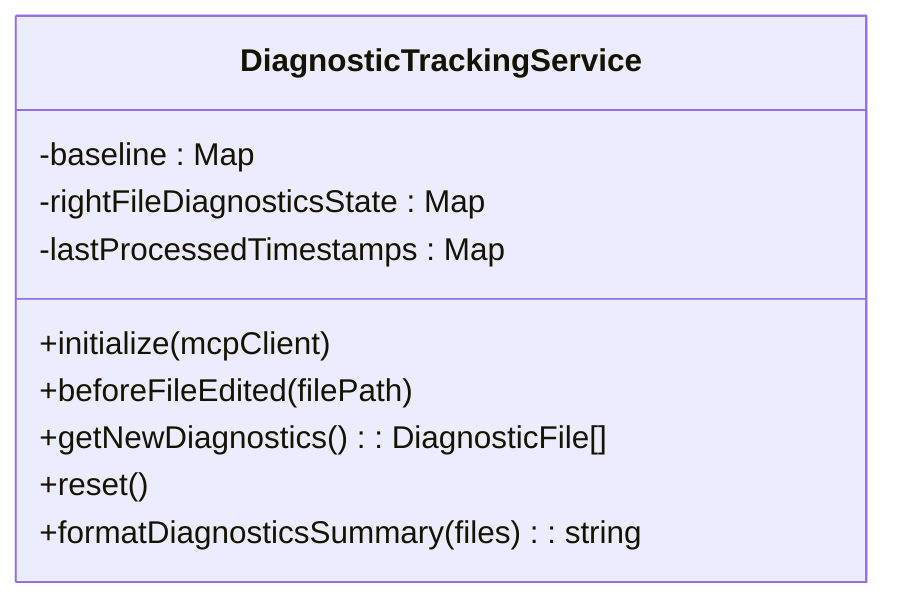

图表来源
- [src/services/diagnosticTracking.ts:30-76](file://src/services/diagnosticTracking.ts#L30-L76)
- [src/services/diagnosticTracking.ts:135-182](file://src/services/diagnosticTracking.ts#L135-L182)
- [src/services/diagnosticTracking.ts:188-283](file://src/services/diagnosticTracking.ts#L188-L283)
- [src/services/diagnosticTracking.ts:330-343](file://src/services/diagnosticTracking.ts#L330-L343)

章节来源
- [src/services/diagnosticTracking.ts:30-76](file://src/services/diagnosticTracking.ts#L30-L76)
- [src/services/diagnosticTracking.ts:135-182](file://src/services/diagnosticTracking.ts#L135-L182)
- [src/services/diagnosticTracking.ts:188-283](file://src/services/diagnosticTracking.ts#L188-L283)
- [src/services/diagnosticTracking.ts:330-343](file://src/services/diagnosticTracking.ts#L330-L343)

### 桥接层调试辅助
- 敏感信息脱敏：对 session_ingress_token、environment_secret、access_token、secret、token 等字段进行红黑名单替换
- 截断与 JSON 化：对长消息进行折叠与 JSON 序列化，避免破坏 JSONL 格式
- 错误详情提取：从 axios 响应体提取 message 或 error.message
- 分析事件上报：集中上报桥接跳过原因，减少重复样板代码

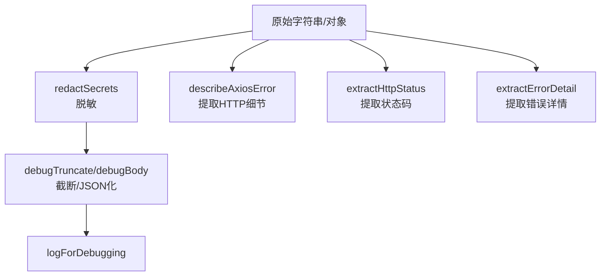

图表来源
- [src/bridge/debugUtils.ts:26-53](file://src/bridge/debugUtils.ts#L26-L53)
- [src/bridge/debugUtils.ts:60-121](file://src/bridge/debugUtils.ts#L60-L121)
- [src/bridge/debugUtils.ts:128-141](file://src/bridge/debugUtils.ts#L128-L141)

章节来源
- [src/bridge/debugUtils.ts:26-53](file://src/bridge/debugUtils.ts#L26-L53)
- [src/bridge/debugUtils.ts:60-121](file://src/bridge/debugUtils.ts#L60-L121)
- [src/bridge/debugUtils.ts:128-141](file://src/bridge/debugUtils.ts#L128-L141)

### API 请求与响应记录
- 克隆响应体以保留流数据，解析 SSE 流为分块数组
- 异步写入到文件，便于后续分析与回放

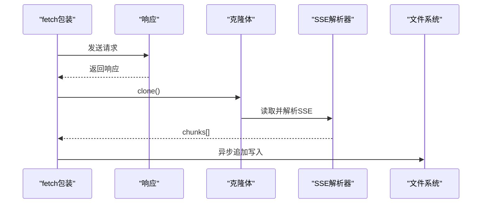

图表来源
- [src/services/api/dumpPrompts.ts:170-226](file://src/services/api/dumpPrompts.ts#L170-L226)

章节来源
- [src/services/api/dumpPrompts.ts:170-226](file://src/services/api/dumpPrompts.ts#L170-L226)

### REPL 中的 API 指标
- 多请求回合下计算 P50 TTFT 与 OTPS，结合流式长度与采样时间，汇总到消息中

章节来源
- [src/screens/REPL.tsx:2816-2839](file://src/screens/REPL.tsx#L2816-L2839)

## 依赖关系分析
- 松耦合设计
  - 日志系统通过统一入口 logForDebugging 与其他模块解耦
  - 过滤器独立于日志系统，仅依赖消息文本
  - 追踪与计时模块通过环境变量开关，避免生产开销
- 关键依赖链
  - src/utils/debug.ts → src/utils/debugFilter.ts（消息过滤）
  - src/utils/debug.ts → src/utils/telemetry/perfettoTracing.ts（性能追踪）
  - src/utils/debug.ts → src/utils/heapDumpService.ts（内存诊断）
  - src/utils/debug.ts → src/services/diagnosticTracking.ts（IDE 诊断）
  - src/utils/debug.ts → src/services/api/dumpPrompts.ts（API 记录）
  - src/bridge/debugUtils.ts 与 src/utils/debug.ts 协同进行敏感信息处理
  - src/main.tsx 与 src/ink/ink.tsx 影响调试模式与控制台输出行为

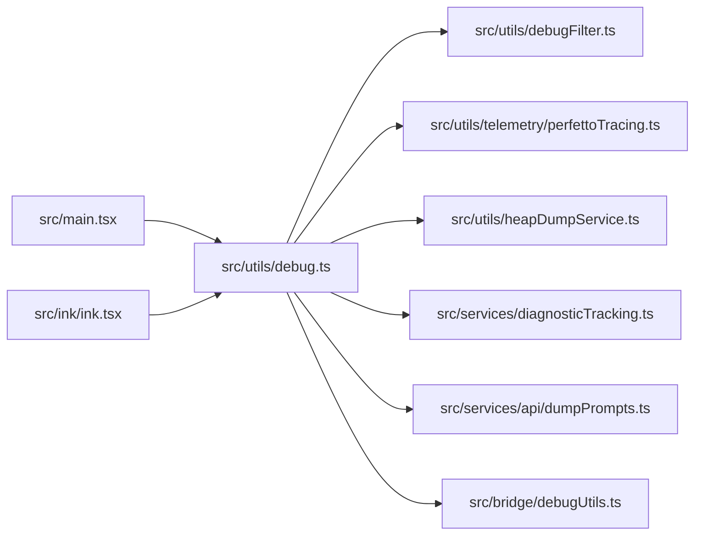

图表来源
- [src/utils/debug.ts:104-125](file://src/utils/debug.ts#L104-L125)
- [src/utils/debugFilter.ts:16-53](file://src/utils/debugFilter.ts#L16-L53)
- [src/utils/telemetry/perfettoTracing.ts:253-335](file://src/utils/telemetry/perfettoTracing.ts#L253-L335)
- [src/utils/heapDumpService.ts:221-278](file://src/utils/heapDumpService.ts#L221-L278)
- [src/services/diagnosticTracking.ts:30-76](file://src/services/diagnosticTracking.ts#L30-L76)
- [src/bridge/debugUtils.ts:26-53](file://src/bridge/debugUtils.ts#L26-L53)
- [src/main.tsx:231-250](file://src/main.tsx#L231-L250)
- [src/ink/ink.tsx:1570-1583](file://src/ink/ink.tsx#L1570-L1583)

章节来源
- [src/utils/debug.ts:104-125](file://src/utils/debug.ts#L104-L125)
- [src/utils/debugFilter.ts:16-53](file://src/utils/debugFilter.ts#L16-L53)
- [src/utils/telemetry/perfettoTracing.ts:253-335](file://src/utils/telemetry/perfettoTracing.ts#L253-L335)
- [src/utils/heapDumpService.ts:221-278](file://src/utils/heapDumpService.ts#L221-L278)
- [src/services/diagnosticTracking.ts:30-76](file://src/services/diagnosticTracking.ts#L30-L76)
- [src/bridge/debugUtils.ts:26-53](file://src/bridge/debugUtils.ts#L26-L53)
- [src/main.tsx:231-250](file://src/main.tsx#L231-L250)
- [src/ink/ink.tsx:1570-1583](file://src/ink/ink.tsx#L1570-L1583)

## 性能考量
- 调试日志缓冲与延迟写入：非调试模式下采用 1 秒刷新的缓冲写入，降低 I/O 压力
- Perfetto 事件上限与过期清理：避免长时间会话导致内存膨胀
- 堆转储顺序优化：先写诊断后写堆快照，防止大堆序列化崩溃
- 查询计时仅在启用时记录，避免生产性能开销
- 控制台重定向到调试日志，避免 stderr 阻塞与丢失

## 故障排除指南
- 调试日志未输出
  - 检查是否满足调试模式条件（环境变量/命令行/运行时标志）
  - 确认最小日志级别与过滤器设置
  - 查看输出路径与权限
- 过滤器无效
  - 排他与包含混用会被视为无过滤
  - 未分类消息在两种模式下都会被过滤
- Perfetto 未生成文件
  - 确认构建为 Ant 版本（外部构建禁用）
  - 检查环境变量与写入间隔设置
- 堆转储失败
  - 检查磁盘空间与权限
  - 大堆可能导致序列化崩溃，先确保诊断 JSON 成功写入
- API 响应未记录
  - 确认 USER_TYPE 为 ant 且响应体可克隆
  - 检查 SSE 流解析与文件写入权限

章节来源
- [src/utils/debug.ts:104-125](file://src/utils/debug.ts#L104-L125)
- [src/utils/debugFilter.ts:32-42](file://src/utils/debugFilter.ts#L32-L42)
- [src/utils/telemetry/perfettoTracing.ts:259-266](file://src/utils/telemetry/perfettoTracing.ts#L259-L266)
- [src/utils/heapDumpService.ts:249-257](file://src/utils/heapDumpService.ts#L249-L257)
- [src/services/api/dumpPrompts.ts:170-226](file://src/services/api/dumpPrompts.ts#L170-L226)

## 结论
该调试与诊断体系以“可选启用、低侵入、可扩展”为核心设计原则，通过统一的日志入口与过滤机制，配合性能追踪、内存诊断、API 记录与 IDE 诊断，形成完整的端到端问题定位闭环。建议在复现问题时优先启用调试日志与过滤器，结合 Perfetto 与查询计时报告，再辅以堆转储与 API 记录进行根因分析。

## 附录
- 常用命令与环境变量
  - 启用调试：--debug 或 --debug=category,!exclude
  - 输出到 stderr：--debug-to-stderr
  - 指定日志文件：--debug-file=path
  - 设置最小日志级别：CLAUDE_CODE_DEBUG_LOG_LEVEL=verbose/debug/info/warn/error
  - 启用 Perfetto：CLAUDE_CODE_PERFETTO_TRACE=1 或指定路径；可选 CLAUDE_CODE_PERFETTO_WRITE_INTERVAL_S
  - 启用查询计时：CLAUDE_CODE_PROFILE_QUERY=1
  - 堆转储触发：/heapdump
- 最佳实践
  - 问题复现阶段仅启用必要模块，避免过度 I/O
  - 使用过滤器聚焦问题域，减少噪声
  - 将诊断文件与堆快照打包上传，附带会话 ID 与时间戳
  - 对外发布前确保敏感信息已脱敏