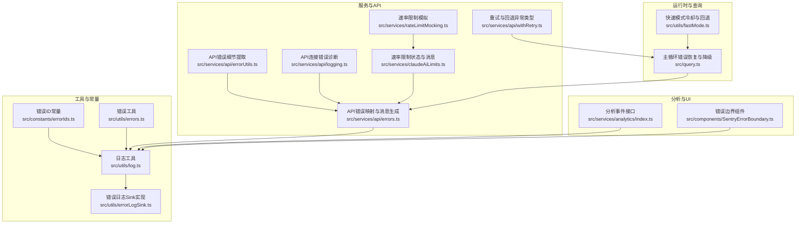
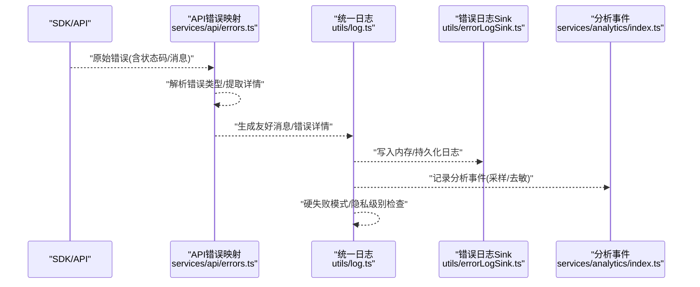
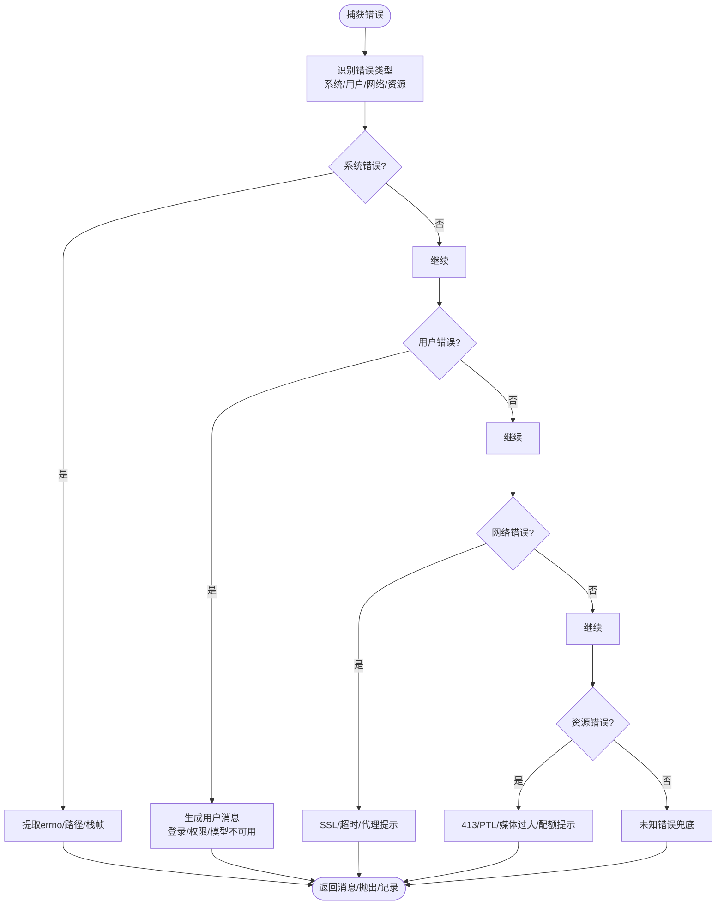
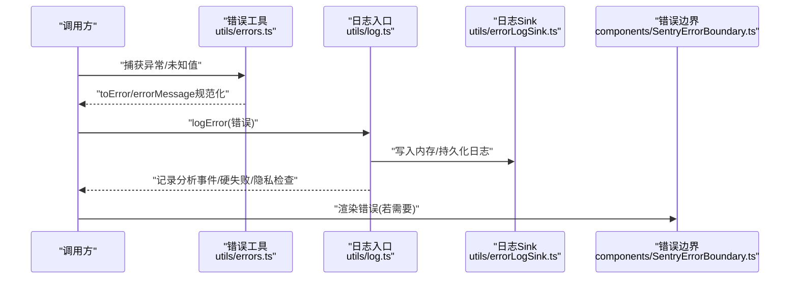
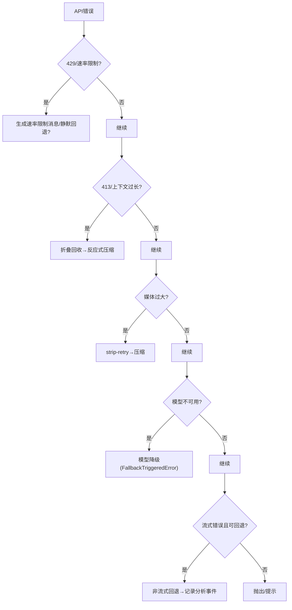
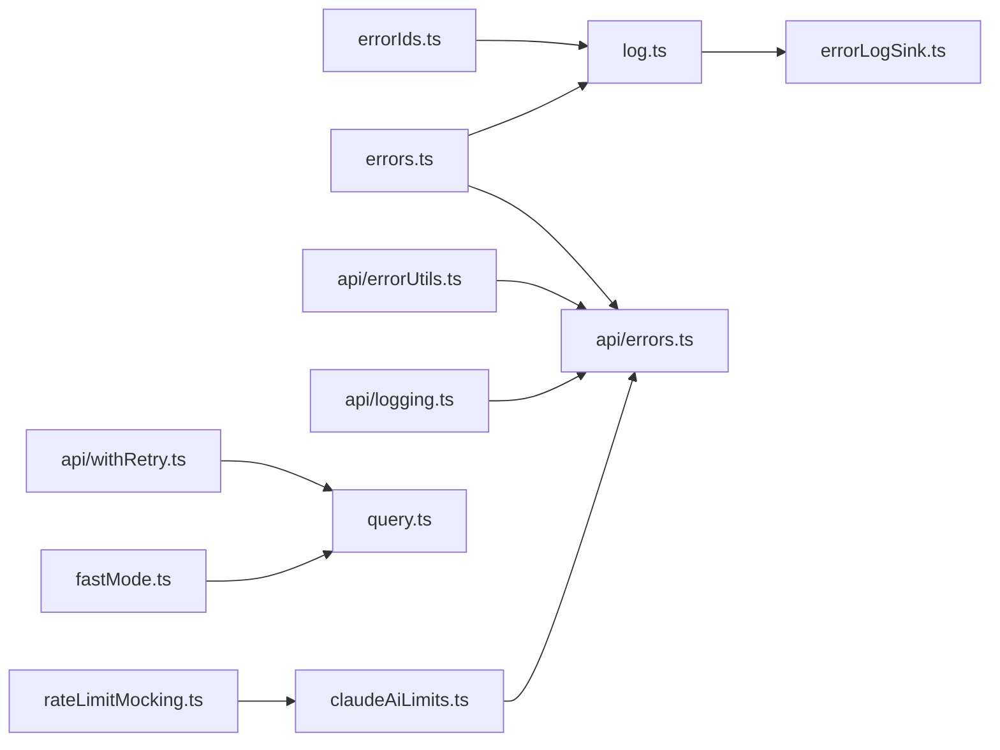

# 错误分类与处理

<cite>
**本文引用的文件**   
- [src/constants/errorIds.ts](file://src/constants/errorIds.ts)
- [src/utils/errors.ts](file://src/utils/errors.ts)
- [src/utils/log.ts](file://src/utils/log.ts)
- [src/utils/errorLogSink.ts](file://src/utils/errorLogSink.ts)
- [src/services/api/errors.ts](file://src/services/api/errors.ts)
- [src/services/api/errorUtils.ts](file://src/services/api/errorUtils.ts)
- [src/services/api/logging.ts](file://src/services/api/logging.ts)
- [src/services/api/withRetry.ts](file://src/services/api/withRetry.ts)
- [src/services/rateLimitMocking.ts](file://src/services/rateLimitMocking.ts)
- [src/services/claudeAiLimits.ts](file://src/services/claudeAiLimits.ts)
- [src/components/SentryErrorBoundary.ts](file://src/components/SentryErrorBoundary.ts)
- [src/query.ts](file://src/query.ts)
- [src/utils/fastMode.ts](file://src/utils/fastMode.ts)
- [src/services/analytics/index.ts](file://src/services/analytics/index.ts)
</cite>

## 目录
1. [简介](#简介)
2. [项目结构](#项目结构)
3. [核心组件](#核心组件)
4. [架构总览](#架构总览)
5. [详细组件分析](#详细组件分析)
6. [依赖关系分析](#依赖关系分析)
7. [性能考量](#性能考量)
8. [故障排查指南](#故障排查指南)
9. [结论](#结论)
10. [附录](#附录)

## 简介
本文件系统化梳理 Claude Code 的错误分类与处理体系，覆盖以下主题：
- 错误分类理念：系统错误、用户错误、网络错误、资源错误的定义与边界
- 错误 ID 管理：稳定且可追踪的错误标识符设计
- 错误消息与国际化：消息生成、显示与本地化策略
- 错误状态码映射：API 错误到 UI 友好消息的映射规则
- 错误捕获与传播：同步/异步、Promise/流式场景下的捕获与传播
- 错误恢复策略：超时、429、413、媒体过大等的自动恢复路径
- 降级与回退：模型降级、非流式回退、快速模式冷却
- 用户提示与可观测性：调试日志、内存日志、持久化错误日志、分析事件
- 统计与报告：错误趋势、错误聚合与报告生成建议

## 项目结构
围绕错误处理的关键模块分布如下：
- 常量与工具层：错误 ID、通用错误转换与诊断工具
- 日志与分析层：统一错误日志入口、持久化写入、分析事件
- API 层：API 错误解析、消息生成、重试与回退逻辑
- 运行时与查询层：主循环中的错误恢复与降级
- UI 层：错误边界组件

**图表来源**
- [src/constants/errorIds.ts:1-16](file://src/constants/errorIds.ts#L1-L16)
- [src/utils/errors.ts:103-171](file://src/utils/errors.ts#L103-L171)
- [src/utils/log.ts:158-203](file://src/utils/log.ts#L158-L203)
- [src/utils/errorLogSink.ts:225-236](file://src/utils/errorLogSink.ts#L225-L236)
- [src/services/api/errors.ts:425-800](file://src/services/api/errors.ts#L425-L800)
- [src/services/api/logging.ts:284-301](file://src/services/api/logging.ts#L284-L301)
- [src/services/api/errorUtils.ts:204-235](file://src/services/api/errorUtils.ts#L204-L235)
- [src/services/api/withRetry.ts:144-168](file://src/services/api/withRetry.ts#L144-L168)
- [src/services/rateLimitMocking.ts:50-144](file://src/services/rateLimitMocking.ts#L50-L144)
- [src/services/claudeAiLimits.ts:495-515](file://src/services/claudeAiLimits.ts#L495-L515)
- [src/query.ts:608-1090](file://src/query.ts#L608-L1090)
- [src/utils/fastMode.ts:199-237](file://src/utils/fastMode.ts#L199-L237)
- [src/services/analytics/index.ts:133-164](file://src/services/analytics/index.ts#L133-L164)
- [src/components/SentryErrorBoundary.ts:11-28](file://src/components/SentryErrorBoundary.ts#L11-L28)

**章节来源**
- [src/constants/errorIds.ts:1-16](file://src/constants/errorIds.ts#L1-L16)
- [src/utils/errors.ts:103-171](file://src/utils/errors.ts#L103-L171)
- [src/utils/log.ts:158-203](file://src/utils/log.ts#L158-L203)
- [src/utils/errorLogSink.ts:225-236](file://src/utils/errorLogSink.ts#L225-L236)
- [src/services/api/errors.ts:425-800](file://src/services/api/errors.ts#L425-L800)
- [src/services/api/logging.ts:284-301](file://src/services/api/logging.ts#L284-L301)
- [src/services/api/errorUtils.ts:204-235](file://src/services/api/errorUtils.ts#L204-L235)
- [src/services/api/withRetry.ts:144-168](file://src/services/api/withRetry.ts#L144-L168)
- [src/services/rateLimitMocking.ts:50-144](file://src/services/rateLimitMocking.ts#L50-L144)
- [src/services/claudeAiLimits.ts:495-515](file://src/services/claudeAiLimits.ts#L495-L515)
- [src/query.ts:608-1090](file://src/query.ts#L608-L1090)
- [src/utils/fastMode.ts:199-237](file://src/utils/fastMode.ts#L199-L237)
- [src/services/analytics/index.ts:133-164](file://src/services/analytics/index.ts#L133-L164)
- [src/components/SentryErrorBoundary.ts:11-28](file://src/components/SentryErrorBoundary.ts#L11-L28)

## 核心组件
- 错误 ID 管理：通过常量导出提供稳定、可追踪的错误标识符，便于在生产环境定位具体调用点。
- 错误工具集：提供 toError、errorMessage、getErrnoCode、isENOENT、shortErrorStack 等，统一错误对象与信息提取。
- 统一日志入口：logError 将错误写入内存日志、队列或持久化日志，并支持硬失败模式与隐私级别控制。
- 错误日志 Sink：延迟初始化，确保在应用启动前记录的错误不会丢失；支持 MCP 错误与调试日志。
- API 错误映射：将 SDK/API 返回的错误映射为 UI 友好消息，处理 429、413、图像/PDF 大小限制、并发错误等。
- 重试与回退：定义 CannotRetryError、FallbackTriggeredError 等异常类型，支撑流式回退、模型降级与快速模式冷却。
- 主循环恢复：在查询主循环中实现 PTL 恢复、媒体大小恢复、阻塞错误注入与模型回退。
- 分析事件：统一事件接口，支持采样与元数据校验，用于错误趋势与行为分析。

**章节来源**
- [src/constants/errorIds.ts:1-16](file://src/constants/errorIds.ts#L1-L16)
- [src/utils/errors.ts:103-171](file://src/utils/errors.ts#L103-L171)
- [src/utils/log.ts:158-203](file://src/utils/log.ts#L158-L203)
- [src/utils/errorLogSink.ts:225-236](file://src/utils/errorLogSink.ts#L225-L236)
- [src/services/api/errors.ts:425-800](file://src/services/api/errors.ts#L425-L800)
- [src/services/api/withRetry.ts:144-168](file://src/services/api/withRetry.ts#L144-L168)
- [src/query.ts:608-1090](file://src/query.ts#L608-L1090)

## 架构总览
错误处理链路自底向上分为四层：
- 底层：SDK/API 返回原始错误，结合连接错误细节与速率限制头进行增强。
- 中层：错误映射与消息生成，将技术错误转化为用户可理解的提示。
- 上层：统一日志与分析，持久化错误、内存日志、分析事件与错误边界。
- 控制层：主循环与运行时策略，执行自动恢复、回退与降级。

**图表来源**
- [src/services/api/errors.ts:425-800](file://src/services/api/errors.ts#L425-L800)
- [src/utils/log.ts:158-203](file://src/utils/log.ts#L158-L203)
- [src/utils/errorLogSink.ts:152-174](file://src/utils/errorLogSink.ts#L152-L174)
- [src/services/analytics/index.ts:133-164](file://src/services/analytics/index.ts#L133-L164)

## 详细组件分析

### 错误分类体系
- 系统错误：底层系统异常（如 ENOENT、文件/目录不存在）、网络连接异常（超时、证书问题）、进程退出等。由连接错误细节提取与错误工具识别。
- 用户错误：输入参数无效、权限不足、认证失败、模型不可用等。由 API 错误映射生成用户可理解的消息。
- 网络错误：超时、SSL/TLS 证书问题、代理/防火墙拦截等。通过连接错误细节与 Axios 错误增强。
- 资源错误：请求过大、上下文过长、媒体文件过大、配额/速率限制等。通过 API 错误映射与速率限制状态生成提示。

**图表来源**
- [src/utils/errors.ts:103-171](file://src/utils/errors.ts#L103-L171)
- [src/services/api/errorUtils.ts:204-235](file://src/services/api/errorUtils.ts#L204-L235)
- [src/services/api/errors.ts:425-800](file://src/services/api/errors.ts#L425-L800)

**章节来源**
- [src/utils/errors.ts:103-171](file://src/utils/errors.ts#L103-L171)
- [src/services/api/errorUtils.ts:204-235](file://src/services/api/errorUtils.ts#L204-L235)
- [src/services/api/errors.ts:425-800](file://src/services/api/errors.ts#L425-L800)

### 错误 ID 管理机制
- 设计目标：稳定、可追踪、利于死代码消除；每个错误类型对应一个常量导出，便于外部构建只看到数字。
- 使用方式：在 logError 调用处使用错误 ID 常量，配合分析事件与错误日志定位来源。
- 扩展流程：新增类型时按“添加常量→递增 Next ID”的步骤维护。

**章节来源**
- [src/constants/errorIds.ts:1-16](file://src/constants/errorIds.ts#L1-L16)

### 错误消息国际化与本地化
- 消息生成：API 错误映射中针对不同错误类型生成用户可理解的消息，部分消息根据是否交互式会话调整提示。
- 本地化策略：当前代码未见集中式多语言字典；消息生成基于运行时条件（如非交互式/交互式）与格式化函数（如文件大小）。
- 建议：若需国际化，可在消息生成处引入本地化函数，将键值映射到不同语言的文案。

**章节来源**
- [src/services/api/errors.ts:150-210](file://src/services/api/errors.ts#L150-L210)
- [src/services/api/errors.ts:166-196](file://src/services/api/errors.ts#L166-L196)

### 错误状态码映射
- 429 速率限制：根据新旧速率限制头生成统一消息，必要时触发静默回退或显式错误。
- 413 请求过大：提示调整文件大小或使用压缩/分段策略。
- 400 并发/重复 tool_use：记录并引导用户回滚或重试。
- 400 模型不可用：提示切换模型或等待计划生效。
- SSL/TLS：根据错误码生成具体提示（证书过期、主机名不匹配等）。

**章节来源**
- [src/services/api/errors.ts:466-558](file://src/services/api/errors.ts#L466-L558)
- [src/services/api/errors.ts:558-664](file://src/services/api/errors.ts#L558-L664)
- [src/services/api/errors.ts:666-733](file://src/services/api/errors.ts#L666-L733)
- [src/services/api/errors.ts:735-770](file://src/services/api/errors.ts#L735-L770)
- [src/services/api/errorUtils.ts:204-235](file://src/services/api/errorUtils.ts#L204-L235)

### 错误捕获与传播流程
- 同步捕获：在工具/服务调用边界使用 toError 规范化错误，随后通过 logError 记录与传播。
- 异步与流式：API 层通过流式监听错误，必要时触发非流式回退或模型降级。
- Promise 错误：重试包装器与 withResolvers 提供可控的 Promise 解决/拒绝语义。
- 错误边界：React 错误边界用于 UI 层兜底渲染。

**图表来源**
- [src/utils/errors.ts:103-171](file://src/utils/errors.ts#L103-L171)
- [src/utils/log.ts:158-203](file://src/utils/log.ts#L158-L203)
- [src/utils/errorLogSink.ts:152-174](file://src/utils/errorLogSink.ts#L152-L174)
- [src/components/SentryErrorBoundary.ts:11-28](file://src/components/SentryErrorBoundary.ts#L11-L28)

**章节来源**
- [src/utils/errors.ts:103-171](file://src/utils/errors.ts#L103-L171)
- [src/utils/log.ts:158-203](file://src/utils/log.ts#L158-L203)
- [src/utils/errorLogSink.ts:152-174](file://src/utils/errorLogSink.ts#L152-L174)
- [src/components/SentryErrorBoundary.ts:11-28](file://src/components/SentryErrorBoundary.ts#L11-L28)

### 错误恢复策略与降级处理
- 超时与网络异常：通过连接错误细节生成明确提示，指导检查网络/代理。
- 429 速率限制：优先使用统一速率限制头生成消息；对于 Opus 限流且当前使用 Opus 时抛出 429；否则静默回退。
- 413 上下文过长：先尝试“折叠回收”（drain staged collapses），再尝试“反应式压缩”（strip-images/re-summarize）。
- 媒体过大：通过反应式压缩的 strip-retry 修复，避免无限循环。
- 模型降级：当主模型不可用时触发回退错误，切换到备用模型并重试。
- 非流式回退：流式错误且允许回退时，记录分析事件并切换到非流式模式。
- 快速模式冷却：触发冷却并记录分析事件，避免频繁快速模式导致的不稳定。

**图表来源**
- [src/services/api/errors.ts:466-558](file://src/services/api/errors.ts#L466-L558)
- [src/services/api/errors.ts:558-664](file://src/services/api/errors.ts#L558-L664)
- [src/services/api/errors.ts:666-733](file://src/services/api/errors.ts#L666-L733)
- [src/services/api/withRetry.ts:144-168](file://src/services/api/withRetry.ts#L144-L168)
- [src/query.ts:608-1090](file://src/query.ts#L608-L1090)
- [src/utils/fastMode.ts:199-237](file://src/utils/fastMode.ts#L199-L237)

**章节来源**
- [src/services/api/errors.ts:466-558](file://src/services/api/errors.ts#L466-L558)
- [src/services/api/errors.ts:558-664](file://src/services/api/errors.ts#L558-L664)
- [src/services/api/errors.ts:666-733](file://src/services/api/errors.ts#L666-L733)
- [src/services/api/withRetry.ts:144-168](file://src/services/api/withRetry.ts#L144-L168)
- [src/query.ts:608-1090](file://src/query.ts#L608-L1090)
- [src/utils/fastMode.ts:199-237](file://src/utils/fastMode.ts#L199-L237)

### 用户友好的错误提示机制
- 统一消息生成：API 错误映射将技术错误转为用户可读提示，避免泄露内部实现细节。
- 条件化提示：根据是否交互式会话、是否 Ant 用户、是否启用特定功能动态调整消息内容。
- 诊断信息：在调试日志中输出连接错误详情（如 SSL 错误码、超时原因），辅助用户自助排查。

**章节来源**
- [src/services/api/errors.ts:150-210](file://src/services/api/errors.ts#L150-L210)
- [src/services/api/errors.ts:166-196](file://src/services/api/errors.ts#L166-L196)
- [src/services/api/logging.ts:284-301](file://src/services/api/logging.ts#L284-L301)
- [src/services/api/errorUtils.ts:204-235](file://src/services/api/errorUtils.ts#L204-L235)

### 错误统计分析、趋势监控与报告生成
- 内存日志：最近若干条错误保存在内存中，便于快速诊断与报告收集。
- 持久化日志：按日期分片写入 JSONL 文件，支持加载与排序，便于离线分析。
- 分析事件：通过统一接口记录错误相关事件，支持采样与元数据去敏，便于趋势分析。
- 报告生成建议：结合内存日志与持久化日志，按时间窗口聚合错误类型与来源，生成趋势图与热力图。

**章节来源**
- [src/utils/log.ts:64-77](file://src/utils/log.ts#L64-L77)
- [src/utils/log.ts:209-283](file://src/utils/log.ts#L209-L283)
- [src/utils/errorLogSink.ts:111-126](file://src/utils/errorLogSink.ts#L111-L126)
- [src/services/analytics/index.ts:133-164](file://src/services/analytics/index.ts#L133-L164)

## 依赖关系分析
- 错误 ID 与工具：错误 ID 常量被日志入口引用，错误工具为日志与 API 映射提供基础能力。
- 日志与 Sink：日志入口负责调度，Sink 实现负责持久化；二者通过接口解耦。
- API 映射：依赖错误工具与连接错误细节提取，生成用户消息并驱动主循环恢复。
- 主循环与运行时：主循环根据 API 错误类型选择恢复策略，快速模式冷却作为运行时降级手段。

**图表来源**
- [src/constants/errorIds.ts:1-16](file://src/constants/errorIds.ts#L1-L16)
- [src/utils/errors.ts:103-171](file://src/utils/errors.ts#L103-L171)
- [src/utils/log.ts:158-203](file://src/utils/log.ts#L158-L203)
- [src/utils/errorLogSink.ts:225-236](file://src/utils/errorLogSink.ts#L225-L236)
- [src/services/api/errors.ts:425-800](file://src/services/api/errors.ts#L425-L800)
- [src/services/api/errorUtils.ts:204-235](file://src/services/api/errorUtils.ts#L204-L235)
- [src/services/api/logging.ts:284-301](file://src/services/api/logging.ts#L284-L301)
- [src/services/api/withRetry.ts:144-168](file://src/services/api/withRetry.ts#L144-L168)
- [src/services/claudeAiLimits.ts:495-515](file://src/services/claudeAiLimits.ts#L495-L515)
- [src/services/rateLimitMocking.ts:50-144](file://src/services/rateLimitMocking.ts#L50-L144)
- [src/query.ts:608-1090](file://src/query.ts#L608-L1090)
- [src/utils/fastMode.ts:199-237](file://src/utils/fastMode.ts#L199-L237)

**章节来源**
- [src/constants/errorIds.ts:1-16](file://src/constants/errorIds.ts#L1-L16)
- [src/utils/errors.ts:103-171](file://src/utils/errors.ts#L103-L171)
- [src/utils/log.ts:158-203](file://src/utils/log.ts#L158-L203)
- [src/utils/errorLogSink.ts:225-236](file://src/utils/errorLogSink.ts#L225-L236)
- [src/services/api/errors.ts:425-800](file://src/services/api/errors.ts#L425-L800)
- [src/services/api/errorUtils.ts:204-235](file://src/services/api/errorUtils.ts#L204-L235)
- [src/services/api/logging.ts:284-301](file://src/services/api/logging.ts#L284-L301)
- [src/services/api/withRetry.ts:144-168](file://src/services/api/withRetry.ts#L144-L168)
- [src/services/claudeAiLimits.ts:495-515](file://src/services/claudeAiLimits.ts#L495-L515)
- [src/services/rateLimitMocking.ts:50-144](file://src/services/rateLimitMocking.ts#L50-L144)
- [src/query.ts:608-1090](file://src/query.ts#L608-L1090)
- [src/utils/fastMode.ts:199-237](file://src/utils/fastMode.ts#L199-L237)

## 性能考量
- 错误日志写入采用缓冲与延迟初始化，避免阻塞启动路径。
- 内存日志容量上限控制，防止长期运行占用过多内存。
- 分析事件支持采样，降低高流量场景下的开销。
- 流式回退与模型降级在错误发生时快速止损，减少无效重试成本。

[本节为通用性能讨论，无需特定文件分析]

## 故障排查指南
- 查看调试日志：使用调试开关查看连接错误详情与请求上下文。
- 检查内存日志：获取最近错误列表，辅助快速定位。
- 加载持久化错误日志：按日期排序查看历史错误，定位趋势。
- 分析事件：确认错误事件是否被正确记录与采样。
- 错误边界：确认 UI 层错误边界是否正确兜底，避免崩溃。

**章节来源**
- [src/utils/log.ts:158-203](file://src/utils/log.ts#L158-L203)
- [src/utils/log.ts:209-283](file://src/utils/log.ts#L209-L283)
- [src/utils/errorLogSink.ts:111-126](file://src/utils/errorLogSink.ts#L111-L126)
- [src/services/analytics/index.ts:133-164](file://src/services/analytics/index.ts#L133-L164)
- [src/components/SentryErrorBoundary.ts:11-28](file://src/components/SentryErrorBoundary.ts#L11-L28)

## 结论
Claude Code 的错误处理体系以“可追踪、可恢复、可降级”为核心目标，通过稳定的错误 ID、统一的日志入口、完善的 API 错误映射与主循环恢复策略，实现了从底层系统到用户界面的全链路可观测与可控恢复。建议在现有基础上进一步完善国际化与错误报告自动化，以提升跨地域与跨团队协作效率。

[本节为总结性内容，无需特定文件分析]

## 附录
- 最佳实践
  - 在错误捕获边界使用 toError 规范化错误，避免分支散落的类型判断。
  - 对于网络/SSL 错误，优先使用连接错误细节提取函数生成用户提示。
  - 对于 429/413 等可恢复错误，尽量采用自动恢复而非直接抛出。
  - 对于模型不可用与快速模式场景，使用统一的回退与冷却机制。
  - 使用错误 ID 常量与分析事件，确保错误来源可追踪。
  - 保持内存日志容量上限与持久化日志轮转策略，平衡可观测性与性能。

[本节为通用建议，无需特定文件分析]