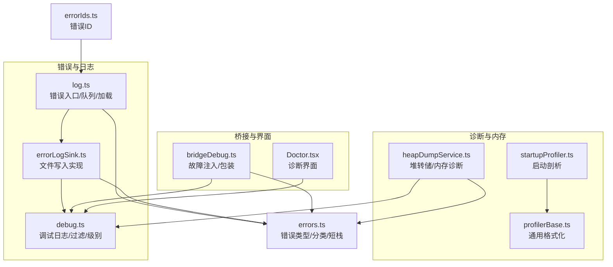
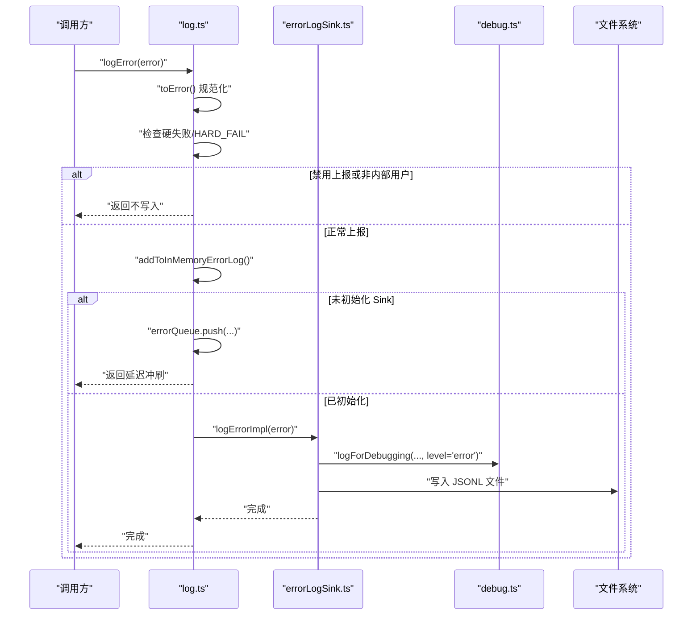
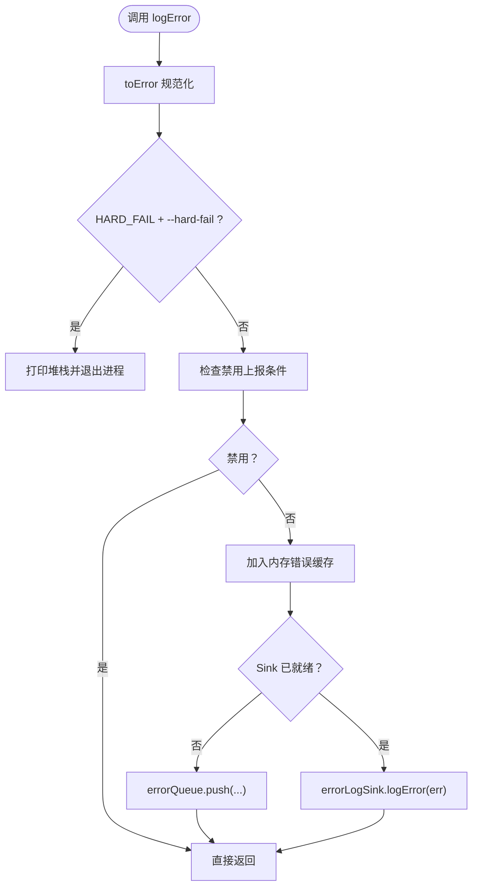
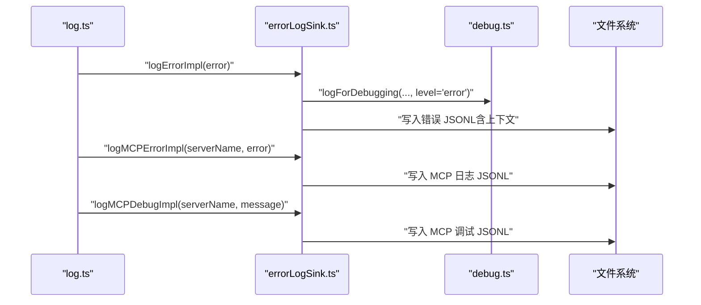
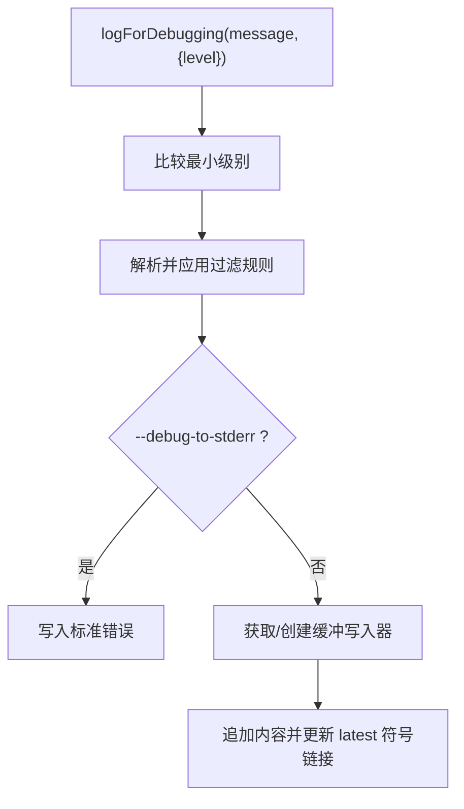
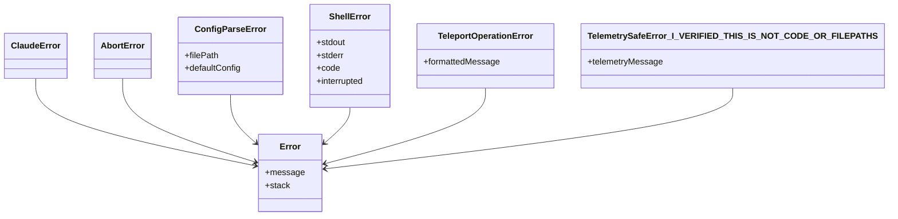
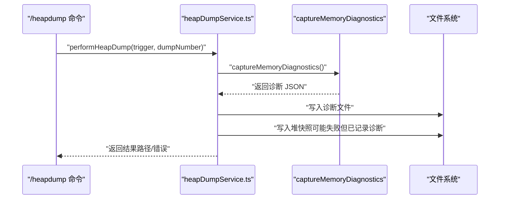
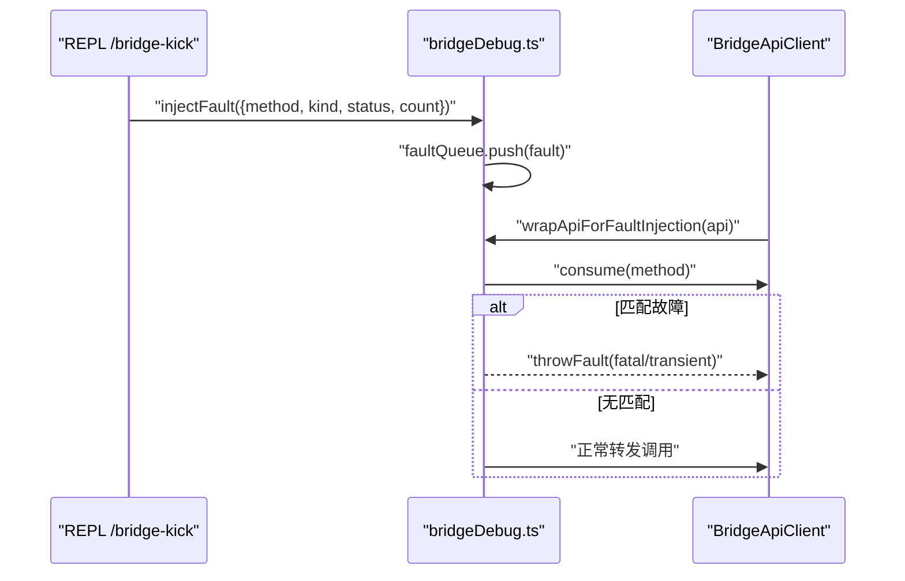
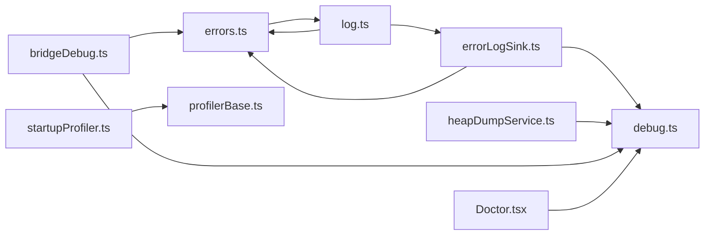

# 错误处理与诊断

<cite>
**本文引用的文件**
- [src/utils/log.ts](file://src/utils/log.ts)
- [src/utils/errorLogSink.ts](file://src/utils/errorLogSink.ts)
- [src/utils/debug.ts](file://src/utils/debug.ts)
- [src/utils/errors.ts](file://src/utils/errors.ts)
- [src/utils/heapDumpService.ts](file://src/utils/heapDumpService.ts)
- [src/bridge/bridgeDebug.ts](file://src/bridge/bridgeDebug.ts)
- [src/screens/Doctor.tsx](file://src/screens/Doctor.tsx)
- [src/commands/heapdump/heapdump.ts](file://src/commands/heapdump/heapdump.ts)
- [src/utils/startupProfiler.ts](file://src/utils/startupProfiler.ts)
- [src/utils/profilerBase.ts](file://src/utils/profilerBase.ts)
- [src/constants/errorIds.ts](file://src/constants/errorIds.ts)
</cite>

## 目录
1. [简介](#简介)
2. [项目结构](#项目结构)
3. [核心组件](#核心组件)
4. [架构总览](#架构总览)
5. [详细组件分析](#详细组件分析)
6. [依赖关系分析](#依赖关系分析)
7. [性能考量](#性能考量)
8. [故障排除指南](#故障排除指南)
9. [结论](#结论)
10. [附录](#附录)

## 简介
本文件面向 Claude Code 的错误处理与诊断系统，系统性阐述错误分类、异常捕获、错误传播、诊断工具链、堆栈与上下文采集、日志系统与轮转、调试与剖析能力、错误报告与崩溃分析、以及预防与容错策略。目标是帮助开发者与支持工程师快速定位问题、生成可复现的诊断材料，并在生产环境中实现稳健的可观测性。

## 项目结构
围绕错误与诊断的关键模块分布如下：
- 日志与错误上报：log.ts（事件入口）、errorLogSink.ts（持久化实现）
- 调试输出：debug.ts（调试日志、过滤、级别控制）
- 错误类型与工具：errors.ts（自定义错误、分类、短栈）
- 诊断与内存快照：heapDumpService.ts（堆转储与内存诊断）
- 故障注入与桥接诊断：bridgeDebug.ts（桥接层故障注入与包装）
- 诊断界面：Doctor.tsx（安装、环境、权限等诊断汇总）
- 剖析工具：startupProfiler.ts、profilerBase.ts（启动阶段性能剖析）
- 错误标识：errorIds.ts（错误来源追踪）

图表来源
- [src/utils/log.ts:109-134](file://src/utils/log.ts#L109-L134)
- [src/utils/errorLogSink.ts:225-235](file://src/utils/errorLogSink.ts#L225-L235)
- [src/utils/debug.ts:155-196](file://src/utils/debug.ts#L155-L196)
- [src/utils/heapDumpService.ts:221-278](file://src/utils/heapDumpService.ts#L221-L278)
- [src/utils/startupProfiler.ts:68-128](file://src/utils/startupProfiler.ts#L68-L128)
- [src/utils/profilerBase.ts:14-46](file://src/utils/profilerBase.ts#L14-L46)
- [src/bridge/bridgeDebug.ts:84-135](file://src/bridge/bridgeDebug.ts#L84-L135)
- [src/screens/Doctor.tsx:100-501](file://src/screens/Doctor.tsx#L100-L501)
- [src/utils/errors.ts:111-171](file://src/utils/errors.ts#L111-L171)
- [src/constants/errorIds.ts:1-16](file://src/constants/errorIds.ts#L1-L16)

章节来源
- [src/utils/log.ts:109-134](file://src/utils/log.ts#L109-L134)
- [src/utils/errorLogSink.ts:225-235](file://src/utils/errorLogSink.ts#L225-L235)
- [src/utils/debug.ts:155-196](file://src/utils/debug.ts#L155-L196)
- [src/utils/heapDumpService.ts:221-278](file://src/utils/heapDumpService.ts#L221-L278)
- [src/utils/startupProfiler.ts:68-128](file://src/utils/startupProfiler.ts#L68-L128)
- [src/utils/profilerBase.ts:14-46](file://src/utils/profilerBase.ts#L14-L46)
- [src/bridge/bridgeDebug.ts:84-135](file://src/bridge/bridgeDebug.ts#L84-L135)
- [src/screens/Doctor.tsx:100-501](file://src/screens/Doctor.tsx#L100-L501)
- [src/utils/errors.ts:111-171](file://src/utils/errors.ts#L111-L171)
- [src/constants/errorIds.ts:1-16](file://src/constants/errorIds.ts#L1-L16)

## 核心组件
- 错误入口与队列：log.ts 提供统一的错误入口，支持硬失败模式、禁用上报判断、内存内错误缓存、事件队列与延迟冲刷。
- 错误日志后端：errorLogSink.ts 实现文件写入、JSONL 格式、按会话与日期分片、MCP 专用日志。
- 调试日志：debug.ts 支持级别过滤、命令行开关、标准错误输出、符号链接指向最新日志。
- 错误类型与分类：errors.ts 定义常用错误类、中止类识别、文件系统错误判定、Axios 错误分类、短栈提取。
- 堆转储与内存诊断：heapDumpService.ts 捕获内存指标、V8 统计、句柄/请求计数、平台特定信息并生成诊断与堆快照。
- 故障注入：bridgeDebug.ts 在桥接层注入一次性故障，区分致命与瞬时，辅助测试恢复路径。
- 诊断界面：Doctor.tsx 汇总安装、更新、沙箱、MCP、键位、环境变量、版本锁等诊断信息。
- 剖析：startupProfiler.ts 使用 perf_hooks 记录关键节点，profilerBase.ts 提供统一格式化。
- 错误标识：errorIds.ts 为生产追踪提供稳定错误 ID。

章节来源
- [src/utils/log.ts:158-203](file://src/utils/log.ts#L158-L203)
- [src/utils/errorLogSink.ts:152-174](file://src/utils/errorLogSink.ts#L152-L174)
- [src/utils/debug.ts:203-228](file://src/utils/debug.ts#L203-L228)
- [src/utils/errors.ts:111-171](file://src/utils/errors.ts#L111-L171)
- [src/utils/heapDumpService.ts:88-212](file://src/utils/heapDumpService.ts#L88-L212)
- [src/bridge/bridgeDebug.ts:84-135](file://src/bridge/bridgeDebug.ts#L84-L135)
- [src/screens/Doctor.tsx:100-501](file://src/screens/Doctor.tsx#L100-L501)
- [src/utils/startupProfiler.ts:68-128](file://src/utils/startupProfiler.ts#L68-L128)
- [src/utils/profilerBase.ts:33-46](file://src/utils/profilerBase.ts#L33-L46)
- [src/constants/errorIds.ts:1-16](file://src/constants/errorIds.ts#L1-L16)

## 架构总览
错误与诊断的端到端流程如下：

图表来源
- [src/utils/log.ts:158-199](file://src/utils/log.ts#L158-L199)
- [src/utils/errorLogSink.ts:152-174](file://src/utils/errorLogSink.ts#L152-L174)
- [src/utils/debug.ts:203-228](file://src/utils/debug.ts#L203-L228)

章节来源
- [src/utils/log.ts:158-199](file://src/utils/log.ts#L158-L199)
- [src/utils/errorLogSink.ts:152-174](file://src/utils/errorLogSink.ts#L152-L174)
- [src/utils/debug.ts:203-228](file://src/utils/debug.ts#L203-L228)

## 详细组件分析

### 错误入口与传播（log.ts）
- 入口函数：logError 将任意值规范化为 Error，支持硬失败模式（--hard-fail），在特定云提供商与隐私模式下禁用上报。
- 内存缓存：最近 100 条错误保存在内存，便于报告与展示。
- 队列机制：在 Sink 未就绪前，事件进入队列；Sink 就绪后立即冲刷。
- MCP 专用：logMCPError/logMCPDebug 分别写入 MCP 日志文件，包含会话与工作目录上下文。
- 日志加载：loadErrorLogs/getErrorLogByIndex 支持按日期排序列出与读取错误日志。

图表来源
- [src/utils/log.ts:158-199](file://src/utils/log.ts#L158-L199)

章节来源
- [src/utils/log.ts:64-77](file://src/utils/log.ts#L64-L77)
- [src/utils/log.ts:109-134](file://src/utils/log.ts#L109-L134)
- [src/utils/log.ts:158-203](file://src/utils/log.ts#L158-L203)
- [src/utils/log.ts:300-326](file://src/utils/log.ts#L300-L326)
- [src/utils/log.ts:209-223](file://src/utils/log.ts#L209-L223)

### 错误日志后端（errorLogSink.ts）
- 初始化：initializeErrorLogSink 将实现 attachErrorLogSink，确保事件不丢失。
- 错误写入：logErrorImpl 对 Axios 错误增强上下文（URL、状态、服务器消息），写入 JSONL 并带时间戳、会话、工作目录、用户类型、版本。
- MCP 日志：logMCPErrorImpl/logMCPDebugImpl 为每个 MCP 服务单独文件，便于隔离排查。
- 写入器：基于缓冲写入器，自动创建目录并异步刷新，支持清理注册。

图表来源
- [src/utils/errorLogSink.ts:152-174](file://src/utils/errorLogSink.ts#L152-L174)
- [src/utils/errorLogSink.ts:179-195](file://src/utils/errorLogSink.ts#L179-L195)
- [src/utils/errorLogSink.ts:200-213](file://src/utils/errorLogSink.ts#L200-L213)
- [src/utils/errorLogSink.ts:225-235](file://src/utils/errorLogSink.ts#L225-L235)

章节来源
- [src/utils/errorLogSink.ts:29-38](file://src/utils/errorLogSink.ts#L29-L38)
- [src/utils/errorLogSink.ts:152-174](file://src/utils/errorLogSink.ts#L152-L174)
- [src/utils/errorLogSink.ts:179-213](file://src/utils/errorLogSink.ts#L179-L213)
- [src/utils/errorLogSink.ts:225-235](file://src/utils/errorLogSink.ts#L225-L235)

### 调试日志与过滤（debug.ts）
- 开关与级别：支持 --debug/-d、--debug-to-stderr、--debug-file、CLAUDE_CODE_DEBUG_LOG_LEVEL 等。
- 过滤：parseDebugFilter 支持包含/排除模式，避免高噪声输出。
- 输出：支持标准错误直出与文件写入，维护“latest”符号链接指向当前日志。
- 缓冲：非调试模式采用异步缓冲写入，调试模式同步写入以保证崩溃时数据不丢失。

图表来源
- [src/utils/debug.ts:203-228](file://src/utils/debug.ts#L203-L228)
- [src/utils/debug.ts:155-196](file://src/utils/debug.ts#L155-L196)

章节来源
- [src/utils/debug.ts:18-40](file://src/utils/debug.ts#L18-L40)
- [src/utils/debug.ts:71-83](file://src/utils/debug.ts#L71-L83)
- [src/utils/debug.ts:203-228](file://src/utils/debug.ts#L203-L228)
- [src/utils/debug.ts:230-253](file://src/utils/debug.ts#L230-L253)

### 错误类型与分类（errors.ts）
- 自定义错误：AbortError、ConfigParseError、ShellError、TeleportOperationError、TelemetrySafeError 等。
- 判定工具：isAbortError、isFsInaccessible、getErrnoCode/getErrnoPath。
- Axios 分类：classifyAxiosError 将错误归类为 auth/timeout/network/http/other。
- 短栈：shortErrorStack 截断堆栈帧，减少模型上下文占用。

图表来源
- [src/utils/errors.ts:3-101](file://src/utils/errors.ts#L3-L101)

章节来源
- [src/utils/errors.ts:111-171](file://src/utils/errors.ts#L111-L171)
- [src/utils/errors.ts:204-239](file://src/utils/errors.ts#L204-L239)

### 堆转储与内存诊断（heapDumpService.ts）
- 诊断指标：内存使用、增长速率、V8 统计、活跃句柄/请求、平台特定信息（Linux smaps_rollup、fd 数）。
- 写入顺序：先写诊断，再写堆快照，避免大堆快照序列化导致崩溃时丢失诊断。
- 结果：返回成功/失败、路径、错误信息，并记录埋点事件。

图表来源
- [src/utils/heapDumpService.ts:221-278](file://src/utils/heapDumpService.ts#L221-L278)
- [src/commands/heapdump/heapdump.ts:1-17](file://src/commands/heapdump/heapdump.ts#L1-L17)

章节来源
- [src/utils/heapDumpService.ts:88-212](file://src/utils/heapDumpService.ts#L88-L212)
- [src/utils/heapDumpService.ts:221-278](file://src/utils/heapDumpService.ts#L221-L278)
- [src/commands/heapdump/heapdump.ts:1-17](file://src/commands/heapdump/heapdump.ts#L1-L17)

### 故障注入与桥接诊断（bridgeDebug.ts）
- 注入：injectBridgeFault 将一次性故障排队，wrapApiForFaultInjection 在匹配方法调用时抛出致命或瞬时错误。
- 场景：模拟 poll 404、ws 关闭、注册瞬时失败等真实故障，验证恢复路径。
- 清理：clearBridgeDebugHandle 清空状态与队列。

图表来源
- [src/bridge/bridgeDebug.ts:70-110](file://src/bridge/bridgeDebug.ts#L70-L110)
- [src/bridge/bridgeDebug.ts:112-135](file://src/bridge/bridgeDebug.ts#L112-L135)

章节来源
- [src/bridge/bridgeDebug.ts:21-56](file://src/bridge/bridgeDebug.ts#L21-L56)
- [src/bridge/bridgeDebug.ts:70-110](file://src/bridge/bridgeDebug.ts#L70-L110)
- [src/bridge/bridgeDebug.ts:112-135](file://src/bridge/bridgeDebug.ts#L112-L135)

### 诊断界面（Doctor.tsx）
- 能力：安装类型/版本/路径/包管理器、搜索工具状态、多实例警告、更新通道与权限、沙箱/键位/环境变量/版本锁/插件/代理规则等。
- 交互：通过 Suspense 异步加载远端版本标签，渲染结构化诊断与建议。

章节来源
- [src/screens/Doctor.tsx:100-501](file://src/screens/Doctor.tsx#L100-L501)

### 剖析工具（startupProfiler.ts、profilerBase.ts）
- 启动剖析：在关键节点打点，记录总耗时与增量，必要时附带内存快照。
- 报告：格式化输出，包含总启动时间与对齐列。
- 通用格式：formatTimelineLine 统一时间线格式，支持 RSS/Heap 显示。

章节来源
- [src/utils/startupProfiler.ts:68-128](file://src/utils/startupProfiler.ts#L68-L128)
- [src/utils/profilerBase.ts:33-46](file://src/utils/profilerBase.ts#L33-L46)

### 错误标识（errorIds.ts）
- 用途：为生产错误来源提供稳定 ID，便于追踪具体 logError 调用位置。
- 管理：新增类型时递增 ID 并导出常量。

章节来源
- [src/constants/errorIds.ts:1-16](file://src/constants/errorIds.ts#L1-L16)

## 依赖关系分析
- 解耦设计：log.ts 不依赖 heavy 依赖，仅在 attachErrorLogSink 后才连接到文件写入；errorLogSink.ts 与 debug.ts 互为协作。
- 低耦合：heapDumpService 与错误系统解耦，独立于错误入口，通过命令触发。
- 可观测性：bridgeDebug 与 Doctor 作为外部观测手段，补充运行时与静态诊断。

图表来源
- [src/utils/errors.ts:111-171](file://src/utils/errors.ts#L111-L171)
- [src/utils/log.ts:158-199](file://src/utils/log.ts#L158-L199)
- [src/utils/errorLogSink.ts:152-174](file://src/utils/errorLogSink.ts#L152-L174)
- [src/utils/debug.ts:203-228](file://src/utils/debug.ts#L203-L228)
- [src/utils/heapDumpService.ts:221-278](file://src/utils/heapDumpService.ts#L221-L278)
- [src/bridge/bridgeDebug.ts:84-135](file://src/bridge/bridgeDebug.ts#L84-L135)
- [src/screens/Doctor.tsx:100-501](file://src/screens/Doctor.tsx#L100-L501)
- [src/utils/startupProfiler.ts:68-128](file://src/utils/startupProfiler.ts#L68-L128)
- [src/utils/profilerBase.ts:33-46](file://src/utils/profilerBase.ts#L33-L46)

章节来源
- [src/utils/log.ts:109-134](file://src/utils/log.ts#L109-L134)
- [src/utils/errorLogSink.ts:225-235](file://src/utils/errorLogSink.ts#L225-L235)
- [src/utils/debug.ts:155-196](file://src/utils/debug.ts#L155-L196)
- [src/utils/heapDumpService.ts:221-278](file://src/utils/heapDumpService.ts#L221-L278)
- [src/bridge/bridgeDebug.ts:84-135](file://src/bridge/bridgeDebug.ts#L84-L135)
- [src/screens/Doctor.tsx:100-501](file://src/screens/Doctor.tsx#L100-L501)
- [src/utils/startupProfiler.ts:68-128](file://src/utils/startupProfiler.ts#L68-L128)
- [src/utils/profilerBase.ts:33-46](file://src/utils/profilerBase.ts#L33-L46)

## 性能考量
- 日志写入：非调试模式采用异步缓冲，降低 I/O 抖动；调试模式同步写入，保证崩溃时数据完整。
- 崩溃安全：堆转储先写诊断，再写快照，避免大快照序列化导致崩溃时丢失诊断。
- 剖析开销：仅在启用详细剖析时记录内存快照，避免常规启动路径的额外成本。
- 过滤与级别：通过最小级别与过滤规则减少高噪声输出，提升可观测性效率。

## 故障排除指南
- 查看调试日志
  - 启用方式：--debug 或设置 CLAUDE_CODE_DEBUG_LOG_LEVEL=verbose；也可定向到标准错误 --debug-to-stderr 或指定文件 --debug-file。
  - 最新日志：~/.claude/debug/latest 符号链接。
- 加载错误日志
  - 使用 loadErrorLogs/getErrorLogByIndex 获取按日期排序的日志列表与内容。
- 生成诊断材料
  - 使用 /heapdump 命令生成堆快照与内存诊断，便于内存泄漏分析。
  - 使用 Doctor 界面查看安装、更新、MCP、键位、环境变量等诊断信息。
- 桥接层故障注入
  - 使用 /bridge-kick 注入一次性故障，观察恢复路径行为。
- 错误分类与定位
  - 使用 classifyAxiosError 快速识别认证、超时、网络、HTTP 或其他错误类别。
  - 使用 shortErrorStack 生成精简堆栈，减少模型上下文占用。
- 硬失败与禁用上报
  - --hard-fail 会在 logError 被调用时直接退出进程，便于快速暴露问题。
  - 在云提供商环境或隐私模式下，上报会被禁用，需依赖本地日志与诊断。

章节来源
- [src/utils/debug.ts:44-57](file://src/utils/debug.ts#L44-L57)
- [src/utils/debug.ts:230-253](file://src/utils/debug.ts#L230-L253)
- [src/utils/log.ts:209-223](file://src/utils/log.ts#L209-L223)
- [src/utils/heapDumpService.ts:221-278](file://src/utils/heapDumpService.ts#L221-L278)
- [src/screens/Doctor.tsx:100-501](file://src/screens/Doctor.tsx#L100-L501)
- [src/bridge/bridgeDebug.ts:70-110](file://src/bridge/bridgeDebug.ts#L70-L110)
- [src/utils/errors.ts:204-239](file://src/utils/errors.ts#L204-L239)
- [src/utils/errors.ts:161-171](file://src/utils/errors.ts#L161-L171)
- [src/utils/log.ts:160-165](file://src/utils/log.ts#L160-L165)

## 结论
该系统通过“入口-队列-后端-调试-诊断”的分层设计，实现了高可用、可扩展且对性能影响可控的错误处理与诊断能力。结合硬失败、禁用上报、短栈、诊断界面、堆转储与剖析工具，能够覆盖从开发到生产的全场景问题定位与根因分析需求。

## 附录
- 常用命令与开关
  - --debug / -d：启用调试日志
  - --debug-to-stderr / -d2e：输出到标准错误
  - --debug-file：输出到指定文件
  - --debug=include,exclude：调试过滤
  - --hard-fail：硬失败模式
  - /heapdump：生成堆快照与诊断
  - /bridge-kick：桥接层故障注入
  - claude doctor：诊断界面