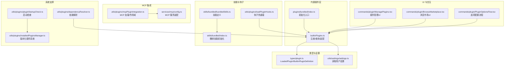
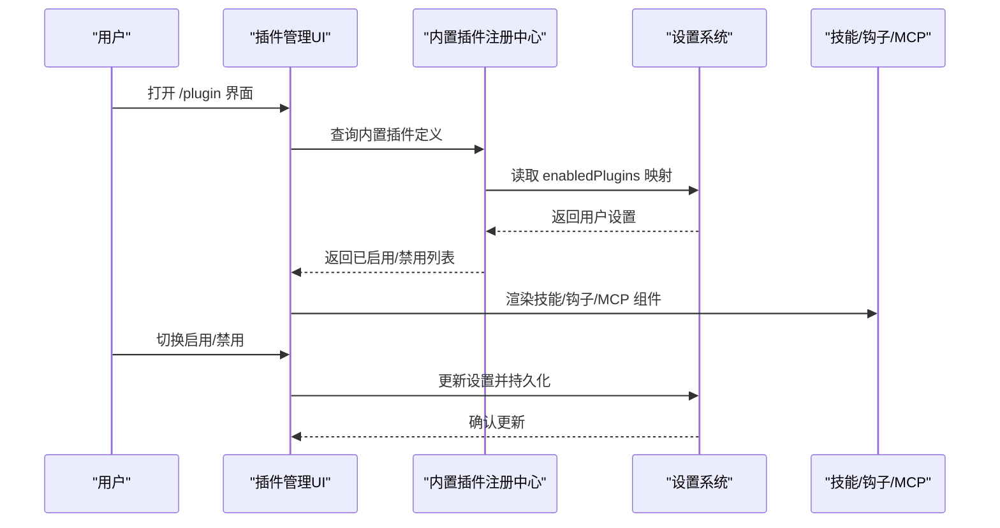
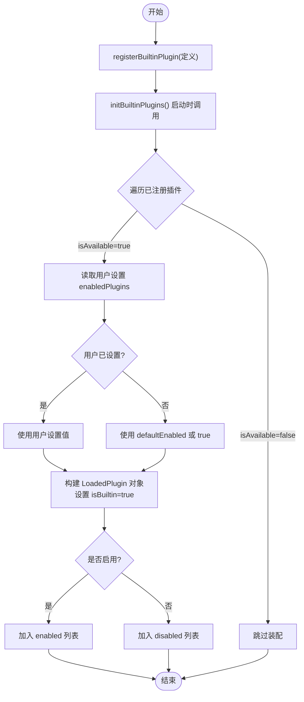
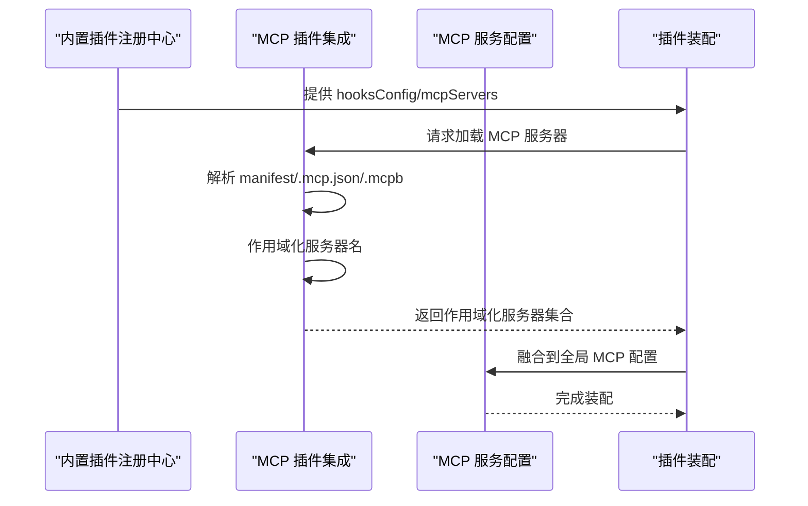
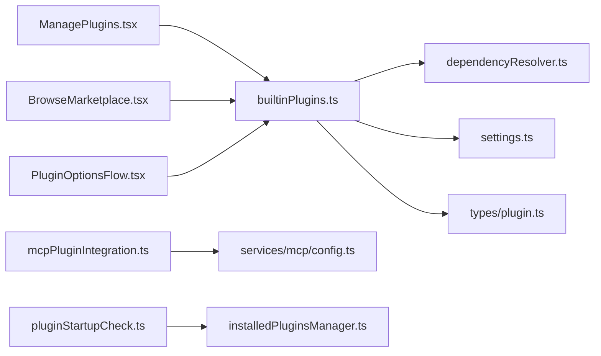

# 内置插件系统

<cite>
**本文引用的文件**
- [builtinPlugins.ts](file://src/plugins/builtinPlugins.ts)
- [index.ts（内置插件初始化）](file://src/plugins/bundled/index.ts)
- [plugin.ts（类型定义）](file://src/types/plugin.ts)
- [settings.ts（设置读取）](file://src/utils/settings/settings.ts)
- [ManagePlugins.tsx（插件管理UI）](file://src/commands/plugin/ManagePlugins.tsx)
- [BrowseMarketplace.tsx（浏览市场UI）](file://src/commands/plugin/BrowseMarketplace.tsx)
- [bundledSkills.ts（捆绑技能定义）](file://src/skills/bundled/bundledSkills.ts)
- [index.ts（捆绑技能初始化）](file://src/skills/bundled/index.ts)
- [claudeInChrome.ts（捆绑技能示例）](file://src/skills/bundled/claudeInChrome.ts)
- [pluginOptionsStorage.ts（插件选项存储）](file://src/utils/plugins/pluginOptionsStorage.ts)
- [PluginOptionsFlow.tsx（插件选项流程）](file://src/commands/plugin/PluginOptionsFlow.tsx)
- [mcpPluginIntegration.ts（MCP 插件集成）](file://src/utils/plugins/mcpPluginIntegration.ts)
- [config.ts（MCP 服务配置加载）](file://src/services/mcp/config.ts)
- [loadPluginHooks.ts（插件钩子加载）](file://src/utils/plugins/loadPluginHooks.ts)
- [pluginStartupCheck.ts（插件启动检查）](file://src/utils/plugins/pluginStartupCheck.ts)
- [installedPluginsManager.ts（已安装插件管理）](file://src/utils/plugins/installedPluginsManager.ts)
- [dependencyResolver.ts（依赖解析器）](file://src/utils/plugins/dependencyResolver.ts)
</cite>

## 目录
1. [简介](#简介)
2. [项目结构](#项目结构)
3. [核心组件](#核心组件)
4. [架构总览](#架构总览)
5. [详细组件分析](#详细组件分析)
6. [依赖关系分析](#依赖关系分析)
7. [性能考量](#性能考量)
8. [故障排查指南](#故障排查指南)
9. [结论](#结论)
10. [附录](#附录)

## 简介
本文件系统性阐述内置插件（Built-in Plugins）的设计与实现，覆盖其定义、注册、启用/禁用、持久化与默认配置、生命周期与可用性检查、状态同步、与技能系统和钩子机制的集成，以及与 MCP 服务器的对接方式。同时给出开发指南、注册流程与最佳实践，并通过具体示例帮助用户正确使用内置插件。

内置插件是随 CLI 一起分发、可由用户在“/plugin”界面中显式启用/禁用的功能模块，支持提供多类组件：技能（skills）、钩子（hooks）、MCP 服务器等。它们与“捆绑技能”（bundled skills）不同：后者通常自动启用或具备复杂逻辑，不暴露给用户显式开关；而内置插件强调“用户可切换”。

## 项目结构
围绕内置插件的关键目录与文件如下：
- 插件注册与查询：src/plugins/builtinPlugins.ts
- 初始化入口：src/plugins/bundled/index.ts
- 类型定义：src/types/plugin.ts
- 用户设置读取：src/utils/settings/settings.ts
- 插件管理 UI：src/commands/plugin/ManagePlugins.tsx
- 市场浏览 UI：src/commands/plugin/BrowseMarketplace.tsx
- 捆绑技能定义与初始化：src/skills/bundled/bundledSkills.ts、src/skills/bundled/index.ts
- MCP 集成与配置：src/utils/plugins/mcpPluginIntegration.ts、src/services/mcp/config.ts
- 插件选项存储与流程：src/utils/plugins/pluginOptionsStorage.ts、src/commands/plugin/PluginOptionsFlow.tsx
- 启动检查与缓存：src/utils/plugins/pluginStartupCheck.ts、src/utils/plugins/installedPluginsManager.ts
- 依赖解析：src/utils/plugins/dependencyResolver.ts

图表来源
- [builtinPlugins.ts:1-160](file://src/plugins/builtinPlugins.ts#L1-L160)
- [index.ts（内置插件初始化）:1-24](file://src/plugins/bundled/index.ts#L1-L24)
- [plugin.ts（类型定义）:1-364](file://src/types/plugin.ts#L1-L364)
- [settings.ts（设置读取）:1-200](file://src/utils/settings/settings.ts#L1-L200)
- [ManagePlugins.tsx（插件管理UI）:193-383](file://src/commands/plugin/ManagePlugins.tsx#L193-L383)
- [BrowseMarketplace.tsx（浏览市场UI）:678-692](file://src/commands/plugin/BrowseMarketplace.tsx#L678-L692)
- [bundledSkills.ts（捆绑技能定义）](file://src/skills/bundled/bundledSkills.ts)
- [index.ts（捆绑技能初始化）:1-73](file://src/skills/bundled/index.ts#L1-L73)
- [loadPluginHooks.ts（插件钩子加载）:249-287](file://src/utils/plugins/loadPluginHooks.ts#L249-L287)
- [mcpPluginIntegration.ts（MCP 插件集成）:122-377](file://src/utils/plugins/mcpPluginIntegration.ts#L122-L377)
- [config.ts（MCP 服务配置加载）:1117-1154](file://src/services/mcp/config.ts#L1117-L1154)
- [pluginStartupCheck.ts（插件启动检查）:187-220](file://src/utils/plugins/pluginStartupCheck.ts#L187-L220)
- [installedPluginsManager.ts（已安装插件管理）:706-734](file://src/utils/plugins/installedPluginsManager.ts#L706-L734)
- [dependencyResolver.ts（依赖解析器）:91-142](file://src/utils/plugins/dependencyResolver.ts#L91-L142)

章节来源
- [builtinPlugins.ts:1-160](file://src/plugins/builtinPlugins.ts#L1-L160)
- [index.ts（内置插件初始化）:1-24](file://src/plugins/bundled/index.ts#L1-L24)
- [plugin.ts（类型定义）:1-364](file://src/types/plugin.ts#L1-L364)

## 核心组件
- 内置插件注册中心：维护内置插件定义映射，提供注册、查询、装配为 LoadedPlugin 的能力。
- 初始化入口：在 CLI 启动时调用，注册所有内置插件。
- 类型系统：统一 LoadedPlugin 与 BuiltinPluginDefinition 结构，明确字段语义与可选组件。
- 设置系统：从用户设置中读取 enabledPlugins 映射，决定启用状态与默认值。
- UI 展示：插件管理界面与市场浏览界面分别处理内置插件与市场插件的差异化显示。
- 技能与钩子：内置插件可提供技能（以命令形式注入）、钩子（事件驱动扩展点）。
- MCP 集成：内置插件可声明 MCP 服务器，经作用域化后参与全局 MCP 服务装配。
- 选项存储：支持非敏感与敏感配置分离存储，提供统一的加载/保存接口。
- 启动检查与缓存：确保版本化插件系统初始化、状态同步与缓存一致性。

章节来源
- [builtinPlugins.ts:25-128](file://src/plugins/builtinPlugins.ts#L25-L128)
- [plugin.ts（类型定义）:18-70](file://src/types/plugin.ts#L18-L70)
- [settings.ts（设置读取）:1-200](file://src/utils/settings/settings.ts#L1-L200)
- [ManagePlugins.tsx（插件管理UI）:193-383](file://src/commands/plugin/ManagePlugins.tsx#L193-L383)
- [mcpPluginIntegration.ts（MCP 插件集成）:122-377](file://src/utils/plugins/mcpPluginIntegration.ts#L122-L377)
- [pluginOptionsStorage.ts（插件选项存储）:62-96](file://src/utils/plugins/pluginOptionsStorage.ts#L62-L96)

## 架构总览
内置插件系统围绕“注册—装配—启用—运行”的主链路展开，贯穿 UI、设置、类型、MCP、钩子与选项存储等模块。

图表来源
- [builtinPlugins.ts:52-102](file://src/plugins/builtinPlugins.ts#L52-L102)
- [settings.ts（设置读取）:1-200](file://src/utils/settings/settings.ts#L1-L200)
- [ManagePlugins.tsx（插件管理UI）:193-383](file://src/commands/plugin/ManagePlugins.tsx#L193-L383)

## 详细组件分析

### 内置插件注册与装配
- 注册：在初始化阶段调用注册函数，将插件定义写入内存映射。
- 装配：根据用户设置与默认值生成 LoadedPlugin，标记 isBuiltin=true，填充 hooksConfig 与 mcpServers。
- 过滤：若 isAvailable 返回 false，则该插件不参与装配。
- 技能命令：仅启用的内置插件会将其技能转换为命令对象供 UI 与工具使用。

图表来源
- [builtinPlugins.ts:25-102](file://src/plugins/builtinPlugins.ts#L25-L102)

章节来源
- [builtinPlugins.ts:25-128](file://src/plugins/builtinPlugins.ts#L25-L128)
- [plugin.ts（类型定义）:18-70](file://src/types/plugin.ts#L18-L70)

### 内置插件与市场插件的区别与特点
- 可见性：内置插件出现在“内置”分组；市场插件来自外部市场。
- 可控性：内置插件支持用户显式启用/禁用；市场插件通常由安装/卸载控制。
- 组件：两者均可提供技能、钩子、MCP 服务器等组件。
- 标识：内置插件 ID 使用“名称@builtin”，市场插件使用“名称@市场名”。

章节来源
- [builtinPlugins.ts:12-14](file://src/plugins/builtinPlugins.ts#L12-L14)
- [ManagePlugins.tsx（插件管理UI）:193-383](file://src/commands/plugin/ManagePlugins.tsx#L193-L383)
- [BrowseMarketplace.tsx（浏览市场UI）:678-692](file://src/commands/plugin/BrowseMarketplace.tsx#L678-L692)

### 启用/禁用机制、用户设置持久化与默认配置
- 用户设置键：enabledPlugins 是一个映射，键为插件 ID，值为布尔启用状态。
- 默认策略：用户未设置时，优先使用插件定义中的 defaultEnabled，否则默认启用。
- 可用性过滤：isAvailable 为 false 的插件不会出现在装配结果中。
- 持久化：设置系统负责读取/写入 settings.json 并进行合并与校验。

章节来源
- [builtinPlugins.ts:70-77](file://src/plugins/builtinPlugins.ts#L70-L77)
- [settings.ts（设置读取）:1-200](file://src/utils/settings/settings.ts#L1-L200)

### 生命周期管理、可用性检查与状态同步
- 生命周期：初始化 → 注册 → 装配 → 运行（技能/钩子/MCP）。
- 可用性检查：isAvailable 在装配前执行，不可用则跳过。
- 状态同步：版本化插件系统在启动时将 settings.json 中的 enabledPlugins 同步到 installed_plugins.json，并建立会话内缓存。

章节来源
- [builtinPlugins.ts:65-68](file://src/plugins/builtinPlugins.ts#L65-L68)
- [installedPluginsManager.ts（已安装插件管理）:706-734](file://src/utils/plugins/installedPluginsManager.ts#L706-L734)
- [pluginStartupCheck.ts（插件启动检查）:187-220](file://src/utils/plugins/pluginStartupCheck.ts#L187-L220)

### 与技能系统的集成
- 技能来源：内置插件的 skills 字段映射为命令对象，注入到技能工具与 UI。
- 捆绑技能对比：捆绑技能通常自动启用或有复杂逻辑，不暴露给用户显式开关；内置插件强调“用户可切换”。
- 示例：捆绑技能中包含浏览器自动化示例，展示如何声明 allowedTools、whenToUse 等。

章节来源
- [builtinPlugins.ts:104-121](file://src/plugins/builtinPlugins.ts#L104-L121)
- [bundledSkills.ts（捆绑技能定义）](file://src/skills/bundled/bundledSkills.ts)
- [index.ts（捆绑技能初始化）:1-73](file://src/skills/bundled/index.ts#L1-L73)
- [claudeInChrome.ts（捆绑技能示例）:1-35](file://src/skills/bundled/claudeInChrome.ts#L1-L35)

### 与钩子机制的集成
- 钩子配置：内置插件可通过 hooks 字段声明事件驱动行为。
- 热重载：当影响插件的策略设置变化时，触发钩子缓存清理与重新加载，避免“惊喜变更”。

章节来源
- [builtinPlugins.ts:89-90](file://src/plugins/builtinPlugins.ts#L89-L90)
- [loadPluginHooks.ts（插件钩子加载）:249-287](file://src/utils/plugins/loadPluginHooks.ts#L249-L287)

### 与 MCP 服务器的集成
- 声明与加载：内置插件可在 mcpServers 中声明服务器配置，经作用域化后参与全局装配。
- 作用域化：为避免命名冲突，MCP 服务器名会被加上“plugin:插件名:服务器名”的前缀。
- 错误处理：MCP 相关错误会在服务端日志中记录，便于诊断。

图表来源
- [builtinPlugins.ts:89-92](file://src/plugins/builtinPlugins.ts#L89-L92)
- [mcpPluginIntegration.ts（MCP 插件集成）:122-377](file://src/utils/plugins/mcpPluginIntegration.ts#L122-L377)
- [config.ts（MCP 服务配置加载）:1117-1154](file://src/services/mcp/config.ts#L1117-L1154)

### 开发指南、注册流程与最佳实践
- 新增内置插件步骤
  1) 在初始化入口中调用注册函数，传入插件定义（含 name/description/version/skills/hooks/mcpServers/isAvailable/defaultEnabled）。
  2) 若插件需要条件可用性，在 isAvailable 中实现判断逻辑。
  3) 为技能提供 allowedTools、whenToUse、model 等元信息，提升用户体验。
  4) 如需 MCP 服务器，提供配置或外部文件路径。
- 最佳实践
  - 将“用户可显式切换”的功能设计为内置插件；自动启用或复杂逻辑的功能保留为捆绑技能。
  - 合理设置 defaultEnabled，避免破坏默认体验。
  - 使用 isAvailable 控制平台/环境相关特性，隐藏不可用项。
  - 对于敏感配置，使用插件选项存储的敏感字段分离机制。

章节来源
- [index.ts（内置插件初始化）:16-24](file://src/plugins/bundled/index.ts#L16-L24)
- [builtinPlugins.ts:25-32](file://src/plugins/builtinPlugins.ts#L25-L32)
- [plugin.ts（类型定义）:18-35](file://src/types/plugin.ts#L18-L35)
- [pluginOptionsStorage.ts（插件选项存储）:62-96](file://src/utils/plugins/pluginOptionsStorage.ts#L62-L96)

### 具体内置插件示例、配置选项与使用方法
- 示例：捆绑技能中的浏览器自动化示例展示了如何声明 allowedTools、whenToUse、isEnabled 等字段，体现“先激活再使用”的模式。
- 配置选项：通过插件选项流程，按顶层 manifest.userConfig 与通道级 userConfig 分别引导用户完成配置，支持非敏感与敏感数据的分离存储。
- 使用方法：在 /plugin 界面中找到“内置”分组，勾选/取消勾选相应插件；对于需要配置的 MCP 服务器，可在启用后进入选项流程完成参数填写。

章节来源
- [claudeInChrome.ts（捆绑技能示例）:16-35](file://src/skills/bundled/claudeInChrome.ts#L16-L35)
- [PluginOptionsFlow.tsx（插件选项流程）:1-101](file://src/commands/plugin/PluginOptionsFlow.tsx#L1-L101)
- [pluginOptionsStorage.ts（插件选项存储）:62-96](file://src/utils/plugins/pluginOptionsStorage.ts#L62-L96)
- [ManagePlugins.tsx（插件管理UI）:193-383](file://src/commands/plugin/ManagePlugins.tsx#L193-L383)

## 依赖关系分析
内置插件系统与以下模块存在直接依赖：
- 依赖解析：在安装/解析依赖闭包时，内置插件作为根或依赖项参与解析，跨市场安装被安全阻断。
- 版本化插件系统：启动时迁移 enabledPlugins，保证状态一致。
- 启动检查：首次调用即触发迁移与缓存初始化，确保后续加载稳定。

图表来源
- [builtinPlugins.ts:1-160](file://src/plugins/builtinPlugins.ts#L1-L160)
- [dependencyResolver.ts（依赖解析器）:91-142](file://src/utils/plugins/dependencyResolver.ts#L91-L142)
- [settings.ts（设置读取）:1-200](file://src/utils/settings/settings.ts#L1-L200)
- [plugin.ts（类型定义）:1-364](file://src/types/plugin.ts#L1-L364)
- [ManagePlugins.tsx（插件管理UI）:193-383](file://src/commands/plugin/ManagePlugins.tsx#L193-L383)
- [BrowseMarketplace.tsx（浏览市场UI）:678-692](file://src/commands/plugin/BrowseMarketplace.tsx#L678-L692)
- [PluginOptionsFlow.tsx（插件选项流程）:1-101](file://src/commands/plugin/PluginOptionsFlow.tsx#L1-L101)
- [mcpPluginIntegration.ts（MCP 插件集成）:122-377](file://src/utils/plugins/mcpPluginIntegration.ts#L122-L377)
- [config.ts（MCP 服务配置加载）:1117-1154](file://src/services/mcp/config.ts#L1117-L1154)
- [pluginStartupCheck.ts（插件启动检查）:187-220](file://src/utils/plugins/pluginStartupCheck.ts#L187-L220)
- [installedPluginsManager.ts（已安装插件管理）:706-734](file://src/utils/plugins/installedPluginsManager.ts#L706-L734)

章节来源
- [dependencyResolver.ts（依赖解析器）:91-142](file://src/utils/plugins/dependencyResolver.ts#L91-L142)
- [installedPluginsManager.ts（已安装插件管理）:706-734](file://src/utils/plugins/installedPluginsManager.ts#L706-L734)
- [pluginStartupCheck.ts（插件启动检查）:187-220](file://src/utils/plugins/pluginStartupCheck.ts#L187-L220)

## 性能考量
- 缓存与懒加载：插件装配与钩子加载采用缓存策略，减少重复 IO 与计算。
- 并行处理：MCP 服务器提取与错误收集采用并发，缩短启动时间。
- 启动时迁移：一次性迁移与初始化，避免运行期抖动。
- 作用域化：MCP 服务器名加前缀，避免冲突带来的回退成本。

章节来源
- [mcpPluginIntegration.ts（MCP 插件集成）:366-377](file://src/utils/plugins/mcpPluginIntegration.ts#L366-L377)
- [config.ts（MCP 服务配置加载）:1117-1154](file://src/services/mcp/config.ts#L1117-L1154)
- [installedPluginsManager.ts（已安装插件管理）:706-734](file://src/utils/plugins/installedPluginsManager.ts#L706-L734)

## 故障排查指南
- 插件未出现在列表
  - 检查 isAvailable 是否返回 false。
  - 确认初始化是否调用注册函数。
- 启用无效或状态异常
  - 核对 settings.json 中 enabledPlugins 的键值格式（名称@builtin）。
  - 查看版本化插件系统是否完成迁移与缓存同步。
- MCP 服务器无法加载
  - 检查 mcpServers 配置合法性与外部文件路径。
  - 关注 MCP 相关错误日志，定位配置或下载/解压失败原因。
- 钩子未生效
  - 触发策略设置变化后，确认热重载是否执行，必要时手动刷新。

章节来源
- [builtinPlugins.ts:65-68](file://src/plugins/builtinPlugins.ts#L65-L68)
- [settings.ts（设置读取）:1-200](file://src/utils/settings/settings.ts#L1-L200)
- [installedPluginsManager.ts（已安装插件管理）:706-734](file://src/utils/plugins/installedPluginsManager.ts#L706-L734)
- [config.ts（MCP 服务配置加载）:1117-1154](file://src/services/mcp/config.ts#L1117-L1154)
- [loadPluginHooks.ts（插件钩子加载）:249-287](file://src/utils/plugins/loadPluginHooks.ts#L249-L287)

## 结论
内置插件系统通过清晰的注册与装配流程、完善的用户设置持久化与默认策略、以及与技能、钩子、MCP 的深度集成，为用户提供可控、可观测且可扩展的能力扩展机制。遵循“用户可切换”的原则，合理区分内置插件与捆绑技能，有助于保持产品体验的一致性与稳定性。

## 附录
- 关键 API 速览
  - 注册：registerBuiltinPlugin(definition)
  - 查询：getBuiltinPluginDefinition(name)
  - 装配：getBuiltinPlugins() → { enabled, disabled }
  - 技能命令：getBuiltinPluginSkillCommands()
  - 标识判断：isBuiltinPluginId(id)
  - 清空：clearBuiltinPlugins()

章节来源
- [builtinPlugins.ts:25-128](file://src/plugins/builtinPlugins.ts#L25-L128)