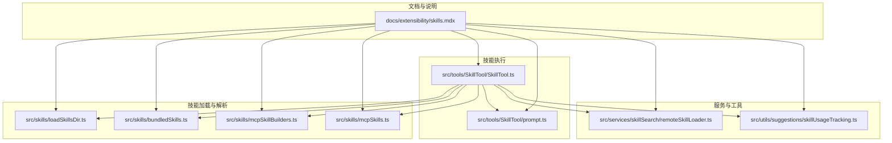
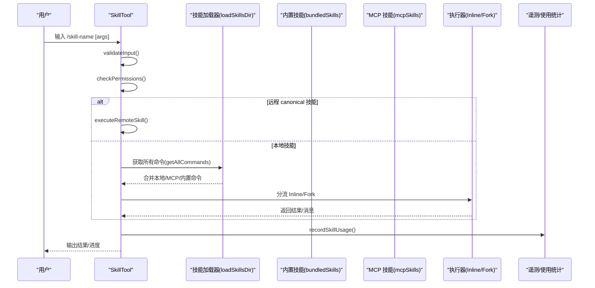
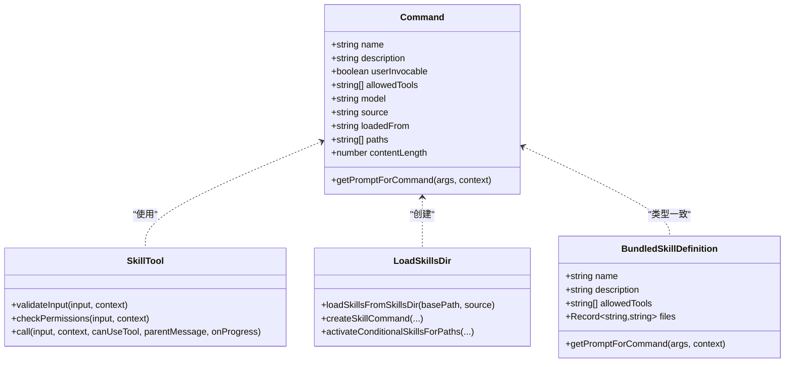
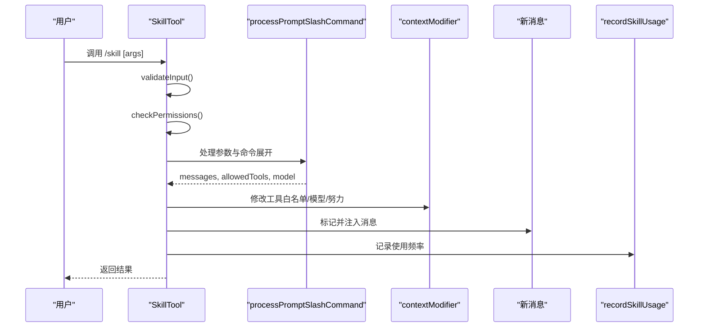
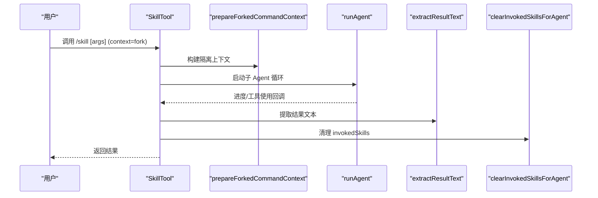
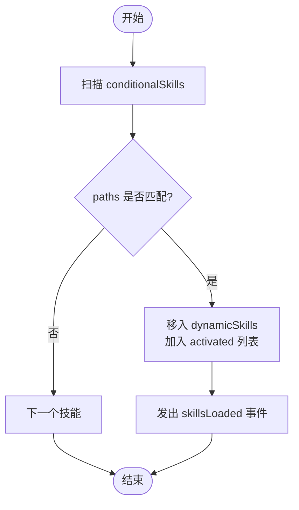
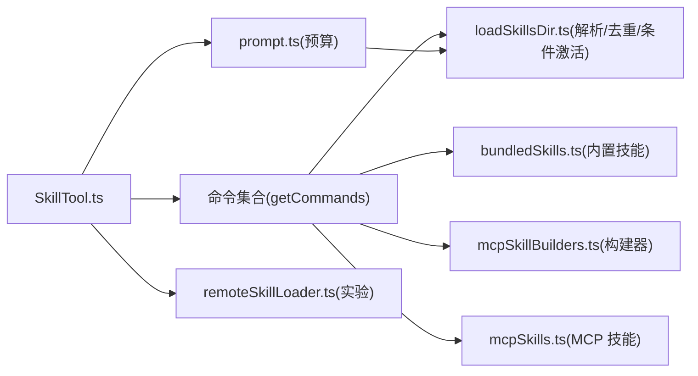

# 技能系统

<cite>
**本文引用的文件**
- [skills.mdx](file://docs/extensibility/skills.mdx)
- [bundledSkills.ts](file://src/skills/bundledSkills.ts)
- [loadSkillsDir.ts](file://src/skills/loadSkillsDir.ts)
- [mcpSkillBuilders.ts](file://src/skills/mcpSkillBuilders.ts)
- [mcpSkills.ts](file://src/skills/mcpSkills.ts)
- [SkillTool.ts](file://src/tools/SkillTool/SkillTool.ts)
- [prompt.ts](file://src/tools/SkillTool/prompt.ts)
- [remoteSkillLoader.ts](file://src/services/skillSearch/remoteSkillLoader.ts)
- [skillUsageTracking.ts](file://src/utils/suggestions/skillUsageTracking.ts)
</cite>

## 目录
1. [简介](#简介)
2. [项目结构](#项目结构)
3. [核心组件](#核心组件)
4. [架构总览](#架构总览)
5. [详细组件分析](#详细组件分析)
6. [依赖关系分析](#依赖关系分析)
7. [性能考量](#性能考量)
8. [故障排查指南](#故障排查指南)
9. [结论](#结论)
10. [附录](#附录)

## 简介
本文件系统性梳理 Claude Code 的“技能系统”（Skills），围绕以下主题展开：技能的定义与分类、生命周期与加载机制、执行流程与上下文处理、与工具系统的集成、权限控制与参数传递、配置管理与提示工程、遥测与搜索预取、内置与自定义技能的开发与测试方法，并给出架构图与实际应用案例。

## 项目结构
技能系统主要分布在如下区域：
- 文档：extensibility/skills.mdx 提供技能系统的设计理念与端到端链路说明
- 技能加载与解析：src/skills 下的 bundledSkills.ts、loadSkillsDir.ts、mcpSkillBuilders.ts、mcpSkills.ts
- 技能执行入口：src/tools/SkillTool/SkillTool.ts
- 提示预算与列表格式化：src/tools/SkillTool/prompt.ts
- 远程技能加载（实验）：src/services/skillSearch/remoteSkillLoader.ts
- 使用频率与排名：src/utils/suggestions/skillUsageTracking.ts

图表来源
- [skills.mdx](file://docs/extensibility/skills.mdx)
- [loadSkillsDir.ts](file://src/skills/loadSkillsDir.ts)
- [bundledSkills.ts](file://src/skills/bundledSkills.ts)
- [mcpSkillBuilders.ts](file://src/skills/mcpSkillBuilders.ts)
- [mcpSkills.ts](file://src/skills/mcpSkills.ts)
- [SkillTool.ts](file://src/tools/SkillTool/SkillTool.ts)
- [prompt.ts](file://src/tools/SkillTool/prompt.ts)
- [remoteSkillLoader.ts](file://src/services/skillSearch/remoteSkillLoader.ts)
- [skillUsageTracking.ts](file://src/utils/suggestions/skillUsageTracking.ts)

章节来源
- [skills.mdx](file://docs/extensibility/skills.mdx)

## 核心组件
- 技能来源与加载链路
  - 内置命令（Built-in Commands）
  - 编译时打包技能（Bundled Skills）
  - 磁盘技能（.claude/skills/）
  - MCP 技能（动态发现）
  - 兼容旧格式（/commands/）
- 技能定义与解析
  - Frontmatter 字段解析与标准化
  - 条件激活（paths）
  - 去重与符号链接处理
- 执行路径
  - Inline 模式：注入用户消息到主对话流
  - Fork 模式：子 Agent 隔离执行
- 权限模型
  - 四层检查：Deny/官方市场/Allow/Safe Properties 白名单
- 提示预算与列表格式化
  - 1% 上下文窗口预算、分级截断策略
- 远程技能加载（实验）
  - canonical 名称拦截、URL 协议支持、缓存与遥测
- 使用频率与排名
  - 指数衰减评分、60 秒去抖

章节来源
- [skills.mdx](file://docs/extensibility/skills.mdx)
- [loadSkillsDir.ts](file://src/skills/loadSkillsDir.ts)
- [bundledSkills.ts](file://src/skills/bundledSkills.ts)
- [mcpSkillBuilders.ts](file://src/skills/mcpSkillBuilders.ts)
- [mcpSkills.ts](file://src/skills/mcpSkills.ts)
- [SkillTool.ts](file://src/tools/SkillTool/SkillTool.ts)
- [prompt.ts](file://src/tools/SkillTool/prompt.ts)
- [remoteSkillLoader.ts](file://src/services/skillSearch/remoteSkillLoader.ts)
- [skillUsageTracking.ts](file://src/utils/suggestions/skillUsageTracking.ts)

## 架构总览
技能系统从磁盘/插件/MCP/内置等多源加载，经 Frontmatter 解析与去重，形成统一的 Command 列表；执行时由 SkillTool 统一入口进行权限校验与分流（Inline/Fork），并在系统提示中按预算注入技能清单，最终记录使用行为与遥测。

图表来源
- [SkillTool.ts](file://src/tools/SkillTool/SkillTool.ts)
- [loadSkillsDir.ts](file://src/skills/loadSkillsDir.ts)
- [bundledSkills.ts](file://src/skills/bundledSkills.ts)
- [mcpSkills.ts](file://src/skills/mcpSkills.ts)
- [remoteSkillLoader.ts](file://src/services/skillSearch/remoteSkillLoader.ts)
- [skillUsageTracking.ts](file://src/utils/suggestions/skillUsageTracking.ts)

## 详细组件分析

### 技能来源与加载链路
- 内置命令：硬编码在命令集合中，实现相同接口
- 编译时打包技能：注册后常驻，支持首次调用时解压参考文件，具备进程级闭包 memoize
- 磁盘技能：扫描 .claude/skills/ 目录，仅支持目录格式 skill-name/SKILL.md，解析 Frontmatter 并创建 Command
- MCP 技能：通过构建器注册，将远端 prompt 转换为 Command，标记 loadedFrom=mcp
- 兼容旧格式：/commands/ 目录支持目录与单文件两种形式

章节来源
- [skills.mdx](file://docs/extensibility/skills.mdx)
- [loadSkillsDir.ts](file://src/skills/loadSkillsDir.ts)
- [bundledSkills.ts](file://src/skills/bundledSkills.ts)
- [mcpSkillBuilders.ts](file://src/skills/mcpSkillBuilders.ts)
- [mcpSkills.ts](file://src/skills/mcpSkills.ts)

### Frontmatter 字段与解析
- 字段范围：名称、描述、when_to_use、allowed-tools、argument-hint、arguments、model、effort、context、agent、user-invocable、disable-model-invocation、version、paths、hooks、shell 等
- 解析流程：parseFrontmatter() -> parseSkillFrontmatterFields() -> createSkillCommand()
- 安全与限制：MCP 技能禁用内联 shell 命令执行；paths 支持 gitignore 风格匹配；去重基于 realpath

章节来源
- [skills.mdx](file://docs/extensibility/skills.mdx)
- [loadSkillsDir.ts](file://src/skills/loadSkillsDir.ts)

### 执行路径：Inline 与 Fork
- Inline 模式
  - 处理参数替换与 shell 命令展开
  - 注入用户消息到主对话流
  - contextModifier 合并 allowedTools、模型覆盖、努力级别
- Fork 模式
  - prepareForkedCommandContext 构建隔离 Agent
  - runAgent 独立循环，独立 token 预算
  - onProgress 回调汇报工具使用进度
  - extractResultText 提取结果，清理 invokedSkills 状态

章节来源
- [skills.mdx](file://docs/extensibility/skills.mdx)
- [SkillTool.ts](file://src/tools/SkillTool/SkillTool.ts)

### 权限模型与安全
- 四层检查：Deny 规则 -> 官方市场自动放行 -> Allow 规则 -> Safe Properties 白名单
- Safe Properties 白名单：仅允许特定属性，其余属性视为需要权限
- 建议规则：精确匹配与前缀匹配两条建议，便于快速授权

章节来源
- [skills.mdx](file://docs/extensibility/skills.mdx)
- [SkillTool.ts](file://src/tools/SkillTool/SkillTool.ts)

### 提示预算与列表格式化
- 预算：上下文窗口的 1%，字符估算按 4 字/token
- 截断策略：先尝试完整描述，再按 bundled 不截断、非 bundled 均分预算、最后仅保留名称
- 名称显示：插件技能可能显示 userFacingName 与内部 name 的差异

章节来源
- [skills.mdx](file://docs/extensibility/skills.mdx)
- [prompt.ts](file://src/tools/SkillTool/prompt.ts)

### 条件激活与动态发现
- 条件激活：paths Frontmatter 的技能在加载时进入 conditionalSkills，当文件路径匹配（gitignore 风格）时激活到 dynamicSkills
- 动态发现：文件操作时向上遍历查找 .claude/skills/，按层级深度排序，深层优先

章节来源
- [skills.mdx](file://docs/extensibility/skills.mdx)
- [loadSkillsDir.ts](file://src/skills/loadSkillsDir.ts)

### 使用频率与排名
- 指数衰减评分：半衰期 7 天，最低保底 0.1
- 去抖：60 秒内多次调用仅计一次，降低 I/O
- 数据持久化：保存在全局配置 skillUsage 字段

章节来源
- [skills.mdx](file://docs/extensibility/skills.mdx)
- [skillUsageTracking.ts](file://src/utils/suggestions/skillUsageTracking.ts)

### 远程技能加载（实验）
- canonical 名称拦截：_canonical_<slug> -> executeRemoteSkill()
- 支持 gs://、https://、s3:// 等协议
- 内容处理：剥离 Frontmatter、替换变量、直接注入用户消息
- 缓存与遥测：返回缓存命中、延迟、文件数量与字节等指标

章节来源
- [skills.mdx](file://docs/extensibility/skills.mdx)
- [remoteSkillLoader.ts](file://src/services/skillSearch/remoteSkillLoader.ts)

### 类关系图（代码级）

图表来源
- [SkillTool.ts](file://src/tools/SkillTool/SkillTool.ts)
- [loadSkillsDir.ts](file://src/skills/loadSkillsDir.ts)
- [bundledSkills.ts](file://src/skills/bundledSkills.ts)

### 执行序列图（Inline）

图表来源
- [SkillTool.ts](file://src/tools/SkillTool/SkillTool.ts)
- [prompt.ts](file://src/tools/SkillTool/prompt.ts)

### 执行序列图（Fork）

图表来源
- [SkillTool.ts](file://src/tools/SkillTool/SkillTool.ts)

### 条件激活流程图

图表来源
- [loadSkillsDir.ts](file://src/skills/loadSkillsDir.ts)

## 依赖关系分析
- 组件耦合
  - SkillTool 依赖命令集合（本地/MCP/内置），并通过 getAllCommands 合并
  - 加载器负责解析 Frontmatter、创建 Command、去重与条件激活
  - 提示预算模块与加载器共同决定技能列表注入长度
- 外部依赖
  - ignore 库用于 paths 匹配
  - 远程技能加载依赖外部存储协议（gs/https/s3）

图表来源
- [SkillTool.ts](file://src/tools/SkillTool/SkillTool.ts)
- [prompt.ts](file://src/tools/SkillTool/prompt.ts)
- [remoteSkillLoader.ts](file://src/services/skillSearch/remoteSkillLoader.ts)
- [loadSkillsDir.ts](file://src/skills/loadSkillsDir.ts)
- [bundledSkills.ts](file://src/skills/bundledSkills.ts)
- [mcpSkillBuilders.ts](file://src/skills/mcpSkillBuilders.ts)
- [mcpSkills.ts](file://src/skills/mcpSkills.ts)

章节来源
- [SkillTool.ts](file://src/tools/SkillTool/SkillTool.ts)
- [loadSkillsDir.ts](file://src/skills/loadSkillsDir.ts)
- [prompt.ts](file://src/tools/SkillTool/prompt.ts)
- [remoteSkillLoader.ts](file://src/services/skillSearch/remoteSkillLoader.ts)
- [bundledSkills.ts](file://src/skills/bundledSkills.ts)
- [mcpSkillBuilders.ts](file://src/skills/mcpSkillBuilders.ts)
- [mcpSkills.ts](file://src/skills/mcpSkills.ts)

## 性能考量
- 加载与解析
  - 并行加载多个目录与 legacy commands，减少总体等待时间
  - 去重使用 realpath，避免符号链接与重复目录带来的重复 I/O
- 执行路径
  - Inline：零额外 Agent 开销，适合短任务
  - Fork：独立 Agent 与 token 预算，适合长任务与强隔离
- 提示预算
  - 1% 上下文窗口预算，分级截断策略避免过度占用上下文
- 使用频率
  - 指数衰减评分与 60 秒去抖，平衡推荐质量与 I/O 成本

[本节为通用性能讨论，无需具体文件分析]

## 故障排查指南
- 技能未显示
  - 检查 Frontmatter paths 是否与当前文件匹配
  - 确认是否处于 bare 模式或项目设置禁用
- 权限拒绝
  - 查看 deny/allow 规则与 Safe Properties 白名单
  - 使用建议规则快速添加允许项
- 远程技能无法加载
  - 确认 feature flag 与用户类型
  - 检查 discovered 列表与 URL 协议支持
- 执行异常
  - Fork 模式查看子 Agent 消息与进度回调
  - Inline 模式检查参数替换与 shell 命令展开

章节来源
- [SkillTool.ts](file://src/tools/SkillTool/SkillTool.ts)
- [loadSkillsDir.ts](file://src/skills/loadSkillsDir.ts)
- [remoteSkillLoader.ts](file://src/services/skillSearch/remoteSkillLoader.ts)

## 结论
技能系统以“Prompt 即能力”的理念为核心，通过声明式 Frontmatter 将经验封装为可复用工作流，并在严格的安全与预算约束下实现灵活的加载、执行与权限控制。其多源加载、条件激活、远程扩展与使用统计机制，使其既能满足日常开发需求，又具备持续演进与规模化的能力。

[本节为总结性内容，无需具体文件分析]

## 附录

### 技能开发指南
- 创建磁盘技能
  - 在 .claude/skills/<技能名>/SKILL.md 中编写 Prompt 与 Frontmatter
  - 使用 allowed-tools、model、effort、context 等字段控制行为
- 创建内置技能
  - 使用 registerBundledSkill 注册，支持首次调用时解压参考文件
- 创建 MCP 技能
  - 通过 mcpSkillBuilders 注册构建器，将远端 prompt 转换为 Command
- 测试方法
  - 使用 getSkillDirCommands 的 memoize 缓存验证加载
  - 通过 activateConditionalSkillsForPaths 验证条件激活
  - 使用 recordSkillUsage 验证使用统计

章节来源
- [loadSkillsDir.ts](file://src/skills/loadSkillsDir.ts)
- [bundledSkills.ts](file://src/skills/bundledSkills.ts)
- [mcpSkillBuilders.ts](file://src/skills/mcpSkillBuilders.ts)
- [skillUsageTracking.ts](file://src/utils/suggestions/skillUsageTracking.ts)

### 接口与实现要点
- 命令接口一致性：所有技能均实现 Command 接口
- 输入输出模式：Inline 返回新消息与 contextModifier；Fork 返回子 Agent 结果
- 权限决策：checkPermissions 返回 allow/ask/deny 三种行为
- 预算注入：formatCommandsWithinBudget 控制系统提示中的技能列表长度

章节来源
- [SkillTool.ts](file://src/tools/SkillTool/SkillTool.ts)
- [prompt.ts](file://src/tools/SkillTool/prompt.ts)

### 实际应用案例
- 条件激活：仅在测试文件上激活的测试技能，提升上下文相关性
- Fork 执行：长周期审查任务在子 Agent 中隔离执行，避免污染主对话
- 远程技能：通过 canonical 名称从 AKI/GCS/S3 加载，实现跨团队共享

章节来源
- [skills.mdx](file://docs/extensibility/skills.mdx)
- [loadSkillsDir.ts](file://src/skills/loadSkillsDir.ts)
- [SkillTool.ts](file://src/tools/SkillTool/SkillTool.ts)
- [remoteSkillLoader.ts](file://src/services/skillSearch/remoteSkillLoader.ts)