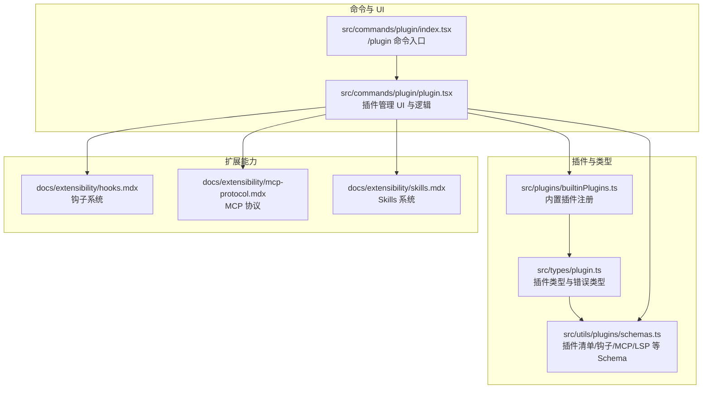
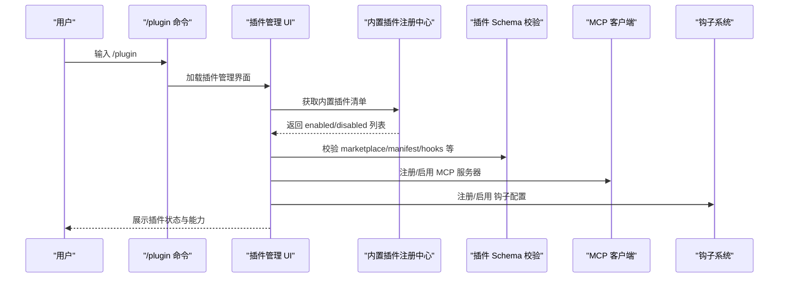
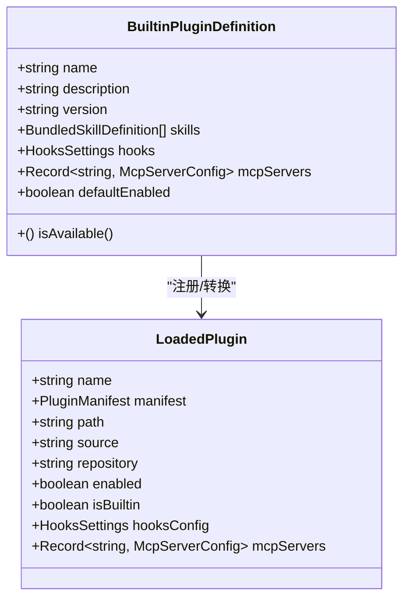
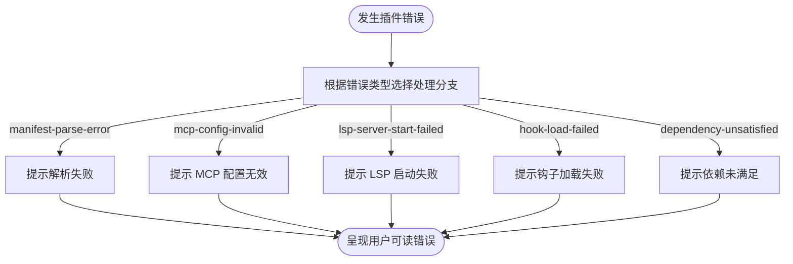
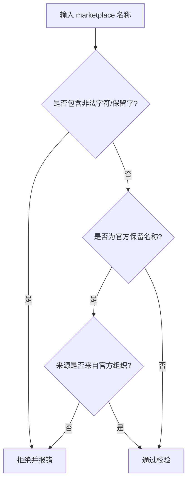
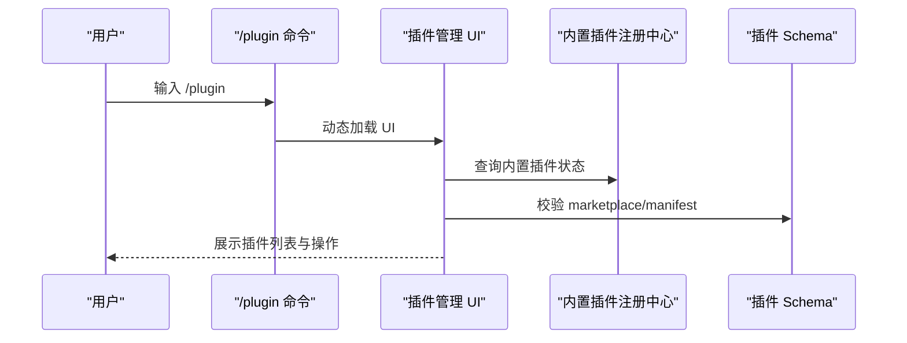
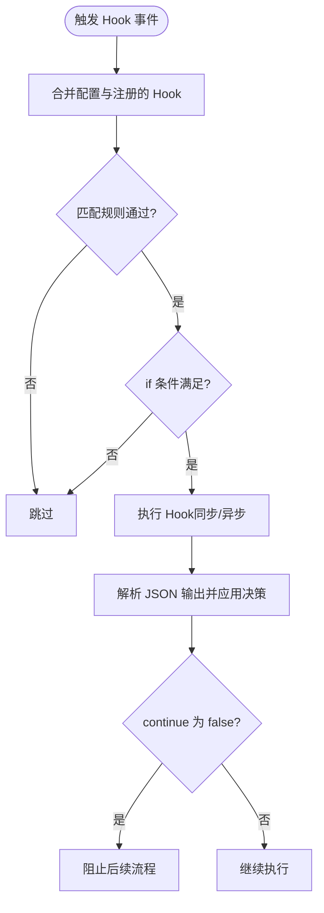
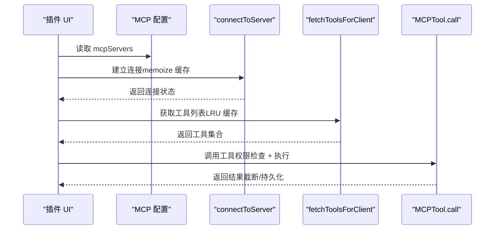
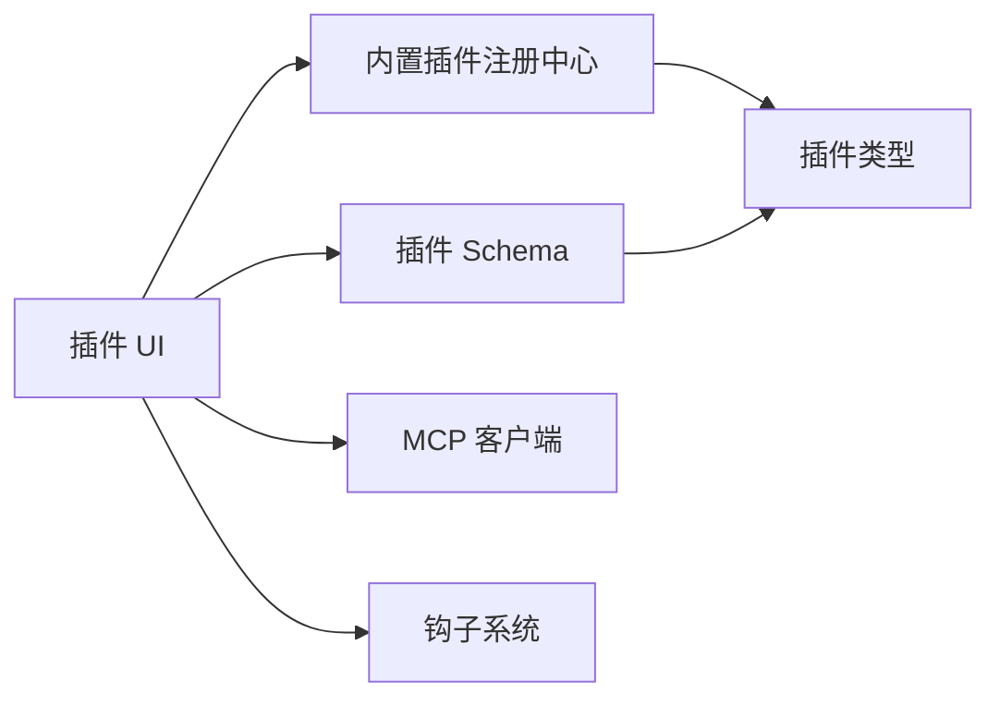

# 插件开发指南

<cite>
**本文引用的文件**
- [README.md](file://README.md)
- [hooks.mdx](file://docs/extensibility/hooks.mdx)
- [mcp-protocol.mdx](file://docs/extensibility/mcp-protocol.mdx)
- [skills.mdx](file://docs/extensibility/skills.mdx)
- [builtinPlugins.ts](file://src/plugins/builtinPlugins.ts)
- [plugin.ts](file://src/types/plugin.ts)
- [schemas.ts](file://src/utils/plugins/schemas.ts)
- [index.tsx](file://src/commands/plugin/index.tsx)
- [plugin.tsx](file://src/commands/plugin/plugin.tsx)
</cite>

## 目录
1. [简介](#简介)
2. [项目结构](#项目结构)
3. [核心组件](#核心组件)
4. [架构总览](#架构总览)
5. [详细组件分析](#详细组件分析)
6. [依赖关系分析](#依赖关系分析)
7. [性能考量](#性能考量)
8. [故障排查指南](#故障排查指南)
9. [结论](#结论)
10. [附录](#附录)

## 简介
本指南面向希望基于 Claude Code 扩展生态进行“插件开发”的工程师与技术作者。文档围绕以下目标展开：
- 插件开发的准备、环境与工具链
- 插件接口与类型定义、配置规范
- 插件打包、发布与分发流程
- 最佳实践、代码规范与性能优化
- 调试技巧、错误处理与日志记录
- 与 MCP 协议的集成、钩子机制与权限管理
- 完整的开发示例、模板与脚手架思路
- 测试策略、持续集成与部署方案

## 项目结构
Claude Code 的插件体系由“插件清单与注册”“类型与配置规范”“UI 与命令入口”“文档与示例”等组成。下图展示了与插件开发相关的核心模块：

图表来源
- [builtinPlugins.ts](file://src/plugins/builtinPlugins.ts)
- [plugin.ts](file://src/types/plugin.ts)
- [schemas.ts](file://src/utils/plugins/schemas.ts)
- [index.tsx](file://src/commands/plugin/index.tsx)
- [plugin.tsx](file://src/commands/plugin/plugin.tsx)
- [hooks.mdx](file://docs/extensibility/hooks.mdx)
- [mcp-protocol.mdx](file://docs/extensibility/mcp-protocol.mdx)
- [skills.mdx](file://docs/extensibility/skills.mdx)

章节来源
- [README.md](file://README.md)
- [builtinPlugins.ts](file://src/plugins/builtinPlugins.ts)
- [plugin.ts](file://src/types/plugin.ts)
- [schemas.ts](file://src/utils/plugins/schemas.ts)
- [index.tsx](file://src/commands/plugin/index.tsx)
- [plugin.tsx](file://src/commands/plugin/plugin.tsx)
- [hooks.mdx](file://docs/extensibility/hooks.mdx)
- [mcp-protocol.mdx](file://docs/extensibility/mcp-protocol.mdx)
- [skills.mdx](file://docs/extensibility/skills.mdx)

## 核心组件
- 内置插件注册中心：负责内置插件的注册、启用/禁用状态与聚合导出，供 UI 与命令使用。
- 插件类型与错误类型：统一的 LoadedPlugin、PluginError 等类型，便于静态校验与错误处理。
- 插件 Schema：涵盖 marketplace、hooks、commands/agents/skills、MCP/LSP 等配置的严格校验。
- 插件命令入口与 UI：/plugin 命令入口与插件管理界面，承载安装、启用、配置、卸载等操作。
- 扩展能力文档：钩子系统、MCP 协议、Skills 系统，为插件提供拦截、工具扩展与声明式能力。

章节来源
- [builtinPlugins.ts](file://src/plugins/builtinPlugins.ts)
- [plugin.ts](file://src/types/plugin.ts)
- [schemas.ts](file://src/utils/plugins/schemas.ts)
- [index.tsx](file://src/commands/plugin/index.tsx)
- [plugin.tsx](file://src/commands/plugin/plugin.tsx)
- [hooks.mdx](file://docs/extensibility/hooks.mdx)
- [mcp-protocol.mdx](file://docs/extensibility/mcp-protocol.mdx)
- [skills.mdx](file://docs/extensibility/skills.mdx)

## 架构总览
下图展示了插件从“清单/配置”到“运行时能力”的关键流转：

图表来源
- [index.tsx](file://src/commands/plugin/index.tsx)
- [plugin.tsx](file://src/commands/plugin/plugin.tsx)
- [builtinPlugins.ts](file://src/plugins/builtinPlugins.ts)
- [schemas.ts](file://src/utils/plugins/schemas.ts)
- [mcp-protocol.mdx](file://docs/extensibility/mcp-protocol.mdx)
- [hooks.mdx](file://docs/extensibility/hooks.mdx)

## 详细组件分析

### 组件一：内置插件注册中心（builtinPlugins）
- 职责
  - 注册内置插件定义（名称、描述、版本、提供的技能/钩子/MCP）
  - 根据用户设置与默认值，区分启用/禁用插件
  - 将内置插件能力转化为 UI 可见的 LoadedPlugin 结构
- 关键点
  - 插件 ID 使用 “name@builtin” 格式，与市场插件区分
  - isAvailable 可用于按系统能力隐藏插件
  - getBuiltinPluginSkillCommands 将内置技能注入命令池

图表来源
- [builtinPlugins.ts](file://src/plugins/builtinPlugins.ts)
- [plugin.ts](file://src/types/plugin.ts)

章节来源
- [builtinPlugins.ts](file://src/plugins/builtinPlugins.ts)
- [plugin.ts](file://src/types/plugin.ts)

### 组件二：插件类型与错误类型（types/plugin）
- 职责
  - 定义 LoadedPlugin、PluginError、PluginComponent 等核心类型
  - 为错误处理提供类型安全的错误枚举与消息映射
- 关键点
  - PluginError 覆盖 manifest 解析/校验、MCP/LSP 配置、钩子加载、市场访问、依赖缺失等场景
  - getPluginErrorMessage 提供统一错误文案

图表来源
- [plugin.ts](file://src/types/plugin.ts)

章节来源
- [plugin.ts](file://src/types/plugin.ts)

### 组件三：插件 Schema（utils/plugins/schemas）
- 职责
  - 定义 marketplace、hooks、commands/agents/skills、MCP/LSP 等配置的 Zod Schema
  - 提供 marketplace 名称校验、官方名称保留与来源校验、用户配置项等
- 关键点
  - marketplace 名称禁止包含路径分隔符、空格、保留字“builtin”“inline”
  - 官方名称保留策略与来源校验（仅允许官方组织仓库）
  - 用户配置项支持敏感/非敏感两类，分别存储到安全存储或 settings.json

图表来源
- [schemas.ts](file://src/utils/plugins/schemas.ts)

章节来源
- [schemas.ts](file://src/utils/plugins/schemas.ts)

### 组件四：插件命令入口与 UI（commands/plugin）
- 职责
  - /plugin 命令入口注册与加载
  - 插件管理 UI 与逻辑（安装、启用/禁用、配置、卸载）
- 关键点
  - 命令类型为 local-jsx，立即加载 UI 模块
  - UI 与注册中心、Schema、MCP/Hook 能力协同工作

图表来源
- [index.tsx](file://src/commands/plugin/index.tsx)
- [plugin.tsx](file://src/commands/plugin/plugin.tsx)
- [builtinPlugins.ts](file://src/plugins/builtinPlugins.ts)
- [schemas.ts](file://src/utils/plugins/schemas.ts)

章节来源
- [index.tsx](file://src/commands/plugin/index.tsx)
- [plugin.tsx](file://src/commands/plugin/plugin.tsx)

### 组件五：钩子系统（extensibility/hooks）
- 职责
  - 定义 22 种 Hook 事件与 6 种 Hook 类型
  - 提供执行引擎、匹配机制、JSON 输出协议、异步 Hook、工作区信任检查等
- 关键点
  - 同步 Hook 输出遵循严格 JSON Schema，支持 continue/stopReason、permissionDecision、updatedInput、additionalContext 等
  - getMatchingHooks 支持多来源合并、匹配规则与 if 条件过滤、去重
  - 所有 Hook 均需工作区信任

图表来源
- [hooks.mdx](file://docs/extensibility/hooks.mdx)

章节来源
- [hooks.mdx](file://docs/extensibility/hooks.mdx)

### 组件六：MCP 协议集成（extensibility/mcp-protocol）
- 职责
  - 连接管理、工具发现、执行链路、认证状态机、缓存与重连、并发控制
- 关键点
  - 支持 7 种传输层（stdio/sse/http/ws 等），默认 stdio
  - connectToServer 使用 memoize 缓存连接对象，fetchToolsForClient 使用 LRU 缓存工具
  - MCP 工具默认进入权限检查链路，工具名以 mcp__ 前缀精确匹配

图表来源
- [mcp-protocol.mdx](file://docs/extensibility/mcp-protocol.mdx)

章节来源
- [mcp-protocol.mdx](file://docs/extensibility/mcp-protocol.mdx)

### 组件七：Skills 系统（extensibility/skills）
- 职责
  - 从磁盘/内置/MCP/远程加载 Skill，解析 Frontmatter，执行 Inline/Fork，权限白名单，动态发现与条件激活
- 关键点
  - Frontmatter 字段丰富，支持 allowedTools、model、effort、context、hooks 等
  - Inline 模式注入 UserMessage，Fork 模式在独立子 Agent 执行
  - Prompt 预算与截断策略，Safe Properties 白名单保障安全

章节来源
- [skills.mdx](file://docs/extensibility/skills.mdx)

## 依赖关系分析
- 内聚性
  - 内置插件注册中心与类型系统高度内聚，职责清晰
  - UI 与注册中心、Schema、MCP/Hook 能力松耦合，通过统一类型与配置交互
- 耦合点
  - 插件 UI 依赖注册中心与 Schema 校验
  - MCP/Hook 能力通过统一接口与 UI 协作
- 循环依赖
  - 未发现循环依赖迹象，模块边界清晰

图表来源
- [plugin.tsx](file://src/commands/plugin/plugin.tsx)
- [builtinPlugins.ts](file://src/plugins/builtinPlugins.ts)
- [schemas.ts](file://src/utils/plugins/schemas.ts)
- [mcp-protocol.mdx](file://docs/extensibility/mcp-protocol.mdx)
- [hooks.mdx](file://docs/extensibility/hooks.mdx)
- [plugin.ts](file://src/types/plugin.ts)

章节来源
- [plugin.tsx](file://src/commands/plugin/plugin.tsx)
- [builtinPlugins.ts](file://src/plugins/builtinPlugins.ts)
- [schemas.ts](file://src/utils/plugins/schemas.ts)
- [plugin.ts](file://src/types/plugin.ts)

## 性能考量
- 连接与缓存
  - connectToServer 使用 memoize 缓存连接对象，fetchToolsForClient 使用 LRU 缓存工具，降低重复建立连接与查询成本
- 请求超时
  - HTTP 请求使用独立定时器，避免 AbortSignal.timeout 的 GC 延迟导致内存占用
- 并发控制
  - 本地 MCP 服务器默认限制并发连接数，远程服务器允许更高并发，平衡资源占用与吞吐
- 工具输出截断与持久化
  - 大型输出截断，图片自动 resize 与持久化，减少内存峰值与 I/O 压力

章节来源
- [mcp-protocol.mdx](file://docs/extensibility/mcp-protocol.mdx)

## 故障排查指南
- 常见错误类型与定位
  - manifest-parse-error / manifest-validation-error：检查 plugin.json 结构与字段
  - mcp-config-invalid / mcp-server-suppressed-duplicate：核对 mcpServers 配置与去重
  - hook-load-failed：检查钩子命令路径与权限
  - lsp-server-start-failed / lsp-request-timeout：检查 LSP 启动参数与网络
  - marketplace-not-found / marketplace-load-failed：检查 marketplace 名称与来源
  - dependency-unsatisfied：确认依赖插件已启用或存在
- 错误消息映射
  - 使用 getPluginErrorMessage 获取统一可读错误文案，便于日志与 UI 展示

章节来源
- [plugin.ts](file://src/types/plugin.ts)

## 结论
本指南从“准备—配置—实现—测试—发布—运维”的全链路梳理了 Claude Code 插件开发的要点。依托内置插件注册中心、严格的插件 Schema、完善的 UI 与命令入口，以及成熟的 MCP/Hook/Skills 能力，开发者可以快速构建安全、可维护、高性能的插件。建议在开发过程中：
- 严格遵循 Schema 与类型定义
- 使用钩子与 MCP 实现可拦截、可扩展的能力
- 重视权限与安全（工作区信任、Safe Properties 白名单）
- 借助缓存与并发控制提升性能
- 建立完善的日志与错误处理机制

## 附录

### A. 环境与工具链
- 环境要求与安装
  - 使用最新版本的 Bun，确保构建与运行稳定
  - 通过包管理器安装依赖，按需启用特性标志
- 构建与产物
  - 采用代码分割打包，产物可在 Node/Bun 启动

章节来源
- [README.md](file://README.md)

### B. 插件接口与类型定义
- 插件清单与能力
  - 内置插件通过 registerBuiltinPlugin 注册，返回 LoadedPlugin 列表
  - 插件能力包括 skills、hooks、mcpServers、lspServers 等
- 类型与错误
  - 使用 PluginComponent、PluginError、LoadedPlugin 等类型保证一致性
  - getPluginErrorMessage 提供统一错误文案

章节来源
- [builtinPlugins.ts](file://src/plugins/builtinPlugins.ts)
- [plugin.ts](file://src/types/plugin.ts)

### C. 配置规范与最佳实践
- marketplace 名称与来源
  - 遵循命名规则，避免保留字与非法字符
  - 官方保留名称仅允许官方组织来源
- 用户配置项
  - 非敏感项保存到 settings.json，敏感项保存到安全存储
  - 支持类型、必填、范围、掩码等约束
- 钩子与 MCP
  - 钩子输出遵循 JSON Schema，明确 continue/stopReason/permissionDecision 等字段
  - MCP 工具默认进入权限检查，工具名以 mcp__ 前缀精确匹配

章节来源
- [schemas.ts](file://src/utils/plugins/schemas.ts)
- [hooks.mdx](file://docs/extensibility/hooks.mdx)
- [mcp-protocol.mdx](file://docs/extensibility/mcp-protocol.mdx)

### D. 打包、发布与分发
- 打包
  - 使用构建脚本进行代码分割与产物生成
- 发布
  - marketplace 名称与来源需符合保留策略
  - 依赖声明与版本管理遵循 semver
- 分发
  - 通过 marketplace 配置与插件 UI 进行安装与启用

章节来源
- [README.md](file://README.md)
- [schemas.ts](file://src/utils/plugins/schemas.ts)

### E. 调试技巧与日志
- 日志
  - 使用统一错误消息映射，结合 UI 展示与日志记录
- 调试
  - 借助缓存与并发控制定位性能瓶颈
  - 通过钩子与 MCP 的执行链路逐步缩小问题范围

章节来源
- [plugin.ts](file://src/types/plugin.ts)
- [mcp-protocol.mdx](file://docs/extensibility/mcp-protocol.mdx)
- [hooks.mdx](file://docs/extensibility/hooks.mdx)

### F. 示例、模板与脚手架
- 示例
  - 内置插件注册中心提供“name@builtin”格式的插件 ID 与能力聚合示例
- 模板
  - 建议以 plugin.json、hooks.json、commands/agents/skills 目录结构为模板
- 脚手架
  - 可基于 Schema 与类型定义生成最小可用插件骨架，包含 manifest、hooks、MCP/LSP 配置与 UI 入口

章节来源
- [builtinPlugins.ts](file://src/plugins/builtinPlugins.ts)
- [schemas.ts](file://src/utils/plugins/schemas.ts)

### G. 测试策略与 CI/CD
- 测试策略
  - 单元测试覆盖插件 Schema 校验、错误类型映射、UI 交互逻辑
  - 集成测试覆盖 MCP/Hook 能力的端到端执行
- 持续集成
  - 构建脚本与代码分割产物纳入 CI，确保 Node/Bun 双环境可运行
  - marketplace 来源与保留名称校验纳入 CI 校验

章节来源
- [README.md](file://README.md)
- [schemas.ts](file://src/utils/plugins/schemas.ts)