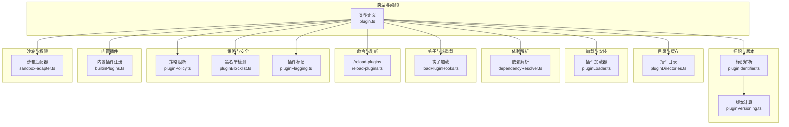
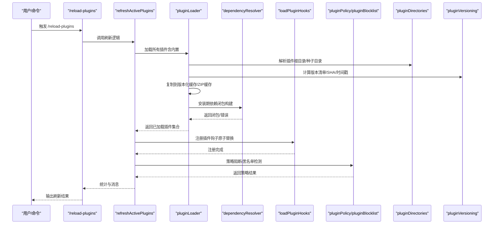
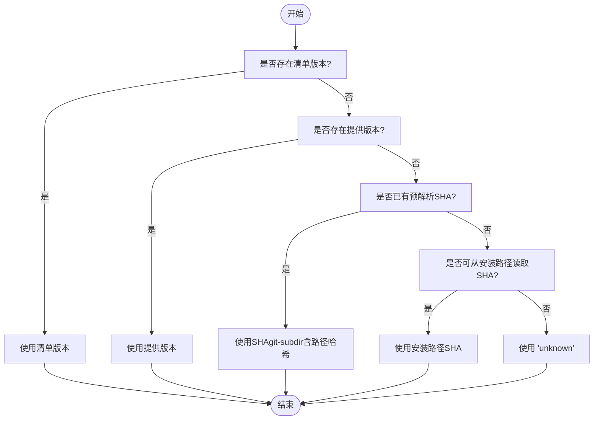
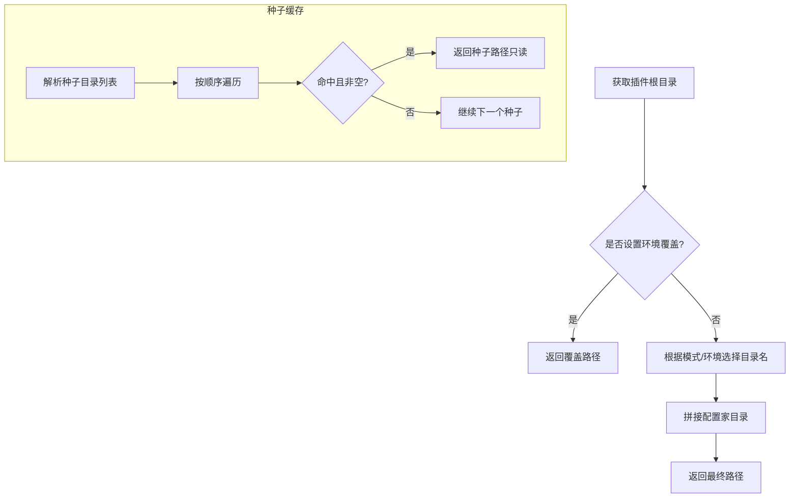
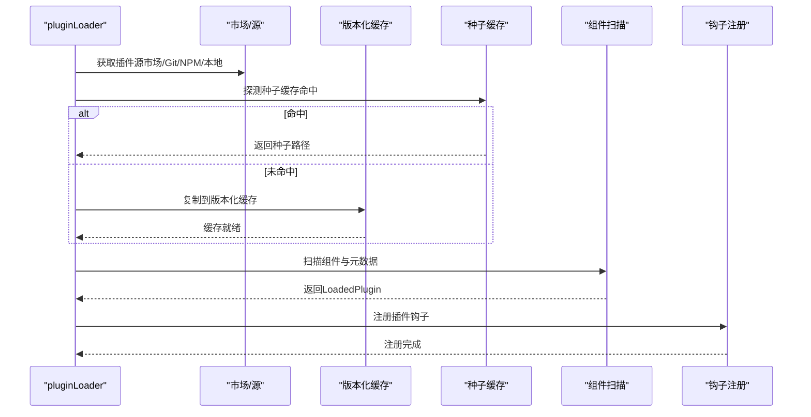
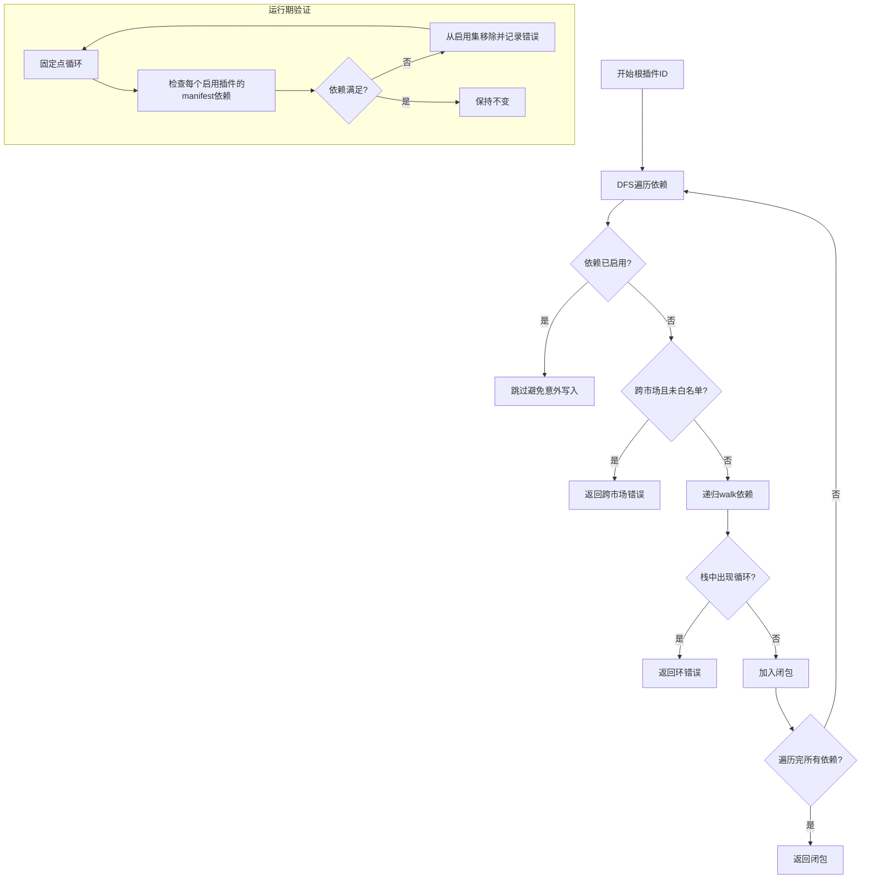
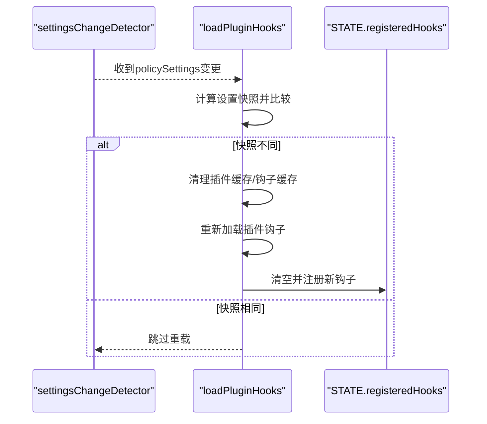
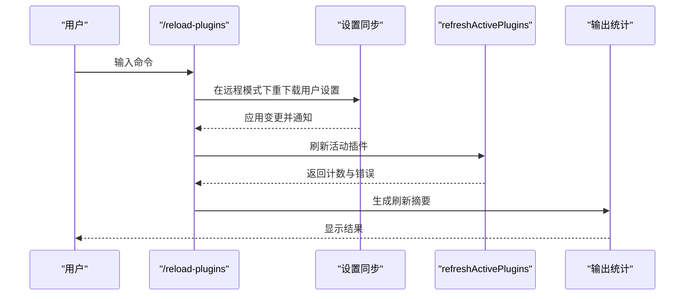
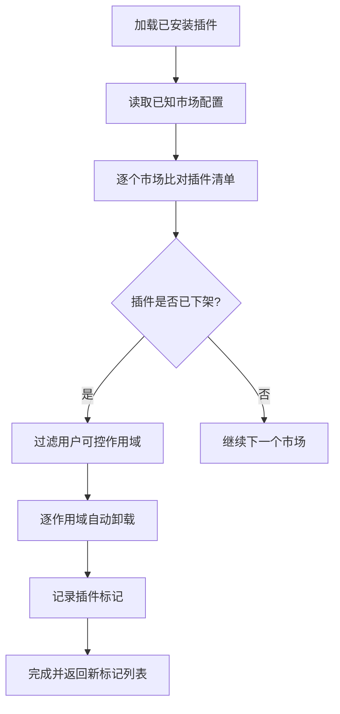
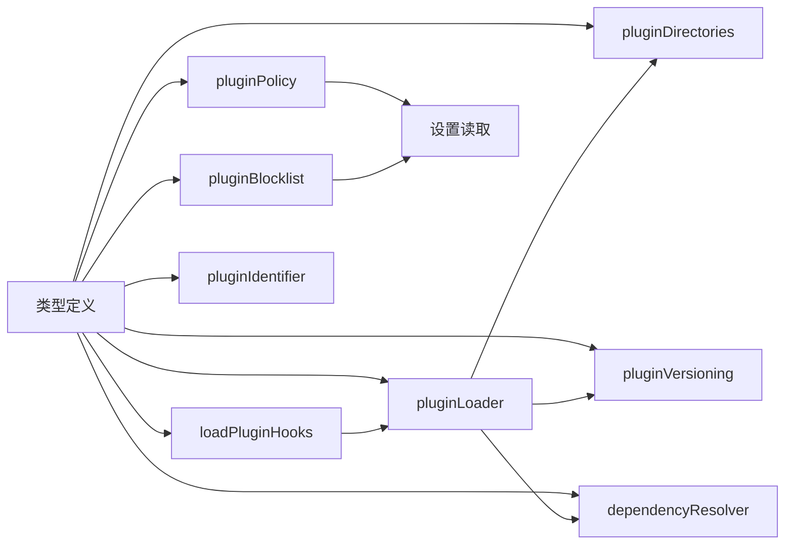

# 插件架构设计

<cite>
**本文档引用的文件**
- [builtinPlugins.ts](file://src/plugins/builtinPlugins.ts)
- [plugin.ts（类型定义）](file://src/types/plugin.ts)
- [pluginLoader.ts](file://src/utils/plugins/pluginLoader.ts)
- [dependencyResolver.ts](file://src/utils/plugins/dependencyResolver.ts)
- [loadPluginHooks.ts](file://src/utils/plugins/loadPluginHooks.ts)
- [pluginIdentifier.ts](file://src/utils/plugins/pluginIdentifier.ts)
- [pluginVersioning.ts](file://src/utils/plugins/pluginVersioning.ts)
- [pluginDirectories.ts](file://src/utils/plugins/pluginDirectories.ts)
- [reload-plugins.ts](file://src/commands/reload-plugins/reload-plugins.ts)
- [pluginPolicy.ts](file://src/utils/plugins/pluginPolicy.ts)
- [pluginBlocklist.ts](file://src/utils/plugins/pluginBlocklist.ts)
- [pluginFlagging.ts](file://src/utils/plugins/pluginFlagging.ts)
- [useManagePlugins.ts](file://src/hooks/useManagePlugins.ts)
- [sandbox-adapter.ts](file://src/utils/sandbox/sandbox-adapter.ts)
</cite>

## 目录
1. [引言](#引言)
2. [项目结构](#项目结构)
3. [核心组件](#核心组件)
4. [架构总览](#架构总览)
5. [详细组件分析](#详细组件分析)
6. [依赖分析](#依赖分析)
7. [性能考虑](#性能考虑)
8. [故障排查指南](#故障排查指南)
9. [结论](#结论)
10. [附录](#附录)

## 引言
本文件系统化阐述该代码库中的插件架构设计，覆盖整体理念、核心架构模式、组件关系、注册与生命周期管理、依赖解析策略、标识符与版本管理、加载/初始化/卸载流程、接口规范与类型定义、与主系统的集成方式、通信协议与数据交换格式、安全模型与权限控制，并提供架构图与组件交互示例，帮助开发者与使用者高效理解并扩展插件体系。

## 项目结构
插件子系统主要由以下层次构成：
- 类型与契约层：定义插件元数据、错误类型、组件类型等
- 标识与版本层：统一插件标识符解析、版本计算与路径映射
- 目录与缓存层：集中管理插件根目录、种子缓存、数据目录
- 加载与安装层：从市场或本地源安装、拷贝到版本化缓存、清单校验
- 依赖解析层：安装期与运行期的依赖闭包构建与一致性校验
- 钩子与热重载层：插件钩子注册、匹配器转换、远程设置变更热重载
- 命令与刷新层：/reload-plugins命令驱动的全量刷新
- 策略与安全层：企业策略阻断、黑名单检测与自动卸载、标记与通知
- 内置插件层：随CLI分发的内置插件注册与启用/禁用
- 沙箱与权限层：运行时沙箱配置与动态更新

**图表来源**
- [plugin.ts（类型定义）:1-364](file://src/types/plugin.ts#L1-L364)
- [pluginIdentifier.ts:1-124](file://src/utils/plugins/pluginIdentifier.ts#L1-L124)
- [pluginVersioning.ts:1-158](file://src/utils/plugins/pluginVersioning.ts#L1-L158)
- [pluginDirectories.ts:1-179](file://src/utils/plugins/pluginDirectories.ts#L1-L179)
- [pluginLoader.ts:1-800](file://src/utils/plugins/pluginLoader.ts#L1-L800)
- [dependencyResolver.ts:1-306](file://src/utils/plugins/dependencyResolver.ts#L1-L306)
- [loadPluginHooks.ts:1-288](file://src/utils/plugins/loadPluginHooks.ts#L1-L288)
- [reload-plugins.ts:1-62](file://src/commands/reload-plugins/reload-plugins.ts#L1-L62)
- [pluginPolicy.ts:1-21](file://src/utils/plugins/pluginPolicy.ts#L1-L21)
- [pluginBlocklist.ts:1-128](file://src/utils/plugins/pluginBlocklist.ts#L1-L128)
- [pluginFlagging.ts:86-144](file://src/utils/plugins/pluginFlagging.ts#L86-L144)
- [builtinPlugins.ts:1-160](file://src/plugins/builtinPlugins.ts#L1-L160)
- [sandbox-adapter.ts:769-803](file://src/utils/sandbox/sandbox-adapter.ts#L769-L803)

**章节来源**
- [plugin.ts（类型定义）:1-364](file://src/types/plugin.ts#L1-L364)
- [pluginDirectories.ts:1-179](file://src/utils/plugins/pluginDirectories.ts#L1-L179)

## 核心组件
- 类型与契约：统一的LoadedPlugin、PluginManifest、PluginError等类型，确保跨模块一致的数据结构与错误语义。
- 标识符系统：支持“名称@市场”格式，内置插件以“@builtin”后缀区分；提供解析、构建与官方市场识别。
- 版本与缓存：基于清单版本、Git提交SHA或时间戳计算版本；使用版本化缓存路径与ZIP缓存优化；支持种子缓存优先读取。
- 目录与数据：集中管理插件根目录、种子目录、持久化数据目录；提供大小统计与清理能力。
- 加载器：支持从市场、Git/GitHub、NPM、会话内插件等多种来源；执行清单校验、重复名检测、错误收集。
- 依赖解析：安装期DFS闭包构建，运行期固定点验证；严格限制跨市场依赖自动安装；支持裸依赖按名称匹配。
- 钩子系统：将插件钩子配置转换为匹配器，注册到全局状态；支持远程设置变更触发的热重载。
- 刷新与命令：/reload-plugins统一刷新命令、代理设置同步与统计输出。
- 安全与策略：企业策略强制阻断、黑名单检测与自动卸载、插件标记与通知。
- 内置插件：随CLI分发的内置插件注册、可用性过滤、启用/禁用状态持久化。
- 沙箱与权限：根据设置动态初始化与更新沙箱配置，订阅设置变化进行热更新。

**章节来源**
- [plugin.ts（类型定义）:48-289](file://src/types/plugin.ts#L48-L289)
- [pluginIdentifier.ts:51-124](file://src/utils/plugins/pluginIdentifier.ts#L51-L124)
- [pluginVersioning.ts:36-158](file://src/utils/plugins/pluginVersioning.ts#L36-L158)
- [pluginDirectories.ts:53-179](file://src/utils/plugins/pluginDirectories.ts#L53-L179)
- [pluginLoader.ts:1-800](file://src/utils/plugins/pluginLoader.ts#L1-L800)
- [dependencyResolver.ts:95-306](file://src/utils/plugins/dependencyResolver.ts#L95-L306)
- [loadPluginHooks.ts:91-288](file://src/utils/plugins/loadPluginHooks.ts#L91-L288)
- [reload-plugins.ts:10-62](file://src/commands/reload-plugins/reload-plugins.ts#L10-L62)
- [pluginPolicy.ts:17-21](file://src/utils/plugins/pluginPolicy.ts#L17-L21)
- [pluginBlocklist.ts:64-128](file://src/utils/plugins/pluginBlocklist.ts#L64-L128)
- [builtinPlugins.ts:28-160](file://src/plugins/builtinPlugins.ts#L28-L160)
- [sandbox-adapter.ts:769-803](file://src/utils/sandbox/sandbox-adapter.ts#L769-L803)

## 架构总览
下图展示了插件系统的关键交互：从命令入口到加载器、依赖解析、钩子注册、以及安全与策略检查；同时体现版本化缓存与种子缓存的路径选择。

**图表来源**
- [reload-plugins.ts:10-62](file://src/commands/reload-plugins/reload-plugins.ts#L10-L62)
- [pluginLoader.ts:1-800](file://src/utils/plugins/pluginLoader.ts#L1-L800)
- [dependencyResolver.ts:95-159](file://src/utils/plugins/dependencyResolver.ts#L95-L159)
- [loadPluginHooks.ts:91-157](file://src/utils/plugins/loadPluginHooks.ts#L91-L157)
- [pluginPolicy.ts:17-21](file://src/utils/plugins/pluginPolicy.ts#L17-L21)
- [pluginBlocklist.ts:64-128](file://src/utils/plugins/pluginBlocklist.ts#L64-L128)
- [pluginDirectories.ts:53-90](file://src/utils/plugins/pluginDirectories.ts#L53-L90)
- [pluginVersioning.ts:36-106](file://src/utils/plugins/pluginVersioning.ts#L36-L106)

## 详细组件分析

### 插件标识符系统与版本管理
- 标识符解析：支持“name@marketplace”格式，内置插件以“@builtin”结尾；提供构建与解析工具函数。
- 官方市场识别：用于遥测脱敏与日志分级。
- 版本计算优先级：清单版本 > 提供版本 > Git提交SHA（含git-subdir路径哈希）> 时间戳 > “unknown”。

**图表来源**
- [pluginVersioning.ts:36-106](file://src/utils/plugins/pluginVersioning.ts#L36-L106)
- [pluginIdentifier.ts:51-82](file://src/utils/plugins/pluginIdentifier.ts#L51-L82)

**章节来源**
- [pluginIdentifier.ts:51-124](file://src/utils/plugins/pluginIdentifier.ts#L51-L124)
- [pluginVersioning.ts:36-158](file://src/utils/plugins/pluginVersioning.ts#L36-L158)

### 插件目录与缓存策略
- 插件根目录：支持通过环境变量覆盖；支持“cowork”模式切换目录名。
- 种子缓存：多层只读回退层，命中即直接使用，避免重复下载与克隆。
- 数据目录：持久化数据目录在插件更新间保留，仅在最后作用域卸载时删除。
- 清理与统计：提供数据目录大小统计与清理能力。

**图表来源**
- [pluginDirectories.ts:53-90](file://src/utils/plugins/pluginDirectories.ts#L53-L90)
- [pluginLoader.ts:195-238](file://src/utils/plugins/pluginLoader.ts#L195-L238)

**章节来源**
- [pluginDirectories.ts:53-179](file://src/utils/plugins/pluginDirectories.ts#L53-L179)
- [pluginLoader.ts:195-287](file://src/utils/plugins/pluginLoader.ts#L195-L287)

### 插件加载流程与初始化
- 发现与来源：市场插件（settings中“name@marketplace”）、会话内插件（--plugin-dir或SDK选项）。
- 清单与校验：解析plugin.json，校验字段与结构；重复命名检测；错误收集。
- 安装与缓存：根据来源克隆/复制至版本化缓存；移除.git；可选ZIP缓存；种子命中则直接使用。
- 组件发现：扫描commands/agents/skills/hooks等目录，合并元数据。
- 初始化：注册钩子、启动MCP/LSP服务器、注入环境变量（含数据目录）。

**图表来源**
- [pluginLoader.ts:365-465](file://src/utils/plugins/pluginLoader.ts#L365-L465)
- [pluginDirectories.ts:97-123](file://src/utils/plugins/pluginDirectories.ts#L97-L123)
- [loadPluginHooks.ts:91-157](file://src/utils/plugins/loadPluginHooks.ts#L91-L157)

**章节来源**
- [pluginLoader.ts:1-800](file://src/utils/plugins/pluginLoader.ts#L1-L800)
- [loadPluginHooks.ts:91-157](file://src/utils/plugins/loadPluginHooks.ts#L91-L157)

### 依赖解析策略与生命周期
- 安装期解析：DFS遍历依赖闭包，跳过已启用依赖；禁止跨市场自动安装；支持允许白名单；检测环依赖。
- 运行期验证：固定点迭代，若依赖不满足则降级禁用插件；记录错误类型便于诊断。
- 反向依赖查询：卸载/禁用前提示被哪些插件依赖，避免破坏性操作。
- 生命周期：安装/启用 → 运行期加载 → 卸载/禁用；/reload-plugins统一刷新。

**图表来源**
- [dependencyResolver.ts:95-159](file://src/utils/plugins/dependencyResolver.ts#L95-L159)
- [dependencyResolver.ts:177-234](file://src/utils/plugins/dependencyResolver.ts#L177-L234)

**章节来源**
- [dependencyResolver.ts:95-306](file://src/utils/plugins/dependencyResolver.ts#L95-L306)

### 钩子系统与热重载
- 匹配器转换：将插件钩子配置转换为事件到匹配器的映射，携带插件上下文（根路径、名称、ID）。
- 注册与原子替换：先清空再注册，保证旧钩子在新钩子生效前仍有效。
- 热重载：监听policySettings变化，比较影响设置快照，必要时清理缓存并重新加载钩子。

**图表来源**
- [loadPluginHooks.ts:255-287](file://src/utils/plugins/loadPluginHooks.ts#L255-L287)
- [loadPluginHooks.ts:91-157](file://src/utils/plugins/loadPluginHooks.ts#L91-L157)

**章节来源**
- [loadPluginHooks.ts:255-287](file://src/utils/plugins/loadPluginHooks.ts#L255-L287)

### 插件刷新与卸载机制
- 刷新命令：/reload-plugins统一刷新，拉取用户设置（远程模式）、统计插件/技能/钩子/MCP/LSP数量，失败时提示/doctor。
- 卸载：支持按作用域卸载；最后作用域卸载时清理持久化数据目录；反向依赖提示。

**图表来源**
- [reload-plugins.ts:10-62](file://src/commands/reload-plugins/reload-plugins.ts#L10-L62)

**章节来源**
- [reload-plugins.ts:10-62](file://src/commands/reload-plugins/reload-plugins.ts#L10-L62)

### 插件安全模型与权限控制
- 企业策略阻断：managed scope强制禁用插件，阻止用户安装/启用。
- 黑名单检测：检测市场中已下架插件，自动卸载用户可控作用域并标记。
- 插件标记：记录“见过但已下架”的插件，带过期清理。
- 沙箱与权限：根据设置动态初始化/更新沙箱配置，订阅设置变化进行热更新。

**图表来源**
- [pluginBlocklist.ts:64-128](file://src/utils/plugins/pluginBlocklist.ts#L64-L128)
- [pluginFlagging.ts:117-144](file://src/utils/plugins/pluginFlagging.ts#L117-L144)
- [pluginPolicy.ts:17-21](file://src/utils/plugins/pluginPolicy.ts#L17-L21)
- [sandbox-adapter.ts:769-803](file://src/utils/sandbox/sandbox-adapter.ts#L769-L803)

**章节来源**
- [pluginPolicy.ts:17-21](file://src/utils/plugins/pluginPolicy.ts#L17-L21)
- [pluginBlocklist.ts:64-128](file://src/utils/plugins/pluginBlocklist.ts#L64-L128)
- [pluginFlagging.ts:86-144](file://src/utils/plugins/pluginFlagging.ts#L86-L144)
- [sandbox-adapter.ts:769-803](file://src/utils/sandbox/sandbox-adapter.ts#L769-L803)

### 内置插件与UI集成
- 注册与可用性：内置插件在启动时注册，按系统能力过滤；默认启用状态可配置。
- UI呈现：/plugin界面显示内置插件，支持启用/禁用并持久化到用户设置。
- 技能聚合：内置插件提供的技能作为命令对象参与UI与交互。

**章节来源**
- [builtinPlugins.ts:28-160](file://src/plugins/builtinPlugins.ts#L28-L160)

## 依赖分析
- 组件耦合：类型定义为所有模块的共同契约；加载器依赖目录、版本、市场与安装辅助；依赖解析独立于I/O；钩子系统依赖加载器结果；策略与安全模块通过设置读取实现解耦。
- 外部依赖：git、npm等外部工具调用；文件系统操作；设置变更检测器。
- 循环依赖规避：策略与安全模块仅依赖设置读取，避免与市场管理形成环路。

**图表来源**
- [plugin.ts（类型定义）:1-364](file://src/types/plugin.ts#L1-L364)
- [pluginLoader.ts:1-800](file://src/utils/plugins/pluginLoader.ts#L1-L800)
- [dependencyResolver.ts:1-306](file://src/utils/plugins/dependencyResolver.ts#L1-L306)
- [loadPluginHooks.ts:1-288](file://src/utils/plugins/loadPluginHooks.ts#L1-L288)
- [pluginPolicy.ts:1-21](file://src/utils/plugins/pluginPolicy.ts#L1-L21)
- [pluginBlocklist.ts:1-128](file://src/utils/plugins/pluginBlocklist.ts#L1-L128)
- [pluginDirectories.ts:1-179](file://src/utils/plugins/pluginDirectories.ts#L1-L179)
- [pluginVersioning.ts:1-158](file://src/utils/plugins/pluginVersioning.ts#L1-L158)
- [pluginIdentifier.ts:1-124](file://src/utils/plugins/pluginIdentifier.ts#L1-L124)

**章节来源**
- [plugin.ts（类型定义）:1-364](file://src/types/plugin.ts#L1-L364)

## 性能考虑
- 版本化缓存与ZIP缓存：减少重复下载与克隆，提升安装与加载速度。
- 种子缓存优先：在容器/镜像场景显著降低首次加载延迟。
- 固定点验证：运行期一次性固定点迭代，避免多次全量扫描。
- 钩子缓存与原子替换：减少重复注册开销，保证切换期间钩子连续性。
- 设置快照比较：热重载仅在实际变更时触发，避免无谓刷新。

## 故障排查指南
- 错误类型：涵盖路径不存在、Git认证失败、网络错误、清单解析/校验失败、市场不可用、MCP/LSP配置无效/启动失败、依赖不满足、缓存缺失等。
- 诊断建议：
  - 使用/doctor查看具体错误类型与上下文。
  - 检查插件清单字段与路径存在性。
  - 核对市场访问权限与网络连通性。
  - 查看依赖闭包与反向依赖提示。
  - 确认策略阻断与黑名单状态。
  - 关注钩子热重载是否因设置快照未变化而跳过。

**章节来源**
- [plugin.ts（类型定义）:101-283](file://src/types/plugin.ts#L101-L283)

## 结论
该插件架构以类型契约为核心，结合严格的标识符与版本管理、可配置的目录与缓存策略、健壮的依赖解析与运行期验证、灵活的钩子系统与热重载、以及完善的安全与策略控制，形成了高可扩展、可维护、可审计的插件生态。通过统一的刷新命令与清晰的生命周期管理，既满足用户交互需求，也保障了系统稳定性与安全性。

## 附录
- 插件接口规范与类型定义：参考LoadedPlugin、PluginManifest、PluginError、PluginComponent等类型定义。
- 配置结构：插件清单（plugin.json）字段、设置项（enabledPlugins、marketplaces等）。
- 数据交换格式：JSON清单、设置文件、遥测日志。
- 集成方式：命令入口（/reload-plugins）、钩子注册、MCP/LSP服务、内置插件注册。

**章节来源**
- [plugin.ts（类型定义）:48-289](file://src/types/plugin.ts#L48-L289)