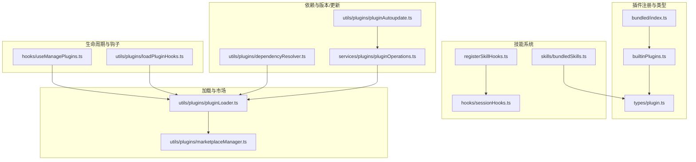
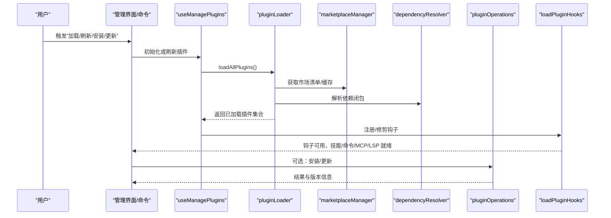
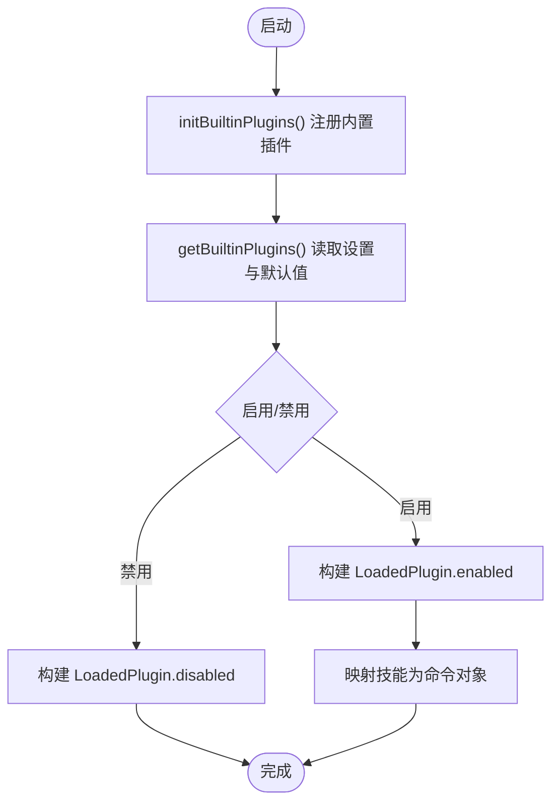
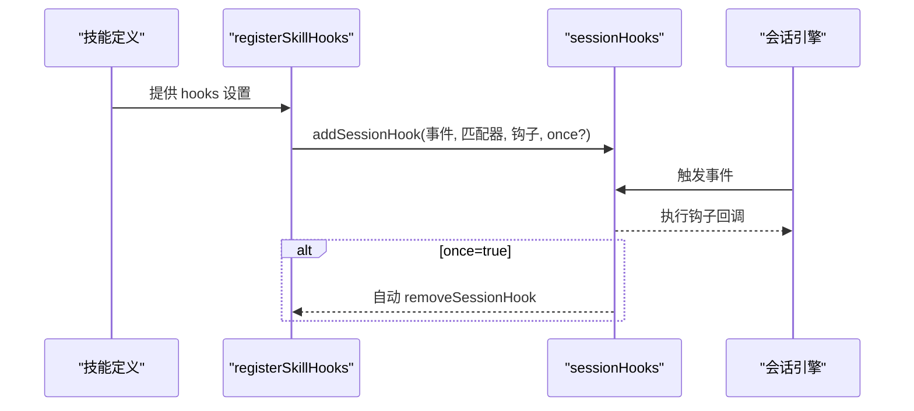
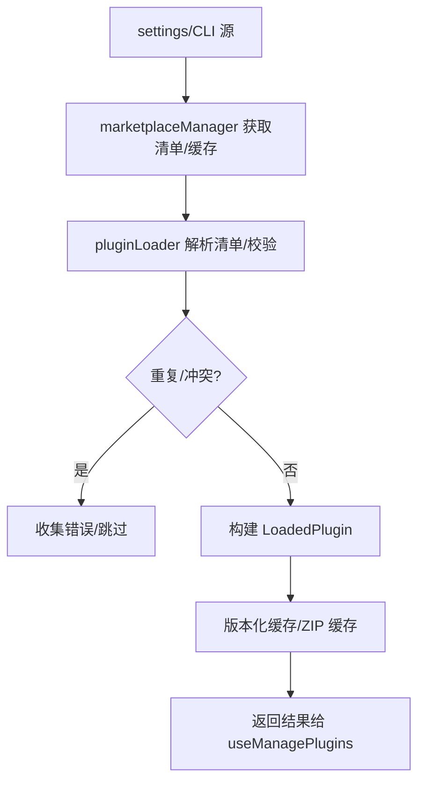
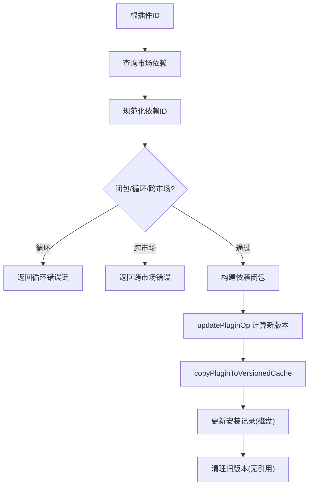
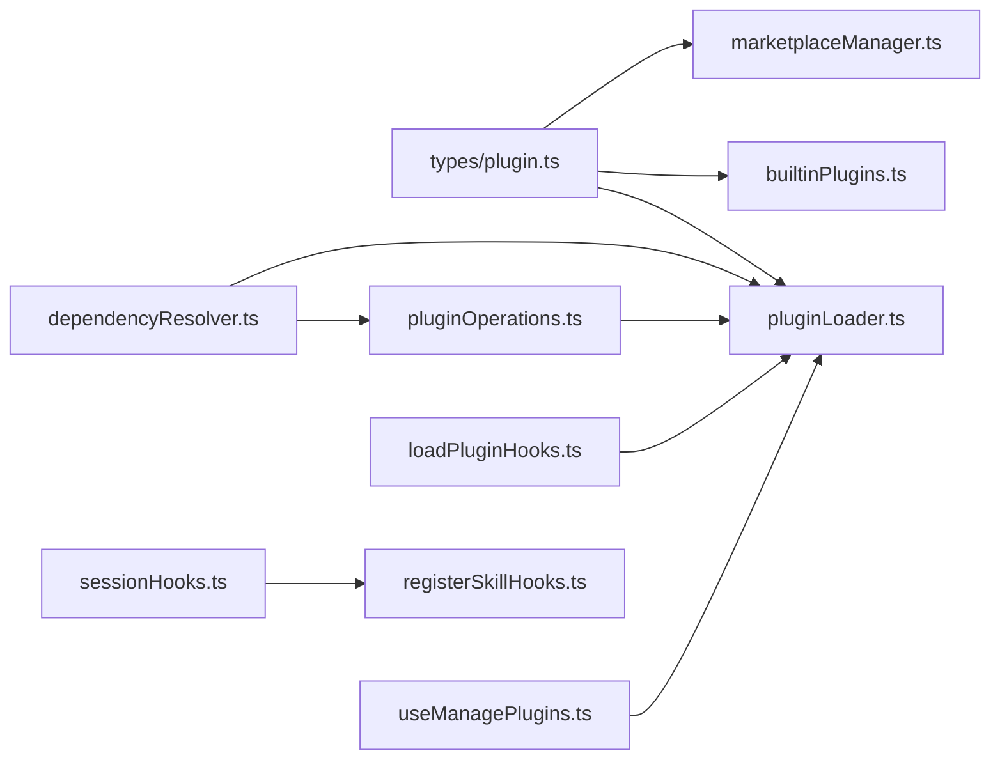

# 插件系统

<cite>
**本文引用的文件**   
- [builtinPlugins.ts](file://src/plugins/builtinPlugins.ts)
- [index.ts](file://src/plugins/bundled/index.ts)
- [plugin.ts](file://src/types/plugin.ts)
- [bundledSkills.ts](file://src/skills/bundledSkills.ts)
- [useManagePlugins.ts](file://src/hooks/useManagePlugins.ts)
- [loadPluginHooks.ts](file://src/utils/plugins/loadPluginHooks.ts)
- [sessionHooks.ts](file://src/utils/hooks/sessionHooks.ts)
- [registerSkillHooks.ts](file://src/utils/hooks/registerSkillHooks.ts)
- [pluginLoader.ts](file://src/utils/plugins/pluginLoader.ts)
- [marketplaceManager.ts](file://src/utils/plugins/marketplaceManager.ts)
- [dependencyResolver.ts](file://src/utils/plugins/dependencyResolver.ts)
- [pluginAutoupdate.ts](file://src/utils/plugins/pluginAutoupdate.ts)
- [pluginOperations.ts](file://src/services/plugins/pluginOperations.ts)
- [pluginFlagging.ts](file://src/utils/plugins/pluginFlagging.ts)
</cite>

## 目录
1. [简介](#简介)
2. [项目结构](#项目结构)
3. [核心组件](#核心组件)
4. [架构总览](#架构总览)
5. [详细组件分析](#详细组件分析)
6. [依赖关系分析](#依赖关系分析)
7. [性能考量](#性能考量)
8. [故障排查指南](#故障排查指南)
9. [结论](#结论)
10. [附录：开发指南与最佳实践](#附录开发指南与最佳实践)

## 简介
本文件系统性阐述 Claude Code 的插件体系：设计理念、注册机制、生命周期管理、内置插件与技能系统、钩子机制、依赖解析与版本管理、更新策略、与工具系统的集成、权限与安全、以及面向开发者的实践指南。目标是帮助开发者快速理解并高效扩展插件生态。

## 项目结构
插件系统由“内置插件注册中心”“市场与安装管理”“加载与生命周期”“钩子与技能系统”“依赖与版本/更新”等模块协同构成。关键目录与文件如下：
- 插件注册与内置插件：src/plugins/builtinPlugins.ts、src/plugins/bundled/index.ts
- 类型与错误模型：src/types/plugin.ts
- 技能系统（内置技能）：src/skills/bundledSkills.ts
- 钩子系统：src/utils/hooks/sessionHooks.ts、src/utils/hooks/registerSkillHooks.ts、src/utils/plugins/loadPluginHooks.ts
- 插件加载与市场：src/utils/plugins/pluginLoader.ts、src/utils/plugins/marketplaceManager.ts
- 依赖解析与版本/更新：src/utils/plugins/dependencyResolver.ts、src/utils/plugins/pluginAutoupdate.ts、src/services/plugins/pluginOperations.ts
- 生命周期与状态：src/hooks/useManagePlugins.ts
- 安全与标记：src/utils/plugins/pluginFlagging.ts

**图表来源**
- [builtinPlugins.ts:1-160](file://src/plugins/builtinPlugins.ts#L1-L160)
- [index.ts:1-24](file://src/plugins/bundled/index.ts#L1-L24)
- [plugin.ts:1-364](file://src/types/plugin.ts#L1-L364)
- [bundledSkills.ts:1-221](file://src/skills/bundledSkills.ts#L1-L221)
- [registerSkillHooks.ts:1-64](file://src/utils/hooks/registerSkillHooks.ts#L1-L64)
- [sessionHooks.ts:1-320](file://src/utils/hooks/sessionHooks.ts#L1-L320)
- [pluginLoader.ts:1-200](file://src/utils/plugins/pluginLoader.ts#L1-L200)
- [marketplaceManager.ts:1-200](file://src/utils/plugins/marketplaceManager.ts#L1-L200)
- [loadPluginHooks.ts:159-287](file://src/utils/plugins/loadPluginHooks.ts#L159-L287)
- [dependencyResolver.ts:27-104](file://src/utils/plugins/dependencyResolver.ts#L27-L104)
- [pluginAutoupdate.ts:114-138](file://src/utils/plugins/pluginAutoupdate.ts#L114-L138)
- [pluginOperations.ts:809-1054](file://src/services/plugins/pluginOperations.ts#L809-L1054)

**章节来源**
- [builtinPlugins.ts:1-160](file://src/plugins/builtinPlugins.ts#L1-L160)
- [index.ts:1-24](file://src/plugins/bundled/index.ts#L1-L24)
- [plugin.ts:1-364](file://src/types/plugin.ts#L1-L364)

## 核心组件
- 内置插件注册中心：负责内置插件的注册、可用性判断、启用状态持久化、聚合为 LoadedPlugin 并映射为命令对象。
- 市场与安装管理：负责已知市场的声明与缓存、插件清单拉取与校验、安装路径与版本化缓存、离线/种子缓存探测。
- 加载器：统一处理插件发现、清单解析、重复检测、组件加载、错误收集与报告。
- 钩子系统：支持会话级与持久化钩子，按事件分发，支持一次性钩子自动清理。
- 技能系统：内置技能注册与运行时提示构造，支持引用文件提取到受控目录。
- 依赖解析与版本/更新：跨市场依赖约束、循环依赖检测、版本闭包计算、非就地更新策略。
- 生命周期与状态：初始化加载、刷新与热重载、插件禁用/卸载后的钩子修剪、标记插件的过期与通知。

**章节来源**
- [builtinPlugins.ts:25-121](file://src/plugins/builtinPlugins.ts#L25-L121)
- [pluginLoader.ts:1-200](file://src/utils/plugins/pluginLoader.ts#L1-L200)
- [marketplaceManager.ts:1-200](file://src/utils/plugins/marketplaceManager.ts#L1-L200)
- [sessionHooks.ts:1-320](file://src/utils/hooks/sessionHooks.ts#L1-L320)
- [bundledSkills.ts:1-221](file://src/skills/bundledSkills.ts#L1-L221)
- [dependencyResolver.ts:27-104](file://src/utils/plugins/dependencyResolver.ts#L27-L104)
- [pluginAutoupdate.ts:114-138](file://src/utils/plugins/pluginAutoupdate.ts#L114-L138)
- [pluginOperations.ts:809-1054](file://src/services/plugins/pluginOperations.ts#L809-L1054)
- [useManagePlugins.ts:26-55](file://src/hooks/useManagePlugins.ts#L26-L55)
- [loadPluginHooks.ts:159-287](file://src/utils/plugins/loadPluginHooks.ts#L159-L287)
- [pluginFlagging.ts:86-144](file://src/utils/plugins/pluginFlagging.ts#L86-L144)

## 架构总览
下图展示了从用户操作到插件加载、钩子注册、组件生效的端到端流程。

**图表来源**
- [useManagePlugins.ts:26-55](file://src/hooks/useManagePlugins.ts#L26-L55)
- [pluginLoader.ts:1-200](file://src/utils/plugins/pluginLoader.ts#L1-L200)
- [marketplaceManager.ts:1-200](file://src/utils/plugins/marketplaceManager.ts#L1-L200)
- [dependencyResolver.ts:27-104](file://src/utils/plugins/dependencyResolver.ts#L27-L104)
- [pluginOperations.ts:809-1054](file://src/services/plugins/pluginOperations.ts#L809-L1054)
- [loadPluginHooks.ts:159-287](file://src/utils/plugins/loadPluginHooks.ts#L159-L287)

## 详细组件分析

### 内置插件注册与生命周期
- 设计理念
  - 内置插件通过注册中心集中管理，支持用户在 /plugin 界面启停，并持久化到设置中。
  - 与“捆绑技能”不同，内置插件可被用户显式开关，适合需要用户感知与选择的特性。
- 关键流程
  - 启动时调用初始化函数注册内置插件。
  - 按用户设置与默认值决定启用状态，生成 LoadedPlugin 并注入钩子/MCP 等配置。
  - 将内置插件中的技能映射为命令对象，供技能工具使用。
- 生命周期
  - 初次加载：useManagePlugins 在挂载时执行初始加载，运行去列与标记插件通知，不自动刷新 MCP。
  - 刷新：通过 /reload-plugins 调用 refreshActivePlugins()，统一交换命令/代理/钩子/MCP。
  - 钩子修剪：对禁用/卸载插件进行钩子修剪，避免残留回调。

**图表来源**
- [index.ts:18-24](file://src/plugins/bundled/index.ts#L18-L24)
- [builtinPlugins.ts:52-121](file://src/plugins/builtinPlugins.ts#L52-L121)

**章节来源**
- [builtinPlugins.ts:1-160](file://src/plugins/builtinPlugins.ts#L1-L160)
- [index.ts:1-24](file://src/plugins/bundled/index.ts#L1-L24)
- [useManagePlugins.ts:26-55](file://src/hooks/useManagePlugins.ts#L26-L55)

### 技能系统与钩子机制
- 技能系统
  - 内置技能以“捆绑技能”形式注册，具备名称、描述、别名、工具限制、模型、是否允许用户调用等元数据。
  - 支持在首次调用时将参考文件解压到受控目录，并在提示前缀中注入基目录，便于模型按需读取/搜索。
- 钩子机制
  - 会话级钩子：按事件与匹配器注册，支持一次性钩子自动移除；适合临时拦截与增强。
  - 技能级钩子：从技能 frontmatter 中读取，注册为会话钩子，支持 once 行为。
  - 钩子热重载：当影响插件的策略设置变化时，清理缓存并重新加载钩子，保持一致性。

**图表来源**
- [bundledSkills.ts:1-221](file://src/skills/bundledSkills.ts#L1-L221)
- [registerSkillHooks.ts:1-64](file://src/utils/hooks/registerSkillHooks.ts#L1-L64)
- [sessionHooks.ts:1-320](file://src/utils/hooks/sessionHooks.ts#L1-L320)

**章节来源**
- [bundledSkills.ts:1-221](file://src/skills/bundledSkills.ts#L1-L221)
- [registerSkillHooks.ts:1-64](file://src/utils/hooks/registerSkillHooks.ts#L1-L64)
- [sessionHooks.ts:1-320](file://src/utils/hooks/sessionHooks.ts#L1-L320)
- [loadPluginHooks.ts:159-287](file://src/utils/plugins/loadPluginHooks.ts#L159-L287)

### 插件加载与市场管理
- 发现与来源
  - 市场优先：settings 中记录的 plugin@marketplace 形式插件。
  - 会话/内联：通过 --plugin-dir 或 SDK 插件选项提供的内联插件。
- 清单与校验
  - 插件清单解析与模式校验，重复名称检测，错误收集与类型化错误消息。
- 缓存与离线
  - 版本化缓存目录，ZIP 缓存，种子目录探测，提升加载速度与离线可用性。
- 去列与标记
  - 初次加载执行去列与标记插件通知；后续刷新通过统一入口交换组件。

**图表来源**
- [pluginLoader.ts:1-200](file://src/utils/plugins/pluginLoader.ts#L1-L200)
- [marketplaceManager.ts:1-200](file://src/utils/plugins/marketplaceManager.ts#L1-L200)

**章节来源**
- [pluginLoader.ts:1-200](file://src/utils/plugins/pluginLoader.ts#L1-L200)
- [marketplaceManager.ts:1-200](file://src/utils/plugins/marketplaceManager.ts#L1-L200)
- [useManagePlugins.ts:26-55](file://src/hooks/useManagePlugins.ts#L26-L55)

### 依赖解析、版本管理与更新策略
- 依赖解析
  - 规范化依赖标识（含市场后缀），跨市场依赖禁止，循环依赖检测，返回闭包或错误链。
- 版本管理
  - 版本化缓存路径，支持 ZIP 缓存；根据安装路径与版本号判定是否已是最新。
- 更新策略
  - 非就地更新：下载/复制到新版本缓存，更新磁盘安装记录（内存不变直到重启），清理未被引用的旧版本。
  - 自动更新：遍历安装范围逐个尝试更新，记录成功/失败与版本变更。

**图表来源**
- [dependencyResolver.ts:27-104](file://src/utils/plugins/dependencyResolver.ts#L27-L104)
- [pluginOperations.ts:809-1054](file://src/services/plugins/pluginOperations.ts#L809-L1054)
- [pluginAutoupdate.ts:114-138](file://src/utils/plugins/pluginAutoupdate.ts#L114-L138)

**章节来源**
- [dependencyResolver.ts:27-104](file://src/utils/plugins/dependencyResolver.ts#L27-L104)
- [pluginOperations.ts:809-1054](file://src/services/plugins/pluginOperations.ts#L809-L1054)
- [pluginAutoupdate.ts:114-138](file://src/utils/plugins/pluginAutoupdate.ts#L114-L138)

### 与工具系统的集成、权限与安全
- 工具集成
  - 插件可提供命令、代理、技能、输出样式、钩子、MCP/LSP 服务器等组件；这些组件在刷新时统一交换，确保一致性。
- 权限与安全
  - 内置技能的引用文件写入采用安全写入策略（权限掩码、防符号链接、排他写入），防止路径逃逸与越权写入。
  - 插件标记系统支持过期清理与磁盘落盘，避免长期驻留的潜在风险。
- 策略与合规
  - 市场来源白名单/黑名单与严格已知市场列表，阻止企业策略不允许的来源；对被标记插件发出通知。

**章节来源**
- [bundledSkills.ts:169-193](file://src/skills/bundledSkills.ts#L169-L193)
- [pluginFlagging.ts:86-144](file://src/utils/plugins/pluginFlagging.ts#L86-L144)
- [marketplaceManager.ts:1-200](file://src/utils/plugins/marketplaceManager.ts#L1-L200)

## 依赖关系分析
- 组件耦合
  - 内置插件注册中心与类型系统紧密耦合；与设置系统交互以读取启用状态与默认值。
  - 加载器依赖市场管理器、依赖解析器、版本计算与缓存工具；与错误模型强关联。
  - 钩子系统与生命周期钩子管理器配合，支持热重载与修剪。
- 外部依赖
  - 市场来源可能涉及网络请求与 Git 操作；错误分类覆盖网络、Git、清单解析/验证等。
- 循环依赖规避
  - 依赖解析阶段明确禁止跨市场依赖与循环依赖；钩子修剪避免卸载后残留。

**图表来源**
- [plugin.ts:1-364](file://src/types/plugin.ts#L1-L364)
- [builtinPlugins.ts:1-160](file://src/plugins/builtinPlugins.ts#L1-L160)
- [pluginLoader.ts:1-200](file://src/utils/plugins/pluginLoader.ts#L1-L200)
- [marketplaceManager.ts:1-200](file://src/utils/plugins/marketplaceManager.ts#L1-L200)
- [dependencyResolver.ts:27-104](file://src/utils/plugins/dependencyResolver.ts#L27-L104)
- [pluginOperations.ts:809-1054](file://src/services/plugins/pluginOperations.ts#L809-L1054)
- [loadPluginHooks.ts:159-287](file://src/utils/plugins/loadPluginHooks.ts#L159-L287)
- [useManagePlugins.ts:26-55](file://src/hooks/useManagePlugins.ts#L26-L55)
- [sessionHooks.ts:1-320](file://src/utils/hooks/sessionHooks.ts#L1-L320)
- [registerSkillHooks.ts:1-64](file://src/utils/hooks/registerSkillHooks.ts#L1-L64)

**章节来源**
- [plugin.ts:1-364](file://src/types/plugin.ts#L1-L364)
- [builtinPlugins.ts:1-160](file://src/plugins/builtinPlugins.ts#L1-L160)
- [pluginLoader.ts:1-200](file://src/utils/plugins/pluginLoader.ts#L1-L200)
- [marketplaceManager.ts:1-200](file://src/utils/plugins/marketplaceManager.ts#L1-L200)
- [dependencyResolver.ts:27-104](file://src/utils/plugins/dependencyResolver.ts#L27-L104)
- [pluginOperations.ts:809-1054](file://src/services/plugins/pluginOperations.ts#L809-L1054)
- [loadPluginHooks.ts:159-287](file://src/utils/plugins/loadPluginHooks.ts#L159-L287)
- [useManagePlugins.ts:26-55](file://src/hooks/useManagePlugins.ts#L26-L55)
- [sessionHooks.ts:1-320](file://src/utils/hooks/sessionHooks.ts#L1-L320)
- [registerSkillHooks.ts:1-64](file://src/utils/hooks/registerSkillHooks.ts#L1-L64)

## 性能考量
- 缓存与离线
  - 版本化缓存与 ZIP 缓存显著降低重复安装成本；种子目录可加速冷启动。
- 并行与懒加载
  - 插件加载采用并行处理；钩子缓存与懒加载减少常驻内存开销。
- 修剪与热重载
  - 禁用/卸载插件后及时修剪钩子，避免无效回调；策略变更触发最小化热重载。
- I/O 安全
  - 写入采用安全模式与权限控制，避免竞态与路径逃逸导致的额外重试与失败。

[本节为通用指导，无需列出具体文件来源]

## 故障排查指南
- 常见错误类型
  - 路径不存在、网络错误、Git 认证失败/超时、清单解析/验证失败、市场不可用/被策略阻断、依赖不满足、MCP/LSP 配置无效/启动失败/超时/崩溃等。
- 错误消息与定位
  - 使用统一的错误类型与消息格式化函数，便于日志与 UI 展示；错误包含源、插件、组件、路径等上下文。
- 排查步骤
  - 确认市场来源与策略限制；检查网络/Git 可达性；查看缓存命中情况；核对依赖闭包与跨市场限制；检查 MCP/LSP 配置与进程状态；必要时清理缓存与重新安装。

**章节来源**
- [plugin.ts:101-283](file://src/types/plugin.ts#L101-L283)
- [pluginLoader.ts:2038-2086](file://src/utils/plugins/pluginLoader.ts#L2038-L2086)

## 结论
Claude Code 的插件系统以“内置插件注册中心 + 市场与安装管理 + 统一加载器 + 钩子与技能系统 + 依赖与版本/更新”的架构实现了高可扩展性与安全性。通过类型化错误、版本化缓存、非就地更新与热重载机制，系统在易用性与稳定性之间取得平衡。开发者可基于内置插件与技能框架快速扩展能力，同时遵循依赖与安全约束，确保生态健康有序。

[本节为总结，无需列出具体文件来源]

## 附录：开发指南与最佳实践

### 开发步骤
- 新增内置插件
  - 在初始化函数中注册插件定义，包含名称、描述、版本、可用性判断、默认启用状态、技能/钩子/MCP 配置。
  - 若需用户可切换，使用内置插件；若为自动启用或复杂设置，考虑“捆绑技能”。
- 实现技能
  - 定义技能元数据与提示构造函数；如需引用文件，提供文件映射并在首次调用时解压至受控目录。
  - 在技能 frontmatter 中声明钩子，以便会话期间自动注册。
- 集成钩子
  - 使用会话钩子 API 注册/移除钩子；对一次性钩子利用自动移除逻辑。
  - 对策略设置变化敏感的场景，启用钩子热重载。
- 依赖与版本
  - 在依赖解析中规范依赖标识，避免跨市场依赖与循环；更新时采用非就地策略，保留旧版本直至确认稳定。
- 安装与更新
  - 通过服务层操作安装/更新；关注版本闭包与缓存路径；失败时清理临时产物并回退。

**章节来源**
- [builtinPlugins.ts:25-121](file://src/plugins/builtinPlugins.ts#L25-L121)
- [index.ts:18-24](file://src/plugins/bundled/index.ts#L18-L24)
- [bundledSkills.ts:1-221](file://src/skills/bundledSkills.ts#L1-L221)
- [registerSkillHooks.ts:1-64](file://src/utils/hooks/registerSkillHooks.ts#L1-L64)
- [sessionHooks.ts:1-320](file://src/utils/hooks/sessionHooks.ts#L1-L320)
- [dependencyResolver.ts:27-104](file://src/utils/plugins/dependencyResolver.ts#L27-L104)
- [pluginOperations.ts:809-1054](file://src/services/plugins/pluginOperations.ts#L809-L1054)

### 最佳实践
- 明确职责边界：内置插件面向用户可感知功能；捆绑技能面向内置能力。
- 严控 I/O：使用安全写入与权限控制，避免路径逃逸；对大文件采用 ZIP 缓存。
- 依赖最小化：避免跨市场依赖；尽量使用官方市场；严格校验依赖闭包。
- 可观测性：充分利用类型化错误与日志；在 UI 中展示关键错误与建议。
- 安全策略：遵守企业策略限制；对被标记插件及时处理；定期清理过期缓存。

[本节为通用指导，无需列出具体文件来源]