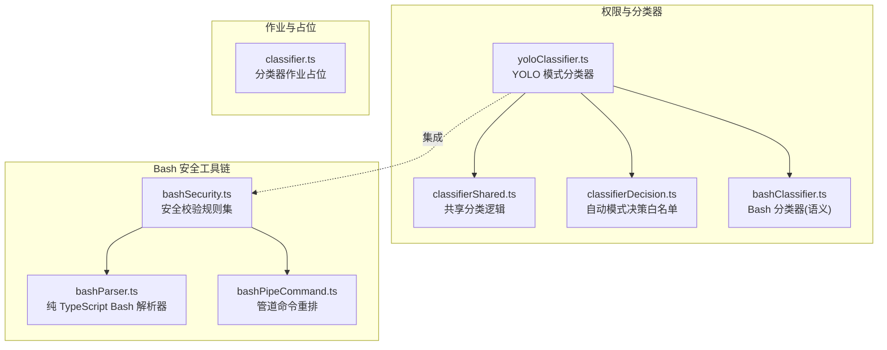
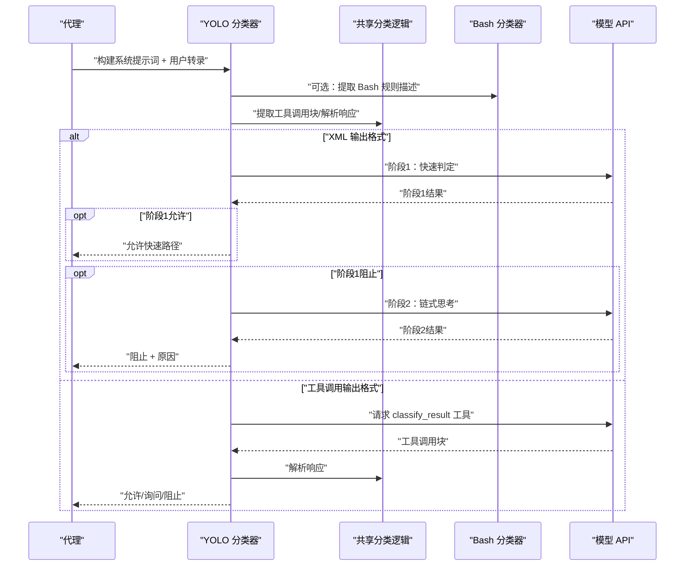
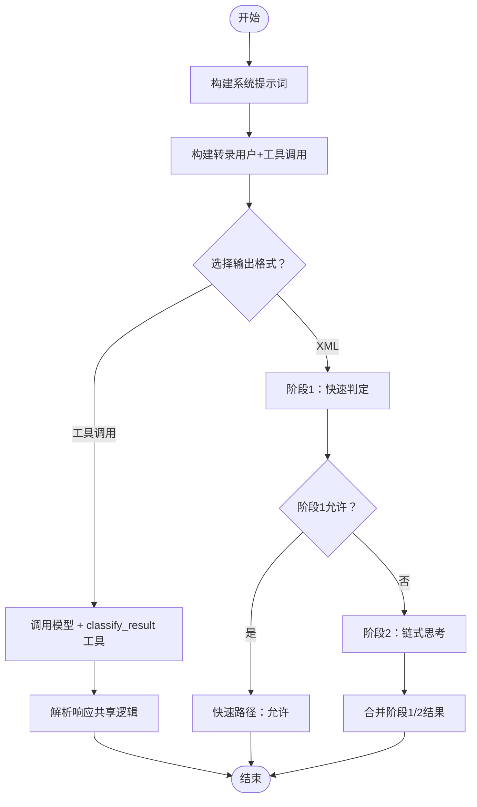
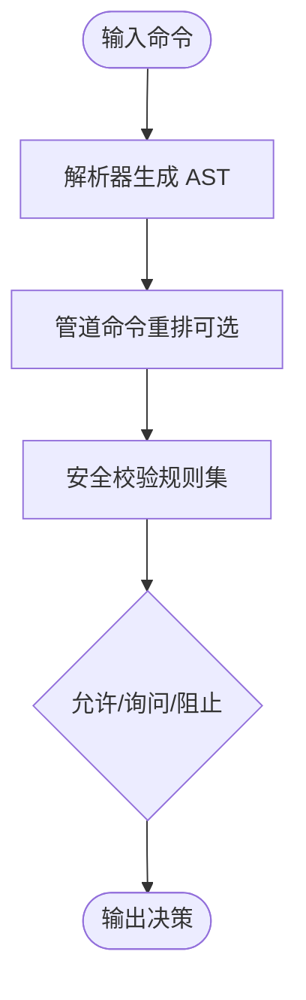
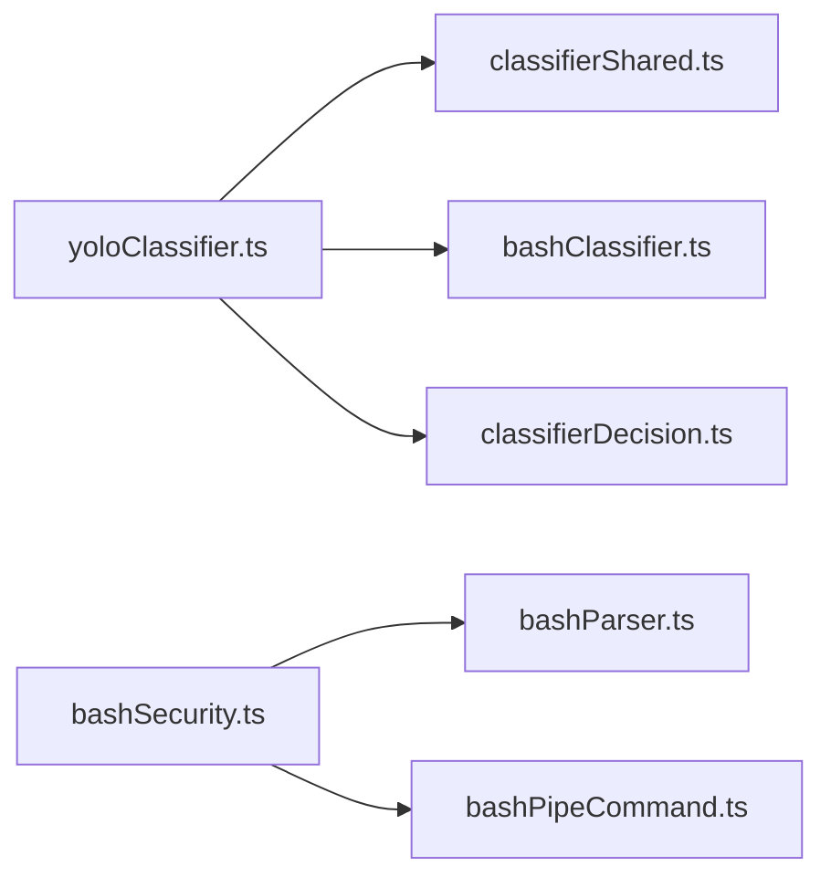
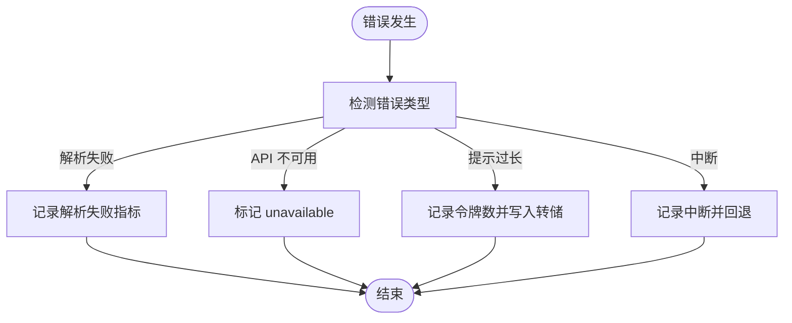

# 安全分类与威胁检测

<cite>
**本文引用的文件**
- [src/utils/permissions/yoloClassifier.ts](file://src/utils/permissions/yoloClassifier.ts)
- [src/utils/permissions/classifierShared.ts](file://src/utils/permissions/classifierShared.ts)
- [src/utils/permissions/classifierDecision.ts](file://src/utils/permissions/classifierDecision.ts)
- [src/utils/permissions/bashClassifier.ts](file://src/utils/permissions/bashClassifier.ts)
- [src/tools/BashTool/bashSecurity.ts](file://src/tools/BashTool/bashSecurity.ts)
- [src/utils/bash/bashParser.ts](file://src/utils/bash/bashParser.ts)
- [src/utils/bash/bashPipeCommand.ts](file://src/utils/bash/bashPipeCommand.ts)
- [src/jobs/classifier.ts](file://src/jobs/classifier.ts)
</cite>

## 目录
1. [简介](#简介)
2. [项目结构](#项目结构)
3. [核心组件](#核心组件)
4. [架构总览](#架构总览)
5. [详细组件分析](#详细组件分析)
6. [依赖关系分析](#依赖关系分析)
7. [性能考量](#性能考量)
8. [故障排查指南](#故障排查指南)
9. [结论](#结论)
10. [附录](#附录)

## 简介
本文件面向 Claude Code 的安全分类与威胁检测系统，系统性阐述以下内容：
- 安全分类器工作原理：包括 YOLO 模式分类器（基于模型输出格式的两阶段 XML 分类器）、共享分类逻辑、Bash 分类器（语义化 Bash 命令匹配）。
- 威胁检测算法与风险评估机制：基于规则与模型的组合决策、允许/询问/拒绝三态行为、上下文压缩与令牌预算控制。
- 威胁检测规则、模式匹配与异常行为识别：命令注入、危险元字符、Herderoc 替换、Zsh 特有危险命令、Git 提交消息校验等。
- 分类器配置与训练方法：外部模板与 Anthropic 内部模板、自动模式配置项、可选的 JSONL 转录格式。
- 准确性评估与误报处理：解析失败回退策略、超长上下文处理、错误转储与诊断信息。
- 新威胁识别与分类器更新机制：通过外部模板与用户自定义规则扩展、模型输出格式切换、两阶段分类器模式。
- 性能优化与扩展策略：提示词缓存控制、令牌估算、两阶段分类器的快速路径、JSONL 转录格式的滚动上线。

## 项目结构
安全分类与威胁检测相关代码主要分布在以下模块：
- 权限与分类器：YOLO 分类器、共享分类逻辑、Bash 分类器、自动模式决策白名单
- Bash 安全工具链：命令解析、管道命令重排、安全校验规则
- 作业与占位：分类器作业占位文件

**图表来源**
- [src/utils/permissions/yoloClassifier.ts:1-1496](file://src/utils/permissions/yoloClassifier.ts#L1-L1496)
- [src/utils/permissions/classifierShared.ts:1-40](file://src/utils/permissions/classifierShared.ts#L1-L40)
- [src/utils/permissions/classifierDecision.ts:1-99](file://src/utils/permissions/classifierDecision.ts#L1-L99)
- [src/utils/permissions/bashClassifier.ts:1-62](file://src/utils/permissions/bashClassifier.ts#L1-L62)
- [src/utils/bash/bashParser.ts:1-800](file://src/utils/bash/bashParser.ts#L1-L800)
- [src/utils/bash/bashPipeCommand.ts:1-295](file://src/utils/bash/bashPipeCommand.ts#L1-L295)
- [src/tools/BashTool/bashSecurity.ts:1-800](file://src/tools/BashTool/bashSecurity.ts#L1-L800)
- [src/jobs/classifier.ts:1-4](file://src/jobs/classifier.ts#L1-L4)

**章节来源**
- [src/utils/permissions/yoloClassifier.ts:1-1496](file://src/utils/permissions/yoloClassifier.ts#L1-L1496)
- [src/utils/permissions/classifierShared.ts:1-40](file://src/utils/permissions/classifierShared.ts#L1-L40)
- [src/utils/permissions/classifierDecision.ts:1-99](file://src/utils/permissions/classifierDecision.ts#L1-L99)
- [src/utils/permissions/bashClassifier.ts:1-62](file://src/utils/permissions/bashClassifier.ts#L1-L62)
- [src/utils/bash/bashParser.ts:1-800](file://src/utils/bash/bashParser.ts#L1-L800)
- [src/utils/bash/bashPipeCommand.ts:1-295](file://src/utils/bash/bashPipeCommand.ts#L1-L295)
- [src/tools/BashTool/bashSecurity.ts:1-800](file://src/tools/BashTool/bashSecurity.ts#L1-L800)
- [src/jobs/classifier.ts:1-4](file://src/jobs/classifier.ts#L1-L4)

## 核心组件
- YOLO 分类器（基于模型的自动模式分类器）
  - 构建系统提示词（支持外部模板与 Anthropic 内部模板），拼接用户对话历史与工具调用转录，使用缓存控制提升提示词复用效率。
  - 支持两种输出格式：工具调用格式（classify_result 工具）与 XML 格式（两阶段分类器）。
  - 两阶段分类器：第一阶段快速判定（短 max_tokens + 停止序列），若需进一步确认则进入第二阶段链式思考阶段，减少误判。
  - 错误处理：解析失败、超长上下文、中断、不可用等场景均有明确回退策略，并记录诊断信息与错误转储路径。
- 共享分类逻辑
  - 提取工具调用块、解析分类器响应（schema 校验），统一错误处理与返回结构。
- Bash 分类器（语义化 Bash 命令匹配）
  - 当前为外部构建占位实现，默认禁用；提供接口以支持未来启用语义化 Bash 规则匹配。
- Bash 安全工具链
  - 纯 TypeScript Bash 解析器：生成与 tree-sitter-bash 兼容的 AST，带超时与节点数预算保护。
  - 管道命令重排：在可解析条件下将 stdin 重定向移动到第一个命令，避免 eval 将重定向应用到自身。
  - 安全校验规则集：覆盖命令注入、危险元字符、Herderoc 替换、Zsh 危险命令、Git 提交消息校验、jq 危险函数等。
- 自动模式决策白名单
  - 对无需分类器检查的安全工具进行快速放行，减少 API 调用与延迟。

**章节来源**
- [src/utils/permissions/yoloClassifier.ts:1-1496](file://src/utils/permissions/yoloClassifier.ts#L1-L1496)
- [src/utils/permissions/classifierShared.ts:1-40](file://src/utils/permissions/classifierShared.ts#L1-L40)
- [src/utils/permissions/bashClassifier.ts:1-62](file://src/utils/permissions/bashClassifier.ts#L1-L62)
- [src/utils/bash/bashParser.ts:1-800](file://src/utils/bash/bashParser.ts#L1-L800)
- [src/utils/bash/bashPipeCommand.ts:1-295](file://src/utils/bash/bashPipeCommand.ts#L1-L295)
- [src/tools/BashTool/bashSecurity.ts:1-800](file://src/tools/BashTool/bashSecurity.ts#L1-L800)
- [src/utils/permissions/classifierDecision.ts:1-99](file://src/utils/permissions/classifierDecision.ts#L1-L99)

## 架构总览
下图展示了自动模式分类器的整体流程：从消息历史与工具调用构建转录，到选择输出格式（工具调用或 XML），再到两阶段分类器的快速与思考阶段，最终产出“是否阻止”的决策与原因。

**图表来源**
- [src/utils/permissions/yoloClassifier.ts:1012-1306](file://src/utils/permissions/yoloClassifier.ts#L1012-L1306)
- [src/utils/permissions/classifierShared.ts:15-40](file://src/utils/permissions/classifierShared.ts#L15-L40)
- [src/utils/permissions/bashClassifier.ts:40-62](file://src/utils/permissions/bashClassifier.ts#L40-L62)

**章节来源**
- [src/utils/permissions/yoloClassifier.ts:1012-1306](file://src/utils/permissions/yoloClassifier.ts#L1012-L1306)
- [src/utils/permissions/classifierShared.ts:15-40](file://src/utils/permissions/classifierShared.ts#L15-L40)
- [src/utils/permissions/bashClassifier.ts:40-62](file://src/utils/permissions/bashClassifier.ts#L40-L62)

## 详细组件分析

### YOLO 分类器（自动模式）
- 系统提示词构建
  - 支持外部模板与 Anthropic 内部模板，用户可通过设置覆盖默认规则（允许/软拒绝/环境）。
  - 可选集成 Bash 规则描述与 PowerShell 指导（当未使用外部模板且特性开启时）。
- 转录构建
  - 仅包含用户文本与助手工具调用块，排除助手文本，降低被误导风险。
  - 工具输入通过各工具的 toAutoClassifierInput 投影，支持 JSONL 或文本前缀两种格式。
- 输出格式与两阶段分类器
  - 工具调用格式：使用 classify_result 工具返回 shouldBlock/reason/thinking。
  - XML 格式：两阶段分类器，阶段1快速判定，阶段2链式思考；支持 fast/thinking 模式。
- 错误处理与诊断
  - 解析失败、API 不可用、超长上下文、中断等均有明确回退策略。
  - 记录使用量、耗时、上下文对比等指标，必要时写入错误转储文件便于排查。

**图表来源**
- [src/utils/permissions/yoloClassifier.ts:1012-1306](file://src/utils/permissions/yoloClassifier.ts#L1012-L1306)
- [src/utils/permissions/classifierShared.ts:15-40](file://src/utils/permissions/classifierShared.ts#L15-L40)

**章节来源**
- [src/utils/permissions/yoloClassifier.ts:484-540](file://src/utils/permissions/yoloClassifier.ts#L484-L540)
- [src/utils/permissions/yoloClassifier.ts:1012-1306](file://src/utils/permissions/yoloClassifier.ts#L1012-L1306)
- [src/utils/permissions/yoloClassifier.ts:1308-1496](file://src/utils/permissions/yoloClassifier.ts#L1308-L1496)

### 共享分类逻辑
- 提取工具调用块：按工具名定位对应块，避免误匹配。
- 响应解析：基于 Zod schema 进行安全解析，失败即回退至“阻止”策略。
- 统一错误处理：日志记录、指标上报、错误转储路径生成。

**章节来源**
- [src/utils/permissions/classifierShared.ts:15-40](file://src/utils/permissions/classifierShared.ts#L15-L40)

### Bash 分类器（语义化 Bash 匹配）
- 当前为外部构建占位实现，功能默认关闭，提供接口以支持未来启用。
- 接口设计支持描述抽取、规则生成、分类执行与通用描述生成。

**章节来源**
- [src/utils/permissions/bashClassifier.ts:1-62](file://src/utils/permissions/bashClassifier.ts#L1-L62)

### Bash 安全工具链
- 纯 TypeScript Bash 解析器
  - 生成与 tree-sitter-bash 兼容的 AST，带超时与节点数预算保护，确保安全性与性能。
- 管道命令重排
  - 在可解析条件下将 stdin 重定向移动到第一个命令，避免 eval 将重定向应用到自身。
- 安全校验规则集
  - 命令注入与危险元字符、Herderoc 替换、Zsh 危险命令、Git 提交消息校验、jq 危险函数、变量注入、控制字符与 Unicode 空白等。

**图表来源**
- [src/utils/bash/bashParser.ts:610-752](file://src/utils/bash/bashParser.ts#L610-L752)
- [src/utils/bash/bashPipeCommand.ts:14-100](file://src/utils/bash/bashPipeCommand.ts#L14-L100)
- [src/tools/BashTool/bashSecurity.ts:1-800](file://src/tools/BashTool/bashSecurity.ts#L1-L800)

**章节来源**
- [src/utils/bash/bashParser.ts:1-800](file://src/utils/bash/bashParser.ts#L1-L800)
- [src/utils/bash/bashPipeCommand.ts:1-295](file://src/utils/bash/bashPipeCommand.ts#L1-L295)
- [src/tools/BashTool/bashSecurity.ts:1-800](file://src/tools/BashTool/bashSecurity.ts#L1-L800)

### 自动模式决策白名单
- 对无需分类器检查的安全工具进行快速放行，减少 API 调用与延迟。
- 白名单涵盖只读文件操作、搜索/只读工具、任务管理、计划模式/UI、邮件发送、睡眠等。

**章节来源**
- [src/utils/permissions/classifierDecision.ts:56-99](file://src/utils/permissions/classifierDecision.ts#L56-L99)

## 依赖关系分析
- YOLO 分类器依赖共享分类逻辑进行工具调用块提取与响应解析。
- YOLO 分类器可选依赖 Bash 分类器以获取 Bash 规则描述。
- Bash 安全工具链内部依赖解析器与管道命令重排，用于命令安全校验。
- 自动模式决策白名单用于快速放行安全工具，减少分类器调用。

**图表来源**
- [src/utils/permissions/yoloClassifier.ts:1-1496](file://src/utils/permissions/yoloClassifier.ts#L1-L1496)
- [src/utils/permissions/classifierShared.ts:1-40](file://src/utils/permissions/classifierShared.ts#L1-L40)
- [src/utils/permissions/classifierDecision.ts:1-99](file://src/utils/permissions/classifierDecision.ts#L1-L99)
- [src/utils/permissions/bashClassifier.ts:1-62](file://src/utils/permissions/bashClassifier.ts#L1-L62)
- [src/utils/bash/bashParser.ts:1-800](file://src/utils/bash/bashParser.ts#L1-L800)
- [src/utils/bash/bashPipeCommand.ts:1-295](file://src/utils/bash/bashPipeCommand.ts#L1-L295)
- [src/tools/BashTool/bashSecurity.ts:1-800](file://src/tools/BashTool/bashSecurity.ts#L1-L800)

**章节来源**
- [src/utils/permissions/yoloClassifier.ts:1-1496](file://src/utils/permissions/yoloClassifier.ts#L1-L1496)
- [src/utils/permissions/classifierShared.ts:1-40](file://src/utils/permissions/classifierShared.ts#L1-L40)
- [src/utils/permissions/classifierDecision.ts:1-99](file://src/utils/permissions/classifierDecision.ts#L1-L99)
- [src/utils/permissions/bashClassifier.ts:1-62](file://src/utils/permissions/bashClassifier.ts#L1-L62)
- [src/utils/bash/bashParser.ts:1-800](file://src/utils/bash/bashParser.ts#L1-L800)
- [src/utils/bash/bashPipeCommand.ts:1-295](file://src/utils/bash/bashPipeCommand.ts#L1-L295)
- [src/tools/BashTool/bashSecurity.ts:1-800](file://src/tools/BashTool/bashSecurity.ts#L1-L800)

## 性能考量
- 提示词缓存控制：系统提示词与 CLAUDE.md 前缀采用缓存控制，提升跨调用命中率，降低令牌消耗。
- 令牌估算与上下文对比：实时估算分类器提示词令牌数，与主循环上下文对比，防止分类器提示词过大导致溢出。
- 两阶段分类器快速路径：阶段1快速判定允许时直接返回，减少不必要的阶段2调用。
- JSONL 转录格式：可选的紧凑转录格式，减少冗余，便于滚动上线与快速回滚。
- 超时与预算保护：解析器设置解析超时与节点数上限，避免恶意输入导致资源耗尽。

**章节来源**
- [src/utils/permissions/yoloClassifier.ts:1068-1106](file://src/utils/permissions/yoloClassifier.ts#L1068-L1106)
- [src/utils/permissions/yoloClassifier.ts:1379-1390](file://src/utils/permissions/yoloClassifier.ts#L1379-L1390)
- [src/utils/bash/bashParser.ts:29-34](file://src/utils/bash/bashParser.ts#L29-L34)

## 故障排查指南
- 解析失败
  - 工具调用块缺失或响应 schema 不合法时，系统会回退至“阻止”并记录解析失败指标。
- API 不可用
  - 返回 shouldBlock 并标记 unavailable，区分“主动阻止”与“不可用”。
- 上下文过长
  - 检测“提示过长”错误并记录实际/限制令牌数，必要时写入错误转储文件。
- 中断
  - 用户中断时记录中断状态并回退至“阻止”。

**图表来源**
- [src/utils/permissions/yoloClassifier.ts:1260-1305](file://src/utils/permissions/yoloClassifier.ts#L1260-L1305)
- [src/utils/permissions/yoloClassifier.ts:1463-1471](file://src/utils/permissions/yoloClassifier.ts#L1463-L1471)

**章节来源**
- [src/utils/permissions/yoloClassifier.ts:1260-1305](file://src/utils/permissions/yoloClassifier.ts#L1260-L1305)
- [src/utils/permissions/yoloClassifier.ts:1463-1471](file://src/utils/permissions/yoloClassifier.ts#L1463-L1471)

## 结论
Claude Code 的安全分类与威胁检测系统通过“自动模式分类器 + Bash 安全工具链 + 共享分类逻辑”的组合，实现了对代理动作的高效、可解释与可审计的安全评估。YOLO 分类器支持工具调用与 XML 两种输出格式，结合两阶段快速路径与链式思考，兼顾性能与准确性；Bash 安全工具链提供全面的命令注入与异常行为识别能力；共享分类逻辑与自动模式白名单进一步提升了系统的鲁棒性与吞吐量。通过外部模板与用户自定义规则，系统具备良好的可扩展性与持续演进能力。

## 附录
- 分类器作业占位：当前为自动生成的占位文件，后续可替换为真实实现。
  
**章节来源**
- [src/jobs/classifier.ts:1-4](file://src/jobs/classifier.ts#L1-L4)