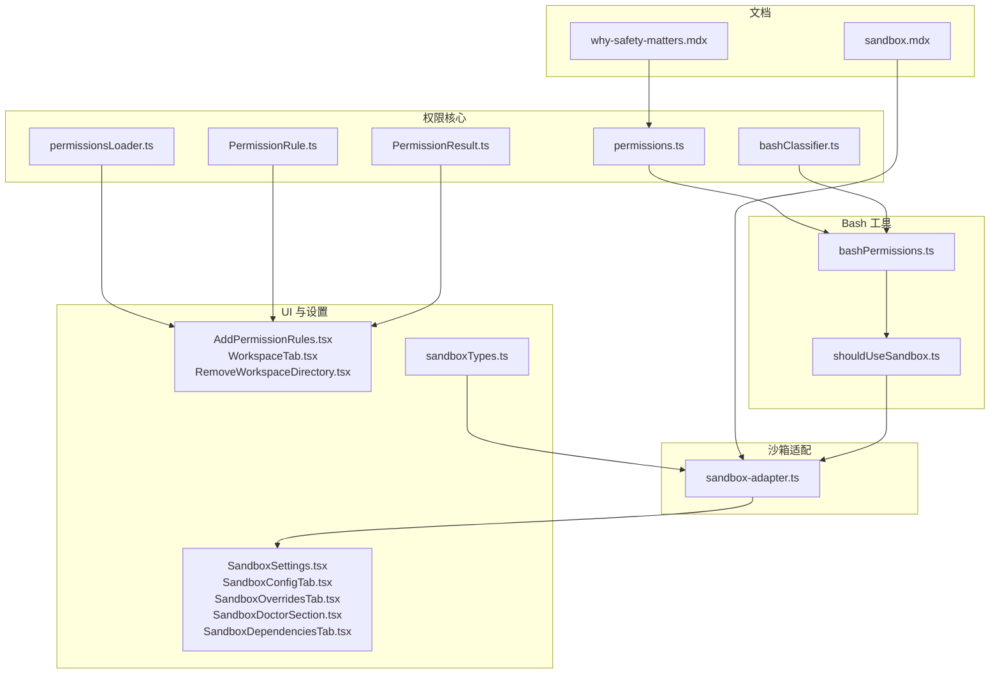
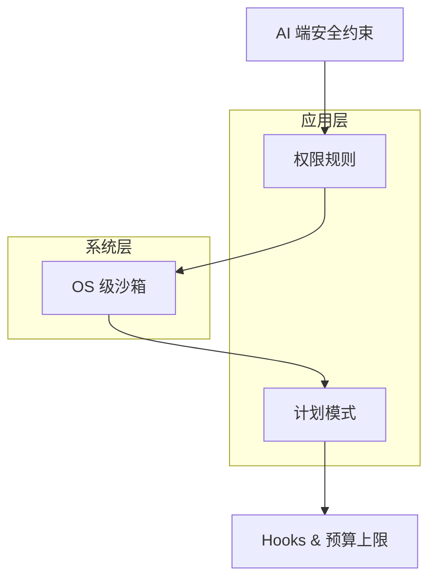
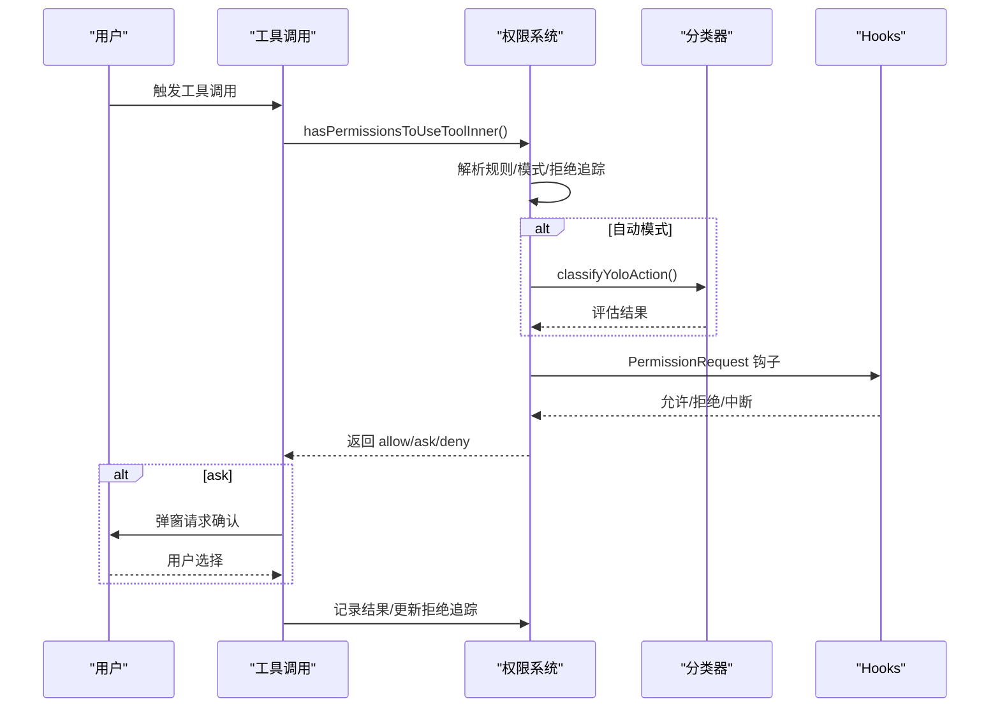
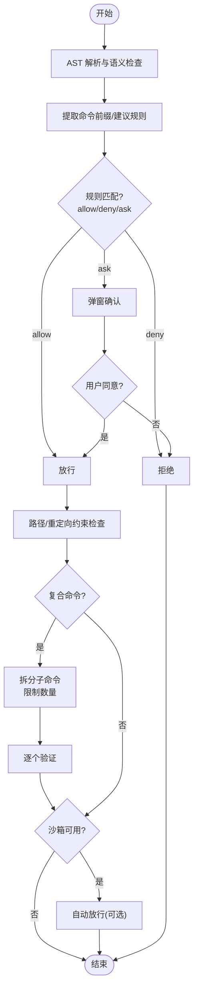
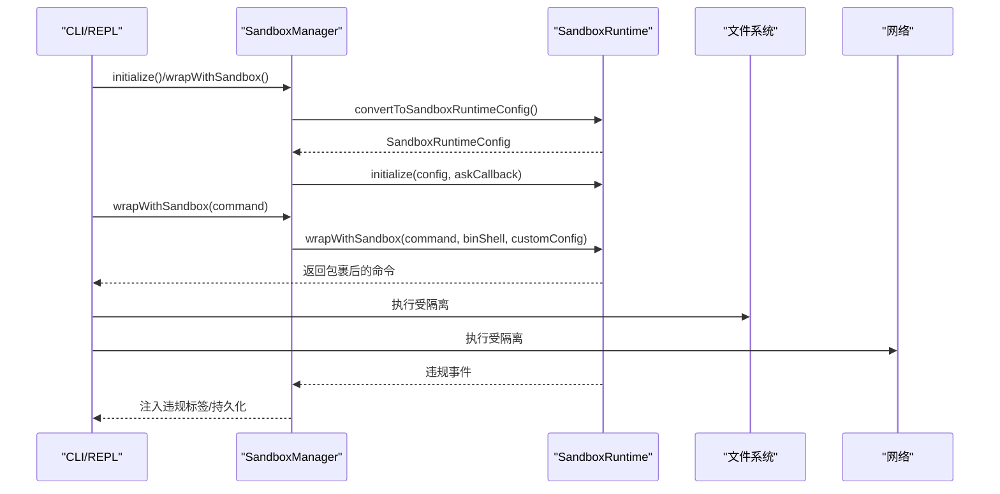
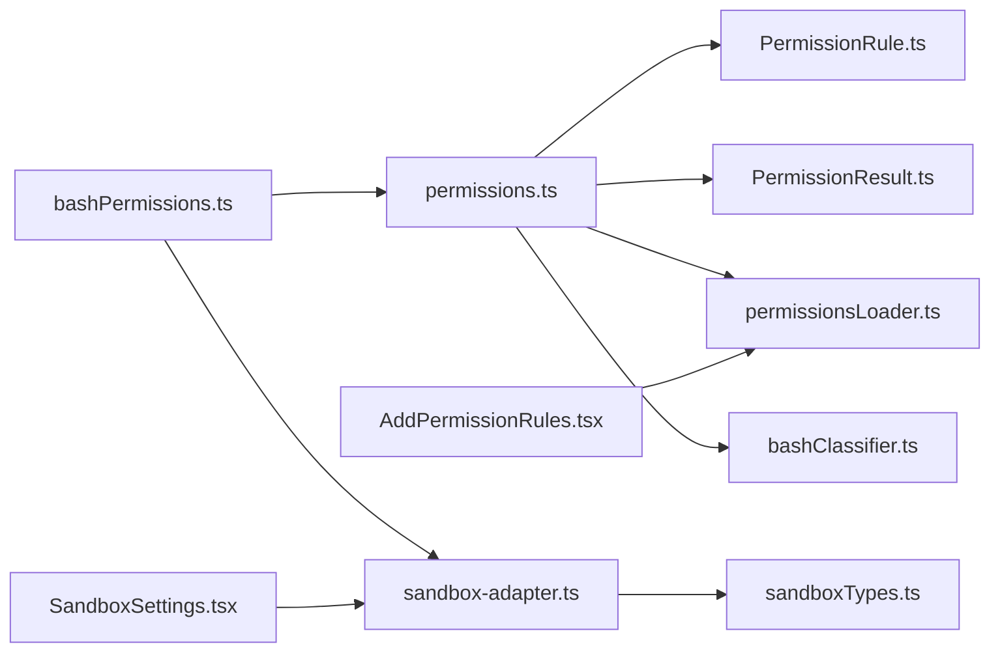

# 权限与安全

<cite>
**本文引用的文件**
- [docs/safety/sandbox.mdx](file://docs/safety/sandbox.mdx)
- [docs/safety/why-safety-matters.mdx](file://docs/safety/why-safety-matters.mdx)
- [src/utils/permissions/permissions.ts](file://src/utils/permissions/permissions.ts)
- [src/tools/BashTool/bashPermissions.ts](file://src/tools/BashTool/bashPermissions.ts)
- [src/tools/BashTool/shouldUseSandbox.ts](file://src/tools/BashTool/shouldUseSandbox.ts)
- [src/utils/sandbox/sandbox-adapter.ts](file://src/utils/sandbox/sandbox-adapter.ts)
- [src/utils/permissions/permissionsLoader.ts](file://src/utils/permissions/permissionsLoader.ts)
- [src/utils/permissions/PermissionResult.ts](file://src/utils/permissions/PermissionResult.ts)
- [src/utils/permissions/PermissionRule.ts](file://src/utils/permissions/PermissionRule.ts)
- [src/utils/permissions/bashClassifier.ts](file://src/utils/permissions/bashClassifier.ts)
- [src/hooks/toolPermission/permissionLogging.ts](file://src/hooks/toolPermission/permissionLogging.ts)
- [src/hooks/toolPermission/PermissionContext.ts](file://src/hooks/toolPermission/PermissionContext.ts)
- [src/components/permissions/BashPermissionRequest/BashPermissionRequest.tsx](file://src/components/permissions/BashPermissionRequest/BashPermissionRequest.tsx)
- [src/components/permissions/BashPermissionRequest/bashToolUseOptions.tsx](file://src/components/permissions/BashPermissionRequest/bashToolUseOptions.tsx)
- [src/components/permissions/rules/AddPermissionRules.tsx](file://src/components/permissions/rules/AddPermissionRules.tsx)
- [src/components/permissions/rules/RemoveWorkspaceDirectory.tsx](file://src/components/permissions/rules/RemoveWorkspaceDirectory.tsx)
- [src/components/permissions/rules/WorkspaceTab.tsx](file://src/components/permissions/rules/WorkspaceTab.tsx)
- [src/components/sandbox/SandboxSettings.tsx](file://src/components/sandbox/SandboxSettings.tsx)
- [src/components/sandbox/SandboxConfigTab.tsx](file://src/components/sandbox/SandboxConfigTab.tsx)
- [src/components/sandbox/SandboxOverridesTab.tsx](file://src/components/sandbox/SandboxOverridesTab.tsx)
- [src/components/sandbox/SandboxDoctorSection.tsx](file://src/components/sandbox/SandboxDoctorSection.tsx)
- [src/components/sandbox/SandboxDependenciesTab.tsx](file://src/components/sandbox/SandboxDependenciesTab.tsx)
- [src/entrypoints/sandboxTypes.ts](file://src/entrypoints/sandboxTypes.ts)
</cite>

## 目录
1. [简介](#简介)
2. [项目结构](#项目结构)
3. [核心组件](#核心组件)
4. [架构总览](#架构总览)
5. [详细组件分析](#详细组件分析)
6. [依赖关系分析](#依赖关系分析)
7. [性能考量](#性能考量)
8. [故障排除指南](#故障排除指南)
9. [结论](#结论)
10. [附录](#附录)

## 简介
本文件系统性梳理 Claude Code 的权限与安全体系，围绕“权限控制架构、权限模型设计、自动模式实现、绕过权限机制、沙箱系统与安全策略、权限请求流程、用户确认与审计日志、权限规则配置、路径验证与危险模式检测、沙箱实现细节、资源隔离与访问控制、安全最佳实践与合规”等方面展开。文档同时提供安全配置示例与故障排除指引，帮助开发者与运维人员正确部署与使用。

## 项目结构
- 文档层：位于 docs/safety，包含沙箱机制与安全设计哲学两篇文档，分别阐述 OS 级沙箱与纵深防御策略。
- 权限核心：src/utils/permissions 下的权限加载、规则类型、结果类型与 Bash 分类器等模块，支撑应用层权限决策。
- Bash 工具：src/tools/BashTool 下的权限检查、沙箱判定与安全辅助函数，负责对 Bash 命令进行细粒度校验。
- 沙箱适配：src/utils/sandbox 下的沙箱适配器，负责将用户设置转换为运行时配置，并与底层沙箱运行时交互。
- UI 与设置：src/components/permissions 与 src/components/sandbox 下的规则编辑、沙箱设置与诊断界面；src/entrypoints/sandboxTypes.ts 定义沙箱配置模型。

图表来源
- [docs/safety/why-safety-matters.mdx](file://docs/safety/why-safety-matters.mdx)
- [docs/safety/sandbox.mdx](file://docs/safety/sandbox.mdx)
- [src/utils/permissions/permissions.ts](file://src/utils/permissions/permissions.ts)
- [src/tools/BashTool/bashPermissions.ts](file://src/tools/BashTool/bashPermissions.ts)
- [src/tools/BashTool/shouldUseSandbox.ts](file://src/tools/BashTool/shouldUseSandbox.ts)
- [src/utils/sandbox/sandbox-adapter.ts](file://src/utils/sandbox/sandbox-adapter.ts)
- [src/utils/permissions/permissionsLoader.ts](file://src/utils/permissions/permissionsLoader.ts)
- [src/utils/permissions/PermissionResult.ts](file://src/utils/permissions/PermissionResult.ts)
- [src/utils/permissions/PermissionRule.ts](file://src/utils/permissions/PermissionRule.ts)
- [src/utils/permissions/bashClassifier.ts](file://src/utils/permissions/bashClassifier.ts)
- [src/components/permissions/rules/AddPermissionRules.tsx](file://src/components/permissions/rules/AddPermissionRules.tsx)
- [src/components/permissions/rules/WorkspaceTab.tsx](file://src/components/permissions/rules/WorkspaceTab.tsx)
- [src/components/permissions/rules/RemoveWorkspaceDirectory.tsx](file://src/components/permissions/rules/RemoveWorkspaceDirectory.tsx)
- [src/components/sandbox/SandboxSettings.tsx](file://src/components/sandbox/SandboxSettings.tsx)
- [src/components/sandbox/SandboxConfigTab.tsx](file://src/components/sandbox/SandboxConfigTab.tsx)
- [src/components/sandbox/SandboxOverridesTab.tsx](file://src/components/sandbox/SandboxOverridesTab.tsx)
- [src/components/sandbox/SandboxDoctorSection.tsx](file://src/components/sandbox/SandboxDoctorSection.tsx)
- [src/components/sandbox/SandboxDependenciesTab.tsx](file://src/components/sandbox/SandboxDependenciesTab.tsx)
- [src/entrypoints/sandboxTypes.ts](file://src/entrypoints/sandboxTypes.ts)

章节来源
- [docs/safety/why-safety-matters.mdx](file://docs/safety/why-safety-matters.mdx)
- [docs/safety/sandbox.mdx](file://docs/safety/sandbox.mdx)

## 核心组件
- 权限系统（应用层）
  - 规则加载与合并：从多源设置加载权限规则，支持策略覆盖与仅受管规则模式。
  - 决策流程：根据 allow/deny/ask 三态规则、模式与分类器进行自动/人工决策。
  - 结果与消息：生成面向用户的权限请求提示与拒绝/同意记录。
- Bash 权限检查
  - AST 解析与语义检查：检测命令注入、危险内建命令、组合命令拆分与路径约束。
  - 规则匹配：支持精确、前缀与通配符匹配，以及前缀建议与规则提取。
- 沙箱系统（OS 级）
  - 配置转换：将权限规则与用户设置映射为运行时配置（网络/文件系统）。
  - 平台实现：macOS 使用 sandbox-exec（Seatbelt），Linux 使用 bubblewrap + seccomp。
  - 违规处理：捕获违规事件并持久化，用于审计与可视化。
- UI 与设置
  - 权限规则编辑：添加/移除规则、工作区目录管理。
  - 沙箱设置：启用/禁用、自动放行、排除命令、网络与文件系统策略、依赖检查与诊断。

章节来源
- [src/utils/permissions/permissions.ts](file://src/utils/permissions/permissions.ts)
- [src/utils/permissions/permissionsLoader.ts](file://src/utils/permissions/permissionsLoader.ts)
- [src/utils/permissions/PermissionResult.ts](file://src/utils/permissions/PermissionResult.ts)
- [src/utils/permissions/PermissionRule.ts](file://src/utils/permissions/PermissionRule.ts)
- [src/tools/BashTool/bashPermissions.ts](file://src/tools/BashTool/bashPermissions.ts)
- [src/tools/BashTool/shouldUseSandbox.ts](file://src/tools/BashTool/shouldUseSandbox.ts)
- [src/utils/sandbox/sandbox-adapter.ts](file://src/utils/sandbox/sandbox-adapter.ts)
- [src/components/permissions/rules/AddPermissionRules.tsx](file://src/components/permissions/rules/AddPermissionRules.tsx)
- [src/components/permissions/rules/WorkspaceTab.tsx](file://src/components/permissions/rules/WorkspaceTab.tsx)
- [src/components/permissions/rules/RemoveWorkspaceDirectory.tsx](file://src/components/permissions/rules/RemoveWorkspaceDirectory.tsx)
- [src/components/sandbox/SandboxSettings.tsx](file://src/components/sandbox/SandboxSettings.tsx)
- [src/components/sandbox/SandboxConfigTab.tsx](file://src/components/sandbox/SandboxConfigTab.tsx)
- [src/components/sandbox/SandboxOverridesTab.tsx](file://src/components/sandbox/SandboxOverridesTab.tsx)
- [src/components/sandbox/SandboxDoctorSection.tsx](file://src/components/sandbox/SandboxDoctorSection.tsx)
- [src/components/sandbox/SandboxDependenciesTab.tsx](file://src/components/sandbox/SandboxDependenciesTab.tsx)
- [src/entrypoints/sandboxTypes.ts](file://src/entrypoints/sandboxTypes.ts)

## 架构总览
Claude Code 的安全采用“五层纵深防御”：
- AI 端安全约束（系统提示）
- 权限规则（应用层）
- OS 级沙箱（进程级隔离）
- 计划模式（只读探索）
- Hooks 与预算上限（外部审计与资源限制）

图表来源
- [docs/safety/why-safety-matters.mdx](file://docs/safety/why-safety-matters.mdx)

章节来源
- [docs/safety/why-safety-matters.mdx](file://docs/safety/why-safety-matters.mdx)

## 详细组件分析

### 权限模型与决策流程
- 规则来源与合并
  - 多源设置（用户/项目/本地/策略/标志位）合并为统一上下文，支持“仅受管规则”模式。
  - 规则行为：allow/deny/ask；工具匹配支持内置工具与 MCP 服务器级规则。
- 决策主流程
  - 工具调用前检查 hasPermissionsToUseToolInner，结合模式（auto/dontAsk/plan）、分类器与拒绝追踪，决定 allow/ask/deny。
  - 自动模式下优先 acceptEdits 快速通道与安全工具白名单，其次分类器评估。
  - 头像（hooks）提供 PreToolUse/PostToolUse 等事件钩子，支持外部审计与阻断。
- 用户确认与消息
  - createPermissionRequestMessage 根据决策原因生成可读提示，支持规则来源与子命令拆分列表。
- 结果与审计
  - PermissionResult 类型定义决策与元数据；拒绝追踪与连续拒绝计数用于策略调整。

图表来源
- [src/utils/permissions/permissions.ts](file://src/utils/permissions/permissions.ts)
- [src/utils/permissions/bashClassifier.ts](file://src/utils/permissions/bashClassifier.ts)
- [src/hooks/toolPermission/permissionLogging.ts](file://src/hooks/toolPermission/permissionLogging.ts)
- [src/hooks/toolPermission/PermissionContext.ts](file://src/hooks/toolPermission/PermissionContext.ts)

章节来源
- [src/utils/permissions/permissions.ts](file://src/utils/permissions/permissions.ts)
- [src/utils/permissions/permissionsLoader.ts](file://src/utils/permissions/permissionsLoader.ts)
- [src/utils/permissions/PermissionResult.ts](file://src/utils/permissions/PermissionResult.ts)
- [src/utils/permissions/PermissionRule.ts](file://src/utils/permissions/PermissionRule.ts)
- [src/utils/permissions/bashClassifier.ts](file://src/utils/permissions/bashClassifier.ts)
- [src/hooks/toolPermission/permissionLogging.ts](file://src/hooks/toolPermission/permissionLogging.ts)
- [src/hooks/toolPermission/PermissionContext.ts](file://src/hooks/toolPermission/PermissionContext.ts)

### Bash 权限检查与危险模式检测
- AST 与语义检查
  - 使用 tree-sitter 解析 Bash AST，检测命令注入、危险内建命令（eval/exec/source）。
- 前缀与规则匹配
  - 支持 getSimpleCommandPrefix/getFirstWordPrefix 提取稳定前缀，避免过度宽泛规则。
  - 精确/前缀/通配符匹配，以及 heredoc 前缀提取与多行命令处理。
- 组合命令与路径约束
  - 最大子命令数量限制（安全默认拒绝），拆分后逐一验证。
  - 输出重定向目标与路径约束检查，防止通过管道/重定向绕过。
- 环境变量与包装器剥离
  - stripSafeWrappers/stripAllLeadingEnvVars 用于剥离安全环境变量与包装器，避免规则绕过。
- 自动放行与策略
  - autoAllowBashIfSandboxed 开启时，沙箱中的 Bash 命令自动放行，减少弹窗。

图表来源
- [src/tools/BashTool/bashPermissions.ts](file://src/tools/BashTool/bashPermissions.ts)
- [src/tools/BashTool/shouldUseSandbox.ts](file://src/tools/BashTool/shouldUseSandbox.ts)

章节来源
- [src/tools/BashTool/bashPermissions.ts](file://src/tools/BashTool/bashPermissions.ts)
- [src/tools/BashTool/shouldUseSandbox.ts](file://src/tools/BashTool/shouldUseSandbox.ts)

### 沙箱系统与资源隔离
- 配置模型与转换
  - convertToSandboxRuntimeConfig 将权限规则与用户设置映射为运行时配置：网络域白/黑名单、文件系统读写/读取限制、ripgrep 参数等。
  - 安全加固：自动将项目目录加入可写、禁止写 settings.json 与 .claude/skills、检测裸仓库攻击向量并清理残留。
- 初始化与动态更新
  - initialize 一次性初始化，detectWorktreeMainRepoPath 缓存主仓库路径；订阅设置变更动态刷新配置。
- 平台实现差异
  - macOS：sandbox-exec（Seatbelt）；Linux/WSL：bubblewrap + seccomp；WSL1 不支持。
  - Linux 上 glob 路径限制与残留文件清理、Unix socket 按路径放行差异。
- 违规处理与审计
  - annotateStderrWithSandboxFailures 注入违规标签，SandboxViolationStore 持久化，UI 清理显示。

图表来源
- [src/utils/sandbox/sandbox-adapter.ts](file://src/utils/sandbox/sandbox-adapter.ts)
- [docs/safety/sandbox.mdx](file://docs/safety/sandbox.mdx)

章节来源
- [src/utils/sandbox/sandbox-adapter.ts](file://src/utils/sandbox/sandbox-adapter.ts)
- [docs/safety/sandbox.mdx](file://docs/safety/sandbox.mdx)

### 权限请求流程、用户确认与审计日志
- 请求生成
  - createPermissionRequestMessage 根据决策原因（规则/分类器/Hook/子命令拆分等）生成提示文本。
- UI 交互
  - BashPermissionRequest.tsx 与 bashToolUseOptions.tsx 提供确认/拒绝/不再询问等选项。
- 审计与钩子
  - permissionLogging.ts 与 PermissionContext.ts 提供权限相关事件记录与上下文管理；Hooks 支持 PreToolUse/PostToolUse 等审计事件。

章节来源
- [src/utils/permissions/permissions.ts](file://src/utils/permissions/permissions.ts)
- [src/components/permissions/BashPermissionRequest/BashPermissionRequest.tsx](file://src/components/permissions/BashPermissionRequest/BashPermissionRequest.tsx)
- [src/components/permissions/BashPermissionRequest/bashToolUseOptions.tsx](file://src/components/permissions/BashPermissionRequest/bashToolUseOptions.tsx)
- [src/hooks/toolPermission/permissionLogging.ts](file://src/hooks/toolPermission/permissionLogging.ts)
- [src/hooks/toolPermission/PermissionContext.ts](file://src/hooks/toolPermission/PermissionContext.ts)

### 权限规则配置与路径验证
- 规则编辑
  - AddPermissionRules.tsx、WorkspaceTab.tsx、RemoveWorkspaceDirectory.tsx 支持添加/移除规则与工作区目录。
- 规则解析与去重
  - permissionRuleValueFromString/permissionRuleValueToString 保证规则规范化与去重。
- 路径解析与安全
  - resolvePathPatternForSandbox/resolveSandboxFilesystemPath 处理 CC 特有的路径前缀与标准路径语义，避免规则绕过。

章节来源
- [src/utils/permissions/permissionsLoader.ts](file://src/utils/permissions/permissionsLoader.ts)
- [src/utils/permissions/PermissionRule.ts](file://src/utils/permissions/PermissionRule.ts)
- [src/components/permissions/rules/AddPermissionRules.tsx](file://src/components/permissions/rules/AddPermissionRules.tsx)
- [src/components/permissions/rules/WorkspaceTab.tsx](file://src/components/permissions/rules/WorkspaceTab.tsx)
- [src/components/permissions/rules/RemoveWorkspaceDirectory.tsx](file://src/components/permissions/rules/RemoveWorkspaceDirectory.tsx)
- [src/utils/sandbox/sandbox-adapter.ts](file://src/utils/sandbox/sandbox-adapter.ts)

### 沙箱配置模型与安全策略
- 配置字段
  - sandbox.enabled/autoAllowBashIfSandboxed/allowUnsandboxedCommands/failIfUnavailable/network.filesystem.excludedCommands 等。
- 策略与合规
  - allowManagedDomainsOnly/allowManagedReadPathsOnly 控制受管策略；enabledPlatforms 限制启用平台。
- 依赖与诊断
  - SandboxDependenciesTab.tsx/SandboxDoctorSection.tsx 提供依赖检查与诊断信息。

章节来源
- [src/entrypoints/sandboxTypes.ts](file://src/entrypoints/sandboxTypes.ts)
- [src/utils/sandbox/sandbox-adapter.ts](file://src/utils/sandbox/sandbox-adapter.ts)
- [src/components/sandbox/SandboxDependenciesTab.tsx](file://src/components/sandbox/SandboxDependenciesTab.tsx)
- [src/components/sandbox/SandboxDoctorSection.tsx](file://src/components/sandbox/SandboxDoctorSection.tsx)
- [src/components/sandbox/SandboxSettings.tsx](file://src/components/sandbox/SandboxSettings.tsx)
- [src/components/sandbox/SandboxConfigTab.tsx](file://src/components/sandbox/SandboxConfigTab.tsx)
- [src/components/sandbox/SandboxOverridesTab.tsx](file://src/components/sandbox/SandboxOverridesTab.tsx)

## 依赖关系分析
- 权限系统依赖
  - permissions.ts 依赖规则类型、结果类型、权限加载器、分类器与 hooks。
  - bashPermissions.ts 依赖 Bash 安全工具、路径与规则匹配工具、沙箱管理器。
- 沙箱依赖
  - sandbox-adapter.ts 依赖 @anthropic-ai/sandbox-runtime、设置系统与平台工具。
- UI 依赖
  - 规则编辑组件依赖权限加载器与规则类型；沙箱设置组件依赖沙箱适配器与类型定义。

图表来源
- [src/utils/permissions/permissions.ts](file://src/utils/permissions/permissions.ts)
- [src/utils/permissions/PermissionRule.ts](file://src/utils/permissions/PermissionRule.ts)
- [src/utils/permissions/PermissionResult.ts](file://src/utils/permissions/PermissionResult.ts)
- [src/utils/permissions/permissionsLoader.ts](file://src/utils/permissions/permissionsLoader.ts)
- [src/utils/permissions/bashClassifier.ts](file://src/utils/permissions/bashClassifier.ts)
- [src/tools/BashTool/bashPermissions.ts](file://src/tools/BashTool/bashPermissions.ts)
- [src/utils/sandbox/sandbox-adapter.ts](file://src/utils/sandbox/sandbox-adapter.ts)
- [src/entrypoints/sandboxTypes.ts](file://src/entrypoints/sandboxTypes.ts)
- [src/components/permissions/rules/AddPermissionRules.tsx](file://src/components/permissions/rules/AddPermissionRules.tsx)
- [src/components/sandbox/SandboxSettings.tsx](file://src/components/sandbox/SandboxSettings.tsx)

章节来源
- [src/utils/permissions/permissions.ts](file://src/utils/permissions/permissions.ts)
- [src/utils/permissions/permissionsLoader.ts](file://src/utils/permissions/permissionsLoader.ts)
- [src/utils/permissions/PermissionRule.ts](file://src/utils/permissions/PermissionRule.ts)
- [src/utils/permissions/PermissionResult.ts](file://src/utils/permissions/PermissionResult.ts)
- [src/utils/permissions/bashClassifier.ts](file://src/utils/permissions/bashClassifier.ts)
- [src/tools/BashTool/bashPermissions.ts](file://src/tools/BashTool/bashPermissions.ts)
- [src/utils/sandbox/sandbox-adapter.ts](file://src/utils/sandbox/sandbox-adapter.ts)
- [src/entrypoints/sandboxTypes.ts](file://src/entrypoints/sandboxTypes.ts)
- [src/components/permissions/rules/AddPermissionRules.tsx](file://src/components/permissions/rules/AddPermissionRules.tsx)
- [src/components/sandbox/SandboxSettings.tsx](file://src/components/sandbox/SandboxSettings.tsx)

## 性能考量
- 安全与可用性权衡
  - 只读命令自动放行、沙箱中的命令自动允许、复合命令最大拆分限制，均在安全与体验之间寻求平衡。
- 分类器与拒绝追踪
  - 自动模式下的 acceptEdits 快速通道与安全工具白名单可显著减少分类器调用开销。
- 沙箱初始化与缓存
  - 依赖检查与平台支持检测采用 memoize，配置变更订阅动态刷新，避免重复计算。

## 故障排除指南
- 沙箱不可用
  - 检查平台支持与依赖缺失：SandboxUnavailableReason 与依赖检查结果。
  - Linux/WSL glob 警告：确认规则中是否存在不完全支持的 glob 模式。
- 规则不生效
  - 确认是否处于“仅受管规则”模式；检查规则来源优先级与去重逻辑。
  - 环境变量与包装器剥离：确保规则前缀与命令匹配时已正确剥离安全前缀。
- 权限请求过多
  - 调整 autoAllowBashIfSandboxed 与分类器策略；合理使用 allow 规则与前缀建议。
- 审计与钩子
  - 确认 hooks 事件是否正确注册与处理；检查拒绝追踪状态与连续拒绝计数。

章节来源
- [src/utils/sandbox/sandbox-adapter.ts](file://src/utils/sandbox/sandbox-adapter.ts)
- [src/utils/permissions/permissionsLoader.ts](file://src/utils/permissions/permissionsLoader.ts)
- [src/utils/permissions/permissions.ts](file://src/utils/permissions/permissions.ts)
- [src/hooks/toolPermission/permissionLogging.ts](file://src/hooks/toolPermission/permissionLogging.ts)

## 结论
Claude Code 的安全体系通过“AI 端约束 + 应用层权限 + OS 级沙箱 + 计划模式 + Hooks 与预算”的五层纵深防御，既保障了安全性，又兼顾了开发效率。权限系统以规则为中心，结合自动模式与分类器实现智能化决策；沙箱系统在不同平台上提供一致的资源隔离与访问控制。通过合理的配置与审计，团队可以在企业环境中实现合规与可控的 AI 辅助开发。

## 附录

### 安全配置示例（摘自文档与类型定义）
- 沙箱配置模型（settings.json 中的 sandbox 字段）
  - 主开关、自动放行、允许不受限命令、失败策略、网络与文件系统策略、排除命令等。
- 网络与文件系统策略
  - 白名单/黑名单域名、本地绑定、代理端口、允许/禁止读写路径、ripgrep 参数等。
- 平台与策略
  - enabledPlatforms 限制启用平台；allowManagedDomainsOnly/allowManagedReadPathsOnly 受管策略。

章节来源
- [docs/safety/sandbox.mdx](file://docs/safety/sandbox.mdx)
- [src/entrypoints/sandboxTypes.ts](file://src/entrypoints/sandboxTypes.ts)
- [src/utils/sandbox/sandbox-adapter.ts](file://src/utils/sandbox/sandbox-adapter.ts)