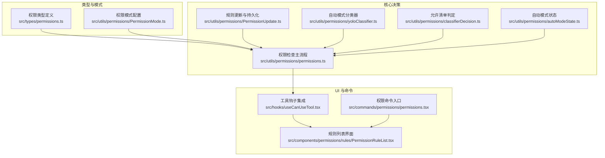
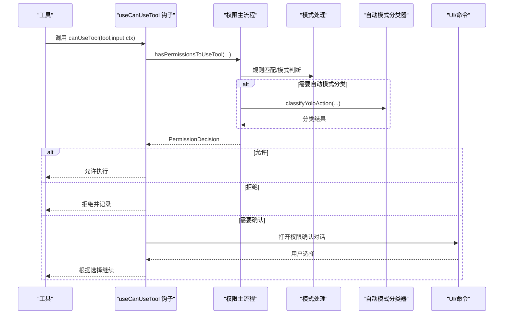
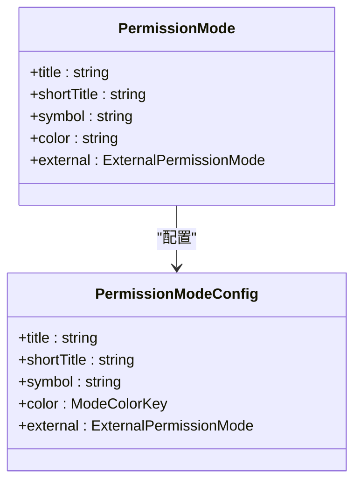
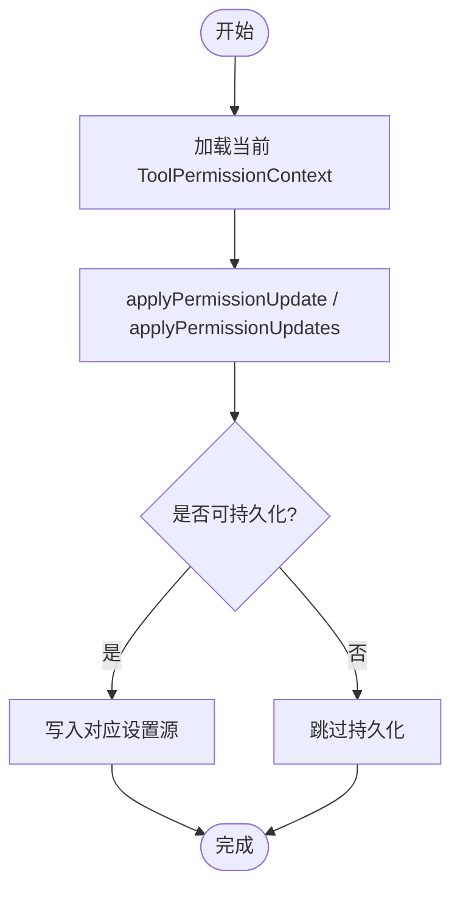
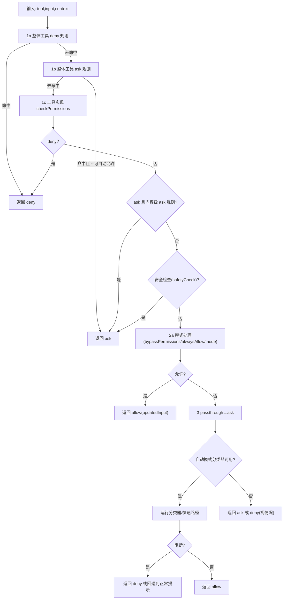
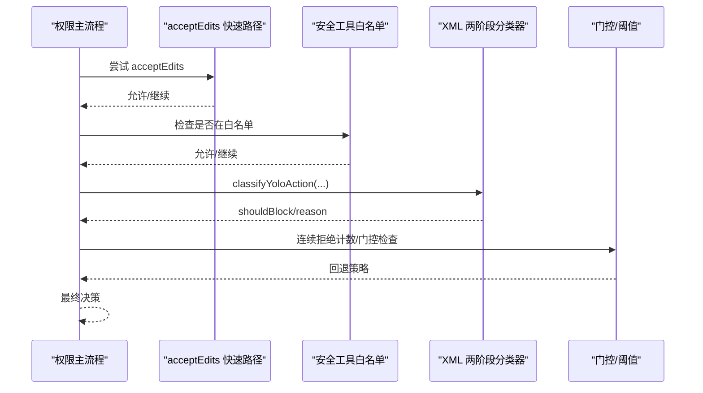
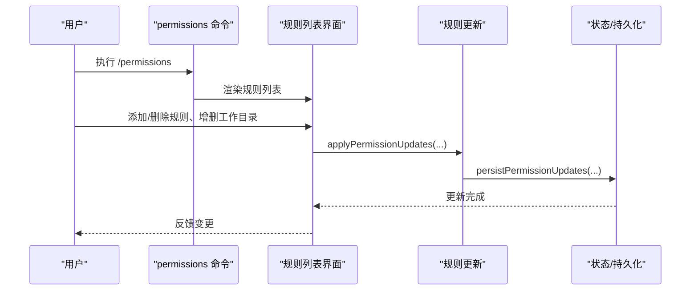
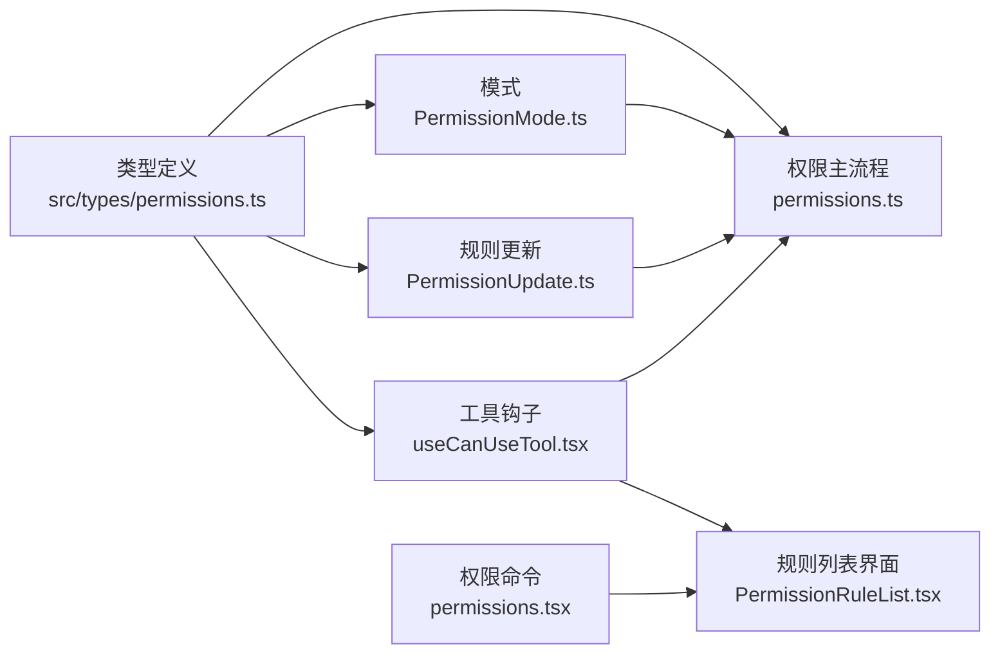

# 权限控制架构

<cite>
**本文档引用的文件**
- [src/utils/permissions/permissions.ts](file://src/utils/permissions/permissions.ts)
- [src/utils/permissions/PermissionMode.ts](file://src/utils/permissions/PermissionMode.ts)
- [src/utils/permissions/PermissionUpdate.ts](file://src/utils/permissions/PermissionUpdate.ts)
- [src/utils/permissions/classifierDecision.ts](file://src/utils/permissions/classifierDecision.ts)
- [src/utils/permissions/autoModeState.ts](file://src/utils/permissions/autoModeState.ts)
- [src/utils/permissions/yoloClassifier.ts](file://src/utils/permissions/yoloClassifier.ts)
- [src/hooks/useCanUseTool.tsx](file://src/hooks/useCanUseTool.tsx)
- [src/components/permissions/rules/PermissionRuleList.tsx](file://src/components/permissions/rules/PermissionRuleList.tsx)
- [src/commands/permissions/permissions.tsx](file://src/commands/permissions/permissions.tsx)
- [src/types/permissions.ts](file://src/types/permissions.ts)
</cite>

## 目录
1. [引言](#引言)
2. [项目结构](#项目结构)
3. [核心组件](#核心组件)
4. [架构总览](#架构总览)
5. [详细组件分析](#详细组件分析)
6. [依赖关系分析](#依赖关系分析)
7. [性能考量](#性能考量)
8. [故障排查指南](#故障排查指南)
9. [结论](#结论)
10. [附录](#附录)

## 引言
本文件系统化阐述 Claude Code 的权限控制架构，围绕“权限模式分类与切换、权限决策流程、状态管理与持久化、结果处理与回退策略”展开，结合代码级实现细节，提供可扩展、可维护的权限控制最佳实践与常见问题解决方案。

## 项目结构
权限控制相关代码主要分布在以下模块：
- 工具层：工具调用前的权限检查与决策（hasPermissionsToUseTool、checkRuleBasedPermissions）
- 模式层：权限模式定义与外部模式映射（PermissionMode）
- 更新层：规则与模式的上下文应用与持久化（PermissionUpdate）
- 分类器层：自动模式下的安全分类与快速路径优化（yoloClassifier、classifierDecision、autoModeState）
- UI 层：规则列表与交互入口（PermissionRuleList、permissions 命令）
- 类型层：统一的权限类型与决策结构（permissions.ts）

图表来源
- [src/types/permissions.ts:1-442](file://src/types/permissions.ts#L1-L442)
- [src/utils/permissions/PermissionMode.ts:1-142](file://src/utils/permissions/PermissionMode.ts#L1-L142)
- [src/utils/permissions/permissions.ts:1-1487](file://src/utils/permissions/permissions.ts#L1-L1487)
- [src/utils/permissions/PermissionUpdate.ts:1-390](file://src/utils/permissions/PermissionUpdate.ts#L1-L390)
- [src/utils/permissions/yoloClassifier.ts:1-1496](file://src/utils/permissions/yoloClassifier.ts#L1-L1496)
- [src/utils/permissions/classifierDecision.ts:1-99](file://src/utils/permissions/classifierDecision.ts#L1-L99)
- [src/utils/permissions/autoModeState.ts:1-40](file://src/utils/permissions/autoModeState.ts#L1-L40)
- [src/hooks/useCanUseTool.tsx:1-204](file://src/hooks/useCanUseTool.tsx#L1-L204)
- [src/components/permissions/rules/PermissionRuleList.tsx:1-1179](file://src/components/permissions/rules/PermissionRuleList.tsx#L1-L1179)
- [src/commands/permissions/permissions.tsx:1-10](file://src/commands/permissions/permissions.tsx#L1-L10)

章节来源
- [src/utils/permissions/permissions.ts:1-1487](file://src/utils/permissions/permissions.ts#L1-L1487)
- [src/utils/permissions/PermissionMode.ts:1-142](file://src/utils/permissions/PermissionMode.ts#L1-L142)
- [src/utils/permissions/PermissionUpdate.ts:1-390](file://src/utils/permissions/PermissionUpdate.ts#L1-L390)
- [src/utils/permissions/yoloClassifier.ts:1-1496](file://src/utils/permissions/yoloClassifier.ts#L1-L1496)
- [src/utils/permissions/classifierDecision.ts:1-99](file://src/utils/permissions/classifierDecision.ts#L1-L99)
- [src/utils/permissions/autoModeState.ts:1-40](file://src/utils/permissions/autoModeState.ts#L1-L40)
- [src/hooks/useCanUseTool.tsx:1-204](file://src/hooks/useCanUseTool.tsx#L1-L204)
- [src/components/permissions/rules/PermissionRuleList.tsx:1-1179](file://src/components/permissions/rules/PermissionRuleList.tsx#L1-L1179)
- [src/commands/permissions/permissions.tsx:1-10](file://src/commands/permissions/permissions.tsx#L1-L10)
- [src/types/permissions.ts:1-442](file://src/types/permissions.ts#L1-L442)

## 核心组件
- 权限类型与决策结构：统一的 PermissionDecision/Result、PermissionRule、PermissionMode 等类型，确保跨模块一致性与可维护性。
- 权限模式：default、plan、acceptEdits、bypassPermissions、dontAsk、auto（ant-only）等模式及其外部模式映射。
- 规则与更新：支持 allow/deny/ask 三类规则，按来源（用户/项目/本地/会话/CLI）进行聚合与持久化。
- 决策主流程：hasPermissionsToUseTool 串联规则匹配、模式处理、自动模式分类器、头等代理 Hook 等步骤。
- 自动模式分类器：基于 XML 输出格式的两阶段分类器，支持快速路径（acceptEdits、safe allowlist）与失败回退。
- UI 与命令：规则列表界面与权限命令入口，支持搜索、添加、删除规则与工作目录。

章节来源
- [src/types/permissions.ts:1-442](file://src/types/permissions.ts#L1-L442)
- [src/utils/permissions/PermissionMode.ts:1-142](file://src/utils/permissions/PermissionMode.ts#L1-L142)
- [src/utils/permissions/PermissionUpdate.ts:1-390](file://src/utils/permissions/PermissionUpdate.ts#L1-L390)
- [src/utils/permissions/permissions.ts:1-1487](file://src/utils/permissions/permissions.ts#L1-L1487)
- [src/utils/permissions/yoloClassifier.ts:1-1496](file://src/utils/permissions/yoloClassifier.ts#L1-L1496)
- [src/components/permissions/rules/PermissionRuleList.tsx:1-1179](file://src/components/permissions/rules/PermissionRuleList.tsx#L1-L1179)
- [src/commands/permissions/permissions.tsx:1-10](file://src/commands/permissions/permissions.tsx#L1-L10)

## 架构总览
权限控制采用“规则驱动 + 模式切换 + 分类器辅助”的分层架构：
- 规则层：按来源聚合规则，支持工具级与内容级规则。
- 模式层：在不同模式下对决策进行转换或绕过。
- 分类器层：在自动模式下对高风险动作进行安全评估，提供快速路径与失败回退。
- 集成层：通过工具钩子与 UI 组件接入到工具使用流程与用户交互。

图表来源
- [src/hooks/useCanUseTool.tsx:1-204](file://src/hooks/useCanUseTool.tsx#L1-L204)
- [src/utils/permissions/permissions.ts:1-1487](file://src/utils/permissions/permissions.ts#L1-L1487)
- [src/utils/permissions/yoloClassifier.ts:1-1496](file://src/utils/permissions/yoloClassifier.ts#L1-L1496)

## 详细组件分析

### 权限模式与外部模式映射
- 支持模式：default、plan、acceptEdits、bypassPermissions、dontAsk、auto（ant-only）。
- 外部模式映射：auto 在外部构建中不可见，内部映射为 default；其他模式保持一致。
- 模式颜色与符号：用于 UI 展示与状态标识。

图表来源
- [src/utils/permissions/PermissionMode.ts:1-142](file://src/utils/permissions/PermissionMode.ts#L1-L142)

章节来源
- [src/utils/permissions/PermissionMode.ts:1-142](file://src/utils/permissions/PermissionMode.ts#L1-L142)

### 权限规则与更新机制
- 规则来源：userSettings、projectSettings、localSettings、flagSettings、policySettings、cliArg、command、session。
- 规则行为：allow/deny/ask；支持工具级与内容级规则（如 Bash(prefix:*)）。
- 更新操作：addRules、replaceRules、removeRules、setMode、addDirectories、removeDirectories。
- 持久化：仅对可编辑设置源（user/project/local）进行持久化，内存源（cli/session）不落盘。

图表来源
- [src/utils/permissions/PermissionUpdate.ts:1-390](file://src/utils/permissions/PermissionUpdate.ts#L1-L390)

章节来源
- [src/utils/permissions/PermissionUpdate.ts:1-390](file://src/utils/permissions/PermissionUpdate.ts#L1-L390)
- [src/types/permissions.ts:1-442](file://src/types/permissions.ts#L1-L442)

### 权限决策主流程
- 步骤概览（简化）：
  1) 整体工具 deny/ask 规则匹配
  2) 工具实现 checkPermissions 返回结果
  3) 模式处理：bypassPermissions/alwaysAllow/mode 转换
  4) passthrough → ask
  5) 自动模式分类器（可选）：快速路径与两阶段分类
  6) 头等代理 Hook（headless 场景）
  7) 结果回传与 UI 对话

图表来源
- [src/utils/permissions/permissions.ts:1071-1319](file://src/utils/permissions/permissions.ts#L1071-L1319)

章节来源
- [src/utils/permissions/permissions.ts:1071-1319](file://src/utils/permissions/permissions.ts#L1071-L1319)

### 自动模式分类器与快速路径
- 快速路径：
  - acceptEdits 模式：在工作目录内的安全编辑直接允许
  - 安全工具白名单：避免不必要的分类器调用
- 两阶段分类器：
  - 阶段1（fast）：短响应，立即判定
  - 阶段2（thinking）：链式思考，降低误判
- 失败回退：
  - 上下文窗口超限：回退到手动提示
  - 分类器不可用：根据门控策略 fail-closed/fail-open
  - 连续拒绝阈值：超过阈值回退到手动提示

图表来源
- [src/utils/permissions/permissions.ts:520-927](file://src/utils/permissions/permissions.ts#L520-L927)
- [src/utils/permissions/classifierDecision.ts:1-99](file://src/utils/permissions/classifierDecision.ts#L1-L99)
- [src/utils/permissions/yoloClassifier.ts:711-800](file://src/utils/permissions/yoloClassifier.ts#L711-L800)
- [src/utils/permissions/autoModeState.ts:1-40](file://src/utils/permissions/autoModeState.ts#L1-L40)

章节来源
- [src/utils/permissions/permissions.ts:520-927](file://src/utils/permissions/permissions.ts#L520-L927)
- [src/utils/permissions/classifierDecision.ts:1-99](file://src/utils/permissions/classifierDecision.ts#L1-L99)
- [src/utils/permissions/yoloClassifier.ts:711-800](file://src/utils/permissions/yoloClassifier.ts#L711-L800)
- [src/utils/permissions/autoModeState.ts:1-40](file://src/utils/permissions/autoModeState.ts#L1-L40)

### UI 与命令入口
- 规则列表界面：支持按 allow/ask/deny/workspace/tab 切换，搜索、添加、删除规则，工作目录增删。
- 权限命令入口：/permissions 命令打开规则列表，并支持重试被拒动作的消息注入。

图表来源
- [src/commands/permissions/permissions.tsx:1-10](file://src/commands/permissions/permissions.tsx#L1-L10)
- [src/components/permissions/rules/PermissionRuleList.tsx:1-1179](file://src/components/permissions/rules/PermissionRuleList.tsx#L1-L1179)
- [src/utils/permissions/PermissionUpdate.ts:1-390](file://src/utils/permissions/PermissionUpdate.ts#L1-L390)

章节来源
- [src/commands/permissions/permissions.tsx:1-10](file://src/commands/permissions/permissions.tsx#L1-L10)
- [src/components/permissions/rules/PermissionRuleList.tsx:1-1179](file://src/components/permissions/rules/PermissionRuleList.tsx#L1-L1179)
- [src/utils/permissions/PermissionUpdate.ts:1-390](file://src/utils/permissions/PermissionUpdate.ts#L1-L390)

## 依赖关系分析
- 类型解耦：权限类型集中于 types/permissions.ts，避免循环依赖，供各模块导入。
- 功能解耦：权限主流程、模式、更新、分类器各自独立，通过接口与回调协作。
- UI 与核心：UI 仅负责呈现与交互，实际决策由 hooks/useCanUseTool.tsx 与 permissions.ts 协作完成。

图表来源
- [src/types/permissions.ts:1-442](file://src/types/permissions.ts#L1-L442)
- [src/utils/permissions/PermissionMode.ts:1-142](file://src/utils/permissions/PermissionMode.ts#L1-L142)
- [src/utils/permissions/permissions.ts:1-1487](file://src/utils/permissions/permissions.ts#L1-L1487)
- [src/utils/permissions/PermissionUpdate.ts:1-390](file://src/utils/permissions/PermissionUpdate.ts#L1-L390)
- [src/hooks/useCanUseTool.tsx:1-204](file://src/hooks/useCanUseTool.tsx#L1-L204)
- [src/components/permissions/rules/PermissionRuleList.tsx:1-1179](file://src/components/permissions/rules/PermissionRuleList.tsx#L1-L1179)
- [src/commands/permissions/permissions.tsx:1-10](file://src/commands/permissions/permissions.tsx#L1-L10)

章节来源
- [src/types/permissions.ts:1-442](file://src/types/permissions.ts#L1-L442)
- [src/utils/permissions/permissions.ts:1-1487](file://src/utils/permissions/permissions.ts#L1-L1487)
- [src/utils/permissions/PermissionMode.ts:1-142](file://src/utils/permissions/PermissionMode.ts#L1-L142)
- [src/utils/permissions/PermissionUpdate.ts:1-390](file://src/utils/permissions/PermissionUpdate.ts#L1-L390)
- [src/hooks/useCanUseTool.tsx:1-204](file://src/hooks/useCanUseTool.tsx#L1-L204)
- [src/components/permissions/rules/PermissionRuleList.tsx:1-1179](file://src/components/permissions/rules/PermissionRuleList.tsx#L1-L1179)
- [src/commands/permissions/permissions.tsx:1-10](file://src/commands/permissions/permissions.tsx#L1-L10)

## 性能考量
- 快速路径优化：acceptEdits 与安全工具白名单显著减少分类器调用次数与延迟。
- 两阶段分类器：阶段1快速判定，阶段2仅在必要时触发，平衡准确性与性能。
- 令牌与成本估算：分类器调用统计可用于成本分析与阈值控制。
- 拒绝阈值与回退：防止连续拒绝导致的性能与体验问题，必要时回退到手动提示。

## 故障排查指南
- 分类器不可用（fail-closed/fail-open）：根据门控策略决定阻断或回退。
- 上下文窗口超限：自动回退到手动提示，避免无意义的重试。
- 头等代理场景（headless）：优先执行 PermissionRequest Hook，若无决策则拒绝。
- 规则冲突与阴影规则：UI 提供警告与修复建议，注意 deny 优先于 ask/allow。
- 持久化失败：仅对可编辑设置源进行持久化，内存源不落盘。

章节来源
- [src/utils/permissions/permissions.ts:818-956](file://src/utils/permissions/permissions.ts#L818-L956)
- [src/utils/permissions/yoloClassifier.ts:1-1496](file://src/utils/permissions/yoloClassifier.ts#L1-L1496)
- [src/components/permissions/rules/PermissionRuleList.tsx:1-1179](file://src/components/permissions/rules/PermissionRuleList.tsx#L1-L1179)

## 结论
该权限控制架构以“规则 + 模式 + 分类器”的组合实现灵活而安全的权限治理：规则与模式提供可控的策略边界，分类器在自动模式下提供智能化的安全评估，UI 与命令提供友好的配置入口。通过快速路径与失败回退策略，兼顾安全性与用户体验；通过类型解耦与模块化设计，提升可扩展性与可维护性。

## 附录

### 权限状态与转换
- 状态来源：ToolPermissionContext 包含 mode、additionalWorkingDirectories、各类规则集合、模式可用性标志等。
- 转换逻辑：规则匹配 → 模式处理 → 分类器评估 → Hook 回退 → UI 对话 → 结果持久化。

章节来源
- [src/types/permissions.ts:414-442](file://src/types/permissions.ts#L414-L442)
- [src/utils/permissions/permissions.ts:1262-1319](file://src/utils/permissions/permissions.ts#L1262-L1319)
- [src/utils/permissions/PermissionUpdate.ts:55-206](file://src/utils/permissions/PermissionUpdate.ts#L55-L206)

### 权限决策算法要点
- 规则优先级：deny > ask（内容级 ask）> safetyCheck > allow（快速路径/白名单）> 分类器 > 模式转换。
- 自动模式门控：上下文窗口、分类器可用性、连续拒绝阈值共同决定最终策略。
- 头等代理：在无法弹窗场景，优先通过 Hook 决策，否则中断或拒绝。

章节来源
- [src/utils/permissions/permissions.ts:1071-1319](file://src/utils/permissions/permissions.ts#L1071-L1319)
- [src/utils/permissions/permissions.ts:932-956](file://src/utils/permissions/permissions.ts#L932-L956)
- [src/utils/permissions/yoloClassifier.ts:711-800](file://src/utils/permissions/yoloClassifier.ts#L711-L800)