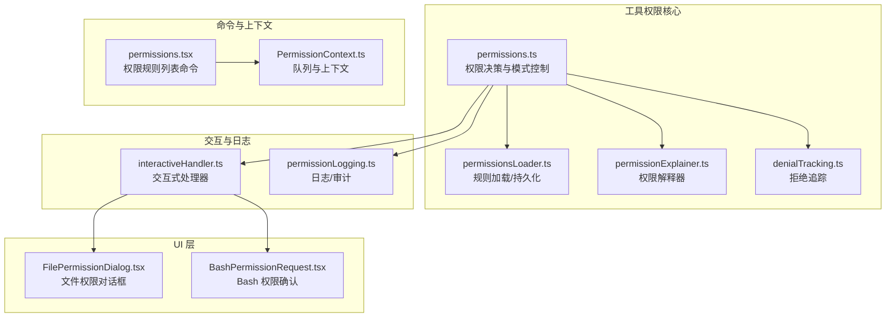
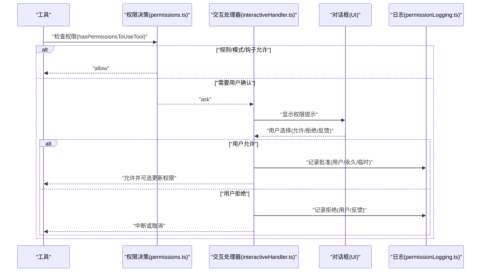
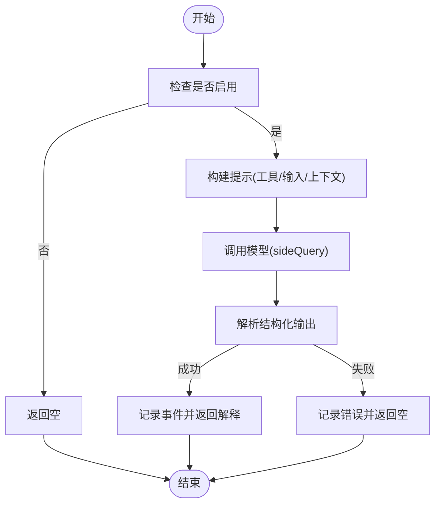
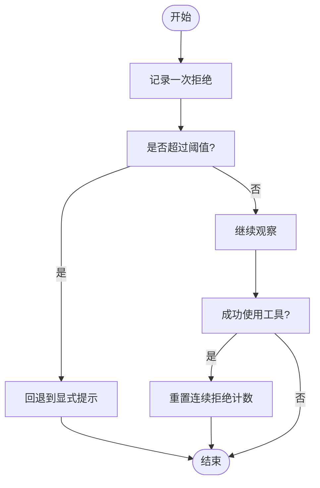
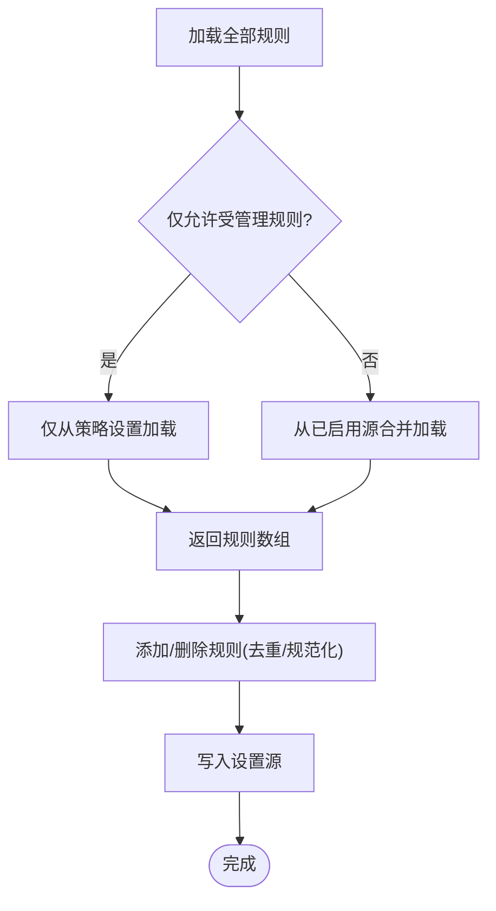
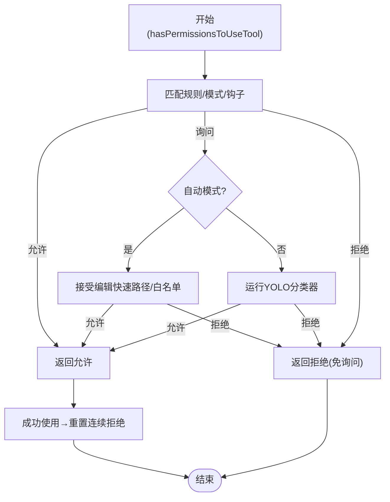
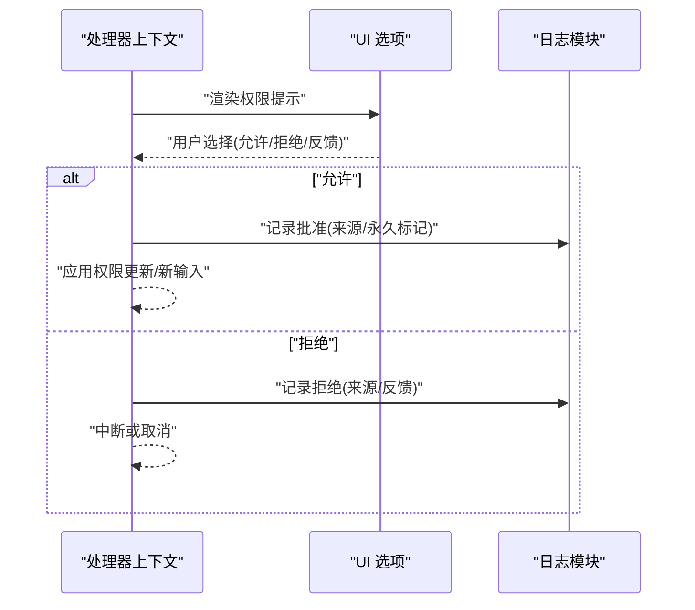
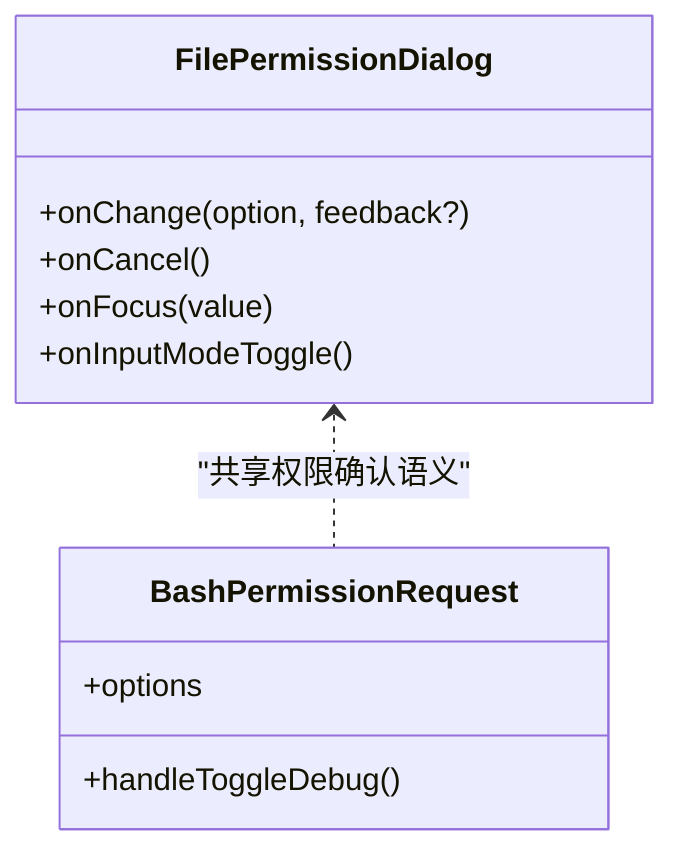
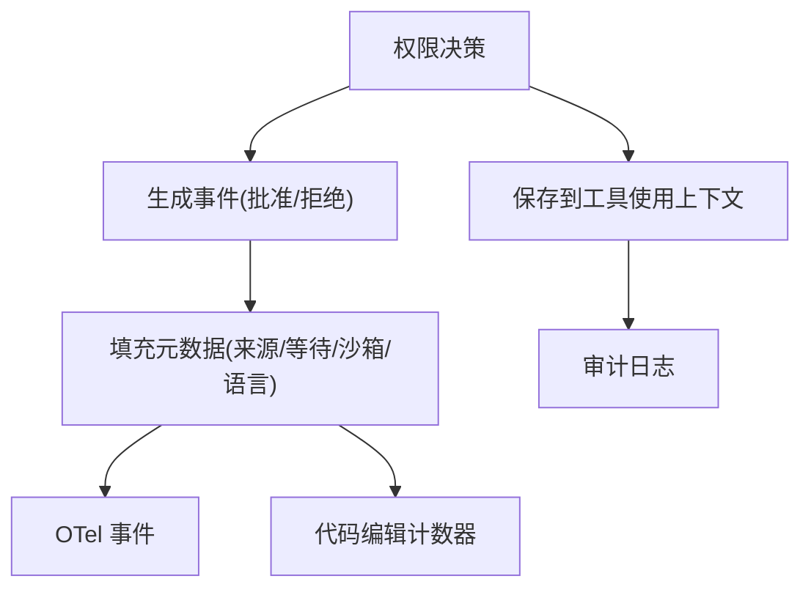
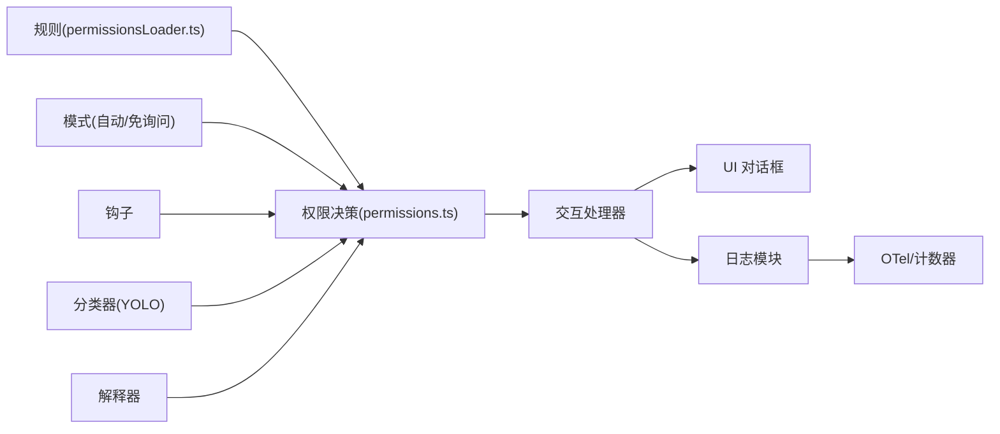

# 权限提示与用户交互

<cite>
**本文引用的文件**
- [src/utils/permissions/permissions.ts](file://src/utils/permissions/permissions.ts)
- [src/utils/permissions/permissionsLoader.ts](file://src/utils/permissions/permissionsLoader.ts)
- [src/utils/permissions/permissionExplainer.ts](file://src/utils/permissions/permissionExplainer.ts)
- [src/utils/permissions/denialTracking.ts](file://src/utils/permissions/denialTracking.ts)
- [src/utils/permissions/PermissionPromptToolResultSchema.ts](file://src/utils/permissions/PermissionPromptToolResultSchema.ts)
- [src/hooks/toolPermission/permissionLogging.ts](file://src/hooks/toolPermission/permissionLogging.ts)
- [src/hooks/toolPermission/handlers/interactiveHandler.ts](file://src/hooks/toolPermission/handlers/interactiveHandler.ts)
- [src/hooks/toolPermission/PermissionContext.ts](file://src/hooks/toolPermission/PermissionContext.ts)
- [src/components/permissions/FilePermissionDialog/FilePermissionDialog.tsx](file://src/components/permissions/FilePermissionDialog/FilePermissionDialog.tsx)
- [src/components/permissions/BashPermissionRequest/BashPermissionRequest.tsx](file://src/components/permissions/BashPermissionRequest/BashPermissionRequest.tsx)
- [src/commands/permissions/permissions.tsx](file://src/commands/permissions/permissions.tsx)
- [src/services/tools/toolExecution.ts](file://src/services/tools/toolExecution.ts)
- [src/components/permissions/hooks.ts](file://src/components/permissions/hooks.ts)
</cite>

## 目录
1. [引言](#引言)
2. [项目结构](#项目结构)
3. [核心组件](#核心组件)
4. [架构总览](#架构总览)
5. [详细组件分析](#详细组件分析)
6. [依赖关系分析](#依赖关系分析)
7. [性能考量](#性能考量)
8. [故障排查指南](#故障排查指南)
9. [结论](#结论)
10. [附录](#附录)

## 引言
本文件系统性阐述 Claude Code 的“权限提示与用户交互”体系，覆盖权限解释器、拒绝追踪、权限加载机制、可视化提示、用户确认流程、批量处理、定制化配置与本地化支持、权限历史与审计日志、无障碍与体验优化，以及测试与质量保障策略。目标是帮助开发者与产品人员快速理解并高效扩展该系统。

## 项目结构
围绕权限提示与交互的关键目录与文件如下：
- 工具权限决策与规则：src/utils/permissions/*
- 交互式权限处理器：src/hooks/toolPermission/handlers/interactiveHandler.ts
- 权限日志与审计：src/hooks/toolPermission/permissionLogging.ts
- 权限解释器（风险说明）：src/utils/permissions/permissionExplainer.ts
- 拒绝追踪（连续拒绝与总数限制）：src/utils/permissions/denialTracking.ts
- 权限规则加载与持久化：src/utils/permissions/permissionsLoader.ts
- UI 对话框与 Bash 提示：src/components/permissions/*
- 命令入口与重试：src/commands/permissions/*

**图表来源**
- [src/utils/permissions/permissions.ts](file://src/utils/permissions/permissions.ts)
- [src/utils/permissions/permissionsLoader.ts](file://src/utils/permissions/permissionsLoader.ts)
- [src/utils/permissions/permissionExplainer.ts](file://src/utils/permissions/permissionExplainer.ts)
- [src/utils/permissions/denialTracking.ts](file://src/utils/permissions/denialTracking.ts)
- [src/hooks/toolPermission/handlers/interactiveHandler.ts](file://src/hooks/toolPermission/handlers/interactiveHandler.ts)
- [src/hooks/toolPermission/permissionLogging.ts](file://src/hooks/toolPermission/permissionLogging.ts)
- [src/components/permissions/FilePermissionDialog/FilePermissionDialog.tsx](file://src/components/permissions/FilePermissionDialog/FilePermissionDialog.tsx)
- [src/components/permissions/BashPermissionRequest/BashPermissionRequest.tsx](file://src/components/permissions/BashPermissionRequest/BashPermissionRequest.tsx)
- [src/commands/permissions/permissions.tsx](file://src/commands/permissions/permissions.tsx)
- [src/hooks/toolPermission/PermissionContext.ts](file://src/hooks/toolPermission/PermissionContext.ts)

**章节来源**
- [src/utils/permissions/permissions.ts](file://src/utils/permissions/permissions.ts)
- [src/utils/permissions/permissionsLoader.ts](file://src/utils/permissions/permissionsLoader.ts)
- [src/utils/permissions/permissionExplainer.ts](file://src/utils/permissions/permissionExplainer.ts)
- [src/utils/permissions/denialTracking.ts](file://src/utils/permissions/denialTracking.ts)
- [src/hooks/toolPermission/handlers/interactiveHandler.ts](file://src/hooks/toolPermission/handlers/interactiveHandler.ts)
- [src/hooks/toolPermission/permissionLogging.ts](file://src/hooks/toolPermission/permissionLogging.ts)
- [src/components/permissions/FilePermissionDialog/FilePermissionDialog.tsx](file://src/components/permissions/FilePermissionDialog/FilePermissionDialog.tsx)
- [src/components/permissions/BashPermissionRequest/BashPermissionRequest.tsx](file://src/components/permissions/BashPermissionRequest/BashPermissionRequest.tsx)
- [src/commands/permissions/permissions.tsx](file://src/commands/permissions/permissions.tsx)
- [src/hooks/toolPermission/PermissionContext.ts](file://src/hooks/toolPermission/PermissionContext.ts)

## 核心组件
- 权限解释器（Permission Explainer）
  - 基于模型生成风险等级、解释与理由，辅助用户理解操作风险。
  - 可通过全局配置开关，支持取消。
- 拒绝追踪（Denial Tracking）
  - 维护连续拒绝次数与总拒绝次数，达到阈值后触发回退到显式提示。
- 规则加载与持久化（Permissions Loader）
  - 从多源设置加载规则，支持仅受管理策略约束、编辑规则增删。
- 权限决策主流程（Permissions）
  - 聚合规则、分类器、模式（自动/免询问）、钩子等，输出允许/询问/拒绝决策。
- 交互式处理器（Interactive Handler）
  - 处理用户在 UI 中的选择，记录决策、更新权限状态、触发回调。
- 日志与审计（Permission Logging）
  - 统一记录批准/拒绝事件，区分来源（用户、分类器、钩子、配置），并产出 OTel 与代码编辑指标。
- UI 对话框（FilePermissionDialog、BashPermissionRequest）
  - 可视化展示权限请求、输入反馈、快捷键与调试信息。

**章节来源**
- [src/utils/permissions/permissionExplainer.ts](file://src/utils/permissions/permissionExplainer.ts)
- [src/utils/permissions/denialTracking.ts](file://src/utils/permissions/denialTracking.ts)
- [src/utils/permissions/permissionsLoader.ts](file://src/utils/permissions/permissionsLoader.ts)
- [src/utils/permissions/permissions.ts](file://src/utils/permissions/permissions.ts)
- [src/hooks/toolPermission/handlers/interactiveHandler.ts](file://src/hooks/toolPermission/handlers/interactiveHandler.ts)
- [src/hooks/toolPermission/permissionLogging.ts](file://src/hooks/toolPermission/permissionLogging.ts)
- [src/components/permissions/FilePermissionDialog/FilePermissionDialog.tsx](file://src/components/permissions/FilePermissionDialog/FilePermissionDialog.tsx)
- [src/components/permissions/BashPermissionRequest/BashPermissionRequest.tsx](file://src/components/permissions/BashPermissionRequest/BashPermissionRequest.tsx)

## 架构总览
下图展示了从工具调用到用户确认与日志审计的端到端流程。

**图表来源**
- [src/utils/permissions/permissions.ts](file://src/utils/permissions/permissions.ts)
- [src/hooks/toolPermission/handlers/interactiveHandler.ts](file://src/hooks/toolPermission/handlers/interactiveHandler.ts)
- [src/hooks/toolPermission/permissionLogging.ts](file://src/hooks/toolPermission/permissionLogging.ts)
- [src/components/permissions/FilePermissionDialog/FilePermissionDialog.tsx](file://src/components/permissions/FilePermissionDialog/FilePermissionDialog.tsx)

## 详细组件分析

### 权限解释器（Permission Explainer）
- 功能要点
  - 在 Bash 等高风险场景，基于模型生成“解释/理由/风险/风险等级”，帮助用户判断是否授权。
  - 支持取消（通过配置开关）与中止信号处理。
  - 结构化输出解析，失败时记录错误类型并降级。
- 关键行为
  - 合成用户提示，包含工具名、描述、输入与最近对话上下文。
  - 使用 sideQuery 与强制工具选择以获得稳定结构化输出。
  - 记录耗时与事件指标，便于性能与可用性分析。

**图表来源**
- [src/utils/permissions/permissionExplainer.ts](file://src/utils/permissions/permissionExplainer.ts)

**章节来源**
- [src/utils/permissions/permissionExplainer.ts](file://src/utils/permissions/permissionExplainer.ts)

### 拒绝追踪（Denial Tracking）
- 设计理念
  - 通过连续拒绝与总拒绝计数，避免用户反复被同一类请求打断；当阈值达到时，强制回退到显式提示。
- 数据结构
  - 连续拒绝次数与总拒绝次数，提供记录成功/失败与阈值判定。
- 与自动模式联动
  - 成功使用工具会重置连续拒绝计数，鼓励积极授权。

**图表来源**
- [src/utils/permissions/denialTracking.ts](file://src/utils/permissions/denialTracking.ts)

**章节来源**
- [src/utils/permissions/denialTracking.ts](file://src/utils/permissions/denialTracking.ts)
- [src/utils/permissions/permissions.ts](file://src/utils/permissions/permissions.ts)

### 权限加载与持久化（Permissions Loader）
- 加载策略
  - 若开启“仅允许受管理规则”，则只从策略设置加载；否则从所有已启用设置源合并加载。
- 编辑能力
  - 支持向指定可编辑源添加/删除规则，去重与规范化条目，保留未知字段。
- 与 UI 集成
  - 命令入口提供“权限规则列表”界面，支持重试拒绝。

**图表来源**
- [src/utils/permissions/permissionsLoader.ts](file://src/utils/permissions/permissionsLoader.ts)

**章节来源**
- [src/utils/permissions/permissionsLoader.ts](file://src/utils/permissions/permissionsLoader.ts)
- [src/commands/permissions/permissions.tsx](file://src/commands/permissions/permissions.tsx)

### 权限决策主流程（Permissions）
- 决策来源
  - 规则（允许/禁止/询问）、分类器（自动模式）、模式（自动/免询问/计划）、钩子、安全检查、工作区/沙箱等。
- 自动模式路径
  - 接受编辑快速路径、安全工具白名单、YOLO 分类器三段式，优先避免昂贵 API 调用。
  - PowerShell 在特定构建标志下才进入自动模式。
- 免询问模式
  - 将“询问”转换为“拒绝”，并给出统一拒绝消息。
- 与拒绝追踪联动
  - 成功使用会重置连续拒绝计数。

**图表来源**
- [src/utils/permissions/permissions.ts](file://src/utils/permissions/permissions.ts)

**章节来源**
- [src/utils/permissions/permissions.ts](file://src/utils/permissions/permissions.ts)

### 交互式处理器与用户确认（Interactive Handler）
- 用户交互
  - 显示选项（允许、拒绝、一次性允许、附加反馈），支持键盘切换与调试信息。
  - 允许时可更新权限与输入，拒绝时可中断并记录原因。
- 回调与桥接
  - 支持桥接回调，发送响应与取消请求；记录取消与决策。
- 决策归档
  - 统一通过日志模块记录来源（用户/用户拒绝/用户中止/钩子/分类器/配置）。

**图表来源**
- [src/hooks/toolPermission/handlers/interactiveHandler.ts](file://src/hooks/toolPermission/handlers/interactiveHandler.ts)
- [src/hooks/toolPermission/permissionLogging.ts](file://src/hooks/toolPermission/permissionLogging.ts)

**章节来源**
- [src/hooks/toolPermission/handlers/interactiveHandler.ts](file://src/hooks/toolPermission/handlers/interactiveHandler.ts)
- [src/hooks/toolPermission/permissionLogging.ts](file://src/hooks/toolPermission/permissionLogging.ts)
- [src/components/permissions/FilePermissionDialog/FilePermissionDialog.tsx](file://src/components/permissions/FilePermissionDialog/FilePermissionDialog.tsx)
- [src/components/permissions/BashPermissionRequest/BashPermissionRequest.tsx](file://src/components/permissions/BashPermissionRequest/BashPermissionRequest.tsx)

### 权限提示 UI（文件与 Bash）
- 文件权限对话框
  - 支持拒绝/一次性允许选项，可附加反馈；提供键盘提示与焦点状态。
- Bash 权限请求
  - 基于工具使用结果生成选项，支持调试信息切换、建议与前缀编辑。

**图表来源**
- [src/components/permissions/FilePermissionDialog/FilePermissionDialog.tsx](file://src/components/permissions/FilePermissionDialog/FilePermissionDialog.tsx)
- [src/components/permissions/BashPermissionRequest/BashPermissionRequest.tsx](file://src/components/permissions/BashPermissionRequest/BashPermissionRequest.tsx)

**章节来源**
- [src/components/permissions/FilePermissionDialog/FilePermissionDialog.tsx](file://src/components/permissions/FilePermissionDialog/FilePermissionDialog.tsx)
- [src/components/permissions/BashPermissionRequest/BashPermissionRequest.tsx](file://src/components/permissions/BashPermissionRequest/BashPermissionRequest.tsx)

### 权限历史与审计日志
- 事件维度
  - 批准/拒绝事件名称区分来源（用户永久/临时、用户拒绝、用户中止、钩子、分类器、配置）。
  - 包含等待时间、沙箱状态、语言（针对代码编辑工具）等元数据。
- 指标与追踪
  - OTel 事件、代码编辑工具决策计数器、会话令牌用量与成本分析。
- 决策存储
  - 将决策来源、结果与时间戳保存在工具使用上下文中，供下游检查。

**图表来源**
- [src/hooks/toolPermission/permissionLogging.ts](file://src/hooks/toolPermission/permissionLogging.ts)
- [src/services/tools/toolExecution.ts](file://src/services/tools/toolExecution.ts)

**章节来源**
- [src/hooks/toolPermission/permissionLogging.ts](file://src/hooks/toolPermission/permissionLogging.ts)
- [src/services/tools/toolExecution.ts](file://src/services/tools/toolExecution.ts)

### 权限提示的定制化与本地化
- 规则来源与显示
  - 规则来源（用户/项目/本地/策略/命令行/会话）统一映射为可读字符串，便于 UI 展示。
- 本地化支持
  - 消息与提示文本通过统一函数生成，便于替换与翻译。
- 解释器开关
  - 通过全局配置控制是否启用解释器，满足不同地区合规要求。

**章节来源**
- [src/utils/permissions/permissions.ts](file://src/utils/permissions/permissions.ts)
- [src/utils/permissions/permissionExplainer.ts](file://src/utils/permissions/permissionExplainer.ts)

### 批量处理与队列
- 队列操作
  - 通过 PermissionContext 的队列操作接口，支持推送、移除、更新待确认项。
- 并发与原子性
  - 处理器内部采用“声明式获取”确保并发安全，避免竞态。

**章节来源**
- [src/hooks/toolPermission/PermissionContext.ts](file://src/hooks/toolPermission/PermissionContext.ts)
- [src/hooks/toolPermission/handlers/interactiveHandler.ts](file://src/hooks/toolPermission/handlers/interactiveHandler.ts)

### 无障碍与体验优化
- 键盘与焦点
  - 提供 ESC 取消、Tab 切换输入模式、调试信息切换等快捷键。
- 信息密度与反馈
  - 拒绝/允许反馈可选，解释器提供风险等级与简要说明，降低认知负担。
- 自动模式与免打扰
  - 免询问模式减少打断；自动模式在安全前提下尽量减少人工干预。

**章节来源**
- [src/components/permissions/FilePermissionDialog/FilePermissionDialog.tsx](file://src/components/permissions/FilePermissionDialog/FilePermissionDialog.tsx)
- [src/components/permissions/BashPermissionRequest/BashPermissionRequest.tsx](file://src/components/permissions/BashPermissionRequest/BashPermissionRequest.tsx)
- [src/utils/permissions/permissions.ts](file://src/utils/permissions/permissions.ts)

## 依赖关系分析
- 权限决策对规则、分类器、模式与钩子存在条件依赖；自动模式路径优先使用快速路径，最后才调用分类器。
- 交互处理器依赖 UI 组件与日志模块；日志模块再对接 OTel 与代码编辑计数器。
- 权限解释器独立于主流程，作为增强体验的可选组件。

**图表来源**
- [src/utils/permissions/permissionsLoader.ts](file://src/utils/permissions/permissionsLoader.ts)
- [src/utils/permissions/permissions.ts](file://src/utils/permissions/permissions.ts)
- [src/utils/permissions/permissionExplainer.ts](file://src/utils/permissions/permissionExplainer.ts)
- [src/hooks/toolPermission/handlers/interactiveHandler.ts](file://src/hooks/toolPermission/handlers/interactiveHandler.ts)
- [src/hooks/toolPermission/permissionLogging.ts](file://src/hooks/toolPermission/permissionLogging.ts)

**章节来源**
- [src/utils/permissions/permissions.ts](file://src/utils/permissions/permissions.ts)
- [src/utils/permissions/permissionsLoader.ts](file://src/utils/permissions/permissionsLoader.ts)
- [src/utils/permissions/permissionExplainer.ts](file://src/utils/permissions/permissionExplainer.ts)
- [src/hooks/toolPermission/handlers/interactiveHandler.ts](file://src/hooks/toolPermission/handlers/interactiveHandler.ts)
- [src/hooks/toolPermission/permissionLogging.ts](file://src/hooks/toolPermission/permissionLogging.ts)

## 性能考量
- 快速路径优先：接受编辑快速路径与安全工具白名单显著减少分类器调用。
- 令牌与成本分析：自动模式决策包含分类器用量与成本估算，便于开销控制。
- 拒绝追踪：成功使用即重置连续拒绝，避免频繁回退提示带来的额外延迟。
- 解释器按需启用：默认开启但可通过配置关闭，降低非必要 API 调用。

**章节来源**
- [src/utils/permissions/permissions.ts](file://src/utils/permissions/permissions.ts)
- [src/utils/permissions/permissionExplainer.ts](file://src/utils/permissions/permissionExplainer.ts)
- [src/hooks/toolPermission/permissionLogging.ts](file://src/hooks/toolPermission/permissionLogging.ts)

## 故障排查指南
- 无权限提示
  - 检查是否处于免询问模式或规则直接允许；确认交互处理器是否正确注册。
- 分类器不可用
  - 自动模式下若分类器不可用，系统会记录并可能回退到显式提示；查看日志与通知。
- 权限未生效
  - 确认权限更新是否持久化至对应设置源；检查规则来源与是否仅允许受管理规则。
- 解释器异常
  - 查看解释器错误事件与解析失败日志；必要时关闭解释器以排除干扰。
- 审计缺失
  - 确认日志模块是否被调用；检查 OTel 与计数器初始化状态。

**章节来源**
- [src/hooks/toolPermission/handlers/interactiveHandler.ts](file://src/hooks/toolPermission/handlers/interactiveHandler.ts)
- [src/hooks/toolPermission/permissionLogging.ts](file://src/hooks/toolPermission/permissionLogging.ts)
- [src/utils/permissions/permissionExplainer.ts](file://src/utils/permissions/permissionExplainer.ts)
- [src/utils/permissions/permissionsLoader.ts](file://src/utils/permissions/permissionsLoader.ts)

## 结论
该权限提示与用户交互系统以“规则+模式+分类器+钩子”为核心决策引擎，结合“解释器+拒绝追踪+统一日志”形成闭环：既保证安全可控，又兼顾效率与体验。UI 层提供直观的可视化确认与快捷键支持，命令层支持规则管理与重试。通过可观测性与可配置性，系统具备良好的可维护性与扩展性。

## 附录
- 测试与质量保证策略（建议）
  - 单元测试：规则匹配、拒绝追踪、解释器输出解析、日志事件断言。
  - 集成测试：交互处理器与 UI 的端到端流程、自动模式路径覆盖。
  - A/B 实验：分类器准确率与用户等待时间对比，评估自动模式收益。
  - 回归测试：权限更新持久化、规则来源变更、免询问/自动模式切换。
  - 无障碍测试：键盘导航、屏幕阅读器兼容、颜色对比度与焦点可见性。
  - 性能压测：分类器调用频率、解释器延迟、队列积压与内存占用。