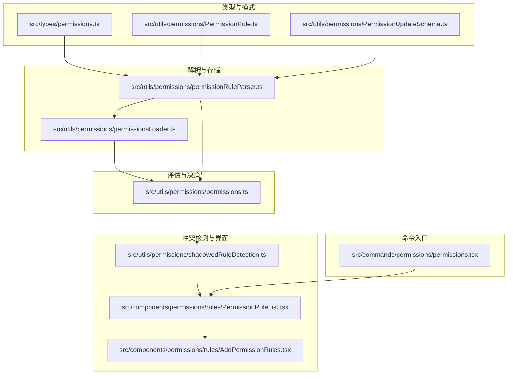
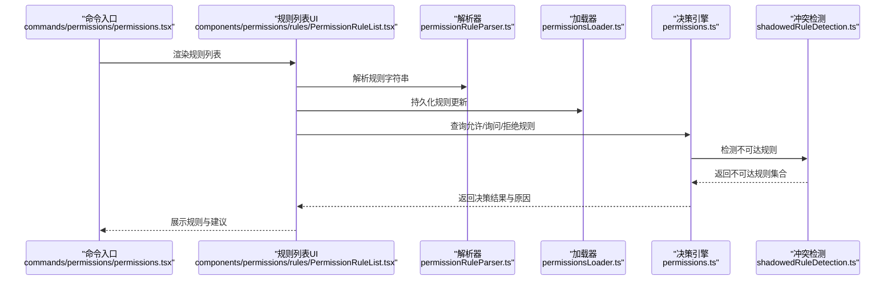
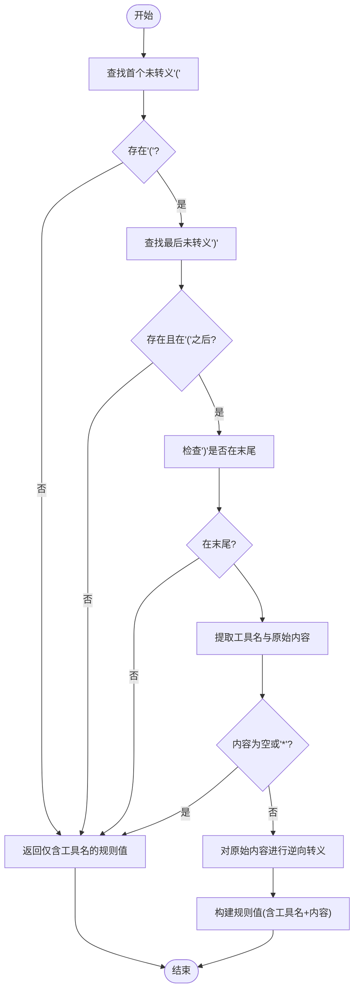
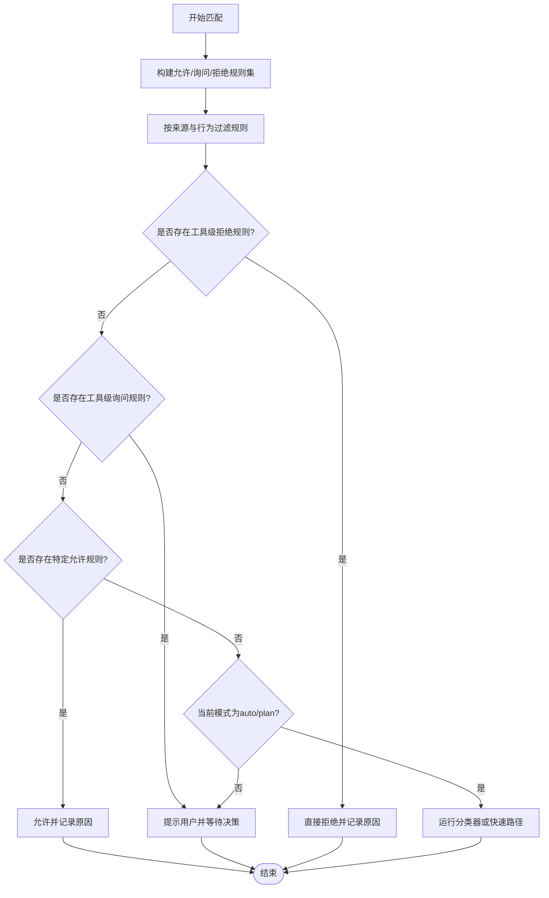
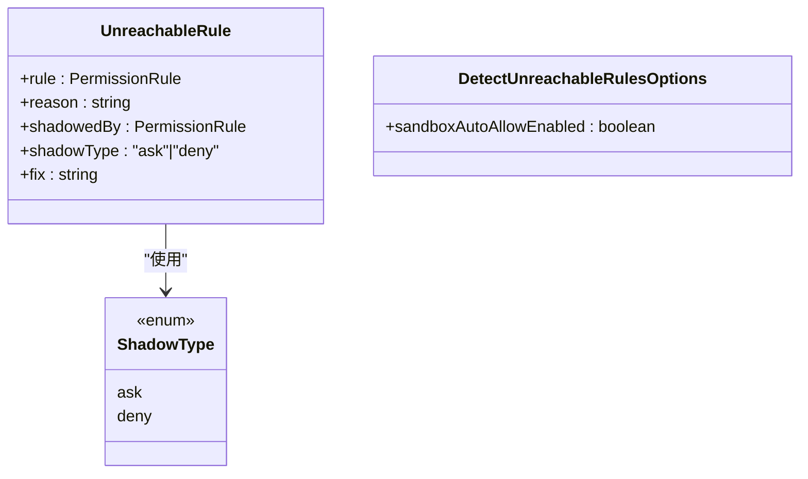
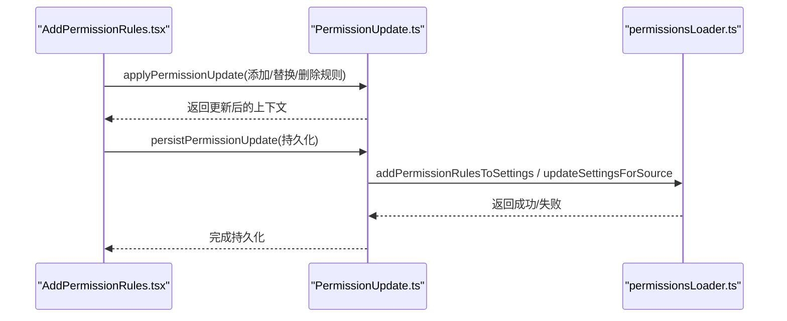
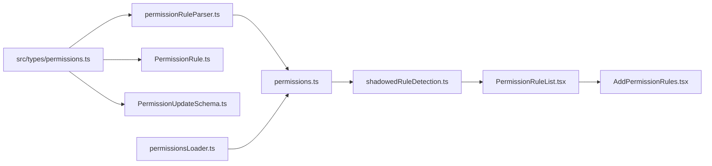

# 权限规则系统

<cite>
**本文档引用的文件**
- [src/utils/permissions/permissionRuleParser.ts](file://src/utils/permissions/permissionRuleParser.ts)
- [src/utils/permissions/permissions.ts](file://src/utils/permissions/permissions.ts)
- [src/utils/permissions/PermissionRule.ts](file://src/utils/permissions/PermissionRule.ts)
- [src/utils/permissions/PermissionUpdate.ts](file://src/utils/permissions/PermissionUpdate.ts)
- [src/utils/permissions/PermissionUpdateSchema.ts](file://src/utils/permissions/PermissionUpdateSchema.ts)
- [src/utils/permissions/shadowedRuleDetection.ts](file://src/utils/permissions/shadowedRuleDetection.ts)
- [src/utils/permissions/permissionsLoader.ts](file://src/utils/permissions/permissionsLoader.ts)
- [src/types/permissions.ts](file://src/types/permissions.ts)
- [src/components/permissions/rules/PermissionRuleList.tsx](file://src/components/permissions/rules/PermissionRuleList.tsx)
- [src/components/permissions/rules/AddPermissionRules.tsx](file://src/components/permissions/rules/AddPermissionRules.tsx)
- [src/commands/permissions/permissions.tsx](file://src/commands/permissions/permissions.tsx)
</cite>

## 目录
1. [简介](#简介)
2. [项目结构](#项目结构)
3. [核心组件](#核心组件)
4. [架构总览](#架构总览)
5. [详细组件分析](#详细组件分析)
6. [依赖关系分析](#依赖关系分析)
7. [性能考量](#性能考量)
8. [故障排除指南](#故障排除指南)
9. [结论](#结论)
10. [附录](#附录)

## 简介
本文件系统性阐述 Claude Code 的权限规则系统，覆盖规则定义、解析与匹配机制，规则语法与优先级、冲突检测，以及路径验证、文件系统与危险模式规则。同时提供配置示例、测试方法、扩展性设计与自定义规则实现建议，并给出优化策略与调试排障指南。

## 项目结构
权限规则系统主要由以下层次构成：
- 类型与模式层：定义规则值、行为、来源、更新操作等类型与校验模式（src/types/permissions.ts、src/utils/permissions/PermissionRule.ts、src/utils/permissions/PermissionUpdateSchema.ts）
- 规则解析与存储层：规则字符串解析/序列化、规则加载与持久化（src/utils/permissions/permissionRuleParser.ts、src/utils/permissions/permissionsLoader.ts）
- 规则评估与决策层：工具权限检查、决策生成、自动模式分类器集成（src/utils/permissions/permissions.ts）
- 冲突检测与可视化层：不可达规则检测、规则列表与交互界面（src/utils/permissions/shadowedRuleDetection.ts、src/components/permissions/rules/PermissionRuleList.tsx、src/components/permissions/rules/AddPermissionRules.tsx）
- 命令入口与设置交互：命令行入口、规则列表 UI（src/commands/permissions/permissions.tsx）

图表来源
- [src/types/permissions.ts:1-442](file://src/types/permissions.ts#L1-L442)
- [src/utils/permissions/permissionRuleParser.ts:1-199](file://src/utils/permissions/permissionRuleParser.ts#L1-L199)
- [src/utils/permissions/permissions.ts:1-800](file://src/utils/permissions/permissions.ts#L1-L800)
- [src/utils/permissions/permissionsLoader.ts:1-297](file://src/utils/permissions/permissionsLoader.ts#L1-L297)
- [src/utils/permissions/shadowedRuleDetection.ts:1-235](file://src/utils/permissions/shadowedRuleDetection.ts#L1-L235)
- [src/components/permissions/rules/PermissionRuleList.tsx:1-800](file://src/components/permissions/rules/PermissionRuleList.tsx#L1-L800)
- [src/components/permissions/rules/AddPermissionRules.tsx:1-180](file://src/components/permissions/rules/AddPermissionRules.tsx#L1-L180)
- [src/commands/permissions/permissions.tsx:1-9](file://src/commands/permissions/permissions.tsx#L1-L9)

章节来源
- [src/types/permissions.ts:1-442](file://src/types/permissions.ts#L1-L442)
- [src/utils/permissions/permissionRuleParser.ts:1-199](file://src/utils/permissions/permissionRuleParser.ts#L1-L199)
- [src/utils/permissions/permissions.ts:1-800](file://src/utils/permissions/permissions.ts#L1-L800)
- [src/utils/permissions/permissionsLoader.ts:1-297](file://src/utils/permissions/permissionsLoader.ts#L1-L297)
- [src/utils/permissions/shadowedRuleDetection.ts:1-235](file://src/utils/permissions/shadowedRuleDetection.ts#L1-L235)
- [src/components/permissions/rules/PermissionRuleList.tsx:1-800](file://src/components/permissions/rules/PermissionRuleList.tsx#L1-L800)
- [src/components/permissions/rules/AddPermissionRules.tsx:1-180](file://src/components/permissions/rules/AddPermissionRules.tsx#L1-L180)
- [src/commands/permissions/permissions.tsx:1-9](file://src/commands/permissions/permissions.tsx#L1-L9)

## 核心组件
- 规则值与行为：规则值包含工具名与可选内容；行为包括允许、拒绝、询问；来源涵盖用户设置、项目设置、本地设置、策略设置、命令行参数、会话等。
- 解析器：支持转义括号、解析“工具名(内容)”格式、规范化旧版工具名映射。
- 加载器：从多源设置加载规则，支持仅受管规则模式。
- 决策引擎：按来源与行为组合构建规则集，执行工具匹配与决策，支持自动模式分类器。
- 冲突检测：识别被询问或拒绝规则遮蔽的“不可达”允许规则。
- 更新与持久化：支持添加、替换、删除规则与工作目录，按目标源持久化。

章节来源
- [src/types/permissions.ts:44-147](file://src/types/permissions.ts#L44-L147)
- [src/utils/permissions/permissionRuleParser.ts:43-199](file://src/utils/permissions/permissionRuleParser.ts#L43-L199)
- [src/utils/permissions/permissionsLoader.ts:85-145](file://src/utils/permissions/permissionsLoader.ts#L85-L145)
- [src/utils/permissions/permissions.ts:122-302](file://src/utils/permissions/permissions.ts#L122-L302)
- [src/utils/permissions/shadowedRuleDetection.ts:186-235](file://src/utils/permissions/shadowedRuleDetection.ts#L186-L235)
- [src/utils/permissions/PermissionUpdate.ts:55-188](file://src/utils/permissions/PermissionUpdate.ts#L55-L188)

## 架构总览
权限规则系统采用“类型定义—解析/加载—评估决策—冲突检测—界面交互”的分层架构。类型与模式层确保输入合法性；解析与加载层负责规则的字符串到对象转换与持久化；评估层执行匹配与决策；冲突检测层保障规则有效性；界面层提供规则管理与可视化。

图表来源
- [src/commands/permissions/permissions.tsx:1-9](file://src/commands/permissions/permissions.tsx#L1-L9)
- [src/components/permissions/rules/PermissionRuleList.tsx:1-800](file://src/components/permissions/rules/PermissionRuleList.tsx#L1-L800)
- [src/utils/permissions/permissionRuleParser.ts:81-152](file://src/utils/permissions/permissionRuleParser.ts#L81-L152)
- [src/utils/permissions/permissionsLoader.ts:120-145](file://src/utils/permissions/permissionsLoader.ts#L120-L145)
- [src/utils/permissions/permissions.ts:122-302](file://src/utils/permissions/permissions.ts#L122-L302)
- [src/utils/permissions/shadowedRuleDetection.ts:193-235](file://src/utils/permissions/shadowedRuleDetection.ts#L193-L235)

## 详细组件分析

### 规则语法与解析
- 语法格式：工具名或“工具名(规则内容)”。规则内容中括号需转义，反斜杠也需转义。
- 解析流程：查找首个未转义左括号与最后一个未转义右括号，校验闭合与结尾，提取工具名与内容，进行旧版工具名规范化。
- 序列化：将规则值转回字符串，对括号与反斜杠进行转义。

图表来源
- [src/utils/permissions/permissionRuleParser.ts:81-133](file://src/utils/permissions/permissionRuleParser.ts#L81-L133)
- [src/utils/permissions/permissionRuleParser.ts:154-198](file://src/utils/permissions/permissionRuleParser.ts#L154-L198)

章节来源
- [src/utils/permissions/permissionRuleParser.ts:43-199](file://src/utils/permissions/permissionRuleParser.ts#L43-L199)

### 规则优先级与匹配机制
- 规则来源：用户设置、项目设置、本地设置、策略设置、命令行参数、会话。
- 匹配顺序与优先级：
  1) 工具级拒绝规则优先于允许规则；
  2) 工具级询问规则优先于特定允许规则（除非沙箱自动放行）；
  3) 允许规则按来源合并，最终以“拒绝>询问>允许”的顺序生效。
- MCP 工具匹配：支持服务器级规则（如 mcp__server1），并支持通配符。
- 自动模式：在 auto/plan 模式下，若满足 acceptEdits 快速路径或安全工具白名单，则跳过分类器；否则运行分类器进行自动审批。

图表来源
- [src/utils/permissions/permissions.ts:122-302](file://src/utils/permissions/permissions.ts#L122-L302)
- [src/utils/permissions/permissions.ts:473-800](file://src/utils/permissions/permissions.ts#L473-L800)

章节来源
- [src/utils/permissions/permissions.ts:122-302](file://src/utils/permissions/permissions.ts#L122-L302)
- [src/utils/permissions/permissions.ts:473-800](file://src/utils/permissions/permissions.ts#L473-L800)

### 规则冲突检测与不可达规则
- 不可达规则类型：
  - 被工具级拒绝规则完全阻断的特定允许规则（更严重）；
  - 被工具级询问规则遮蔽的特定允许规则（较轻）。
- 特殊处理：当询问规则来自个人设置且沙箱自动放行启用时，不视为遮蔽。
- 修复建议：移除遮蔽来源中的工具级规则，或移除被遮蔽的具体规则。

图表来源
- [src/utils/permissions/shadowedRuleDetection.ts:11-25](file://src/utils/permissions/shadowedRuleDetection.ts#L11-L25)
- [src/utils/permissions/shadowedRuleDetection.ts:28-37](file://src/utils/permissions/shadowedRuleDetection.ts#L28-L37)

章节来源
- [src/utils/permissions/shadowedRuleDetection.ts:186-235](file://src/utils/permissions/shadowedRuleDetection.ts#L186-L235)

### 规则持久化与更新
- 支持的操作：添加、替换、删除规则；设置模式；增删额外工作目录。
- 目标源：用户设置、项目设置、本地设置、会话、命令行参数。
- 去重与规范化：持久化前对规则进行规范化与去重，保留未知字段。

图表来源
- [src/components/permissions/rules/AddPermissionRules.tsx:48-112](file://src/components/permissions/rules/AddPermissionRules.tsx#L48-L112)
- [src/utils/permissions/PermissionUpdate.ts:55-188](file://src/utils/permissions/PermissionUpdate.ts#L55-L188)
- [src/utils/permissions/permissionsLoader.ts:229-297](file://src/utils/permissions/permissionsLoader.ts#L229-L297)

章节来源
- [src/utils/permissions/PermissionUpdate.ts:55-353](file://src/utils/permissions/PermissionUpdate.ts#L55-L353)
- [src/utils/permissions/permissionsLoader.ts:229-297](file://src/utils/permissions/permissionsLoader.ts#L229-L297)

### 规则列表与交互界面
- 功能：列出允许/询问/拒绝规则，支持搜索、添加新规则、删除规则、添加/移除工作目录。
- 可达性：支持键盘快捷键、焦点管理、搜索模式切换。
- 不可达规则提示：添加规则后检测并提示潜在冲突。

章节来源
- [src/components/permissions/rules/PermissionRuleList.tsx:1-800](file://src/components/permissions/rules/PermissionRuleList.tsx#L1-L800)
- [src/components/permissions/rules/AddPermissionRules.tsx:1-180](file://src/components/permissions/rules/AddPermissionRules.tsx#L1-L180)

## 依赖关系分析
- 类型依赖：所有实现均依赖 src/types/permissions.ts 中的类型定义，避免循环导入。
- 解析依赖：决策引擎与 UI 组件均依赖解析器提供的字符串↔规则值转换。
- 加载依赖：决策引擎通过加载器获取规则，支持仅受管规则模式。
- 冲突检测依赖：UI 在添加规则后调用冲突检测模块，提供修复建议。

图表来源
- [src/types/permissions.ts:1-442](file://src/types/permissions.ts#L1-L442)
- [src/utils/permissions/permissionRuleParser.ts:1-199](file://src/utils/permissions/permissionRuleParser.ts#L1-L199)
- [src/utils/permissions/permissions.ts:1-800](file://src/utils/permissions/permissions.ts#L1-L800)
- [src/utils/permissions/permissionsLoader.ts:1-297](file://src/utils/permissions/permissionsLoader.ts#L1-L297)
- [src/utils/permissions/shadowedRuleDetection.ts:1-235](file://src/utils/permissions/shadowedRuleDetection.ts#L1-L235)
- [src/components/permissions/rules/PermissionRuleList.tsx:1-800](file://src/components/permissions/rules/PermissionRuleList.tsx#L1-L800)
- [src/components/permissions/rules/AddPermissionRules.tsx:1-180](file://src/components/permissions/rules/AddPermissionRules.tsx#L1-L180)

章节来源
- [src/types/permissions.ts:1-442](file://src/types/permissions.ts#L1-L442)
- [src/utils/permissions/permissions.ts:1-800](file://src/utils/permissions/permissions.ts#L1-L800)
- [src/utils/permissions/permissionsLoader.ts:1-297](file://src/utils/permissions/permissionsLoader.ts#L1-L297)
- [src/utils/permissions/shadowedRuleDetection.ts:1-235](file://src/utils/permissions/shadowedRuleDetection.ts#L1-L235)
- [src/components/permissions/rules/PermissionRuleList.tsx:1-800](file://src/components/permissions/rules/PermissionRuleList.tsx#L1-L800)
- [src/components/permissions/rules/AddPermissionRules.tsx:1-180](file://src/components/permissions/rules/AddPermissionRules.tsx#L1-L180)

## 性能考量
- 字符串解析：解析器对括号与反斜杠的转义/逆向处理为线性复杂度，适合大规模规则集。
- 规则构建：按来源聚合规则，使用 Map/Set 进行去重与查找，时间复杂度近似 O(n)。
- 分类器短路：acceptEdits 快速路径与安全工具白名单可显著减少分类器调用次数。
- 冲突检测：对允许规则逐一检查拒绝/询问遮蔽，整体复杂度 O(n_allow_rules × (n_ask_rules + n_deny_rules))，在合理规模内可接受。

## 故障排除指南
- 规则未生效：
  - 检查规则来源与目标源是否正确（用户/项目/本地/策略/会话/命令行参数）。
  - 使用规则列表界面确认规则已持久化且未被遮蔽。
- 规则被遮蔽：
  - 查看不可达规则警告，按建议移除遮蔽来源中的工具级规则或具体允许规则。
- 自动模式误判：
  - 确认工具是否在安全白名单；若非，检查分类器可用性与错误提示。
- MCP 工具不匹配：
  - 确认规则使用正确的服务器级名称或通配符格式。
- 旧版工具名导致不匹配：
  - 解析器会进行旧名到新名的规范化，确保规则使用最新工具名。

章节来源
- [src/utils/permissions/shadowedRuleDetection.ts:186-235](file://src/utils/permissions/shadowedRuleDetection.ts#L186-L235)
- [src/utils/permissions/permissions.ts:473-800](file://src/utils/permissions/permissions.ts#L473-L800)
- [src/utils/permissions/permissionsLoader.ts:229-297](file://src/utils/permissions/permissionsLoader.ts#L229-L297)

## 结论
该权限规则系统通过清晰的类型定义、严谨的解析与加载、可解释的匹配与决策、以及可视化的冲突检测，实现了灵活而安全的权限控制。其分层设计便于扩展与维护，支持企业级受管规则模式与自动模式增强用户体验。

## 附录

### 规则语法与示例
- 工具级规则：例如 Bash、Read。
- 内容级规则：例如 Bash(npm install)、Read(/path/**)。
- 通配符规则：例如 Bash(*)、Read(project/**)。
- 转义规则：括号与反斜杠需按解析器要求转义。

章节来源
- [src/utils/permissions/permissionRuleParser.ts:43-199](file://src/utils/permissions/permissionRuleParser.ts#L43-L199)

### 规则优先级与冲突检测要点
- 拒绝优先于允许；
- 询问优先于特定允许（沙箱自动放行例外）；
- 不可达规则会提示修复建议。

章节来源
- [src/utils/permissions/permissions.ts:122-302](file://src/utils/permissions/permissions.ts#L122-L302)
- [src/utils/permissions/shadowedRuleDetection.ts:186-235](file://src/utils/permissions/shadowedRuleDetection.ts#L186-L235)

### 配置示例与测试方法
- 配置示例：
  - 添加允许规则：在用户/项目/本地设置中添加“Bash”或“Read(/src/**)”。
  - 设置模式：将默认模式设为 auto/plan/dontAsk/acceptEdits/bypassPermissions。
  - 增加工作目录：允许访问特定路径范围。
- 测试方法：
  - 使用规则列表界面添加规则并观察不可达警告；
  - 在不同模式下触发工具调用，验证自动模式分类器行为；
  - 对 MCP 工具与旧版工具名进行兼容性测试。

章节来源
- [src/components/permissions/rules/AddPermissionRules.tsx:1-180](file://src/components/permissions/rules/AddPermissionRules.tsx#L1-L180)
- [src/components/permissions/rules/PermissionRuleList.tsx:1-800](file://src/components/permissions/rules/PermissionRuleList.tsx#L1-L800)
- [src/utils/permissions/permissions.ts:473-800](file://src/utils/permissions/permissions.ts#L473-L800)

### 扩展性设计与自定义规则实现
- 新增规则行为：在类型定义中扩展行为枚举，并在解析器与更新模块中适配。
- 新增规则来源：在类型与更新模式中新增来源枚举，并在加载器与持久化逻辑中支持。
- 自定义匹配：在决策引擎中扩展工具匹配逻辑（如基于内容的正则匹配）。
- 分类器集成：通过现有分类器接口扩展新的自动决策策略。

章节来源
- [src/types/permissions.ts:44-147](file://src/types/permissions.ts#L44-L147)
- [src/utils/permissions/PermissionUpdateSchema.ts:24-79](file://src/utils/permissions/PermissionUpdateSchema.ts#L24-L79)
- [src/utils/permissions/permissions.ts:122-302](file://src/utils/permissions/permissions.ts#L122-L302)