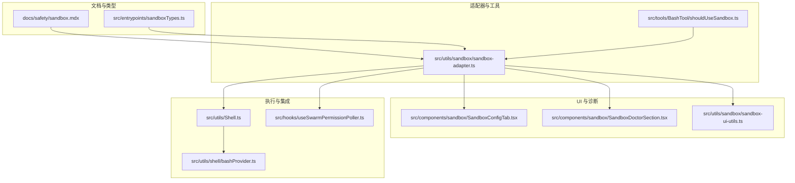
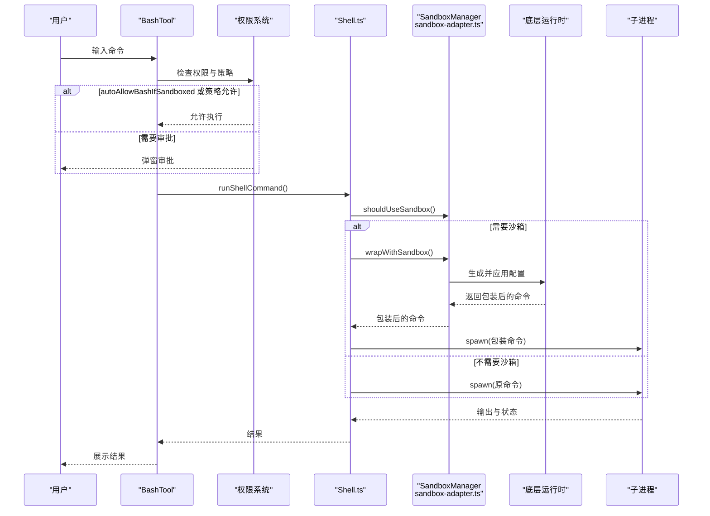
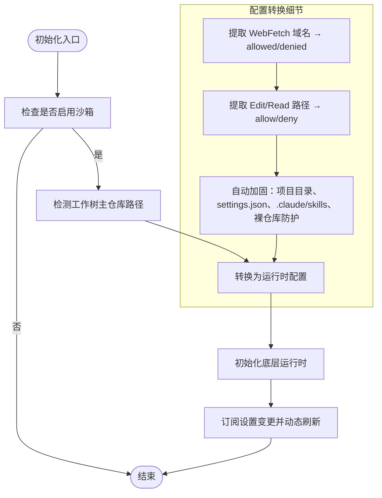
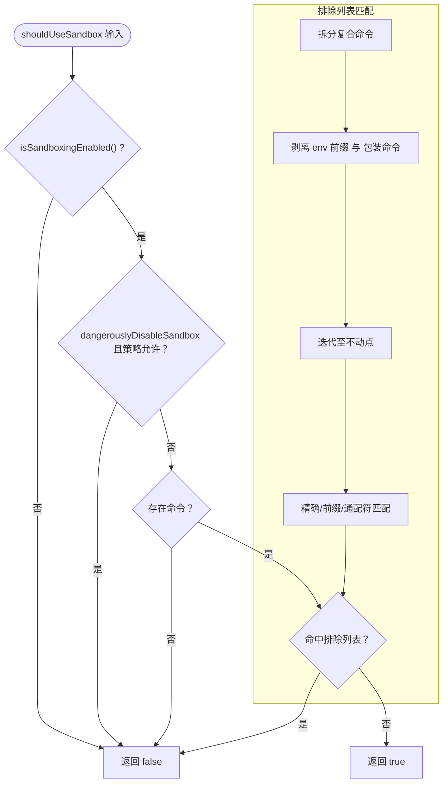
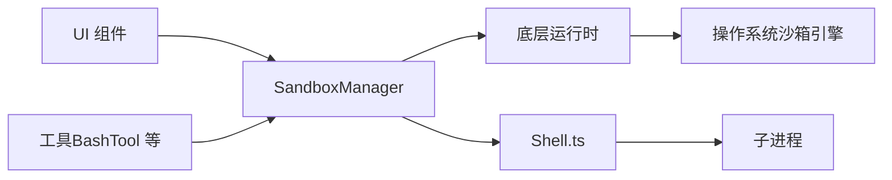

# 沙箱系统

<cite>
**本文引用的文件**
- [docs/safety/sandbox.mdx](file://docs/safety/sandbox.mdx)
- [src/utils/sandbox/sandbox-adapter.ts](file://src/utils/sandbox/sandbox-adapter.ts)
- [src/tools/BashTool/shouldUseSandbox.ts](file://src/tools/BashTool/shouldUseSandbox.ts)
- [src/entrypoints/sandboxTypes.ts](file://src/entrypoints/sandboxTypes.ts)
- [src/components/sandbox/SandboxConfigTab.tsx](file://src/components/sandbox/SandboxConfigTab.tsx)
- [src/components/sandbox/SandboxDoctorSection.tsx](file://src/components/sandbox/SandboxDoctorSection.tsx)
- [src/utils/sandbox/sandbox-ui-utils.ts](file://src/utils/sandbox/sandbox-ui-utils.ts)
- [src/utils/Shell.ts](file://src/utils/Shell.ts)
- [src/utils/shell/bashProvider.ts](file://src/utils/shell/bashProvider.ts)
- [src/hooks/useSwarmPermissionPoller.ts](file://src/hooks/useSwarmPermissionPoller.ts)
</cite>

## 目录
1. [简介](#简介)
2. [项目结构](#项目结构)
3. [核心组件](#核心组件)
4. [架构总览](#架构总览)
5. [详细组件分析](#详细组件分析)
6. [依赖关系分析](#依赖关系分析)
7. [性能考量](#性能考量)
8. [故障排除指南](#故障排除指南)
9. [结论](#结论)
10. [附录](#附录)

## 简介
本文件系统性阐述 Claude Code 的沙箱系统：实现原理、隔离机制与安全边界；沙箱适配器设计、工具隔离与资源限制；沙箱启动流程、权限控制与访问审计；配置选项与性能优化策略；与系统其他组件的集成方式；安全测试与漏洞防护；以及跨操作系统的实现差异与故障排除。

## 项目结构
围绕沙箱的关键代码分布在以下模块：
- 文档与说明：docs/safety/sandbox.mdx
- 沙箱适配器：src/utils/sandbox/sandbox-adapter.ts
- Bash 工具沙箱判定：src/tools/BashTool/shouldUseSandbox.ts
- 沙箱类型定义与校验：src/entrypoints/sandboxTypes.ts
- UI 配置与诊断：src/components/sandbox/SandboxConfigTab.tsx、src/components/sandbox/SandboxDoctorSection.tsx
- UI 工具与日志：src/utils/sandbox/sandbox-ui-utils.ts
- Shell 执行与包装：src/utils/Shell.ts、src/utils/shell/bashProvider.ts
- 权限请求与响应（集群/分身）：src/hooks/useSwarmPermissionPoller.ts

图表来源
- [docs/safety/sandbox.mdx](file://docs/safety/sandbox.mdx)
- [src/utils/sandbox/sandbox-adapter.ts](file://src/utils/sandbox/sandbox-adapter.ts)
- [src/tools/BashTool/shouldUseSandbox.ts](file://src/tools/BashTool/shouldUseSandbox.ts)
- [src/entrypoints/sandboxTypes.ts](file://src/entrypoints/sandboxTypes.ts)
- [src/components/sandbox/SandboxConfigTab.tsx](file://src/components/sandbox/SandboxConfigTab.tsx)
- [src/components/sandbox/SandboxDoctorSection.tsx](file://src/components/sandbox/SandboxDoctorSection.tsx)
- [src/utils/sandbox/sandbox-ui-utils.ts](file://src/utils/sandbox/sandbox-ui-utils.ts)
- [src/utils/Shell.ts](file://src/utils/Shell.ts)
- [src/utils/shell/bashProvider.ts](file://src/utils/shell/bashProvider.ts)
- [src/hooks/useSwarmPermissionPoller.ts](file://src/hooks/useSwarmPermissionPoller.ts)

章节来源
- [docs/safety/sandbox.mdx](file://docs/safety/sandbox.mdx)
- [src/utils/sandbox/sandbox-adapter.ts](file://src/utils/sandbox/sandbox-adapter.ts)
- [src/tools/BashTool/shouldUseSandbox.ts](file://src/tools/BashTool/shouldUseSandbox.ts)
- [src/entrypoints/sandboxTypes.ts](file://src/entrypoints/sandboxTypes.ts)
- [src/components/sandbox/SandboxConfigTab.tsx](file://src/components/sandbox/SandboxConfigTab.tsx)
- [src/components/sandbox/SandboxDoctorSection.tsx](file://src/components/sandbox/SandboxDoctorSection.tsx)
- [src/utils/sandbox/sandbox-ui-utils.ts](file://src/utils/sandbox/sandbox-ui-utils.ts)
- [src/utils/Shell.ts](file://src/utils/Shell.ts)
- [src/utils/shell/bashProvider.ts](file://src/utils/shell/bashProvider.ts)
- [src/hooks/useSwarmPermissionPoller.ts](file://src/hooks/useSwarmPermissionPoller.ts)

## 核心组件
- 沙箱适配器（SandboxManager）
  - 负责将用户设置转换为运行时配置、初始化底层运行时、动态刷新配置、包装命令、清理残留与违规标注。
  - 提供平台检测、依赖检查、策略覆盖（仅受托管域）、工作树主仓库路径检测、裸仓库防护等能力。
- Bash 工具沙箱判定（shouldUseSandbox）
  - 基于全局开关、策略允许、命令排除列表与复合命令拆解，决定是否对命令进行沙箱包裹。
- 沙箱类型与配置（SandboxSettingsSchema）
  - 定义网络、文件系统、忽略违规、代理端口、弱化隔离、排除命令、ripgrep 等配置项，并提供 Zod 校验。
- UI 配置与诊断
  - SandboxConfigTab 展示当前生效的文件/网络/Unix Socket/排除命令等限制；SandboxDoctorSection 展示依赖检查结果与状态提示。
- Shell 执行与包装
  - Shell.ts 将命令字符串交由 SandboxManager.wrapWithSandbox 包装后再 spawn；bashProvider 负责构建 shell 初始化与快照。
- 权限请求与响应（集群/分身）
  - useSwarmPermissionPoller 提供沙箱网络权限请求的注册、回调与处理，确保多进程协作下的权限一致性。

章节来源
- [src/utils/sandbox/sandbox-adapter.ts](file://src/utils/sandbox/sandbox-adapter.ts)
- [src/tools/BashTool/shouldUseSandbox.ts](file://src/tools/BashTool/shouldUseSandbox.ts)
- [src/entrypoints/sandboxTypes.ts](file://src/entrypoints/sandboxTypes.ts)
- [src/components/sandbox/SandboxConfigTab.tsx](file://src/components/sandbox/SandboxConfigTab.tsx)
- [src/components/sandbox/SandboxDoctorSection.tsx](file://src/components/sandbox/SandboxDoctorSection.tsx)
- [src/utils/Shell.ts](file://src/utils/Shell.ts)
- [src/utils/shell/bashProvider.ts](file://src/utils/shell/bashProvider.ts)
- [src/hooks/useSwarmPermissionPoller.ts](file://src/hooks/useSwarmPermissionPoller.ts)

## 架构总览
沙箱系统采用“应用层权限 + 操作系统级沙箱”的双层纵深防御：
- 应用层（权限）：在工具调用前检查，决定是否弹窗审批。
- 沙箱层（OS 级）：在进程级别强制约束，即使 AI 生成了恶意命令也难以突破。

图表来源
- [src/tools/BashTool/shouldUseSandbox.ts](file://src/tools/BashTool/shouldUseSandbox.ts)
- [src/utils/Shell.ts](file://src/utils/Shell.ts)
- [src/utils/sandbox/sandbox-adapter.ts](file://src/utils/sandbox/sandbox-adapter.ts)

## 详细组件分析

### 沙箱适配器（SandboxManager）设计
- 配置转换
  - 将权限规则（Edit/Read/WebFetch）与用户设置合并，生成运行时配置（网络/文件系统/ripgrep 等）。
  - 自动加固：将项目目录加入可写、阻止写 settings.json 与 .claude/skills、检测并保护裸仓库攻击向量。
- 初始化与动态刷新
  - 初始化时解析工作树主仓库路径，构建运行时配置并订阅设置变更，实时更新沙箱策略。
- 命令包装与清理
  - wrapWithSandbox 返回经平台沙箱引擎包装的命令字符串；cleanupAfterCommand 清理残留与裸仓库文件。
- 平台差异与依赖
  - macOS 使用 sandbox-exec（Seatbelt）；Linux 使用 bubblewrap + seccomp；WSL2 支持，WSL1 不支持。
  - 依赖检查（ripgrep、bwrap、socat、seccomp）失败时可选择报错或降级运行。

图表来源
- [src/utils/sandbox/sandbox-adapter.ts](file://src/utils/sandbox/sandbox-adapter.ts)

章节来源
- [src/utils/sandbox/sandbox-adapter.ts](file://src/utils/sandbox/sandbox-adapter.ts)

### Bash 工具沙箱判定（shouldUseSandbox）
- 判定逻辑
  - 全局开关：SandboxManager.isSandboxingEnabled()
  - 显式跳过：dangerouslyDisableSandbox 且策略允许
  - 命令为空：不沙箱
  - 排除列表：containsExcludedCommand（精确/前缀/通配符，支持复合命令拆分与包装剥离）
- 排除列表匹配
  - 复合命令（如 a && b）拆分子命令逐一检查
  - 剥离环境变量前缀与安全包装命令，迭代至不动点，避免绕过

图表来源
- [src/tools/BashTool/shouldUseSandbox.ts](file://src/tools/BashTool/shouldUseSandbox.ts)

章节来源
- [src/tools/BashTool/shouldUseSandbox.ts](file://src/tools/BashTool/shouldUseSandbox.ts)

### 沙箱配置模型与类型
- 配置来源：settings.json 的 sandbox 字段，结合权限规则与策略设置
- 关键字段
  - enabled、autoAllowBashIfSandboxed、allowUnsandboxedCommands、failIfUnavailable
  - network：allowedDomains、deniedDomains、allowLocalBinding、httpProxyPort、socksProxyPort、allowUnixSockets、allowAllUnixSockets
  - filesystem：allowWrite、denyWrite、denyRead、allowRead、allowManagedReadPathsOnly
  - 其他：excludedCommands、ripgrep、ignoreViolations、enableWeakerNestedSandbox、enableWeakerNetworkIsolation
- 类型校验：SandboxSettingsSchema 使用 Zod 对配置进行严格验证

章节来源
- [src/entrypoints/sandboxTypes.ts](file://src/entrypoints/sandboxTypes.ts)
- [docs/safety/sandbox.mdx](file://docs/safety/sandbox.mdx)

### UI 配置与诊断
- SandboxConfigTab
  - 展示当前生效的排除命令、文件系统读写限制、网络限制（托管模式下仅显示托管域）、允许的 Unix Socket、Linux 下的 glob 警告
- SandboxDoctorSection
  - 展示依赖检查错误与警告，支持在沙箱不可用时给出安装指引

章节来源
- [src/components/sandbox/SandboxConfigTab.tsx](file://src/components/sandbox/SandboxConfigTab.tsx)
- [src/components/sandbox/SandboxDoctorSection.tsx](file://src/components/sandbox/SandboxDoctorSection.tsx)

### Shell 执行与包装
- Shell.ts
  - 将命令交由 SandboxManager.wrapWithSandbox 包装，再 spawn 子进程；为沙箱化 PowerShell 场景提供专用处理
  - 在沙箱化时创建安全权限的临时目录
- bashProvider
  - 构建 shell 初始化命令，处理快照缺失回退为登录 shell 的场景，保证环境一致性

章节来源
- [src/utils/Shell.ts](file://src/utils/Shell.ts)
- [src/utils/shell/bashProvider.ts](file://src/utils/shell/bashProvider.ts)

### 权限请求与响应（集群/分身）
- useSwarmPermissionPoller
  - 注册沙箱网络权限请求回调，处理来自工作节点的响应，统一决策是否允许主机访问

章节来源
- [src/hooks/useSwarmPermissionPoller.ts](file://src/hooks/useSwarmPermissionPoller.ts)

## 依赖关系分析
- 低耦合高内聚
  - 沙箱适配器作为桥接层，向上对接工具与 UI，向下对接底层运行时，职责清晰
- 外部依赖
  - macOS：sandbox-exec（Seatbelt）
  - Linux/WSL：bubblewrap、socat、libseccomp
- 动态配置
  - 通过设置变更检测器订阅配置变化，实时更新运行时策略，避免重启

图表来源
- [src/utils/sandbox/sandbox-adapter.ts](file://src/utils/sandbox/sandbox-adapter.ts)
- [src/utils/Shell.ts](file://src/utils/Shell.ts)

章节来源
- [src/utils/sandbox/sandbox-adapter.ts](file://src/utils/sandbox/sandbox-adapter.ts)
- [src/utils/Shell.ts](file://src/utils/Shell.ts)

## 性能考量
- 启动与初始化
  - 初始化过程异步，使用 Promise 防止竞态；依赖检查结果缓存（memoize），减少重复开销
- 配置刷新
  - 设置变更时同步刷新运行时配置，避免并发请求使用过期策略
- 平台差异
  - Linux/WSL 的 bubblewrap 与 seccomp 会带来额外开销；合理配置 allow/deny 规则可降低路径匹配成本
- 日志与监控
  - macOS 默认开启日志监控；其他平台可根据需要调整日志级别

## 故障排除指南
- 沙箱不可用原因排查
  - 平台不支持：WSL1 不支持；非 macOS/Linux/WSL2 报不支持
  - 依赖缺失：缺少 bwrap、socat、ripgrep、seccomp 等；根据提示安装
  - 显式禁用：用户设置 sandbox.enabled=false 或平台不在 enabledPlatforms 列表
- 诊断与修复
  - 使用 /sandbox 或 /doctor 查看依赖状态与建议
  - 检查 excludedCommands 是否误伤；调整 allow/deny 规则
  - Linux 下注意 glob 模式限制，必要时改用 /** 或调整规则
- 运行后清理
  - cleanupAfterCommand 会清理残留文件与裸仓库文件；若出现异常，手动检查并清理

章节来源
- [src/utils/sandbox/sandbox-adapter.ts](file://src/utils/sandbox/sandbox-adapter.ts)
- [src/components/sandbox/SandboxDoctorSection.tsx](file://src/components/sandbox/SandboxDoctorSection.tsx)

## 结论
Claude Code 的沙箱系统通过“应用层权限 + OS 级沙箱”的双层设计，在保证易用性的同时提供了强健的安全边界。适配器层抽象出平台差异与配置转换，工具层提供细粒度的沙箱判定，UI 层提供透明的配置与诊断，整体形成闭环的安全执行链路。通过合理的配置与运维实践，可在不同平台上获得一致且可控的隔离体验。

## 附录

### 沙箱违规处理与审计
- 违规捕获：运行时捕获文件/网络访问被拒事件
- 标注与展示：annotateStderrWithSandboxFailures 注入标签，UI 侧移除标签用于展示
- 持久化：SandboxViolationStore 记录事件，便于审计与复盘

章节来源
- [docs/safety/sandbox.mdx](file://docs/safety/sandbox.mdx)
- [src/utils/sandbox/sandbox-ui-utils.ts](file://src/utils/sandbox/sandbox-ui-utils.ts)