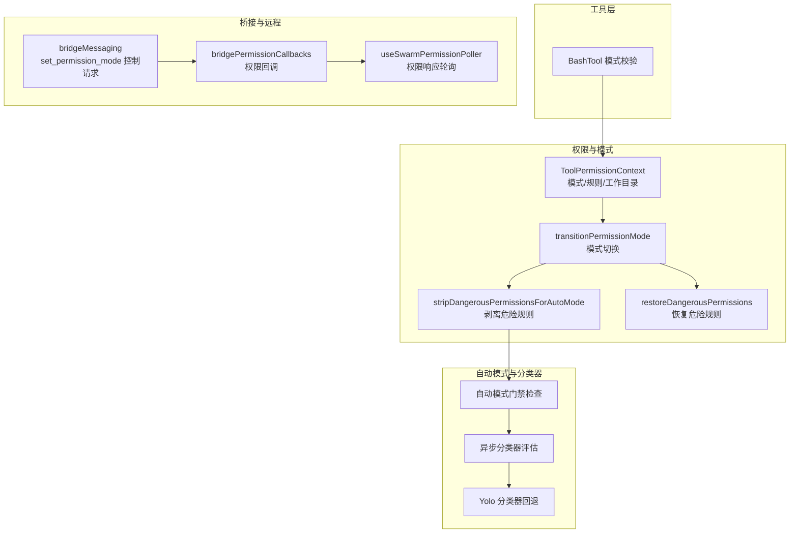
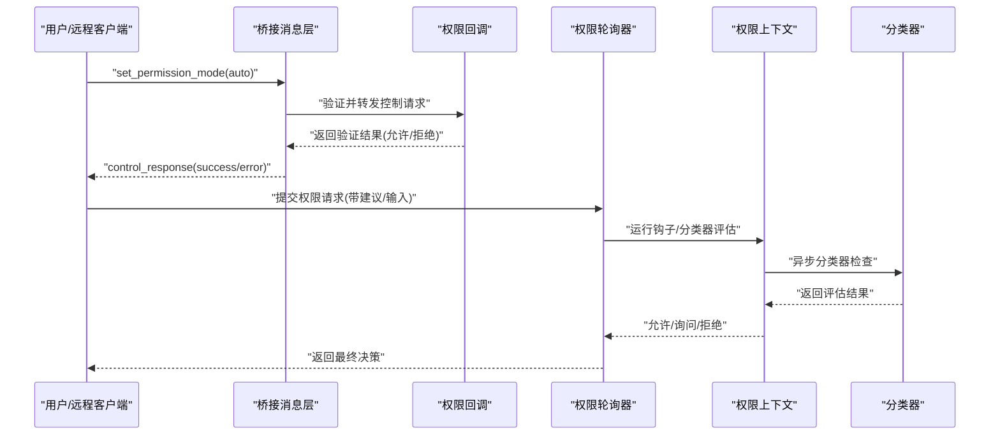
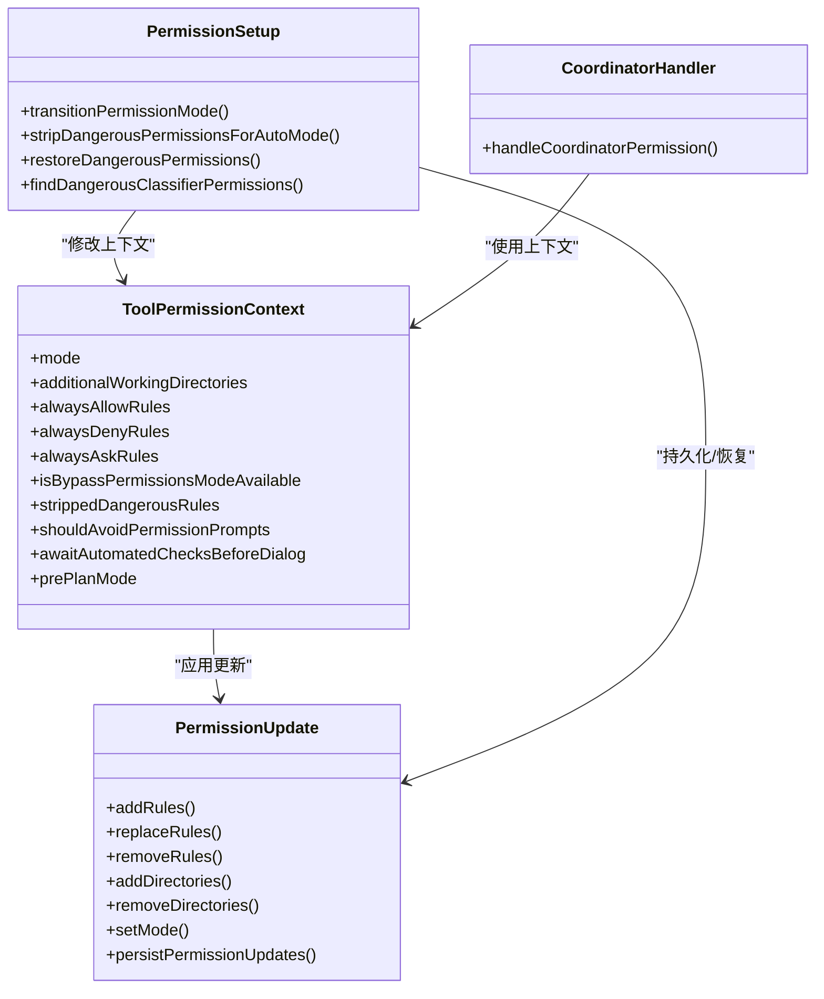

# 自动模式安全

<cite>
**本文引用的文件**
- [src/utils/permissions/permissionSetup.ts](file://src/utils/permissions/permissionSetup.ts)
- [src/utils/permissions/PermissionUpdate.ts](file://src/utils/permissions/PermissionUpdate.ts)
- [src/types/permissions.ts](file://src/types/permissions.ts)
- [src/tools/BashTool/modeValidation.ts](file://src/tools/BashTool/modeValidation.ts)
- [src/hooks/useReplBridge.tsx](file://src/hooks/useReplBridge.tsx)
- [src/cli/print.ts](file://src/cli/print.ts)
- [src/bridge/bridgeMessaging.ts](file://src/bridge/bridgeMessaging.ts)
- [src/bridge/bridgePermissionCallbacks.ts](file://src/bridge/bridgePermissionCallbacks.ts)
- [src/hooks/toolPermission/handlers/coordinatorHandler.ts](file://src/hooks/toolPermission/handlers/coordinatorHandler.ts)
- [src/hooks/useSwarmPermissionPoller.ts](file://src/hooks/useSwarmPermissionPoller.ts)
- [src/components/BypassPermissionsModeDialog.tsx](file://src/components/BypassPermissionsModeDialog.tsx)
- [SECURITY.md](file://SECURITY.md)
- [CLAUDE.md](file://CLAUDE.md)
</cite>

## 目录
1. [引言](#引言)
2. [项目结构](#项目结构)
3. [核心组件](#核心组件)
4. [架构总览](#架构总览)
5. [详细组件分析](#详细组件分析)
6. [依赖关系分析](#依赖关系分析)
7. [性能考量](#性能考量)
8. [故障排除指南](#故障排除指南)
9. [结论](#结论)
10. [附录](#附录)

## 引言
本文件系统性阐述 Claude Code 的自动模式（auto mode）安全机制，覆盖自动模式的工作原理、安全边界与风险控制、绕过权限开关、危险模式检测、自动决策算法、状态管理、权限提升机制、安全审计、配置选项与策略、权限处理流程与异常处理、最佳实践与风险评估方法，以及故障排除与安全加固指南。内容基于仓库中权限体系、自动模式相关实现与桥接通信模块进行归纳总结。

## 项目结构
自动模式安全涉及以下关键路径与模块：
- 权限上下文与规则：工具权限上下文、规则来源与持久化、模式切换与危险规则剥离/恢复
- 自动模式判定与分类器：自动模式启用门禁、分类器异步评估、Yolo 分类器回退
- 工具层模式校验：Bash 等工具在不同模式下的行为差异
- 桥接与远程控制：桥接消息、权限回调、远程会话中的模式切换
- UI 与交互：绕过权限确认对话框、自动模式入会提示等

图示来源
- [src/utils/permissions/permissionSetup.ts](file://src/utils/permissions/permissionSetup.ts)
- [src/utils/permissions/PermissionUpdate.ts](file://src/utils/permissions/PermissionUpdate.ts)
- [src/types/permissions.ts](file://src/types/permissions.ts)
- [src/tools/BashTool/modeValidation.ts](file://src/tools/BashTool/modeValidation.ts)
- [src/bridge/bridgeMessaging.ts](file://src/bridge/bridgeMessaging.ts)
- [src/bridge/bridgePermissionCallbacks.ts](file://src/bridge/bridgePermissionCallbacks.ts)
- [src/hooks/useSwarmPermissionPoller.ts](file://src/hooks/useSwarmPermissionPoller.ts)

章节来源
- [CLAUDE.md](file://CLAUDE.md)

## 核心组件
- 权限模式与结果类型
  - 模式集合：默认、不询问、计划模式、接受编辑、绕过权限、自动模式等
  - 决策类型：允许、询问、拒绝；扩展的“透传”用于跳过模式特定逻辑但保留后续处理
  - 决策原因：规则、模式、子命令结果、钩子、异步代理、沙箱覆盖、分类器、工作目录、安全检查等
- 权限上下文
  - 包含当前模式、额外工作目录、三类规则集合（始终允许/禁止/询问）、是否可用绕过权限模式、自动模式期间剥离的危险规则快照、避免权限提示标志、自动化检查前置标志、计划模式前态等
- 权限更新
  - 支持添加/替换/移除规则、设置模式、增删额外工作目录，并可持久化到用户/项目/本地设置或会话
- 自动模式状态与危险规则处理
  - 进入自动模式时剥离危险规则（如 Bash/PowerShell 全量允许、Agent 子代理允许），退出时恢复
  - 模式切换集中处理，确保计划模式附件、自动模式激活标记、退出附加等副作用一致

章节来源
- [src/types/permissions.ts](file://src/types/permissions.ts)
- [src/utils/permissions/PermissionUpdate.ts](file://src/utils/permissions/PermissionUpdate.ts)
- [src/utils/permissions/permissionSetup.ts](file://src/utils/permissions/permissionSetup.ts)

## 架构总览
自动模式安全架构围绕“门禁—分类器—规则—工具—桥接”的链路展开，强调：
- 启用门禁：自动模式需满足功能门禁与组织策略
- 安全边界：自动模式下仅对非危险规则放行，危险规则在进入时剥离并在退出时恢复
- 自动决策：通过异步分类器评估减少交互，必要时回退到人工确认
- 权限提升：绕过权限模式受组织策略与设置双重限制，且有明确 UI 确认流程
- 远程控制：桥接通道支持模式切换控制请求与权限回调，保证远程会话一致性

图示来源
- [src/bridge/bridgeMessaging.ts](file://src/bridge/bridgeMessaging.ts)
- [src/bridge/bridgePermissionCallbacks.ts](file://src/bridge/bridgePermissionCallbacks.ts)
- [src/hooks/useSwarmPermissionPoller.ts](file://src/hooks/useSwarmPermissionPoller.ts)
- [src/utils/permissions/permissionSetup.ts](file://src/utils/permissions/permissionSetup.ts)

## 详细组件分析

### 自动模式工作原理与安全边界
- 启用门禁
  - 需满足 TRANSCRIPT_CLASSIFIER 功能门禁与组织策略（如 GrowthBook 门禁）
  - 缓存态检查用于快速回退，避免 UI 提示误导
- 危险规则剥离
  - 进入自动模式时，剥离可能绕过分类器的危险规则（如 Bash/PowerShell 全量允许、Agent 允许）
  - 剥离规则来源与持久化目标存在过滤，仅对可编辑设置源生效
- 退出恢复
  - 退出自动模式时恢复之前剥离的危险规则，清空快照，避免重复恢复
- 安全边界
  - 自动模式下仍受工作目录限制、安全检查与分类器约束
  - 对敏感路径（如 .claude/、.git/、shell 配置）允许分类器评估后再决定

章节来源
- [src/utils/permissions/permissionSetup.ts](file://src/utils/permissions/permissionSetup.ts)
- [src/types/permissions.ts](file://src/types/permissions.ts)

### 绕过权限开关与权限提升机制
- 组织策略与设置优先级
  - Statsig 门禁优先于设置项，禁用绕过权限模式时，CLI/设置中的该模式会被忽略并提示
- 本地可用性
  - 仅当会话以“危险跳过权限”启动参数启动时才可用绕过权限模式
- UI 确认
  - 明确的警告对话框要求用户确认风险并记录事件，拒绝则直接退出
- 远程控制限制
  - 远程环境仅允许 acceptEdits/plan/default 模式，绕过权限模式会被忽略并记录分析事件

章节来源
- [src/utils/permissions/permissionSetup.ts](file://src/utils/permissions/permissionSetup.ts)
- [src/components/BypassPermissionsModeDialog.tsx](file://src/components/BypassPermissionsModeDialog.tsx)
- [src/hooks/useReplBridge.tsx](file://src/hooks/useReplBridge.tsx)

### 危险模式检测与自动决策算法
- 危险规则识别
  - Bash：工具级允许、通配符、解释器前缀/通配、可疑参数组合
  - PowerShell：跨平台代码执行、嵌套壳/进程启动、字符串/脚本块求值、.NET 逃逸等
  - Agent：任何允许规则均视为危险（防止委托攻击）
- 自动决策
  - 协调者权限处理器顺序执行：本地钩子 → 异步分类器 → 交互对话
  - 分类器阶段支持高/中/低置信度匹配，失败时回退至交互
  - Yolo 分类器在长对话或不可用时提供确定性阻断与原因说明

章节来源
- [src/utils/permissions/permissionSetup.ts](file://src/utils/permissions/permissionSetup.ts)
- [src/hooks/toolPermission/handlers/coordinatorHandler.ts](file://src/hooks/toolPermission/handlers/coordinatorHandler.ts)
- [src/types/permissions.ts](file://src/types/permissions.ts)

### 自动模式的状态管理与权限提升
- 模式切换集中处理
  - 计划模式进入/退出附件、自动模式激活标记、退出附加标记统一由过渡函数维护
- 规则持久化
  - 权限更新支持按目的地持久化（用户/项目/本地设置或会话），并提供批量持久化接口
- 会话级状态
  - 自动模式激活状态、剥离规则快照、计划模式前态等在上下文中可见，便于审计与调试

章节来源
- [src/utils/permissions/permissionSetup.ts](file://src/utils/permissions/permissionSetup.ts)
- [src/utils/permissions/PermissionUpdate.ts](file://src/utils/permissions/PermissionUpdate.ts)

### 权限处理流程与异常处理机制
- 桥接控制请求
  - set_permission_mode 控制请求经回调验证后返回成功/错误响应，未注册回调时显式报错
- 权限响应轮询
  - 注册/注销回调、处理权限响应（批准/拒绝）、解析更新建议、清理过期回调
- CLI/远程入口校验
  - CLI 中对自动模式切换进行门禁检查与可用性通知；远程入口对模式进行兼容性过滤
- 异常与回退
  - 分类器不可用时采用 Yolo 回退；超长对话提示回退到常规提示；缓存态门禁阻止进入自动模式

章节来源
- [src/bridge/bridgeMessaging.ts](file://src/bridge/bridgeMessaging.ts)
- [src/bridge/bridgePermissionCallbacks.ts](file://src/bridge/bridgePermissionCallbacks.ts)
- [src/hooks/useSwarmPermissionPoller.ts](file://src/hooks/useSwarmPermissionPoller.ts)
- [src/cli/print.ts](file://src/cli/print.ts)
- [src/hooks/useReplBridge.tsx](file://src/hooks/useReplBridge.tsx)

### 工具层权限处理（以 Bash 为例）
- 模式特定处理
  - 在非绕过/非不询问模式下，根据当前模式对命令进行允许/询问/透传判断
  - 对于 Bash，结合命令拆分与安全检查，避免误解析导致的危险路径
- 结果类型
  - 返回允许/询问/拒绝或透传，透传场景可携带建议与待分类器检查的元数据

章节来源
- [src/tools/BashTool/modeValidation.ts](file://src/tools/BashTool/modeValidation.ts)
- [src/types/permissions.ts](file://src/types/permissions.ts)

## 依赖关系分析

图示来源
- [src/types/permissions.ts](file://src/types/permissions.ts)
- [src/utils/permissions/PermissionUpdate.ts](file://src/utils/permissions/PermissionUpdate.ts)
- [src/utils/permissions/permissionSetup.ts](file://src/utils/permissions/permissionSetup.ts)
- [src/hooks/toolPermission/handlers/coordinatorHandler.ts](file://src/hooks/toolPermission/handlers/coordinatorHandler.ts)

## 性能考量
- 分类器异步评估
  - 通过“待分类器检查”元数据实现非阻塞评估，减少交互等待
  - 多阶段分类器（快速/思考）分别统计 token 使用与耗时，便于优化与监控
- 规则持久化批处理
  - 批量持久化接口减少磁盘写入次数，提高设置变更效率
- 门禁缓存与快速回退
  - 缓存态门禁避免 UI 层误导，同时在阻断路径上提供明确诊断

## 故障排除指南
- 无法进入自动模式
  - 检查 TRANSCRIPT_CLASSIFIER 门禁与组织策略；查看缓存态门禁是否关闭
  - 参考 CLI/远程入口的可用性检查与错误提示
- 绕过权限模式不可用
  - 确认 Statsig 门禁与设置项未禁用；检查会话是否以“危险跳过权限”启动
  - 若为远程环境，确认仅支持 acceptEdits/plan/default 模式
- 权限请求无响应
  - 检查权限轮询器回调注册与清理；确认桥接回调是否正确返回
- 分类器异常
  - 关注 Yolo 回退与长对话提示；检查模型可用性与上下文长度
- 安全策略与合规
  - 参考组织安全策略与合规要求，必要时通过设置项或门禁调整

章节来源
- [src/cli/print.ts](file://src/cli/print.ts)
- [src/hooks/useReplBridge.tsx](file://src/hooks/useReplBridge.tsx)
- [src/bridge/bridgeMessaging.ts](file://src/bridge/bridgeMessaging.ts)
- [src/hooks/useSwarmPermissionPoller.ts](file://src/hooks/useSwarmPermissionPoller.ts)
- [SECURITY.md](file://SECURITY.md)

## 结论
自动模式安全通过“门禁—分类器—规则—工具—桥接”的闭环设计，在提升自动化效率的同时严格控制风险。危险规则在进入自动模式时被剥离并在退出时恢复，配合异步分类器与明确的 UI 确认流程，实现了可控的权限提升与可观测的审计能力。组织策略与设置项共同构成安全边界，确保在不同部署与远程环境下的一致性与合规性。

## 附录

### 自动模式配置选项与安全策略
- 模式选择优先级
  - CLI 参数 > 设置项 defaultMode > 默认模式
  - 组织策略（Statsig 门禁）优先于设置项
- 自动模式可用性
  - 需满足 TRANSCRIPT_CLASSIFIER 门禁与组织策略；缓存态门禁可快速回退
- 绕过权限模式
  - 受组织策略与设置项双重限制；仅在本地可用且会话以“危险跳过权限”启动
  - UI 明确警告并记录事件；远程环境不支持

章节来源
- [src/utils/permissions/permissionSetup.ts](file://src/utils/permissions/permissionSetup.ts)
- [src/components/BypassPermissionsModeDialog.tsx](file://src/components/BypassPermissionsModeDialog.tsx)