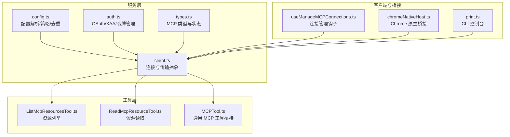
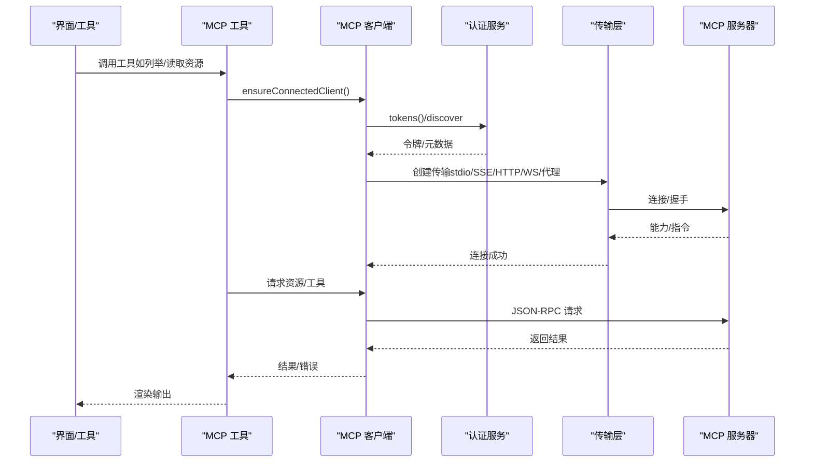
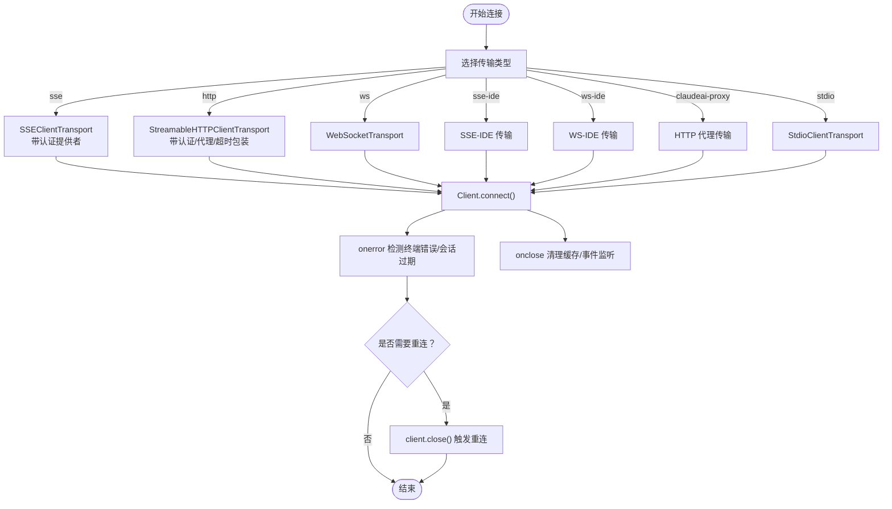
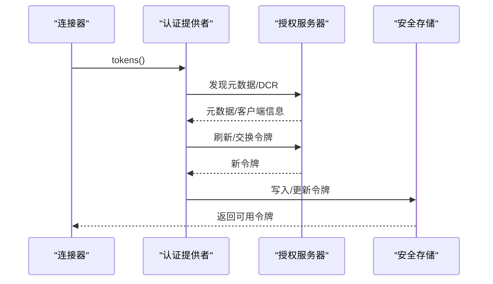
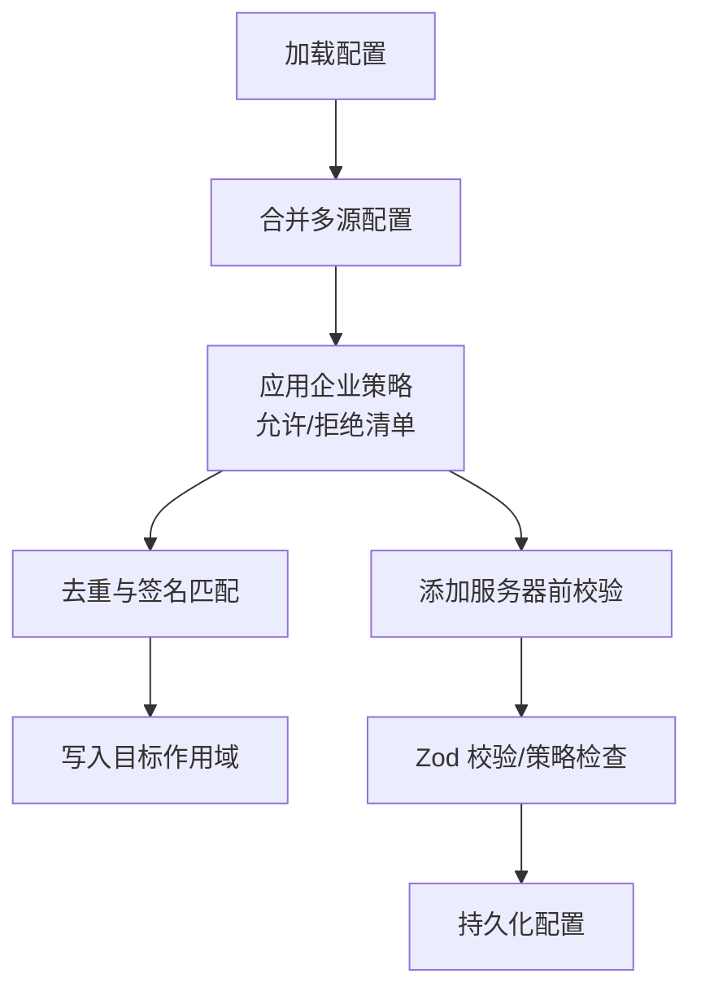
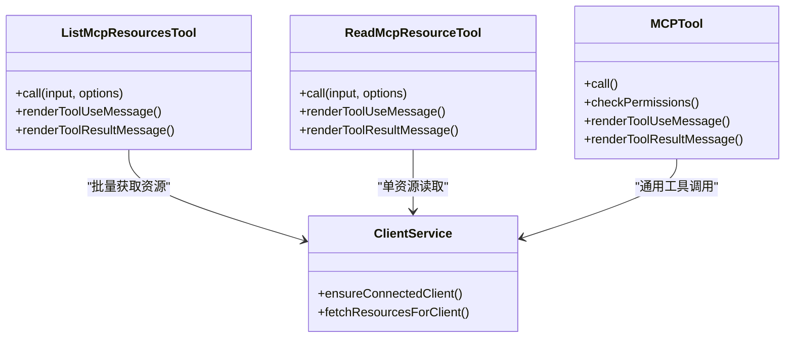
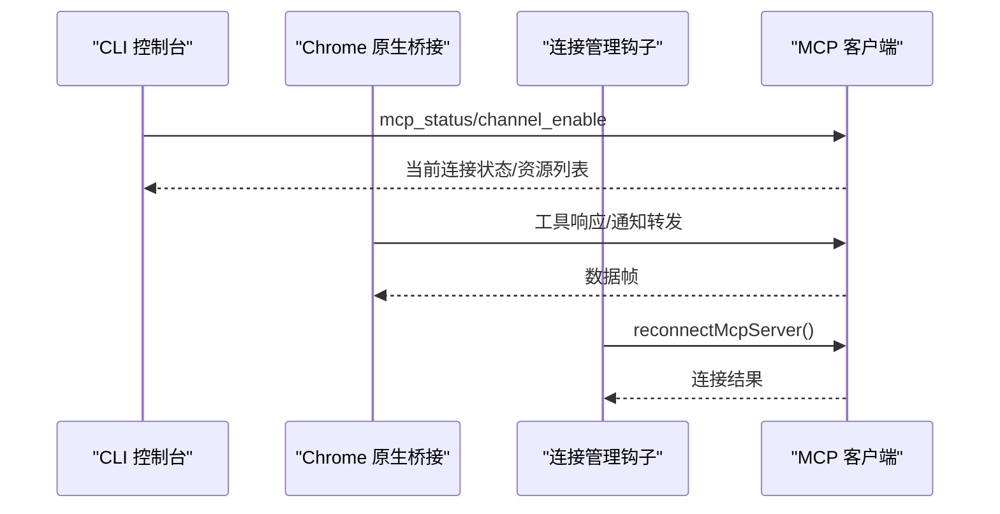
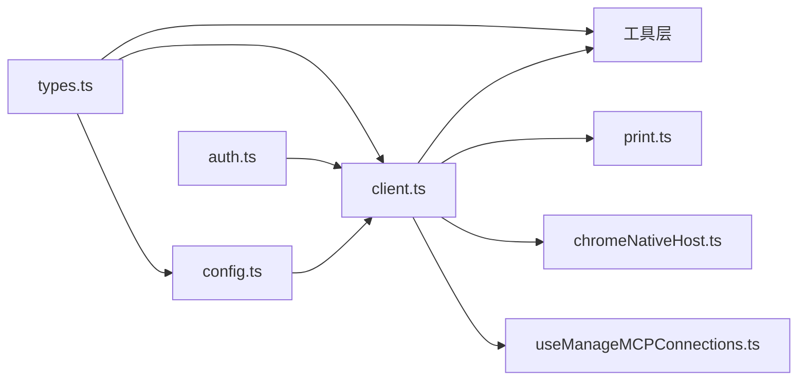

# MCP 集成设计

<cite>
**本文引用的文件**
- [client.ts](file://src/services/mcp/client.ts)
- [config.ts](file://src/services/mcp/config.ts)
- [auth.ts](file://src/services/mcp/auth.ts)
- [types.ts](file://src/services/mcp/types.ts)
- [ListMcpResourcesTool.ts](file://src/tools/ListMcpResourcesTool/ListMcpResourcesTool.ts)
- [ReadMcpResourceTool.ts](file://src/tools/ReadMcpResourceTool/ReadMcpResourceTool.ts)
- [MCPTool.ts](file://src/tools/MCPTool/MCPTool.ts)
- [useManageMCPConnections.ts](file://src/hooks/notifs/src/services/mcp/useManageMCPConnections.ts)
- [chromeNativeHost.ts](file://src/utils/claudeInChrome/chromeNativeHost.ts)
- [print.ts](file://src/cli/print.ts)
</cite>

## 目录
1. [简介](#简介)
2. [项目结构](#项目结构)
3. [核心组件](#核心组件)
4. [架构总览](#架构总览)
5. [详细组件分析](#详细组件分析)
6. [依赖关系分析](#依赖关系分析)
7. [性能考量](#性能考量)
8. [故障排查指南](#故障排查指南)
9. [结论](#结论)
10. [附录](#附录)

## 简介
本设计文档面向 Claude Code 的 MCP（Model Context Protocol）集成，系统性阐述协议实现、服务器发现与连接管理、客户端架构、请求路由与响应处理、服务器配置与认证机制、安全策略、开发指南、调试与性能监控、集成示例与故障排查，以及 MCP 工具系统、资源列表与读取机制。文档同时覆盖本地服务器、远程服务器、官方代理与用户配置，并给出连接管理器、传输层抽象与权限桥接的设计要点。

## 项目结构
围绕 MCP 的核心代码主要分布在以下模块：
- 服务层：连接、认证、配置、类型定义与工具封装
- 工具层：资源列举与读取、通用 MCP 工具桥接
- 客户端与桥接：CLI 控制台、Chrome 原生宿主桥接、通知与消息转发
- 配置与策略：企业策略、去重、签名与允许/拒绝清单

图表来源
- [client.ts](file://src/services/mcp/client.ts)
- [config.ts](file://src/services/mcp/config.ts)
- [auth.ts](file://src/services/mcp/auth.ts)
- [types.ts](file://src/services/mcp/types.ts)
- [ListMcpResourcesTool.ts](file://src/tools/ListMcpResourcesTool/ListMcpResourcesTool.ts)
- [ReadMcpResourceTool.ts](file://src/tools/ReadMcpResourceTool/ReadMcpResourceTool.ts)
- [MCPTool.ts](file://src/tools/MCPTool/MCPTool.ts)
- [useManageMCPConnections.ts](file://src/hooks/notifs/src/services/mcp/useManageMCPConnections.ts)
- [chromeNativeHost.ts](file://src/utils/claudeInChrome/chromeNativeHost.ts)
- [print.ts](file://src/cli/print.ts)

章节来源
- [client.ts](file://src/services/mcp/client.ts)
- [config.ts](file://src/services/mcp/config.ts)
- [auth.ts](file://src/services/mcp/auth.ts)
- [types.ts](file://src/services/mcp/types.ts)
- [ListMcpResourcesTool.ts](file://src/tools/ListMcpResourcesTool/ListMcpResourcesTool.ts)
- [ReadMcpResourceTool.ts](file://src/tools/ReadMcpResourceTool/ReadMcpResourceTool.ts)
- [MCPTool.ts](file://src/tools/MCPTool/MCPTool.ts)
- [useManageMCPConnections.ts](file://src/hooks/notifs/src/services/mcp/useManageMCPConnections.ts)
- [chromeNativeHost.ts](file://src/utils/claudeInChrome/chromeNativeHost.ts)
- [print.ts](file://src/cli/print.ts)

## 核心组件
- 连接与传输抽象：统一的 Client 包装与多种传输（stdio、SSE、HTTP、WebSocket、IDE 专用、SDK 占位、claude.ai 代理），支持超时、代理、mTLS、会话令牌注入与连接缓存。
- 认证与授权：OAuth 发现、令牌刷新、跨应用访问（XAA）、令牌撤销、步骤提升（step-up）与安全存储。
- 配置与策略：.mcp.json、用户/项目/本地/动态/企业配置合并；企业允许/拒绝清单；命令/URL/名称匹配；去重与签名。
- 工具系统：资源列举与读取工具、通用 MCP 工具桥接；工具调用结果持久化与截断处理。
- 客户端与桥接：CLI 控制台、Chrome 原生桥接、通知与消息转发、连接管理钩子。

章节来源
- [client.ts](file://src/services/mcp/client.ts)
- [auth.ts](file://src/services/mcp/auth.ts)
- [config.ts](file://src/services/mcp/config.ts)
- [types.ts](file://src/services/mcp/types.ts)
- [ListMcpResourcesTool.ts](file://src/tools/ListMcpResourcesTool/ListMcpResourcesTool.ts)
- [ReadMcpResourceTool.ts](file://src/tools/ReadMcpResourceTool/ReadMcpResourceTool.ts)
- [MCPTool.ts](file://src/tools/MCPTool/MCPTool.ts)
- [useManageMCPConnections.ts](file://src/hooks/notifs/src/services/mcp/useManageMCPConnections.ts)
- [chromeNativeHost.ts](file://src/utils/claudeInChrome/chromeNativeHost.ts)
- [print.ts](file://src/cli/print.ts)

## 架构总览
MCP 集成采用“服务层 + 工具层 + 客户端/桥接”的分层设计。服务层负责连接生命周期、认证与传输细节；工具层通过统一接口访问资源与工具；客户端/桥接负责 UI 交互、通知与控制台。

图表来源
- [client.ts](file://src/services/mcp/client.ts)
- [auth.ts](file://src/services/mcp/auth.ts)
- [ListMcpResourcesTool.ts](file://src/tools/ListMcpResourcesTool/ListMcpResourcesTool.ts)
- [ReadMcpResourceTool.ts](file://src/tools/ReadMcpResourceTool/ReadMcpResourceTool.ts)

## 详细组件分析

### 连接与传输抽象（client.ts）
- 支持的传输类型：stdio、sse、sse-ide、ws-ide、http、ws、sdk、claudeai-proxy。
- 统一 Client 包装：设置客户端元信息、能力声明、根目录提供、默认请求处理器。
- 超时与代理：每个请求独立超时信号，避免单次超时信号过期问题；HTTP 传输强制 Streamable HTTP Accept 头；SSE 使用独立 EventSource fetch。
- 连接缓存与去重：按服务器名+配置生成缓存键，memoize 缓存连接；连接关闭时清理缓存与 fetch 缓存。
- 错误检测与自动重连：对终端网络错误计数，超过阈值触发关闭；HTTP/代理场景检测会话过期（404 JSON-RPC -32001）触发重建；IDE 服务器连接成功后上报指标。
- 清理策略：stdio 服务器使用多级信号（SIGINT→SIGTERM→SIGKILL）确保进程优雅退出；网络传输关闭时清理事件监听。

图表来源
- [client.ts](file://src/services/mcp/client.ts)

章节来源
- [client.ts](file://src/services/mcp/client.ts)

### 认证与授权（auth.ts）
- OAuth 发现与令牌：支持 RFC 9728→8414 自动发现，或用户指定元数据 URL；标准化非标准错误码为 invalid_grant；POST 响应体错误规范化。
- 令牌刷新与重试：内置 401 自动刷新与锁文件竞争处理；支持跨应用访问（XAA）：一次 IdP 登录复用到所有 XAA 服务器，无浏览器弹窗。
- 令牌撤销：优先撤销刷新令牌，再撤销访问令牌；支持 RFC 7009 兼容与回退 Bearer 方案；失败不抛出，仅记录日志。
- 安全存储与隐私：敏感 OAuth 参数日志脱敏；令牌按服务器键隔离；支持保留步骤提升状态以减少后续认证成本。

图表来源
- [auth.ts](file://src/services/mcp/auth.ts)

章节来源
- [auth.ts](file://src/services/mcp/auth.ts)

### 配置与策略（config.ts）
- 配置来源与合并：支持 local/user/project/dynamic/enterprise/claudeai 等作用域；.mcp.json 与全局/项目配置写入；保留文件权限原子写入。
- 企业策略：允许/拒绝清单支持名称、命令数组、URL 模式三类条目；当仅允许托管 MCP 时，策略仅来自托管设置；denylist 总是合并用户设置。
- 去重与签名：基于命令数组或 URL（解包 CCR 代理 URL）生成签名，抑制插件与手动配置重复；claude.ai 连接器与手动配置冲突时，手动优先。
- 添加/移除服务器：校验名称合法性、保留名、企业配置独占；验证配置结构；策略检查；写入目标作用域。

图表来源
- [config.ts](file://src/services/mcp/config.ts)

章节来源
- [config.ts](file://src/services/mcp/config.ts)

### 工具系统与资源读取（ListMcpResourcesTool/ReadMcpResourceTool/MCPTool）
- ListMcpResourcesTool：遍历已连接客户端，批量拉取资源列表；连接异常不影响其他服务器；结果扁平化返回。
- ReadMcpResourceTool：按服务器名与 URI 读取资源；支持文本与二进制内容；二进制自动落盘并替换为路径；严格校验连接状态与能力。
- MCPTool：通用工具桥接，动态命名与描述；渲染工具使用/进度/结果消息；限制最大输出长度并进行截断判断。

图表来源
- [ListMcpResourcesTool.ts](file://src/tools/ListMcpResourcesTool/ListMcpResourcesTool.ts)
- [ReadMcpResourceTool.ts](file://src/tools/ReadMcpResourceTool/ReadMcpResourceTool.ts)
- [MCPTool.ts](file://src/tools/MCPTool/MCPTool.ts)
- [client.ts](file://src/services/mcp/client.ts)

章节来源
- [ListMcpResourcesTool.ts](file://src/tools/ListMcpResourcesTool/ListMcpResourcesTool.ts)
- [ReadMcpResourceTool.ts](file://src/tools/ReadMcpResourceTool/ReadMcpResourceTool.ts)
- [MCPTool.ts](file://src/tools/MCPTool/MCPTool.ts)
- [client.ts](file://src/services/mcp/client.ts)

### 客户端与桥接（CLI/Chrome 原生桥接/连接管理）
- CLI 控制台：处理 mcp_status、channel_enable、mcp_authenticate 等控制消息；连接成功后注册请求处理器与通道；失败时返回错误。
- Chrome 原生桥接：维护 MCP 客户端集合，转发工具响应与通知；基于长度前缀的二进制帧；限制最大消息大小；连接/断开通知前端。
- 连接管理钩子：暴露重连与开关服务器能力；取消待定重连定时器；稳定回调避免状态抖动。

图表来源
- [print.ts](file://src/cli/print.ts)
- [chromeNativeHost.ts](file://src/utils/claudeInChrome/chromeNativeHost.ts)
- [useManageMCPConnections.ts](file://src/hooks/notifs/src/services/mcp/useManageMCPConnections.ts)
- [client.ts](file://src/services/mcp/client.ts)

章节来源
- [print.ts](file://src/cli/print.ts)
- [chromeNativeHost.ts](file://src/utils/claudeInChrome/chromeNativeHost.ts)
- [useManageMCPConnections.ts](file://src/hooks/notifs/src/services/mcp/useManageMCPConnections.ts)
- [client.ts](file://src/services/mcp/client.ts)

## 依赖关系分析
- 类型与状态：types.ts 定义配置、连接状态、资源与 CLI 状态等核心类型，被 client.ts、config.ts、工具与 UI 广泛引用。
- 连接与认证：client.ts 依赖 auth.ts 提供令牌与发现；依赖 config.ts 获取策略与配置；依赖 types.ts 的类型约束。
- 工具与服务：工具层依赖 client.ts 的连接与资源获取；依赖 utils 的持久化与截断逻辑。
- 客户端桥接：CLI 与 Chrome 桥接依赖 client.ts 的连接生命周期与状态；依赖 UI 渲染工具。

图表来源
- [types.ts](file://src/services/mcp/types.ts)
- [client.ts](file://src/services/mcp/client.ts)
- [config.ts](file://src/services/mcp/config.ts)
- [auth.ts](file://src/services/mcp/auth.ts)
- [print.ts](file://src/cli/print.ts)
- [chromeNativeHost.ts](file://src/utils/claudeInChrome/chromeNativeHost.ts)
- [useManageMCPConnections.ts](file://src/hooks/notifs/src/services/mcp/useManageMCPConnections.ts)

章节来源
- [types.ts](file://src/services/mcp/types.ts)
- [client.ts](file://src/services/mcp/client.ts)
- [config.ts](file://src/services/mcp/config.ts)
- [auth.ts](file://src/services/mcp/auth.ts)
- [print.ts](file://src/cli/print.ts)
- [chromeNativeHost.ts](file://src/utils/claudeInChrome/chromeNativeHost.ts)
- [useManageMCPConnections.ts](file://src/hooks/notifs/src/services/mcp/useManageMCPConnections.ts)

## 性能考量
- 连接批处理：支持批量连接大小参数，远程服务器默认批处理更大，降低握手开销。
- 请求超时：每个请求独立超时信号，避免单次超时信号过期导致的阻塞；HTTP 传输强制 Streamable HTTP Accept 头，减少服务器拒绝。
- 缓存与去重：连接与 fetch 结果缓存，连接关闭时清理；资源/工具/技能结果 LRU 缓存，避免重复拉取。
- 进程终止策略：stdio 服务器采用快速升级信号（SIGINT→SIGTERM→SIGKILL）与限时监控，保证 CLI 响应性。
- 输出截断：工具输出与资源内容截断，防止大输出影响上下文窗口。

## 故障排查指南
- 连接失败
  - 检查传输类型与 URL/命令配置；查看连接超时与代理设置；确认 mTLS 与会话令牌注入。
  - SSE/HTTP/代理场景出现 401：检查认证提供者与令牌刷新；查看 needs-auth 状态与缓存。
  - IDE 服务器：确认 IDE 插件版本与授权头；关注连接成功/失败指标。
- 会话过期
  - HTTP/代理返回 404 + JSON-RPC -32001：触发连接关闭与缓存清理，下一次调用自动重建。
- 认证问题
  - OAuth 发现失败：检查元数据 URL 是否为 HTTPS；尝试手动配置 authServerMetadataUrl。
  - XAA 失败：检查 IdP 配置、回调端口与令牌交换阶段；必要时清除 IdP 缓存 id_token。
- 资源读取
  - 二进制资源无法保存：检查磁盘权限与 MIME 类型；查看持久化错误信息。
  - 资源为空：服务器可能仅提供工具而无资源，需改用工具调用。
- CLI/桥接
  - 控制台无响应：检查控制消息 subtype（mcp_status/channel_enable/mcp_authenticate）；确认连接状态。
  - Chrome 桥接：检查消息帧长度与最大消息限制；确认客户端数量与连接状态。

章节来源
- [client.ts](file://src/services/mcp/client.ts)
- [auth.ts](file://src/services/mcp/auth.ts)
- [print.ts](file://src/cli/print.ts)
- [chromeNativeHost.ts](file://src/utils/claudeInChrome/chromeNativeHost.ts)

## 结论
该 MCP 集成以“传输抽象 + 认证服务 + 工具桥接 + 客户端桥接”为核心，实现了对本地、远程、IDE 与代理服务器的统一支持。通过企业策略、去重与缓存优化，兼顾安全性与性能。工具层提供资源与工具的统一访问入口，CLI 与 Chrome 桥接保障了跨平台体验。建议在生产环境中启用企业策略、合理设置批处理与超时参数，并结合日志与指标进行持续监控。

## 附录
- 开发指南
  - 新增服务器：遵循 McpServerConfigSchema；通过 addMcpConfig 写入目标作用域；策略检查通过后生效。
  - 实现自定义传输：参考 client.ts 中传输创建模式；确保超时、代理、mTLS 与头部正确注入。
  - 扩展工具：参考 ListMcpResourcesTool/ReadMcpResourceTool 的模式；注意连接状态与能力检查、结果持久化与截断。
- 调试与监控
  - 启用 MCP 调试日志；关注连接耗时、错误类型与重连次数；IDE 与远程服务器分别上报指标。
- 集成示例
  - 本地 stdio：配置命令与参数；确保可执行权限；观察 stderr 输出。
  - 远程 HTTP/SSE：配置 URL 与头部；必要时设置代理；检查 Streamable HTTP Accept 头。
  - 代理服务器：使用 claudeai-proxy 传输；确保 claude.ai OAuth 令牌有效。
  - 资源读取：先调用资源列举，再按 URI 读取；二进制资源自动落盘。
- 权限与安全
  - 企业策略优先：denylist 优先于 allowlist；托管模式下仅允许托管配置。
  - 令牌管理：定期刷新与撤销；XAA 一次性 IdP 登录；安全存储与日志脱敏。
- 服务器批准与重新连接
  - 批准流程：通过 CLI 或 UI 添加服务器；策略校验通过后连接；首次连接失败进入 needs-auth。
  - 重新连接：检测终端错误与会话过期；达到阈值触发关闭并清理缓存；下一次调用自动重建。
- 错误处理策略
  - 统一错误分类：UnauthorizedError、会话过期、网络终端错误、请求超时；分别采取不同恢复策略。
  - 最终一致性：连接关闭时清理缓存，确保下次调用获取新鲜状态。