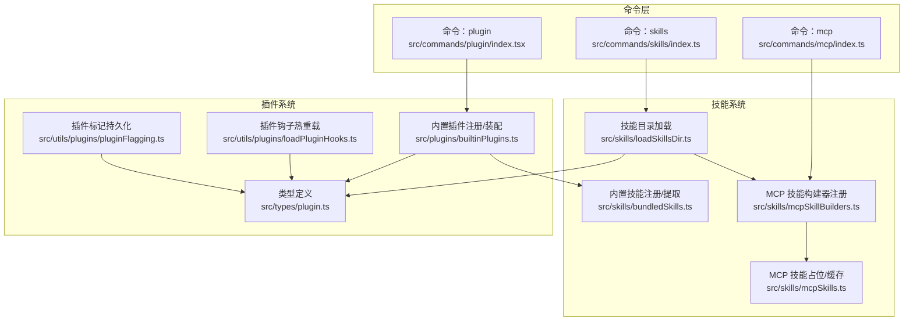
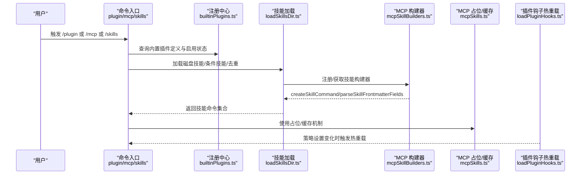
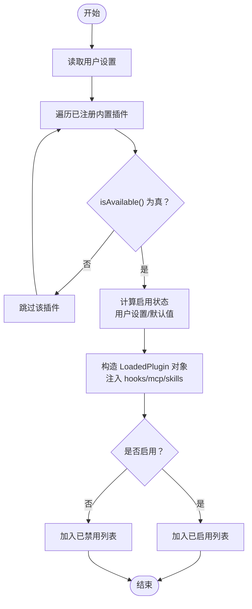
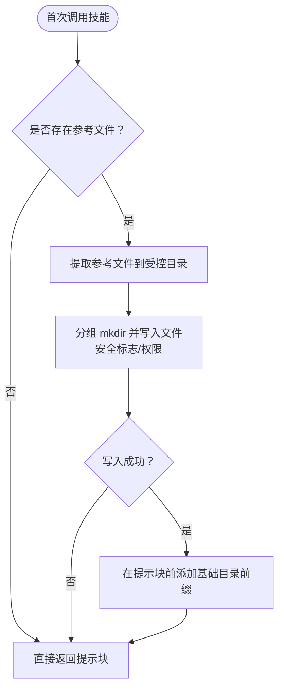
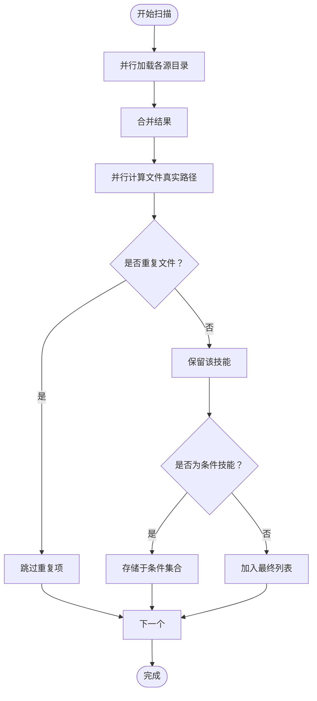
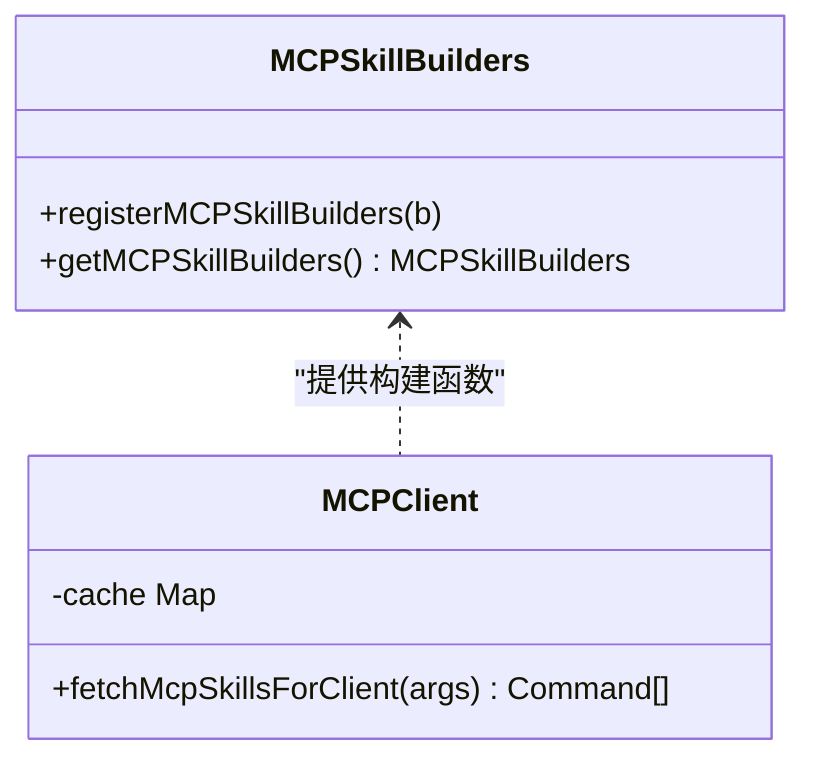
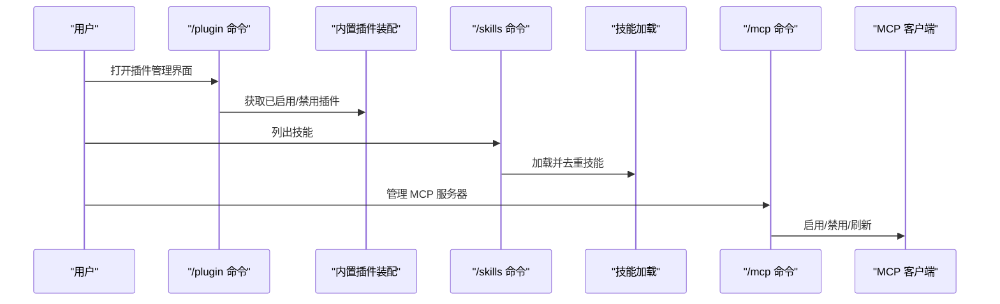
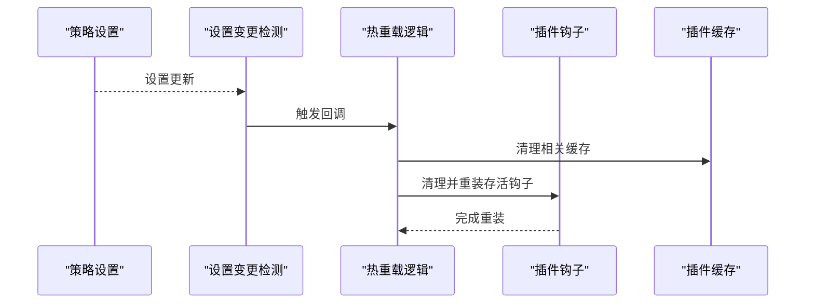
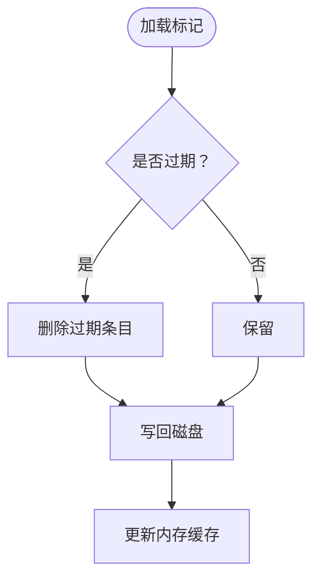
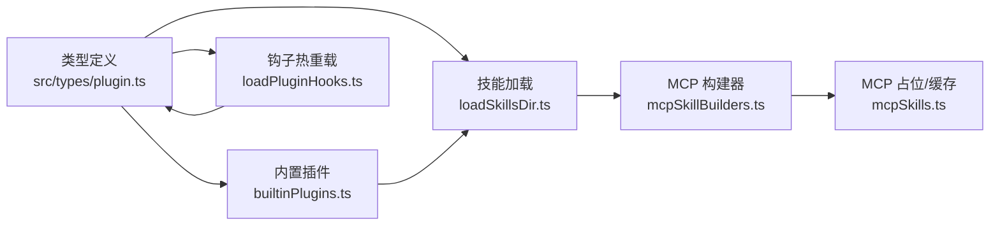

# 扩展机制设计

<cite>
**本文引用的文件**
- [builtinPlugins.ts](file://src/plugins/builtinPlugins.ts)
- [bundledSkills.ts](file://src/skills/bundledSkills.ts)
- [mcpSkillBuilders.ts](file://src/skills/mcpSkillBuilders.ts)
- [mcpSkills.ts](file://src/skills/mcpSkills.ts)
- [plugin.ts 类型定义](file://src/types/plugin.ts)
- [命令注册：plugin](file://src/commands/plugin/index.tsx)
- [命令注册：mcp](file://src/commands/mcp/index.ts)
- [命令注册：skills](file://src/commands/skills/index.ts)
- [技能目录加载：loadSkillsDir.ts](file://src/skills/loadSkillsDir.ts)
- [插件钩子热重载：loadPluginHooks.ts](file://src/utils/plugins/loadPluginHooks.ts)
- [插件标记持久化：pluginFlagging.ts](file://src/utils/plugins/pluginFlagging.ts)
</cite>

## 目录
1. [引言](#引言)
2. [项目结构](#项目结构)
3. [核心组件](#核心组件)
4. [架构总览](#架构总览)
5. [详细组件分析](#详细组件分析)
6. [依赖关系分析](#依赖关系分析)
7. [性能考量](#性能考量)
8. [故障排查指南](#故障排查指南)
9. [结论](#结论)
10. [附录](#附录)

## 引言
本设计文档面向 Claude Code 的扩展机制，聚焦以下目标：
- 插件系统架构与生命周期管理
- 技能系统设计（内置技能、磁盘技能、MCP 技能）
- MCP 协议集成与客户端能力
- 扩展点定义、依赖解析与版本兼容策略
- 插件加载机制、热重载支持与版本兼容
- 扩展开发指南、API 规范与最佳实践
- 具体扩展实现示例与集成测试方法

## 项目结构
围绕扩展机制的核心模块分布如下：
- 插件与技能类型定义：src/types/plugin.ts
- 内置插件注册与装配：src/plugins/builtinPlugins.ts
- 内置技能注册与提取：src/skills/bundledSkills.ts
- 技能目录扫描与去重：src/skills/loadSkillsDir.ts
- MCP 技能构建器注册：src/skills/mcpSkillBuilders.ts
- MCP 技能占位与缓存：src/skills/mcpSkills.ts
- 命令入口（插件、MCP、技能）：src/commands/plugin/index.tsx、src/commands/mcp/index.ts、src/commands/skills/index.ts
- 插件钩子热重载：src/utils/plugins/loadPluginHooks.ts
- 插件标记持久化：src/utils/plugins/pluginFlagging.ts

**图表来源**
- [plugin.ts 类型定义:1-364](file://src/types/plugin.ts#L1-L364)
- [builtinPlugins.ts:1-160](file://src/plugins/builtinPlugins.ts#L1-L160)
- [bundledSkills.ts:1-221](file://src/skills/bundledSkills.ts#L1-L221)
- [loadSkillsDir.ts:1-800](file://src/skills/loadSkillsDir.ts#L1-L800)
- [mcpSkillBuilders.ts:1-45](file://src/skills/mcpSkillBuilders.ts#L1-L45)
- [mcpSkills.ts:1-8](file://src/skills/mcpSkills.ts#L1-L8)
- [命令注册：plugin:1-11](file://src/commands/plugin/index.tsx#L1-L11)
- [命令注册：mcp:1-13](file://src/commands/mcp/index.ts#L1-L13)
- [命令注册：skills:1-11](file://src/commands/skills/index.ts#L1-L11)
- [插件钩子热重载：loadPluginHooks.ts:186-287](file://src/utils/plugins/loadPluginHooks.ts#L186-L287)
- [插件标记持久化：pluginFlagging.ts:86-144](file://src/utils/plugins/pluginFlagging.ts#L86-L144)

**章节来源**
- [plugin.ts 类型定义:1-364](file://src/types/plugin.ts#L1-L364)
- [builtinPlugins.ts:1-160](file://src/plugins/builtinPlugins.ts#L1-L160)
- [bundledSkills.ts:1-221](file://src/skills/bundledSkills.ts#L1-L221)
- [loadSkillsDir.ts:1-800](file://src/skills/loadSkillsDir.ts#L1-L800)
- [mcpSkillBuilders.ts:1-45](file://src/skills/mcpSkillBuilders.ts#L1-L45)
- [mcpSkills.ts:1-8](file://src/skills/mcpSkills.ts#L1-L8)
- [命令注册：plugin:1-11](file://src/commands/plugin/index.tsx#L1-L11)
- [命令注册：mcp:1-13](file://src/commands/mcp/index.ts#L1-L13)
- [命令注册：skills:1-11](file://src/commands/skills/index.ts#L1-L11)
- [插件钩子热重载：loadPluginHooks.ts:186-287](file://src/utils/plugins/loadPluginHooks.ts#L186-L287)
- [插件标记持久化：pluginFlagging.ts:86-144](file://src/utils/plugins/pluginFlagging.ts#L86-L144)

## 核心组件
- 插件类型与错误模型：定义 LoadedPlugin、PluginError 及其消息映射，覆盖路径、网络、清单、MCP/LSP 配置、依赖等错误场景。
- 内置插件注册中心：集中注册与装配内置插件，支持可用性检查、默认启用状态与用户设置合并。
- 内置技能注册与提取：以“打包技能”形式注册，首次调用时惰性解包到受控目录，确保安全写入与路径校验。
- 技能目录加载：统一扫描策略，支持多源目录（策略/用户/项目/附加目录），并行加载、去重与条件技能存储。
- MCP 技能构建器：在不形成循环依赖的前提下，向客户端暴露创建技能命令与解析前端字段的能力。
- 命令入口：提供 /plugin、/mcp、/skills 等交互式命令，驱动 UI 与功能入口。

**章节来源**
- [plugin.ts 类型定义:48-289](file://src/types/plugin.ts#L48-L289)
- [builtinPlugins.ts:21-102](file://src/plugins/builtinPlugins.ts#L21-L102)
- [bundledSkills.ts:53-100](file://src/skills/bundledSkills.ts#L53-L100)
- [loadSkillsDir.ts:638-800](file://src/skills/loadSkillsDir.ts#L638-L800)
- [mcpSkillBuilders.ts:26-44](file://src/skills/mcpSkillBuilders.ts#L26-L44)
- [命令注册：plugin:1-11](file://src/commands/plugin/index.tsx#L1-L11)
- [命令注册：mcp:1-13](file://src/commands/mcp/index.ts#L1-L13)
- [命令注册：skills:1-11](file://src/commands/skills/index.ts#L1-L11)

## 架构总览
下图展示扩展机制的端到端流程：从命令入口到技能加载、MCP 集成与插件装配，再到热重载与错误处理。

**图表来源**
- [builtinPlugins.ts:57-102](file://src/plugins/builtinPlugins.ts#L57-L102)
- [loadSkillsDir.ts:638-800](file://src/skills/loadSkillsDir.ts#L638-L800)
- [mcpSkillBuilders.ts:33-44](file://src/skills/mcpSkillBuilders.ts#L33-L44)
- [mcpSkills.ts:4-7](file://src/skills/mcpSkills.ts#L4-L7)
- [插件钩子热重载：loadPluginHooks.ts:255-287](file://src/utils/plugins/loadPluginHooks.ts#L255-L287)

## 详细组件分析

### 组件一：内置插件系统（BuiltinPlugins）
- 职责：集中注册内置插件；根据用户设置与默认值决定启用状态；将技能、钩子、MCP 服务器等装配为 LoadedPlugin。
- 关键点：
  - 插件 ID 格式：name@builtin，便于与市场插件区分。
  - 启用决策：用户设置优先，其次默认值，最终默认启用。
  - 可用性过滤：isAvailable() 为假则直接隐藏。
  - 输出：返回已启用/禁用插件列表，供 UI 与命令使用。

**图表来源**
- [builtinPlugins.ts:57-102](file://src/plugins/builtinPlugins.ts#L57-L102)

**章节来源**
- [builtinPlugins.ts:21-102](file://src/plugins/builtinPlugins.ts#L21-L102)

### 组件二：内置技能系统（BundledSkills）
- 职责：注册打包技能，首次调用时惰性提取参考文件至受控目录，并在提示中添加“基础目录”前缀。
- 安全与健壮性：
  - 文件写入采用安全标志与权限，避免符号链接穿越与竞态。
  - 路径规范化与逃逸检测，防止目录穿越。
  - 提取失败时继续运行但不带基础目录前缀，保证降级可用。

**图表来源**
- [bundledSkills.ts:131-145](file://src/skills/bundledSkills.ts#L131-L145)
- [bundledSkills.ts:147-193](file://src/skills/bundledSkills.ts#L147-L193)
- [bundledSkills.ts:195-206](file://src/skills/bundledSkills.ts#L195-L206)
- [bundledSkills.ts:208-221](file://src/skills/bundledSkills.ts#L208-L221)

**章节来源**
- [bundledSkills.ts:53-100](file://src/skills/bundledSkills.ts#L53-L100)
- [bundledSkills.ts:131-145](file://src/skills/bundledSkills.ts#L131-L145)
- [bundledSkills.ts:147-193](file://src/skills/bundledSkills.ts#L147-L193)
- [bundledSkills.ts:195-206](file://src/skills/bundledSkills.ts#L195-L206)
- [bundledSkills.ts:208-221](file://src/skills/bundledSkills.ts#L208-L221)

### 组件三：技能目录加载与去重（loadSkillsDir）
- 职责：扫描多源目录（策略/用户/项目/附加目录/遗留 commands），并行加载、去重、条件技能存储与令牌估算。
- 去重策略：通过 realpath 解析真实路径，避免同源不同名或符号链接导致的重复。
- 条件技能：当 frontmatter 指定 paths 且未激活时，延迟激活，仅在匹配文件被触碰时生效。
- 前端字段解析：统一解析技能名称、描述、工具限制、参数、上下文、代理、努力等级、shell 等。

**图表来源**
- [loadSkillsDir.ts:677-770](file://src/skills/loadSkillsDir.ts#L677-L770)
- [loadSkillsDir.ts:771-796](file://src/skills/loadSkillsDir.ts#L771-L796)
- [loadSkillsDir.ts:185-265](file://src/skills/loadSkillsDir.ts#L185-L265)

**章节来源**
- [loadSkillsDir.ts:638-800](file://src/skills/loadSkillsDir.ts#L638-L800)
- [loadSkillsDir.ts:185-265](file://src/skills/loadSkillsDir.ts#L185-L265)

### 组件四：MCP 技能构建器与客户端占位（mcpSkillBuilders / mcpSkills）
- 职责：
  - mcpSkillBuilders：注册/获取 createSkillCommand 与 parseSkillFrontmatterFields，避免循环依赖。
  - mcpSkills：提供 MCP 技能客户端侧的占位实现与缓存，等待实际实现替换。
- 设计要点：在 Bun 打包环境下采用静态导入规避动态导入问题，确保依赖图稳定。

**图表来源**
- [mcpSkillBuilders.ts:26-44](file://src/skills/mcpSkillBuilders.ts#L26-L44)
- [mcpSkills.ts:4-7](file://src/skills/mcpSkills.ts#L4-L7)

**章节来源**
- [mcpSkillBuilders.ts:1-45](file://src/skills/mcpSkillBuilders.ts#L1-L45)
- [mcpSkills.ts:1-8](file://src/skills/mcpSkills.ts#L1-L8)

### 组件五：命令入口与 UI 集成
- /plugin：管理插件（内置/市场），支持启用/禁用、查看组件（技能/钩子/MCP）。
- /mcp：管理 MCP 服务器（启用/禁用、配置校验、冲突抑制）。
- /skills：列出可用技能（含条件技能与令牌估算）。

**图表来源**
- [命令注册：plugin:1-11](file://src/commands/plugin/index.tsx#L1-L11)
- [命令注册：mcp:1-13](file://src/commands/mcp/index.ts#L1-L13)
- [命令注册：skills:1-11](file://src/commands/skills/index.ts#L1-L11)
- [builtinPlugins.ts:57-102](file://src/plugins/builtinPlugins.ts#L57-L102)
- [loadSkillsDir.ts:638-800](file://src/skills/loadSkillsDir.ts#L638-L800)
- [mcpSkills.ts:4-7](file://src/skills/mcpSkills.ts#L4-L7)

**章节来源**
- [命令注册：plugin:1-11](file://src/commands/plugin/index.tsx#L1-L11)
- [命令注册：mcp:1-13](file://src/commands/mcp/index.ts#L1-L13)
- [命令注册：skills:1-11](file://src/commands/skills/index.ts#L1-L11)

### 组件六：插件钩子热重载与策略变更
- 职责：监听策略设置变化，对受影响的插件钩子进行清理与重装，同时清空相关缓存，避免陈旧状态。
- 机制：订阅设置变更事件，比较快照，仅在实际变化时触发重载。

**图表来源**
- [插件钩子热重载：loadPluginHooks.ts:255-287](file://src/utils/plugins/loadPluginHooks.ts#L255-L287)
- [插件钩子热重载：loadPluginHooks.ts:186-207](file://src/utils/plugins/loadPluginHooks.ts#L186-L207)

**章节来源**
- [插件钩子热重载：loadPluginHooks.ts:186-287](file://src/utils/plugins/loadPluginHooks.ts#L186-L287)

### 组件七：插件标记持久化与 UI 通知
- 职责：将“已见过/标记”的插件信息写入受控目录，定期清理过期条目，供 UI 展示与后续策略使用。

**图表来源**
- [插件标记持久化：pluginFlagging.ts:117-136](file://src/utils/plugins/pluginFlagging.ts#L117-L136)
- [插件标记持久化：pluginFlagging.ts:86-109](file://src/utils/plugins/pluginFlagging.ts#L86-L109)
- [插件标记持久化：pluginFlagging.ts:142-144](file://src/utils/plugins/pluginFlagging.ts#L142-L144)

**章节来源**
- [插件标记持久化：pluginFlagging.ts:86-144](file://src/utils/plugins/pluginFlagging.ts#L86-L144)

## 依赖关系分析
- 类型与契约：LoadedPlugin、PluginError 等类型贯穿插件与技能系统，确保跨模块一致性。
- 运行时耦合：
  - loadSkillsDir 依赖 mcpSkillBuilders 提供的构建函数，避免循环依赖。
  - builtinPlugins 依赖 settings 与用户偏好，输出 LoadedPlugin。
  - mcpSkills 作为客户端占位，等待真实实现注入。
- 外部依赖：文件系统、环境变量、设置变更检测器、日志与调试工具。

**图表来源**
- [plugin.ts 类型定义:48-289](file://src/types/plugin.ts#L48-L289)
- [builtinPlugins.ts:57-102](file://src/plugins/builtinPlugins.ts#L57-L102)
- [loadSkillsDir.ts:638-800](file://src/skills/loadSkillsDir.ts#L638-L800)
- [mcpSkillBuilders.ts:33-44](file://src/skills/mcpSkillBuilders.ts#L33-L44)
- [mcpSkills.ts:4-7](file://src/skills/mcpSkills.ts#L4-L7)
- [插件钩子热重载：loadPluginHooks.ts:255-287](file://src/utils/plugins/loadPluginHooks.ts#L255-L287)

**章节来源**
- [plugin.ts 类型定义:48-289](file://src/types/plugin.ts#L48-L289)
- [builtinPlugins.ts:57-102](file://src/plugins/builtinPlugins.ts#L57-L102)
- [loadSkillsDir.ts:638-800](file://src/skills/loadSkillsDir.ts#L638-L800)
- [mcpSkillBuilders.ts:33-44](file://src/skills/mcpSkillBuilders.ts#L33-L44)
- [mcpSkills.ts:4-7](file://src/skills/mcpSkills.ts#L4-L7)
- [插件钩子热重载：loadPluginHooks.ts:255-287](file://src/utils/plugins/loadPluginHooks.ts#L255-L287)

## 性能考量
- 并行加载：技能目录扫描与去重阶段广泛使用 Promise.all 并行化，显著降低启动时间。
- 惰性提取：内置技能首次调用才解包参考文件，避免冷启动额外 IO。
- 缓存与占位：MCP 技能客户端侧提供缓存对象，减少重复请求成本。
- 去重优化：先并行计算真实路径再同步去重，兼顾正确性与效率。
- 令牌估算：仅基于 frontmatter 估算，避免全文解析带来的开销。

[本节为通用性能讨论，无需特定文件来源]

## 故障排查指南
- 插件错误类型与消息映射：
  - 路径不存在、网络错误、清单解析/验证失败、MCP/LSP 配置无效、钩子加载失败、组件加载失败、MCPB 下载/解压失败、策略受限、依赖未满足、缓存缺失等。
  - getPluginErrorMessage 将错误类型转换为可读消息，便于日志与 UI 展示。
- 常见排查步骤：
  - 检查插件清单与路径有效性；确认网络可达与认证配置。
  - 查看 MCP/LSP 启动日志与超时/崩溃信息。
  - 确认策略设置是否限制了插件/技能访问。
  - 若出现依赖未满足，检查目标插件是否已启用或存在于配置的市场中。

**章节来源**
- [plugin.ts 类型定义:101-283](file://src/types/plugin.ts#L101-L283)
- [plugin.ts 类型定义:295-363](file://src/types/plugin.ts#L295-L363)

## 结论
本扩展机制通过“类型契约 + 并行加载 + 去重 + 惰性提取 + 热重载”的组合，实现了高可用、可维护、可扩展的插件与技能体系。内置插件与磁盘技能并行发展，MCP 技能通过构建器与占位实现平滑过渡。配合完善的错误模型与策略感知，系统在复杂场景下仍能保持稳定与可观测性。

[本节为总结，无需特定文件来源]

## 附录

### 扩展开发指南
- 开发步骤建议：
  - 定义插件清单与组件（技能/钩子/MCP 服务器）。
  - 在初始化阶段注册内置插件（若为内置）或通过市场安装。
  - 实现技能命令：遵循 frontmatter 字段规范，必要时声明 allowed-tools、context、agent、effort 等。
  - 如需 MCP 技能，使用 mcpSkillBuilders 注册构建器并在客户端侧替换占位实现。
  - 遵循安全写入与路径校验，避免目录穿越与权限问题。
- 最佳实践：
  - 使用并行加载与去重策略，提升启动性能。
  - 对外部资源（网络/文件系统）进行容错与降级。
  - 通过策略设置与 UI 控制插件启用状态，避免全局破坏性变更。
  - 使用热重载机制响应策略变更，减少重启成本。

[本节为通用指导，无需特定文件来源]

### API 规范与示例路径
- 插件类型与错误模型：参见 [plugin.ts 类型定义:48-289](file://src/types/plugin.ts#L48-L289)
- 内置插件注册与装配：参见 [builtinPlugins.ts:28-102](file://src/plugins/builtinPlugins.ts#L28-L102)
- 内置技能注册与提取：参见 [bundledSkills.ts:53-100](file://src/skills/bundledSkills.ts#L53-L100)
- 技能目录加载与去重：参见 [loadSkillsDir.ts:638-800](file://src/skills/loadSkillsDir.ts#L638-L800)
- MCP 技能构建器注册：参见 [mcpSkillBuilders.ts:33-44](file://src/skills/mcpSkillBuilders.ts#L33-L44)
- MCP 技能占位与缓存：参见 [mcpSkills.ts:4-7](file://src/skills/mcpSkills.ts#L4-L7)
- 命令入口：参见 [命令注册：plugin:1-11](file://src/commands/plugin/index.tsx#L1-L11)、[命令注册：mcp:1-13](file://src/commands/mcp/index.ts#L1-L13)、[命令注册：skills:1-11](file://src/commands/skills/index.ts#L1-L11)

[本节为索引与路径指引，无需特定文件来源]

### 集成测试方法
- 单元测试：
  - 对内置插件装配逻辑进行断言（启用/禁用、可用性过滤）。
  - 对内置技能提取流程进行断言（安全写入、路径校验、降级行为）。
  - 对技能目录加载进行断言（并行加载、去重、条件技能存储）。
- 集成测试：
  - 模拟策略设置变更，验证钩子热重载与缓存清理。
  - 模拟插件标记持久化，验证过期清理与缓存一致性。
- 回归测试：
  - 覆盖错误类型映射与 UI 显示，确保消息可读性与一致性。

[本节为通用测试建议，无需特定文件来源]