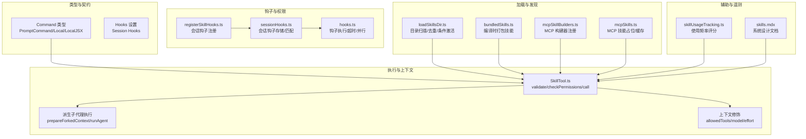
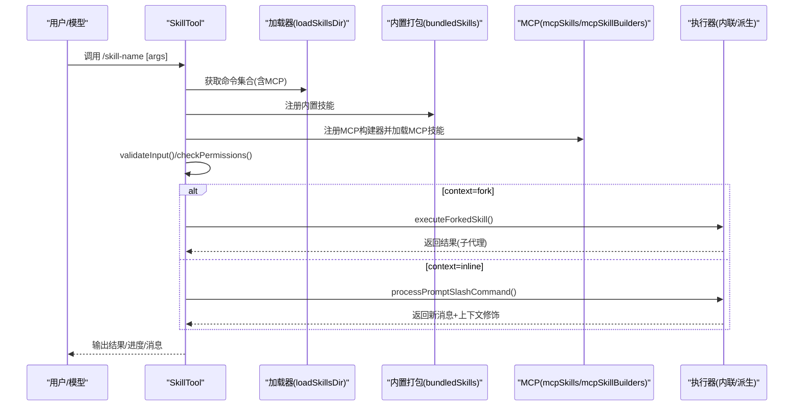
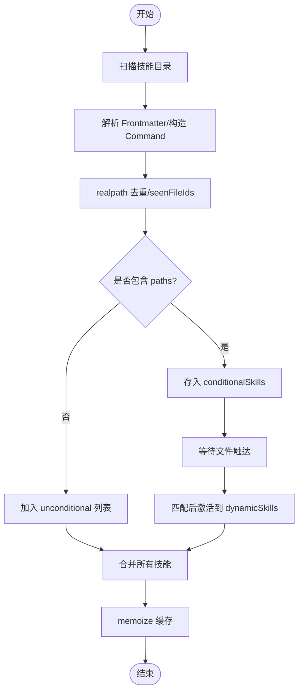
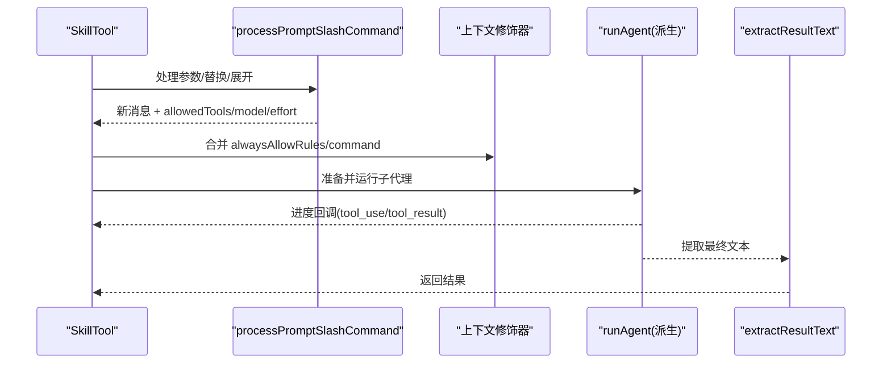
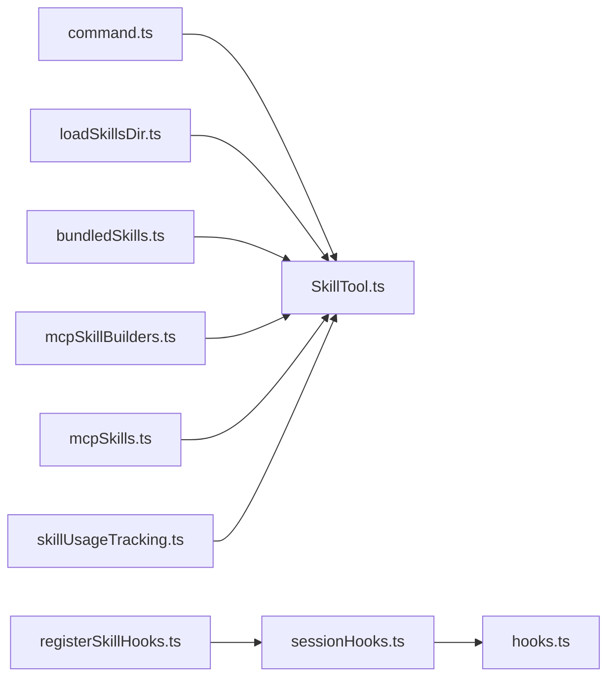

# 技能系统设计

<cite>
**本文引用的文件**
- [bundledSkills.ts](file://src/skills/bundledSkills.ts)
- [loadSkillsDir.ts](file://src/skills/loadSkillsDir.ts)
- [mcpSkillBuilders.ts](file://src/skills/mcpSkillBuilders.ts)
- [mcpSkills.ts](file://src/skills/mcpSkills.ts)
- [command.ts](file://src/types/command.ts)
- [SkillTool.ts](file://src/tools/SkillTool/SkillTool.ts)
- [skills.mdx](file://docs/extensibility/skills.mdx)
- [sessionHooks.ts](file://src/utils/hooks/sessionHooks.ts)
- [registerSkillHooks.ts](file://src/utils/hooks/registerSkillHooks.ts)
- [hooks.ts](file://src/utils/hooks.ts)
- [skillUsageTracking.ts](file://src/utils/suggestions/skillUsageTracking.ts)
</cite>

## 目录
1. [引言](#引言)
2. [项目结构](#项目结构)
3. [核心组件](#核心组件)
4. [架构总览](#架构总览)
5. [详细组件分析](#详细组件分析)
6. [依赖关系分析](#依赖关系分析)
7. [性能考量](#性能考量)
8. [故障排查指南](#故障排查指南)
9. [结论](#结论)
10. [附录](#附录)

## 引言
本设计文档面向 Claude Code 技能系统，系统性阐述技能架构、加载机制与执行流程，覆盖技能定义规范、依赖与版本管理、组合策略、缓存与性能优化、开发与测试、部署流程、内置技能系统、命令转换机制、用户可调用性控制、上下文管理、钩子集成、代理工具支持、技能搜索与预取、遥测采集等主题。文档以仓库现有实现为依据，结合技术细节与可视化图示，帮助开发者与使用者高效理解并扩展技能体系。

## 项目结构
技能系统围绕“命令(Command)即能力”的理念构建，核心类型与工具位于以下模块：
- 类型与契约：命令类型、上下文、钩子设置等
- 技能加载：磁盘目录、内置打包、MCP 远程、历史兼容
- 执行器：SkillTool 统一入口，内联与派生子代理两种执行路径
- 钩子与上下文：会话级钩子注册、函数钩子、权限与模型覆盖
- 辅助与遥测：使用频率统计、预算感知注入、预取与搜索

**图表来源**
- [command.ts:25-57](file://src/types/command.ts#L25-L57)
- [loadSkillsDir.ts:638-800](file://src/skills/loadSkillsDir.ts#L638-L800)
- [bundledSkills.ts:43-108](file://src/skills/bundledSkills.ts#L43-L108)
- [mcpSkillBuilders.ts:26-44](file://src/skills/mcpSkillBuilders.ts#L26-L44)
- [mcpSkills.ts:1-8](file://src/skills/mcpSkills.ts#L1-L8)
- [SkillTool.ts:81-94](file://src/tools/SkillTool/SkillTool.ts#L81-L94)
- [sessionHooks.ts:68-216](file://src/utils/hooks/sessionHooks.ts#L68-L216)
- [registerSkillHooks.ts:20-31](file://src/utils/hooks/registerSkillHooks.ts#L20-L31)
- [hooks.ts:2224-2274](file://src/utils/hooks.ts#L2224-L2274)
- [skillUsageTracking.ts:37-55](file://src/utils/suggestions/skillUsageTracking.ts#L37-L55)

**章节来源**
- [command.ts:25-57](file://src/types/command.ts#L25-L57)
- [loadSkillsDir.ts:638-800](file://src/skills/loadSkillsDir.ts#L638-L800)
- [bundledSkills.ts:43-108](file://src/skills/bundledSkills.ts#L43-L108)
- [mcpSkillBuilders.ts:26-44](file://src/skills/mcpSkillBuilders.ts#L26-L44)
- [mcpSkills.ts:1-8](file://src/skills/mcpSkills.ts#L1-L8)
- [SkillTool.ts:81-94](file://src/tools/SkillTool/SkillTool.ts#L81-L94)
- [sessionHooks.ts:68-216](file://src/utils/hooks/sessionHooks.ts#L68-L216)
- [registerSkillHooks.ts:20-31](file://src/utils/hooks/registerSkillHooks.ts#L20-L31)
- [hooks.ts:2224-2274](file://src/utils/hooks.ts#L2224-L2274)
- [skillUsageTracking.ts:37-55](file://src/utils/suggestions/skillUsageTracking.ts#L37-L55)

## 核心组件
- 命令(Command)类型：统一承载技能元信息、权限、模型、执行上下文、钩子、路径条件等，支持内联 Prompt 执行与派生子代理执行两种路径。
- 技能加载器(loadSkillsDir)：负责从多源目录加载技能，解析 Frontmatter，构造 Command，并进行去重、条件激活与缓存。
- 内置打包技能(bundledSkills)：编译期注册，支持首次调用时惰性解压参考文件，具备不可截断的预算特权。
- MCP 技能：通过构建器注册，将远端 Prompt 转换为 Command；加载来源标记为 mcp。
- 执行器(SkillTool)：统一入口，负责输入校验、权限决策、内联/派生执行、上下文修饰、遥测记录与结果返回。
- 钩子系统：会话级钩子注册与执行，支持函数钩子与持久化钩子，按事件与匹配器分发。
- 使用统计：基于指数衰减的使用频率评分，用于技能列表排序与推荐。

**章节来源**
- [command.ts:25-57](file://src/types/command.ts#L25-L57)
- [loadSkillsDir.ts:185-265](file://src/skills/loadSkillsDir.ts#L185-L265)
- [bundledSkills.ts:15-41](file://src/skills/bundledSkills.ts#L15-L41)
- [mcpSkillBuilders.ts:26-44](file://src/skills/mcpSkillBuilders.ts#L26-L44)
- [SkillTool.ts:581-776](file://src/tools/SkillTool/SkillTool.ts#L581-L776)
- [sessionHooks.ts:68-216](file://src/utils/hooks/sessionHooks.ts#L68-L216)
- [skillUsageTracking.ts:37-55](file://src/utils/suggestions/skillUsageTracking.ts#L37-L55)

## 架构总览
技能系统采用“声明式 Prompt + 权限与上下文修饰”的统一执行范式。加载阶段完成多源聚合、去重、条件激活与缓存；执行阶段通过 SkillTool 校验与授权，随后按 context 分支内联或派生子代理执行，并在过程中注入 allowedTools、模型覆盖与努力级别等上下文变更。

**图表来源**
- [SkillTool.ts:81-94](file://src/tools/SkillTool/SkillTool.ts#L81-L94)
- [SkillTool.ts:581-776](file://src/tools/SkillTool/SkillTool.ts#L581-L776)
- [loadSkillsDir.ts:638-800](file://src/skills/loadSkillsDir.ts#L638-L800)
- [bundledSkills.ts:43-108](file://src/skills/bundledSkills.ts#L43-L108)
- [mcpSkillBuilders.ts:26-44](file://src/skills/mcpSkillBuilders.ts#L26-L44)
- [mcpSkills.ts:1-8](file://src/skills/mcpSkills.ts#L1-L8)

## 详细组件分析

### 技能定义规范与类型契约
- Command/PromptCommand：统一承载 name/description/allowedTools/argumentHint/whenToUse/version/model/disableModelInvocation/userInvocable/hooks/context/agent/effort/paths/skillRoot/getPromptForCommand 等字段。
- 元信息来源：Frontmatter 解析与历史兼容处理；磁盘目录格式要求为 skill-name/SKILL.md；MCP 与内置打包分别通过不同入口注册。
- 预算与可见性：Bundled Skills 不可截断；paths 前景字段支持条件激活；userInvocable 控制是否可通过 /skill-name 调用。

**章节来源**
- [command.ts:25-57](file://src/types/command.ts#L25-L57)
- [loadSkillsDir.ts:185-265](file://src/skills/loadSkillsDir.ts#L185-L265)
- [loadSkillsDir.ts:407-480](file://src/skills/loadSkillsDir.ts#L407-L480)
- [skills.mdx:66-98](file://docs/extensibility/skills.mdx#L66-L98)

### 技能加载机制与去重
- 多源目录：管理策略、用户全局、项目级、附加目录；历史 /commands/ 目录兼容。
- 目录扫描与过滤：仅接受目录格式的子项，要求存在 SKILL.md；解析 Frontmatter 并构造 Command。
- 去重策略：通过 realpath 解析符号链接，避免重复加载；seenFileIds 记录已加载文件身份。
- 条件激活：paths 前景字段的技能先存入 conditionalSkills，待文件触达时激活进入 dynamicSkills。
- 缓存：getSkillDirCommands 使用 memoize 缓存结果，提升重复查询性能。

**图表来源**
- [loadSkillsDir.ts:407-480](file://src/skills/loadSkillsDir.ts#L407-L480)
- [loadSkillsDir.ts:716-796](file://src/skills/loadSkillsDir.ts#L716-L796)
- [loadSkillsDir.ts:118-124](file://src/skills/loadSkillsDir.ts#L118-L124)

**章节来源**
- [loadSkillsDir.ts:638-800](file://src/skills/loadSkillsDir.ts#L638-L800)
- [loadSkillsDir.ts:716-796](file://src/skills/loadSkillsDir.ts#L716-L796)

### 内置技能系统与参考文件提取
- 注册与包装：registerBundledSkill 将定义包装为 Command，source 标记为 bundled；若定义 files，则在首次调用时惰性解压到 getBundledSkillExtractDir。
- 安全写入：safeWriteFile 使用 O_EXCL/O_NOFOLLOW 与 0o700/0o600 权限，防止符号链接攻击；闭包级 promise memoize 避免并发竞态。
- Prompt 前缀：prependBaseDir 为模型注入“技能根目录”提示，便于 Read/Grep 参考文件。

**章节来源**
- [bundledSkills.ts:43-108](file://src/skills/bundledSkills.ts#L43-L108)
- [bundledSkills.ts:131-145](file://src/skills/bundledSkills.ts#L131-L145)
- [bundledSkills.ts:186-193](file://src/skills/bundledSkills.ts#L186-L193)
- [bundledSkills.ts:208-220](file://src/skills/bundledSkills.ts#L208-L220)

### MCP 技能与动态构建器
- 构建器注册：mcpSkillBuilders.ts 作为依赖图叶子模块，导出 createSkillCommand 与 parseSkillFrontmatterFields，供 mcpSkills.ts 与 loadSkillsDir.ts 双向使用，避免循环依赖。
- 运行时转换：fetchMcpSkillsForClient 作为占位实现，内部维护 cache，实际实现由外部模块替换。
- 安全边界：MCP 技能 Prompt 禁止内联 shell 命令执行，避免远程不可信内容风险。

**章节来源**
- [mcpSkillBuilders.ts:26-44](file://src/skills/mcpSkillBuilders.ts#L26-L44)
- [mcpSkills.ts:1-8](file://src/skills/mcpSkills.ts#L1-L8)
- [loadSkillsDir.ts:374-396](file://src/skills/loadSkillsDir.ts#L374-L396)

### 执行流程与上下文修饰
- 输入校验：validateInput 校验技能名、去除前导斜杠、远程 canonical 名拦截、存在性与禁用标志检查。
- 权限决策：checkPermissions 实现四层检查（拒绝规则、允许规则、官方市场自动放行、Safe Properties 白名单），必要时给出精确与前缀两条放行建议。
- 内联执行：processPromptSlashCommand 处理参数替换与 shell 命令展开，注入 ${CLAUDE_SKILL_DIR} 与 ${CLAUDE_SESSION_ID}，返回新消息与上下文修饰器。
- 派生执行：prepareForkedCommandContext 构建隔离 Agent，runAgent 在独立 token 预算下执行，onProgress 回传工具使用进度，extractResultText 提取结果并清理内存。

**图表来源**
- [SkillTool.ts:616-776](file://src/tools/SkillTool/SkillTool.ts#L616-L776)
- [SkillTool.ts:122-290](file://src/tools/SkillTool/SkillTool.ts#L122-L290)

**章节来源**
- [SkillTool.ts:581-776](file://src/tools/SkillTool/SkillTool.ts#L581-L776)
- [SkillTool.ts:122-290](file://src/tools/SkillTool/SkillTool.ts#L122-L290)

### 钩子集成与会话上下文
- 注册：registerSkillHooks 将技能 Frontmatter 中的钩子注册为会话级钩子，支持一次性自动移除。
- 存储：sessionHooks.ts 使用 Map 结构存储事件-匹配器-钩子列表，按事件维度组织，支持按 hook 删除。
- 执行：hooks.ts 并行执行匹配钩子，支持超时与错误聚合，区分回调型与函数型钩子。

**章节来源**
- [registerSkillHooks.ts:20-31](file://src/utils/hooks/registerSkillHooks.ts#L20-L31)
- [sessionHooks.ts:68-216](file://src/utils/hooks/sessionHooks.ts#L68-L216)
- [sessionHooks.ts:302-320](file://src/utils/hooks/sessionHooks.ts#L302-L320)
- [hooks.ts:2224-2274](file://src/utils/hooks.ts#L2224-L2274)

### 技能组合策略与版本控制
- 组合策略：通过 allowedTools 与 effort 等字段在执行时动态调整工具白名单与努力级别；context: fork 支持强隔离的子代理工作流。
- 版本控制：Frontmatter 支持 version 字段，配合 loadedFrom/source 标识来源（bundled/mcp/plugin/managed/skills/commands_DEPRECATED）。

**章节来源**
- [loadSkillsDir.ts:185-265](file://src/skills/loadSkillsDir.ts#L185-L265)
- [command.ts:25-57](file://src/types/command.ts#L25-L57)

### 缓存机制与性能优化
- 目录加载缓存：getSkillDirCommands memoize 缓存，避免重复扫描与解析。
- 内置技能文件提取缓存：闭包级 promise memoize，共享同一提取任务，避免并发写入。
- 预算感知注入：System Prompt 中对技能列表进行预算分配与降级策略，Bundled Skills 优先保留完整描述。
- 消息内存回收：派生执行完成后释放 agentMessages，降低峰值内存占用。

**章节来源**
- [loadSkillsDir.ts:638-800](file://src/skills/loadSkillsDir.ts#L638-L800)
- [bundledSkills.ts:63-72](file://src/skills/bundledSkills.ts#L63-L72)
- [SkillTool.ts:265-290](file://src/tools/SkillTool/SkillTool.ts#L265-L290)

### 技能开发指南、测试与部署
- 开发指南：遵循磁盘目录格式 skill-name/SKILL.md，使用 Frontmatter 定义描述、whenToUse、allowedTools、context、agent、version、paths、hooks 等字段；如需参考文件，可在 bundled 场景使用 files 字段并利用惰性提取。
- 测试方法：利用 clearBundledSkills 与 getSkillDirCommands 的 memoize 行为进行单元测试；对权限与钩子行为进行集成测试。
- 部署流程：将技能放置于 ~/.claude/skills 或项目 .claude/skills；通过 --add-dir 扩展额外目录；MCP 技能通过服务器端动态发现。

**章节来源**
- [bundledSkills.ts:106-115](file://src/skills/bundledSkills.ts#L106-L115)
- [loadSkillsDir.ts:638-800](file://src/skills/loadSkillsDir.ts#L638-L800)
- [skills.mdx:21-64](file://docs/extensibility/skills.mdx#L21-L64)

### 技能命令转换机制与用户可调用性控制
- 命令转换：processPromptSlashCommand 将 /skill-name [args] 转换为最终 Prompt 文本，替换 ${CLAUDE_SKILL_DIR} 与 ${CLAUDE_SESSION_ID}，并在非 MCP 情况下执行 shell 命令。
- 用户可调用性：userInvocable 默认 true，可通过 Frontmatter 关闭；disableModelInvocation 禁止模型通过 SkillTool 自动调用。

**章节来源**
- [SkillTool.ts:636-644](file://src/tools/SkillTool/SkillTool.ts#L636-L644)
- [loadSkillsDir.ts:344-399](file://src/skills/loadSkillsDir.ts#L344-L399)

### 技能上下文管理与代理工具支持
- 上下文修饰：contextModifier 合并 allowedTools 至 alwaysAllowRules.command，解析模型覆盖与 effort 覆盖。
- 代理工具：runAgent 支持自定义 Agent 定义与工具集，派生执行时独立 token 预算与进度上报。

**章节来源**
- [SkillTool.ts:776-800](file://src/tools/SkillTool/SkillTool.ts#L776-L800)
- [SkillTool.ts:223-263](file://src/tools/SkillTool/SkillTool.ts#L223-L263)

### 技能搜索、预取与遥测
- 搜索与预取：EXPERIMENTAL_SKILL_SEARCH 特性下，_canonical_<slug> 名称拦截，discovered 技能集合用于后续执行；远程技能加载后注入到 invokedSkills 以保证压缩后可恢复。
- 遥测：记录 tengu_skill_tool_invocation 事件，包含命令名、来源、插件市场、是否被发现、查询深度、父代理 ID 等字段；使用频率评分用于技能排名。

**章节来源**
- [SkillTool.ts:108-116](file://src/tools/SkillTool/SkillTool.ts#L108-L116)
- [SkillTool.ts:375-397](file://src/tools/SkillTool/SkillTool.ts#L375-L397)
- [SkillTool.ts:601-614](file://src/tools/SkillTool/SkillTool.ts#L601-L614)
- [SkillTool.ts:662-727](file://src/tools/SkillTool/SkillTool.ts#L662-L727)
- [skillUsageTracking.ts:37-55](file://src/utils/suggestions/skillUsageTracking.ts#L37-L55)

## 依赖关系分析

**图表来源**
- [command.ts:25-57](file://src/types/command.ts#L25-L57)
- [SkillTool.ts:81-94](file://src/tools/SkillTool/SkillTool.ts#L81-L94)
- [loadSkillsDir.ts:638-800](file://src/skills/loadSkillsDir.ts#L638-L800)
- [bundledSkills.ts:43-108](file://src/skills/bundledSkills.ts#L43-L108)
- [mcpSkillBuilders.ts:26-44](file://src/skills/mcpSkillBuilders.ts#L26-L44)
- [mcpSkills.ts:1-8](file://src/skills/mcpSkills.ts#L1-L8)
- [sessionHooks.ts:68-216](file://src/utils/hooks/sessionHooks.ts#L68-L216)
- [registerSkillHooks.ts:20-31](file://src/utils/hooks/registerSkillHooks.ts#L20-L31)
- [hooks.ts:2224-2274](file://src/utils/hooks.ts#L2224-L2274)
- [skillUsageTracking.ts:37-55](file://src/utils/suggestions/skillUsageTracking.ts#L37-L55)

**章节来源**
- [SkillTool.ts:81-94](file://src/tools/SkillTool/SkillTool.ts#L81-L94)
- [loadSkillsDir.ts:638-800](file://src/skills/loadSkillsDir.ts#L638-L800)
- [bundledSkills.ts:43-108](file://src/skills/bundledSkills.ts#L43-L108)
- [mcpSkillBuilders.ts:26-44](file://src/skills/mcpSkillBuilders.ts#L26-L44)
- [mcpSkills.ts:1-8](file://src/skills/mcpSkills.ts#L1-L8)
- [sessionHooks.ts:68-216](file://src/utils/hooks/sessionHooks.ts#L68-L216)
- [registerSkillHooks.ts:20-31](file://src/utils/hooks/registerSkillHooks.ts#L20-L31)
- [hooks.ts:2224-2274](file://src/utils/hooks.ts#L2224-L2274)
- [skillUsageTracking.ts:37-55](file://src/utils/suggestions/skillUsageTracking.ts#L37-L55)

## 性能考量
- I/O 与并发：批量 mkdir 与并发写入参考文件；realpath 去重避免重复 I/O；getSkillDirCommands memoize 缓存。
- 内存：派生执行完成后清空 agentMessages，降低峰值内存；上下文修饰器链式更新避免复制整个状态。
- 预算：System Prompt 中对技能列表进行预算分配与降级策略，Bundled Skills 优先保留完整描述，减少截断成本。

[本节为通用性能讨论，无需特定文件来源]

## 故障排查指南
- 技能未显示：检查 userInvocable 与 paths 条件；确认 Frontmatter 字段正确；查看 conditionalSkills 是否需要文件触达激活。
- 权限问题：deny/allow 规则匹配失败时，系统会给出精确与前缀两条放行建议；Safe Properties 白名单外属性会触发确认。
- 执行异常：内联执行时检查 ${CLAUDE_SKILL_DIR} 与 ${CLAUDE_SESSION_ID} 替换；MCP 技能禁止内联 shell 命令执行。
- 钩子无效：确认钩子事件与匹配器正确；函数钩子仅存在于会话存储，无法持久化。

**章节来源**
- [SkillTool.ts:433-579](file://src/tools/SkillTool/SkillTool.ts#L433-L579)
- [SkillTool.ts:636-644](file://src/tools/SkillTool/SkillTool.ts#L636-L644)
- [sessionHooks.ts:68-216](file://src/utils/hooks/sessionHooks.ts#L68-L216)

## 结论
Claude Code 技能系统以“命令即能力”为核心，通过声明式 Prompt 与严格的权限、上下文与钩子机制，实现了可扩展、可审计、可追踪的技能生态。内置打包、磁盘加载、MCP 发现与历史兼容共同构成多源聚合；内联与派生两种执行路径满足不同场景需求；预算感知、缓存与内存回收保障性能；使用频率评分与遥测完善运营闭环。该设计既适合新手快速上手，也为高级用户提供强大的定制空间。

[本节为总结性内容，无需特定文件来源]

## 附录
- 技能实现示例与最佳实践：参考内置打包技能目录与 Frontmatter 字段清单，遵循最小权限原则与明确的 whenToUse 描述。
- 开发与测试：利用 clearBundledSkills 与 memoize 缓存进行隔离测试；对钩子与权限路径进行集成验证。
- 部署与运维：将技能放置于受控目录，结合 --add-dir 与 MCP 服务器实现集中管理；通过遥测监控使用情况与性能指标。

[本节为概要性内容，无需特定文件来源]