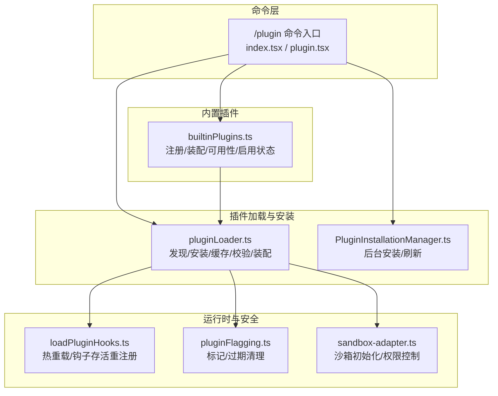
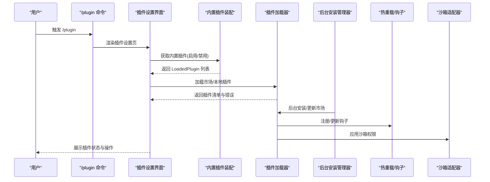
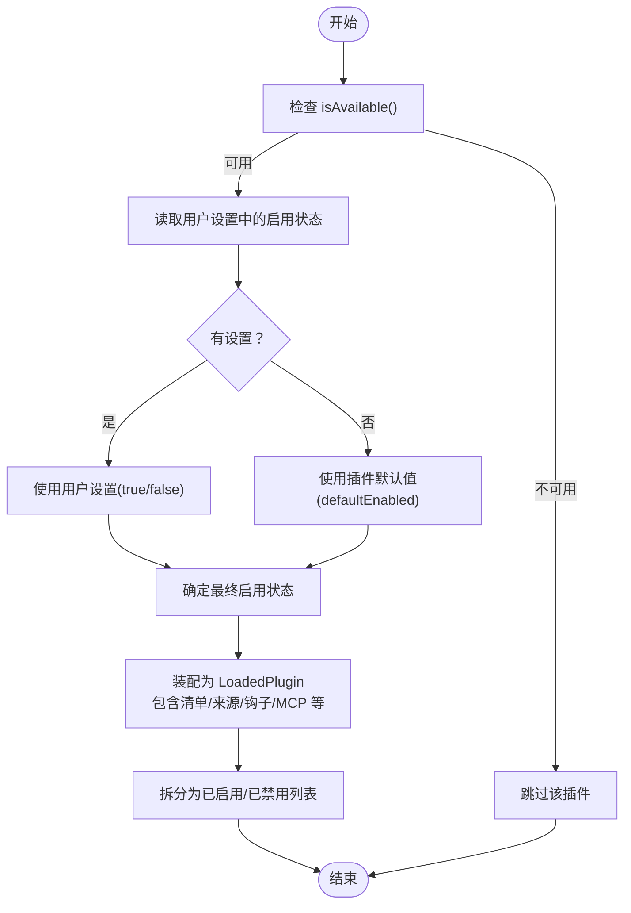
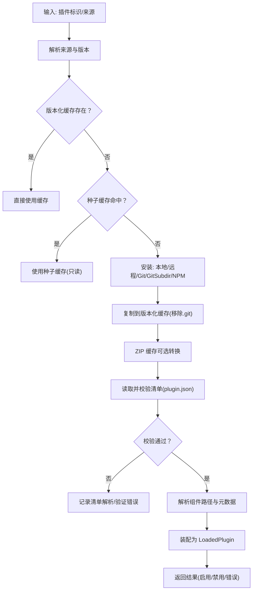
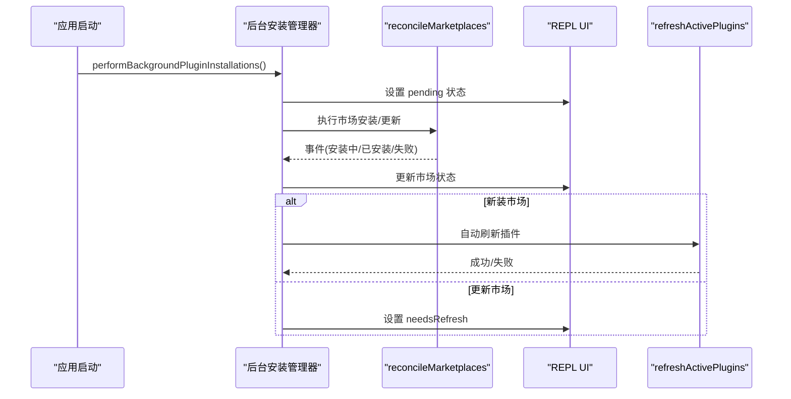
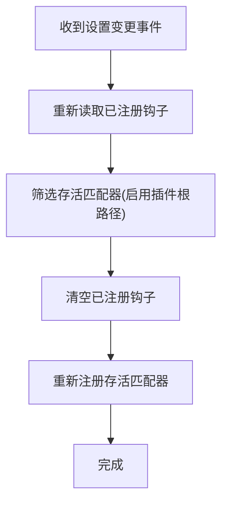
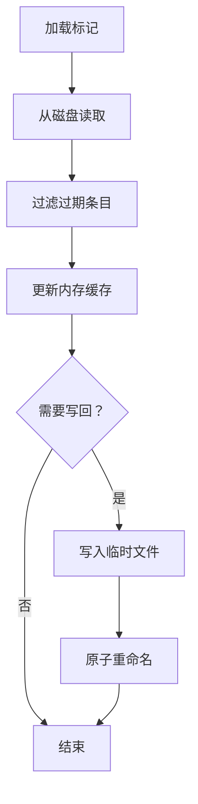
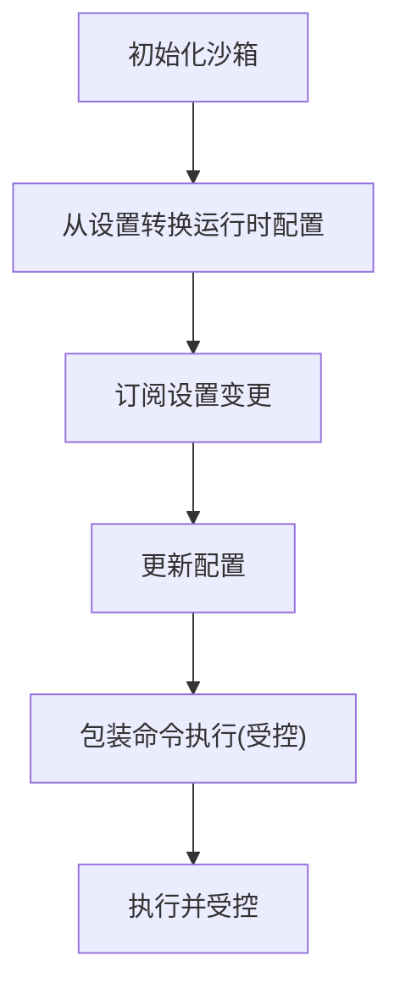
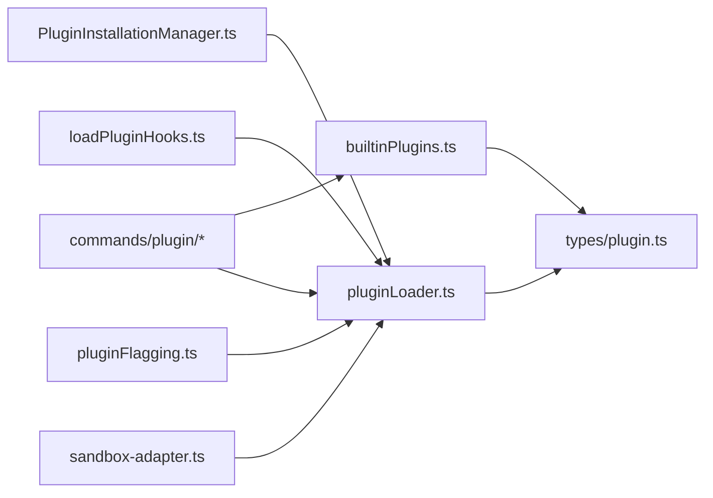

# 插件系统设计

<cite>
**本文引用的文件**
- [builtinPlugins.ts](file://src/plugins/builtinPlugins.ts)
- [plugin.ts](file://src/types/plugin.ts)
- [pluginLoader.ts](file://src/utils/plugins/pluginLoader.ts)
- [PluginInstallationManager.ts](file://src/services/plugins/PluginInstallationManager.ts)
- [plugin.tsx](file://src/commands/plugin/plugin.tsx)
- [index.tsx](file://src/commands/plugin/index.tsx)
- [loadPluginHooks.ts](file://src/utils/plugins/loadPluginHooks.ts)
- [pluginFlagging.ts](file://src/utils/plugins/pluginFlagging.ts)
- [sandbox-adapter.ts](file://src/utils/sandbox/sandbox-adapter.ts)
</cite>

## 目录
1. [引言](#引言)
2. [项目结构](#项目结构)
3. [核心组件](#核心组件)
4. [架构总览](#架构总览)
5. [详细组件分析](#详细组件分析)
6. [依赖关系分析](#依赖关系分析)
7. [性能考量](#性能考量)
8. [故障排查指南](#故障排查指南)
9. [结论](#结论)
10. [附录](#附录)

## 引言
本设计文档面向 Claude Code 插件系统，聚焦于插件架构、加载机制与生命周期管理，系统性阐述内置插件（BUILTIN_PLUGINS）的设计理念、注册与启用/禁用逻辑，以及与市场插件的差异。文档还覆盖插件注册流程、依赖解析与冲突处理、插件隔离与安全控制、性能优化策略、开发规范、API 接口与调试工具，并给出插件实现示例与发布指南，同时说明插件清单验证、版本兼容性与热重载支持，以及插件市场集成中“官方插件”与“第三方插件”的区别。

## 项目结构
围绕插件系统的相关模块分布如下：
- 插件定义与类型：位于 types/plugin.ts，定义 LoadedPlugin、BuiltinPluginDefinition、PluginError 等核心类型。
- 内置插件注册与装配：位于 plugins/builtinPlugins.ts，负责内置插件的注册、可用性过滤、启用状态决策与装配为 LoadedPlugin。
- 插件加载与安装：位于 utils/plugins/pluginLoader.ts，负责从市场或本地源发现、拉取、缓存、校验与装配插件。
- 插件后台安装与刷新：位于 services/plugins/PluginInstallationManager.ts，负责在后台自动安装/更新市场并触发插件刷新。
- 命令入口与 UI：commands/plugin 下提供 /plugin 命令入口与设置界面；index.tsx 定义命令元信息。
- 热重载与钩子：utils/plugins/loadPluginHooks.ts 提供热重载订阅与钩子存活重注册。
- 插件标记与过期清理：utils/plugins/pluginFlagging.ts 负责插件标记持久化与过期回收。
- 沙箱隔离与权限：utils/sandbox/sandbox-adapter.ts 提供沙箱初始化、配置更新与权限约束。

图表来源
- [index.tsx:1-11](file://src/commands/plugin/index.tsx#L1-L11)
- [plugin.tsx:1-7](file://src/commands/plugin/plugin.tsx#L1-L7)
- [builtinPlugins.ts:1-160](file://src/plugins/builtinPlugins.ts#L1-L160)
- [pluginLoader.ts:1-800](file://src/utils/plugins/pluginLoader.ts#L1-L800)
- [PluginInstallationManager.ts:1-185](file://src/services/plugins/PluginInstallationManager.ts#L1-L185)
- [loadPluginHooks.ts:186-215](file://src/utils/plugins/loadPluginHooks.ts#L186-L215)
- [pluginFlagging.ts:86-144](file://src/utils/plugins/pluginFlagging.ts#L86-L144)
- [sandbox-adapter.ts:769-913](file://src/utils/sandbox/sandbox-adapter.ts#L769-L913)

章节来源
- [index.tsx:1-11](file://src/commands/plugin/index.tsx#L1-L11)
- [plugin.tsx:1-7](file://src/commands/plugin/plugin.tsx#L1-L7)
- [builtinPlugins.ts:1-160](file://src/plugins/builtinPlugins.ts#L1-L160)
- [pluginLoader.ts:1-800](file://src/utils/plugins/pluginLoader.ts#L1-L800)
- [PluginInstallationManager.ts:1-185](file://src/services/plugins/PluginInstallationManager.ts#L1-L185)
- [loadPluginHooks.ts:186-215](file://src/utils/plugins/loadPluginHooks.ts#L186-L215)
- [pluginFlagging.ts:86-144](file://src/utils/plugins/pluginFlagging.ts#L86-L144)
- [sandbox-adapter.ts:769-913](file://src/utils/sandbox/sandbox-adapter.ts#L769-L913)

## 核心组件
- 内置插件注册中心：维护内置插件定义、可用性检查、默认启用状态与用户偏好合并，输出已启用/禁用的 LoadedPlugin 列表。
- 插件加载器：统一处理市场/本地插件发现、安装、缓存、清单校验、组件装配与错误收集。
- 后台安装管理器：在应用启动后异步安装/更新市场，必要时触发插件刷新以修复“未找到”等缓存问题。
- 热重载与钩子：监听插件设置变化，仅对仍启用的插件根路径保留钩子匹配器，避免失效钩子影响系统稳定性。
- 插件标记与过期：将插件标记写入磁盘，定期清理过期条目，保持标记数据一致性。
- 沙箱与权限：根据设置动态初始化/更新沙箱配置，限制文件系统读写、网络访问与本地绑定等能力，保障运行时安全。

章节来源
- [builtinPlugins.ts:1-160](file://src/plugins/builtinPlugins.ts#L1-L160)
- [plugin.ts:1-364](file://src/types/plugin.ts#L1-L364)
- [pluginLoader.ts:1-800](file://src/utils/plugins/pluginLoader.ts#L1-L800)
- [PluginInstallationManager.ts:1-185](file://src/services/plugins/PluginInstallationManager.ts#L1-L185)
- [loadPluginHooks.ts:186-215](file://src/utils/plugins/loadPluginHooks.ts#L186-L215)
- [pluginFlagging.ts:86-144](file://src/utils/plugins/pluginFlagging.ts#L86-L144)
- [sandbox-adapter.ts:769-913](file://src/utils/sandbox/sandbox-adapter.ts#L769-L913)

## 架构总览
下图展示插件系统的关键交互：命令入口触发 UI，UI 通过内置插件与加载器获取插件列表；加载器结合市场与本地源进行安装与装配；后台管理器在启动后异步处理市场安装；热重载与钩子确保启用插件的钩子存活；沙箱适配器提供安全隔离。

图表来源
- [index.tsx:1-11](file://src/commands/plugin/index.tsx#L1-L11)
- [plugin.tsx:1-7](file://src/commands/plugin/plugin.tsx#L1-L7)
- [builtinPlugins.ts:52-102](file://src/plugins/builtinPlugins.ts#L52-L102)
- [pluginLoader.ts:1-800](file://src/utils/plugins/pluginLoader.ts#L1-L800)
- [PluginInstallationManager.ts:60-185](file://src/services/plugins/PluginInstallationManager.ts#L60-L185)
- [loadPluginHooks.ts:186-215](file://src/utils/plugins/loadPluginHooks.ts#L186-L215)
- [sandbox-adapter.ts:769-913](file://src/utils/sandbox/sandbox-adapter.ts#L769-L913)

## 详细组件分析

### 内置插件系统（BUILTIN_PLUGINS）
- 设计理念
  - 内置插件随 CLI 分发，用户可在 /plugin 界面启用/禁用，状态持久化到用户设置。
  - 插件 ID 使用 “名称@builtin” 格式，与市场插件（名称@市场）区分。
  - 可提供多类组件：技能、钩子、MCP 服务器等。
- 注册与装配
  - registerBuiltinPlugin：在启动时注册插件定义。
  - getBuiltinPlugins：按用户设置与默认值决定启用/禁用，装配为 LoadedPlugin，包含清单、路径、来源、是否内置、钩子与 MCP 配置等字段。
  - isBuiltinPluginId：判断插件 ID 是否为内置。
  - getBuiltinPluginDefinition：按名称获取定义，用于 UI 展示。
  - getBuiltinPluginSkillCommands：将启用的内置插件技能转换为命令对象，便于工具/提示使用。
- 用户启用/禁用逻辑
  - 优先级：用户设置 > 插件默认值 > true；不可用（isAvailable 返回 false）的插件直接隐藏。
  - 路径与来源：内置插件无文件系统路径（sentinel），来源为 “builtin”，以便 UI 与统计区分。
- 与市场插件的差异
  - 内置插件不走市场安装流程，直接由装配函数生成 LoadedPlugin；市场插件需经加载器处理安装与缓存。

图表来源
- [builtinPlugins.ts:52-102](file://src/plugins/builtinPlugins.ts#L52-L102)

章节来源
- [builtinPlugins.ts:1-160](file://src/plugins/builtinPlugins.ts#L1-L160)
- [plugin.ts:18-35](file://src/types/plugin.ts#L18-L35)

### 插件加载器（pluginLoader.ts）
- 发现与来源
  - 优先级：市场插件（名称@市场）> 会话级插件（--plugin-dir 或 SDK 插件选项）。
  - 支持本地目录、Git 仓库、Git 子目录、NPM 包（通过市场条目声明）。
- 缓存与版本
  - 版本化缓存路径：~/.claude/plugins/cache/{市场}/{插件}/{版本}/，支持 ZIP 缓存模式。
  - 种子缓存探测：按优先级检查种子目录，命中则直接使用只读缓存。
  - 兼容旧版：若存在非版本化缓存则回退使用。
- 安装与复制
  - 本地插件：优先使用市场条目中的 source 字段作为真实来源，严格校验路径安全。
  - 远程插件：从下载内容复制到版本化缓存，移除 .git 目录，校验内容非空。
  - ZIP 缓存：可选将目录转为 ZIP 并删除目录，减少磁盘占用。
- 清单与校验
  - 支持 plugin.json 清单，使用模式校验与延迟模式（lazy schema）提升健壮性。
  - 错误类型丰富，覆盖路径不存在、Git 认证失败、网络错误、清单解析/验证失败、市场不可用、MCP/LSP 配置无效、请求超时/失败、依赖未满足、缓存缺失等。
- 组件装配
  - 解析命令、代理、技能、输出样式、钩子、MCP/LSP 服务器等路径与元数据。
  - 处理重复命名检测与冲突抑制（如 MCP 服务器同命令/URL 的重复）。
- 性能与可靠性
  - 浅克隆与稀疏检出（git-subdir）显著降低大仓库下载成本。
  - 缓存命中优先、ZIP 缓存可选、种子缓存加速首次加载。
  - 错误聚合返回，便于 UI 与诊断日志定位问题。

图表来源
- [pluginLoader.ts:126-465](file://src/utils/plugins/pluginLoader.ts#L126-L465)
- [plugin.ts:101-284](file://src/types/plugin.ts#L101-L284)

章节来源
- [pluginLoader.ts:1-800](file://src/utils/plugins/pluginLoader.ts#L1-L800)
- [plugin.ts:1-364](file://src/types/plugin.ts#L1-L364)

### 后台安装与刷新（PluginInstallationManager.ts）
- 背景目标
  - 在不影响启动的前提下，自动安装/更新市场；对新装市场自动刷新插件，对更新市场提示用户执行 /reload-plugins。
- 关键流程
  - 计算声明市场与已配置市场的差异，预置 UI 状态（pending）。
  - reconcileMarketplaces 监听进度事件，更新市场安装状态。
  - 新装成功：清空市场与插件缓存，调用 refreshActivePlugins 自动刷新并重建 MCP 连接。
  - 更新完成：清空缓存并设置 needsRefresh，提示用户手动刷新。
- 事件与指标
  - 记录安装/更新/失败/最新版本数量等指标，便于诊断与产品度量。

图表来源
- [PluginInstallationManager.ts:60-185](file://src/services/plugins/PluginInstallationManager.ts#L60-L185)

章节来源
- [PluginInstallationManager.ts:1-185](file://src/services/plugins/PluginInstallationManager.ts#L1-L185)

### 热重载与钩子（loadPluginHooks.ts）
- 目标
  - 在插件设置变更时，仅保留仍启用插件根路径对应的钩子匹配器，避免失效钩子导致回调异常。
- 机制
  - 读取当前已注册钩子，筛选出仍在启用集合中的插件根路径，清空后重新注册存活匹配器。
  - 提供测试用的重置函数，便于单元测试隔离。

图表来源
- [loadPluginHooks.ts:186-215](file://src/utils/plugins/loadPluginHooks.ts#L186-L215)

章节来源
- [loadPluginHooks.ts:186-215](file://src/utils/plugins/loadPluginHooks.ts#L186-L215)

### 插件标记与过期（pluginFlagging.ts）
- 目标
  - 将插件标记持久化到磁盘，定期清理过期条目，保证标记数据一致性与安全性。
- 机制
  - 写入临时文件后原子重命名，失败时清理临时文件。
  - 加载时过滤过期条目并更新缓存；必要时回写磁盘。

图表来源
- [pluginFlagging.ts:86-144](file://src/utils/plugins/pluginFlagging.ts#L86-L144)

章节来源
- [pluginFlagging.ts:86-144](file://src/utils/plugins/pluginFlagging.ts#L86-L144)

### 沙箱与安全控制（sandbox-adapter.ts）
- 目标
  - 动态初始化/更新沙箱配置，限制文件系统读写、网络访问、本地绑定等，保障插件运行安全。
- 机制
  - 从设置转换运行时配置，订阅设置变更以动态更新沙箱参数。
  - 提供查询接口：是否启用、平台支持、依赖检查、允许的命令/端口、代理端口、忽略违规策略等。
  - 包装命令执行，确保受限环境下的安全运行。

图表来源
- [sandbox-adapter.ts:769-913](file://src/utils/sandbox/sandbox-adapter.ts#L769-L913)

章节来源
- [sandbox-adapter.ts:769-913](file://src/utils/sandbox/sandbox-adapter.ts#L769-L913)

## 依赖关系分析
- 组件耦合
  - builtinPlugins.ts 与 types/plugin.ts 紧密耦合（LoadedPlugin/BuiltinPluginDefinition），向 UI 与命令层提供装配后的插件对象。
  - pluginLoader.ts 依赖市场管理、安装辅助、版本计算、缓存与 ZIP 工具，承担主要加载职责。
  - PluginInstallationManager.ts 依赖市场管理与刷新工具，负责后台安装与 UI 状态同步。
  - loadPluginHooks.ts 与 pluginLoader.ts 协作，确保启用插件的钩子存活。
  - pluginFlagging.ts 与 pluginLoader.ts 协作，保证标记与缓存一致性。
  - sandbox-adapter.ts 与 settings 与工具层协作，提供统一的安全边界。
- 外部依赖
  - Git、NPM、文件系统 API、网络访问（用于市场与下载）。
- 循环依赖
  - 当前模块间通过类型与函数边界清晰，未见循环依赖迹象。

图表来源
- [builtinPlugins.ts:1-160](file://src/plugins/builtinPlugins.ts#L1-L160)
- [plugin.ts:1-364](file://src/types/plugin.ts#L1-L364)
- [pluginLoader.ts:1-800](file://src/utils/plugins/pluginLoader.ts#L1-L800)
- [PluginInstallationManager.ts:1-185](file://src/services/plugins/PluginInstallationManager.ts#L1-L185)
- [loadPluginHooks.ts:186-215](file://src/utils/plugins/loadPluginHooks.ts#L186-L215)
- [pluginFlagging.ts:86-144](file://src/utils/plugins/pluginFlagging.ts#L86-L144)
- [sandbox-adapter.ts:769-913](file://src/utils/sandbox/sandbox-adapter.ts#L769-L913)
- [index.tsx:1-11](file://src/commands/plugin/index.tsx#L1-L11)
- [plugin.tsx:1-7](file://src/commands/plugin/plugin.tsx#L1-L7)

章节来源
- [builtinPlugins.ts:1-160](file://src/plugins/builtinPlugins.ts#L1-L160)
- [plugin.ts:1-364](file://src/types/plugin.ts#L1-L364)
- [pluginLoader.ts:1-800](file://src/utils/plugins/pluginLoader.ts#L1-L800)
- [PluginInstallationManager.ts:1-185](file://src/services/plugins/PluginInstallationManager.ts#L1-L185)
- [loadPluginHooks.ts:186-215](file://src/utils/plugins/loadPluginHooks.ts#L186-L215)
- [pluginFlagging.ts:86-144](file://src/utils/plugins/pluginFlagging.ts#L86-L144)
- [sandbox-adapter.ts:769-913](file://src/utils/sandbox/sandbox-adapter.ts#L769-L913)
- [index.tsx:1-11](file://src/commands/plugin/index.tsx#L1-L11)
- [plugin.tsx:1-7](file://src/commands/plugin/plugin.tsx#L1-L7)

## 性能考量
- 缓存策略
  - 版本化缓存与 ZIP 缓存减少重复下载与解压开销；种子缓存命中可直接使用只读缓存。
- 网络与 I/O
  - Git 浅克隆、稀疏检出（git-subdir）大幅降低大仓库下载体积；NPM 包缓存复用。
  - 文件复制采用符号链接安全处理，避免循环与跨文件系统移动问题。
- 错误与回退
  - 缓存为空时抛错回退至其他来源；安装失败记录错误并继续流程，避免单点阻塞。
- UI 体验
  - 后台安装完成后自动刷新插件，减少用户干预；更新场景提示手动刷新，兼顾性能与可控性。

[本节为通用性能讨论，无需列出具体文件来源]

## 故障排查指南
- 常见错误类型与定位
  - 路径不存在、Git 认证失败、网络错误、清单解析/验证失败、市场不可用、MCP/LSP 配置无效、请求超时/失败、依赖未满足、缓存缺失等。
  - 使用 getPluginErrorMessage 可将 PluginError 转换为可读消息，便于日志与 UI 展示。
- 诊断步骤
  - 查看错误类型与上下文字段（如插件名、路径、URL、方法、原因等）。
  - 对于市场相关错误，检查市场配置与网络策略；对于 Git 相关错误，确认凭证与网络可达性。
  - 对于缓存缺失，执行后台刷新或手动 /reload-plugins。
- 相关实现参考
  - 错误类型定义与消息映射：参见类型定义与消息函数。
  - 后台安装与刷新：参见后台安装管理器。
  - 热重载与钩子：参见热重载模块。

章节来源
- [plugin.ts:101-364](file://src/types/plugin.ts#L101-L364)
- [PluginInstallationManager.ts:135-180](file://src/services/plugins/PluginInstallationManager.ts#L135-L180)
- [loadPluginHooks.ts:186-215](file://src/utils/plugins/loadPluginHooks.ts#L186-L215)

## 结论
Claude Code 插件系统通过“内置插件 + 市场插件”的双轨设计，实现了即插即用与生态扩展的平衡。内置插件以明确的注册与启用/禁用逻辑融入 UI 与命令层；加载器统一处理来源、安装、缓存、校验与装配，并提供丰富的错误类型与可观测性；后台安装管理器在启动后异步完成市场安装与刷新；热重载与钩子确保启用插件的钩子存活；沙箱适配器提供统一的安全边界。整体架构在功能完整性、可维护性与性能之间取得良好平衡。

[本节为总结性内容，无需列出具体文件来源]

## 附录

### 插件开发规范与 API 接口
- 插件清单与组件
  - 支持 plugin.json 清单，定义元数据与组件路径；支持 commands/agents/skills/hooks/output-styles 等组件目录。
  - 组件元数据可通过对象映射格式提供，便于动态装配。
- 内置插件定义
  - 使用 BuiltinPluginDefinition 描述插件名称、描述、版本、技能、钩子、MCP 服务器、可用性与默认启用状态。
- 插件装配
  - 通过 LoadedPlugin 统一承载插件信息，包含清单、来源、路径、启用状态、组件路径与元数据、钩子配置、MCP/LSP 服务器等。
- 错误处理
  - 使用 PluginError 类型与 getPluginErrorMessage 统一错误消息生成，便于 UI 与日志展示。

章节来源
- [plugin.ts:18-70](file://src/types/plugin.ts#L18-L70)
- [plugin.ts:101-364](file://src/types/plugin.ts#L101-L364)

### 调试工具与最佳实践
- 调试工具
  - 后台安装管理器：观察市场安装状态与刷新行为。
  - 热重载：在设置变更后自动重注册存活钩子。
  - 沙箱适配器：动态更新配置，限制文件系统与网络访问。
- 最佳实践
  - 明确插件 ID 命名规则（内置使用 @builtin，市场使用 @市场）。
  - 清单校验与错误聚合，确保问题可追踪。
  - 合理使用缓存与 ZIP 缓存，优化加载性能。
  - 对依赖进行显式声明与冲突抑制，避免重复与冲突。

章节来源
- [PluginInstallationManager.ts:60-185](file://src/services/plugins/PluginInstallationManager.ts#L60-L185)
- [loadPluginHooks.ts:186-215](file://src/utils/plugins/loadPluginHooks.ts#L186-L215)
- [sandbox-adapter.ts:769-913](file://src/utils/sandbox/sandbox-adapter.ts#L769-L913)

### 插件实现示例与发布指南
- 示例思路
  - 内置插件：在启动时调用 registerBuiltinPlugin 注册定义，提供技能/钩子/MCP 配置，UI 将显示启用/禁用开关。
  - 市场插件：提供 plugin.json 清单与组件目录，通过市场条目声明来源与版本，加载器自动安装与装配。
- 发布建议
  - 内置插件：随 CLI 发布，遵循内置插件定义与装配流程。
  - 市场插件：在市场中声明来源（本地目录、Git、NPM），提供稳定版本与清单校验，确保可重复安装与升级。

章节来源
- [builtinPlugins.ts:25-32](file://src/plugins/builtinPlugins.ts#L25-L32)
- [pluginLoader.ts:1-800](file://src/utils/plugins/pluginLoader.ts#L1-L800)

### 插件清单验证、版本兼容性与热重载
- 清单验证
  - 使用模式校验与延迟模式，支持解析失败与验证失败两类错误，便于快速定位问题。
- 版本兼容性
  - 版本化缓存路径与种子缓存支持多版本并存；ZIP 缓存可选，兼容不同部署形态。
- 热重载
  - 仅对仍启用的插件根路径保留钩子匹配器，避免失效钩子影响系统稳定性。

章节来源
- [pluginLoader.ts:1-800](file://src/utils/plugins/pluginLoader.ts#L1-L800)
- [loadPluginHooks.ts:186-215](file://src/utils/plugins/loadPluginHooks.ts#L186-L215)

### 插件市场集成、官方插件与第三方插件
- 市场集成
  - 市场插件通过名称@市场的标识接入；后台安装管理器负责自动安装/更新市场。
- 官方插件与第三方插件
  - 官方插件通常以内置插件形式提供，强调稳定性与与 CLI 的紧密集成；第三方插件通过市场分发，强调生态扩展与社区贡献。
  - 两者在加载器与装配流程上一致，差异主要体现在来源、信任模型与更新策略。

章节来源
- [PluginInstallationManager.ts:60-185](file://src/services/plugins/PluginInstallationManager.ts#L60-L185)
- [builtinPlugins.ts:1-160](file://src/plugins/builtinPlugins.ts#L1-L160)