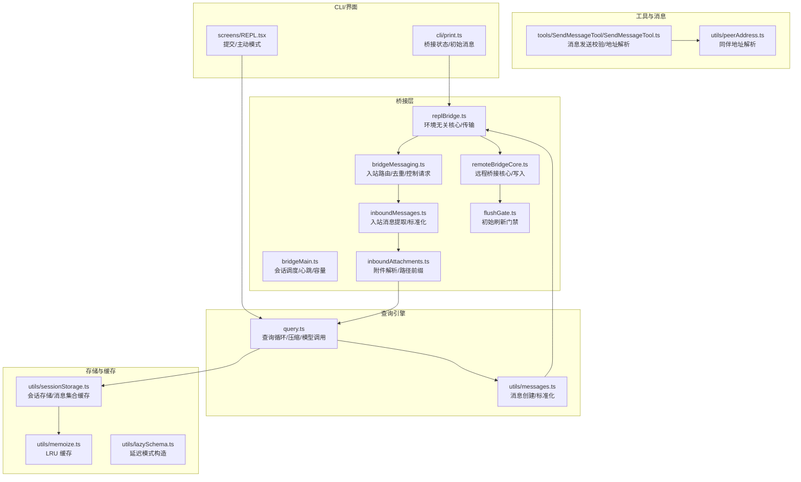
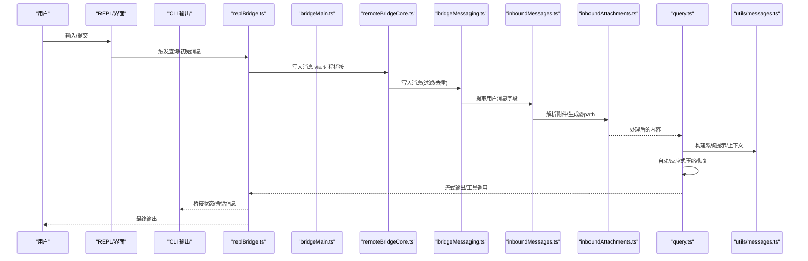
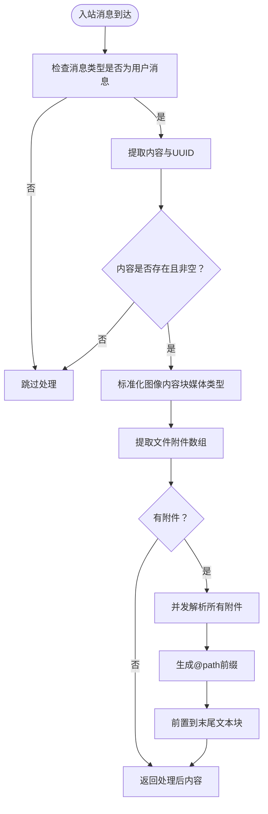
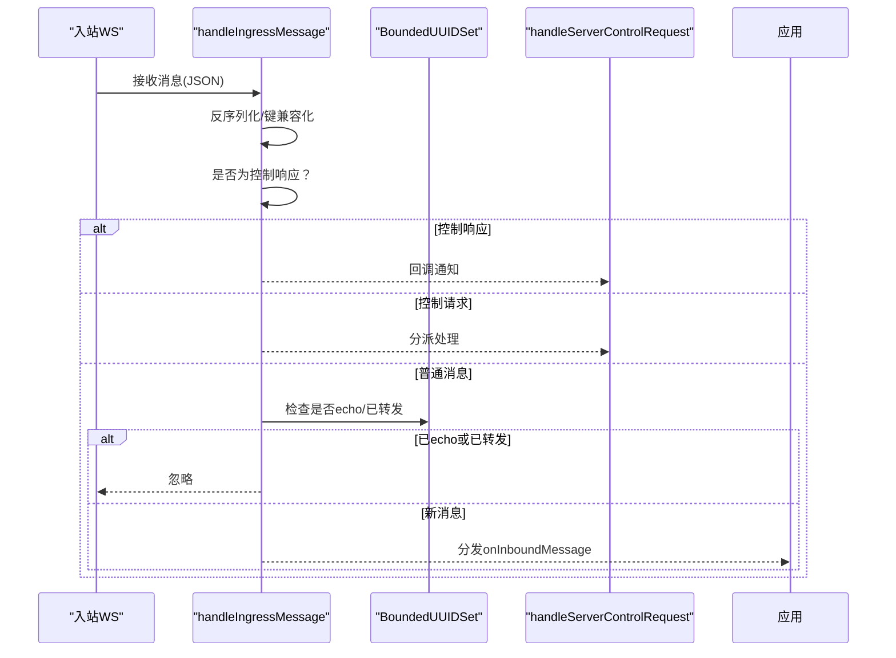
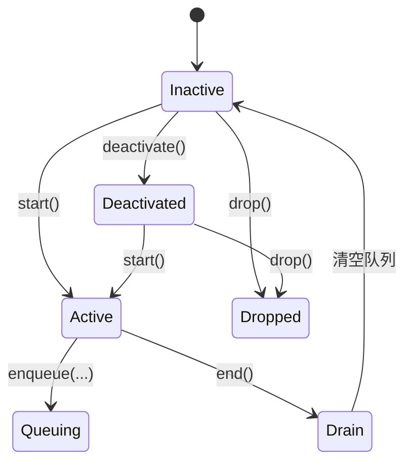
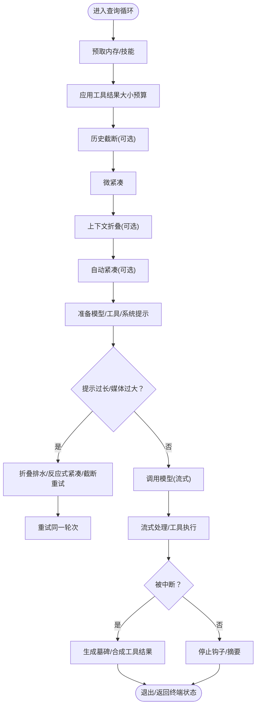
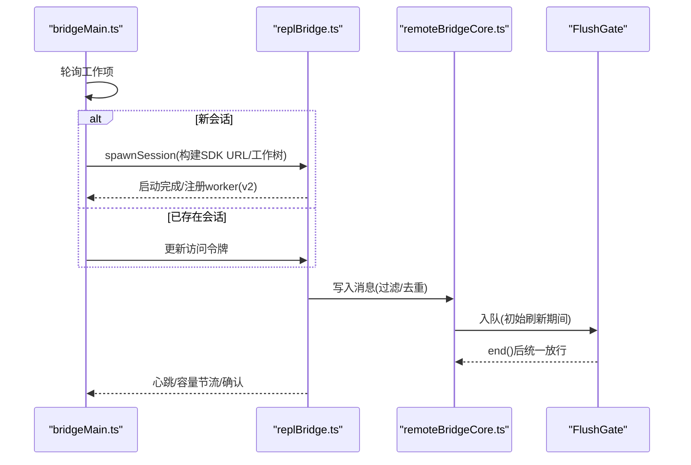
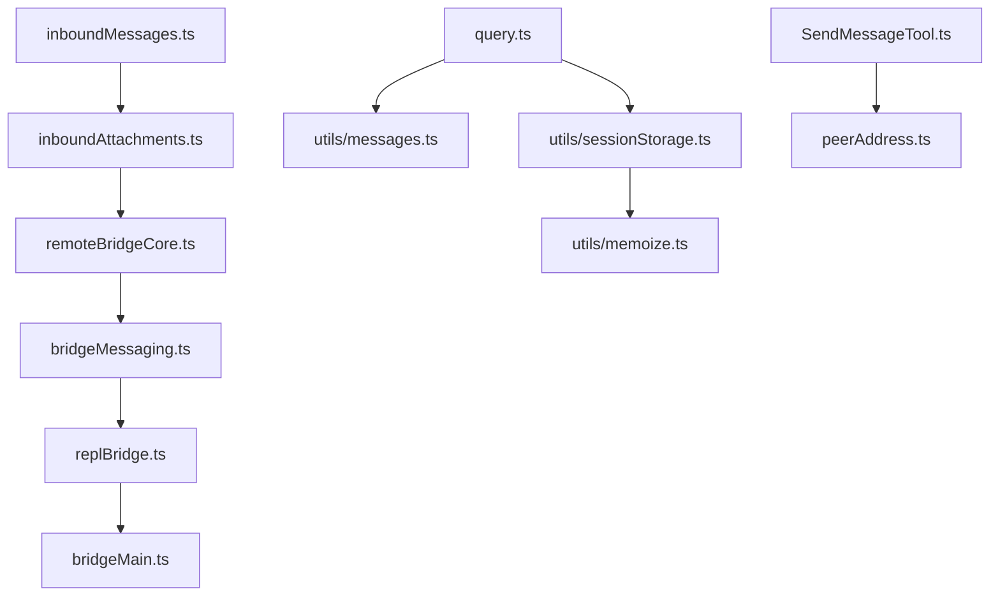

# 数据流设计

<cite>
**本文引用的文件**
- [src/bridge/inboundMessages.ts](file://src/bridge/inboundMessages.ts)
- [src/bridge/inboundAttachments.ts](file://src/bridge/inboundAttachments.ts)
- [src/bridge/bridgeMessaging.ts](file://src/bridge/bridgeMessaging.ts)
- [src/bridge/flushGate.ts](file://src/bridge/flushGate.ts)
- [src/bridge/replBridge.ts](file://src/bridge/replBridge.ts)
- [src/bridge/remoteBridgeCore.ts](file://src/bridge/remoteBridgeCore.ts)
- [src/bridge/bridgeMain.ts](file://src/bridge/bridgeMain.ts)
- [src/query.ts](file://src/query.ts)
- [src/utils/messages.ts](file://src/utils/messages.ts)
- [src/utils/sessionStorage.ts](file://src/utils/sessionStorage.ts)
- [src/utils/memoize.ts](file://src/utils/memoize.ts)
- [src/utils/lazySchema.ts](file://src/utils/lazySchema.ts)
- [src/tools/SendMessageTool/SendMessageTool.ts](file://src/tools/SendMessageTool/SendMessageTool.ts)
- [src/utils/peerAddress.ts](file://src/utils/peerAddress.ts)
- [src/cli/print.ts](file://src/cli/print.ts)
- [src/screens/REPL.tsx](file://src/screens/REPL.tsx)
</cite>

## 目录
1. [简介](#简介)
2. [项目结构](#项目结构)
3. [核心组件](#核心组件)
4. [架构总览](#架构总览)
5. [详细组件分析](#详细组件分析)
6. [依赖关系分析](#依赖关系分析)
7. [性能考量](#性能考量)
8. [故障排查指南](#故障排查指南)
9. [结论](#结论)
10. [附录](#附录)

## 简介
本文件面向 Claude Code 的“数据流设计”，系统性描述从用户输入到最终输出的完整数据处理流程，重点覆盖以下方面：
- 消息处理管道：入站消息解析、内容块标准化、附件解析与路径前缀注入、标题推导与去重。
- 上下文管理机制：查询循环中的消息压缩（自动/反应式）、微紧凑、历史截断、任务预算与令牌预算。
- 状态转换逻辑：桥接层会话生命周期、初始刷新门禁（FlushGate）、传输替换与队列排空。
- 数据验证规则与转换策略：图像内容块规范化、输入校验、权限模式控制请求响应。
- 缓存机制：会话存储、消息缓存、微紧凑缓存编辑、LRU 缓存与记忆修正提示。
- 性能瓶颈与优化建议：网络下载超时、初始历史刷写上限、回退模型切换、工具执行流式化。
- 故障排查：桥接心跳与容量节流、工作项确认、错误事件记录与诊断日志。

## 项目结构
围绕数据流的关键模块分布如下：
- 桥接层（Bridge）：负责与远端服务交互、会话管理、消息入站解析、出站写入与去重、初始刷新门禁。
- 查询引擎（Query Engine）：负责消息上下文构建、压缩与恢复、模型调用、工具执行与结果回填、错误抑制与恢复。
- 工具与消息工具：消息发送工具的地址解析与输入校验、同伴消息路由。
- 会话存储与缓存：消息持久化、会话消息集合缓存、LRU 缓存与微紧凑缓存编辑。
- CLI/界面：REPL 提交、主动模式、桥接状态输出与初始消息处理。



图表来源
- [src/bridge/bridgeMain.ts:141-200](file://src/bridge/bridgeMain.ts#L141-L200)
- [src/bridge/replBridge.ts:398-1274](file://src/bridge/replBridge.ts#L398-L1274)
- [src/bridge/remoteBridgeCore.ts:762-795](file://src/bridge/remoteBridgeCore.ts#L762-L795)
- [src/bridge/inboundMessages.ts:21-40](file://src/bridge/inboundMessages.ts#L21-L40)
- [src/bridge/inboundAttachments.ts:123-176](file://src/bridge/inboundAttachments.ts#L123-L176)
- [src/bridge/bridgeMessaging.ts:132-208](file://src/bridge/bridgeMessaging.ts#L132-L208)
- [src/bridge/flushGate.ts:16-72](file://src/bridge/flushGate.ts#L16-L72)
- [src/query.ts:219-239](file://src/query.ts#L219-L239)
- [src/utils/messages.ts:1-200](file://src/utils/messages.ts#L1-L200)
- [src/utils/sessionStorage.ts:3843-3868](file://src/utils/sessionStorage.ts#L3843-L3868)
- [src/utils/memoize.ts:234-269](file://src/utils/memoize.ts#L234-L269)
- [src/utils/lazySchema.ts:1-8](file://src/utils/lazySchema.ts#L1-L8)
- [src/tools/SendMessageTool/SendMessageTool.ts:604-643](file://src/tools/SendMessageTool/SendMessageTool.ts#L604-L643)
- [src/utils/peerAddress.ts:1-21](file://src/utils/peerAddress.ts#L1-L21)
- [src/cli/print.ts:3947-3981](file://src/cli/print.ts#L3947-L3981)
- [src/screens/REPL.tsx:3139-3160](file://src/screens/REPL.tsx#L3139-L3160)

章节来源
- [src/bridge/bridgeMain.ts:141-200](file://src/bridge/bridgeMain.ts#L141-L200)
- [src/bridge/replBridge.ts:398-1274](file://src/bridge/replBridge.ts#L398-L1274)
- [src/bridge/remoteBridgeCore.ts:762-795](file://src/bridge/remoteBridgeCore.ts#L762-L795)
- [src/bridge/inboundMessages.ts:21-40](file://src/bridge/inboundMessages.ts#L21-L40)
- [src/bridge/inboundAttachments.ts:123-176](file://src/bridge/inboundAttachments.ts#L123-L176)
- [src/bridge/bridgeMessaging.ts:132-208](file://src/bridge/bridgeMessaging.ts#L132-L208)
- [src/bridge/flushGate.ts:16-72](file://src/bridge/flushGate.ts#L16-L72)
- [src/query.ts:219-239](file://src/query.ts#L219-L239)
- [src/utils/messages.ts:1-200](file://src/utils/messages.ts#L1-L200)
- [src/utils/sessionStorage.ts:3843-3868](file://src/utils/sessionStorage.ts#L3843-L3868)
- [src/utils/memoize.ts:234-269](file://src/utils/memoize.ts#L234-L269)
- [src/utils/lazySchema.ts:1-8](file://src/utils/lazySchema.ts#L1-L8)
- [src/tools/SendMessageTool/SendMessageTool.ts:604-643](file://src/tools/SendMessageTool/SendMessageTool.ts#L604-L643)
- [src/utils/peerAddress.ts:1-21](file://src/utils/peerAddress.ts#L1-L21)
- [src/cli/print.ts:3947-3981](file://src/cli/print.ts#L3947-L3981)
- [src/screens/REPL.tsx:3139-3160](file://src/screens/REPL.tsx#L3139-L3160)

## 核心组件
- 入站消息处理管线
  - 入站字段提取与类型校验：仅接受用户消息，支持字符串或内容块数组；对空内容进行过滤。
  - 图像内容块标准化：统一媒体类型字段命名，避免 API 调用失败。
  - 附件解析与路径前缀注入：从消息中提取文件附件，下载并写入本地上传目录，生成 @path 引用并前置到内容块末尾文本块。
- 桥接消息处理与去重
  - 入站消息路由：区分控制请求/响应与普通消息；对 echo 与重复消息进行去重。
  - 控制请求处理：初始化、设置模型、设置最大思考令牌、设置权限模式、中断等，均需及时响应以避免服务器挂起。
- 初始刷新门禁（FlushGate）
  - 在会话启动时的历史消息批量刷写期间，拦截新消息进入，待刷写完成后统一放行。
- 查询循环与上下文管理
  - 循环状态：消息列表、工具使用上下文、自动压缩跟踪、最大输出令牌恢复计数、停止钩子状态、轮次计数。
  - 压缩与恢复：微紧凑、历史截断、反应式紧凑、上下文折叠；对提示过长与媒体过大错误进行抑制与恢复。
  - 工具执行与结果回填：流式工具执行器、缺失工具结果的墓碑消息、中断时的合成工具结果。
- 会话存储与缓存
  - 会话消息集合缓存（LRU），用于快速判断消息存在性与减少磁盘读取。
  - 微紧凑缓存编辑：在 API 请求中插入缓存编辑块，并在后续请求中重新发送以维持命中率。

章节来源
- [src/bridge/inboundMessages.ts:21-81](file://src/bridge/inboundMessages.ts#L21-L81)
- [src/bridge/inboundAttachments.ts:123-176](file://src/bridge/inboundAttachments.ts#L123-L176)
- [src/bridge/bridgeMessaging.ts:132-208](file://src/bridge/bridgeMessaging.ts#L132-L208)
- [src/bridge/flushGate.ts:16-72](file://src/bridge/flushGate.ts#L16-L72)
- [src/query.ts:201-239](file://src/query.ts#L201-L239)
- [src/utils/sessionStorage.ts:3843-3868](file://src/utils/sessionStorage.ts#L3843-L3868)
- [src/utils/memoize.ts:234-269](file://src/utils/memoize.ts#L234-L269)

## 架构总览
下图展示从用户输入到最终输出的端到端数据流，包括桥接层、消息处理、查询引擎与工具执行：



图表来源
- [src/screens/REPL.tsx:3139-3160](file://src/screens/REPL.tsx#L3139-L3160)
- [src/cli/print.ts:3947-3981](file://src/cli/print.ts#L3947-L3981)
- [src/bridge/replBridge.ts:1248-1274](file://src/bridge/replBridge.ts#L1248-L1274)
- [src/bridge/remoteBridgeCore.ts:762-795](file://src/bridge/remoteBridgeCore.ts#L762-L795)
- [src/bridge/bridgeMessaging.ts:132-208](file://src/bridge/bridgeMessaging.ts#L132-L208)
- [src/bridge/inboundMessages.ts:21-40](file://src/bridge/inboundMessages.ts#L21-L40)
- [src/bridge/inboundAttachments.ts:123-176](file://src/bridge/inboundAttachments.ts#L123-L176)
- [src/query.ts:219-239](file://src/query.ts#L219-L239)
- [src/utils/messages.ts:1-200](file://src/utils/messages.ts#L1-L200)

## 详细组件分析

### 组件一：入站消息处理与附件解析
- 关键职责
  - 提取用户消息内容与 UUID，过滤非用户或空内容。
  - 标准化图像内容块的媒体类型字段，确保 API 兼容。
  - 解析文件附件，下载到本地上传目录，生成 @path 引用并前置到内容块末尾文本块。
- 数据验证与转换
  - 对内容块数组进行扫描，识别缺失媒体类型的 base64 图像块并补全 media_type。
  - 附件数组采用延迟模式构造的 Zod Schema，避免模块初始化时的昂贵开销。
- 性能与可靠性
  - 下载超时控制，失败时记录调试日志并跳过该附件，保证消息仍可送达。
  - 路径前缀注入仅在存在有效 @path 时生效，避免无意义的字符串拼接。



图表来源
- [src/bridge/inboundMessages.ts:21-81](file://src/bridge/inboundMessages.ts#L21-L81)
- [src/bridge/inboundAttachments.ts:123-176](file://src/bridge/inboundAttachments.ts#L123-L176)
- [src/utils/lazySchema.ts:1-8](file://src/utils/lazySchema.ts#L1-L8)

章节来源
- [src/bridge/inboundMessages.ts:21-81](file://src/bridge/inboundMessages.ts#L21-L81)
- [src/bridge/inboundAttachments.ts:123-176](file://src/bridge/inboundAttachments.ts#L123-L176)
- [src/utils/lazySchema.ts:1-8](file://src/utils/lazySchema.ts#L1-L8)

### 组件二：桥接消息路由与去重
- 关键职责
  - 解析入站 WebSocket 消息，区分控制请求/响应与普通消息。
  - 使用双环形缓冲区（BoundedUUIDSet）实现 echo 去重与重播去重。
  - 响应服务器的控制请求（初始化、设置模型、设置权限模式、中断等）。
- 安全与一致性
  - 对 echo（自身发出的消息）与重复入站消息进行过滤，防止重复处理。
  - 控制请求必须及时响应，否则服务器会在约 10-14 秒内断开连接。



图表来源
- [src/bridge/bridgeMessaging.ts:132-208](file://src/bridge/bridgeMessaging.ts#L132-L208)
- [src/bridge/bridgeMessaging.ts:243-392](file://src/bridge/bridgeMessaging.ts#L243-L392)

章节来源
- [src/bridge/bridgeMessaging.ts:132-208](file://src/bridge/bridgeMessaging.ts#L132-L208)
- [src/bridge/bridgeMessaging.ts:243-392](file://src/bridge/bridgeMessaging.ts#L243-L392)

### 组件三：初始刷新门禁（FlushGate）
- 生命周期
  - start()：标记开始，enqueue() 返回 true 并开始排队。
  - end()：结束并返回队列中的全部项，随后 enqueue() 返回 false。
  - drop()：永久丢弃队列项（传输永久关闭）。
  - deactivate()：清除激活标志但不丢弃项（传输替换，由新传输排空）。
- 应用场景
  - 会话启动时批量刷写历史消息，期间拦截新消息，避免交错。



图表来源
- [src/bridge/flushGate.ts:16-72](file://src/bridge/flushGate.ts#L16-L72)

章节来源
- [src/bridge/flushGate.ts:16-72](file://src/bridge/flushGate.ts#L16-L72)

### 组件四：查询循环与上下文管理
- 循环状态
  - messages、toolUseContext、autoCompactTracking、maxOutputTokensRecoveryCount、hasAttemptedReactiveCompact、maxOutputTokensOverride、pendingToolUseSummary、stopHookActive、turnCount、transition。
- 压缩与恢复
  - 微紧凑、历史截断、反应式紧凑、上下文折叠；对提示过长与媒体过大错误进行抑制，必要时触发恢复路径。
- 工具执行
  - 流式工具执行器，按块添加工具调用，产出工具结果并回填到消息流。
- 错误处理
  - 对最大输出令牌错误进行延迟呈现，等待恢复尝试；对图片尺寸/重试错误给出友好提示；对中断生成墓碑消息或合成工具结果。



图表来源
- [src/query.ts:241-1200](file://src/query.ts#L241-L1200)
- [src/utils/messages.ts:1-200](file://src/utils/messages.ts#L1-L200)

章节来源
- [src/query.ts:241-1200](file://src/query.ts#L241-L1200)
- [src/utils/messages.ts:1-200](file://src/utils/messages.ts#L1-L200)

### 组件五：桥接会话生命周期与状态转换
- 会话调度
  - 桥接主循环根据工作项创建/更新会话，处理令牌刷新、工作项确认、容量节流与睡眠唤醒。
- 传输与刷新
  - 支持 CCR v1/v2 两种路径；在传输替换时通过 FlushGate.drop() 或 deactivate() 处理队列。
- 初始消息与标题推导
  - 首条用户消息到达时派生会话标题并上报；若服务器已有标题则优先使用。



图表来源
- [src/bridge/bridgeMain.ts:852-1200](file://src/bridge/bridgeMain.ts#L852-L1200)
- [src/bridge/replBridge.ts:398-1274](file://src/bridge/replBridge.ts#L398-L1274)
- [src/bridge/remoteBridgeCore.ts:762-795](file://src/bridge/remoteBridgeCore.ts#L762-L795)
- [src/bridge/flushGate.ts:16-72](file://src/bridge/flushGate.ts#L16-L72)

章节来源
- [src/bridge/bridgeMain.ts:852-1200](file://src/bridge/bridgeMain.ts#L852-L1200)
- [src/bridge/replBridge.ts:398-1274](file://src/bridge/replBridge.ts#L398-L1274)
- [src/bridge/remoteBridgeCore.ts:762-795](file://src/bridge/remoteBridgeCore.ts#L762-L795)
- [src/bridge/flushGate.ts:16-72](file://src/bridge/flushGate.ts#L16-L72)

### 组件六：消息发送工具与同伴地址解析
- 地址解析
  - 支持 uds:/bridge:/ 与裸路径前缀，确保旧式发送者也能正确路由。
- 输入校验
  - to 字段不能为空；bridge/uds 场景 target 不能为空；禁止使用带 @ 的团队成员名作为目标。
  - 在启用 UDS 收件箱时，跨会话消息仅允许纯文本，拒绝结构化消息。

```mermaid
flowchart TD
S["接收SendMessageTool输入"] --> Parse["parseAddress(to)"]
Parse --> Scheme{"scheme类型？"}
Scheme --> |bridge/uds且target为空| Err["校验失败"]
Scheme --> |to含@| Err
Scheme --> |其他| OK["校验通过"]
```

图表来源
- [src/tools/SendMessageTool/SendMessageTool.ts:604-643](file://src/tools/SendMessageTool/SendMessageTool.ts#L604-L643)
- [src/utils/peerAddress.ts:1-21](file://src/utils/peerAddress.ts#L1-L21)

章节来源
- [src/tools/SendMessageTool/SendMessageTool.ts:604-643](file://src/tools/SendMessageTool/SendMessageTool.ts#L604-L643)
- [src/utils/peerAddress.ts:1-21](file://src/utils/peerAddress.ts#L1-L21)

## 依赖关系分析
- 模块耦合
  - 入站消息处理依赖桥接配置与会话状态，附件解析依赖 OAuth 访问令牌与上传目录。
  - 查询引擎依赖消息工具库、系统提示与上下文构建，以及工具执行器与流式工具执行器。
  - 桥接层依赖桥接 API 客户端、心跳与容量唤醒机制。
- 外部依赖
  - Axios 用于附件下载；UUID 用于消息去重与标题派生；Zod 用于延迟模式构造的 Schema。
- 潜在循环依赖
  - 消息工具与同伴邮箱之间通过动态导入规避循环依赖。



图表来源
- [src/bridge/inboundMessages.ts:1-81](file://src/bridge/inboundMessages.ts#L1-L81)
- [src/bridge/inboundAttachments.ts:1-176](file://src/bridge/inboundAttachments.ts#L1-L176)
- [src/bridge/remoteBridgeCore.ts:762-795](file://src/bridge/remoteBridgeCore.ts#L762-L795)
- [src/bridge/bridgeMessaging.ts:1-463](file://src/bridge/bridgeMessaging.ts#L1-L463)
- [src/bridge/replBridge.ts:398-1274](file://src/bridge/replBridge.ts#L398-L1274)
- [src/bridge/bridgeMain.ts:141-200](file://src/bridge/bridgeMain.ts#L141-L200)
- [src/query.ts:219-239](file://src/query.ts#L219-L239)
- [src/utils/messages.ts:1-200](file://src/utils/messages.ts#L1-L200)
- [src/utils/sessionStorage.ts:3843-3868](file://src/utils/sessionStorage.ts#L3843-L3868)
- [src/utils/memoize.ts:234-269](file://src/utils/memoize.ts#L234-L269)
- [src/tools/SendMessageTool/SendMessageTool.ts:604-643](file://src/tools/SendMessageTool/SendMessageTool.ts#L604-L643)
- [src/utils/peerAddress.ts:1-21](file://src/utils/peerAddress.ts#L1-L21)

章节来源
- [src/bridge/inboundMessages.ts:1-81](file://src/bridge/inboundMessages.ts#L1-L81)
- [src/bridge/inboundAttachments.ts:1-176](file://src/bridge/inboundAttachments.ts#L1-L176)
- [src/bridge/remoteBridgeCore.ts:762-795](file://src/bridge/remoteBridgeCore.ts#L762-L795)
- [src/bridge/bridgeMessaging.ts:1-463](file://src/bridge/bridgeMessaging.ts#L1-L463)
- [src/bridge/replBridge.ts:398-1274](file://src/bridge/replBridge.ts#L398-L1274)
- [src/bridge/bridgeMain.ts:141-200](file://src/bridge/bridgeMain.ts#L141-L200)
- [src/query.ts:219-239](file://src/query.ts#L219-L239)
- [src/utils/messages.ts:1-200](file://src/utils/messages.ts#L1-L200)
- [src/utils/sessionStorage.ts:3843-3868](file://src/utils/sessionStorage.ts#L3843-L3868)
- [src/utils/memoize.ts:234-269](file://src/utils/memoize.ts#L234-L269)
- [src/tools/SendMessageTool/SendMessageTool.ts:604-643](file://src/tools/SendMessageTool/SendMessageTool.ts#L604-L643)
- [src/utils/peerAddress.ts:1-21](file://src/utils/peerAddress.ts#L1-L21)

## 性能考量
- 初始历史刷写上限
  - REPL 初次连接时对历史消息进行上限裁剪，避免大规模回放导致持久化压力与 Firestore 压力上升。
- 附件下载超时
  - 附件下载设置超时阈值，失败时记录调试日志并跳过该附件，保证消息仍可送达。
- 缓存与去重
  - BoundedUUIDSet 使用环形缓冲实现常数空间的去重；会话消息集合缓存采用 LRU，防止无限增长。
- 流式工具执行
  - 流式工具执行器在模型响应期间即时产出工具结果，减少整体延迟。
- 回退模型切换
  - 当高需求导致错误时，自动切换到回退模型并清理中间态消息，避免签名不匹配问题。

章节来源
- [src/bridge/replBridge.ts:1248-1274](file://src/bridge/replBridge.ts#L1248-L1274)
- [src/bridge/inboundAttachments.ts:25-96](file://src/bridge/inboundAttachments.ts#L25-L96)
- [src/bridge/bridgeMessaging.ts:430-462](file://src/bridge/bridgeMessaging.ts#L430-L462)
- [src/utils/sessionStorage.ts:3843-3868](file://src/utils/sessionStorage.ts#L3843-L3868)
- [src/utils/memoize.ts:234-269](file://src/utils/memoize.ts#L234-L269)
- [src/query.ts:896-956](file://src/query.ts#L896-L956)

## 故障排查指南
- 桥接心跳与容量节流
  - 若出现频繁解码失败或容量饱和，检查心跳间隔与多会话轮询间隔配置，确保在容量切换后进行适当休眠。
- 工作项确认
  - 确认工作项在提交处理后再进行确认，避免在容量保护分支提前确认导致工作丢失。
- 传输替换与队列排空
  - 传输替换时使用 deactivate() 保留队列由新传输排空；永久关闭时使用 drop() 并记录丢弃数量。
- 控制请求未响应
  - 确保对服务器控制请求（初始化、设置模型、设置权限模式、中断）及时响应，避免服务器挂起。
- 初始消息标题派生
  - 首条用户消息到达时派生标题；若服务器已设置标题则优先使用，避免覆盖。

章节来源
- [src/bridge/bridgeMain.ts:832-830](file://src/bridge/bridgeMain.ts#L832-L830)
- [src/bridge/flushGate.ts:52-70](file://src/bridge/flushGate.ts#L52-L70)
- [src/bridge/bridgeMessaging.ts:243-392](file://src/bridge/bridgeMessaging.ts#L243-L392)
- [src/bridge/replBridge.ts:906-920](file://src/bridge/replBridge.ts#L906-L920)

## 结论
本数据流设计文档梳理了从用户输入到最终输出的完整链路，强调了桥接层的去重与门禁机制、查询引擎的上下文压缩与恢复策略、以及会话存储与缓存的协同作用。通过合理的验证规则、转换策略与缓存机制，系统在复杂场景下保持稳定与高性能。建议在实际部署中关注初始历史刷写上限、附件下载超时、传输替换与队列排空、控制请求响应等关键点，以获得更佳的用户体验与稳定性。

## 附录
- 关键流程图与类图已在前述章节中以 Mermaid 形式呈现，便于结合源码定位实现细节。
- 如需进一步了解特定功能（如微紧凑缓存编辑、会话消息集合缓存），可参考对应章节的“章节来源”。