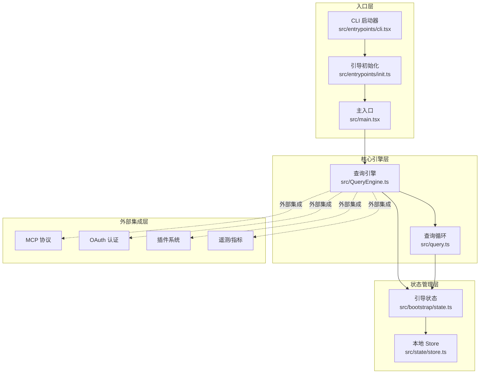
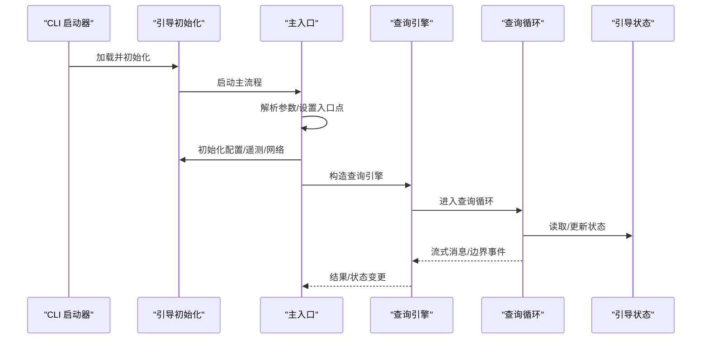
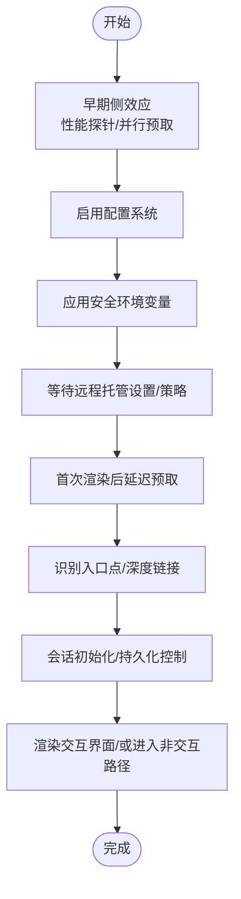
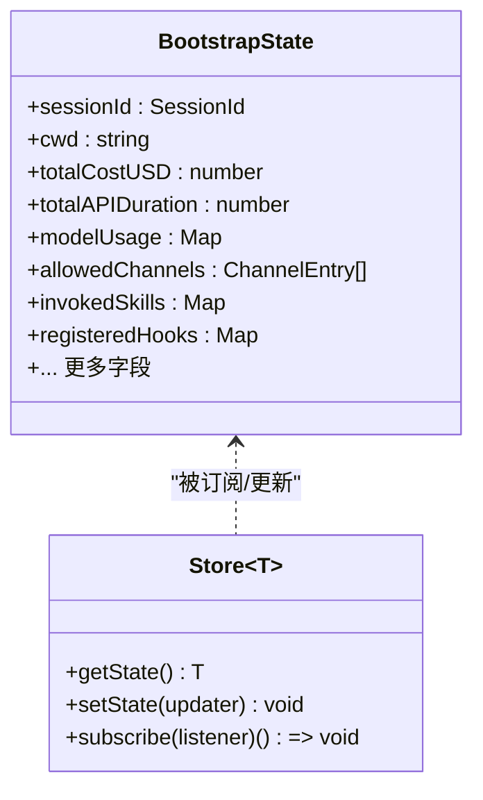
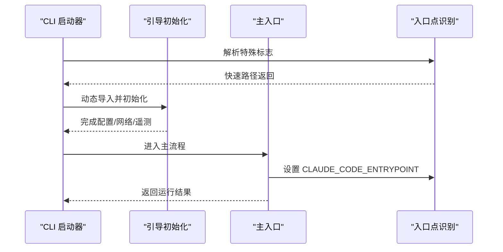
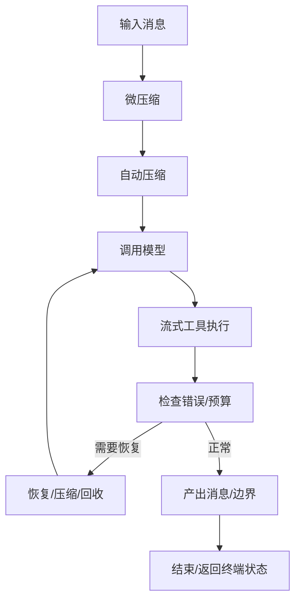
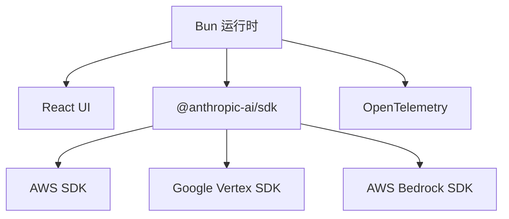

# 整体架构概览

<cite>
**本文档引用的文件**
- [src/main.tsx](file://src/main.tsx)
- [src/QueryEngine.ts](file://src/QueryEngine.ts)
- [src/bootstrap/state.ts](file://src/bootstrap/state.ts)
- [src/state/store.ts](file://src/state/store.ts)
- [src/entrypoints/init.ts](file://src/entrypoints/init.ts)
- [src/entrypoints/cli.tsx](file://src/entrypoints/cli.tsx)
- [src/query.ts](file://src/query.ts)
- [package.json](file://package.json)
</cite>

## 目录
1. [引言](#引言)
2. [项目结构](#项目结构)
3. [核心组件](#核心组件)
4. [架构总览](#架构总览)
5. [详细组件分析](#详细组件分析)
6. [依赖分析](#依赖分析)
7. [性能考量](#性能考量)
8. [故障排查指南](#故障排查指南)
9. [结论](#结论)

## 引言
本文件面向 Claude Code 的整体架构，聚焦于高层设计模式、核心架构组件与模块间交互关系。重点阐述主入口点 main.tsx 的启动流程、QueryEngine 的核心职责、状态管理机制与入口点系统；并解释模块化设计原则、依赖注入模式与组件解耦策略，给出系统边界、外部接口规范与集成点设计，以及技术栈选择、第三方依赖集成策略与版本兼容性管理的决策背景。

## 项目结构
该项目采用以功能域与层次划分相结合的组织方式：
- 入口层：CLI 启动器与多入口点（CLI、Agent SDK、MCP 等）
- 引导层：配置系统、遥测初始化、网络代理与 mTLS 配置
- 核心引擎层：QueryEngine 负责对话生命周期与会话状态管理
- 查询执行层：query.ts 实现模型调用、工具编排、压缩与恢复路径
- 状态管理层：全局状态与本地 Store 抽象
- 外部集成层：MCP、OAuth、插件、遥测等



图表来源
- [src/entrypoints/cli.tsx:1-200](file://src/entrypoints/cli.tsx#L1-L200)
- [src/entrypoints/init.ts:1-200](file://src/entrypoints/init.ts#L1-L200)
- [src/main.tsx:585-800](file://src/main.tsx#L585-L800)
- [src/QueryEngine.ts:186-210](file://src/QueryEngine.ts#L186-L210)
- [src/query.ts:219-240](file://src/query.ts#L219-L240)
- [src/bootstrap/state.ts:431-450](file://src/bootstrap/state.ts#L431-L450)
- [src/state/store.ts:10-35](file://src/state/store.ts#L10-L35)

章节来源
- [src/entrypoints/cli.tsx:1-200](file://src/entrypoints/cli.tsx#L1-L200)
- [src/entrypoints/init.ts:1-200](file://src/entrypoints/init.ts#L1-L200)
- [src/main.tsx:585-800](file://src/main.tsx#L585-L800)
- [src/QueryEngine.ts:186-210](file://src/QueryEngine.ts#L186-L210)
- [src/query.ts:219-240](file://src/query.ts#L219-L240)
- [src/bootstrap/state.ts:431-450](file://src/bootstrap/state.ts#L431-L450)
- [src/state/store.ts:10-35](file://src/state/store.ts#L10-L35)

## 核心组件
- 主入口与启动流程：负责早期参数解析、调试检测、信任建立、配置启用、遥测初始化、延迟预取与渲染，最终进入交互或非交互路径。
- QueryEngine：封装一次对话的完整生命周期，维护消息历史、使用量统计、权限拒绝记录，并通过可注入的工具集与 MCP 客户端驱动模型调用与工具执行。
- 状态管理：以引导态（bootstrap/state）为核心全局状态容器，配合本地 Store 抽象实现订阅式更新；同时提供会话级状态切换与持久化控制。
- 查询执行：query.ts 实现上下文压缩、自动压缩、流式工具执行、令牌预算与恢复路径，保证长对话的稳定性与性能。
- 入口点系统：CLI、Agent SDK、MCP 等多入口通过环境变量与命令行参数识别入口类型，按需加载功能模块，实现死代码消除与按需初始化。

章节来源
- [src/main.tsx:585-800](file://src/main.tsx#L585-L800)
- [src/QueryEngine.ts:186-210](file://src/QueryEngine.ts#L186-L210)
- [src/bootstrap/state.ts:431-450](file://src/bootstrap/state.ts#L431-L450)
- [src/state/store.ts:10-35](file://src/state/store.ts#L10-L35)
- [src/query.ts:219-240](file://src/query.ts#L219-L240)

## 架构总览
系统采用“入口层-引导层-核心引擎层-查询执行层-状态管理层-外部集成层”的分层架构，结合模块化与按需加载策略，实现快速启动、灵活扩展与强解耦。



图表来源
- [src/entrypoints/cli.tsx:60-120](file://src/entrypoints/cli.tsx#L60-L120)
- [src/entrypoints/init.ts:57-120](file://src/entrypoints/init.ts#L57-L120)
- [src/main.tsx:585-800](file://src/main.tsx#L585-L800)
- [src/QueryEngine.ts:211-240](file://src/QueryEngine.ts#L211-L240)
- [src/query.ts:241-300](file://src/query.ts#L241-L300)

## 详细组件分析

### 主入口启动流程（main.tsx）
- 早期侧效应：启动性能探针、并行预取 MDM 与钥匙串信息，确保后续导入阶段不阻塞。
- 配置与信任：启用配置系统、应用安全环境变量、等待远程托管设置与策略限制加载。
- 延迟预取：在首次渲染后异步执行用户上下文、提示词建议、模型能力等，避免阻塞首屏。
- 入口点识别：根据 CLI 参数设置 CLAUDE_CODE_ENTRYPOINT，支持 CLI、SDK、MCP 等入口。
- 深度链接与直连：处理 cc://、macOS URL Scheme 等，重写 argv 以进入完整交互路径。
- 会话与持久化：记录会话、处理快照与压缩边界消息，支持 --bare 模式下的无阻塞写入。



图表来源
- [src/main.tsx:1-100](file://src/main.tsx#L1-L100)
- [src/main.tsx:388-431](file://src/main.tsx#L388-L431)
- [src/main.tsx:517-540](file://src/main.tsx#L517-L540)
- [src/main.tsx:612-677](file://src/main.tsx#L612-L677)
- [src/main.tsx:797-800](file://src/main.tsx#L797-L800)

章节来源
- [src/main.tsx:1-100](file://src/main.tsx#L1-L100)
- [src/main.tsx:388-431](file://src/main.tsx#L388-L431)
- [src/main.tsx:517-540](file://src/main.tsx#L517-L540)
- [src/main.tsx:612-677](file://src/main.tsx#L612-L677)
- [src/main.tsx:797-800](file://src/main.tsx#L797-L800)

### QueryEngine 核心职责
- 生命周期管理：封装一次对话的完整生命周期，跨轮次保持消息、文件缓存、使用量等状态。
- 权限与工具：包装 canUseTool 以追踪权限拒绝，注入工具与 MCP 客户端，支持结构化输出与权限模式。
- 系统提示构建：组合默认系统提示、用户上下文、系统上下文与记忆机制提示，支持追加与自定义。
- 会话持久化：在关键节点记录转录，支持 --bare 与紧急刷新策略，保障中断后的可恢复性。
- 流式消息与边界：规范化消息、处理压缩边界、进度消息与用户消息，统一 SDK 输出格式。

```mermaid
classDiagram
class QueryEngine {
-config : QueryEngineConfig
-mutableMessages : Message[]
-abortController : AbortController
-permissionDenials : SDKPermissionDenial[]
-totalUsage : NonNullableUsage
-readFileState : FileStateCache
+constructor(config)
+submitMessage(prompt, options) AsyncGenerator
}
class QueryEngineConfig {
+cwd : string
+tools : Tools
+commands : Command[]
+mcpClients : MCPServerConnection[]
+agents : AgentDefinition[]
+canUseTool : CanUseToolFn
+getAppState : () => AppState
+setAppState : (f) => void
+initialMessages? : Message[]
+readFileCache : FileStateCache
+customSystemPrompt? : string
+appendSystemPrompt? : string
+userSpecifiedModel? : string
+fallbackModel? : string
+thinkingConfig? : ThinkingConfig
+maxTurns? : number
+maxBudgetUsd? : number
+taskBudget? : { total : number }
+jsonSchema? : Record<string, unknown>
+verbose? : boolean
+replayUserMessages? : boolean
+includePartialMessages? : boolean
+setSDKStatus? : (status) => void
+abortController? : AbortController
+orphanedPermission? : OrphanedPermission
+snipReplay? : (yieldedSystemMsg, store) => {...}|undefined
}
QueryEngine --> QueryEngineConfig : "持有"
```

图表来源
- [src/QueryEngine.ts:132-175](file://src/QueryEngine.ts#L132-L175)
- [src/QueryEngine.ts:202-210](file://src/QueryEngine.ts#L202-L210)
- [src/QueryEngine.ts:211-240](file://src/QueryEngine.ts#L211-L240)

章节来源
- [src/QueryEngine.ts:132-175](file://src/QueryEngine.ts#L132-L175)
- [src/QueryEngine.ts:202-210](file://src/QueryEngine.ts#L202-L210)
- [src/QueryEngine.ts:211-240](file://src/QueryEngine.ts#L211-L240)

### 状态管理机制
- 引导状态（bootstrap/state）：集中存放会话 ID、工作目录、成本与时延统计、模型使用量、钩子与计数器、频道白名单、计划/技能缓存等全局状态。
- 本地 Store（state/store）：提供 getState/setState/subscribe 的轻量 Store 抽象，用于局部状态更新与订阅通知。
- 会话切换：提供 switchSession 与信号机制，确保会话 ID 与项目目录原子切换，避免漂移。



图表来源
- [src/bootstrap/state.ts:45-257](file://src/bootstrap/state.ts#L45-L257)
- [src/state/store.ts:4-35](file://src/state/store.ts#L4-L35)

章节来源
- [src/bootstrap/state.ts:45-257](file://src/bootstrap/state.ts#L45-L257)
- [src/state/store.ts:4-35](file://src/state/store.ts#L4-L35)

### 入口点系统
- CLI 启动器（entrypoints/cli.tsx）：提供版本查询、系统提示转储、桥接模式、守护进程、后台会话管理等快速路径，均通过动态导入实现按需加载与死代码消除。
- 主入口（main.tsx）：根据 argv 与环境变量设置 CLAUDE_CODE_ENTRYPOINT，区分 CLI 与 SDK 入口，处理深度链接与直连场景。
- 引导初始化（entrypoints/init.ts）：集中初始化配置、遥测、网络代理与 mTLS、上游代理、LSP 管理器清理等，支持非交互模式下的遥测提前初始化。



图表来源
- [src/entrypoints/cli.tsx:60-120](file://src/entrypoints/cli.tsx#L60-L120)
- [src/entrypoints/init.ts:57-120](file://src/entrypoints/init.ts#L57-L120)
- [src/main.tsx:517-540](file://src/main.tsx#L517-L540)

章节来源
- [src/entrypoints/cli.tsx:60-120](file://src/entrypoints/cli.tsx#L60-L120)
- [src/entrypoints/init.ts:57-120](file://src/entrypoints/init.ts#L57-L120)
- [src/main.tsx:517-540](file://src/main.tsx#L517-L540)

### 查询执行与恢复路径（query.ts）
- 上下文压缩：支持自动压缩、微压缩与历史截断，减少上下文长度并保留关键信息。
- 工具编排：流式工具执行器与工具结果预算控制，避免过大的工具结果影响上下文。
- 恢复路径：对最大输出令牌与提示过长等错误进行暂存与恢复，必要时触发压缩或回收。
- 任务预算：支持任务预算参数，跨压缩边界跟踪剩余配额。



图表来源
- [src/query.ts:412-470](file://src/query.ts#L412-L470)
- [src/query.ts:653-741](file://src/query.ts#L653-L741)
- [src/query.ts:790-840](file://src/query.ts#L790-L840)

章节来源
- [src/query.ts:412-470](file://src/query.ts#L412-L470)
- [src/query.ts:653-741](file://src/query.ts#L653-L741)
- [src/query.ts:790-840](file://src/query.ts#L790-L840)

## 依赖分析
- 技术栈与运行时：基于 Bun 作为运行时与打包工具，React 用于 UI 渲染，OpenTelemetry 用于遥测，@anthropic-ai/sdk 与相关云 SDK 用于推理与认证。
- 第三方依赖：通过 devDependencies 管理，包括 MCP、Sandbox、AWS/GCP/Vertex SDK、代理与 mTLS 支持、遥测导出器等。
- 版本兼容性：引擎要求 Bun >=1.2.0；通过 feature() 宏与按需导入实现特性开关与死代码消除，避免外部构建引入不必要的依赖。



图表来源
- [package.json:24-26](file://package.json#L24-L26)
- [package.json:51-164](file://package.json#L51-L164)

章节来源
- [package.json:24-26](file://package.json#L24-L26)
- [package.json:51-164](file://package.json#L51-L164)

## 性能考量
- 启动优化：早期并行预取、延迟预取、按需导入与死代码消除显著缩短首屏时间。
- 查询优化：自动压缩、微压缩与历史截断降低上下文长度；流式工具执行与预算控制避免大结果影响响应时间。
- 事件循环：在首次渲染后执行耗时任务，避免抢占主线程；滚动节流与空闲检测减少主线程阻塞。
- 遥测与网络：预连接 Anthropic API、延迟初始化遥测、代理与 mTLS 配置仅在需要时生效。

## 故障排查指南
- 配置错误：在非交互模式下直接退出并在 stderr 输出错误；在交互模式下弹出无效配置对话框。
- 权限与策略：策略限制与远程托管设置加载失败时，优先使用安全环境变量；必要时等待设置加载后再初始化遥测。
- 错误日志：内存中的最近错误队列上限为 100 条，便于诊断与回溯。
- 会话恢复：在用户消息写入转录前即持久化，即使进程在 API 响应前被终止也能恢复。

章节来源
- [src/entrypoints/init.ts:215-237](file://src/entrypoints/init.ts#L215-L237)
- [src/main.tsx:448-466](file://src/main.tsx#L448-L466)
- [src/utils/log.ts:64-99](file://src/utils/log.ts#L64-L99)

## 结论
该架构通过清晰的分层与模块化设计，实现了快速启动、灵活扩展与强解耦。主入口与引导层负责安全与性能优先的初始化，QueryEngine 将对话生命周期与状态管理内聚，query.ts 提供稳健的压缩与恢复路径，bootstrap/state 与本地 Store 提供一致的状态抽象。入口点系统通过环境变量与动态导入实现多入口统一与死代码消除。技术栈与第三方依赖的选择兼顾性能与可观测性，版本兼容性通过运行时与特性门控策略得到保障。