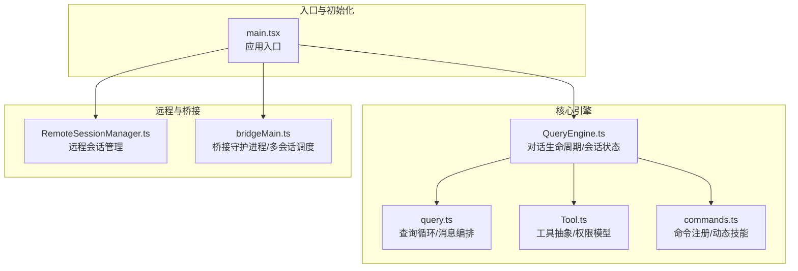
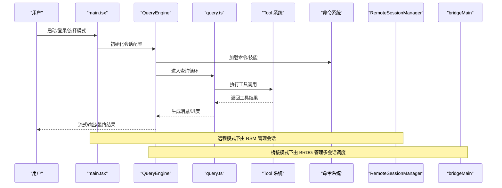
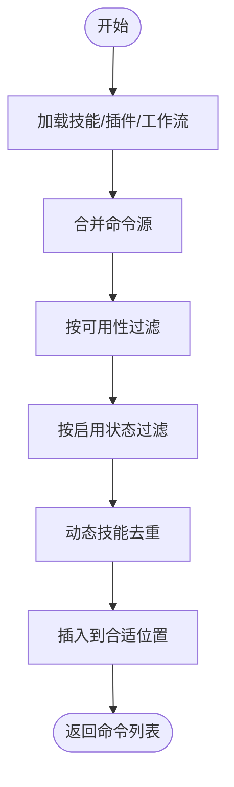
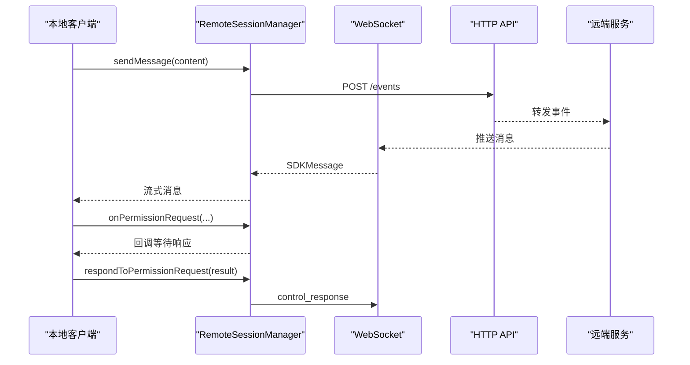
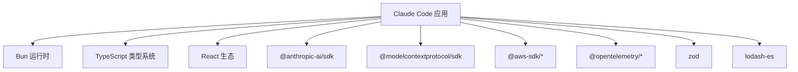

# 架构设计

<cite>
**本文档引用的文件**
- [QueryEngine.ts](file://src/QueryEngine.ts)
- [Tool.ts](file://src/Tool.ts)
- [query.ts](file://src/query.ts)
- [commands.ts](file://src/commands.ts)
- [main.tsx](file://src/main.tsx)
- [RemoteSessionManager.ts](file://src/remote/RemoteSessionManager.ts)
- [bridgeMain.ts](file://src/bridge/bridgeMain.ts)
- [package.json](file://package.json)
</cite>

## 目录
1. [引言](#引言)
2. [项目结构](#项目结构)
3. [核心组件](#核心组件)
4. [架构总览](#架构总览)
5. [详细组件分析](#详细组件分析)
6. [依赖分析](#依赖分析)
7. [性能考虑](#性能考虑)
8. [故障排除指南](#故障排除指南)
9. [结论](#结论)
10. [附录](#附录)

## 引言
本架构设计文档面向 Claude Code 的核心系统，聚焦于 QueryEngine、Tool 系统、命令解析器与会话管理器之间的交互关系，阐述高层设计、核心架构模式与组件边界。文档还涵盖技术决策、权衡考量、约束条件、基础设施需求、可扩展性与部署拓扑，并对安全性、监控与灾难恢复等横切关注点进行说明。最后给出技术栈、第三方依赖与版本兼容性信息，以及模块化设计、插件架构与扩展机制。

## 项目结构
Claude Code 采用以功能域与职责分离为核心的多模块组织方式：
- 核心引擎层：QueryEngine 负责对话生命周期与会话状态管理；query.ts 实现查询循环与消息编排；Tool.ts 定义工具抽象与权限模型。
- 命令系统：commands.ts 提供命令注册、可用性过滤与动态技能整合。
- 会话与远程控制：main.tsx 作为入口协调初始化与渲染；RemoteSessionManager 管理远程会话；bridgeMain.ts 管理桥接守护进程与多会话调度。
- 外部依赖：通过 package.json 统一声明，覆盖 Anthropic SDK、MCP 协议、AWS/GCP SDK、OpenTelemetry、React 生态等。



图表来源
- [main.tsx:585-800](file://src/main.tsx#L585-L800)
- [QueryEngine.ts:186-210](file://src/QueryEngine.ts#L186-L210)
- [query.ts:219-240](file://src/query.ts#L219-L240)
- [Tool.ts:362-405](file://src/Tool.ts#L362-L405)
- [commands.ts:258-347](file://src/commands.ts#L258-L347)
- [RemoteSessionManager.ts:95-141](file://src/remote/RemoteSessionManager.ts#L95-L141)
- [bridgeMain.ts:141-152](file://src/bridge/bridgeMain.ts#L141-L152)

章节来源
- [main.tsx:585-800](file://src/main.tsx#L585-L800)
- [package.json:1-166](file://package.json#L1-L166)

## 核心组件
- QueryEngine：封装一次对话的完整生命周期，负责消息累积、权限跟踪、系统提示构建、转录持久化与结果产出。支持头无头模式（headless/SDK）与 REPL 模式。
- Tool 系统：定义工具的统一接口、输入输出模式、并发安全、只读/破坏性标记、权限校验与 UI 渲染钩子。提供工具默认实现与可选扩展能力。
- 命令解析器：集中注册内置命令、动态技能与插件命令，按可用性与启用状态过滤，支持远程模式安全命令白名单。
- 会话管理器：负责远程会话的 WebSocket 订阅、HTTP 发送、权限请求响应与中断控制；桥接守护进程负责多会话环境的轮询、心跳、容量唤醒与工作项回收。

章节来源
- [QueryEngine.ts:132-175](file://src/QueryEngine.ts#L132-L175)
- [Tool.ts:362-695](file://src/Tool.ts#L362-L695)
- [commands.ts:258-517](file://src/commands.ts#L258-L517)
- [RemoteSessionManager.ts:95-325](file://src/remote/RemoteSessionManager.ts#L95-L325)
- [bridgeMain.ts:141-591](file://src/bridge/bridgeMain.ts#L141-L591)

## 架构总览
系统采用“引擎-工具-命令-会话”的分层架构：
- 上层入口（main.tsx）负责初始化、设置环境、加载策略与渲染 UI。
- 中层引擎（QueryEngine + query.ts）负责对话循环、上下文压缩、工具执行与消息归档。
- 工具层（Tool.ts）提供统一的工具抽象与权限控制。
- 命令层（commands.ts）提供命令与技能发现、过滤与注入。
- 会话层（RemoteSessionManager + bridgeMain）负责远程与桥接场景下的会话生命周期与多会话调度。



图表来源
- [main.tsx:585-800](file://src/main.tsx#L585-L800)
- [QueryEngine.ts:211-240](file://src/QueryEngine.ts#L211-L240)
- [query.ts:241-307](file://src/query.ts#L241-L307)
- [Tool.ts:379-385](file://src/Tool.ts#L379-L385)
- [commands.ts:449-469](file://src/commands.ts#L449-L469)
- [RemoteSessionManager.ts:108-141](file://src/remote/RemoteSessionManager.ts#L108-L141)
- [bridgeMain.ts:600-784](file://src/bridge/bridgeMain.ts#L600-L784)

## 详细组件分析

### QueryEngine 分析
- 角色与职责：承载一次对话的生命周期，维护消息数组、使用量统计、权限拒绝记录与文件缓存；在头无头模式下提供异步生成器接口。
- 关键流程：
  - 构建系统提示（含自定义/附加提示、记忆机制注入）
  - 处理用户输入（本地命令、附件、元消息）
  - 写入转录与快照（按需刷新）
  - 触发查询循环（query.ts），产出用户/助手/进度/边界消息
  - 结束时返回结果摘要（耗时、用量、权限拒绝等）
- 权衡与约束：
  - 历史压缩（紧凑/片段）与文件历史快照在长会话中的内存与 IO 平衡
  - 权限拒绝计数用于 UI 与回退策略
  - 会话持久化开关与裸模式（--bare）影响写入行为

```mermaid
classDiagram
class QueryEngine {
-config : QueryEngineConfig
-mutableMessages : Message[]
-abortController : AbortController
-permissionDenials : SDKPermissionDenial[]
-totalUsage : NonNullableUsage
+constructor(config)
+submitMessage(prompt, options) AsyncGenerator
}
class QueryEngineConfig {
+cwd : string
+tools : Tools
+commands : Command[]
+mcpClients : MCPServerConnection[]
+agents : AgentDefinition[]
+canUseTool : CanUseToolFn
+getAppState() : AppState
+setAppState(f) : void
+initialMessages? : Message[]
+readFileCache : FileStateCache
+customSystemPrompt? : string
+appendSystemPrompt? : string
+userSpecifiedModel? : string
+fallbackModel? : string
+thinkingConfig? : ThinkingConfig
+maxTurns? : number
+maxBudgetUsd? : number
+taskBudget? : { total : number }
+jsonSchema? : Record<string, unknown>
+verbose? : boolean
+replayUserMessages? : boolean
+includePartialMessages? : boolean
+setSDKStatus? : (status) => void
+abortController? : AbortController
+orphanedPermission? : OrphanedPermission
+snipReplay? : (yieldedSystemMsg, store) => {...}|undefined
}
QueryEngine --> QueryEngineConfig : "使用"
```

图表来源
- [QueryEngine.ts:132-175](file://src/QueryEngine.ts#L132-L175)
- [QueryEngine.ts:186-210](file://src/QueryEngine.ts#L186-L210)

章节来源
- [QueryEngine.ts:186-210](file://src/QueryEngine.ts#L186-L210)
- [QueryEngine.ts:211-643](file://src/QueryEngine.ts#L211-L643)

### Tool 系统分析
- 角色与职责：定义工具的统一接口（调用、描述、输入/输出模式、并发安全、只读/破坏性、权限检查、UI 渲染钩子等），提供工具默认实现与可选扩展。
- 关键类型与概念：
  - Tool 接口：call、description、inputSchema、outputSchema、checkPermissions、render* 系列方法
  - ToolUseContext：工具执行上下文（消息、文件缓存、权限上下文、回调等）
  - 权限模型：ToolPermissionContext（模式、额外工作目录、规则集、自动模式等）
- 设计要点：
  - 默认闭合策略：未显式实现的方法采用安全默认值
  - 并发安全与只读/破坏性标记用于安全分类与 UI 提示
  - 输入/输出模式与 UI 钩子解耦工具逻辑与展示

```mermaid
classDiagram
class Tool {
+name : string
+aliases? : string[]
+searchHint? : string
+call(args, context, canUseTool, parentMessage, onProgress) Promise~ToolResult~
+description(input, options) Promise~string~
+inputSchema
+outputSchema?
+inputsEquivalent?(a,b)?
+isConcurrencySafe(input) boolean
+isEnabled() boolean
+isReadOnly(input) boolean
+isDestructive?(input) boolean
+interruptBehavior?() "cancel|block"
+isSearchOrReadCommand?(input) {...}
+isOpenWorld?(input)?
+requiresUserInteraction?() boolean
+isMcp? : boolean
+isLsp? : boolean
+shouldDefer? : boolean
+alwaysLoad? : boolean
+mcpInfo? : {serverName, toolName}
+maxResultSizeChars : number
+strict? : boolean
+backfillObservableInput?(input)?
+validateInput?(input, context) Promise~ValidationResult~
+checkPermissions(input, context) Promise~PermissionResult~
+getPath?(input)?
+preparePermissionMatcher?(input) Promise
+prompt(options) Promise~string~
+userFacingName(input) string
+userFacingNameBackgroundColor?(input)
+isTransparentWrapper?() boolean
+getToolUseSummary?(input) string|null
+getActivityDescription?(input) string|null
+toAutoClassifierInput(input) unknown
+mapToolResultToToolResultBlockParam(content, toolUseID) ToolResultBlockParam
+renderToolResultMessage?(content, progress, options) React.ReactNode
+extractSearchText?(out) string
+renderToolUseMessage(input, options) React.ReactNode
+isResultTruncated?(output) boolean
+renderToolUseTag?(input) React.ReactNode
+renderToolUseProgressMessage?(progress, options) React.ReactNode
+renderToolUseQueuedMessage?()
+renderToolUseRejectedMessage?(input, options) React.ReactNode
+renderToolUseErrorMessage?(result, options) React.ReactNode
+renderGroupedToolUse?(toolUses, options) React.ReactNode|null
}
class ToolUseContext {
+options : ToolUseOptions
+abortController : AbortController
+readFileState : FileStateCache
+getAppState() : AppState
+setAppState(f) : void
+setAppStateForTasks? : (f)=>void
+handleElicitation? : (serverName, params, signal) => Promise
+setToolJSX?
+addNotification?
+appendSystemMessage?
+sendOSNotification?
+nestedMemoryAttachmentTriggers?
+loadedNestedMemoryPaths?
+dynamicSkillDirTriggers?
+discoveredSkillNames?
+userModified?
+setInProgressToolUseIDs
+setHasInterruptibleToolInProgress?
+setResponseLength
+pushApiMetricsEntry?
+setStreamMode?
+onCompactProgress?
+setSDKStatus?
+openMessageSelector?
+updateFileHistoryState
+updateAttributionState
+setConversationId?
+agentId?
+agentType?
+requireCanUseTool?
+messages : Message[]
+fileReadingLimits?
+globLimits?
+toolDecisions?
+queryTracking?
+requestPrompt?
+toolUseId?
+criticalSystemReminder_EXPERIMENTAL?
+preserveToolUseResults?
+localDenialTracking?
+contentReplacementState?
+renderedSystemPrompt?
}
Tool --> ToolUseContext : "执行时使用"
```

图表来源
- [Tool.ts:362-695](file://src/Tool.ts#L362-L695)
- [Tool.ts:158-300](file://src/Tool.ts#L158-L300)

章节来源
- [Tool.ts:362-695](file://src/Tool.ts#L362-L695)
- [Tool.ts:158-300](file://src/Tool.ts#L158-L300)

### 命令解析器分析
- 角色与职责：集中注册内置命令、动态技能与插件命令；按可用性（订阅者/第三方服务）与启用状态过滤；提供远程模式安全命令白名单。
- 关键流程：
  - 动态加载技能目录、插件技能与工作流命令
  - 过滤可用性与启用状态，去重后合并
  - 支持远程模式预过滤，避免本地命令短暂暴露
- 设计要点：
  - 按工作目录缓存命令列表，降低磁盘与动态导入开销
  - 将 MCP 技能与插件技能纳入索引，统一呈现给模型



图表来源
- [commands.ts:449-469](file://src/commands.ts#L449-L469)
- [commands.ts:476-517](file://src/commands.ts#L476-L517)
- [commands.ts:586-608](file://src/commands.ts#L586-L608)

章节来源
- [commands.ts:258-517](file://src/commands.ts#L258-L517)
- [commands.ts:586-608](file://src/commands.ts#L586-L608)

### 会话管理器分析
- 远程会话管理（RemoteSessionManager）：
  - 通过 WebSocket 订阅远程会话消息
  - 处理权限请求（control_request）、取消（control_cancel_request）与响应（control_response）
  - 通过 HTTP 发送用户消息，支持中断信号
- 桥接守护进程（bridgeMain）：
  - 多会话轮询、心跳、容量唤醒与工作项回收
  - 令牌刷新与过期处理（v1 直接 OAuth，v2 通过服务器重新派发）
  - 会话完成后的清理与归档



图表来源
- [RemoteSessionManager.ts:108-141](file://src/remote/RemoteSessionManager.ts#L108-L141)
- [RemoteSessionManager.ts:146-184](file://src/remote/RemoteSessionManager.ts#L146-L184)
- [RemoteSessionManager.ts:220-243](file://src/remote/RemoteSessionManager.ts#L220-L243)
- [RemoteSessionManager.ts:248-283](file://src/remote/RemoteSessionManager.ts#L248-L283)

章节来源
- [RemoteSessionManager.ts:95-325](file://src/remote/RemoteSessionManager.ts#L95-L325)

## 依赖分析
- 技术栈与运行时：
  - Bun 作为运行时与包管理（引擎要求 >=1.2.0）
  - TypeScript 作为类型系统
  - React 用于终端 UI（Ink）
- 第三方依赖概览（部分）：
  - Anthropic SDK、MCP 协议 SDK、AWS/GCP SDK、OpenTelemetry、Zod、Lodash、React 生态等
- 版本兼容性：
  - 包装器与运行时版本在 package.json 中声明，确保一致性



图表来源
- [package.json:51-164](file://package.json#L51-L164)

章节来源
- [package.json:1-166](file://package.json#L1-L166)

## 性能考虑
- 查询循环优化：
  - 自动紧凑（autocompact）与微紧凑（microcompact）减少上下文长度
  - 历史片段（history snip）与上下文折叠（context collapse）在长会话中平衡内存占用
  - 工具结果预算与内容替换（content replacement）控制输出大小
- I/O 与持久化：
  - 转录写入采用延迟队列与按需刷新，避免阻塞主流程
  - 文件历史快照按用户消息触发，减少冗余写入
- 并发与资源：
  - 工具并发安全标记与阻断行为（cancel/block）避免冲突
  - 流式工具执行器（StreamingToolExecutor）提升工具调用吞吐
- 远程与桥接：
  - 心跳模式与容量唤醒减少空轮询开销
  - 令牌刷新与过期处理避免会话静默失效

## 故障排除指南
- 权限相关：
  - 权限拒绝计数与 UI 提示联动，超过阈值可触发回退策略或弹窗
  - 异常权限（orphanedPermission）在 QueryEngine 初始化阶段一次性处理
- 错误恢复：
  - 最大输出令牌错误（max_output_tokens）与提示过长（prompt too long）采用回收路径（上下文折叠/反应式紧凑）
  - 流式回退（streaming fallback）时清理孤儿消息并重建执行器
- 会话异常：
  - 远程会话权限请求超时或取消：检查 WebSocket 连接与控制响应
  - 桥接守护进程会话超时：查看容量唤醒与工作项回收日志

章节来源
- [QueryEngine.ts:400-411](file://src/QueryEngine.ts#L400-L411)
- [query.ts:175-179](file://src/query.ts#L175-L179)
- [query.ts:654-741](file://src/query.ts#L654-L741)
- [RemoteSessionManager.ts:159-172](file://src/remote/RemoteSessionManager.ts#L159-L172)

## 结论
Claude Code 通过 QueryEngine、Tool 系统、命令解析器与会话管理器的协同，实现了从输入到工具执行再到消息归档的完整闭环。系统在安全性（权限模型、沙箱与自动模式）、可观测性（遥测、日志与诊断）、可扩展性（插件/技能/命令）与可靠性（远程/桥接、错误恢复）方面具备良好设计。未来可在以下方向持续演进：更细粒度的上下文压缩策略、工具并发调度优化、远程会话的弹性与容错增强。

## 附录
- 模块化与插件：
  - 工具默认实现集中于 Tool.ts，便于统一安全与 UI 行为
  - 命令与技能通过动态加载与缓存提升启动性能
  - 插件与 MCP 技能纳入同一索引体系，统一呈现给模型
- 扩展机制：
  - 工具接口提供丰富的钩子与渲染扩展点
  - 命令系统支持插件/MCP 技能注入与远程模式安全命令白名单
- 部署拓扑：
  - 本地 REPL：main.tsx → QueryEngine → query.ts → Tool
  - 远程会话：main.tsx → RemoteSessionManager → WebSocket/HTTP
  - 多会话桥接：bridgeMain → 多个子进程会话，统一轮询与心跳