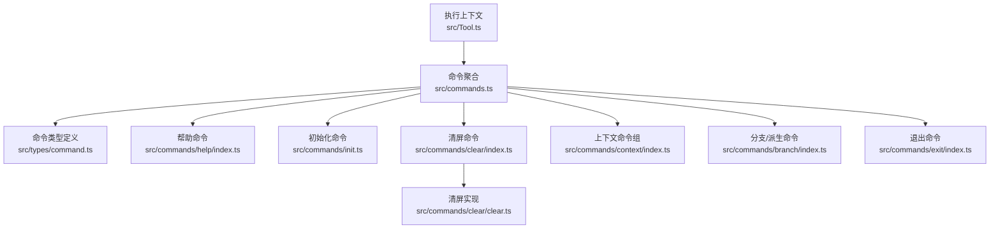
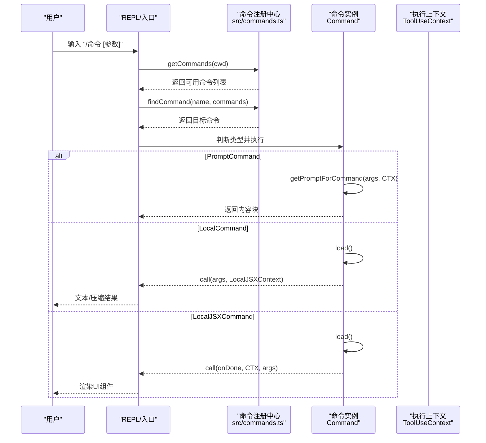
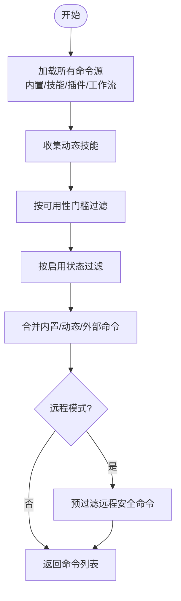
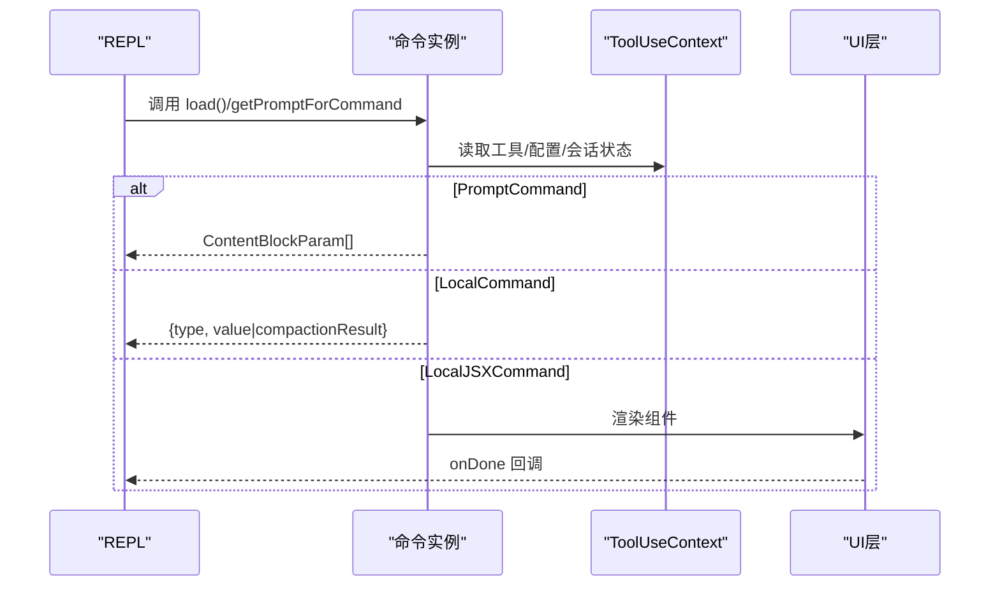
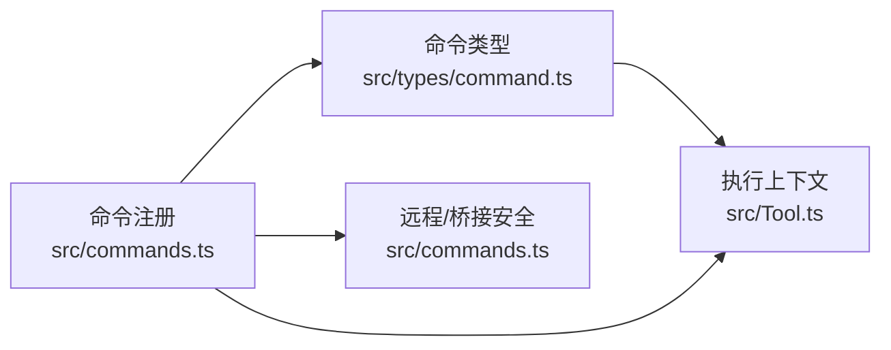

# 命令系统设计

<cite>
**本文引用的文件**
- [src/commands.ts](file://src/commands.ts)
- [src/types/command.ts](file://src/types/command.ts)
- [src/commands/help/index.ts](file://src/commands/help/index.ts)
- [src/commands/init.ts](file://src/commands/init.ts)
- [src/commands/clear/index.ts](file://src/commands/clear/index.ts)
- [src/commands/clear/clear.ts](file://src/commands/clear/clear.ts)
- [src/commands/context/index.ts](file://src/commands/context/index.ts)
- [src/commands/branch/index.ts](file://src/commands/branch/index.ts)
- [src/commands/exit/index.ts](file://src/commands/exit/index.ts)
- [src/Tool.ts](file://src/Tool.ts)
</cite>

## 目录
1. [引言](#引言)
2. [项目结构](#项目结构)
3. [核心组件](#核心组件)
4. [架构总览](#架构总览)
5. [详细组件分析](#详细组件分析)
6. [依赖关系分析](#依赖关系分析)
7. [性能考量](#性能考量)
8. [故障排查指南](#故障排查指南)
9. [结论](#结论)
10. [附录](#附录)

## 引言
本设计文档面向 Claude Code 的命令系统，系统性阐述命令定义规范、解析与执行机制、注册与扩展体系、参数与错误处理、别名与帮助系统，并提供开发指南、最佳实践与性能优化策略。读者可据此快速理解命令模型、实现高质量命令、在多来源（内置、技能、插件、工作流）中统一管理命令生命周期。

## 项目结构
命令系统由“命令定义 + 注册聚合 + 动态加载 + 执行上下文 + 过滤与安全”五部分组成：
- 命令定义：统一的 Command 类型与三类命令形态（prompt、local、local-jsx）
- 注册聚合：集中导出与按需加载，支持动态技能、插件、工作流
- 解析与执行：通过 getCommands 聚合、过滤可用命令；按类型调用 load 或 getPromptForCommand
- 上下文与权限：ToolUseContext 提供工具、MCP、会话状态等运行时能力
- 安全与远程：远程/桥接安全白名单、可用性门槛（订阅/控制台）

**图表来源**
- [src/commands.ts:256-517](file://src/commands.ts#L256-L517)
- [src/types/command.ts:16-217](file://src/types/command.ts#L16-L217)
- [src/commands/help/index.ts:1-11](file://src/commands/help/index.ts#L1-L11)
- [src/commands/init.ts:226-257](file://src/commands/init.ts#L226-L257)
- [src/commands/clear/index.ts:1-20](file://src/commands/clear/index.ts#L1-L20)
- [src/commands/clear/clear.ts:1-8](file://src/commands/clear/clear.ts#L1-L8)
- [src/commands/context/index.ts:1-25](file://src/commands/context/index.ts#L1-L25)
- [src/commands/branch/index.ts:1-15](file://src/commands/branch/index.ts#L1-L15)
- [src/commands/exit/index.ts:1-13](file://src/commands/exit/index.ts#L1-L13)
- [src/Tool.ts:158-200](file://src/Tool.ts#L158-L200)

**章节来源**
- [src/commands.ts:256-517](file://src/commands.ts#L256-L517)
- [src/types/command.ts:16-217](file://src/types/command.ts#L16-L217)

## 核心组件
- 命令类型与形态
  - PromptCommand：面向模型的提示型命令，支持内容长度估算、交互进度消息、上下文模式（内联/派生）、路径过滤、钩子注入等
  - LocalCommand：本地命令，延迟加载实现模块，返回文本或压缩结果
  - LocalJSXCommand：本地 JSX 命令，延迟加载 UI 组件，用于 REPL 界面交互
- 命令元数据
  - 基础字段：名称、别名、描述、版本、可用性门槛、是否隐藏、是否禁用模型调用、是否用户可触发、加载来源、是否敏感参数等
  - 可选增强：argumentHint、whenToUse、userFacingName、kind（如 workflow）、immediate、loadedFrom 等
- 命令聚合与过滤
  - 内置命令集合、条件特性命令、动态技能与插件命令、工作流命令统一聚合
  - 按可用性门槛（订阅/控制台）与启用状态过滤
  - 支持远程/桥接安全命令白名单

**章节来源**
- [src/types/command.ts:16-217](file://src/types/command.ts#L16-L217)
- [src/commands.ts:256-517](file://src/commands.ts#L256-L517)

## 架构总览
命令系统采用“声明式定义 + 集中式注册 + 按需懒加载 + 统一上下文”的架构。命令在构建期被导入并注册，运行期通过 getCommands 获取可用命令集，再根据命令类型选择执行路径。

**图表来源**
- [src/commands.ts:476-517](file://src/commands.ts#L476-L517)
- [src/types/command.ts:25-152](file://src/types/command.ts#L25-L152)
- [src/Tool.ts:158-200](file://src/Tool.ts#L158-L200)

## 详细组件分析

### 命令定义规范
- PromptCommand 关键点
  - progressMessage：用于 UI 展示执行进度
  - contentLength：用于估算 token，辅助预算控制
  - context/agent：fork 模式下可指定代理类型
  - paths：基于文件路径的可见性过滤
  - hooks/skillRoot：在派生上下文中注入钩子与资源根
  - disableNonInteractive：限制非交互式执行
- LocalCommand 关键点
  - supportsNonInteractive：是否允许非交互式执行
  - load：延迟加载实现模块，降低启动成本
  - 返回 LocalCommandResult：文本、压缩结果或跳过
- LocalJSXCommand 关键点
  - load：延迟加载 UI 组件
  - LocalJSXCommandContext：扩展 ToolUseContext，提供消息更新、主题、IDE 安装状态、恢复会话等能力

**章节来源**
- [src/types/command.ts:16-152](file://src/types/command.ts#L16-L152)

### 命令注册系统
- 内置命令集合
  - 通过集中导入与 memoize 缓存，避免重复构建
  - 条件特性命令（如 WORKFLOW_SCRIPTS、VOICE_MODE 等）按运行时特征动态引入
- 动态命令源
  - 技能目录命令、插件技能、内置插件技能、工作流命令统一聚合
  - 动态技能去重后插入到插件技能之后、内置命令之前
- 可用性与启用
  - meetsAvailabilityRequirement：按订阅/控制台门槛过滤
  - isCommandEnabled：按 isEnabled 回调过滤
- 远程/桥接安全
  - REMOTE_SAFE_COMMANDS：仅限远程模式可用的命令
  - BRIDGE_SAFE_COMMANDS：仅限桥接通道可用的本地命令
  - isBridgeSafeCommand：综合判断命令是否可通过移动端/网页端桥接执行

**图表来源**
- [src/commands.ts:449-517](file://src/commands.ts#L449-L517)
- [src/commands.ts:619-686](file://src/commands.ts#L619-L686)

**章节来源**
- [src/commands.ts:256-517](file://src/commands.ts#L256-L517)

### 参数解析与执行流程
- 参数解析
  - 命令实现通过 args 字符串接收参数；对于 PromptCommand，参数由 getPromptForCommand(args, context) 使用
  - 对于 LocalCommand/LocalJSXCommand，参数由调用方传入，建议在命令内部进行校验与转换
- 执行上下文
  - ToolUseContext 提供工具集、MCP 客户端、会话状态、最大预算、自定义系统提示等
  - LocalJSXCommandContext 扩展消息更新、主题切换、IDE 安装状态、恢复会话等能力
- 执行结果
  - PromptCommand 返回内容块，供模型消费
  - LocalCommand 返回文本或压缩结果，支持跳过消息
  - LocalJSXCommand 返回 React 组件，用于 REPL UI 交互

**图表来源**
- [src/types/command.ts:53-152](file://src/types/command.ts#L53-L152)
- [src/Tool.ts:158-200](file://src/Tool.ts#L158-L200)

**章节来源**
- [src/types/command.ts:53-152](file://src/types/command.ts#L53-L152)
- [src/Tool.ts:158-200](file://src/Tool.ts#L158-L200)

### 错误处理与调试
- 加载失败容错
  - 技能目录与插件加载失败会被捕获并记录日志，系统继续运行
- 命令不存在
  - getCommand 抛出带可用命令列表的错误，便于用户自助排错
- 调试与日志
  - 提供日志工具与调试开关，便于定位命令加载与执行问题

**章节来源**
- [src/commands.ts:358-398](file://src/commands.ts#L358-L398)
- [src/commands.ts:704-719](file://src/commands.ts#L704-L719)

### 命令扩展机制、别名与帮助系统
- 扩展机制
  - 技能目录命令、插件技能、内置插件技能、工作流命令均可作为扩展源
  - 动态技能去重后插入到合适位置，保证优先级与一致性
- 别名支持
  - 命令可配置 aliases 数组，findCommand 同时匹配名称、显示名称与别名
- 帮助系统
  - help 命令以 LocalJSX 形式提供交互式帮助界面
  - formatDescriptionWithSource 为用户界面格式化描述，标注来源（插件/内置/MCP/打包）

**章节来源**
- [src/commands.ts:688-754](file://src/commands.ts#L688-L754)
- [src/commands/help/index.ts:1-11](file://src/commands/help/index.ts#L1-L11)

### 典型命令实现示例
- 清屏命令（LocalCommand）
  - 定义：在 clear/index.ts 中声明名称、描述、别名与延迟加载
  - 实现：在 clear/clear.ts 中调用会话清理逻辑并返回空文本结果
- 初始化命令（PromptCommand）
  - 定义：在 init.ts 中声明为 prompt 型，动态选择新旧引导文案
  - 实现：getPromptForCommand 返回文本内容块，驱动模型生成 CLAUDE.md 与技能/钩子
- 分支/派生命令（LocalJSXCommand）
  - 定义：在 branch/index.ts 中声明别名（当未启用 fork 子代理时）
  - 实现：通过 load 加载 UI 组件，渲染分支操作界面
- 退出命令（LocalJSXCommand）
  - 定义：在 exit/index.ts 中声明 immediate=true，立即退出 REPL
  - 实现：通过 load 加载退出 UI 组件或直接触发退出逻辑

**章节来源**
- [src/commands/clear/index.ts:1-20](file://src/commands/clear/index.ts#L1-L20)
- [src/commands/clear/clear.ts:1-8](file://src/commands/clear/clear.ts#L1-L8)
- [src/commands/init.ts:226-257](file://src/commands/init.ts#L226-L257)
- [src/commands/branch/index.ts:1-15](file://src/commands/branch/index.ts#L1-L15)
- [src/commands/exit/index.ts:1-13](file://src/commands/exit/index.ts#L1-L13)

## 依赖关系分析
命令系统与工具层、状态层存在紧密耦合：
- 命令类型依赖 ToolUseContext 提供的工具、MCP、会话状态等
- 命令注册依赖全局状态（如非交互会话标志）与特性开关
- 远程/桥接安全依赖命令类型与白名单集合

**图表来源**
- [src/types/command.ts:16-217](file://src/types/command.ts#L16-L217)
- [src/commands.ts:476-686](file://src/commands.ts#L476-L686)
- [src/Tool.ts:158-200](file://src/Tool.ts#L158-L200)

**章节来源**
- [src/commands.ts:476-686](file://src/commands.ts#L476-L686)
- [src/Tool.ts:158-200](file://src/Tool.ts#L158-L200)

## 性能考量
- 懒加载与缓存
  - 延迟加载命令实现模块，减少启动时间
  - memoize 缓存命令聚合与技能索引，避免重复磁盘 I/O 与动态导入
- 并发加载
  - 技能目录、插件、工作流命令并发加载，缩短首帧时间
- 远程/桥接预过滤
  - 在渲染前预过滤远程安全命令，避免 UI 竞态与无效渲染
- 压缩与跳过
  - LocalCommand 支持压缩结果与跳过消息，降低传输与渲染开销

**章节来源**
- [src/commands.ts:449-469](file://src/commands.ts#L449-L469)
- [src/commands.ts:619-686](file://src/commands.ts#L619-L686)
- [src/types/command.ts:16-24](file://src/types/command.ts#L16-L24)

## 故障排查指南
- 命令未出现
  - 检查 availability 是否满足（订阅/控制台），以及 isEnabled 是否返回 true
  - 确认命令未被 isHidden 标记
- 命令不可用
  - 若为 prompt 命令，确认 disableModelInvocation 未被设置
  - 若为本地命令，确认 supportsNonInteractive 与 immediate 设置符合预期
- 执行异常
  - 查看日志输出，确认命令实现是否抛出异常
  - 对于 PromptCommand，检查 getPromptForCommand 是否正确返回内容块
- 远程/桥接不可用
  - 确认命令是否在 REMOTE_SAFE_COMMANDS 或 BRIDGE_SAFE_COMMANDS 白名单中
  - 检查命令类型是否为 local-jsx（不支持桥接）

**章节来源**
- [src/commands.ts:417-443](file://src/commands.ts#L417-L443)
- [src/commands.ts:672-676](file://src/commands.ts#L672-L676)
- [src/commands.ts:704-719](file://src/commands.ts#L704-L719)

## 结论
该命令系统以统一的类型模型与集中注册为核心，结合动态加载、远程安全与可用性门槛，实现了高扩展性与强健性。开发者可遵循本文档的规范与最佳实践，快速实现高质量命令，并在多来源环境中保持一致的用户体验。

## 附录

### 开发指南与最佳实践
- 命令基类设计
  - 明确 name、description、aliases、argumentHint、whenToUse 等元信息
  - 对外暴露 userFacingName 以支持插件前缀等场景
- 参数解析器
  - 在命令实现中对 args 进行显式校验与转换，必要时提供默认值与错误码
- 执行上下文管理
  - PromptCommand 使用 getPromptForCommand 从 ToolUseContext 读取工具与会话状态
  - LocalJSXCommand 通过 LocalJSXCommandContext 更新消息、主题与 IDE 状态
- 异步处理机制
  - 优先使用延迟加载与并发加载，避免阻塞主线程
  - 对耗时任务使用压缩结果或分段输出，提升响应性
- 安全与远程
  - 将需要远程/桥接使用的本地命令加入 BRIDGE_SAFE_COMMANDS
  - 对敏感参数设置 isSensitive，避免历史记录泄露

**章节来源**
- [src/types/command.ts:175-217](file://src/types/command.ts#L175-L217)
- [src/Tool.ts:158-200](file://src/Tool.ts#L158-L200)
- [src/commands.ts:619-676](file://src/commands.ts#L619-L676)