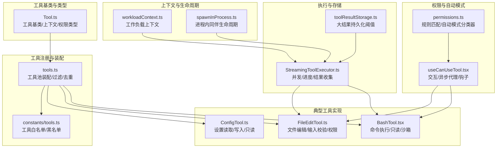
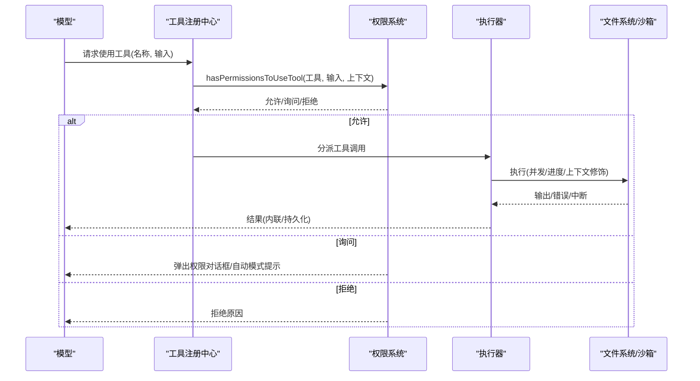
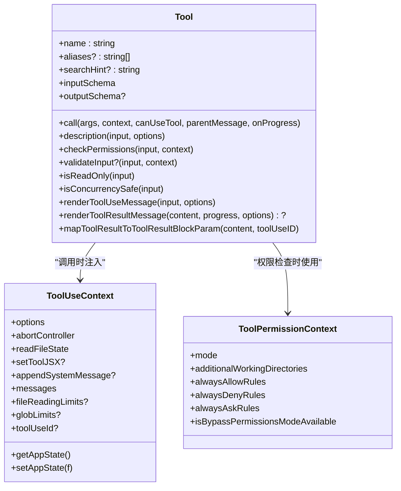
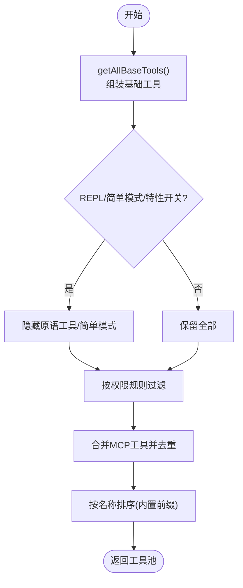
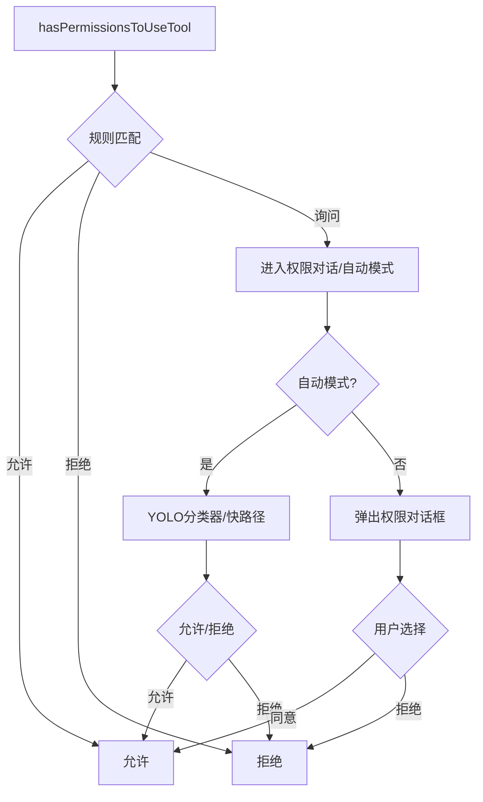
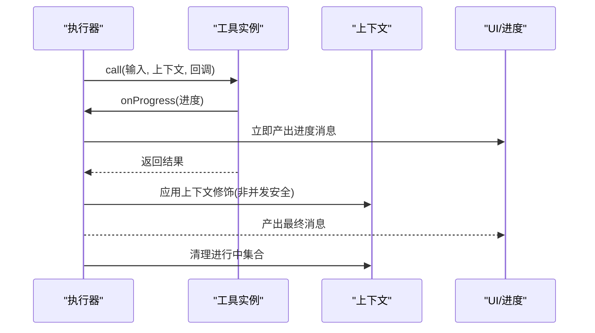
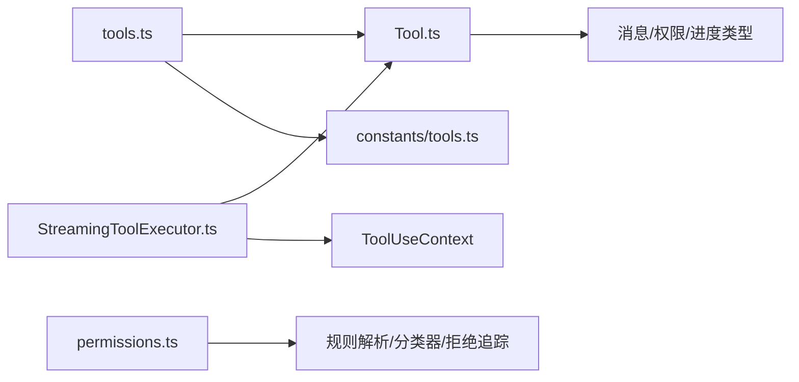

# 工具系统设计

<cite>
**本文引用的文件**
- [Tool.ts](file://src/Tool.ts)
- [tools.ts](file://src/tools.ts)
- [FileEditTool.ts](file://src/tools/FileEditTool/FileEditTool.ts)
- [BashTool.tsx](file://src/tools/BashTool/BashTool.tsx)
- [ConfigTool.ts](file://src/tools/ConfigTool/ConfigTool.ts)
- [permissions.ts](file://src/utils/permissions/permissions.ts)
- [useCanUseTool.tsx](file://src/hooks/useCanUseTool.tsx)
- [primitiveTools.ts](file://src/tools/REPLTool/primitiveTools.ts)
- [tools.ts（常量）](file://src/constants/tools.ts)
- [toolResultStorage.ts](file://src/utils/toolResultStorage.ts)
- [StreamingToolExecutor.ts](file://src/services/tools/StreamingToolExecutor.ts)
- [workloadContext.ts](file://src/utils/workloadContext.ts)
- [spawnInProcess.ts](file://src/utils/swarm/spawnInProcess.ts)
</cite>

## 目录
1. [简介](#简介)
2. [项目结构](#项目结构)
3. [核心组件](#核心组件)
4. [架构总览](#架构总览)
5. [详细组件分析](#详细组件分析)
6. [依赖关系分析](#依赖关系分析)
7. [性能考量](#性能考量)
8. [故障排查指南](#故障排查指南)
9. [结论](#结论)
10. [附录](#附录)

## 简介
本设计文档面向 Claude Code 的工具系统，系统性阐述 Tool 基类的设计理念、工具注册与装配机制、权限控制体系、执行生命周期与并发模型、扩展与配置管理、错误处理策略，并给出工具开发最佳实践、性能优化建议与安全注意事项。文档同时提供具体工具实现示例与集成指南，覆盖工具基类继承、权限校验、执行上下文管理与结果处理机制。

## 项目结构
工具系统围绕“工具基类 + 工具集合装配 + 权限控制 + 执行器”展开，核心文件包括：
- 工具基类与类型定义：src/Tool.ts
- 工具注册与装配：src/tools.ts
- 典型工具实现：src/tools/*/（如 BashTool、FileEditTool、ConfigTool）
- 权限控制与自动模式：src/utils/permissions/permissions.ts、src/hooks/useCanUseTool.tsx
- 结果持久化与阈值：src/utils/toolResultStorage.ts
- 并发与流式执行：src/services/tools/StreamingToolExecutor.ts
- 上下文与生命周期：src/utils/workloadContext.ts、src/utils/swarm/spawnInProcess.ts

**图表来源**
- [Tool.ts:362-695](file://src/Tool.ts#L362-L695)
- [tools.ts:191-387](file://src/tools.ts#L191-L387)
- [permissions.ts:473-800](file://src/utils/permissions/permissions.ts#L473-L800)
- [useCanUseTool.tsx:28-191](file://src/hooks/useCanUseTool.tsx#L28-L191)
- [StreamingToolExecutor.ts:388-530](file://src/services/tools/StreamingToolExecutor.ts#L388-L530)
- [toolResultStorage.ts:55-78](file://src/utils/toolResultStorage.ts#L55-L78)
- [workloadContext.ts:1-34](file://src/utils/workloadContext.ts#L1-L34)
- [spawnInProcess.ts:218-265](file://src/utils/swarm/spawnInProcess.ts#L218-L265)

**章节来源**
- [Tool.ts:1-793](file://src/Tool.ts#L1-L793)
- [tools.ts:1-388](file://src/tools.ts#L1-L388)
- [tools.ts（常量）:1-111](file://src/constants/tools.ts#L1-L111)

## 核心组件
- 工具基类与类型系统
  - 工具接口 Tool 定义了调用签名、输入输出模式、权限检查、UI 渲染、摘要与活动描述等契约；通过 buildTool 提供默认实现，确保一致性与可维护性。
  - 工具上下文 ToolUseContext 持有执行所需的命令集、AbortController、文件状态缓存、应用状态访问器、通知与消息注入等能力。
  - 权限上下文 ToolPermissionContext 封装权限模式、规则来源、附加工作目录、是否允许旁路等，贯穿工具生命周期。
- 工具注册与装配
  - getAllBaseTools 构建基础工具集合，结合特性开关与环境变量进行条件加载。
  - getTools 过滤内置工具，支持简单模式、REPL 模式隐藏原语、按权限规则屏蔽工具。
  - assembleToolPool 合并内置与 MCP 工具，保持提示缓存稳定性与去重。
- 权限控制与自动模式
  - hasPermissionsToUseTool 统一入口，结合规则匹配、自动模式分类器、钩子与拒绝追踪，决定允许、询问或拒绝。
  - useCanUseTool 钩子负责在交互/异步/协调者场景中展示权限对话框或自动决策。
- 执行器与并发
  - StreamingToolExecutor 支持并发工具执行、进度消息即时产出、上下文修饰与完成标记清理。
- 结果持久化与阈值
  - toolResultStorage 提供按工具覆盖的持久化阈值解析逻辑，避免超大结果直接回传模型。

**章节来源**
- [Tool.ts:158-300](file://src/Tool.ts#L158-L300)
- [Tool.ts:362-695](file://src/Tool.ts#L362-L695)
- [tools.ts:191-387](file://src/tools.ts#L191-L387)
- [permissions.ts:473-800](file://src/utils/permissions/permissions.ts#L473-L800)
- [useCanUseTool.tsx:28-191](file://src/hooks/useCanUseTool.tsx#L28-L191)
- [StreamingToolExecutor.ts:388-530](file://src/services/tools/StreamingToolExecutor.ts#L388-L530)
- [toolResultStorage.ts:55-78](file://src/utils/toolResultStorage.ts#L55-L78)

## 架构总览
工具系统采用“声明式工具 + 动态装配 + 权限驱动 + 流式执行”的架构。工具通过 buildTool 统一注册，运行时由 getTools/assembleToolPool 装配到当前会话可用集合；权限检查在工具调用前统一拦截，自动模式下由分类器替代人工确认；执行阶段由 StreamingToolExecutor 管理并发与进度，结果按阈值策略持久化或内联返回。

**图表来源**
- [tools.ts:269-325](file://src/tools.ts#L269-L325)
- [permissions.ts:473-800](file://src/utils/permissions/permissions.ts#L473-L800)
- [useCanUseTool.tsx:32-191](file://src/hooks/useCanUseTool.tsx#L32-L191)
- [StreamingToolExecutor.ts:388-530](file://src/services/tools/StreamingToolExecutor.ts#L388-L530)

## 详细组件分析

### 工具基类与类型系统
- 设计理念
  - 明确的职责分离：工具仅关注“做什么”，权限系统关注“是否允许”，执行器关注“如何执行”。
  - 可选方法与默认实现：通过 buildTool 注入默认行为，降低工具实现成本，保证一致性。
  - 类型安全：输入/输出均以 Zod 模式约束，确保模型与工具之间的契约清晰。
- 关键类型与方法
  - Tool 接口：call/description/inputSchema/outputSchema/isReadOnly/isConcurrencySafe/checkPermissions 等。
  - ToolUseContext：持有 AbortController、文件状态缓存、应用状态访问器、通知与消息注入等。
  - ToolPermissionContext：集中管理权限模式与规则来源。
- 生命周期钩子
  - backfillObservableInput：在观察侧可见前对输入进行补全。
  - validateInput：在权限检查前进行输入合法性校验。
  - renderToolUseMessage/renderToolResultMessage：渲染工具使用与结果消息。
  - mapToolResultToToolResultBlockParam：将工具输出映射为模型可消费的块参数。

**图表来源**
- [Tool.ts:362-695](file://src/Tool.ts#L362-L695)
- [Tool.ts:158-300](file://src/Tool.ts#L158-L300)
- [Tool.ts:123-148](file://src/Tool.ts#L123-L148)

**章节来源**
- [Tool.ts:362-695](file://src/Tool.ts#L362-L695)
- [Tool.ts:123-148](file://src/Tool.ts#L123-L148)

### 工具注册与装配机制
- 工具集合装配
  - getAllBaseTools：根据特性开关与环境变量组装基础工具列表，包含内置工具与条件加载的工具。
  - getTools：在权限上下文过滤后，再根据 REPL 模式隐藏原语工具，最终返回会话可用工具集。
  - assembleToolPool：合并内置与 MCP 工具，按名称排序并去重，内置工具保持连续前缀以稳定提示缓存。
- 工具过滤
  - filterToolsByDenyRules：基于权限规则对工具进行全局屏蔽。
  - 工具预设与启用判断：parseToolPreset/getToolsForDefaultPreset 用于命令行工具选择。
- 工具扩展点
  - REPL 模式下的原语工具集合：getReplPrimitiveTools 用于虚拟消息分类与渲染。

**图表来源**
- [tools.ts:191-387](file://src/tools.ts#L191-L387)
- [tools.ts:269-325](file://src/tools.ts#L269-L325)
- [primitiveTools.ts:28-39](file://src/tools/REPLTool/primitiveTools.ts#L28-L39)

**章节来源**
- [tools.ts:191-387](file://src/tools.ts#L191-L387)
- [primitiveTools.ts:28-39](file://src/tools/REPLTool/primitiveTools.ts#L28-L39)

### 权限控制系统
- 规则匹配与决策
  - 规则来源：设置源、CLI 参数、命令、会话等多源聚合。
  - 匹配策略：支持工具级、服务器级、内容级（前缀/通配符）规则；MCP 工具名规范化匹配。
  - 决策链：允许/询问/拒绝；自动模式下分类器介入；拒绝追踪与旁路模式。
- 自动模式与分类器
  - acceptEdits 快速路径：在可接受编辑模式下快速放行安全操作。
  - 安全工具白名单：跳过昂贵分类器调用。
  - 分类器阶段统计与成本估算：记录阶段用量、耗时与成本，便于开销分析。
- 钩子与异步代理
  - PermissionRequest 钩子：为无 UI 的异步代理提供自动决策机会。
  - 协调者/群组工作者：在等待自动化检查后再弹窗，提升体验。

**图表来源**
- [permissions.ts:473-800](file://src/utils/permissions/permissions.ts#L473-L800)
- [useCanUseTool.tsx:32-191](file://src/hooks/useCanUseTool.tsx#L32-L191)

**章节来源**
- [permissions.ts:122-390](file://src/utils/permissions/permissions.ts#L122-L390)
- [permissions.ts:473-800](file://src/utils/permissions/permissions.ts#L473-L800)
- [useCanUseTool.tsx:28-191](file://src/hooks/useCanUseTool.tsx#L28-L191)

### 执行流程与并发模型
- 并发与上下文修饰
  - StreamingToolExecutor 支持并发工具执行，非并发安全工具可通过 contextModifier 对上下文进行修饰。
  - 已完成结果按序产出，进度消息优先于结果，保证 UI 实时反馈。
- 中断与清理
  - markToolUseAsComplete 清理进行中的工具使用集合，避免悬挂状态。
- 进程内同伴与生命周期
  - killInProcessTeammate 通过 AbortController 终止执行并清理资源，确保任务状态一致。

**图表来源**
- [StreamingToolExecutor.ts:388-530](file://src/services/tools/StreamingToolExecutor.ts#L388-L530)
- [spawnInProcess.ts:218-265](file://src/utils/swarm/spawnInProcess.ts#L218-L265)

**章节来源**
- [StreamingToolExecutor.ts:388-530](file://src/services/tools/StreamingToolExecutor.ts#L388-L530)
- [spawnInProcess.ts:218-265](file://src/utils/swarm/spawnInProcess.ts#L218-L265)

### 工具接口规范与扩展机制
- 接口规范
  - 输入/输出模式：严格 Zod schema；可选 JSON Schema 输入（MCP 工具）。
  - 只读/并发安全：isReadOnly/isConcurrencySafe 用于 UI 与自动模式判定。
  - 权限扩展：checkPermissions 支持工具特定规则；preparePermissionMatcher 支持复杂匹配。
  - UI 扩展：renderToolUseMessage/renderToolResultMessage/renderToolUseProgressMessage 等。
- 扩展机制
  - MCP 工具：通过 assembleToolPool 合并内置与 MCP 工具，保持提示缓存稳定。
  - 工具预设：--tools flag 使用预设装配工具集。
  - REPL 模式：隐藏原语工具，但可在 VM 内部使用。

**章节来源**
- [Tool.ts:394-695](file://src/Tool.ts#L394-L695)
- [tools.ts:343-387](file://src/tools.ts#L343-L387)

### 配置管理与结果处理
- 配置管理
  - ConfigTool：支持读取/设置配置项，读取为只读，设置需权限确认。
  - 设置来源：多源聚合，支持 CLI/命令/会话等来源。
- 结果处理
  - 大结果持久化：超过阈值自动落盘，模型通过 FileRead 读取；阈值可被工具覆盖。
  - 结果映射：mapToolResultToToolResultBlockParam 将输出映射为模型块参数，支持结构化内容与图像。

**章节来源**
- [ConfigTool.ts:67-114](file://src/tools/ConfigTool/ConfigTool.ts#L67-L114)
- [toolResultStorage.ts:55-78](file://src/utils/toolResultStorage.ts#L55-L78)
- [BashTool.tsx:555-623](file://src/tools/BashTool/BashTool.tsx#L555-L623)

### 错误处理策略
- 输入校验
  - FileEditTool：路径存在性、大小限制、内容一致性、设置文件合法性等。
  - BashTool：阻塞 sleep 检测、只读约束、沙箱失败标注。
- 权限拒绝
  - 权限系统提供明确拒绝原因与来源，自动模式下记录拒绝统计。
- 执行错误
  - ShellError/中断信号处理；输出截断与预览生成；图像输出压缩与尺寸限制。

**章节来源**
- [FileEditTool.ts:137-362](file://src/tools/FileEditTool/FileEditTool.ts#L137-L362)
- [BashTool.tsx:524-538](file://src/tools/BashTool/BashTool.tsx#L524-L538)
- [permissions.ts:473-800](file://src/utils/permissions/permissions.ts#L473-L800)

### 工具开发最佳实践
- 继承与默认实现
  - 使用 buildTool 创建工具，尽量复用默认实现（如 checkPermissions、userFacingName），减少样板代码。
- 输入与输出
  - 严格定义 inputSchema/outputSchema；必要时提供 inputJSONSchema（MCP）。
- 权限与安全
  - 在 validateInput 中做最小可行校验；在 checkPermissions 中实现工具特定规则；对破坏性操作（删除/覆盖/发送）标记 isDestructive。
- UI 与可观察性
  - 提供 getToolUseSummary/getActivityDescription，增强 UI 呈现与转录搜索。
  - 实现 extractSearchText/renderToolResultMessage，确保转录可检索与结果可读。
- 并发与中断
  - 正确实现 isConcurrencySafe；非并发安全工具通过 contextModifier 修饰上下文。
  - 实现 interruptBehavior 控制中断策略（取消/阻塞）。
- 性能与结果
  - 合理设置 maxResultSizeChars；对可能超大的输出使用持久化策略。
  - 对只读/搜索/列表命令实现 isSearchOrReadCommand，支持 UI 折叠显示。

**章节来源**
- [Tool.ts:747-792](file://src/Tool.ts#L747-L792)
- [FileEditTool.ts:86-136](file://src/tools/FileEditTool/FileEditTool.ts#L86-L136)
- [BashTool.tsx:420-541](file://src/tools/BashTool/BashTool.tsx#L420-L541)

## 依赖关系分析
- 工具基类依赖
  - Tool.ts 依赖消息类型、权限类型、进度类型、文件状态缓存、系统提示类型等，形成强契约。
- 工具装配依赖
  - tools.ts 依赖各工具模块与特性开关，动态组装工具池。
- 权限系统依赖
  - permissions.ts 依赖规则解析、分类器、拒绝追踪、钩子与自动模式状态。
- 执行器依赖
  - StreamingToolExecutor 依赖工具上下文、进度消息与结果收集。

**图表来源**
- [Tool.ts:1-120](file://src/Tool.ts#L1-L120)
- [tools.ts:1-100](file://src/tools.ts#L1-L100)
- [permissions.ts:1-120](file://src/utils/permissions/permissions.ts#L1-L120)
- [StreamingToolExecutor.ts:388-530](file://src/services/tools/StreamingToolExecutor.ts#L388-L530)

**章节来源**
- [Tool.ts:1-120](file://src/Tool.ts#L1-L120)
- [tools.ts:1-100](file://src/tools.ts#L1-L100)
- [permissions.ts:1-120](file://src/utils/permissions/permissions.ts#L1-L120)
- [StreamingToolExecutor.ts:388-530](file://src/services/tools/StreamingToolExecutor.ts#L388-L530)

## 性能考量
- 工具装配稳定性
  - assembleToolPool 保持内置工具前缀连续，避免提示缓存失效导致的重复计算。
- 自动模式优化
  - acceptEdits 快速路径与安全工具白名单减少分类器调用；拒绝追踪与旁路模式降低交互成本。
- 结果持久化
  - toolResultStorage 提供阈值覆盖与默认上限，避免超大结果直接回传模型。
- 并发执行
  - StreamingToolExecutor 支持并发与进度优先产出，提升响应速度。

**章节来源**
- [tools.ts:343-365](file://src/tools.ts#L343-L365)
- [permissions.ts:600-800](file://src/utils/permissions/permissions.ts#L600-L800)
- [toolResultStorage.ts:55-78](file://src/utils/toolResultStorage.ts#L55-L78)
- [StreamingToolExecutor.ts:388-530](file://src/services/tools/StreamingToolExecutor.ts#L388-L530)

## 故障排查指南
- 权限相关
  - 检查权限规则来源与匹配：allow/deny/ask 规则是否正确；MCP 工具名规范化是否一致。
  - 自动模式拒绝：查看分类器阶段与成本统计，定位高开销路径。
- 工具执行
  - 输入校验失败：核对 validateInput 的错误码与消息；必要时在 backfillObservableInput 补全输入。
  - 中断与清理：确认 markToolUseAsComplete 是否被调用，避免悬挂状态。
- 结果异常
  - 大结果未持久化：检查工具 maxResultSizeChars 与阈值覆盖；确认持久化目录存在且可写。
  - 图像输出异常：确认 resize 与压缩逻辑是否生效。

**章节来源**
- [permissions.ts:122-390](file://src/utils/permissions/permissions.ts#L122-L390)
- [FileEditTool.ts:137-362](file://src/tools/FileEditTool/FileEditTool.ts#L137-L362)
- [StreamingToolExecutor.ts:521-530](file://src/services/tools/StreamingToolExecutor.ts#L521-L530)
- [toolResultStorage.ts:55-78](file://src/utils/toolResultStorage.ts#L55-L78)

## 结论
Claude Code 工具系统以 Tool 基类为核心，通过严格的类型契约、统一的权限控制与自动模式、灵活的装配机制与并发执行器，实现了可扩展、可观测、可审计的工具生态。开发者遵循接口规范与最佳实践，即可快速构建安全、高效、易用的工具，并在复杂场景中获得一致的用户体验。

## 附录
- 工具实现示例
  - BashTool：命令执行、只读约束、沙箱失败标注、背景任务与输出持久化。
  - FileEditTool：路径校验、大小限制、内容一致性、设置文件合法性、VSCode 通知与历史记录。
  - ConfigTool：设置读取/写入、只读策略、权限确认。
- 集成指南
  - 工具注册：在 getAllBaseTools 或 assembleToolPool 中加入新工具。
  - 权限扩展：在工具的 checkPermissions 中实现规则匹配；必要时提供 preparePermissionMatcher。
  - 执行上下文：在 call 中使用 ToolUseContext 访问文件状态缓存、应用状态与消息注入。
  - 结果处理：合理设置 maxResultSizeChars，必要时使用持久化策略与映射函数。

**章节来源**
- [BashTool.tsx:420-800](file://src/tools/BashTool/BashTool.tsx#L420-L800)
- [FileEditTool.ts:86-595](file://src/tools/FileEditTool/FileEditTool.ts#L86-L595)
- [ConfigTool.ts:67-114](file://src/tools/ConfigTool/ConfigTool.ts#L67-L114)
- [tools.ts:191-387](file://src/tools.ts#L191-L387)