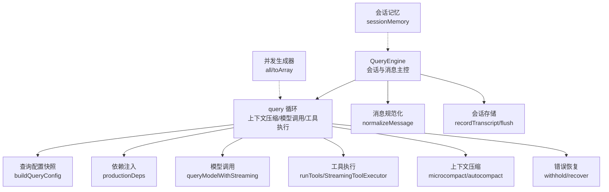
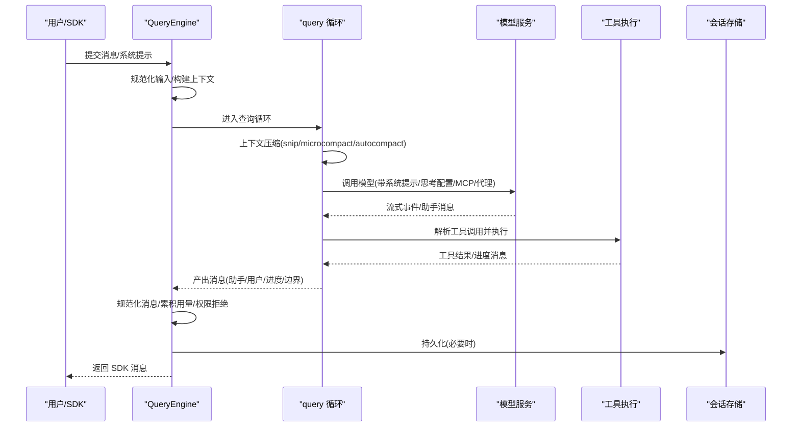
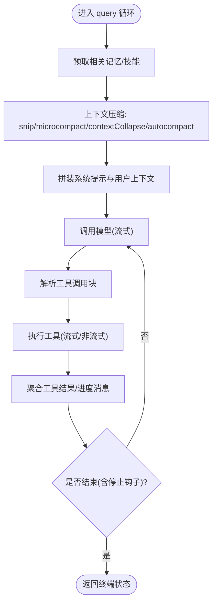
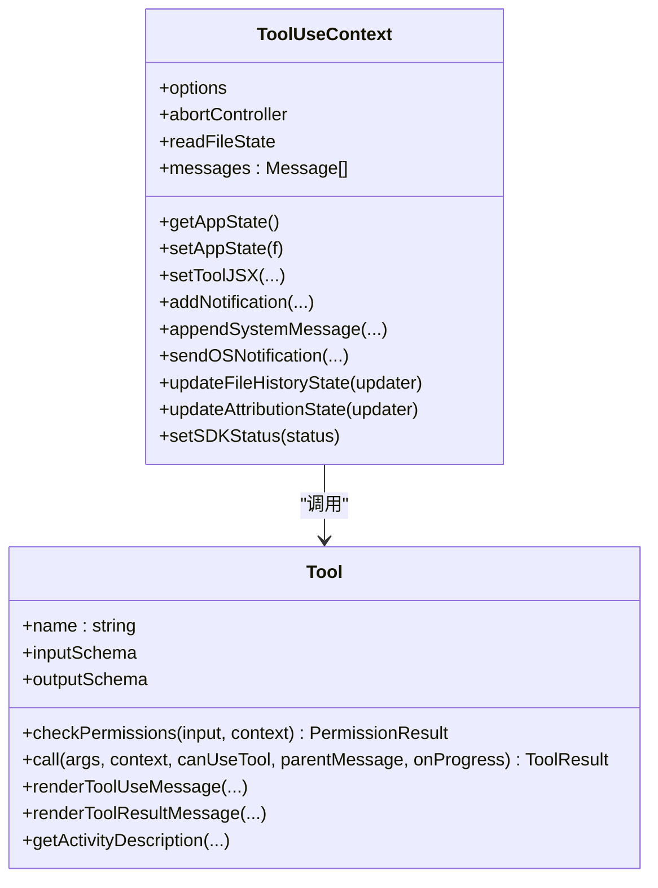
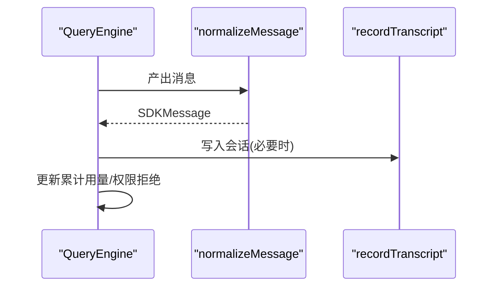
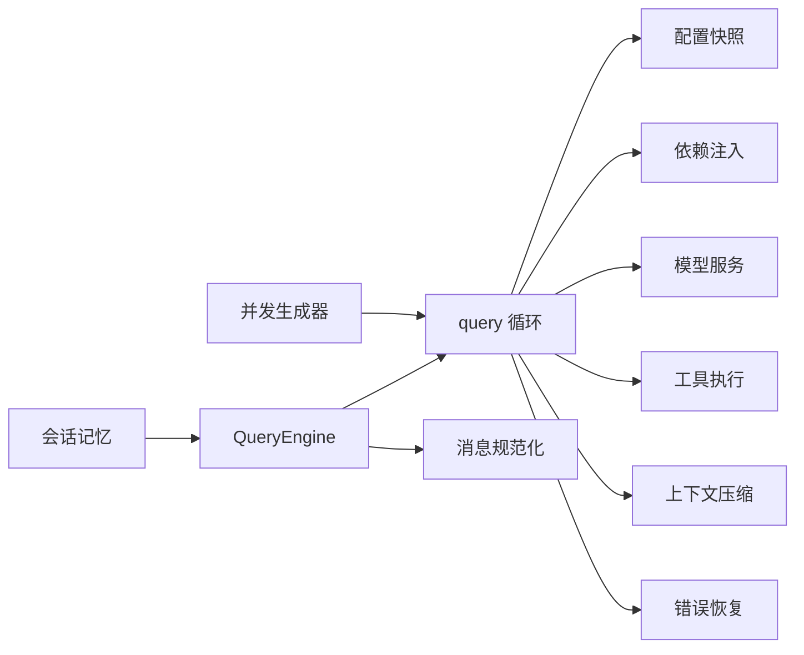

# 查询引擎设计

<cite>
**本文引用的文件**
- [QueryEngine.ts](file://src/QueryEngine.ts)
- [query.ts](file://src/query.ts)
- [Tool.ts](file://src/Tool.ts)
- [query/config.ts](file://src/query/config.ts)
- [query/deps.ts](file://src/query/deps.ts)
- [utils/queryHelpers.ts](file://src/utils/queryHelpers.ts)
- [utils/stream.ts](file://src/utils/stream.ts)
- [services/api/claude.ts](file://src/services/api/claude.ts)
- [services/SessionMemory/sessionMemory.ts](file://src/services/SessionMemory/sessionMemory.ts)
- [services/SessionMemory/sessionMemoryUtils.ts](file://src/services/SessionMemory/sessionMemoryUtils.ts)
- [utils/generators.ts](file://src/utils/generators.ts)
- [utils/messages.ts](file://src/utils/messages.ts)
- [docs/agent/coordinator-and-swarm.mdx](file://docs/agent/coordinator-and-swarm.mdx)
</cite>

## 目录
1. [引言](#引言)
2. [项目结构](#项目结构)
3. [核心组件](#核心组件)
4. [架构总览](#架构总览)
5. [详细组件分析](#详细组件分析)
6. [依赖关系分析](#依赖关系分析)
7. [性能考量](#性能考量)
8. [故障排查指南](#故障排查指南)
9. [结论](#结论)
10. [附录](#附录)

## 引言
本设计文档面向 Claude Code 查询引擎（QueryEngine），系统阐述其核心架构、消息处理流程、会话管理机制、查询解析算法、工具调用协调与结果聚合策略，并深入解释与状态管理系统（AppState）的集成方式、性能优化技术与错误恢复机制。文档同时提供异步生成器模式的使用范式、消息规范化处理、权限控制系统集成以及内存管理策略的实践建议与扩展指引。

## 项目结构
查询引擎位于 src 目录下，围绕 QueryEngine 类展开，配合 query 循环、工具抽象、消息规范化与状态管理等模块协同工作。关键模块职责如下：
- QueryEngine：会话生命周期与消息流的主控者，负责提交用户输入、驱动 query 循环、规范化输出、持久化与统计。
- query.ts：查询循环与上下文压缩（微/自适应压缩）、模型调用、工具执行与结果聚合。
- Tool.ts：工具抽象与权限接口定义，统一工具行为与输入/输出规范。
- query/config.ts 与 query/deps.ts：查询配置快照与 I/O 依赖注入，便于测试与特性开关。
- utils/queryHelpers.ts：消息规范化、孤儿权限处理、文件缓存提取等辅助逻辑。
- utils/stream.ts：通用异步流封装，支持队列、完成与错误传播。
- services/api/claude.ts：模型调用与流式事件处理，含回退与恢复路径。
- services/SessionMemory：会话记忆的加载、配置与等待逻辑。
- utils/generators.ts：并发生成器调度工具，支持限流并发与值收集。
- utils/messages.ts：消息序列化、系统提醒包装等消息层面的处理。
- docs/agent/coordinator-and-swarm.mdx：Coordinator 模式与编排能力说明，用于理解高级会话场景。



图示来源
- [QueryEngine.ts](file://src/QueryEngine.ts)
- [query.ts](file://src/query.ts)
- [query/config.ts](file://src/query/config.ts)
- [query/deps.ts](file://src/query/deps.ts)
- [utils/queryHelpers.ts](file://src/utils/queryHelpers.ts)
- [utils/stream.ts](file://src/utils/stream.ts)
- [services/api/claude.ts](file://src/services/api/claude.ts)
- [services/SessionMemory/sessionMemory.ts](file://src/services/SessionMemory/sessionMemory.ts)
- [utils/generators.ts](file://src/utils/generators.ts)

章节来源
- [QueryEngine.ts](file://src/QueryEngine.ts)
- [query.ts](file://src/query.ts)
- [query/config.ts](file://src/query/config.ts)
- [query/deps.ts](file://src/query/deps.ts)

## 核心组件
- QueryEngine
  - 会话级状态：消息数组、权限拒绝记录、累计用量、文件读取缓存、技能发现集合等。
  - 生命周期：submitMessage 提交用户输入，返回异步生成器，逐条产出 SDK 消息；内部驱动 query 循环，处理孤儿权限、系统提示、插件与技能加载、历史快照与压缩边界等。
  - 权限追踪：包装 canUseTool，记录拒绝原因以便 SDK 报告。
  - 状态集成：通过 getAppState/setAppState 与全局状态联动，更新文件历史、归属信息等。
- query 循环
  - 配置快照：buildQueryConfig 快照非特性门控的运行时参数，避免测试中的模块图污染。
  - 依赖注入：productionDeps 将模型调用、微压缩、自适应压缩与 UUID 生成解耦，便于测试替身。
  - 上下文压缩：按序执行 snip、microcompact、contextCollapse、autocompact，产出压缩后的消息视图。
  - 模型调用：prependUserContext + 系统提示拼接，支持思考配置、代理与 MCP 工具、任务预算等。
  - 工具执行：StreamingToolExecutor 支持流式工具执行；工具结果聚合后进入下一轮迭代或终止。
  - 错误恢复：对“提示过长”“输出令牌限制”等可恢复错误进行暂存与恢复，避免提前暴露给 SDK。
- 工具抽象
  - Tool 定义统一的工具接口：名称、输入/输出模式、权限检查、并发安全、只读/破坏性标记、进度渲染、摘要渲染、输入回填等。
  - 工具上下文 ToolUseContext：承载命令、思考配置、MCP 客户端、代理定义、文件历史/归属更新回调、SDK 状态回调等。
- 消息规范化与会话存储
  - normalizeMessage：将内部消息转换为 SDK 友好的格式，过滤空内容，处理进度消息与工具结果。
  - recordTranscript/flush：按需持久化会话，支持裸模式下的异步落盘与紧急刷新。
- 性能与内存
  - 流式与并发：Stream 与 all 并发调度，减少阻塞；applyToolResultBudget 控制工具结果体积。
  - 特性门控：feature('...') 保证死代码消除与外部构建排除，降低运行时开销。
  - 缓存与快照：文件状态缓存、会话记忆加载、历史快照等，平衡准确性与内存占用。

章节来源
- [QueryEngine.ts](file://src/QueryEngine.ts)
- [query.ts](file://src/query.ts)
- [Tool.ts](file://src/Tool.ts)
- [utils/queryHelpers.ts](file://src/utils/queryHelpers.ts)
- [utils/stream.ts](file://src/utils/stream.ts)
- [utils/generators.ts](file://src/utils/generators.ts)

## 架构总览
查询引擎采用“会话主控 + 查询循环 + 工具编排”的分层架构。QueryEngine 作为入口，负责消息规范化、会话持久化与状态更新；query 循环负责上下文压缩、模型调用与工具执行；Tool 抽象与 ToolUseContext 统一工具行为与上下文；消息规范化与会话存储贯穿整个生命周期。



图示来源
- [QueryEngine.ts](file://src/QueryEngine.ts)
- [query.ts](file://src/query.ts)
- [services/api/claude.ts](file://src/services/api/claude.ts)
- [utils/queryHelpers.ts](file://src/utils/queryHelpers.ts)

## 详细组件分析

### QueryEngine：会话主控与消息流
- 异步生成器模式：submitMessage 返回 AsyncGenerator<SDKMessage>，边生成边消费，降低延迟与内存峰值。
- 消息规范化：normalizeMessage 将内部消息映射为 SDK 友好格式，过滤空内容，处理进度与工具结果。
- 会话持久化：recordTranscript 按需写入，支持裸模式 fire-and-forget；必要时 flushSessionStorage 紧急刷新。
- 权限追踪：包装 canUseTool，记录拒绝原因，最终汇总为 SDK 报告字段。
- 系统提示与上下文：fetchSystemPromptParts 动态拼装默认/自定义/记忆机制提示；getCoordinatorUserContext 注入编排上下文。
- 插件与技能：loadAllPluginsCacheOnly 与 getSlashCommandToolSkills 并行加载，避免网络阻塞。
- 历史压缩边界：snipReplay 注入时，按边界消息触发截断与重放，保持长会话内存可控。

```mermaid
classDiagram
class QueryEngine {
-config : QueryEngineConfig
-mutableMessages : Message[]
-abortController : AbortController
-permissionDenials : SDKPermissionDenial[]
-totalUsage : NonNullableUsage
-readFileState : FileStateCache
+submitMessage(prompt, options) AsyncGenerator
}
class QueryEngineConfig {
+cwd : string
+tools : Tools
+mcpClients : MCPServerConnection[]
+canUseTool : CanUseToolFn
+getAppState() : AppState
+setAppState(f) : void
+initialMessages? : Message[]
+readFileCache : FileStateCache
+customSystemPrompt? : string
+appendSystemPrompt? : string
+userSpecifiedModel? : string
+fallbackModel? : string
+thinkingConfig? : ThinkingConfig
+maxTurns? : number
+maxBudgetUsd? : number
+taskBudget? : { total : number }
+jsonSchema? : Record
+verbose? : boolean
+replayUserMessages? : boolean
+includePartialMessages? : boolean
+handleElicitation? : ToolUseContext["handleElicitation"]
+setSDKStatus? : (status) => void
+abortController? : AbortController
+orphanedPermission? : OrphanedPermission
+snipReplay? : (msg, store) => { messages, executed }|undefined
}
QueryEngine --> QueryEngineConfig : "持有"
```

图示来源
- [QueryEngine.ts](file://src/QueryEngine.ts)

章节来源
- [QueryEngine.ts](file://src/QueryEngine.ts)

### query 循环：上下文压缩、模型调用与工具协调
- 配置快照：buildQueryConfig 快照 sessionId 与运行时门控，避免特性门控参与快照。
- 依赖注入：productionDeps 将模型调用、微压缩、自适应压缩与 UUID 生成注入，便于测试替身。
- 上下文压缩：按序执行 snip、microcompact、contextCollapse、autocompact，产出压缩后的消息视图；支持任务预算与缓存编辑。
- 模型调用：prependUserContext + 系统提示拼接，支持思考配置、代理与 MCP 工具、任务预算等；流式事件中处理“流式回退”与“孤儿消息墓碑”。
- 工具执行：StreamingToolExecutor 支持流式工具执行；工具结果聚合后进入下一轮迭代或终止。
- 错误恢复：对“提示过长”“输出令牌限制”等可恢复错误进行暂存与恢复，避免提前暴露给 SDK。



图示来源
- [query.ts](file://src/query.ts)
- [query/config.ts](file://src/query/config.ts)
- [query/deps.ts](file://src/query/deps.ts)

章节来源
- [query.ts](file://src/query.ts)
- [query/config.ts](file://src/query/config.ts)
- [query/deps.ts](file://src/query/deps.ts)

### 工具抽象与权限控制
- Tool 接口：统一工具的名称、输入/输出模式、权限检查、并发安全、只读/破坏性标记、进度渲染、摘要渲染、输入回填等。
- ToolUseContext：承载命令、思考配置、MCP 客户端、代理定义、文件历史/归属更新回调、SDK 状态回调等。
- 权限追踪：QueryEngine 包装 canUseTool，记录拒绝原因，最终汇总为 SDK 报告字段。
- 孤儿权限处理：handleOrphanedPermission 在会话恢复或外部授权后，重新注入工具调用并执行，确保对话连续性。



图示来源
- [Tool.ts](file://src/Tool.ts)
- [utils/queryHelpers.ts](file://src/utils/queryHelpers.ts)

章节来源
- [Tool.ts](file://src/Tool.ts)
- [utils/queryHelpers.ts](file://src/utils/queryHelpers.ts)

### 消息规范化与会话存储
- normalizeMessage：将内部消息转换为 SDK 友好的格式，过滤空内容，处理进度消息与工具结果；支持父工具 use id 关联。
- recordTranscript/flush：按需持久化会话，支持裸模式下的异步落盘与紧急刷新；在压缩边界前优先写入，保证恢复一致性。
- 会话记忆：waitForSessionMemoryExtraction 等待提取完成；getSessionMemoryContent 读取会话记忆内容，避免阻塞初始化。



图示来源
- [utils/queryHelpers.ts](file://src/utils/queryHelpers.ts)
- [services/SessionMemory/sessionMemoryUtils.ts](file://src/services/SessionMemory/sessionMemoryUtils.ts)

章节来源
- [utils/queryHelpers.ts](file://src/utils/queryHelpers.ts)
- [services/SessionMemory/sessionMemoryUtils.ts](file://src/services/SessionMemory/sessionMemoryUtils.ts)

### 异步生成器模式与并发调度
- Stream：通用异步流封装，支持队列、完成与错误传播，避免重复迭代。
- all：并发生成器调度工具，支持限流并发与值收集，适用于并行工具执行或预取任务。
- toArray/fromArray：将生成器转数组或从数组生成，便于批处理与调试。

章节来源
- [utils/stream.ts](file://src/utils/stream.ts)
- [utils/generators.ts](file://src/utils/generators.ts)

### 与状态管理系统的集成
- AppState：QueryEngine 通过 getAppState/setAppState 与全局状态联动，更新文件历史、归属信息、SDK 状态等。
- Coordinator 模式：当启用 COORDINATOR_MODE 且环境变量开启时，getCoordinatorUserContext 注入编排上下文，影响工具集与系统提示。
- 会话记忆：sessionMemory 提供配置缓存与加载，initSessionMemoryConfigIfNeeded 懒初始化，避免阻塞。

章节来源
- [QueryEngine.ts](file://src/QueryEngine.ts)
- [docs/agent/coordinator-and-swarm.mdx](file://docs/agent/coordinator-and-swarm.mdx)
- [services/SessionMemory/sessionMemory.ts](file://src/services/SessionMemory/sessionMemory.ts)

## 依赖关系分析
- QueryEngine 依赖 query 循环与消息规范化；query 循环依赖配置快照与依赖注入；工具执行依赖 Tool 抽象与 ToolUseContext；模型调用依赖服务层；会话存储与会话记忆贯穿全链路。
- 特性门控通过 feature('...') 与环境变量控制，确保外部构建排除与死代码消除。



图示来源
- [QueryEngine.ts](file://src/QueryEngine.ts)
- [query.ts](file://src/query.ts)
- [query/config.ts](file://src/query/config.ts)
- [query/deps.ts](file://src/query/deps.ts)
- [utils/queryHelpers.ts](file://src/utils/queryHelpers.ts)
- [utils/generators.ts](file://src/utils/generators.ts)

章节来源
- [QueryEngine.ts](file://src/QueryEngine.ts)
- [query.ts](file://src/query.ts)
- [query/config.ts](file://src/query/config.ts)
- [query/deps.ts](file://src/query/deps.ts)

## 性能考量
- 流式与并发
  - 使用 AsyncGenerator 与 Stream 减少阻塞与内存峰值；并发生成器 all 支持限流并发，避免资源争用。
  - applyToolResultBudget 控制工具结果体积，避免超大响应导致内存压力。
- 特性门控与死代码消除
  - feature('...') 与环境变量组合，确保外部构建排除无关代码，降低包体与启动时间。
- 缓存与快照
  - 文件状态缓存与会话记忆懒初始化，避免阻塞；历史快照与压缩边界在关键节点写入，保证恢复一致性。
- 模型调用优化
  - 流式回退与“孤儿消息墓碑”处理，避免无效消息占用资源；任务预算与自适应压缩降低上下文成本。

## 故障排查指南
- 流式卡顿与回退
  - 服务层检测流式卡顿并记录事件；遇到 404 等错误时回退至非流式模式，必要时发出回调通知。
- 提示过长与输出令牌限制
  - query 循环在进入模型调用前进行“阻断阈值”检查；若超过阈值，直接返回错误消息；否则在流式过程中暂存可恢复错误，等待恢复路径。
- 孤儿权限与工具执行
  - handleOrphanedPermission 在授权后重新注入工具调用并执行，避免对话中断；若工具不存在或已存在则跳过。
- 会话恢复与持久化
  - recordTranscript 在压缩边界前写入尾段，保证恢复一致性；flushSessionStorage 在紧急情况下刷新磁盘。

章节来源
- [services/api/claude.ts](file://src/services/api/claude.ts)
- [query.ts](file://src/query.ts)
- [utils/queryHelpers.ts](file://src/utils/queryHelpers.ts)
- [QueryEngine.ts](file://src/QueryEngine.ts)

## 结论
QueryEngine 通过异步生成器模式与查询循环实现了低延迟、高吞吐的消息处理；借助上下文压缩、工具编排与消息规范化，兼顾了准确性与性能；与状态管理系统深度集成，支持 Coordinator 模式与会话记忆等高级能力。通过特性门控、并发调度与缓存策略，系统在复杂场景下仍能保持稳定与高效。

## 附录
- 扩展建议
  - 新增工具：遵循 Tool 接口，提供输入/输出模式、权限检查与进度渲染；在 ToolUseContext 中注册。
  - 自定义系统提示：通过 customSystemPrompt/appendSystemPrompt 注入；结合 memoryMechanicsPrompt 实现记忆机制。
  - 会话记忆：利用 sessionMemory 的懒初始化与等待逻辑，避免阻塞；合理设置最小令牌间隔与工具调用间隔。
  - 错误恢复：在 query 循环中针对可恢复错误进行暂存与恢复，避免提前暴露给 SDK。
- 使用模式
  - SDK/CLI：通过 QueryEngine.submitMessage 获取异步生成器，逐条消费 SDK 消息。
  - REPL：在交互环境中使用 setToolJSX/addNotification 等回调增强体验。
  - Coordinator：启用 COORDINATOR_MODE 与环境变量，注入编排上下文，限制 Worker 工具集。