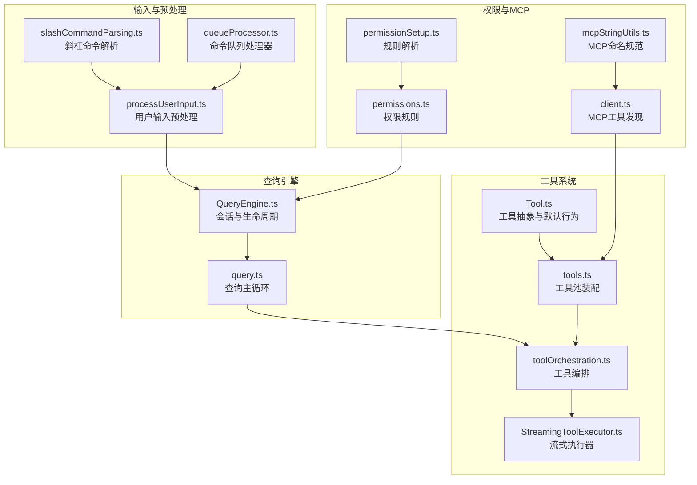
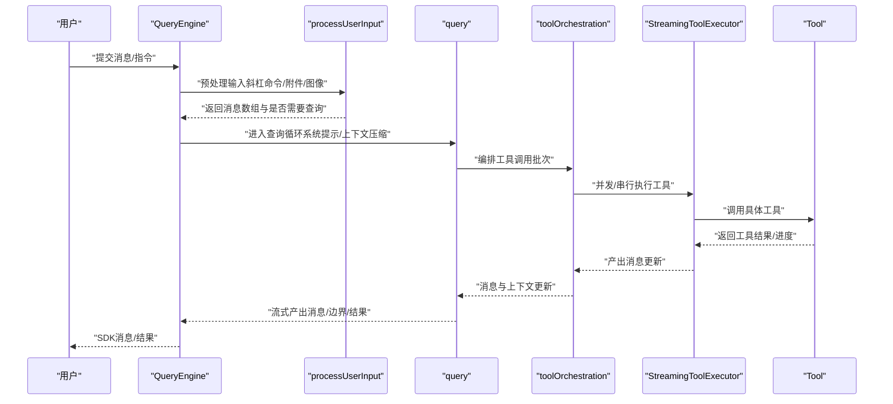
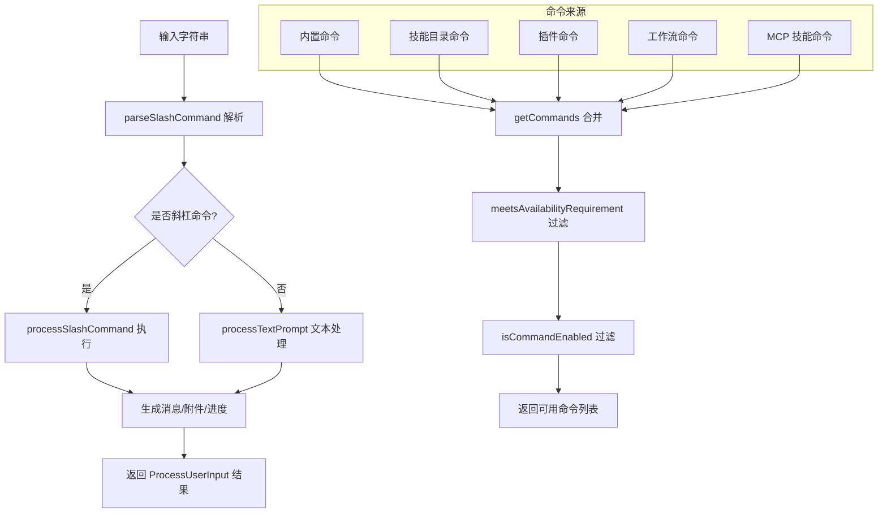
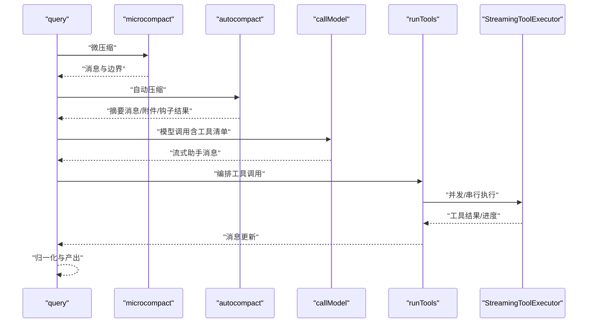
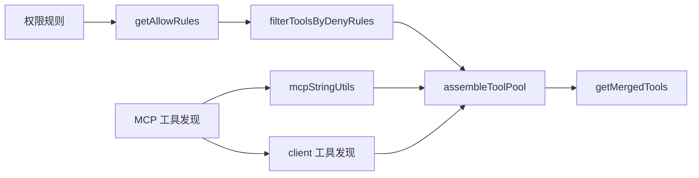
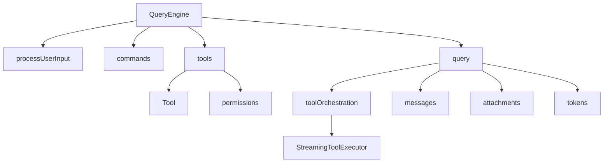

# 核心组件设计

<cite>
**本文引用的文件**
- [QueryEngine.ts](file://src/QueryEngine.ts)
- [Tool.ts](file://src/Tool.ts)
- [commands.ts](file://src/commands.ts)
- [query.ts](file://src/query.ts)
- [tools.ts](file://src/tools.ts)
- [processUserInput.ts](file://src/utils/processUserInput/processUserInput.ts)
- [toolOrchestration.ts](file://src/services/tools/toolOrchestration.ts)
- [StreamingToolExecutor.ts](file://src/services/tools/StreamingToolExecutor.ts)
- [slashCommandParsing.ts](file://src/utils/slashCommandParsing.ts)
- [queueProcessor.ts](file://src/utils/queueProcessor.ts)
- [messages.ts](file://src/utils/messages.ts)
- [permissions.ts](file://src/utils/permissions/permissions.ts)
- [permissionSetup.ts](file://src/utils/permissions/permissionSetup.ts)
- [mcpStringUtils.ts](file://src/services/mcp/mcpStringUtils.ts)
- [client.ts](file://src/services/mcp/client.ts)
</cite>

## 目录
1. [简介](#简介)
2. [项目结构](#项目结构)
3. [核心组件](#核心组件)
4. [架构总览](#架构总览)
5. [详细组件分析](#详细组件分析)
6. [依赖分析](#依赖分析)
7. [性能考量](#性能考量)
8. [故障排查指南](#故障排查指南)
9. [结论](#结论)
10. [附录](#附录)

## 简介
本设计文档聚焦 Claude Code 的核心组件：QueryEngine 查询引擎、Tool 工具系统与命令解析器。文档从架构设计、数据流、处理逻辑、集成点、错误处理与性能优化等维度进行深入剖析，并通过图示化展示组件间的关系与交互。同时给出生命周期管理、状态管理模式、工具注册机制与扩展方法，帮助读者快速理解并高效使用与扩展该系统。

## 项目结构
围绕查询与工具调用的关键模块如下：
- QueryEngine：会话级查询生命周期与状态管理的核心类，负责消息序列、权限跟踪、转录持久化与结果产出。
- Tool：工具抽象与默认行为定义，提供统一的工具接口、输入输出模式、并发安全与权限检查等能力。
- commands：命令集合与过滤逻辑，支持动态技能、插件技能、工作流命令等来源的合并与可用性控制。
- query：查询主循环，负责上下文压缩、自动压缩、模型调用、工具执行与消息归一化。
- tools：内置工具池装配与去重策略，结合 MCP 工具形成最终工具集。
- processUserInput：用户输入预处理，解析斜杠命令、附件提取、图像处理与钩子执行。
- toolOrchestration：工具执行编排，按并发安全策略分批串并行执行，维护上下文变更。
- StreamingToolExecutor：流式工具执行器，支持并发控制与回退时丢弃未完成任务。
- slashCommandParsing：斜杠命令解析工具。
- queueProcessor：命令队列处理器，区分斜杠命令与普通命令的执行策略。
- 权限与 MCP：权限规则解析、MCP 工具名规范化与工具发现。



**图表来源**
- [QueryEngine.ts:186-210](file://src/QueryEngine.ts#L186-L210)
- [query.ts:219-239](file://src/query.ts#L219-L239)
- [Tool.ts:362-473](file://src/Tool.ts#L362-L473)
- [tools.ts:191-249](file://src/tools.ts#L191-L249)
- [toolOrchestration.ts:19-82](file://src/services/tools/toolOrchestration.ts#L19-L82)
- [StreamingToolExecutor.ts:40-71](file://src/services/tools/StreamingToolExecutor.ts#L40-L71)
- [processUserInput.ts:85-170](file://src/utils/processUserInput/processUserInput.ts#L85-L170)
- [slashCommandParsing.ts:25-60](file://src/utils/slashCommandParsing.ts#L25-L60)
- [queueProcessor.ts:63-95](file://src/utils/queueProcessor.ts#L63-L95)
- [permissions.ts:122-132](file://src/utils/permissions/permissions.ts#L122-L132)
- [permissionSetup.ts:824-870](file://src/utils/permissions/permissionSetup.ts#L824-L870)
- [mcpStringUtils.ts:19-67](file://src/services/mcp/mcpStringUtils.ts#L19-L67)
- [client.ts:1982-1999](file://src/services/mcp/client.ts#L1982-L1999)

**章节来源**
- [QueryEngine.ts:132-175](file://src/QueryEngine.ts#L132-L175)
- [Tool.ts:158-300](file://src/Tool.ts#L158-L300)
- [commands.ts:258-346](file://src/commands.ts#L258-L346)
- [query.ts:181-199](file://src/query.ts#L181-L199)
- [tools.ts:191-249](file://src/tools.ts#L191-L249)
- [processUserInput.ts:85-170](file://src/utils/processUserInput/processUserInput.ts#L85-L170)
- [toolOrchestration.ts:19-82](file://src/services/tools/toolOrchestration.ts#L19-L82)
- [StreamingToolExecutor.ts:40-71](file://src/services/tools/StreamingToolExecutor.ts#L40-L71)
- [slashCommandParsing.ts:25-60](file://src/utils/slashCommandParsing.ts#L25-L60)
- [queueProcessor.ts:63-95](file://src/utils/queueProcessor.ts#L63-L95)
- [permissions.ts:122-132](file://src/utils/permissions/permissions.ts#L122-L132)
- [permissionSetup.ts:824-870](file://src/utils/permissions/permissionSetup.ts#L824-L870)
- [mcpStringUtils.ts:19-67](file://src/services/mcp/mcpStringUtils.ts#L19-L67)
- [client.ts:1982-1999](file://src/services/mcp/client.ts#L1982-L1999)

## 核心组件
- QueryEngine：封装一次对话的完整生命周期，维护消息列表、权限拒绝记录、用量统计、文件缓存与会话持久化；对外提供异步生成器接口以流式产出消息与结果。
- Tool：定义工具的统一接口（调用、描述、输入/输出模式、并发安全、只读/破坏性、权限检查、UI 渲染等），并通过 buildTool 提供默认实现，确保工具实现的一致性与最小成本。
- 命令系统：集中管理命令来源（内置、技能目录、插件、工作流、MCP 技能），提供可用性过滤、动态技能注入与远程安全命令白名单。
- 查询主循环：在每次迭代中执行上下文压缩、自动压缩、模型调用、工具执行与消息归一化，支持流式回退、令牌预算与任务预算。
- 工具编排与执行：根据工具并发安全属性进行分批执行，串行与并行混合策略，支持上下文修改与进度回调。
- 权限与 MCP：权限规则解析与匹配，MCP 工具命名规范与发现，确保工具可见性与一致性。

**章节来源**
- [QueryEngine.ts:177-186](file://src/QueryEngine.ts#L177-L186)
- [Tool.ts:362-473](file://src/Tool.ts#L362-L473)
- [commands.ts:449-517](file://src/commands.ts#L449-L517)
- [query.ts:219-239](file://src/query.ts#L219-L239)
- [toolOrchestration.ts:19-82](file://src/services/tools/toolOrchestration.ts#L19-L82)

## 架构总览
QueryEngine 作为会话入口，协调用户输入预处理、系统提示构建、命令与技能注入、工具池装配与查询主循环。查询主循环驱动模型调用与工具执行，通过工具编排器与流式执行器保障并发与一致性，同时维护权限跟踪与会话持久化。



**图表来源**
- [QueryEngine.ts:211-238](file://src/QueryEngine.ts#L211-L238)
- [processUserInput.ts:85-170](file://src/utils/processUserInput/processUserInput.ts#L85-L170)
- [query.ts:219-239](file://src/query.ts#L219-L239)
- [toolOrchestration.ts:19-82](file://src/services/tools/toolOrchestration.ts#L19-L82)
- [StreamingToolExecutor.ts:40-71](file://src/services/tools/StreamingToolExecutor.ts#L40-L71)
- [Tool.ts:379-385](file://src/Tool.ts#L379-L385)

## 详细组件分析

### QueryEngine 组件分析
- 职责与生命周期
  - 会话级状态：维护 mutableMessages、权限拒绝记录、用量统计、文件缓存与孤儿权限处理标记。
  - 生命周期：构造函数初始化配置与状态；submitMessage 异步生成器贯穿一轮对话，包含系统提示构建、命令处理、工具池装配、查询循环与结果产出。
- 关键流程
  - 用户输入预处理：通过 processUserInput 解析斜杠命令、附件与图像，得到消息数组与是否需要查询标志。
  - 系统提示构建：组合自定义/默认系统提示、内存机制提示与附加系统提示，注入主题、MCP 客户端与代理上下文。
  - 工具池装配：加载技能与插件，合并内置工具与 MCP 工具，按权限规则过滤与去重。
  - 查询循环：yield 初始化系统消息，若无需查询则直接返回本地命令输出与结果；否则进入 query 循环，持续产出消息直至结束。
  - 会话持久化：在关键节点写入转录，支持快照与刷新策略，保证中断后可恢复。
- 接口与通信
  - 输入：QueryEngineConfig（cwd、tools、commands、mcpClients、agents、canUseTool、AppState 获取/设置、初始消息、文件缓存、模型/预算/思考配置等）。
  - 输出：异步生成器产出 SDK 消息（用户/助手/系统/进度/边界/结果）。
- 错误处理与权限
  - 包装 canUseTool 追踪权限拒绝，记录到 permissionDenials。
  - 处理孤儿权限（一次性），通过 handleOrphanedPermission 流程推进。
  - 对于最大输出令牌与提示过长等可恢复错误，采用延迟策略并在恢复后继续。
- 性能与可测试性
  - 使用特征门控（feature）与条件导入，减少无关模块加载。
  - 使用 headlessProfilerCheckpoint 记录关键时间点，便于性能分析。
  - 通过配置参数与 AbortController 支持取消与中断。

```mermaid
classDiagram
class QueryEngine {
-config : QueryEngineConfig
-mutableMessages : Message[]
-abortController : AbortController
-permissionDenials : SDKPermissionDenial[]
-totalUsage : NonNullableUsage
-hasHandledOrphanedPermission : boolean
-readFileState : FileStateCache
-discoveredSkillNames : Set~string~
-loadedNestedMemoryPaths : Set~string~
+constructor(config)
+submitMessage(prompt, options) AsyncGenerator
}
class QueryEngineConfig {
+cwd : string
+tools : Tools
+commands : Command[]
+mcpClients : MCPServerConnection[]
+agents : AgentDefinition[]
+canUseTool : CanUseToolFn
+getAppState() : AppState
+setAppState(f) : void
+initialMessages? : Message[]
+readFileCache : FileStateCache
+customSystemPrompt? : string
+appendSystemPrompt? : string
+userSpecifiedModel? : string
+fallbackModel? : string
+thinkingConfig? : ThinkingConfig
+maxTurns? : number
+maxBudgetUsd? : number
+taskBudget? : { total : number }
+jsonSchema? : Record
+verbose? : boolean
+replayUserMessages? : boolean
+handleElicitation? : ToolUseContext["handleElicitation"]
+includePartialMessages? : boolean
+setSDKStatus? : (status) => void
+abortController? : AbortController
+orphanedPermission? : OrphanedPermission
+snipReplay? : (msg, store) => { messages, executed }|undefined
}
QueryEngine --> QueryEngineConfig : "持有"
```

**图表来源**
- [QueryEngine.ts:186-209](file://src/QueryEngine.ts#L186-L209)
- [QueryEngine.ts:132-175](file://src/QueryEngine.ts#L132-L175)

**章节来源**
- [QueryEngine.ts:177-186](file://src/QueryEngine.ts#L177-L186)
- [QueryEngine.ts:211-238](file://src/QueryEngine.ts#L211-L238)
- [QueryEngine.ts:400-411](file://src/QueryEngine.ts#L400-L411)
- [QueryEngine.ts:679-756](file://src/QueryEngine.ts#L679-L756)

### Tool 系统基类设计
- 接口与职责
  - call：执行工具，接收参数、上下文、权限决策函数与父消息，返回工具结果与可选新消息。
  - description：生成工具描述文本，用于工具搜索与模型提示。
  - inputSchema/outputSchema：Zod 类型定义，约束输入输出结构。
  - isConcurrencySafe/isReadOnly/isDestructive：并发安全、只读与破坏性标识。
  - checkPermissions：工具特定权限检查，与通用权限系统协作。
  - 渲染与 UI：renderToolUseMessage/renderToolResultMessage/renderToolUseProgressMessage 等，支持简洁/详细视图与标签渲染。
  - 其他：backfillObservableInput、toAutoClassifierInput、getPath、preparePermissionMatcher 等扩展点。
- 默认行为与构建
  - buildTool：通过默认值填充常用方法，确保工具实现最小成本。
  - 工具集合 Tools：统一类型别名，便于跨模块传递与过滤。
- 设计模式
  - 策略模式：不同工具实现不同的 call/description/checkPermissions 策略。
  - 模板方法：工具通过默认行为与可选覆盖实现模板方法。
  - 观察者/回调：onProgress、setToolJSX、通知回调等。

```mermaid
classDiagram
class Tool {
+name : string
+aliases? : string[]
+searchHint? : string
+call(args, context, canUseTool, parentMessage, onProgress) Promise~ToolResult~
+description(input, options) Promise~string~
+inputSchema : ZodType
+outputSchema? : ZodType
+inputsEquivalent?(a,b) : boolean
+isConcurrencySafe(input) : boolean
+isEnabled() : boolean
+isReadOnly(input) : boolean
+isDestructive?(input) : boolean
+interruptBehavior?() : "cancel"|"block"
+isSearchOrReadCommand?(input) : {isSearch,isRead,isList?}
+isOpenWorld?(input) : boolean
+requiresUserInteraction?() : boolean
+isMcp? : boolean
+isLsp? : boolean
+shouldDefer? : boolean
+alwaysLoad? : boolean
+mcpInfo? : {serverName, toolName}
+maxResultSizeChars : number
+strict? : boolean
+backfillObservableInput?(input) : void
+validateInput?(input, context) : Promise~ValidationResult~
+checkPermissions(input, context) : Promise~PermissionResult~
+getPath?(input) : string
+preparePermissionMatcher?(input) : Promise~fn~
+prompt(options) : Promise~string~
+userFacingName(input) : string
+userFacingNameBackgroundColor?(input) : ThemeColor
+isTransparentWrapper?() : boolean
+getToolUseSummary?(input) : string|null
+getActivityDescription?(input) : string|null
+toAutoClassifierInput(input) : unknown
+mapToolResultToToolResultBlockParam(content, toolUseID) : ToolResultBlockParam
+renderToolResultMessage?(content, progress, options) : ReactNode
+extractSearchText?(out) : string
+renderToolUseMessage(input, options) : ReactNode
+isResultTruncated?(output) : boolean
+renderToolUseTag?(input) : ReactNode
+renderToolUseProgressMessage?(progress, options) : ReactNode
+renderToolUseQueuedMessage?() : ReactNode
+renderToolUseRejectedMessage?(input, options) : ReactNode
+renderToolUseErrorMessage?(result, options) : ReactNode
+renderGroupedToolUse?(toolUses, options) : ReactNode|null
}
class ToolUseContext {
+options : Options
+abortController : AbortController
+readFileState : FileStateCache
+getAppState() : AppState
+setAppState(f) : void
+setAppStateForTasks?(f) : void
+handleElicitation?(serverName, params, signal) : Promise~ElicitResult~
+setToolJSX?(args) : void
+addNotification?(notif) : void
+appendSystemMessage?(msg) : void
+sendOSNotification?(opts) : void
+nestedMemoryAttachmentTriggers? : Set~string~
+loadedNestedMemoryPaths? : Set~string~
+dynamicSkillDirTriggers? : Set~string~
+discoveredSkillNames? : Set~string~
+setInProgressToolUseIDs(f) : void
+setHasInterruptibleToolInProgress?(v) : void
+setResponseLength(f) : void
+pushApiMetricsEntry?(ttftMs) : void
+setStreamMode?(mode) : void
+onCompactProgress?(event) : void
+setSDKStatus?(status) : void
+openMessageSelector?() : void
+updateFileHistoryState(updater) : void
+updateAttributionState(updater) : void
+setConversationId?(id) : void
+agentId? : AgentId
+agentType? : string
+requireCanUseTool? : boolean
+messages : Message[]
+fileReadingLimits? : {maxTokens?, maxSizeBytes?}
+globLimits? : {maxResults?}
+toolDecisions? : Map~string,{source,decision,timestamp}~
+queryTracking? : QueryChainTracking
+requestPrompt?(sourceName, toolInputSummary?) : PromptCallback
+toolUseId? : string
+criticalSystemReminder_EXPERIMENTAL? : string
+preserveToolUseResults? : boolean
+localDenialTracking? : DenialTrackingState
+contentReplacementState? : ContentReplacementState
+renderedSystemPrompt? : SystemPrompt
}
Tool --> ToolUseContext : "使用"
```

**图表来源**
- [Tool.ts:362-473](file://src/Tool.ts#L362-L473)
- [Tool.ts:158-300](file://src/Tool.ts#L158-L300)

**章节来源**
- [Tool.ts:362-473](file://src/Tool.ts#L362-L473)
- [Tool.ts:783-793](file://src/Tool.ts#L783-L793)

### 命令解析器与工具注册机制
- 命令解析
  - parseSlashCommand：解析斜杠命令，支持 MCP 命令标记与参数提取。
  - processUserInput：统一入口，处理图像/附件/IDE 选择等，区分 bash 与斜杠命令路径，调用相应处理器。
  - queueProcessor：命令队列处理，斜杠命令与 bash 命令单独执行，其他同模式命令批量处理。
- 工具注册与装配
  - getAllBaseTools：汇总所有内置工具，按环境变量与特性开关裁剪。
  - assembleToolPool/getMergedTools：合并内置与 MCP 工具，按名称去重且内置优先，保持提示缓存稳定性。
  - filterToolsByDenyRules：基于权限上下文过滤黑名单工具。
- 命令来源与可用性
  - 内置命令、技能目录命令、插件命令、工作流命令、MCP 技能命令，均通过 getCommands/getSkillToolCommands/getSlashCommandToolSkills 合并与过滤。
  - meetsAvailabilityRequirement：按订阅/提供商要求过滤命令可用性。
  - 远程安全命令：REMOTE_SAFE_COMMANDS/BRIDGE_SAFE_COMMANDS 白名单保障移动端/远程桥接安全。



**图表来源**
- [slashCommandParsing.ts:25-60](file://src/utils/slashCommandParsing.ts#L25-L60)
- [processUserInput.ts:531-551](file://src/utils/processUserInput/processUserInput.ts#L531-L551)
- [commands.ts:449-517](file://src/commands.ts#L449-L517)
- [commands.ts:586-608](file://src/commands.ts#L586-L608)

**章节来源**
- [slashCommandParsing.ts:25-60](file://src/utils/slashCommandParsing.ts#L25-L60)
- [processUserInput.ts:531-551](file://src/utils/processUserInput/processUserInput.ts#L531-L551)
- [commands.ts:449-517](file://src/commands.ts#L449-L517)
- [commands.ts:586-608](file://src/commands.ts#L586-L608)

### 查询主循环与工具执行
- 查询主循环
  - query：构建配置与预算跟踪，执行微压缩、自动压缩、上下文投影、模型调用与消息归一化。
  - 支持流式回退（StreamingToolExecutor.discard）、令牌预算与任务预算、内容替换预算。
- 工具编排
  - runTools：按并发安全属性分批，读操作并发执行，非读操作串行执行；支持上下文修改器累积与顺序应用。
  - partitionToolCalls：将连续读操作聚合为一批，单个非读操作独立一批。
- 流式执行器
  - StreamingToolExecutor：并发控制、兄弟进程终止信号、丢弃未完成任务，保证回退时一致性。



**图表来源**
- [query.ts:414-426](file://src/query.ts#L414-L426)
- [query.ts:454-543](file://src/query.ts#L454-L543)
- [query.ts:659-708](file://src/query.ts#L659-L708)
- [toolOrchestration.ts:19-82](file://src/services/tools/toolOrchestration.ts#L19-L82)
- [StreamingToolExecutor.ts:40-71](file://src/services/tools/StreamingToolExecutor.ts#L40-L71)

**章节来源**
- [query.ts:219-239](file://src/query.ts#L219-L239)
- [toolOrchestration.ts:19-82](file://src/services/tools/toolOrchestration.ts#L19-L82)
- [StreamingToolExecutor.ts:40-71](file://src/services/tools/StreamingToolExecutor.ts#L40-L71)

### 权限与 MCP 集成
- 权限系统
  - getAllowRules：从多源规则（设置、CLI、命令、会话）收集允许规则。
  - permissionRuleSourceDisplayString：规则来源显示。
  - filterToolsByDenyRules：在工具装配阶段过滤黑名单。
- MCP 工具
  - mcpStringUtils：MCP 命名规范、前缀与显示名处理。
  - client：MCP 工具发现与缓存，异常日志化。
  - getMergedTools/assembleToolPool：内置与 MCP 工具合并，内置优先。



**图表来源**
- [permissions.ts:122-132](file://src/utils/permissions/permissions.ts#L122-L132)
- [tools.ts:260-267](file://src/tools.ts#L260-L267)
- [tools.ts:343-365](file://src/tools.ts#L343-L365)
- [mcpStringUtils.ts:19-67](file://src/services/mcp/mcpStringUtils.ts#L19-L67)
- [client.ts:1982-1999](file://src/services/mcp/client.ts#L1982-L1999)

**章节来源**
- [permissions.ts:122-132](file://src/utils/permissions/permissions.ts#L122-L132)
- [tools.ts:260-267](file://src/tools.ts#L260-L267)
- [tools.ts:343-365](file://src/tools.ts#L343-L365)
- [mcpStringUtils.ts:19-67](file://src/services/mcp/mcpStringUtils.ts#L19-L67)
- [client.ts:1982-1999](file://src/services/mcp/client.ts#L1982-L1999)

## 依赖分析
- 组件耦合
  - QueryEngine 依赖 processUserInput、commands、tools、query 与工具上下文；内部通过 AbortController 与 AppState 管理生命周期与状态。
  - query 依赖工具编排与流式执行器，受权限与预算控制；与消息归一化、附件与令牌估算紧密耦合。
  - tools 依赖 Tool 抽象与权限规则，向 query 提供工具池。
- 外部依赖
  - MCP 服务发现与命名规范；权限规则解析；消息与附件处理；令牌与预算计算。
- 循环依赖规避
  - 通过延迟导入（如 TeamCreateTool/TeamDeleteTool/SendMessageTool）避免循环依赖。



**图表来源**
- [QueryEngine.ts:211-238](file://src/QueryEngine.ts#L211-L238)
- [query.ts:219-239](file://src/query.ts#L219-L239)
- [toolOrchestration.ts:19-82](file://src/services/tools/toolOrchestration.ts#L19-L82)
- [StreamingToolExecutor.ts:40-71](file://src/services/tools/StreamingToolExecutor.ts#L40-L71)
- [tools.ts:191-249](file://src/tools.ts#L191-L249)
- [Tool.ts:362-473](file://src/Tool.ts#L362-L473)
- [messages.ts:2694-2721](file://src/utils/messages.ts#L2694-L2721)

**章节来源**
- [QueryEngine.ts:211-238](file://src/QueryEngine.ts#L211-L238)
- [query.ts:219-239](file://src/query.ts#L219-L239)
- [toolOrchestration.ts:19-82](file://src/services/tools/toolOrchestration.ts#L19-L82)
- [StreamingToolExecutor.ts:40-71](file://src/services/tools/StreamingToolExecutor.ts#L40-L71)
- [tools.ts:191-249](file://src/tools.ts#L191-L249)
- [Tool.ts:362-473](file://src/Tool.ts#L362-L473)
- [messages.ts:2694-2721](file://src/utils/messages.ts#L2694-L2721)

## 性能考量
- 特征门控与条件导入：减少无关模块加载，降低冷启动与内存占用。
- 流式回退与丢弃：StreamingToolExecutor 在流式回退时丢弃未完成任务，避免无效计算。
- 上下文压缩与自动压缩：通过微压缩与自动压缩控制历史长度，降低令牌消耗与内存压力。
- 并发执行策略：读操作并发、非读操作串行，限制并发度（环境变量）平衡吞吐与资源。
- 令牌预算与任务预算：在查询循环中进行预算跟踪，避免超支导致失败。
- 会话持久化策略：按需写入与快照，避免阻塞关键路径。

[本节为通用指导，不直接分析具体文件]

## 故障排查指南
- 权限相关
  - 检查 permissionDenials 是否存在拒绝记录，确认工具权限规则与来源。
  - 使用 getAllowRules 与 meetsAvailabilityRequirement 排查规则与可用性问题。
- MCP 工具
  - 检查 MCP 工具发现与命名规范，确认前缀与显示名处理正确。
  - 若工具不可见，确认权限上下文与 deny 规则未屏蔽。
- 斜杠命令
  - 使用 parseSlashCommand 验证命令解析；确认 isBridgeSafeCommand 与远程安全白名单。
  - 检查 queueProcessor 的执行策略，区分斜杠命令与普通命令。
- 模型调用与工具执行
  - 关注流式回退与丢弃逻辑，必要时调整并发度或禁用回退。
  - 检查工具并发安全属性与上下文修改器累积顺序。

**章节来源**
- [QueryEngine.ts:246-274](file://src/QueryEngine.ts#L246-L274)
- [permissions.ts:122-132](file://src/utils/permissions/permissions.ts#L122-L132)
- [mcpStringUtils.ts:19-67](file://src/services/mcp/mcpStringUtils.ts#L19-L67)
- [slashCommandParsing.ts:25-60](file://src/utils/slashCommandParsing.ts#L25-L60)
- [queueProcessor.ts:63-95](file://src/utils/queueProcessor.ts#L63-L95)
- [StreamingToolExecutor.ts:69-71](file://src/services/tools/StreamingToolExecutor.ts#L69-L71)

## 结论
QueryEngine 以会话为中心，结合命令解析与工具系统，形成完整的查询与执行闭环。Tool 抽象提供一致的接口与默认行为，配合权限与 MCP 集成，确保安全性与可扩展性。查询主循环通过上下文压缩、自动压缩与工具编排，兼顾性能与可靠性。通过特征门控、流式回退与预算控制，系统在复杂场景下仍能保持稳定与高效。

[本节为总结，不直接分析具体文件]

## 附录
- 使用示例（路径）
  - QueryEngine 初始化与提交消息：[QueryEngine.ts:202-210](file://src/QueryEngine.ts#L202-L210)
  - 工具定义与构建：[Tool.ts:783-793](file://src/Tool.ts#L783-L793)
  - 命令解析与处理：[slashCommandParsing.ts:25-60](file://src/utils/slashCommandParsing.ts#L25-L60)、[processUserInput.ts:531-551](file://src/utils/processUserInput/processUserInput.ts#L531-L551)
  - 工具池装配与合并：[tools.ts:191-249](file://src/tools.ts#L191-L249)、[tools.ts:343-365](file://src/tools.ts#L343-L365)
  - 查询主循环与工具执行：[query.ts:219-239](file://src/query.ts#L219-L239)、[toolOrchestration.ts:19-82](file://src/services/tools/toolOrchestration.ts#L19-L82)
  - 权限规则与 MCP 集成：[permissions.ts:122-132](file://src/utils/permissions/permissions.ts#L122-L132)、[mcpStringUtils.ts:19-67](file://src/services/mcp/mcpStringUtils.ts#L19-L67)

[本节为补充说明，不直接分析具体文件]