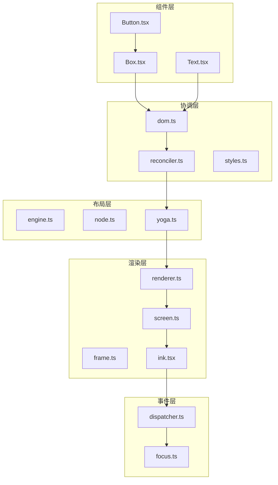
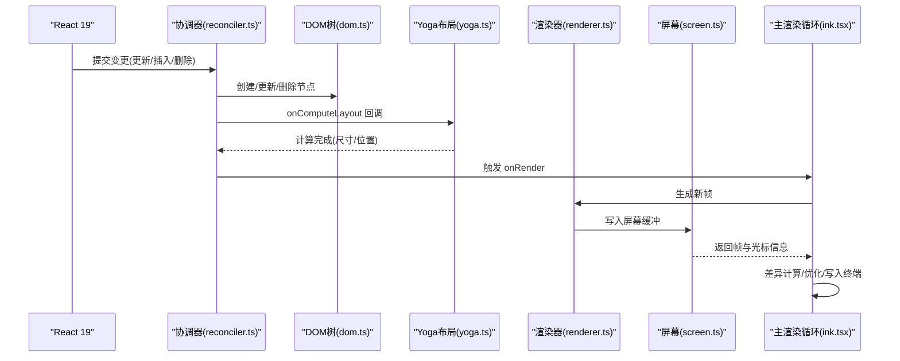
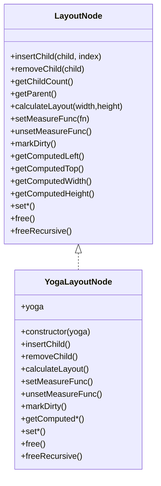
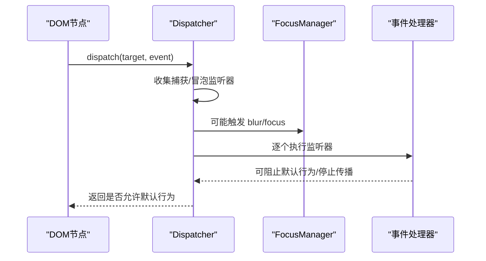
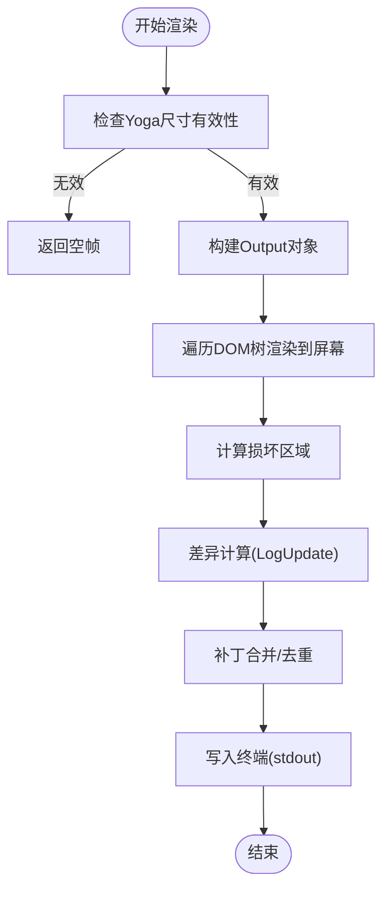
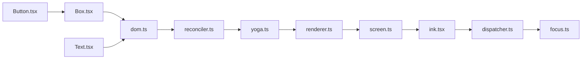

# Ink 组件架构

<cite>
**本文档引用的文件**
- [ink.tsx](file://src/ink/ink.tsx)
- [Box.tsx](file://src/ink/components/Box.tsx)
- [Text.tsx](file://src/ink/components/Text.tsx)
- [Button.tsx](file://src/ink/components/Button.tsx)
- [engine.ts](file://src/ink/layout/engine.ts)
- [node.ts](file://src/ink/layout/node.ts)
- [yoga.ts](file://src/ink/layout/yoga.ts)
- [renderer.ts](file://src/ink/renderer.ts)
- [dispatcher.ts](file://src/ink/events/dispatcher.ts)
- [focus.ts](file://src/ink/focus.ts)
- [reconciler.ts](file://src/ink/reconciler.ts)
- [dom.ts](file://src/ink/dom.ts)
- [styles.ts](file://src/ink/styles.ts)
- [screen.ts](file://src/ink/screen.ts)
- [frame.ts](file://src/ink/frame.ts)
</cite>

## 目录
1. [简介](#简介)
2. [项目结构](#项目结构)
3. [核心组件](#核心组件)
4. [架构总览](#架构总览)
5. [详细组件分析](#详细组件分析)
6. [依赖关系分析](#依赖关系分析)
7. [性能考量](#性能考量)
8. [故障排除指南](#故障排除指南)
9. [结论](#结论)

## 简介
本文件面向 Ink 组件架构的技术文档，系统阐述渲染引擎、组件系统、布局引擎与事件系统的实现方式。重点覆盖以下方面：
- 渲染管线：React 19 协调器驱动的 DOM 树构建、Yoga 布局计算、帧缓冲与差异输出。
- 组件体系：Box、Text、Button 等核心组件的属性、行为与组合模式。
- 布局系统：Yoga 引擎适配层、样式映射与测量函数。
- 事件系统：键盘、鼠标、焦点管理与捕获/冒泡传播模型。
- 性能优化：屏幕池化、增量差异、滚动节流与帧时间剖析。

## 项目结构
Ink 的核心位于 src/ink 目录，采用分层组织：
- 组件层：components/Box、Text、Button 等 UI 组件。
- 事件层：events/ 键盘、鼠标、焦点等事件定义与分发。
- 布局层：layout/ Yoga 适配与节点接口。
- 渲染层：renderer.ts、screen.ts、frame.ts、ink.tsx 主渲染循环。
- 协调层：reconciler.ts 集成 React 19，负责 DOM 节点创建、更新与布局回调。
- 工具层：dom.ts、styles.ts、focus.ts、hit-test.ts 等支撑模块。

**图表来源**
- [Box.tsx:1-213](file://src/ink/components/Box.tsx#L1-L213)
- [Text.tsx:1-254](file://src/ink/components/Text.tsx#L1-L254)
- [Button.tsx:1-192](file://src/ink/components/Button.tsx#L1-L192)
- [dispatcher.ts:1-234](file://src/ink/events/dispatcher.ts#L1-L234)
- [focus.ts:1-182](file://src/ink/focus.ts#L1-L182)
- [engine.ts:1-7](file://src/ink/layout/engine.ts#L1-L7)
- [node.ts:1-153](file://src/ink/layout/node.ts#L1-L153)
- [yoga.ts:1-309](file://src/ink/layout/yoga.ts#L1-L309)
- [renderer.ts:1-179](file://src/ink/renderer.ts#L1-L179)
- [screen.ts:1-800](file://src/ink/screen.ts#L1-L800)
- [frame.ts:1-125](file://src/ink/frame.ts#L1-L125)
- [ink.tsx:1-800](file://src/ink/ink.tsx#L1-L800)
- [reconciler.ts:1-513](file://src/ink/reconciler.ts#L1-L513)
- [dom.ts:1-485](file://src/ink/dom.ts#L1-L485)
- [styles.ts:1-772](file://src/ink/styles.ts#L1-L772)

**章节来源**
- [ink.tsx:1-800](file://src/ink/ink.tsx#L1-L800)
- [dom.ts:1-485](file://src/ink/dom.ts#L1-L485)

## 核心组件
本节聚焦 Box、Text、Button 的职责边界、属性与交互行为。

- Box
  - 作用：提供 Flex 布局容器，支持 tabIndex、autoFocus、点击与键盘事件。
  - 关键属性：flexDirection、flexGrow、flexShrink、flexWrap、overflowX/Y、margin/padding/gap 等。
  - 事件：onClick、onFocus/Blur（含捕获）、onKeyDown（含捕获）、onMouseEnter/Leave。
  - 行为：作为焦点可及元素参与 Tab 循环；在 Alt 屏幕中启用鼠标跟踪时支持点击与悬停。

- Text
  - 作用：文本渲染与样式应用，支持颜色、背景色、粗体/斜体/下划线/删除线、反显。
  - 关键属性：color、backgroundColor、bold/dim、italic、underline、strikethrough、inverse、wrap。
  - 文本换行：根据 textWrap 策略进行换行或截断；测量阶段考虑制表符扩展与预包装内容。

- Button
  - 作用：可交互按钮，提供 focused/hovered/active 状态供子节点渲染。
  - 关键属性：onAction（激活回调）、tabIndex、autoFocus、children（渲染函数或节点）。
  - 行为：通过键盘（回车/空格）与鼠标点击触发 onAction；内部维护状态并在短时间内自动清除 active 标记。

**章节来源**
- [Box.tsx:1-213](file://src/ink/components/Box.tsx#L1-L213)
- [Text.tsx:1-254](file://src/ink/components/Text.tsx#L1-L254)
- [Button.tsx:1-192](file://src/ink/components/Button.tsx#L1-L192)

## 架构总览
Ink 的渲染架构以 React 19 协调器为核心，结合自研 DOM 抽象、Yoga 布局与终端输出优化，形成“React 更新 → Yoga 计算 → 帧生成 → 差异输出”的完整流水线。

**图表来源**
- [reconciler.ts:240-315](file://src/ink/reconciler.ts#L240-L315)
- [dom.ts:110-132](file://src/ink/dom.ts#L110-L132)
- [yoga.ts:82-104](file://src/ink/layout/yoga.ts#L82-L104)
- [renderer.ts:31-179](file://src/ink/renderer.ts#L31-L179)
- [screen.ts:451-492](file://src/ink/screen.ts#L451-L492)
- [ink.tsx:418-787](file://src/ink/ink.tsx#L418-L787)

## 详细组件分析

### Box 组件
- 设计要点
  - 作为 Flex 容器，统一处理样式到 Yoga 的映射（边距、内边距、溢出、定位、flex 系列、对齐等）。
  - 事件处理：通过 DOM 节点上的 _eventHandlers 存储处理器，避免样式变化导致的脏标记。
  - 焦点管理：支持 tabIndex 与 autoFocus，在提交阶段由 FocusManager 处理焦点切换。

- 生命周期与事件
  - 创建：在 createInstance 中创建 DOMElement，并设置样式与事件处理器。
  - 更新：commitUpdate 比较旧/新属性，仅对变更项应用样式与事件映射。
  - 提交挂载：commitMount 调用 FocusManager.handleAutoFocus 自动聚焦。

- 使用建议
  - 在 Text 内部禁止嵌套 Box（宿主上下文限制），确保文本测量与渲染一致性。
  - 合理使用 overflow 与 position，避免绝对定位覆盖影响差异计算。

**章节来源**
- [Box.tsx:1-213](file://src/ink/components/Box.tsx#L1-L213)
- [dom.ts:331-379](file://src/ink/dom.ts#L331-L379)
- [reconciler.ts:394-403](file://src/ink/reconciler.ts#L394-L403)
- [styles.ts:406-771](file://src/ink/styles.ts#L406-L771)

### Text 组件
- 设计要点
  - 文本节点测量：在 measureTextNode 中展开制表符，按 textWrap 策略决定是否换行。
  - 文本样式：textStyles 与 style 分离存储，减少不必要的 Yoga 重测。
  - 性能：对 textStyles 进行浅比较，避免每次渲染都触发 Yoga 测量。

- 文本换行策略
  - wrap：按宽度换行。
  - truncate/...：单行截断，支持从不同位置截断。
  - wrap-trim：先换行再修剪尾部空白。

- 注意事项
  - 预包装文本在未约束宽度时避免重复换行导致高度膨胀。
  - 制表符在测量阶段扩展为最大宽度（每个制表位 8 空格），实际渲染基于屏幕位置展开。

**章节来源**
- [Text.tsx:1-254](file://src/ink/components/Text.tsx#L1-L254)
- [dom.ts:332-387](file://src/ink/dom.ts#L332-L387)
- [styles.ts:44-53](file://src/ink/styles.ts#L44-L53)

### Button 组件
- 设计要点
  - 状态机：focused/hovered/active，用于子节点渲染函数选择性地应用样式。
  - 交互：键盘（回车/空格）与鼠标点击均触发 onAction；active 状态在短延迟后自动清除。
  - 组合：内部使用 Box 承载交互逻辑，保持 Button 本身无样式外观。

- 事件绑定
  - 通过 Box 的 onKeyDown/onClick/onFocus/onBlur/onMouseEnter/onMouseLeave 实现统一交互。
  - 焦点控制：tabIndex 默认 0，支持 autoFocus；点击焦点管理由 FocusManager.handleClickFocus 处理。

**章节来源**
- [Button.tsx:1-192](file://src/ink/components/Button.tsx#L1-L192)
- [Box.tsx:1-213](file://src/ink/components/Box.tsx#L1-L213)
- [focus.ts:88-92](file://src/ink/focus.ts#L88-L92)

### 布局系统与 Yoga 集成
- 接口抽象
  - LayoutNode 定义了树结构、布局计算、样式设置与生命周期方法。
  - 支持边距、内边距、边框、gap、flex、对齐、溢出、定位等完整 CSS Flex 语义。

- Yoga 适配
  - YogaLayoutNode 将 Ink 的 LayoutNode 接口映射到 Yoga.Node，包括测量函数、布局计算与样式设置。
  - 测量函数：ink-text 与 ink-raw-ansi 节点分别提供文本测量与固定尺寸测量。

- 布局流程
  - React 提交阶段调用 onComputeLayout，设置终端宽度并触发 Yoga.calculateLayout。
  - 计算结果通过 getComputedWidth/Height 读取，供渲染器生成屏幕缓冲。

**图表来源**
- [node.ts:93-153](file://src/ink/layout/node.ts#L93-L153)
- [yoga.ts:54-297](file://src/ink/layout/yoga.ts#L54-L297)

**章节来源**
- [engine.ts:1-7](file://src/ink/layout/engine.ts#L1-L7)
- [node.ts:1-153](file://src/ink/layout/node.ts#L1-L153)
- [yoga.ts:1-309](file://src/ink/layout/yoga.ts#L1-L309)

### 事件系统与焦点管理
- 事件分发
  - Dispatcher 实现捕获/冒泡两阶段分发，支持离散优先级（键盘、点击、粘贴）与连续优先级（resize、scroll、mousemove）。
  - 事件类型映射到 DOM 节点的 _eventHandlers，按从目标到根的路径收集监听器，再按顺序执行。

- 焦点管理
  - FocusManager 维护 activeElement 与焦点栈，支持 blur/focus 事件派发与 Tab 循环。
  - 处理节点移除：当树中移除节点或其后代时，自动恢复到最近仍存在的焦点元素。

- 与 React 协作
  - 协调器在 commitMount 阶段调用 FocusManager.handleAutoFocus。
  - 移除节点时调用 FocusManager.handleNodeRemoved，确保焦点一致性。

**图表来源**
- [dispatcher.ts:161-233](file://src/ink/events/dispatcher.ts#L161-L233)
- [focus.ts:15-131](file://src/ink/focus.ts#L15-L131)
- [reconciler.ts:401-423](file://src/ink/reconciler.ts#L401-L423)

**章节来源**
- [dispatcher.ts:1-234](file://src/ink/events/dispatcher.ts#L1-L234)
- [focus.ts:1-182](file://src/ink/focus.ts#L1-L182)
- [reconciler.ts:1-513](file://src/ink/reconciler.ts#L1-L513)

### 渲染管线与帧缓冲
- 渲染器
  - createRenderer 接收 DOM 根节点与样式池，返回渲染函数。
  - 若 Yoga 尺寸无效（NaN/负数/无穷大），返回空帧，避免崩溃。
  - alt-screen 模式下强制高度等于终端行数，并记录溢出警告。

- 屏幕缓冲
  - Screen 使用 Int32Array 打包存储字符、样式、超链接与宽度信息，降低 GC 压力。
  - 提供 CharPool、HyperlinkPool、StylePool 三类共享池，支持跨帧复用与迁移。

- 帧与差异
  - Frame 包含 screen、viewport、cursor、scrollHint 与 scrollDrainPending。
  - shouldClearScreen 根据尺寸变化与溢出情况决定是否清屏，避免闪烁。

**图表来源**
- [renderer.ts:31-179](file://src/ink/renderer.ts#L31-L179)
- [screen.ts:451-544](file://src/ink/screen.ts#L451-L544)
- [frame.ts:105-125](file://src/ink/frame.ts#L105-L125)

**章节来源**
- [renderer.ts:1-179](file://src/ink/renderer.ts#L1-L179)
- [screen.ts:1-800](file://src/ink/screen.ts#L1-L800)
- [frame.ts:1-125](file://src/ink/frame.ts#L1-L125)

## 依赖关系分析
- 组件到 DOM：Box/Text/Button 通过 reconciler 创建 DOMElement，设置样式与事件处理器。
- DOM 到 Yoga：DOMElement.yogaNode 在创建时绑定 LayoutNode，样式变更通过 styles.ts 映射到 Yoga。
- 渲染器到屏幕：renderer.ts 调用 Output 将 DOM 树绘制到 Screen，Screen 使用池化结构提升性能。
- 事件到焦点：dispatcher.ts 与 focus.ts 协同，保证事件与焦点状态一致。

**图表来源**
- [Box.tsx:1-213](file://src/ink/components/Box.tsx#L1-L213)
- [Text.tsx:1-254](file://src/ink/components/Text.tsx#L1-L254)
- [Button.tsx:1-192](file://src/ink/components/Button.tsx#L1-L192)
- [dom.ts:1-485](file://src/ink/dom.ts#L1-L485)
- [reconciler.ts:1-513](file://src/ink/reconciler.ts#L1-L513)
- [yoga.ts:1-309](file://src/ink/layout/yoga.ts#L1-L309)
- [renderer.ts:1-179](file://src/ink/renderer.ts#L1-L179)
- [screen.ts:1-800](file://src/ink/screen.ts#L1-L800)
- [ink.tsx:1-800](file://src/ink/ink.tsx#L1-L800)
- [dispatcher.ts:1-234](file://src/ink/events/dispatcher.ts#L1-L234)
- [focus.ts:1-182](file://src/ink/focus.ts#L1-L182)

**章节来源**
- [dom.ts:1-485](file://src/ink/dom.ts#L1-L485)
- [styles.ts:1-772](file://src/ink/styles.ts#L1-L772)
- [reconciler.ts:1-513](file://src/ink/reconciler.ts#L1-L513)

## 性能考量
- 屏幕池化
  - CharPool/HyperlinkPool/StylePool 共享池减少字符串与样式分配，跨帧复用 ID。
  - 定期迁移池（migrateScreenPools）防止内存无限增长。

- 增量差异
  - Screen.damage 记录脏区，diff 仅扫描受影响区域。
  - 选择性禁用全屏重绘：布局未移动、无选择高亮/搜索高亮且前一帧未污染时走快速路径。

- 帧时间剖析
  - 记录 Yoga 计算时间、React 提交时间与各阶段耗时，便于定位瓶颈。
  - 提供环境变量开关（如 CLAUDE_CODE_DEBUG_REPAINTS）辅助调试。

- 滚动与节流
  - 滚动箱 pendingScrollDelta 分帧消耗，避免一次性大跳跃。
  - 滚动提示（scrollHint）与滚动排空（scrollDrainPending）优化 alt-screen 滚动体验。

**章节来源**
- [screen.ts:1-800](file://src/ink/screen.ts#L1-L800)
- [ink.tsx:595-787](file://src/ink/ink.tsx#L595-L787)
- [renderer.ts:114-179](file://src/ink/renderer.ts#L114-L179)
- [reconciler.ts:200-222](file://src/ink/reconciler.ts#L200-L222)

## 故障排除指南
- 组件嵌套错误
  - 在 Text 内部直接嵌套 Box 会抛出异常，需将 Box 放置在非文本上下文中。

- 文本渲染问题
  - 文本换行异常：检查 textWrap 设置与容器宽度；预包装文本在未约束宽度时避免重复换行。
  - 制表符显示异常：确认制表符已正确展开，渲染阶段按屏幕位置再次展开。

- 焦点与交互
  - Tab 循环无效：确认 tabIndex ≥ 0；autoFocus 仅在提交阶段生效。
  - 点击/悬停无响应：仅在 Alt 屏幕中启用鼠标跟踪时可用；检查事件处理器是否正确绑定。

- 渲染卡顿与闪烁
  - 高频滚动：利用 pendingScrollDelta 分帧滚动；必要时降低更新频率。
  - 闪烁：检查 shouldClearScreen 条件（尺寸变化/溢出）；避免频繁全屏重绘。
  - 调试：开启帧时间剖析与调试重绘日志，定位慢 Yoga 或慢绘制阶段。

**章节来源**
- [reconciler.ts:338-340](file://src/ink/reconciler.ts#L338-L340)
- [dom.ts:332-387](file://src/ink/dom.ts#L332-L387)
- [focus.ts:102-131](file://src/ink/focus.ts#L102-L131)
- [frame.ts:105-125](file://src/ink/frame.ts#L105-L125)
- [ink.tsx:595-787](file://src/ink/ink.tsx#L595-L787)

## 结论
Ink 通过 React 19 协调器与自研 DOM 抽象，结合 Yoga 布局与终端专用的屏幕缓冲与差异输出，实现了高性能、可调试、可扩展的终端 UI 渲染框架。组件层提供简洁的 API，事件与焦点系统遵循 DOM 语义，布局与样式映射完整覆盖 Flex 语义，渲染管线在多处引入池化与增量优化，满足复杂终端界面的实时渲染需求。建议在实际开发中关注组件嵌套规则、文本换行策略与焦点管理，配合帧剖析工具持续优化性能。