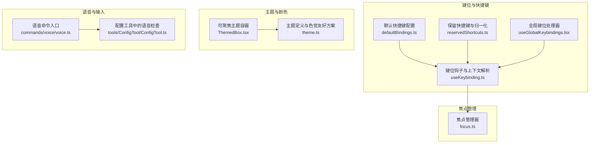
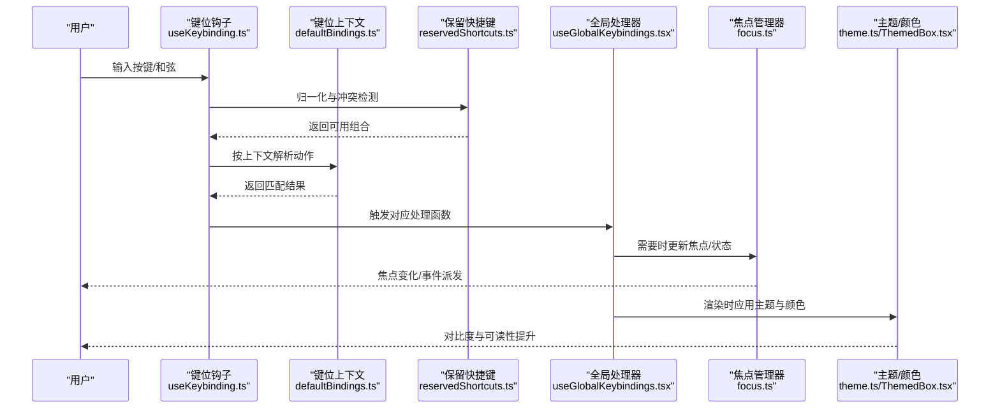
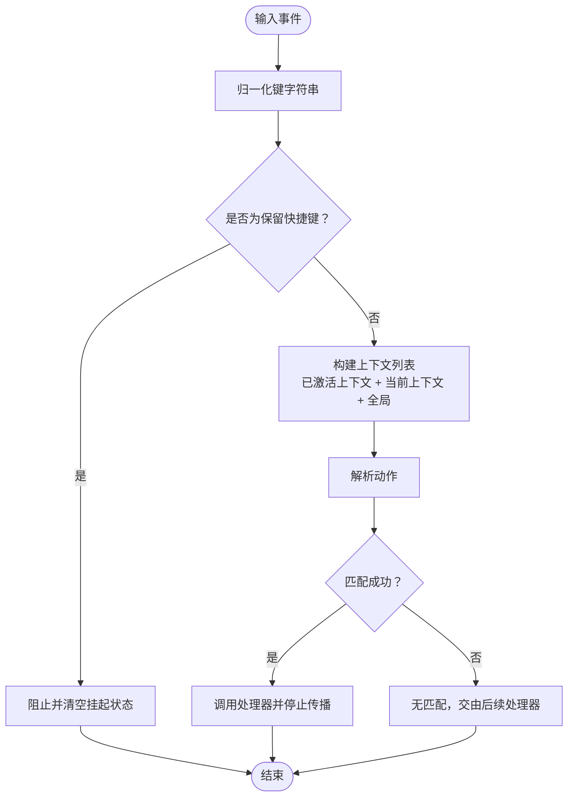
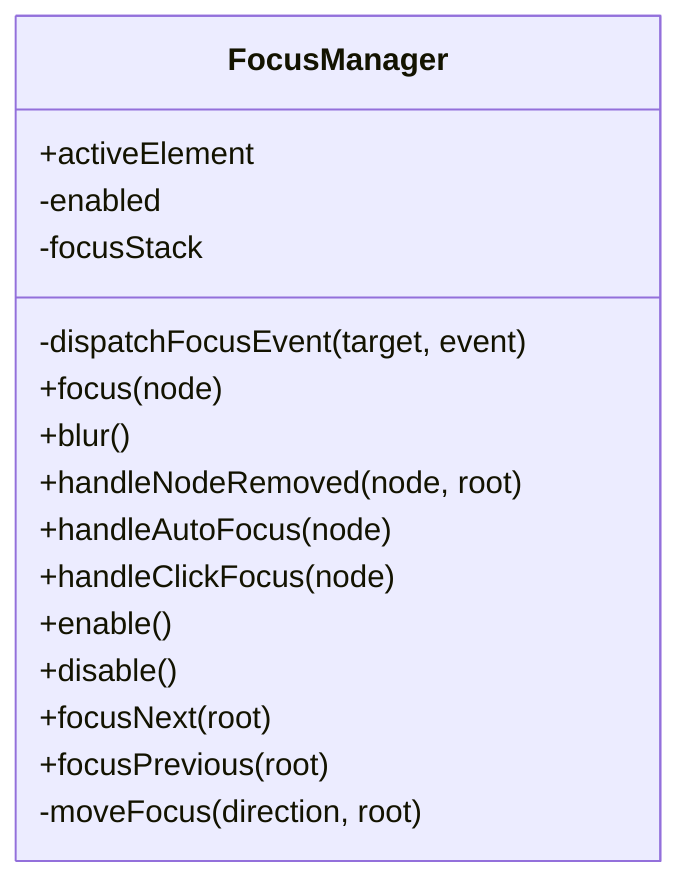
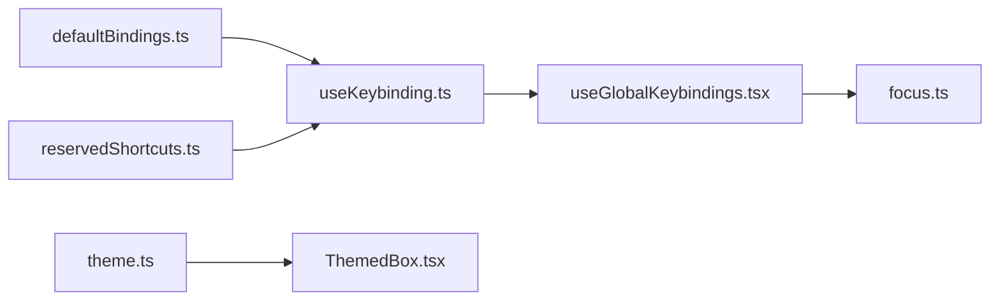

# 无障碍支持

<cite>
**本文引用的文件**
- [src/ink/focus.ts](file://src/ink/focus.ts)
- [src/keybindings/defaultBindings.ts](file://src/keybindings/defaultBindings.ts)
- [src/keybindings/reservedShortcuts.ts](file://src/keybindings/reservedShortcuts.ts)
- [src/keybindings/useKeybinding.ts](file://src/keybindings/useKeybinding.ts)
- [src/hooks/useGlobalKeybindings.tsx](file://src/hooks/useGlobalKeybindings.tsx)
- [src/components/design-system/ThemedBox.tsx](file://src/components/design-system/ThemedBox.tsx)
- [src/utils/theme.ts](file://src/utils/theme.ts)
- [src/commands/voice/voice.ts](file://src/commands/voice/voice.ts)
- [src/tools/ConfigTool/ConfigTool.ts](file://src/tools/ConfigTool/ConfigTool.ts)
</cite>

## 目录
1. [简介](#简介)
2. [项目结构](#项目结构)
3. [核心组件](#核心组件)
4. [架构总览](#架构总览)
5. [详细组件分析](#详细组件分析)
6. [依赖关系分析](#依赖关系分析)
7. [性能考量](#性能考量)
8. [故障排查指南](#故障排查指南)
9. [结论](#结论)
10. [附录](#附录)

## 简介
本文件面向无障碍支持的完整实现，聚焦于键盘导航系统、快捷键管理、焦点管理策略、屏幕阅读器支持、语义化标签与 ARIA 属性、视觉辅助（颜色对比度与字体大小调整）、无障碍测试方法与最佳实践，并覆盖跨平台与移动设备适配及辅助技术集成。文档以仓库中的终端交互与键位绑定为核心，结合主题与颜色体系，给出可落地的无障碍设计与工程实现建议。

## 项目结构
本项目的无障碍能力主要分布在以下模块：
- 键盘与快捷键：键位解析、上下文匹配、全局与场景化绑定、保留快捷键策略
- 焦点管理：终端 UI 的焦点状态机、Tab 可聚焦元素遍历、焦点栈与事件派发
- 主题与颜色：明暗主题、色觉友好主题、ANSI 降级方案
- 组件层：可聚焦容器、事件透传、光标定位等
- 语音输入：麦克风权限与环境探测，为语音模式无障碍提供基础

**图表来源**
- [src/keybindings/defaultBindings.ts:32-341](file://src/keybindings/defaultBindings.ts#L32-L341)
- [src/keybindings/reservedShortcuts.ts:56-93](file://src/keybindings/reservedShortcuts.ts#L56-L93)
- [src/keybindings/useKeybinding.ts:33-197](file://src/keybindings/useKeybinding.ts#L33-L197)
- [src/hooks/useGlobalKeybindings.tsx:36-249](file://src/hooks/useGlobalKeybindings.tsx#L36-L249)
- [src/ink/focus.ts:15-182](file://src/ink/focus.ts#L15-L182)
- [src/utils/theme.ts:115-191](file://src/utils/theme.ts#L115-L191)
- [src/components/design-system/ThemedBox.tsx:56-156](file://src/components/design-system/ThemedBox.tsx#L56-L156)
- [src/commands/voice/voice.ts:82-112](file://src/commands/voice/voice.ts#L82-L112)
- [src/tools/ConfigTool/ConfigTool.ts:231-308](file://src/tools/ConfigTool/ConfigTool.ts#L231-L308)

**章节来源**
- [src/keybindings/defaultBindings.ts:32-341](file://src/keybindings/defaultBindings.ts#L32-L341)
- [src/keybindings/reservedShortcuts.ts:56-93](file://src/keybindings/reservedShortcuts.ts#L56-L93)
- [src/keybindings/useKeybinding.ts:33-197](file://src/keybindings/useKeybinding.ts#L33-L197)
- [src/hooks/useGlobalKeybindings.tsx:36-249](file://src/hooks/useGlobalKeybindings.tsx#L36-L249)
- [src/ink/focus.ts:15-182](file://src/ink/focus.ts#L15-L182)
- [src/utils/theme.ts:115-191](file://src/utils/theme.ts#L115-L191)
- [src/components/design-system/ThemedBox.tsx:56-156](file://src/components/design-system/ThemedBox.tsx#L56-L156)
- [src/commands/voice/voice.ts:82-112](file://src/commands/voice/voice.ts#L82-L112)
- [src/tools/ConfigTool/ConfigTool.ts:231-308](file://src/tools/ConfigTool/ConfigTool.ts#L231-L308)

## 核心组件
- 键位系统
  - 默认快捷键配置按上下文分组，覆盖全局、聊天、设置、确认、标签页、转录、历史搜索、任务、主题选择、滚动、帮助、附件、底部栏、消息选择、差异对话、模型选择、选择组件、插件等场景
  - 保留快捷键策略屏蔽系统级或终端协议保留的组合键，避免冲突
  - 键位钩子在组件生命周期内注册处理函数，支持和弦序列、优先上下文匹配与传播控制
- 焦点管理
  - 终端 UI 的焦点管理器维护当前焦点节点与焦点栈，支持启用/禁用、自动聚焦、点击聚焦、前后焦点切换与树移除后的恢复
  - 收集可 Tab 聚焦元素时依据节点属性进行筛选，保证可访问性一致性
- 主题与颜色
  - 提供明/暗、色觉友好（daltonized）与 ANSI 降级主题，确保在不同终端环境下具备良好对比度与可读性
  - 主题容器组件支持将主题键解析为具体颜色值，便于在 UI 中统一应用
- 语音输入
  - 语音命令入口与配置工具中对录音依赖、麦克风权限与系统隐私设置进行探测与引导，为语音无障碍提供前置条件

**章节来源**
- [src/keybindings/defaultBindings.ts:32-341](file://src/keybindings/defaultBindings.ts#L32-L341)
- [src/keybindings/reservedShortcuts.ts:56-93](file://src/keybindings/reservedShortcuts.ts#L56-L93)
- [src/keybindings/useKeybinding.ts:33-197](file://src/keybindings/useKeybinding.ts#L33-L197)
- [src/ink/focus.ts:15-182](file://src/ink/focus.ts#L15-L182)
- [src/utils/theme.ts:115-191](file://src/utils/theme.ts#L115-L191)
- [src/components/design-system/ThemedBox.tsx:56-156](file://src/components/design-system/ThemedBox.tsx#L56-L156)
- [src/commands/voice/voice.ts:82-112](file://src/commands/voice/voice.ts#L82-L112)
- [src/tools/ConfigTool/ConfigTool.ts:231-308](file://src/tools/ConfigTool/ConfigTool.ts#L231-L308)

## 架构总览
下图展示了从用户输入到动作执行与焦点流转的关键路径，以及主题与颜色体系如何贯穿组件渲染。

**图表来源**
- [src/keybindings/useKeybinding.ts:47-96](file://src/keybindings/useKeybinding.ts#L47-L96)
- [src/keybindings/defaultBindings.ts:32-341](file://src/keybindings/defaultBindings.ts#L32-L341)
- [src/keybindings/reservedShortcuts.ts:56-93](file://src/keybindings/reservedShortcuts.ts#L56-L93)
- [src/hooks/useGlobalKeybindings.tsx:185-249](file://src/hooks/useGlobalKeybindings.tsx#L185-L249)
- [src/ink/focus.ts:27-50](file://src/ink/focus.ts#L27-L50)
- [src/utils/theme.ts:115-191](file://src/utils/theme.ts#L115-L191)
- [src/components/design-system/ThemedBox.tsx:56-156](file://src/components/design-system/ThemedBox.tsx#L56-L156)

## 详细组件分析

### 键盘导航与快捷键管理
- 上下文优先级与动作解析
  - 多上下文合并去重后按优先顺序匹配，全局上下文作为兜底
  - 和弦序列支持：开始、取消与挂起状态由上下文管理器维护
- 全局与场景化快捷键
  - 全局：如切换待办、转录视图、简报模式、终端面板、强制重绘等
  - 场景：聊天、设置、确认、标签页、转录、历史搜索、滚动、消息选择等
- 保留快捷键与平台差异
  - 系统级（复制/粘贴/退出/窗口切换/Spotlight）与终端协议保留键被屏蔽
  - 平台差异：Windows 下图像粘贴、模式循环键采用替代组合，以规避终端兼容性问题
- 语音模式快捷键
  - 空格键用于“按住说话”，可通过用户配置覆盖或禁用

**图表来源**
- [src/keybindings/reservedShortcuts.ts:56-93](file://src/keybindings/reservedShortcuts.ts#L56-L93)
- [src/keybindings/useKeybinding.ts:47-96](file://src/keybindings/useKeybinding.ts#L47-L96)
- [src/keybindings/defaultBindings.ts:32-341](file://src/keybindings/defaultBindings.ts#L32-L341)

**章节来源**
- [src/keybindings/useKeybinding.ts:33-197](file://src/keybindings/useKeybinding.ts#L33-L197)
- [src/keybindings/defaultBindings.ts:32-341](file://src/keybindings/defaultBindings.ts#L32-L341)
- [src/keybindings/reservedShortcuts.ts:56-93](file://src/keybindings/reservedShortcuts.ts#L56-L93)
- [src/hooks/useGlobalKeybindings.tsx:36-249](file://src/hooks/useGlobalKeybindings.tsx#L36-L249)

### 焦点管理策略
- 状态机与事件派发
  - 维护 activeElement 与焦点栈；节点移除时自动回退到最近仍存在的节点
  - 支持 blur/focus 事件派发，保证 UI 与逻辑同步
- Tab 导航与可聚焦元素
  - 通过遍历收集具有非负 tabIndex 的节点作为可聚焦元素，实现循环焦点
  - 支持前后方向切换，边界循环处理
- 自动聚焦与点击聚焦
  - 自动聚焦与点击聚焦仅在存在有效 tabIndex 时生效

**图表来源**
- [src/ink/focus.ts:15-182](file://src/ink/focus.ts#L15-L182)

**章节来源**
- [src/ink/focus.ts:15-182](file://src/ink/focus.ts#L15-L182)

### 屏幕阅读器支持与语义化标签
- 组件可聚焦性
  - 主题容器组件暴露 tabIndex、onFocus/onBlur、onClick 等回调，便于屏幕阅读器感知焦点变化与点击行为
- 焦点可见性与光标定位
  - 在特定布局中声明光标位置，有助于屏幕阅读器与放大镜跟踪焦点
- 建议补充
  - 为关键交互元素添加 aria-label/aria-describedby 等语义化属性，明确操作意图与状态
  - 使用 role 与 aria-live 区分动态内容更新，避免仅依赖颜色传达信息

**章节来源**
- [src/components/design-system/ThemedBox.tsx:24-37](file://src/components/design-system/ThemedBox.tsx#L24-L37)
- [src/components/CustomSelect/select.tsx:625-689](file://src/components/CustomSelect/select.tsx#L625-L689)

### 视觉辅助功能：颜色对比度与字体大小
- 色觉友好主题
  - 提供 light-daltonized 与 dark-daltonized 主题，使用显式 RGB 值避免终端 ANSI 定制导致的颜色偏差
  - ANSI 降级主题确保在不支持真彩的终端中仍具可读性
- 字体大小调整
  - 通过主题与样式系统统一管理字号与行高，结合终端缩放与字体设置提升可读性
- 建议补充
  - 为文本与背景提供对比度阈值校验（例如 4.5:1），并在低对比度场景下提供主题切换提示

**章节来源**
- [src/utils/theme.ts:115-191](file://src/utils/theme.ts#L115-L191)
- [src/utils/theme.ts:355-542](file://src/utils/theme.ts#L355-L542)
- [src/utils/theme.ts:197-214](file://src/utils/theme.ts#L197-L214)

### 无障碍测试方法
- 自动化测试
  - 键位解析与上下文匹配：断言不同上下文下的优先级与和弦序列行为
  - 焦点管理：断言焦点栈长度、焦点回退、blur/focus 事件触发
  - 主题与颜色：断言主题切换后颜色值解析正确，daltonized 主题颜色符合预期
- 手动测试
  - 键盘导航：Tab/Shift+Tab 循环、Esc/Enter 行为、和弦序列输入
  - 屏幕阅读器：NVDA/VO/Orca 下的焦点跟踪、语义化标签朗读
  - 语音输入：麦克风权限、录音依赖、系统隐私设置指引
- 跨平台与移动设备
  - Windows/Unix/macOS 下的保留快捷键差异与终端兼容性验证
  - 移动终端（如 iTerm2/WezTerm/kitty）的键盘协议差异与键位映射

**章节来源**
- [src/keybindings/useKeybinding.ts:47-96](file://src/keybindings/useKeybinding.ts#L47-L96)
- [src/ink/focus.ts:27-50](file://src/ink/focus.ts#L27-L50)
- [src/utils/theme.ts:115-191](file://src/utils/theme.ts#L115-L191)
- [src/commands/voice/voice.ts:82-112](file://src/commands/voice/voice.ts#L82-L112)

## 依赖关系分析
- 键位系统依赖
  - defaultBindings.ts 提供动作映射，useKeybinding.ts 负责解析与注册，reservedShortcuts.ts 提供冲突检测
  - useGlobalKeybindings.tsx 将动作映射到具体 UI 行为，间接影响焦点与渲染
- 焦点管理依赖
  - focus.ts 作为纯状态机，不依赖 UI 树，但通过根节点持有其实例，实现跨组件的焦点控制
- 主题与颜色依赖
  - theme.ts 定义主题与颜色，ThemedBox.tsx 在渲染期解析主题键，形成最终颜色输出

**图表来源**
- [src/keybindings/defaultBindings.ts:32-341](file://src/keybindings/defaultBindings.ts#L32-L341)
- [src/keybindings/reservedShortcuts.ts:56-93](file://src/keybindings/reservedShortcuts.ts#L56-L93)
- [src/keybindings/useKeybinding.ts:33-197](file://src/keybindings/useKeybinding.ts#L33-L197)
- [src/hooks/useGlobalKeybindings.tsx:36-249](file://src/hooks/useGlobalKeybindings.tsx#L36-L249)
- [src/ink/focus.ts:15-182](file://src/ink/focus.ts#L15-L182)
- [src/utils/theme.ts:115-191](file://src/utils/theme.ts#L115-L191)
- [src/components/design-system/ThemedBox.tsx:56-156](file://src/components/design-system/ThemedBox.tsx#L56-L156)

**章节来源**
- [src/keybindings/defaultBindings.ts:32-341](file://src/keybindings/defaultBindings.ts#L32-L341)
- [src/keybindings/reservedShortcuts.ts:56-93](file://src/keybindings/reservedShortcuts.ts#L56-L93)
- [src/keybindings/useKeybinding.ts:33-197](file://src/keybindings/useKeybinding.ts#L33-L197)
- [src/hooks/useGlobalKeybindings.tsx:36-249](file://src/hooks/useGlobalKeybindings.tsx#L36-L249)
- [src/ink/focus.ts:15-182](file://src/ink/focus.ts#L15-L182)
- [src/utils/theme.ts:115-191](file://src/utils/theme.ts#L115-L191)
- [src/components/design-system/ThemedBox.tsx:56-156](file://src/components/design-system/ThemedBox.tsx#L56-L156)

## 性能考量
- 键位解析
  - 合理组织上下文列表，避免不必要的重复解析；和弦挂起状态应尽快清理
- 焦点管理
  - 控制焦点栈长度，防止无限增长；在节点移除时快速回退，减少无效事件派发
- 主题渲染
  - 颜色解析在渲染期完成，尽量复用主题对象；在高频更新场景下缓存解析结果

## 故障排查指南
- 快捷键无效或冲突
  - 检查是否命中保留快捷键；确认上下文优先级与动作映射
  - 在 Windows 终端中验证 VT 模式支持与键位映射差异
- 焦点无法移动或丢失
  - 确认可聚焦元素是否具备非负 tabIndex；节点移除后是否正确回退
- 颜色对比度不足
  - 切换至 daltonized 或 ANSI 主题；检查终端 ANSI 配置
- 语音输入失败
  - 检查录音依赖与麦克风权限；根据平台指引开启系统隐私设置

**章节来源**
- [src/keybindings/reservedShortcuts.ts:56-93](file://src/keybindings/reservedShortcuts.ts#L56-L93)
- [src/ink/focus.ts:57-82](file://src/ink/focus.ts#L57-L82)
- [src/utils/theme.ts:355-542](file://src/utils/theme.ts#L355-L542)
- [src/commands/voice/voice.ts:82-112](file://src/commands/voice/voice.ts#L82-L112)
- [src/tools/ConfigTool/ConfigTool.ts:231-308](file://src/tools/ConfigTool/ConfigTool.ts#L231-L308)

## 结论
本项目在终端 TUI 环境下实现了完善的键盘导航与快捷键体系，配合焦点管理器与主题颜色系统，为不同用户提供了可访问的交互体验。建议进一步完善语义化标签与 ARIA 属性、增强对比度校验与字体可调性，并在多平台与移动终端上持续验证与优化，以满足更广泛的无障碍需求。

## 附录
- 最佳实践
  - 为所有可交互元素提供键盘可达性与焦点可见性
  - 使用语义化标签与 ARIA 属性明确状态与操作
  - 保持颜色与图标解耦，仅以颜色传达信息的做法需辅以文本或语义标签
  - 提供高对比度与色觉友好主题，并允许用户自定义
- 合规性标准
  - 参考 WCAG 2.x（如对比度、键盘可用性、语义化标签）
  - 遵循平台无障碍规范（如 macOS VoiceOver、Windows Narrator、Linux AT-SPI）
- 用户体验优化
  - 提供无障碍偏好设置入口与一键切换主题
  - 在动态内容更新时使用 aria-live 提示
  - 为复杂表单与对话框提供清晰的标题与说明