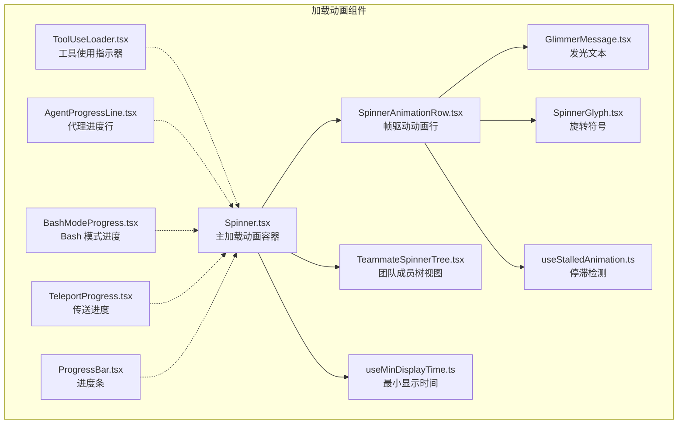
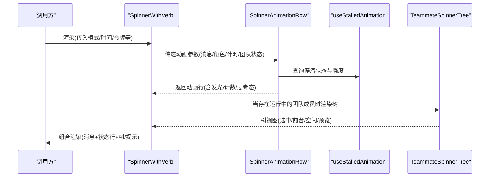
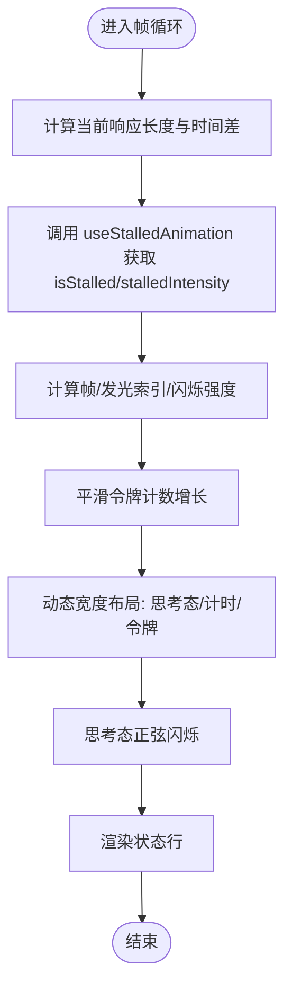
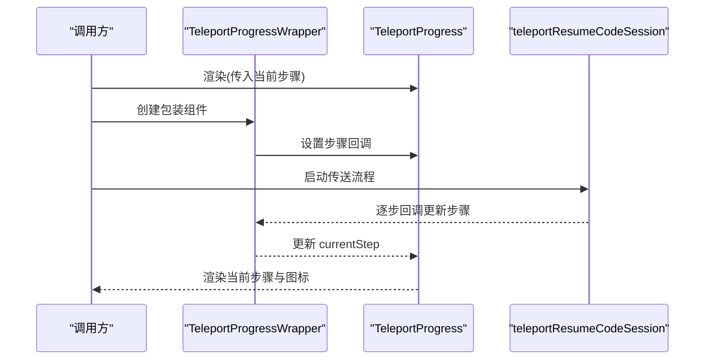
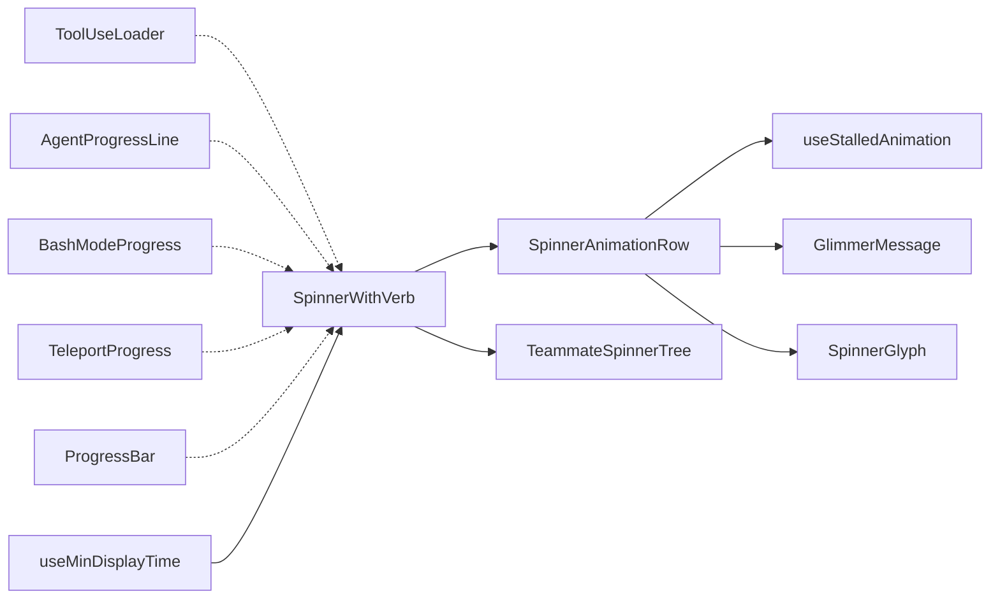

# 加载动画组件

<cite>
**本文引用的文件**
- [Spinner.tsx](file://src/components/Spinner.tsx)
- [SpinnerAnimationRow.tsx](file://src/components/Spinner/SpinnerAnimationRow.tsx)
- [TeammateSpinnerTree.tsx](file://src/components/Spinner/TeammateSpinnerTree.tsx)
- [useStalledAnimation.ts](file://src/components/Spinner/useStalledAnimation.ts)
- [GlimmerMessage.tsx](file://src/components/Spinner/GlimmerMessage.tsx)
- [SpinnerGlyph.tsx](file://src/components/Spinner/SpinnerGlyph.tsx)
- [ToolUseLoader.tsx](file://src/components/ToolUseLoader.tsx)
- [ProgressBar.tsx](file://src/components/design-system/ProgressBar.tsx)
- [AgentProgressLine.tsx](file://src/components/AgentProgressLine.tsx)
- [BashModeProgress.tsx](file://src/components/BashModeProgress.tsx)
- [TeleportProgress.tsx](file://src/components/TeleportProgress.tsx)
- [useMinDisplayTime.ts](file://src/hooks/useMinDisplayTime.ts)
</cite>

## 目录
1. [简介](#简介)
2. [项目结构](#项目结构)
3. [核心组件](#核心组件)
4. [架构总览](#架构总览)
5. [详细组件分析](#详细组件分析)
6. [依赖关系分析](#依赖关系分析)
7. [性能考量](#性能考量)
8. [故障排查指南](#故障排查指南)
9. [结论](#结论)
10. [附录](#附录)

## 简介
本文件系统性介绍加载动画组件，覆盖团队成员加载动画、消息加载指示与进度条三类核心能力。内容包括：
- 视觉效果与动画时序：帧驱动、闪烁、渐变、停滞检测与颜色过渡
- 性能表现：帧率控制、最小显示时间、减少重渲染
- 实现机制：状态管理、自定义配置、主题适配
- 触发时机、取消机制与错误状态处理
- 场景化选择策略与用户体验优化
- 性能监控、内存与渲染优化最佳实践
- 使用示例与自定义动画开发指南

## 项目结构
加载动画相关代码集中于 components 子目录，围绕 Spinner 主组件及其子组件展开，并辅以设计系统中的 ProgressBar 与若干专用进度组件。

图表来源
- [Spinner.tsx:63-302](file://src/components/Spinner.tsx#L63-L302)
- [SpinnerAnimationRow.tsx:81-231](file://src/components/Spinner/SpinnerAnimationRow.tsx#L81-L231)
- [TeammateSpinnerTree.tsx:21-202](file://src/components/Spinner/TeammateSpinnerTree.tsx#L21-L202)
- [useStalledAnimation.ts:6-75](file://src/components/Spinner/useStalledAnimation.ts#L6-L75)
- [GlimmerMessage.tsx](file://src/components/Spinner/GlimmerMessage.tsx)
- [SpinnerGlyph.tsx](file://src/components/Spinner/SpinnerGlyph.tsx)
- [ToolUseLoader.tsx:11-41](file://src/components/ToolUseLoader.tsx#L11-L41)
- [AgentProgressLine.tsx:23-135](file://src/components/AgentProgressLine.tsx#L23-L135)
- [BashModeProgress.tsx:13-55](file://src/components/BashModeProgress.tsx#L13-L55)
- [TeleportProgress.tsx:30-112](file://src/components/TeleportProgress.tsx#L30-L112)
- [ProgressBar.tsx:27-85](file://src/components/design-system/ProgressBar.tsx#L27-L85)
- [useMinDisplayTime.ts:10-35](file://src/hooks/useMinDisplayTime.ts#L10-L35)

章节来源
- [Spinner.tsx:1-563](file://src/components/Spinner.tsx#L1-L563)
- [SpinnerAnimationRow.tsx:1-265](file://src/components/Spinner/SpinnerAnimationRow.tsx#L1-L265)
- [TeammateSpinnerTree.tsx:1-272](file://src/components/Spinner/TeammateSpinnerTree.tsx#L1-L272)
- [useStalledAnimation.ts:1-75](file://src/components/Spinner/useStalledAnimation.ts#L1-L75)
- [GlimmerMessage.tsx](file://src/components/Spinner/GlimmerMessage.tsx)
- [SpinnerGlyph.tsx](file://src/components/Spinner/SpinnerGlyph.tsx)
- [ToolUseLoader.tsx:1-42](file://src/components/ToolUseLoader.tsx#L1-L42)
- [ProgressBar.tsx:1-86](file://src/components/design-system/ProgressBar.tsx#L1-L86)
- [AgentProgressLine.tsx:1-136](file://src/components/AgentProgressLine.tsx#L1-L136)
- [BashModeProgress.tsx:1-56](file://src/components/BashModeProgress.tsx#L1-L56)
- [TeleportProgress.tsx:1-140](file://src/components/TeleportProgress.tsx#L1-L140)
- [useMinDisplayTime.ts:1-35](file://src/hooks/useMinDisplayTime.ts#L1-L35)

## 核心组件
- SpinnerWithVerb：根据模式与应用状态选择“简版”或“完整版”加载动画；负责思考态展示、提示信息、任务列表与团队成员树视图的组合渲染。
- SpinnerAnimationRow：帧驱动的动画行，负责计时、停滞检测、发光文本、令牌计数平滑增长、思考态闪烁等。
- TeammateSpinnerTree：团队成员树视图，支持选中高亮、前台聚焦、消息预览、空闲状态等。
- ToolUseLoader：工具使用状态指示（错误/成功/未解析），支持闪烁与颜色切换。
- ProgressBar：字符块填充的进度条，支持填充色与背景色。
- AgentProgressLine：代理任务进度行，展示类型、描述、工具使用次数、令牌数、异步状态与最后工具信息。
- BashModeProgress：Bash 模式下的输入与输出进度展示。
- TeleportProgress：会话传送过程的步骤与动画，包含帧驱动旋转符号与步骤图标。
- useStalledAnimation：基于动画时钟的停滞检测与强度平滑过渡。
- useMinDisplayTime：最小显示时间节流，避免快速闪烁。

章节来源
- [Spinner.tsx:63-302](file://src/components/Spinner.tsx#L63-L302)
- [SpinnerAnimationRow.tsx:81-231](file://src/components/Spinner/SpinnerAnimationRow.tsx#L81-L231)
- [TeammateSpinnerTree.tsx:21-202](file://src/components/Spinner/TeammateSpinnerTree.tsx#L21-L202)
- [ToolUseLoader.tsx:11-41](file://src/components/ToolUseLoader.tsx#L11-L41)
- [ProgressBar.tsx:27-85](file://src/components/design-system/ProgressBar.tsx#L27-L85)
- [AgentProgressLine.tsx:23-135](file://src/components/AgentProgressLine.tsx#L23-L135)
- [BashModeProgress.tsx:13-55](file://src/components/BashModeProgress.tsx#L13-L55)
- [TeleportProgress.tsx:30-112](file://src/components/TeleportProgress.tsx#L30-L112)
- [useStalledAnimation.ts:6-75](file://src/components/Spinner/useStalledAnimation.ts#L6-L75)
- [useMinDisplayTime.ts:10-35](file://src/hooks/useMinDisplayTime.ts#L10-L35)

## 架构总览
下图展示 Spinner 主流程与关键子组件的交互关系，以及帧驱动与状态派生路径。

图表来源
- [Spinner.tsx:83-301](file://src/components/Spinner.tsx#L83-L301)
- [SpinnerAnimationRow.tsx:81-231](file://src/components/Spinner/SpinnerAnimationRow.tsx#L81-L231)
- [useStalledAnimation.ts:6-75](file://src/components/Spinner/useStalledAnimation.ts#L6-L75)
- [TeammateSpinnerTree.tsx:21-202](file://src/components/Spinner/TeammateSpinnerTree.tsx#L21-L202)

## 详细组件分析

### SpinnerWithVerb（主加载动画）
- 功能要点
  - 根据 isBriefOnly 与特性开关选择简版或完整版 Spinner。
  - 计算思考态显示逻辑，保证至少 2 秒展示后清理。
  - 随机选取动词作为消息前缀，支持前台聚焦团队成员动词覆盖。
  - 聚合令牌统计（领导与团队成员），在树视图与非树视图下行为不同。
  - 在领导空闲且团队成员运行时，显示静态空闲状态而非动画。
  - 基于时间阈值显示提示、预算信息与待办事项。
- 关键状态与派生
  - thinkingStatus：'thinking'|毫秒数|null，受最小展示时间约束。
  - leaderTokens/teammateTokens：令牌聚合与格式化。
  - ttftText：外部指标文本拼接（按需）。
  - 提示与预算文本：基于设置与时间阈值动态生成。
- 主题与颜色
  - messageColor/shimmerColor 可通过 overrideColor/overrideShimmerColor 覆盖。
- 性能优化
  - 将帧驱动逻辑下沉至子组件，父组件仅在 props 或状态变化时重渲染。
  - 复杂计算（如字符串宽度）在子组件内缓存。

章节来源
- [Spinner.tsx:63-302](file://src/components/Spinner.tsx#L63-L302)

### SpinnerAnimationRow（帧驱动动画行）
- 功能要点
  - 基于 useAnimationFrame(50) 的时间源，派生帧、发光索引、闪烁强度、停滞强度。
  - 平滑令牌计数增长，依据差距自适应增量。
  - 动态宽度布局：在消息宽度固定的前提下，按可用空间依次尝试显示思考态、计时器与令牌数。
  - 思考态闪烁：基于共享时间源的正弦曲线，延迟后开始渐变。
  - 团队成员前台聚焦时，状态行包裹提示信息。
- 关键算法
  - useStalledAnimation：以动画时钟推导“无新令牌时间”，超过阈值后线性过渡到红色强度。
  - tokenCounterRef：平滑增量，小差距快速推进，大差距保守增长。
  - progressive width gating：按优先级裁剪显示项，确保可读性。
- 主题与颜色
  - 支持 overrideColor 抑制停滞红化。
  - shimmerColor 用于发光文本与思考态闪烁。

图表来源
- [SpinnerAnimationRow.tsx:103-231](file://src/components/Spinner/SpinnerAnimationRow.tsx#L103-L231)
- [useStalledAnimation.ts:6-75](file://src/components/Spinner/useStalledAnimation.ts#L6-L75)

章节来源
- [SpinnerAnimationRow.tsx:81-231](file://src/components/Spinner/SpinnerAnimationRow.tsx#L81-L231)
- [useStalledAnimation.ts:6-75](file://src/components/Spinner/useStalledAnimation.ts#L6-L75)

### TeammateSpinnerTree（团队成员树视图）
- 功能要点
  - 排序并筛选运行中的团队成员，构建树形结构。
  - 支持前台聚焦、选中高亮、隐藏选项、消息预览等。
  - 显示领导动词、令牌数与空闲状态文本。
- 交互细节
  - 选中态与前景态高亮，结合提示文本引导用户操作。
  - 当无运行成员时返回空。

章节来源
- [TeammateSpinnerTree.tsx:21-202](file://src/components/Spinner/TeammateSpinnerTree.tsx#L21-L202)

### ToolUseLoader（工具使用指示器）
- 功能要点
  - 根据 isError/isUnresolved/shouldAnimate 切换颜色与闪烁。
  - 错误态使用 error 主题色，成功态使用 success 主题色，未解析保持暗色。
- 适用场景
  - 行内工具执行状态反馈，配合 AgentProgressLine 使用。

章节来源
- [ToolUseLoader.tsx:11-41](file://src/components/ToolUseLoader.tsx#L11-L41)

### ProgressBar（进度条）
- 功能要点
  - 以字符块近似绘制进度条，支持填充色与背景色。
  - 宽度与比例由外部传入，内部进行分段拼接。
- 适用场景
  - 文件传输、下载、构建等阶段进度可视化。

章节来源
- [ProgressBar.tsx:27-85](file://src/components/design-system/ProgressBar.tsx#L27-L85)

### AgentProgressLine（代理进度行）
- 功能要点
  - 展示代理类型、名称、描述、工具使用次数、令牌数。
  - 异步完成态显示“后台运行”或“已完成”。
  - 最后工具信息与是否隐藏类型可配置。
- 适用场景
  - 多代理协同任务的进度与状态展示。

章节来源
- [AgentProgressLine.tsx:23-135](file://src/components/AgentProgressLine.tsx#L23-L135)

### BashModeProgress（Bash 模式进度）
- 功能要点
  - 渲染用户 Bash 输入与实时输出进度。
  - 支持详细模式与空进度回退到默认渲染。
- 适用场景
  - 本地命令执行过程的可视化。

章节来源
- [BashModeProgress.tsx:13-55](file://src/components/BashModeProgress.tsx#L13-L55)

### TeleportProgress（传送进度）
- 功能要点
  - 步骤化展示：校验、拉取日志、获取分支、检出分支。
  - 帧驱动旋转符号与步骤图标，当前步骤高亮。
  - 提供 teleportWithProgress 包装函数，统一渲染与流程控制。
- 适用场景
  - 远程会话恢复过程的进度 UI。

图表来源
- [TeleportProgress.tsx:118-139](file://src/components/TeleportProgress.tsx#L118-L139)

章节来源
- [TeleportProgress.tsx:30-140](file://src/components/TeleportProgress.tsx#L30-L140)

## 依赖关系分析
- 组件耦合
  - SpinnerWithVerb 与 SpinnerAnimationRow 通过 props 传递动画参数，实现“渲染层”与“动画层”的解耦。
  - TeammateSpinnerTree 依赖应用状态与任务集合，独立渲染树视图。
  - useStalledAnimation 作为纯函数钩子被动画行复用，降低重复订阅。
- 外部依赖
  - useAnimationFrame：统一帧驱动时钟。
  - 主题系统：通过 Theme 键名映射 Ink 颜色。
  - 字符宽度计算：stringWidth 用于布局裁剪。
- 循环依赖
  - 未发现直接循环依赖；组件间通过 props 与状态单向流动。

图表来源
- [Spinner.tsx:63-302](file://src/components/Spinner.tsx#L63-L302)
- [SpinnerAnimationRow.tsx:81-231](file://src/components/Spinner/SpinnerAnimationRow.tsx#L81-L231)
- [TeammateSpinnerTree.tsx:21-202](file://src/components/Spinner/TeammateSpinnerTree.tsx#L21-L202)
- [useStalledAnimation.ts:6-75](file://src/components/Spinner/useStalledAnimation.ts#L6-L75)
- [GlimmerMessage.tsx](file://src/components/Spinner/GlimmerMessage.tsx)
- [SpinnerGlyph.tsx](file://src/components/Spinner/SpinnerGlyph.tsx)
- [ToolUseLoader.tsx:11-41](file://src/components/ToolUseLoader.tsx#L11-L41)
- [AgentProgressLine.tsx:23-135](file://src/components/AgentProgressLine.tsx#L23-L135)
- [BashModeProgress.tsx:13-55](file://src/components/BashModeProgress.tsx#L13-L55)
- [TeleportProgress.tsx:30-112](file://src/components/TeleportProgress.tsx#L30-L112)
- [ProgressBar.tsx:27-85](file://src/components/design-system/ProgressBar.tsx#L27-L85)
- [useMinDisplayTime.ts:10-35](file://src/hooks/useMinDisplayTime.ts#L10-L35)

## 性能考量
- 帧驱动与渲染频率
  - 动画行使用 50ms 帧，主组件仅在 props 或状态变化时重渲染，显著降低热路径开销。
  - 简版 Spinner 使用 120ms 帧，进一步降低 CPU 占用。
- 布局与文本测量
  - 字符宽度计算昂贵，已在动画行内显式缓存，避免每帧重复计算。
- 停滞检测与颜色过渡
  - 停滞强度采用 50ms 步进的平滑插值，避免抖动；在减少动效模式下直接切换。
- 最小显示时间
  - 使用 useMinDisplayTime 防止状态快速闪烁，提升可读性。
- 内存与渲染优化建议
  - 避免在热路径中创建临时对象；复用 Ref 与 useMemo。
  - 控制状态粒度，尽量将派生数据放在渲染函数内计算。
  - 对长列表使用虚拟化或分页策略，减少一次性渲染节点数量。

章节来源
- [Spinner.tsx:101-106](file://src/components/Spinner.tsx#L101-L106)
- [SpinnerAnimationRow.tsx:131-159](file://src/components/Spinner/SpinnerAnimationRow.tsx#L131-L159)
- [useStalledAnimation.ts:48-75](file://src/components/Spinner/useStalledAnimation.ts#L48-L75)
- [useMinDisplayTime.ts:10-35](file://src/hooks/useMinDisplayTime.ts#L10-L35)

## 故障排查指南
- 动画不刷新或卡顿
  - 检查 useAnimationFrame 是否被禁用（减少动效模式）。
  - 确认 props 是否稳定，避免不必要的重渲染导致热路径阻塞。
- 停滞检测异常
  - 确保 hasActiveTools 与 leaderIsIdle 参数正确传递，避免误判。
  - 检查 responseLengthRef 是否随令牌到达而更新。
- 文本截断与布局错位
  - 确认 columns 与消息宽度计算一致；必要时调整消息长度或禁用冗余状态项。
- 错误状态未显示
  - 工具使用指示器需同时满足 isError 与 shouldAnimate 才会闪烁；检查调用方状态。
- 传送进度不更新
  - 确认 teleportWithProgress 中的 setStep 回调被正确调用，且当前步骤索引与映射一致。

章节来源
- [useStalledAnimation.ts:6-75](file://src/components/Spinner/useStalledAnimation.ts#L6-L75)
- [ToolUseLoader.tsx:11-41](file://src/components/ToolUseLoader.tsx#L11-L41)
- [TeleportProgress.tsx:118-139](file://src/components/TeleportProgress.tsx#L118-L139)

## 结论
加载动画组件通过“主容器 + 帧驱动子组件”的架构实现了高可读性与低开销的动画体验。核心亮点包括：
- 基于共享动画时钟的状态派生与平滑过渡
- 动态布局裁剪与最小显示时间保障可读性
- 多场景进度组件（团队树、工具使用、进度条、传送）的统一设计语言
建议在实际使用中结合场景选择合适组件，并遵循性能与可访问性最佳实践。

## 附录

### 使用示例与集成建议
- 团队成员加载动画
  - 在需要显示团队成员树时，使用 TeammateSpinnerTree 并传入运行中的任务集合。
  - 通过前台聚焦参数控制高亮与状态行包裹。
- 消息加载指示
  - 在消息响应过程中使用 SpinnerWithVerb，自动处理思考态、计时与令牌统计。
  - 如需简版 UI，启用简版模式并在空闲时使用 BriefIdleStatus 占位。
- 进度条
  - 使用 ProgressBar 按比例与宽度绘制进度条，配合主题色实现一致性视觉。
- 工具使用与代理进度
  - ToolUseLoader 与 AgentProgressLine 分别用于行内状态与多代理任务展示。
- Bash 与传送
  - BashModeProgress 与 TeleportProgress 提供对应场景的进度与步骤可视化。

### 自定义动画开发指南
- 帧驱动
  - 使用 useAnimationFrame(间隔) 获取时间戳，按 50ms 或 100ms 步进派生状态。
- 状态派生
  - 将“时间相关”状态（如闪烁、颜色过渡）集中在子组件内计算并缓存。
- 主题适配
  - 通过 Theme 键名映射颜色，支持 overrideColor/overrideShimmerColor 覆盖。
- 可访问性
  - 提供减少动效模式开关，避免对光敏用户造成不适。
- 性能监控
  - 在高频更新区域使用最小显示时间钩子，避免过度重绘。