# 对话框组件

<cite>
**本文引用的文件**
- [dialogLaunchers.tsx](file://src/dialogLaunchers.tsx)
- [Dialog.tsx](file://src/components/design-system/Dialog.tsx)
- [InvalidSettingsDialog.tsx](file://src/components/InvalidSettingsDialog.tsx)
- [ExportDialog.tsx](file://src/components/ExportDialog.tsx)
- [GlobalSearchDialog.tsx](file://src/components/GlobalSearchDialog.tsx)
- [HistorySearchDialog.tsx](file://src/components/HistorySearchDialog.tsx)
- [IdeOnboardingDialog.tsx](file://src/components/IdeOnboardingDialog.tsx)
- [AutoModeOptInDialog.tsx](file://src/components/AutoModeOptInDialog.tsx)
- [Feedback.tsx](file://src/components/Feedback.tsx)
- [TrustDialog.tsx](file://src/components/TrustDialog/TrustDialog.tsx)
- [modalContext.tsx](file://src/context/modalContext.tsx)
</cite>

## 目录
1. [简介](#简介)
2. [项目结构](#项目结构)
3. [核心组件](#核心组件)
4. [架构总览](#架构总览)
5. [详细组件分析](#详细组件分析)
6. [依赖关系分析](#依赖关系分析)
7. [性能考量](#性能考量)
8. [故障排查指南](#故障排查指南)
9. [结论](#结论)
10. [附录](#附录)

## 简介
本文件系统化梳理并说明本仓库中“对话框组件”的设计与实现，覆盖以下主题：
- 设计模式：确认型、设置型、反馈型对话框的职责边界与交互流程
- 交互与状态管理：多步骤状态机、键盘导航、焦点控制、取消与退出策略
- 模态管理：在全屏布局与模态槽位中的尺寸与滚动行为
- 动态加载与异步处理：搜索、导出、提交反馈等异步路径与错误处理
- 可访问性与键盘导航：统一的确认/取消键绑定、输入引导提示、Esc 与 Ctrl+C/D 的语义
- 实际使用场景与最佳实践：如何在命令入口、设置校验、权限信任、全局搜索、历史检索、导出与反馈等场景中正确使用

## 项目结构
对话框相关代码主要分布在以下区域：
- 设计系统层：通用对话框容器与基础能力（标题、副标题、边框、颜色、输入引导）
- 具体对话框：设置校验、导出、全局搜索、历史检索、IDE 首次引导、自动模式许可、反馈、信任确认等
- 启动器：集中管理一次性对话框的动态导入与回调桥接
- 上下文：模态槽位上下文，用于在特定布局中提供尺寸与滚动参考

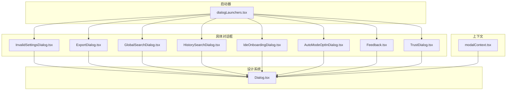

图表来源
- [Dialog.tsx:1-138](file://src/components/design-system/Dialog.tsx#L1-L138)
- [dialogLaunchers.tsx:1-133](file://src/dialogLaunchers.tsx#L1-L133)
- [InvalidSettingsDialog.tsx:1-89](file://src/components/InvalidSettingsDialog.tsx#L1-L89)
- [ExportDialog.tsx:1-128](file://src/components/ExportDialog.tsx#L1-L128)
- [GlobalSearchDialog.tsx:1-343](file://src/components/GlobalSearchDialog.tsx#L1-L343)
- [HistorySearchDialog.tsx:1-118](file://src/components/HistorySearchDialog.tsx#L1-L118)
- [IdeOnboardingDialog.tsx:1-167](file://src/components/IdeOnboardingDialog.tsx#L1-L167)
- [AutoModeOptInDialog.tsx:1-142](file://src/components/AutoModeOptInDialog.tsx#L1-L142)
- [Feedback.tsx:1-596](file://src/components/Feedback.tsx#L1-L596)
- [TrustDialog.tsx:1-290](file://src/components/TrustDialog/TrustDialog.tsx#L1-L290)
- [modalContext.tsx:1-58](file://src/context/modalContext.tsx#L1-L58)

章节来源
- [dialogLaunchers.tsx:1-133](file://src/dialogLaunchers.tsx#L1-L133)
- [Dialog.tsx:1-138](file://src/components/design-system/Dialog.tsx#L1-L138)
- [modalContext.tsx:1-58](file://src/context/modalContext.tsx#L1-L58)

## 核心组件
- 通用对话框容器：提供标题、副标题、颜色主题、边框、输入引导、确认/取消键绑定、退出键（Ctrl+C/D）处理、以及是否激活取消逻辑的开关
- 具体对话框：围绕不同业务场景封装状态机与交互，如设置校验、导出、搜索、历史检索、首次引导、自动模式许可、反馈、信任确认

关键点
- 统一的取消与退出策略：Esc 或 confirm:no 触发 onCancel；Ctrl+C/D 或 app:exit/interrupt 在 isCancelActive 为真时由容器接管
- 输入引导：默认显示 Enter 确认、Esc 取消；当退出处于“待确认”状态时提示再次按键退出
- 主题颜色：通过 color 属性区分权限、警告、IDE 等场景色

章节来源
- [Dialog.tsx:1-138](file://src/components/design-system/Dialog.tsx#L1-L138)

## 架构总览
对话框的调用链通常如下：
- 命令或入口通过启动器动态导入目标对话框组件
- 启动器将 done 回调注入到对话框，保证与原内联调用一致的完成/取消语义
- 对话框内部根据业务状态切换 UI 步骤，并通过 onCancel 或 done 完成生命周期

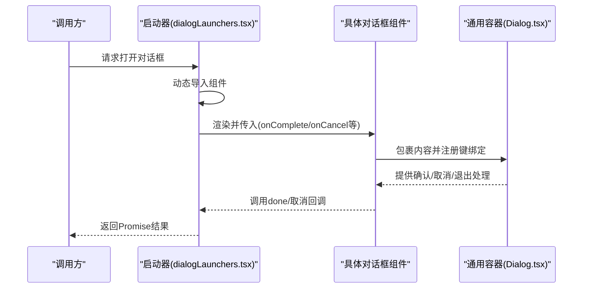

图表来源
- [dialogLaunchers.tsx:25-96](file://src/dialogLaunchers.tsx#L25-L96)
- [Dialog.tsx:30-137](file://src/components/design-system/Dialog.tsx#L30-L137)

章节来源
- [dialogLaunchers.tsx:1-133](file://src/dialogLaunchers.tsx#L1-L133)

## 详细组件分析

### 通用对话框容器：Dialog
- 职责：统一处理确认/取消键、退出键、输入引导、颜色主题与边框渲染
- 关键特性：
  - isCancelActive 控制是否拦截 confirm:no（默认激活）
  - 支持自定义 inputGuide 或隐藏输入引导
  - 默认提供 Enter 确认与 Esc 取消的快捷提示
  - 退出键（Ctrl+C/D）通过上下文钩子处理，支持“待确认”二次按下才退出
- 使用建议：
  - 文本输入期间建议将 isCancelActive 设为 false，避免键被容器消费
  - 自定义 inputGuide 时应考虑退出键待确认状态

章节来源
- [Dialog.tsx:1-138](file://src/components/design-system/Dialog.tsx#L1-L138)

### 设置校验对话框：InvalidSettingsDialog
- 场景：配置文件存在校验错误时，用户需选择继续（跳过无效项）或退出修复
- 交互流程：
  - 列表展示错误项
  - 用户选择“退出并手动修复”或“继续但跳过这些设置”
  - 通过回调 onContinue/onExit 完成后续流程
- 错误处理：仅在用户选择继续时跳过无效项，否则保持退出

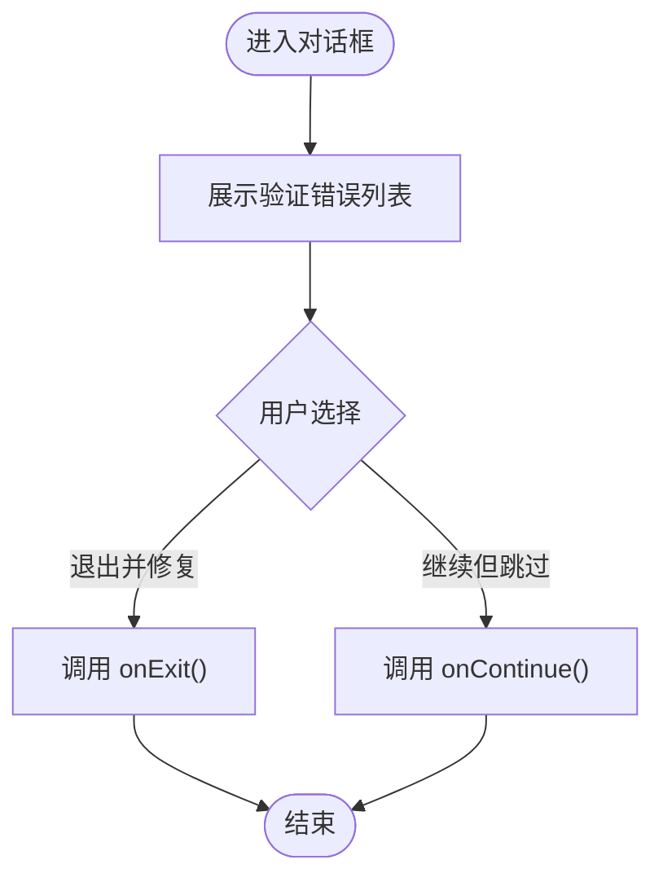

图表来源
- [InvalidSettingsDialog.tsx:18-88](file://src/components/InvalidSettingsDialog.tsx#L18-L88)

章节来源
- [InvalidSettingsDialog.tsx:1-89](file://src/components/InvalidSettingsDialog.tsx#L1-L89)

### 导出对话框：ExportDialog
- 场景：将会话内容导出到剪贴板或当前目录文件
- 交互流程：
  - 选项选择：复制到剪贴板或保存到文件
  - 文件名输入：支持回退到选项列表；输入框聚焦与光标偏移控制
  - 异步导出：写入文件，捕获异常并返回结果
  - 取消：Esc 或取消按钮触发 onDone 并携带状态消息
- 键盘导航：在文件名输入时将 confirm:no 作用域限定为 Settings，允许输入 'n'

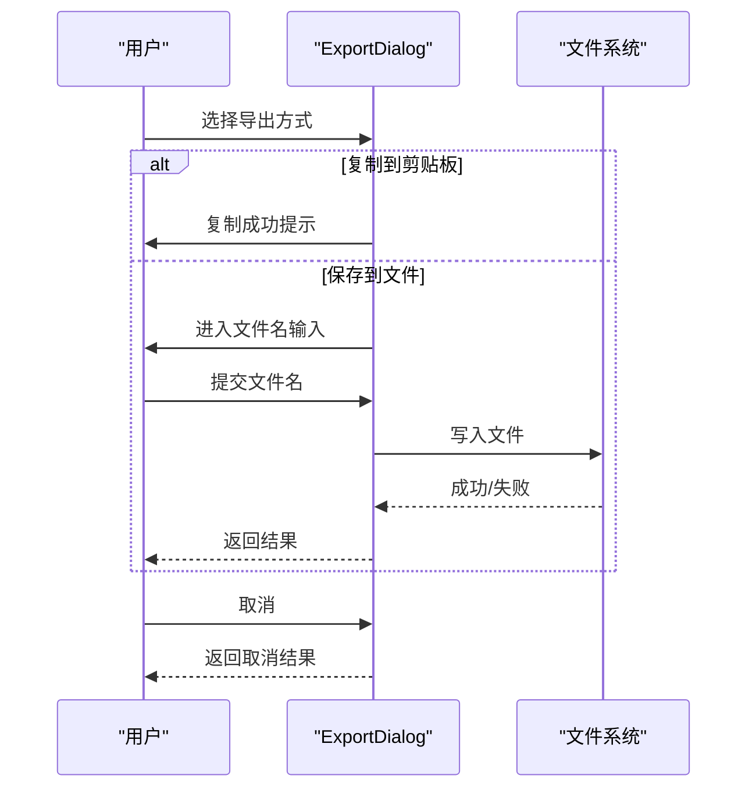

图表来源
- [ExportDialog.tsx:25-127](file://src/components/ExportDialog.tsx#L25-L127)

章节来源
- [ExportDialog.tsx:1-128](file://src/components/ExportDialog.tsx#L1-L128)

### 全局搜索对话框：GlobalSearchDialog
- 场景：跨工作区全文检索，支持模糊匹配、预览、插入路径/提及语法
- 交互流程：
  - 输入查询，防抖触发搜索
  - 列表展示匹配项，支持方向键/Tab 切换动作
  - 预览面板按右侧或底部布局，展示上下文行
  - 支持打开编辑器、插入路径或 @提及语法
- 性能与限制：最大匹配数、每文件最大匹配数、内存上限、AbortController 中断

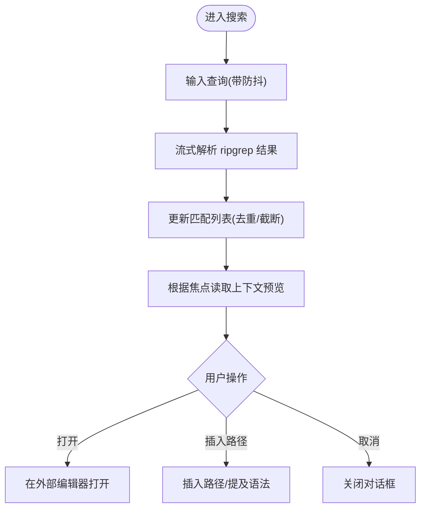

图表来源
- [GlobalSearchDialog.tsx:38-342](file://src/components/GlobalSearchDialog.tsx#L38-L342)

章节来源
- [GlobalSearchDialog.tsx:1-343](file://src/components/GlobalSearchDialog.tsx#L1-L343)

### 历史检索对话框：HistorySearchDialog
- 场景：检索历史记录，支持模糊匹配与时间标签预览
- 交互流程：
  - 异步加载历史条目，构建首行与相对时间信息
  - 搜索过滤：精确匹配优先，其次子序列匹配
  - 预览面板展示多行摘要，支持右侧或底部布局
  - 选中后解析并回调 onSelect

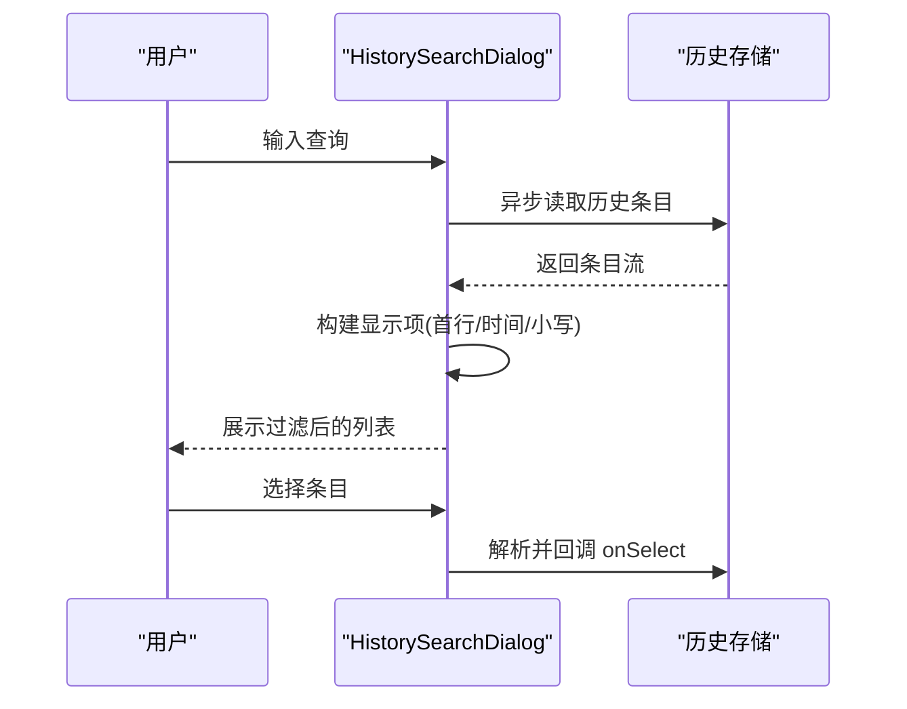

图表来源
- [HistorySearchDialog.tsx:27-110](file://src/components/HistorySearchDialog.tsx#L27-L110)

章节来源
- [HistorySearchDialog.tsx:1-118](file://src/components/HistorySearchDialog.tsx#L1-L118)

### IDE 首次引导对话框：IdeOnboardingDialog
- 场景：首次在终端中引导用户了解 IDE 集成与快捷键
- 交互流程：
  - 显示欢迎信息、IDE 类型与已安装插件/扩展版本
  - 快捷键提示（如 Cmd+Option+K）
  - 一键确认继续，记录“已展示”标记
- 键绑定：统一 confirm:yes/no 绑定至 onDone

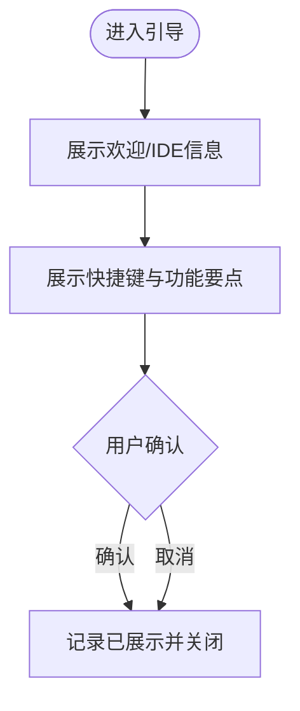

图表来源
- [IdeOnboardingDialog.tsx:14-148](file://src/components/IdeOnboardingDialog.tsx#L14-L148)

章节来源
- [IdeOnboardingDialog.tsx:1-167](file://src/components/IdeOnboardingDialog.tsx#L1-L167)

### 自动模式许可对话框：AutoModeOptInDialog
- 场景：启用自动权限模式前的许可与默认模式设置
- 交互流程：
  - 展示风险说明与链接
  - 选项：接受（可选设为默认）、接受并设为默认、拒绝
  - 更新设置并回调 onAccept/onDecline
- 数据与日志：展示事件与设置变更

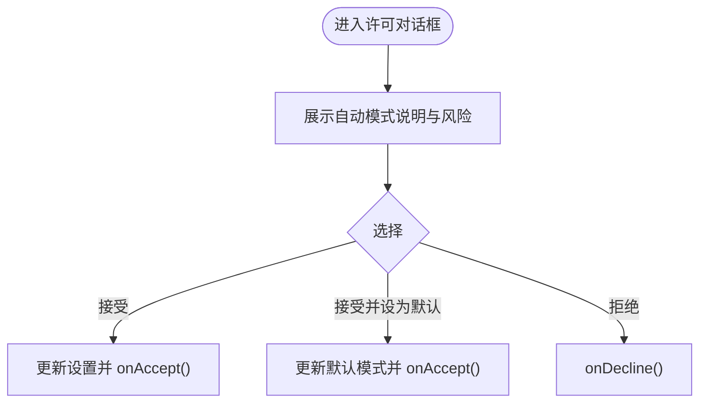

图表来源
- [AutoModeOptInDialog.tsx:17-138](file://src/components/AutoModeOptInDialog.tsx#L17-L138)

章节来源
- [AutoModeOptInDialog.tsx:1-142](file://src/components/AutoModeOptInDialog.tsx#L1-L142)

### 反馈/缺陷报告对话框：Feedback
- 场景：收集用户反馈与错误日志，生成标题并可打开 GitHub Issue
- 交互流程：
  - 步骤机：用户输入 -> 同意 -> 提交中 -> 完成
  - 输入阶段：文本输入，支持在 Settings 上下文中避免误触 confirm:no
  - 同意阶段：汇总环境信息、会话与错误日志，准备提交
  - 提交阶段：异步提交，处理网络错误、组织策略限制等
  - 完成阶段：显示反馈 ID，Enter 打开 GitHub Issue，其他键关闭
- 安全与隐私：敏感信息脱敏、URL 长度限制、必要时截断

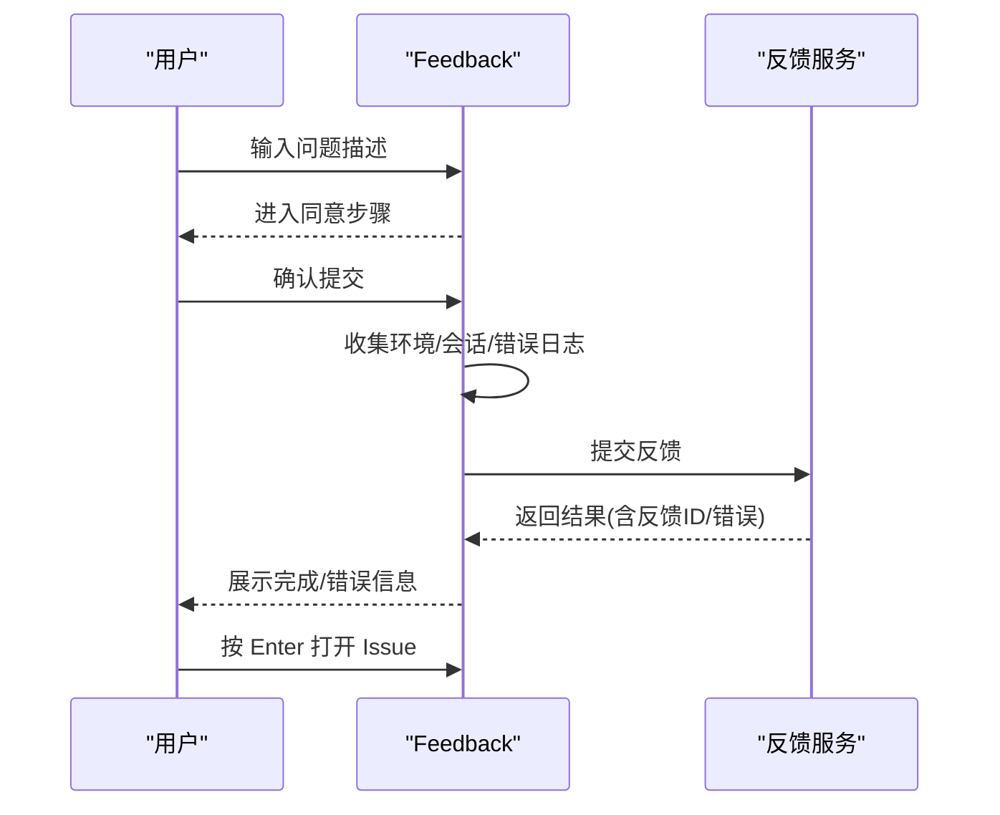

图表来源
- [Feedback.tsx:157-395](file://src/components/Feedback.tsx#L157-L395)

章节来源
- [Feedback.tsx:1-596](file://src/components/Feedback.tsx#L1-L596)

### 信任确认对话框：TrustDialog
- 场景：在工作区执行潜在高风险操作前进行信任确认
- 交互流程：
  - 检测项目范围内的 MCP 服务器、危险设置源、脚本/工具来源等
  - 展示当前工作目录与安全提示
  - 选项：信任并继续、退出
  - 首次在主目录时可直接记录会话信任，否则持久化到项目配置
- 键绑定：confirm:no 与 app:exit 绑定至退出或关闭

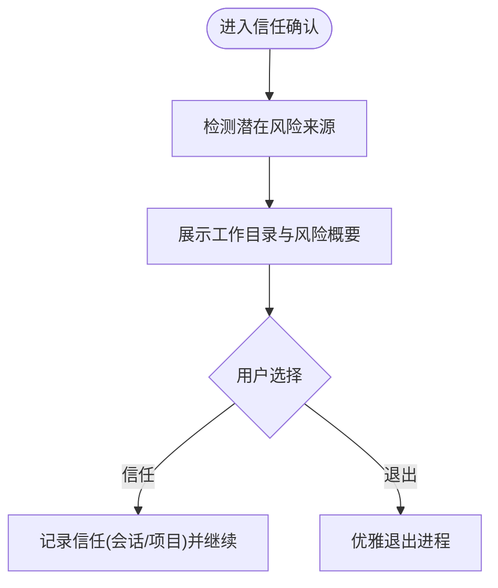

图表来源
- [TrustDialog.tsx:23-264](file://src/components/TrustDialog/TrustDialog.tsx#L23-L264)

章节来源
- [TrustDialog.tsx:1-290](file://src/components/TrustDialog/TrustDialog.tsx#L1-L290)

## 依赖关系分析
- 启动器到对话框：启动器负责动态导入与回调桥接，确保与原内联调用行为一致
- 对话框到容器：所有具体对话框均包裹 Dialog 容器，复用键绑定与输入引导
- 上下文对容器：Dialog 在模态槽位中可隐藏边框并使用上下文提供的尺寸
- 通用依赖：键绑定、退出键处理、终端尺寸、选择器、文本输入等

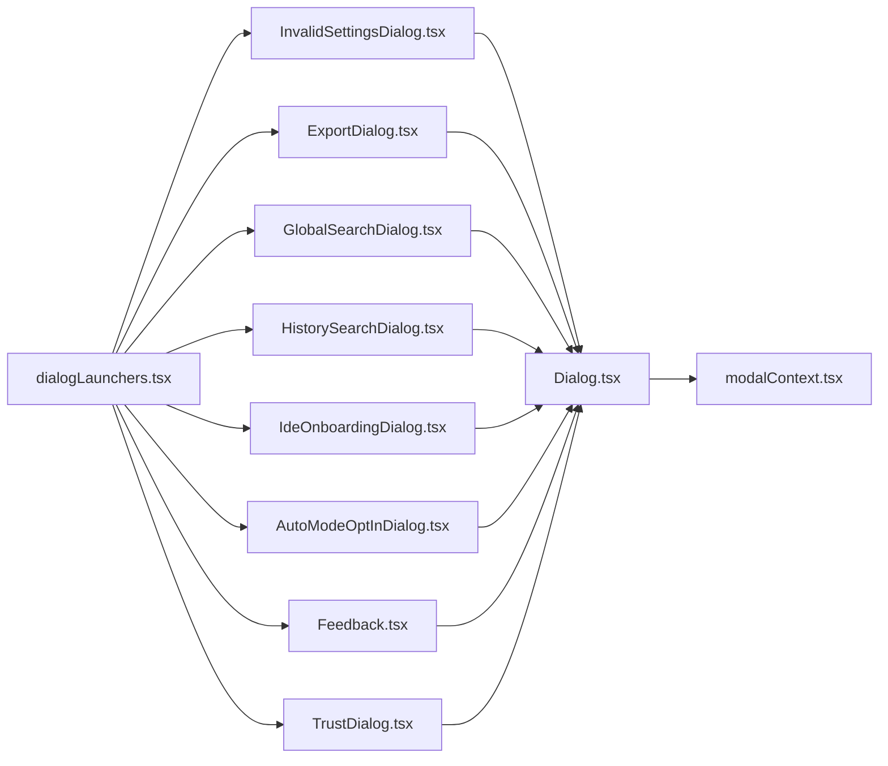

图表来源
- [dialogLaunchers.tsx:1-133](file://src/dialogLaunchers.tsx#L1-L133)
- [Dialog.tsx:1-138](file://src/components/design-system/Dialog.tsx#L1-L138)
- [modalContext.tsx:1-58](file://src/context/modalContext.tsx#L1-L58)

章节来源
- [dialogLaunchers.tsx:1-133](file://src/dialogLaunchers.tsx#L1-L133)
- [Dialog.tsx:1-138](file://src/components/design-system/Dialog.tsx#L1-L138)
- [modalContext.tsx:1-58](file://src/context/modalContext.tsx#L1-L58)

## 性能考量
- 搜索类对话框（全局搜索、历史检索）采用：
  - 防抖与流式解析，避免阻塞 UI
  - 最大匹配数与内存上限控制，防止超大结果集导致卡顿
  - AbortController 中断未完成请求
- 导出与反馈：
  - 文件写入与网络请求采用异步处理，及时返回结果
  - 反馈提交包含超时与错误分类处理，避免长时间挂起
- 模态槽位：
  - 使用上下文提供的可用行列数，避免组件基于完整终端尺寸导致溢出

章节来源
- [GlobalSearchDialog.tsx:265-342](file://src/components/GlobalSearchDialog.tsx#L265-L342)
- [HistorySearchDialog.tsx:32-90](file://src/components/HistorySearchDialog.tsx#L32-L90)
- [ExportDialog.tsx:57-88](file://src/components/ExportDialog.tsx#L57-L88)
- [Feedback.tsx:522-595](file://src/components/Feedback.tsx#L522-L595)
- [modalContext.tsx:38-54](file://src/context/modalContext.tsx#L38-L54)

## 故障排查指南
- 取消与退出行为异常
  - 确认 isCancelActive 是否符合预期（文本输入期间建议关闭）
  - 检查 confirm:no 与 app:exit 的上下文绑定是否正确
- 输入无法输入或被误消费
  - 在文本输入阶段将 confirm:no 作用域限定为 Settings，避免 Esc 被 Dialog 消费
- 搜索无结果或卡顿
  - 检查防抖与中断逻辑是否生效
  - 确认最大匹配数与每文件匹配数限制是否合理
- 导出失败
  - 捕获写入异常并返回 onDone 结果
  - 检查当前目录权限与文件名合法性
- 反馈提交失败
  - 检查网络状态与认证头刷新
  - 组织策略限制会返回特定错误类型，需提示用户

章节来源
- [Dialog.tsx:45-67](file://src/components/design-system/Dialog.tsx#L45-L67)
- [ExportDialog.tsx:57-88](file://src/components/ExportDialog.tsx#L57-L88)
- [Feedback.tsx:522-595](file://src/components/Feedback.tsx#L522-L595)

## 结论
本仓库的对话框体系以“通用容器 + 具体场景对话框 + 启动器桥接”的方式实现，既保证了交互一致性与可访问性，又兼顾了不同业务场景的状态复杂度与异步处理需求。通过统一的键绑定、输入引导与模态上下文，开发者可以在多种入口（命令、设置、权限、搜索、反馈等）中一致地集成对话框，提升用户体验与可维护性。

## 附录
- 最佳实践清单
  - 使用 Dialog 容器承载所有对话框，统一确认/取消与退出键处理
  - 文本输入期间关闭 isCancelActive，避免键被容器拦截
  - 在启动器中使用动态导入与 done 回调，保持与原内联调用一致的行为
  - 搜索与导出等异步流程提供明确的错误提示与回退路径
  - 反馈与信任对话框注意隐私与安全，对敏感信息进行脱敏处理
  - 在模态槽位中使用上下文提供的尺寸，避免溢出与布局错乱