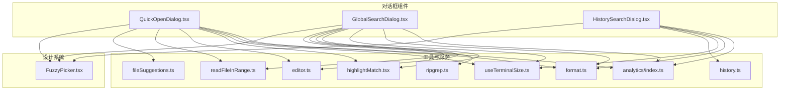
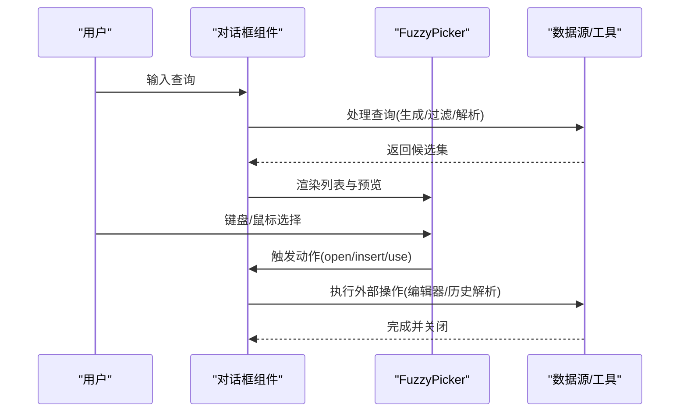
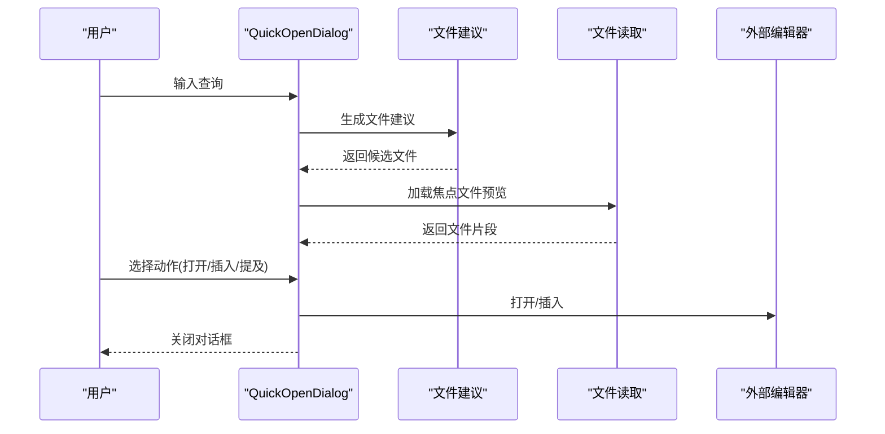
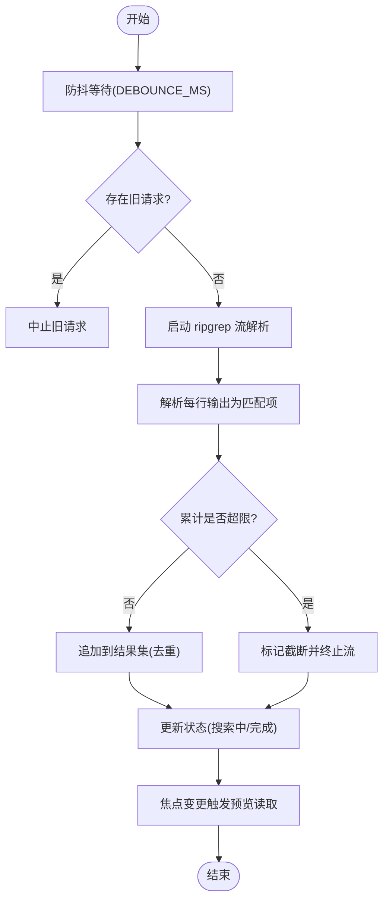
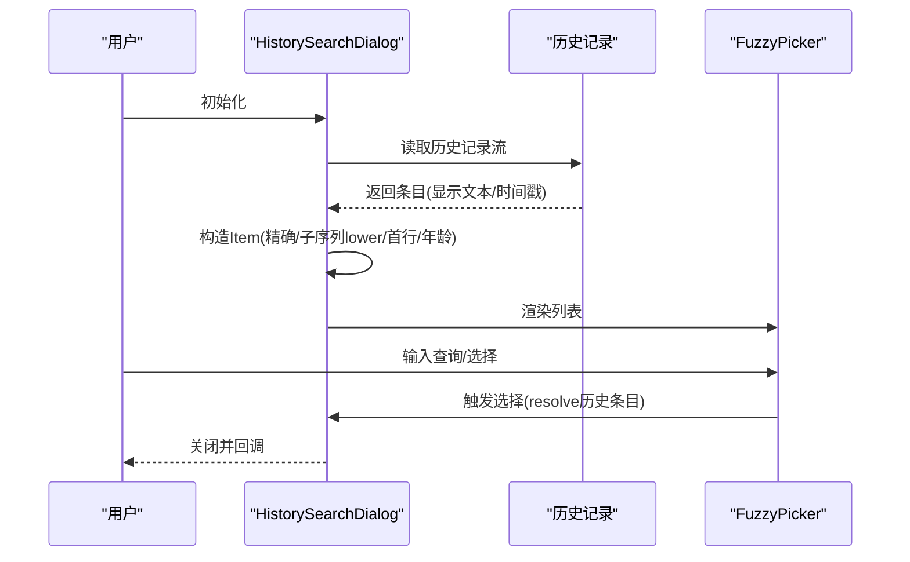
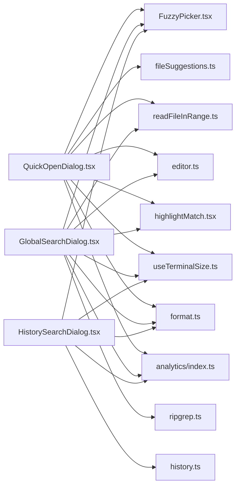

# 导航组件

<cite>
**本文引用的文件**
- [QuickOpenDialog.tsx](file://src/components/QuickOpenDialog.tsx)
- [GlobalSearchDialog.tsx](file://src/components/GlobalSearchDialog.tsx)
- [HistorySearchDialog.tsx](file://src/components/HistorySearchDialog.tsx)
- [SearchBox.tsx](file://src/components/SearchBox.tsx)
- [FuzzyPicker.tsx](file://src/components/design-system/FuzzyPicker.tsx)
- [fileSuggestions.ts](file://src/hooks/fileSuggestions.ts)
- [ripgrep.ts](file://src/utils/ripgrep.ts)
- [highlightMatch.tsx](file://src/utils/highlightMatch.tsx)
- [history.ts](file://src/history.ts)
- [useTerminalSize.ts](file://src/hooks/useTerminalSize.ts)
- [format.ts](file://src/utils/format.ts)
- [editor.ts](file://src/utils/editor.ts)
- [readFileInRange.ts](file://src/utils/readFileInRange.ts)
- [analytics/index.ts](file://src/services/analytics/index.ts)
</cite>

## 目录
1. [简介](#简介)
2. [项目结构](#项目结构)
3. [核心组件](#核心组件)
4. [架构总览](#架构总览)
5. [详细组件分析](#详细组件分析)
6. [依赖关系分析](#依赖关系分析)
7. [性能考量](#性能考量)
8. [故障排查指南](#故障排查指南)
9. [结论](#结论)
10. [附录](#附录)

## 简介
本文件面向“导航组件”的使用者与维护者，系统性阐述三类交互式导航对话框的设计理念、搜索算法与结果呈现方式：快速打开（文件级）、全局搜索（全文检索）与历史搜索（历史记录浏览）。文档覆盖以下主题：
- 快速打开对话框：基于文件建议的模糊选择、语法高亮预览、外部编辑器集成与键盘操作
- 全局搜索对话框：基于 ripgrep 的增量搜索、防抖与流式结果、结果截断与预览
- 历史搜索对话框：基于时间戳的历史记录流式加载、精确匹配与子序列模糊匹配
- 搜索高亮、快捷键绑定与键盘导航、性能优化与缓存策略、增量搜索与内存控制、个性化配置与使用统计

## 项目结构
导航组件由三个对话框组件与若干通用工具组成，围绕统一的模糊选择器 FuzzyPicker 构建，辅以终端尺寸感知、路径格式化、高亮渲染、文件读取与外部编辑器集成等能力。

图示来源
- [QuickOpenDialog.tsx:1-244](file://src/components/QuickOpenDialog.tsx#L1-L244)
- [GlobalSearchDialog.tsx:1-343](file://src/components/GlobalSearchDialog.tsx#L1-L343)
- [HistorySearchDialog.tsx:1-118](file://src/components/HistorySearchDialog.tsx#L1-L118)
- [FuzzyPicker.tsx](file://src/components/design-system/FuzzyPicker.tsx)
- [fileSuggestions.ts](file://src/hooks/fileSuggestions.ts)
- [ripgrep.ts](file://src/utils/ripgrep.ts)
- [highlightMatch.tsx](file://src/utils/highlightMatch.tsx)
- [history.ts](file://src/history.ts)
- [useTerminalSize.ts](file://src/hooks/useTerminalSize.ts)
- [format.ts](file://src/utils/format.ts)
- [editor.ts](file://src/utils/editor.ts)
- [readFileInRange.ts](file://src/utils/readFileInRange.ts)
- [analytics/index.ts](file://src/services/analytics/index.ts)

章节来源
- [QuickOpenDialog.tsx:1-244](file://src/components/QuickOpenDialog.tsx#L1-L244)
- [GlobalSearchDialog.tsx:1-343](file://src/components/GlobalSearchDialog.tsx#L1-L343)
- [HistorySearchDialog.tsx:1-118](file://src/components/HistorySearchDialog.tsx#L1-L118)

## 核心组件
- 快速打开对话框：提供文件级模糊搜索与语法高亮预览，支持在外部编辑器中打开或插入路径/提及
- 全局搜索对话框：提供工作区全文检索，支持防抖、流式结果、结果截断与上下文预览
- 历史搜索对话框：浏览历史记录，支持精确匹配与子序列模糊匹配，带相对时间标注与预览折叠
- 模糊选择器：统一的列表选择、键盘导航、预览布局与动作绑定组件
- 工具与服务：文件建议生成、ripgrep 流解析、高亮渲染、路径格式化、终端尺寸适配、外部编辑器集成、文件内容读取、事件埋点

章节来源
- [QuickOpenDialog.tsx:24-225](file://src/components/QuickOpenDialog.tsx#L24-L225)
- [GlobalSearchDialog.tsx:34-263](file://src/components/GlobalSearchDialog.tsx#L34-L263)
- [HistorySearchDialog.tsx:27-110](file://src/components/HistorySearchDialog.tsx#L27-L110)
- [FuzzyPicker.tsx](file://src/components/design-system/FuzzyPicker.tsx)

## 架构总览
三个对话框共享相同的 UI 框架（FuzzyPicker），通过不同的数据源与处理管线实现差异化功能：
- 快速打开：本地文件建议 → 过滤 → 预览 → 打开/插入
- 全局搜索：输入防抖 → ripgrep 流式解析 → 结果聚合与截断 → 预览 → 打开/插入
- 历史搜索：历史记录流式加载 → 精确/子序列匹配 → 预览 → 选择执行

图示来源
- [QuickOpenDialog.tsx:70-84](file://src/components/QuickOpenDialog.tsx#L70-L84)
- [GlobalSearchDialog.tsx:125-147](file://src/components/GlobalSearchDialog.tsx#L125-L147)
- [HistorySearchDialog.tsx:65-79](file://src/components/HistorySearchDialog.tsx#L65-L79)
- [FuzzyPicker.tsx](file://src/components/design-system/FuzzyPicker.tsx)

## 详细组件分析

### 快速打开对话框（文件级）
设计理念
- 快速定位并打开文件，支持在外部编辑器中打开或插入路径/提及
- 动态预览：根据终端宽度决定预览位置（右侧或底部），并按行数限制预览长度
- 高亮显示：对路径与预览文本进行高亮匹配
- 键盘操作：Tab/Shift+Tab 绑定“提及/插入”两种动作；Esc 取消

搜索与结果展示
- 数据源：文件建议生成器返回候选文件
- 过滤：仅保留文件项，去除目录分隔符结尾
- 排序：由建议生成器内部策略决定（不暴露具体算法）
- 预览：读取文件前若干行，支持取消与错误兜底

图示来源
- [QuickOpenDialog.tsx:70-148](file://src/components/QuickOpenDialog.tsx#L70-L148)
- [fileSuggestions.ts](file://src/hooks/fileSuggestions.ts)
- [readFileInRange.ts](file://src/utils/readFileInRange.ts)
- [editor.ts](file://src/utils/editor.ts)
- [highlightMatch.tsx](file://src/utils/highlightMatch.tsx)
- [format.ts](file://src/utils/format.ts)

章节来源
- [QuickOpenDialog.tsx:24-225](file://src/components/QuickOpenDialog.tsx#L24-L225)

### 全局搜索对话框（全文检索）
设计理念
- 在工作区内进行全文检索，支持防抖与流式结果
- 结果上限控制：单文件最大匹配数与总匹配数限制，避免内存膨胀
- 预览：聚焦项显示上下文行，支持取消与错误兜底
- 高亮显示：对匹配文本进行高亮

搜索与结果展示
- 数据源：ripgrep 流解析，逐行解析并转换为统一结构
- 过滤：实时对已有结果进行二次过滤，保持查询一致性
- 截断：达到总上限时主动终止搜索，并标记截断状态
- 预览：按行号计算上下文范围，读取片段并高亮匹配

图示来源
- [GlobalSearchDialog.tsx:125-311](file://src/components/GlobalSearchDialog.tsx#L125-L311)
- [ripgrep.ts](file://src/utils/ripgrep.ts)
- [readFileInRange.ts](file://src/utils/readFileInRange.ts)
- [highlightMatch.tsx](file://src/utils/highlightMatch.tsx)

章节来源
- [GlobalSearchDialog.tsx:34-263](file://src/components/GlobalSearchDialog.tsx#L34-L263)

### 历史搜索对话框（历史记录）
设计理念
- 流式加载历史记录，按时间倒序展示
- 支持精确匹配与子序列模糊匹配，优先展示精确匹配
- 预览：对历史条目进行 ANSI 包装与折行，限制预览行数并提示溢出

搜索与结果展示
- 数据源：历史记录迭代器，逐条读取并构造显示信息
- 过滤：先精确匹配，后子序列匹配，拼接顺序
- 预览：按宽度折行，限制行数并提示剩余行数

图示来源
- [HistorySearchDialog.tsx:38-89](file://src/components/HistorySearchDialog.tsx#L38-L89)
- [history.ts](file://src/history.ts)
- [format.ts](file://src/utils/format.ts)

章节来源
- [HistorySearchDialog.tsx:27-110](file://src/components/HistorySearchDialog.tsx#L27-L110)

### 模糊选择器（FuzzyPicker）
- 统一的列表渲染、键盘导航、预览区域布局与动作绑定
- 支持上移/下移、Tab/Shift+Tab 动作切换、Esc 取消
- 预览位置可选“右侧/底部”，宽度自适应

章节来源
- [FuzzyPicker.tsx](file://src/components/design-system/FuzzyPicker.tsx)

### 搜索高亮与键盘导航
- 高亮：对路径与文本进行高亮匹配，支持 ANSI 文本处理
- 键盘：Tab/Shift+Tab 绑定“提及/插入”动作；Esc 取消；方向键导航
- 预览：根据终端宽度与布局动态调整预览区域大小

章节来源
- [highlightMatch.tsx](file://src/utils/highlightMatch.tsx)
- [format.ts](file://src/utils/format.ts)
- [FuzzyPicker.tsx](file://src/components/design-system/FuzzyPicker.tsx)

## 依赖关系分析

图示来源
- [QuickOpenDialog.tsx:1-244](file://src/components/QuickOpenDialog.tsx#L1-L244)
- [GlobalSearchDialog.tsx:1-343](file://src/components/GlobalSearchDialog.tsx#L1-L343)
- [HistorySearchDialog.tsx:1-118](file://src/components/HistorySearchDialog.tsx#L1-L118)
- [FuzzyPicker.tsx](file://src/components/design-system/FuzzyPicker.tsx)
- [fileSuggestions.ts](file://src/hooks/fileSuggestions.ts)
- [ripgrep.ts](file://src/utils/ripgrep.ts)
- [highlightMatch.tsx](file://src/utils/highlightMatch.tsx)
- [history.ts](file://src/history.ts)
- [useTerminalSize.ts](file://src/hooks/useTerminalSize.ts)
- [format.ts](file://src/utils/format.ts)
- [editor.ts](file://src/utils/editor.ts)
- [readFileInRange.ts](file://src/utils/readFileInRange.ts)
- [analytics/index.ts](file://src/services/analytics/index.ts)

章节来源
- [QuickOpenDialog.tsx:1-244](file://src/components/QuickOpenDialog.tsx#L1-L244)
- [GlobalSearchDialog.tsx:1-343](file://src/components/GlobalSearchDialog.tsx#L1-L343)
- [HistorySearchDialog.tsx:1-118](file://src/components/HistorySearchDialog.tsx#L1-L118)

## 性能考量
- 快速打开
  - 查询生成与结果渲染采用记忆化与最小化重渲染策略
  - 预览读取支持取消与错误兜底，避免阻塞
- 全局搜索
  - 防抖与中止旧请求，避免频繁 IO
  - 单文件最大匹配数与总匹配数限制，防止内存膨胀
  - 流式解析与去重，减少重复渲染
- 历史搜索
  - 流式加载与惰性构造 Item，降低初始开销
  - 预览折行与行数限制，避免大段文本渲染
- 通用
  - 终端尺寸感知，动态调整布局与宽度
  - 路径与文本截断，提升渲染效率

章节来源
- [QuickOpenDialog.tsx:39-129](file://src/components/QuickOpenDialog.tsx#L39-L129)
- [GlobalSearchDialog.tsx:27-32](file://src/components/GlobalSearchDialog.tsx#L27-L32)
- [GlobalSearchDialog.tsx:125-311](file://src/components/GlobalSearchDialog.tsx#L125-L311)
- [HistorySearchDialog.tsx:38-83](file://src/components/HistorySearchDialog.tsx#L38-L83)

## 故障排查指南
- 全局搜索无结果
  - 检查 ripgrep 是否可用与工作区权限
  - 确认查询是否为空或被防抖延迟
  - 查看是否已达到总匹配数上限并被截断
- 预览不可用
  - 文件过大或权限不足导致读取失败，组件会显示占位文本
  - 检查终端宽度与布局，确认预览区域是否被意外压缩
- 历史搜索加载缓慢
  - 历史记录量大时，建议缩小查询范围或等待完整加载
  - 确认历史记录迭代器未被中断
- 键盘操作无效
  - 确认当前焦点在对话框内且终端处于焦点状态
  - 检查快捷键绑定是否冲突

章节来源
- [GlobalSearchDialog.tsx:138-147](file://src/components/GlobalSearchDialog.tsx#L138-L147)
- [GlobalSearchDialog.tsx:91-113](file://src/components/GlobalSearchDialog.tsx#L91-L113)
- [QuickOpenDialog.tsx:99-118](file://src/components/QuickOpenDialog.tsx#L99-L118)
- [HistorySearchDialog.tsx:40-63](file://src/components/HistorySearchDialog.tsx#L40-L63)
- [FuzzyPicker.tsx](file://src/components/design-system/FuzzyPicker.tsx)

## 结论
导航组件通过统一的模糊选择器与差异化的数据管线，实现了从文件到全文再到历史记录的多维度导航体验。其在性能与可用性之间取得平衡：通过防抖、中止、截断与流式加载等策略保障响应性；通过高亮与预览增强可读性；通过键盘绑定与布局自适应提升操作效率。建议在大型项目中结合缓存与索引策略进一步优化首次打开与全局搜索的启动速度。

## 附录
- 实际使用场景
  - 快速打开：频繁切换文件、快速定位配置文件
  - 全局搜索：查找特定代码片段、关键字定位
  - 历史搜索：复用历史提示、回顾上下文
- 搜索技巧
  - 使用精确匹配优先于模糊匹配，缩小结果集
  - 对长文本使用少量关键词，避免过宽的正则
  - 利用 Tab/Shift+Tab 快速插入路径或提及
- 性能调优
  - 合理设置终端宽度，确保预览区域与列表宽度分配均衡
  - 控制全局搜索的匹配数量上限，避免内存占用过高
  - 在历史搜索中尽量提供更具体的查询词，减少子序列匹配成本