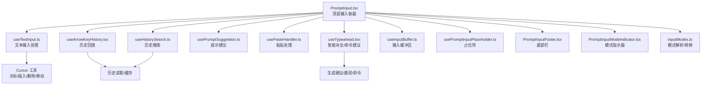
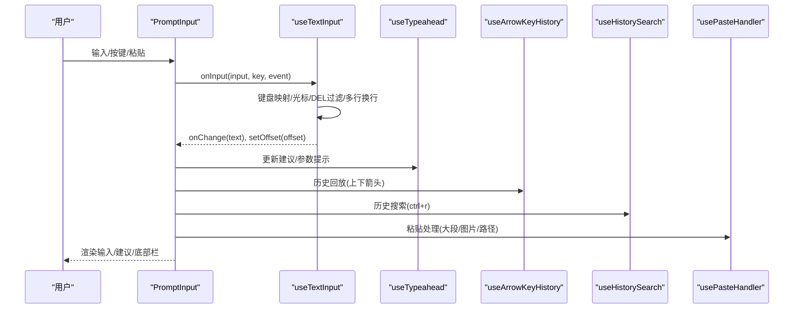
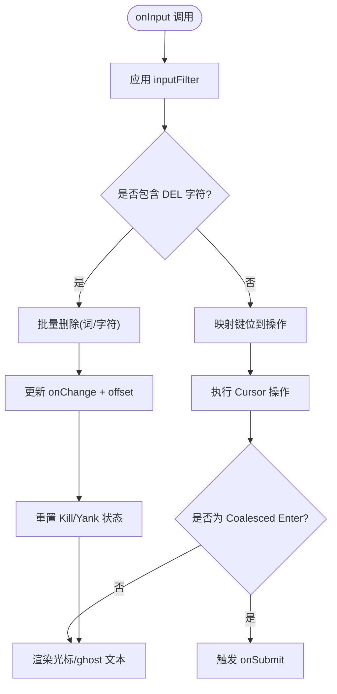
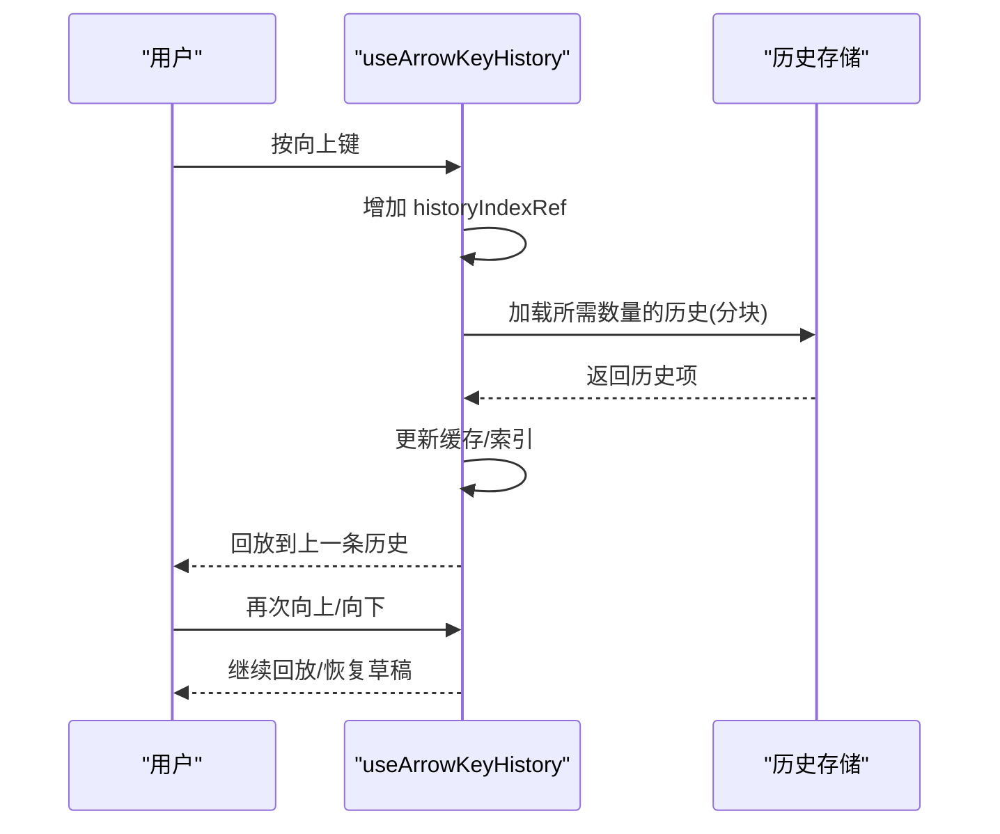
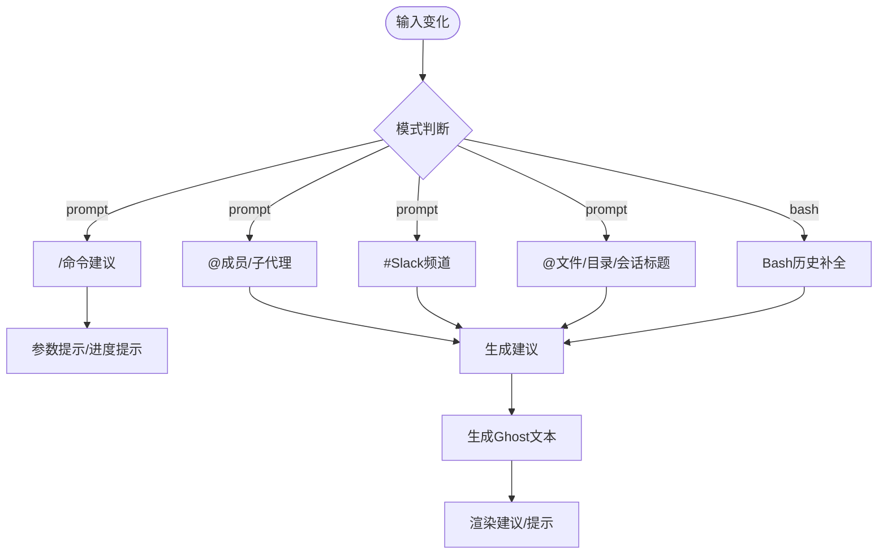
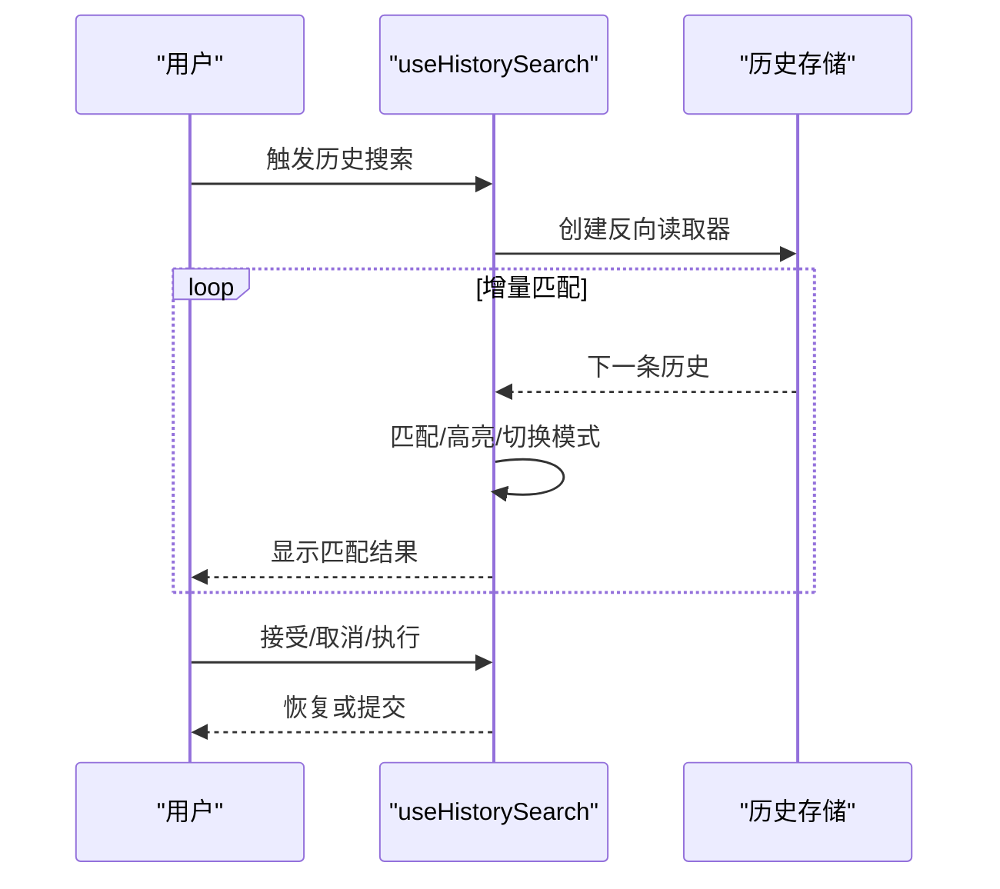
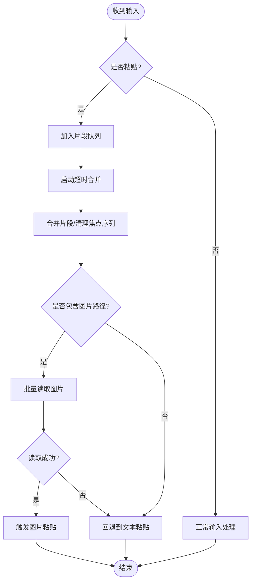
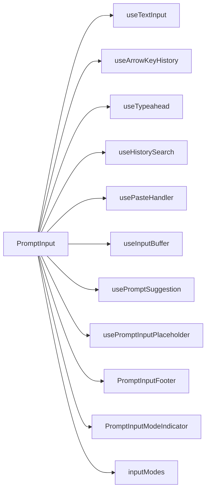

# 提示输入组件

<cite>
**本文档引用的文件**
- [PromptInput.tsx](file://src/components/PromptInput/PromptInput.tsx)
- [useTextInput.ts](file://src/hooks/useTextInput.ts)
- [useArrowKeyHistory.tsx](file://src/hooks/useArrowKeyHistory.tsx)
- [useTypeahead.tsx](file://src/hooks/useTypeahead.tsx)
- [usePromptSuggestion.ts](file://src/hooks/usePromptSuggestion.ts)
- [usePasteHandler.ts](file://src/hooks/usePasteHandler.ts)
- [useHistorySearch.ts](file://src/hooks/useHistorySearch.ts)
- [useInputBuffer.ts](file://src/hooks/useInputBuffer.ts)
- [usePromptInputPlaceholder.ts](file://src/components/PromptInput/usePromptInputPlaceholder.ts)
- [PromptInputFooter.tsx](file://src/components/PromptInput/PromptInputFooter.tsx)
- [PromptInputModeIndicator.tsx](file://src/components/PromptInput/PromptInputModeIndicator.tsx)
- [inputModes.ts](file://src/components/PromptInput/inputModes.ts)
</cite>

## 目录
1. [简介](#简介)
2. [项目结构](#项目结构)
3. [核心组件](#核心组件)
4. [架构总览](#架构总览)
5. [详细组件分析](#详细组件分析)
6. [依赖关系分析](#依赖关系分析)
7. [性能考量](#性能考量)
8. [故障排查指南](#故障排查指南)
9. [结论](#结论)
10. [附录](#附录)

## 简介
本文件为“提示输入组件”的全面使用文档，覆盖输入框的核心功能、历史记录管理与快捷键支持；深入解释输入处理机制、自动完成功能与命令建议系统；描述输入模式切换、快速模式图标与输入缓冲区管理；包含输入验证、占位符显示与粘贴处理的实现细节；展示历史搜索、输入历史回放与智能补全的使用方法；提供键盘导航、多行输入与特殊字符处理的最佳实践；并给出实际使用示例与用户体验优化建议。

## 项目结构
提示输入组件由一个顶层容器组件与多个协作钩子组成，围绕输入状态、历史检索、自动补全、粘贴处理与模式指示等模块协同工作。下图展示了关键文件之间的关系：

**图表来源**
- [PromptInput.tsx:194-237](file://src/components/PromptInput/PromptInput.tsx#L194-L237)
- [useTextInput.ts:73-97](file://src/hooks/useTextInput.ts#L73-L97)
- [useArrowKeyHistory.tsx:63-70](file://src/hooks/useArrowKeyHistory.tsx#L63-L70)
- [useTypeahead.tsx:353-371](file://src/hooks/useTypeahead.tsx#L353-L371)
- [usePromptSuggestion.ts:15-26](file://src/hooks/usePromptSuggestion.ts#L15-L26)
- [usePasteHandler.ts:30-41](file://src/hooks/usePasteHandler.ts#L30-L41)
- [useHistorySearch.ts:15-33](file://src/hooks/useHistorySearch.ts#L15-L33)
- [useInputBuffer.ts:27-30](file://src/hooks/useInputBuffer.ts#L27-L30)
- [usePromptInputPlaceholder.ts:25-29](file://src/components/PromptInput/usePromptInputPlaceholder.ts#L25-L29)
- [PromptInputFooter.tsx:63-96](file://src/components/PromptInput/PromptInputFooter.tsx#L63-L96)
- [PromptInputModeIndicator.tsx:63-92](file://src/components/PromptInput/PromptInputModeIndicator.tsx#L63-L92)
- [inputModes.ts:1-34](file://src/components/PromptInput/inputModes.ts#L1-L34)

**章节来源**
- [PromptInput.tsx:194-237](file://src/components/PromptInput/PromptInput.tsx#L194-L237)
- [inputModes.ts:1-34](file://src/components/PromptInput/inputModes.ts#L1-L34)

## 核心组件
- PromptInput：顶层容器，负责输入状态、模式切换、历史搜索、粘贴处理、自动补全、底部栏与模式指示器的协调。
- useTextInput：核心输入处理钩子，封装键盘映射、光标操作、多行换行、DEL字符过滤、粘贴识别与提交逻辑。
- useArrowKeyHistory：历史回放钩子，按需分块加载历史、缓存命中、模式过滤、草稿保留与索引管理。
- useTypeahead：智能补全钩子，支持命令建议、@成员/子代理、#Slack频道、文件/目录/会话标题、Bash历史补全与参数提示。
- usePromptSuggestion：提示建议钩子，管理建议展示、接受与统计上报。
- usePasteHandler：粘贴处理钩子，检测大段输入、拖拽图片路径、剪贴板图像、延迟合并片段与超时完成。
- useHistorySearch：历史搜索钩子，增量式反向扫描历史、高亮匹配、模式切换与恢复原输入。
- useInputBuffer：输入缓冲区，去抖动、去重、撤销链管理。
- usePromptInputPlaceholder：占位符逻辑，队列提示、示例命令与队友消息提示。
- PromptInputFooter：底部栏渲染，建议面板、通知、任务/桥接等状态。
- PromptInputModeIndicator：模式指示器，bash模式前缀“!”或彩色指针。
- inputModes：输入模式解析/转换工具（prompt/bash）。

**章节来源**
- [PromptInput.tsx:194-237](file://src/components/PromptInput/PromptInput.tsx#L194-L237)
- [useTextInput.ts:73-97](file://src/hooks/useTextInput.ts#L73-L97)
- [useArrowKeyHistory.tsx:63-70](file://src/hooks/useArrowKeyHistory.tsx#L63-L70)
- [useTypeahead.tsx:353-371](file://src/hooks/useTypeahead.tsx#L353-L371)
- [usePromptSuggestion.ts:15-26](file://src/hooks/usePromptSuggestion.ts#L15-L26)
- [usePasteHandler.ts:30-41](file://src/hooks/usePasteHandler.ts#L30-L41)
- [useHistorySearch.ts:15-33](file://src/hooks/useHistorySearch.ts#L15-L33)
- [useInputBuffer.ts:27-30](file://src/hooks/useInputBuffer.ts#L27-L30)
- [usePromptInputPlaceholder.ts:25-29](file://src/components/PromptInput/usePromptInputPlaceholder.ts#L25-L29)
- [PromptInputFooter.tsx:63-96](file://src/components/PromptInput/PromptInputFooter.tsx#L63-L96)
- [PromptInputModeIndicator.tsx:63-92](file://src/components/PromptInput/PromptInputModeIndicator.tsx#L63-L92)
- [inputModes.ts:1-34](file://src/components/PromptInput/inputModes.ts#L1-L34)

## 架构总览
提示输入组件采用“容器组件 + 多个协作钩子”的分层设计，通过状态提升与回调解耦，确保输入处理、历史检索、自动补全与UI渲染的职责清晰且可测试。

**图表来源**
- [PromptInput.tsx:237-285](file://src/components/PromptInput/PromptInput.tsx#L237-L285)
- [useTextInput.ts:431-501](file://src/hooks/useTextInput.ts#L431-L501)
- [useTypeahead.tsx:533-800](file://src/hooks/useTypeahead.tsx#L533-L800)
- [useArrowKeyHistory.tsx:124-182](file://src/hooks/useArrowKeyHistory.tsx#L124-L182)
- [useHistorySearch.ts:73-148](file://src/hooks/useHistorySearch.ts#L73-L148)
- [usePasteHandler.ts:214-278](file://src/hooks/usePasteHandler.ts#L214-L278)

## 详细组件分析

### 输入处理与键盘导航（useTextInput）
- 功能要点
  - 键盘映射：Ctrl/Cmd/Alt组合键、方向键、Home/End/PageUp/Down、Tab、Enter等。
  - 光标与文本操作：前进/后退、单词跳转、行首/行尾、删除词/行、粘贴/撤销/重做。
  - 多行输入：Backslash+Return续行、Shift/Meta+Enter换行、wrapped line与logical line移动。
  - DEL字符过滤：在SSH/tmux环境中避免重复删除。
  - 输入过滤：inputFilter钩子允许外部拦截或转换输入。
  - 双击Esc清空输入并保存到历史；Ctrl+C双击退出。
- 性能与健壮性
  - 同步更新offset与text，减少不必要渲染。
  - DEL批量处理，一次性应用多次删除，避免逐次回调。
- 使用建议
  - 在需要自定义输入行为时，通过inputFilter进行安全过滤。
  - 避免在SSH/tmux中同时发送原始DEL字符，以免触发重复删除。

**图表来源**
- [useTextInput.ts:431-501](file://src/hooks/useTextInput.ts#L431-L501)
- [useTextInput.ts:416-475](file://src/hooks/useTextInput.ts#L416-L475)

**章节来源**
- [useTextInput.ts:73-97](file://src/hooks/useTextInput.ts#L73-L97)
- [useTextInput.ts:224-238](file://src/hooks/useTextInput.ts#L224-L238)
- [useTextInput.ts:269-316](file://src/hooks/useTextInput.ts#L269-L316)
- [useTextInput.ts:318-413](file://src/hooks/useTextInput.ts#L318-L413)
- [useTextInput.ts:431-501](file://src/hooks/useTextInput.ts#L431-L501)

### 历史记录管理与回放（useArrowKeyHistory）
- 功能要点
  - 分块加载历史：按 HISTORY_CHUNK_SIZE 批量读取，避免频繁磁盘IO。
  - 缓存与并发：共享 pendingLoad，避免重复读取；按模式过滤缓存。
  - 草稿保留：首次按下上箭头时保存当前输入草稿，返回时恢复。
  - 模式过滤：初始模式固定，后续按键保持同一模式范围内的回放。
  - 提示：导航超过一定次数后提示“搜索历史”快捷方式。
- 性能与健壮性
  - 异步加载与竞态控制，保证顺序一致性。
  - 历史索引同步引用，避免闭包陈旧值导致的导航错误。
- 使用建议
  - 在bash模式下，历史回放会自动过滤非bash条目，避免误匹配。
  - 快速连按上箭头时，优先从缓存读取，体验更流畅。

**图表来源**
- [useArrowKeyHistory.tsx:20-62](file://src/hooks/useArrowKeyHistory.tsx#L20-L62)
- [useArrowKeyHistory.tsx:124-182](file://src/hooks/useArrowKeyHistory.tsx#L124-L182)
- [useArrowKeyHistory.tsx:183-207](file://src/hooks/useArrowKeyHistory.tsx#L183-L207)

**章节来源**
- [useArrowKeyHistory.tsx:63-70](file://src/hooks/useArrowKeyHistory.tsx#L63-L70)
- [useArrowKeyHistory.tsx:124-182](file://src/hooks/useArrowKeyHistory.tsx#L124-L182)
- [useArrowKeyHistory.tsx:183-207](file://src/hooks/useArrowKeyHistory.tsx#L183-L207)
- [useArrowKeyHistory.tsx:208-227](file://src/hooks/useArrowKeyHistory.tsx#L208-L227)

### 自动完成功能与命令建议（useTypeahead）
- 功能要点
  - 命令建议：以“/”开头的命令补全与参数提示，支持静态argumentHint与动态progressive提示。
  - @成员/子代理：在prompt模式下，@触发团队成员与子代理列表。
  - #Slack频道：在prompt模式下，#触发Slack频道建议（需MCP可用）。
  - 文件/目录/会话标题：@触发统一资源建议，目录补全与会话标题补全。
  - Bash补全：变量、命令、路径等shell补全，支持异步取消与失败降级。
  - Ghost文本：prompt模式下同步计算ghost文本，bash模式下异步生成。
- 性能与健壮性
  - 文件索引预热与后台刷新，首次@不会阻塞。
  - 深度防抖与取消，避免慢查询干扰交互。
  - 选择保留：根据ID保留上次选中项，减少闪烁。
- 使用建议
  - 在长列表场景下，优先使用“/”命令与@成员，减少模糊匹配成本。
  - Bash模式下，利用变量/命令补全提高效率。

**图表来源**
- [useTypeahead.tsx:533-800](file://src/hooks/useTypeahead.tsx#L533-L800)
- [useTypeahead.tsx:564-591](file://src/hooks/useTypeahead.tsx#L564-L591)
- [useTypeahead.tsx:655-788](file://src/hooks/useTypeahead.tsx#L655-L788)
- [useTypeahead.tsx:211-224](file://src/hooks/useTypeahead.tsx#L211-L224)

**章节来源**
- [useTypeahead.tsx:353-371](file://src/hooks/useTypeahead.tsx#L353-L371)
- [useTypeahead.tsx:533-800](file://src/hooks/useTypeahead.tsx#L533-L800)
- [useTypeahead.tsx:211-224](file://src/hooks/useTypeahead.tsx#L211-L224)

### 历史搜索（useHistorySearch）
- 功能要点
  - 快捷键：全局启用“history:search”，进入搜索模式。
  - 搜索：反向扫描历史，增量匹配，高亮当前位置。
  - 模式切换：匹配到的条目自动切换到对应模式（prompt/bash）。
  - 恢复：取消时恢复原输入、光标与粘贴内容。
  - 执行：接受当前匹配并提交，或直接以原输入提交。
- 性能与健壮性
  - AsyncIterator + AbortController，避免泄漏与阻塞。
  - 空查询时自动关闭读取器并恢复状态。
- 使用建议
  - 使用“historySearch:next/accept/cancel/execute”在搜索上下文中导航。

**图表来源**
- [useHistorySearch.ts:73-148](file://src/hooks/useHistorySearch.ts#L73-L148)
- [useHistorySearch.ts:150-208](file://src/hooks/useHistorySearch.ts#L150-L208)
- [useHistorySearch.ts:210-235](file://src/hooks/useHistorySearch.ts#L210-L235)

**章节来源**
- [useHistorySearch.ts:15-33](file://src/hooks/useHistorySearch.ts#L15-L33)
- [useHistorySearch.ts:73-148](file://src/hooks/useHistorySearch.ts#L73-L148)
- [useHistorySearch.ts:150-208](file://src/hooks/useHistorySearch.ts#L150-L208)
- [useHistorySearch.ts:210-235](file://src/hooks/useHistorySearch.ts#L210-L235)

### 粘贴处理（usePasteHandler）
- 功能要点
  - 粘贴检测：基于Bracketed Paste与长度阈值判断大段输入。
  - 图片处理：拖拽图片路径识别、批量读取、剪贴板图像（macOS）。
  - 片段合并：超时聚合多片段，避免丢失焦点序列。
  - 空粘贴：Cmd+V空输入时尝试读取剪贴板图像。
- 性能与健壮性
  - 延迟合并与超时清理，避免长时间占用事件循环。
  - 并发读取多张图片，失败降级为文本粘贴。
- 使用建议
  - 拖拽图片时注意路径格式，支持Unix与Windows绝对路径分隔。

**图表来源**
- [usePasteHandler.ts:214-278](file://src/hooks/usePasteHandler.ts#L214-L278)
- [usePasteHandler.ts:111-193](file://src/hooks/usePasteHandler.ts#L111-L193)
- [usePasteHandler.ts:241-250](file://src/hooks/usePasteHandler.ts#L241-L250)

**章节来源**
- [usePasteHandler.ts:30-41](file://src/hooks/usePasteHandler.ts#L30-L41)
- [usePasteHandler.ts:214-278](file://src/hooks/usePasteHandler.ts#L214-L278)
- [usePasteHandler.ts:111-193](file://src/hooks/usePasteHandler.ts#L111-L193)

### 输入缓冲区（useInputBuffer）
- 功能要点
  - 去抖动与去重：快速变更合并，避免重复入栈。
  - 撤销链：支持连续撤销，限制最大容量。
  - 清空：清空缓冲并取消待定推送。
- 使用建议
  - 在需要“撤销编辑”场景使用，避免频繁小变更污染历史。

**章节来源**
- [useInputBuffer.ts:27-30](file://src/hooks/useInputBuffer.ts#L27-L30)
- [useInputBuffer.ts:36-96](file://src/hooks/useInputBuffer.ts#L36-L96)
- [useInputBuffer.ts:98-131](file://src/hooks/useInputBuffer.ts#L98-L131)

### 占位符与提示（usePromptInputPlaceholder）
- 功能要点
  - 队列提示：当存在可编辑队列命令时，显示“按向上键编辑”提示。
  - 示例命令：首次提交前显示示例命令占位符。
  - 队友消息：在查看特定队友时，提示“@队友名…”。
- 使用建议
  - 通过全局配置与状态控制提示出现频率与时机。

**章节来源**
- [usePromptInputPlaceholder.ts:25-29](file://src/components/PromptInput/usePromptInputPlaceholder.ts#L25-L29)
- [usePromptInputPlaceholder.ts:32-76](file://src/components/PromptInput/usePromptInputPlaceholder.ts#L32-L76)

### 底部栏与模式指示器（PromptInputFooter, PromptInputModeIndicator）
- 功能要点
  - 底部栏：在非全屏环境下渲染建议面板、通知与状态；全屏时通过覆盖层传递建议数据。
  - 模式指示器：bash模式显示“!”，prompt模式显示彩色指针或队友主题色。
- 使用建议
  - 在窄屏或全屏环境下，关注底部栏与覆盖层的差异表现。

**章节来源**
- [PromptInputFooter.tsx:63-96](file://src/components/PromptInput/PromptInputFooter.tsx#L63-L96)
- [PromptInputFooter.tsx:124-151](file://src/components/PromptInput/PromptInputFooter.tsx#L124-L151)
- [PromptInputModeIndicator.tsx:63-92](file://src/components/PromptInput/PromptInputModeIndicator.tsx#L63-L92)

### 输入模式切换与解析（inputModes）
- 功能要点
  - 模式前缀：bash模式以“!”开头，prompt模式无前缀。
  - 解析与提取：从显示文本中解析模式与真实值。
  - 模式字符：识别输入中的模式字符。
- 使用建议
  - 在历史回放与提交时，正确解析模式以避免误判。

**章节来源**
- [inputModes.ts:4-34](file://src/components/PromptInput/inputModes.ts#L4-L34)

## 依赖关系分析
- 组件耦合
  - PromptInput作为协调者，依赖多个钩子；钩子之间低耦合，通过props与回调通信。
  - useTextInput与Cursor紧密耦合，负责底层文本与光标操作。
  - useTypeahead与文件索引、MCP客户端、命令集合强耦合，负责智能补全。
- 外部依赖
  - 历史存储：AsyncIterator读取，支持中断与去重。
  - 剪贴板与图片：平台相关能力，macOS特化处理。
  - 键盘快捷键：通过keybindings系统注册与响应。

**图表来源**
- [PromptInput.tsx:194-237](file://src/components/PromptInput/PromptInput.tsx#L194-L237)

**章节来源**
- [PromptInput.tsx:194-237](file://src/components/PromptInput/PromptInput.tsx#L194-L237)

## 性能考量
- 历史加载
  - 分块读取与缓存共享，避免重复IO；模式过滤确保缓存隔离。
- 补全建议
  - 文件索引预热与后台刷新；深度防抖与取消；选择保留减少闪烁。
- 粘贴处理
  - 片段合并与超时清理，避免长时间占用；批量读取图片并行处理。
- 输入处理
  - DEL批量删除、同步更新offset与text，减少重渲染。
- 建议
  - 在长列表场景优先使用精确前缀（如“/”、“@”、“#”）降低匹配成本。
  - 合理设置去抖动时间，平衡响应速度与CPU占用。

## 故障排查指南
- 输入被截断或重复删除
  - 检查是否处于SSH/tmux环境，确认DEL字符过滤逻辑生效。
  - 参考：[useTextInput.ts:442-465](file://src/hooks/useTextInput.ts#L442-L465)
- 粘贴丢失或图片未识别
  - 确认是否启用Bracketed Paste；检查路径格式与图片有效性。
  - 参考：[usePasteHandler.ts:214-278](file://src/hooks/usePasteHandler.ts#L214-L278)
- 历史搜索卡顿
  - 确认历史读取器已正确关闭；避免同时开启多个搜索实例。
  - 参考：[useHistorySearch.ts:51-58](file://src/hooks/useHistorySearch.ts#L51-L58)
- 建议闪烁或错位
  - 检查选择保留逻辑与同步引用，确保最新token与建议一致。
  - 参考：[useTypeahead.tsx:52-74](file://src/hooks/useTypeahead.tsx#L52-L74)

**章节来源**
- [useTextInput.ts:442-465](file://src/hooks/useTextInput.ts#L442-L465)
- [usePasteHandler.ts:214-278](file://src/hooks/usePasteHandler.ts#L214-L278)
- [useHistorySearch.ts:51-58](file://src/hooks/useHistorySearch.ts#L51-L58)
- [useTypeahead.tsx:52-74](file://src/hooks/useTypeahead.tsx#L52-L74)

## 结论
提示输入组件通过模块化设计实现了强大的输入处理、历史管理、智能补全与粘贴支持。其分层架构与钩子协作确保了可维护性与扩展性；在性能方面采用分块加载、防抖与批量处理等策略，兼顾流畅体验与资源消耗。遵循本文最佳实践与故障排查建议，可显著提升输入效率与用户体验。

## 附录
- 实际使用示例
  - 历史回放：在输入框中连续按“↑/↓”，在bash模式下仅回放bash历史。
    - 参考：[useArrowKeyHistory.tsx:124-182](file://src/hooks/useArrowKeyHistory.tsx#L124-L182)
  - 命令建议：输入“/”触发命令列表与参数提示。
    - 参考：[useTypeahead.tsx:775-788](file://src/hooks/useTypeahead.tsx#L775-L788)
  - @成员建议：在prompt模式下输入“@”触发团队成员与子代理建议。
    - 参考：[useTypeahead.tsx:596-637](file://src/hooks/useTypeahead.tsx#L596-L637)
  - 历史搜索：按“Ctrl+R”进入搜索，输入关键字高亮匹配。
    - 参考：[useHistorySearch.ts:238-257](file://src/hooks/useHistorySearch.ts#L238-L257)
  - 粘贴图片：拖拽图片路径或Cmd+V粘贴剪贴板图像。
    - 参考：[usePasteHandler.ts:132-177](file://src/hooks/usePasteHandler.ts#L132-L177)
- 最佳实践
  - 多行输入：在bash模式下使用“\+回车”续行，在prompt模式下使用“Shift+Enter”换行。
  - 快捷键：优先使用“Esc再次清空”、“Ctrl+R搜索历史”、“Ctrl+Y粘贴”等快捷键。
  - 模式切换：通过“!”进入bash模式，通过普通输入回到prompt模式。
  - 输入验证：在inputFilter中进行白名单/黑名单过滤，避免注入风险。
  - 占位符：首次使用时可参考示例命令，队列中有待编辑命令时使用“↑”快速编辑。