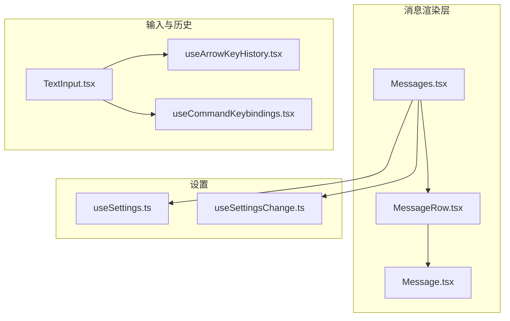
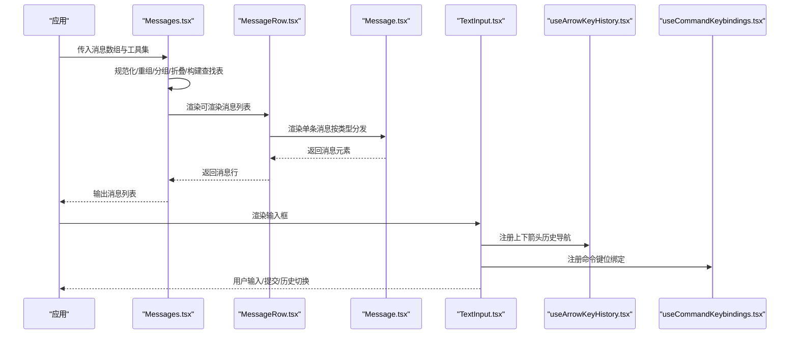
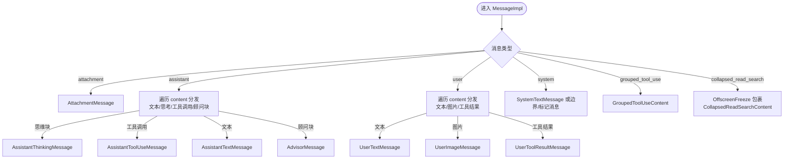
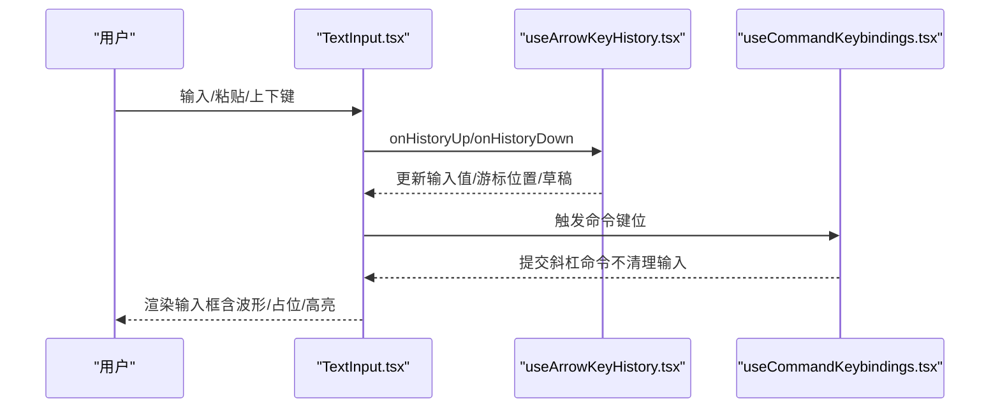
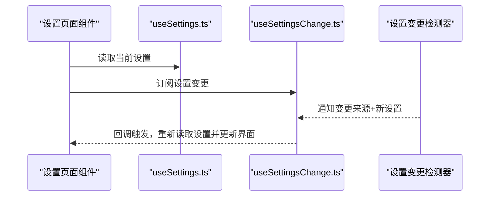
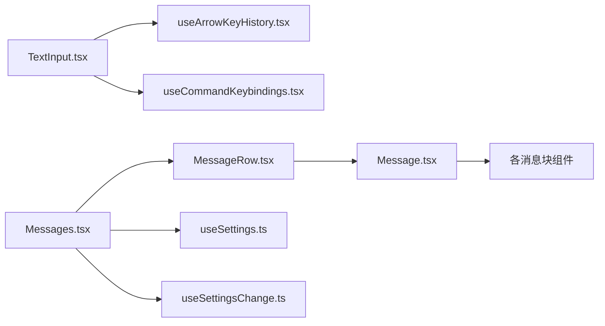

# 核心 UI 组件

<cite>
**本文引用的文件**
- [Message.tsx](file://src/components/Message.tsx)
- [MessageRow.tsx](file://src/components/MessageRow.tsx)
- [Messages.tsx](file://src/components/Messages.tsx)
- [TextInput.tsx](file://src/components/TextInput.tsx)
- [useArrowKeyHistory.tsx](file://src/hooks/useArrowKeyHistory.tsx)
- [useCommandKeybindings.tsx](file://src/hooks/useCommandKeybindings.tsx)
- [useSettings.ts](file://src/hooks/useSettings.ts)
- [useSettingsChange.ts](file://src/hooks/useSettingsChange.ts)
</cite>

## 目录
1. [简介](#简介)
2. [项目结构](#项目结构)
3. [核心组件](#核心组件)
4. [架构总览](#架构总览)
5. [详细组件分析](#详细组件分析)
6. [依赖关系分析](#依赖关系分析)
7. [性能考量](#性能考量)
8. [故障排查指南](#故障排查指南)
9. [结论](#结论)
10. [附录](#附录)

## 简介
本文件面向“核心 UI 组件”的使用者与维护者，系统化介绍三类关键组件：消息显示组件、提示输入组件与设置界面组件。内容涵盖：
- 消息显示组件：渲染机制、样式定制、交互行为与性能优化
- 提示输入组件：输入处理、历史管理、快捷键支持与无障碍特性
- 设置界面组件：配置管理、验证规则与实时更新机制
同时给出属性配置、事件回调、状态管理说明，以及组件间协作模式与数据流管理，并提供实际使用示例、最佳实践与常见问题解决方案。

## 项目结构
围绕核心 UI 的相关模块主要分布在以下路径：
- 消息渲染链路：src/components/Message.tsx、src/components/MessageRow.tsx、src/components/Messages.tsx
- 输入与历史：src/components/TextInput.tsx、src/hooks/useArrowKeyHistory.tsx、src/hooks/useCommandKeybindings.tsx
- 设置与变更监听：src/hooks/useSettings.ts、src/hooks/useSettingsChange.ts

**图表来源**
- [Message.tsx:1-627](file://src/components/Message.tsx#L1-L627)
- [MessageRow.tsx:1-386](file://src/components/MessageRow.tsx#L1-L386)
- [Messages.tsx:1-834](file://src/components/Messages.tsx#L1-L834)
- [TextInput.tsx:1-124](file://src/components/TextInput.tsx#L1-L124)
- [useArrowKeyHistory.tsx:1-229](file://src/hooks/useArrowKeyHistory.tsx#L1-L229)
- [useCommandKeybindings.tsx:1-108](file://src/hooks/useCommandKeybindings.tsx#L1-L108)
- [useSettings.ts:1-18](file://src/hooks/useSettings.ts#L1-L18)
- [useSettingsChange.ts:1-26](file://src/hooks/useSettingsChange.ts#L1-L26)

**章节来源**
- [Message.tsx:1-627](file://src/components/Message.tsx#L1-L627)
- [MessageRow.tsx:1-386](file://src/components/MessageRow.tsx#L1-L386)
- [Messages.tsx:1-834](file://src/components/Messages.tsx#L1-L834)
- [TextInput.tsx:1-124](file://src/components/TextInput.tsx#L1-L124)
- [useArrowKeyHistory.tsx:1-229](file://src/hooks/useArrowKeyHistory.tsx#L1-L229)
- [useCommandKeybindings.tsx:1-108](file://src/hooks/useCommandKeybindings.tsx#L1-L108)
- [useSettings.ts:1-18](file://src/hooks/useSettings.ts#L1-L18)
- [useSettingsChange.ts:1-26](file://src/hooks/useSettingsChange.ts#L1-L26)

## 核心组件
本节概览三大组件的职责与能力边界：
- 消息显示组件（Message/Messages/MessageRow）
  - 负责将标准化后的消息序列渲染为终端 UI，支持多种消息类型（用户文本/图片、助手文本/思考/工具调用、系统消息、附件等），并提供转录模式、思维块控制、工具结果分组折叠、虚拟滚动等高级能力。
- 提示输入组件（TextInput）
  - 提供终端内输入框，支持多行输入、粘贴高亮、光标反转效果、语音录制波形指示、剪贴板图像提示、无障碍与动效偏好等。
- 设置界面组件（Settings 子模块 + 钩子）
  - 通过 useSettings/useSettingsChange 实现设置的读取与变更监听，配合设置页面组件完成配置管理与实时更新。

**章节来源**
- [Message.tsx:32-57](file://src/components/Message.tsx#L32-L57)
- [MessageRow.tsx:18-41](file://src/components/MessageRow.tsx#L18-L41)
- [Messages.tsx:207-275](file://src/components/Messages.tsx#L207-L275)
- [TextInput.tsx:34-36](file://src/components/TextInput.tsx#L34-L36)
- [useSettings.ts:15-17](file://src/hooks/useSettings.ts#L15-L17)
- [useSettingsChange.ts:7-25](file://src/hooks/useSettingsChange.ts#L7-L25)

## 架构总览
消息渲染与输入交互的整体流程如下：

**图表来源**
- [Messages.tsx:341-721](file://src/components/Messages.tsx#L341-L721)
- [MessageRow.tsx:96-290](file://src/components/MessageRow.tsx#L96-L290)
- [Message.tsx:58-355](file://src/components/Message.tsx#L58-L355)
- [TextInput.tsx:92-122](file://src/components/TextInput.tsx#L92-L122)
- [useArrowKeyHistory.tsx:63-228](file://src/hooks/useArrowKeyHistory.tsx#L63-L228)
- [useCommandKeybindings.tsx:37-107](file://src/hooks/useCommandKeybindings.tsx#L37-L107)

## 详细组件分析

### 消息显示组件（Message/Messages/MessageRow）

#### 渲染机制与类型分发
- Message.tsx 将不同类型的“标准化消息”分派到对应的消息块组件（如用户文本、助手文本/思考/工具调用、系统消息、附件、分组工具调用、折叠读取搜索等）。
- 支持“转录模式”“详细模式”“静态渲染”等开关，用于控制思维块可见性、动画、元数据显示与布局宽度。
- 内置对“连接器文本”“顾问块”等特殊内容的识别与渲染。

**图表来源**
- [Message.tsx:82-354](file://src/components/Message.tsx#L82-L354)
- [Message.tsx:433-590](file://src/components/Message.tsx#L433-L590)

**章节来源**
- [Message.tsx:32-57](file://src/components/Message.tsx#L32-L57)
- [Message.tsx:58-355](file://src/components/Message.tsx#L58-L355)
- [Message.tsx:591-627](file://src/components/Message.tsx#L591-L627)

#### 样式定制与交互行为
- 容器宽度与边距：通过 containerWidth 与 addMargin 控制消息容器宽度与外边距；在无元数据时可跳过外层 Box，减少渲染层级。
- 动画与点状指示：shouldAnimate/shouldShowDot 控制工具调用与思维块的动画与点状指示。
- 转录模式与思维块隐藏：lastThinkingBlockId 与 isTranscriptMode 控制仅保留最后思维块或隐藏已完成思维块。
- 最新 Bash 输出：latestBashOutputUUID 控制是否展开完整输出。
- 元数据行：当存在时间戳或模型信息时，显示时间戳与模型行。

**章节来源**
- [MessageRow.tsx:18-41](file://src/components/MessageRow.tsx#L18-L41)
- [MessageRow.tsx:222-231](file://src/components/MessageRow.tsx#L222-L231)
- [Messages.tsx:391-441](file://src/components/Messages.tsx#L391-L441)

#### 性能优化与静态渲染
- React.memo 与自定义比较器：Message/MessageRow/Messages 均采用 memo 化，避免频繁重渲染。
- 静态渲染判定：shouldRenderStatically 在非转录模式下对已完成且无流式更新的消息进行静态渲染，降低布局与绘制成本。
- 虚拟滚动：在全屏环境启用 VirtualMessageList，避免一次性挂载大量 Fiber 树导致内存与 GC 压力。

**章节来源**
- [Message.tsx:626-627](file://src/components/Message.tsx#L626-L627)
- [MessageRow.tsx:345-384](file://src/components/MessageRow.tsx#L345-L384)
- [Messages.tsx:779-800](file://src/components/Messages.tsx#L779-L800)
- [Messages.tsx:461-466](file://src/components/Messages.tsx#L461-L466)

#### 数据流与协作模式
- Messages 负责消息规范化、重组、分组、折叠与查找表构建，再将“可渲染消息”传递给 MessageRow。
- MessageRow 计算每条消息的静态/动画状态、进度消息、活跃工具集合，并决定是否显示元数据行。
- Message 根据消息类型与屏幕模式选择具体渲染组件，必要时包裹 OffscreenFreeze 以提升性能。

**章节来源**
- [Messages.tsx:481-529](file://src/components/Messages.tsx#L481-L529)
- [MessageRow.tsx:116-170](file://src/components/MessageRow.tsx#L116-L170)
- [Message.tsx:58-355](file://src/components/Message.tsx#L58-L355)

### 提示输入组件（TextInput）

#### 输入处理与历史管理
- TextInput 通过 useTextInput 管理输入值、提交、退出、清空、历史上下切换、掩码、多行、粘贴高亮等。
- 历史管理由 useArrowKeyHistory 提供：支持按模式过滤的历史加载、批处理并发磁盘读取、草稿保存与恢复、搜索提示通知等。
- 键位绑定：useCommandKeybindings 将“command:*”动作映射为即时命令提交，不清理输入文本。

**图表来源**
- [TextInput.tsx:92-122](file://src/components/TextInput.tsx#L92-L122)
- [useArrowKeyHistory.tsx:63-228](file://src/hooks/useArrowKeyHistory.tsx#L63-L228)
- [useCommandKeybindings.tsx:37-107](file://src/hooks/useCommandKeybindings.tsx#L37-L107)

**章节来源**
- [TextInput.tsx:34-36](file://src/components/TextInput.tsx#L34-L36)
- [TextInput.tsx:92-122](file://src/components/TextInput.tsx#L92-L122)
- [useArrowKeyHistory.tsx:63-228](file://src/hooks/useArrowKeyHistory.tsx#L63-L228)
- [useCommandKeybindings.tsx:17-30](file://src/hooks/useCommandKeybindings.tsx#L17-L30)

#### 快捷键支持与无障碍
- 语音录制波形：录音时以彩色块字符显示音量波形，静音时灰色显示；可受“减少动效”偏好影响。
- 无障碍：可通过环境变量开启无障碍模式，禁用光标反转与闪烁。
- 剪贴板图像提示：终端获得焦点且存在图像时显示提示，便于快速粘贴。

**章节来源**
- [TextInput.tsx:44-56](file://src/components/TextInput.tsx#L44-L56)
- [TextInput.tsx:65-91](file://src/components/TextInput.tsx#L65-L91)
- [TextInput.tsx:57-58](file://src/components/TextInput.tsx#L57-L58)

### 设置界面组件（配置管理与实时更新）

#### 配置管理与验证规则
- 使用 useSettings 获取当前设置快照，组件可直接消费响应式设置。
- 使用 useSettingsChange 订阅设置文件变更，回调中读取最新设置并触发 UI 更新。
- 设置变更检测器负责跨进程/跨订阅者的统一通知，避免重复读盘与竞态。

**图表来源**
- [useSettings.ts:15-17](file://src/hooks/useSettings.ts#L15-L17)
- [useSettingsChange.ts:7-25](file://src/hooks/useSettingsChange.ts#L7-L25)

**章节来源**
- [useSettings.ts:15-17](file://src/hooks/useSettings.ts#L15-L17)
- [useSettingsChange.ts:7-25](file://src/hooks/useSettingsChange.ts#L7-L25)

#### 实时更新机制
- 变更检测器 fanOut 会重置缓存并在订阅者中广播，订阅方无需手动刷新缓存。
- 推荐在订阅回调中使用浅比较或稳定引用，避免不必要的重渲染。

**章节来源**
- [useSettingsChange.ts:10-19](file://src/hooks/useSettingsChange.ts#L10-L19)

## 依赖关系分析

**图表来源**
- [Messages.tsx:38-45](file://src/components/Messages.tsx#L38-L45)
- [MessageRow.tsx:10-12](file://src/components/MessageRow.tsx#L10-L12)
- [Message.tsx:16-31](file://src/components/Message.tsx#L16-L31)
- [TextInput.tsx:7-12](file://src/components/TextInput.tsx#L7-L12)
- [useArrowKeyHistory.tsx:6-9](file://src/hooks/useArrowKeyHistory.tsx#L6-L9)
- [useCommandKeybindings.tsx:13-16](file://src/hooks/useCommandKeybindings.tsx#L13-L16)
- [useSettings.ts:1-2](file://src/hooks/useSettings.ts#L1-L2)
- [useSettingsChange.ts:2-5](file://src/hooks/useSettingsChange.ts#L2-L5)

**章节来源**
- [Messages.tsx:38-45](file://src/components/Messages.tsx#L38-L45)
- [MessageRow.tsx:10-12](file://src/components/MessageRow.tsx#L10-L12)
- [Message.tsx:16-31](file://src/components/Message.tsx#L16-L31)
- [TextInput.tsx:7-12](file://src/components/TextInput.tsx#L7-L12)
- [useArrowKeyHistory.tsx:6-9](file://src/hooks/useArrowKeyHistory.tsx#L6-L9)
- [useCommandKeybindings.tsx:13-16](file://src/hooks/useCommandKeybindings.tsx#L13-L16)
- [useSettings.ts:1-2](file://src/hooks/useSettings.ts#L1-L2)
- [useSettingsChange.ts:2-5](file://src/hooks/useSettingsChange.ts#L2-L5)

## 性能考量
- 消息渲染
  - 使用 React.memo 与自定义比较器，避免无关 props 变化导致的重渲染。
  - 对已完成且无流式更新的消息采用静态渲染，减少布局与绘制。
  - 全屏模式启用虚拟滚动，避免一次性挂载大量 Fiber 树。
- 输入组件
  - 历史加载采用分块与批处理，避免频繁小读取。
  - 语音波形平滑与阈值控制，降低视觉抖动与计算开销。
- 设置变更
  - 变更检测器集中通知，订阅方无需重复读盘；回调中避免重复缓存重置。

[本节为通用指导，无需列出具体文件来源]

## 故障排查指南
- 消息渲染异常
  - 症状：思维块未按预期显示或隐藏。
  - 排查：确认 isTranscriptMode 与 lastThinkingBlockId 的组合逻辑；检查 hasThinkingContent 判定。
  - 参考：[Message.tsx:591-601](file://src/components/Message.tsx#L591-L601)、[Messages.tsx:391-419](file://src/components/Messages.tsx#L391-L419)
- 输入历史不可用
  - 症状：上下键无法切换历史或草稿丢失。
  - 排查：确认初始模式过滤与缓存一致性；检查批处理加载与索引同步。
  - 参考：[useArrowKeyHistory.tsx:124-182](file://src/hooks/useArrowKeyHistory.tsx#L124-L182)
- 语音波形不显示
  - 症状：录音时无波形或颜色异常。
  - 排查：确认语音功能开关、减少动效偏好、阈值与平滑参数。
  - 参考：[TextInput.tsx:69-91](file://src/components/TextInput.tsx#L69-L91)
- 设置未生效
  - 症状：修改设置后界面未更新。
  - 排查：确认 useSettingsChange 订阅是否正确；检查变更来源与回调中的读取时机。
  - 参考：[useSettingsChange.ts:10-19](file://src/hooks/useSettingsChange.ts#L10-L19)

**章节来源**
- [Message.tsx:591-601](file://src/components/Message.tsx#L591-L601)
- [Messages.tsx:391-419](file://src/components/Messages.tsx#L391-L419)
- [useArrowKeyHistory.tsx:124-182](file://src/hooks/useArrowKeyHistory.tsx#L124-L182)
- [TextInput.tsx:69-91](file://src/components/TextInput.tsx#L69-L91)
- [useSettingsChange.ts:10-19](file://src/hooks/useSettingsChange.ts#L10-L19)

## 结论
- 消息显示组件通过分层设计与高性能策略，实现了复杂消息类型的统一渲染与灵活控制。
- 提示输入组件在交互体验与性能之间取得平衡，提供历史导航、命令键位与语音反馈等增强能力。
- 设置组件通过钩子实现响应式配置管理，确保界面与配置保持一致。
- 三大组件协同工作，形成从输入到渲染再到配置管理的闭环，适合在大型对话场景中稳定运行。

[本节为总结，无需列出具体文件来源]

## 附录

### 属性配置与事件回调清单（摘要）
- 消息显示组件
  - Message/Messages/MessageRow 的关键属性与回调参见各文件头部 Props 定义与导出函数签名。
  - 关键属性：消息对象、工具集、命令集、verbose、inProgressToolUseIDs、screen、onOpenRateLimitOptions、lastThinkingBlockId、latestBashOutputUUID 等。
  - 参考：[Message.tsx:32-57](file://src/components/Message.tsx#L32-L57)、[MessageRow.tsx:18-41](file://src/components/MessageRow.tsx#L18-L41)、[Messages.tsx:207-275](file://src/components/Messages.tsx#L207-L275)
- 提示输入组件
  - TextInput 的基础输入属性与回调参见 Props 定义；历史与命令键位通过独立钩子注入。
  - 参考：[TextInput.tsx:34-36](file://src/components/TextInput.tsx#L34-L36)、[useArrowKeyHistory.tsx:63-70](file://src/hooks/useArrowKeyHistory.tsx#L63-L70)、[useCommandKeybindings.tsx:17-25](file://src/hooks/useCommandKeybindings.tsx#L17-L25)
- 设置组件
  - useSettings 返回只读设置；useSettingsChange 订阅变更并回调。
  - 参考：[useSettings.ts:15-17](file://src/hooks/useSettings.ts#L15-L17)、[useSettingsChange.ts:7-25](file://src/hooks/useSettingsChange.ts#L7-L25)

### 实际使用示例（步骤说明）
- 渲染消息列表
  - 步骤：准备消息数组与工具集 → 调用 Messages → 传入 verbose、screen、inProgressToolUseIDs、streamingToolUses 等 → 渲染完成。
  - 参考：[Messages.tsx:341-721](file://src/components/Messages.tsx#L341-L721)
- 处理用户输入与历史
  - 步骤：在 TextInput 中注册 onHistoryUp/onHistoryDown → 使用 useArrowKeyHistory 管理历史索引与草稿 → 通过命令键位绑定提交斜杠命令。
  - 参考：[TextInput.tsx:92-122](file://src/components/TextInput.tsx#L92-L122)、[useArrowKeyHistory.tsx:63-228](file://src/hooks/useArrowKeyHistory.tsx#L63-L228)、[useCommandKeybindings.tsx:37-107](file://src/hooks/useCommandKeybindings.tsx#L37-L107)
- 实时设置更新
  - 步骤：useSettings 读取设置 → useSettingsChange 订阅变更 → 在回调中读取最新设置并更新界面。
  - 参考：[useSettings.ts:15-17](file://src/hooks/useSettings.ts#L15-L17)、[useSettingsChange.ts:7-25](file://src/hooks/useSettingsChange.ts#L7-L25)

### 最佳实践
- 消息渲染
  - 合理使用 verbose 与 lastThinkingBlockId 控制思维块可见性，避免不必要的重渲染。
  - 在全屏模式启用虚拟滚动，限制一次性渲染的消息数量。
- 输入处理
  - 使用批处理历史加载，避免频繁磁盘 IO；在草稿保存与恢复时注意模式一致性。
  - 语音模式下适当调整平滑与阈值参数，提升用户体验。
- 设置管理
  - 订阅设置变更时避免重复读盘；在回调中进行浅比较，减少无效更新。

[本节为通用指导，无需列出具体文件来源]