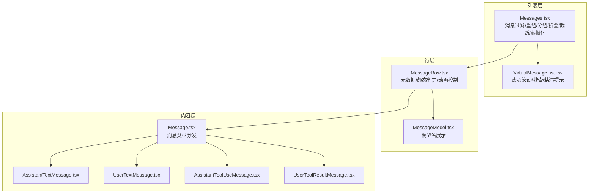
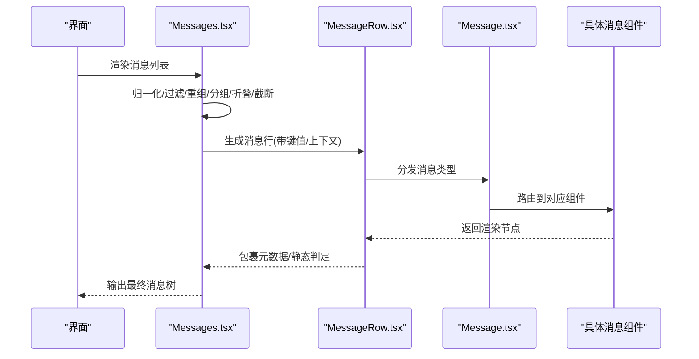
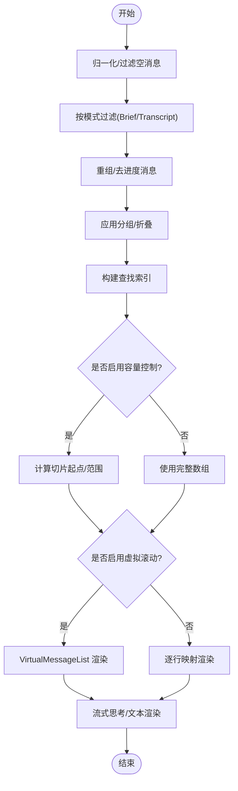
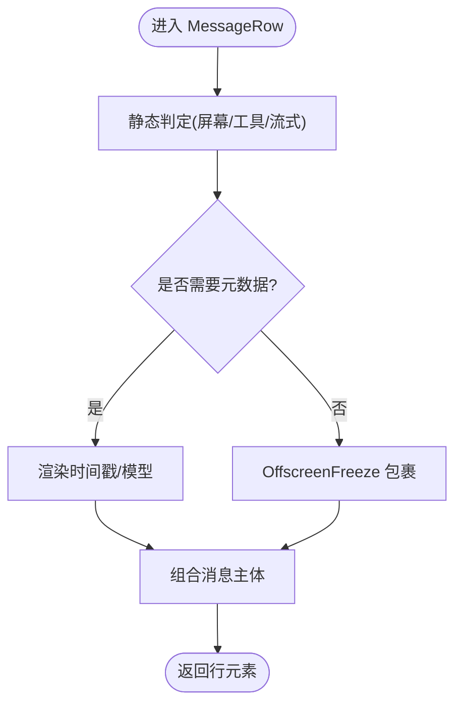
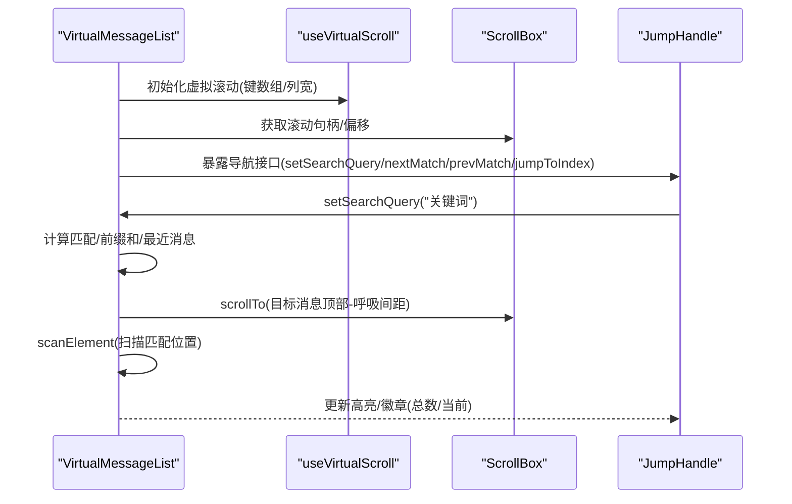
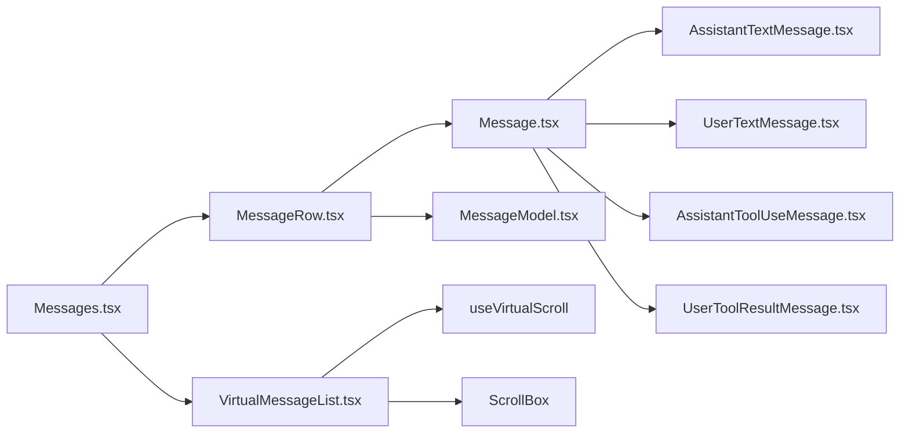

# 消息显示组件

<cite>
**本文引用的文件**
- [Messages.tsx](file://src/components/Messages.tsx)
- [Message.tsx](file://src/components/Message.tsx)
- [MessageRow.tsx](file://src/components/MessageRow.tsx)
- [MessageModel.tsx](file://src/components/MessageModel.tsx)
- [VirtualMessageList.tsx](file://src/components/VirtualMessageList.tsx)
- [AssistantTextMessage.tsx](file://src/components/messages/AssistantTextMessage.tsx)
- [UserTextMessage.tsx](file://src/components/messages/UserTextMessage.tsx)
- [AssistantToolUseMessage.tsx](file://src/components/messages/AssistantToolUseMessage.tsx)
- [UserToolResultMessage.tsx](file://src/components/messages/UserToolResultMessage/UserToolResultMessage.tsx)
</cite>

## 目录
1. [简介](#简介)
2. [项目结构](#项目结构)
3. [核心组件](#核心组件)
4. [架构总览](#架构总览)
5. [详细组件分析](#详细组件分析)
6. [依赖关系分析](#依赖关系分析)
7. [性能考量](#性能考量)
8. [故障排查指南](#故障排查指南)
9. [结论](#结论)
10. [附录](#附录)

## 简介
本文件面向“消息显示组件”的使用者与维护者，系统性阐述消息渲染机制、消息类型处理逻辑、样式与交互定制、虚拟滚动与搜索高亮、以及性能优化策略。文档覆盖用户消息、助手消息、工具使用消息、工具结果消息等多形态消息的显示与交互，并给出可操作的使用建议与排障指引。

## 项目结构
消息显示体系由三层组成：
- 列表层：负责消息集合的过滤、重组、分组、折叠、查找索引与截断策略，以及虚拟滚动接入与搜索高亮。
- 行层：负责单条消息的元数据呈现（时间戳、模型名）、静态/动态渲染判定与动画控制。
- 内容层：按消息类型细分到具体组件，如用户文本、助手文本、工具调用、工具结果等。

图示来源
- [Messages.tsx:341-721](file://src/components/Messages.tsx#L341-L721)
- [VirtualMessageList.tsx:289-415](file://src/components/VirtualMessageList.tsx#L289-L415)
- [MessageRow.tsx:96-290](file://src/components/MessageRow.tsx#L96-L290)
- [Message.tsx:58-355](file://src/components/Message.tsx#L58-L355)
- [AssistantTextMessage.tsx:47-270](file://src/components/messages/AssistantTextMessage.tsx#L47-L270)
- [UserTextMessage.tsx:29-275](file://src/components/messages/UserTextMessage.tsx#L29-L275)
- [AssistantToolUseMessage.tsx:35-368](file://src/components/messages/AssistantToolUseMessage.tsx#L35-L368)
- [UserToolResultMessage.tsx:23-106](file://src/components/messages/UserToolResultMessage/UserToolResultMessage.tsx#L23-L106)

章节来源
- [Messages.tsx:341-721](file://src/components/Messages.tsx#L341-L721)
- [VirtualMessageList.tsx:289-415](file://src/components/VirtualMessageList.tsx#L289-L415)
- [MessageRow.tsx:96-290](file://src/components/MessageRow.tsx#L96-L290)
- [Message.tsx:58-355](file://src/components/Message.tsx#L58-L355)

## 核心组件
- Messages：消息主容器，负责消息归一化、过滤/重组/分组/折叠、Brief模式、截断与可见性计算、虚拟滚动接入、搜索文本提取缓存、以及流式内容渲染。
- MessageRow：单条消息行，负责元数据（时间戳/模型）渲染、静态/动态判定、动画开关、点击展开等。
- Message：消息类型分发器，根据消息类型路由到具体子组件。
- AssistantTextMessage/UserTextMessage/AssistantToolUseMessage/UserToolResultMessage：各消息类型的专用渲染组件。
- VirtualMessageList：全屏模式下的虚拟滚动列表，支持搜索定位、粘滞提示、游标导航。

章节来源
- [Messages.tsx:341-721](file://src/components/Messages.tsx#L341-L721)
- [MessageRow.tsx:96-290](file://src/components/MessageRow.tsx#L96-L290)
- [Message.tsx:58-355](file://src/components/Message.tsx#L58-L355)
- [VirtualMessageList.tsx:289-415](file://src/components/VirtualMessageList.tsx#L289-L415)

## 架构总览
消息渲染采用“列表-行-内容”三层解耦设计：
- 列表层集中处理昂贵的预处理（分组/折叠/查找索引），并以稳定键值驱动虚拟滚动。
- 行层负责最小化重渲染，通过静态判定避免不必要的解析与格式化。
- 内容层针对不同消息类型进行语义化渲染，保证可扩展性与可维护性。

图示来源
- [Messages.tsx:341-721](file://src/components/Messages.tsx#L341-L721)
- [MessageRow.tsx:96-290](file://src/components/MessageRow.tsx#L96-L290)
- [Message.tsx:58-355](file://src/components/Message.tsx#L58-L355)

## 详细组件分析

### Messages 列表组件
职责与特性
- 预处理与过滤：归一化消息、过滤空消息、按屏幕模式与Brief模式筛选；支持“仅显示Brief工具输出”与“去除Turn中冗余文本”。
- 分组与折叠：对工具调用、搜索/阅读、Hook摘要、后台Bash通知、团队关闭等进行分组与折叠，提升可读性。
- 截断与容量控制：在非虚拟滚动场景下，基于锚点切片限制渲染数量，避免内存与GC压力。
- 虚拟滚动接入：在全屏环境启用VirtualMessageList，否则回退到直接映射。
- 流式内容：支持流式思考与流式文本的实时渲染。
- 搜索文本提取：为每条消息建立可检索文本缓存，优先使用工具自定义提取方法。
- 元信息与交互：提供“未读分割线”、“展开/收起提示”、“速率限制选项打开回调”等。

关键流程
- 计算切片起点：基于锚点UUID与索引，避免因分组/压缩导致的计数漂移。
- 过滤与重组：按屏幕模式与Brief模式调整消息集，再进行分组/折叠/查找索引构建。
- 渲染：根据是否启用虚拟滚动选择渲染路径；为每条消息生成键值与上下文。

图示来源
- [Messages.tsx:475-543](file://src/components/Messages.tsx#L475-L543)
- [Messages.tsx:531-543](file://src/components/Messages.tsx#L531-L543)
- [Messages.tsx:677-720](file://src/components/Messages.tsx#L677-L720)

章节来源
- [Messages.tsx:341-721](file://src/components/Messages.tsx#L341-L721)
- [Messages.tsx:475-543](file://src/components/Messages.tsx#L475-L543)
- [Messages.tsx:531-543](file://src/components/Messages.tsx#L531-L543)

### MessageRow 单行组件
职责与特性
- 元数据渲染：在非静态消息时渲染时间戳与模型名。
- 静态/动态判定：根据工具调用状态、流式状态与屏幕模式决定是否静态渲染，减少重渲染。
- 动画控制：根据是否有进行中的工具调用或分组内存在进行中调用决定是否播放动画。
- 可点击展开：对可展开的消息（折叠阅读/顾问结果/特定工具结果）提供点击切换详细视图的能力。

图示来源
- [MessageRow.tsx:156-290](file://src/components/MessageRow.tsx#L156-L290)

章节来源
- [MessageRow.tsx:96-290](file://src/components/MessageRow.tsx#L96-L290)

### Message 类型分发器
职责与特性
- 根据消息类型将渲染任务分派给相应子组件：用户文本、助手文本、工具调用、工具结果、附件、系统消息、折叠/分组消息等。
- 对于助手消息，进一步区分文本、思考、重写思考、服务器工具调用、顾问结果等子类型。
- 对于用户消息，识别计划、命令、Bash输入/输出、资源更新、Teammate消息等多种语义。

章节来源
- [Message.tsx:58-355](file://src/components/Message.tsx#L58-L355)

### AssistantTextMessage 助手文本消息
职责与特性
- 特殊文本处理：对速率限制、API错误、余额不足、无效密钥、组织禁用、令牌撤销、超时、用户中断等特殊文本进行专门渲染。
- 正常文本：使用Markdown渲染，支持选中背景色与“点”标记。
- 展开提示：当文本过长且未展开时，提供“展开查看全部”的提示。

章节来源
- [AssistantTextMessage.tsx:47-270](file://src/components/messages/AssistantTextMessage.tsx#L47-L270)

### UserTextMessage 用户文本消息
职责与特性
- 多语义识别：识别计划、Bash输入/输出、本地命令输出、命令消息、资源更新、Teammate消息、GitHub Webhook、通道消息等。
- 统一入口：根据文本特征路由到对应的专用组件，确保语义正确呈现。
- 时间戳与模式：在转录模式下可显示时间戳。

章节来源
- [UserTextMessage.tsx:29-275](file://src/components/messages/UserTextMessage.tsx#L29-L275)

### AssistantToolUseMessage 助手工具调用消息
职责与特性
- 工具解析：根据工具名称解析输入参数，生成用户可读的工具调用描述。
- 状态渲染：根据工具调用状态（排队/进行中/已解决/错误）渲染不同UI与进度消息。
- 权限与分类器：对等待权限或分类器检查的状态进行提示。
- 标签与透明包装：支持工具自定义标签与透明包装，用于嵌入其他组件。

章节来源
- [AssistantToolUseMessage.tsx:35-368](file://src/components/messages/AssistantToolUseMessage.tsx#L35-L368)

### UserToolResultMessage 用户工具结果消息
职责与特性
- 结果类型识别：根据结果内容识别取消、拒绝、错误、成功等状态。
- 工具解析：通过消息查找工具与调用ID，确保结果与调用关联。
- 成功/失败/拒绝/取消：分别渲染不同的专用组件，支持“简洁”样式与宽度控制。

章节来源
- [UserToolResultMessage.tsx:23-106](file://src/components/messages/UserToolResultMessage/UserToolResultMessage.tsx#L23-L106)

### VirtualMessageList 虚拟滚动列表
职责与特性
- 虚拟化：基于useVirtualScroll实现高性能虚拟滚动，仅渲染可视区域。
- 搜索定位：支持设置查询词、跳转到匹配项、上一个/下一个匹配、设置锚点、预热索引等。
- 粘滞提示：跟踪“用户提示”文本，支持点击头部隐藏并保持内边距，便于快速回到用户输入。
- 导航接口：提供ImperativeHandle，支持游标导航（上一条/下一条用户消息、顶部/底部、进入游标）。
- 高亮位置：通过scanElement获取消息内的匹配位置，计算屏幕绝对坐标并更新高亮。

图示来源
- [VirtualMessageList.tsx:289-415](file://src/components/VirtualMessageList.tsx#L289-L415)
- [VirtualMessageList.tsx:466-694](file://src/components/VirtualMessageList.tsx#L466-L694)

章节来源
- [VirtualMessageList.tsx:289-415](file://src/components/VirtualMessageList.tsx#L289-L415)
- [VirtualMessageList.tsx:466-694](file://src/components/VirtualMessageList.tsx#L466-L694)

## 依赖关系分析
- 组件耦合
  - Messages 依赖 MessageRow、Message、VirtualMessageList、各类消息子组件与工具/查找索引模块。
  - MessageRow 依赖 Message、MessageModel、工具/查找索引与静态判定函数。
  - Message 依赖各消息子组件与工具/查找索引。
  - VirtualMessageList 依赖 useVirtualScroll、ScrollBox、消息导航接口。
- 数据流
  - 预处理（分组/折叠/索引）在 Messages 中一次性完成，后续渲染只消费稳定键值与上下文，降低重渲染成本。
  - 搜索文本缓存与工具自定义提取方法在 Messages 中统一管理，避免重复计算。
- 外部集成
  - 与终端渲染框架 Ink 的 Box/Text/主题系统集成，支持颜色、字体与布局。
  - 与工具系统集成，解析工具输入、渲染工具调用与结果。

图示来源
- [Messages.tsx:341-721](file://src/components/Messages.tsx#L341-L721)
- [MessageRow.tsx:96-290](file://src/components/MessageRow.tsx#L96-L290)
- [Message.tsx:58-355](file://src/components/Message.tsx#L58-L355)
- [VirtualMessageList.tsx:289-415](file://src/components/VirtualMessageList.tsx#L289-L415)

章节来源
- [Messages.tsx:341-721](file://src/components/Messages.tsx#L341-L721)
- [MessageRow.tsx:96-290](file://src/components/MessageRow.tsx#L96-L290)
- [Message.tsx:58-355](file://src/components/Message.tsx#L58-L355)
- [VirtualMessageList.tsx:289-415](file://src/components/VirtualMessageList.tsx#L289-L415)

## 性能考量
- 预处理与缓存
  - 在 Messages 中一次性完成分组/折叠/索引构建，避免每次渲染都重复计算。
  - 搜索文本提取缓存（弱映射）降低键盘输入时的大小写转换与字符串匹配开销。
- 键值与记忆化
  - 使用稳定键值（uuid+会话ID）避免因随机ID导致的组件重挂载。
  - React.memo 与自定义比较器（areMessagePropsEqual/areMessageRowPropsEqual）减少不必要重渲染。
- 容量控制与虚拟滚动
  - 非虚拟滚动场景下使用锚点切片，避免渲染过多消息导致内存与GC压力。
  - 全屏模式默认启用虚拟滚动，仅渲染可视区域，显著降低CPU与内存占用。
- 静态判定
  - MessageRow 基于工具调用状态、流式状态与屏幕模式判断静态渲染，避免不必要的解析与格式化。
- 搜索索引预热
  - VirtualMessageList 提供索引预热接口，可在会话开始时提前构建索引，提升搜索体验。

章节来源
- [Messages.tsx:341-721](file://src/components/Messages.tsx#L341-L721)
- [MessageRow.tsx:345-384](file://src/components/MessageRow.tsx#L345-L384)
- [VirtualMessageList.tsx:797-800](file://src/components/VirtualMessageList.tsx#L797-L800)

## 故障排查指南
- 搜索无结果或高亮异常
  - 检查是否正确传入 extractSearchText 或使用默认提取方法。
  - 确认 setSearchQuery 后是否触发了 jump/scan，以及 scanElement 是否返回有效位置。
  - 若出现“幽灵匹配”，确认是否处于 seek 进行中，等待 seek 完成后重试。
- 消息闪烁或重渲染频繁
  - 检查是否传递了稳定的 onOpenRateLimitOptions、streamingToolUses、inProgressToolUseIDs 等回调与集合。
  - 确认是否启用了虚拟滚动，避免非虚拟滚动场景下的大数组映射。
- 工具调用状态不一致
  - 确认工具输入解析是否成功，以及 resolvedToolUseIDs/erroredToolUseIDs 是否正确更新。
  - 检查 isInProgressToolUseIDs 与 streamingToolUseIDs 是否同步。
- 全屏模式下滚动卡顿
  - 确认 scrollRef 是否正确传入 VirtualMessageList。
  - 检查 columns 变化是否导致高度缓存失效，必要时重建虚拟滚动实例。
- 速率限制提示未出现
  - 确认 onOpenRateLimitOptions 回调是否正确传入，以及速率限制文本是否被识别。

章节来源
- [VirtualMessageList.tsx:466-694](file://src/components/VirtualMessageList.tsx#L466-L694)
- [AssistantTextMessage.tsx:63-74](file://src/components/messages/AssistantTextMessage.tsx#L63-L74)
- [AssistantToolUseMessage.tsx:102-121](file://src/components/messages/AssistantToolUseMessage.tsx#L102-L121)

## 结论
消息显示组件通过“列表-行-内容”三层架构实现了高可读性与高性能的终端消息渲染。借助预处理缓存、静态判定、虚拟滚动与搜索索引，系统在长会话与大量消息场景下仍能保持流畅体验。建议在生产环境中：
- 默认启用虚拟滚动与静态判定；
- 使用稳定的键值与记忆化策略；
- 合理利用搜索索引预热与容量控制；
- 针对工具调用状态与流式内容做好状态同步。

## 附录

### 属性与事件配置
- Messages 主要属性
  - messages: 消息数组
  - tools: 工具集合
  - commands: 命令集合
  - verbose: 详细模式
  - toolJSX: 工具渲染上下文
  - toolUseConfirmQueue: 权限确认队列
  - inProgressToolUseIDs: 进行中工具调用ID集合
  - isMessageSelectorVisible: 消息选择器可见性
  - conversationId: 会话ID
  - screen: 当前屏幕模式（prompt/transcript）
  - streamingToolUses: 流式工具调用
  - showAllInTranscript: 转录模式下显示全部
  - agentDefinitions: 代理定义
  - onOpenRateLimitOptions: 打开速率限制选项回调
  - hideLogo: 隐藏Logo
  - isLoading: 加载状态
  - hidePastThinking: 隐藏历史思考
  - streamingThinking: 流式思考
  - streamingText: 流式文本
  - isBriefOnly: 仅显示Brief
  - unseenDivider: 未读分割线
  - scrollRef: 滚动句柄
  - trackStickyPrompt: 跟踪粘滞提示
  - jumpRef: 搜索跳转句柄
  - onSearchMatchesChange: 搜索匹配变化回调
  - scanElement: 扫描元素位置
  - setPositions: 设置高亮位置
  - disableRenderCap: 禁用渲染容量
  - cursor: 当前游标
  - setCursor: 设置游标
  - cursorNavRef: 游标导航引用
  - renderRange: 渲染范围
- MessageRow 主要属性
  - message: 当前消息
  - isUserContinuation: 是否用户连续消息
  - hasContentAfter: 是否后续有内容
  - tools: 工具集合
  - commands: 命令集合
  - verbose: 详细模式
  - inProgressToolUseIDs: 进行中工具调用ID集合
  - streamingToolUseIDs: 流式工具调用ID集合
  - screen: 屏幕模式
  - canAnimate: 是否允许动画
  - onOpenRateLimitOptions: 打开速率限制选项回调
  - lastThinkingBlockId: 最后思考块ID
  - latestBashOutputUUID: 最新Bash输出UUID
  - columns: 列数
  - isLoading: 加载状态
  - lookups: 查找索引

章节来源
- [Messages.tsx:207-275](file://src/components/Messages.tsx#L207-L275)
- [MessageRow.tsx:18-41](file://src/components/MessageRow.tsx#L18-L41)